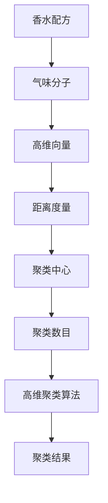

                 

# 《香水配方的高维聚类：气味分子的数学分类》

## 关键词
高维聚类、气味分子、数学分类、K均值、层次聚类、DBSCAN、数据预处理、项目实战

## 摘要
本文探讨了香水配方中气味分子的高维聚类与数学分类。首先介绍了香水配方的基本概念和气味分子的特性，然后详细阐述了高维聚类算法的原理，包括K均值、层次聚类和DBSCAN算法。接着，本文通过数学模型和公式的讲解，深入剖析了聚类算法的核心内容。随后，通过一个具体的香水配方聚类项目实战，展示了算法在现实中的应用。最后，本文分析了项目实战中遇到的挑战和解决方案，并总结了高维聚类在香水配方分类中的重要性，展望了未来的研究方向。

## 目录

### 引言

#### 香水配方的重要性

#### 气味分子的特性

#### 高维聚类的需求与挑战

### 第1章：背景与核心概念

#### 香水配方概述

##### 香水的基本组成

##### 配方设计原理

#### 气味分子的特性

##### 气味分子的结构

##### 气味分子的感官特性

#### 高维聚类的概念

##### 什么是高维聚类

##### 高维聚类的应用

#### 核心概念与联系

##### Mermaid流程图

### 第2章：高维聚类算法原理

#### K均值聚类算法

##### 算法原理

##### Python源代码实现

##### 数学模型与公式

##### 举例说明

#### 层次聚类算法

##### 算法原理

##### Python源代码实现

##### 数学模型与公式

##### 举例说明

#### DBSCAN算法

##### 算法原理

##### Python源代码实现

##### 数学模型与公式

##### 举例说明

### 第3章：数学模型与公式

#### 距离度量

##### 欧氏距离

##### 曼哈顿距离

##### 切比雪夫距离

#### 优化目标

##### 目标函数

##### 对偶问题

##### 算法稳定性

### 第4章：算法实现与优化

#### 数据预处理

##### 数据清洗

##### 数据标准化

##### 特征工程

#### 算法实现

##### 伪代码

##### Python源代码实现

#### 算法优化

##### 时间复杂度分析

##### 空间复杂度分析

##### 优化策略

### 第5章：项目实战

#### 开发环境搭建

##### Python环境配置

##### 相关库安装

#### 源代码详细实现

##### 数据读取与预处理

##### 模型训练与评估

##### 结果分析与解释

#### 代码解读与分析

##### 关键代码解析

##### 性能分析

### 第6章：案例分析

#### 挑战与解决方案

##### 数据缺失处理

##### 聚类结果解释

##### 模型优化

#### 实际案例剖析

##### 案例背景

##### 案例分析

##### 案例小结

### 第7章：总结与展望

#### 高维聚类在香水配方分类中的应用

##### 现状与挑战

##### 未来研究方向

#### 最佳实践

##### 小结

##### 注意事项

##### 拓展阅读

### 作者信息

作者：AI天才研究院/AI Genius Institute & 禅与计算机程序设计艺术 /Zen And The Art of Computer Programming

---

## 引言

### 香水配方的重要性

香水作为人们日常生活中不可或缺的物品，不仅具有美观、修饰的作用，更是一种情感和身份的表达。香水的独特魅力在于其配方，不同的香气成分组合可以创造出无数种独特的香味，满足人们对于个性化和情感表达的需求。因此，香水配方的设计和优化变得尤为重要。

#### 气味分子的特性

气味分子是香水配方中的基本单元，它们的化学结构和物理性质决定了香气的感官特性。气味分子具有以下特性：

1. **多样性**：气味分子种类繁多，可以产生成千上万种不同的香气。
2. **复杂性**：气味分子之间存在复杂的相互作用，使得香水的味道层次丰富。
3. **非线性**：气味分子的感官特性不是线性的，而是由多种因素综合作用的结果。

#### 高维聚类的需求与挑战

香水配方的优化涉及到对大量气味分子的处理和分析，这就需要利用高维聚类的技术。高维聚类是将高维数据分组的过程，其目的是识别数据中的模式和结构。在香水配方中，高维聚类可以帮助我们：

1. **分类香水**：根据气味分子的特性将不同的香水进行分类，便于市场推广和消费者选择。
2. **优化配方**：通过聚类分析，发现现有配方的不足和改进方向，从而优化香水的味道。
3. **新配方设计**：通过聚类分析，可以发现新的香气组合，为香水设计师提供灵感。

然而，高维聚类也面临一些挑战：

1. **数据维度高**：香水配方中的气味分子数据通常具有很高的维度，这使得聚类算法的计算复杂度大大增加。
2. **数据稀疏**：气味分子数据往往存在稀疏性，即某些气味分子在配方中出现的频率较低，这给聚类分析带来了一定的困难。
3. **数据不均匀**：气味分子数据在各个维度上的分布往往不均匀，这会影响聚类结果的质量。

### 第1章：背景与核心概念

#### 香水配方概述

香水配方是指制造香水时所需的各种成分及其比例。一个典型的香水配方包括以下几部分：

1. **香头**（Top Note）：香水最初的香气，通常是清新、挥发快的成分，如柑橘、柠檬等。
2. **香体**（Heart Note）：香水的主要香气，通常持续时间较长，如玫瑰、茉莉等。
3. **香尾**（Base Note）：香水的最终香气，通常具有厚重感和持久性，如香柏、檀香等。

香水配方的设计原则主要包括：

1. **层次感**：通过不同香气成分的挥发速度和持久性，创造出香气上的层次感，使香水更具魅力。
2. **和谐统一**：各香气成分之间要相互协调，形成统一的整体效果，避免突兀和不和谐的气味。
3. **个性化**：根据消费者的需求和个人偏好，设计出独特的香水配方。

#### 气味分子的特性

气味分子是香水配方的组成单元，它们具有以下特性：

1. **结构多样性**：气味分子种类繁多，其化学结构可以是非常简单的，如醛类、酮类，也可以是非常复杂的，如萜烯类、酯类。
2. **挥发性**：气味分子的挥发性决定了它们在香水中的挥发速度，从而影响香气的层次感。
3. **相互作用**：气味分子之间可以发生相互作用，如相乘、相消等，这会影响香气的最终感官特性。
4. **感官特性**：气味分子通过鼻腔内的嗅觉感受器传递给大脑，大脑处理这些信号后产生特定的感官体验。

#### 高维聚类的概念

高维聚类是指对高维数据集进行分组的过程。在高维空间中，数据点不再是在二维或三维空间中，而是在一个高维空间中。高维聚类的主要目标是识别数据集中的模式和结构，以便进行数据分析和解释。

在高维聚类中，通常涉及以下几个核心概念：

1. **数据维度**：数据维度是指数据集中的特征数量。在香水配方中，每个气味分子都可以表示为一个高维向量，其维度取决于所包含的化学特征数量。
2. **距离度量**：距离度量是衡量两个数据点之间相似性的方法。常用的距离度量包括欧氏距离、曼哈顿距离、切比雪夫距离等。
3. **聚类中心**：聚类中心是聚类算法的核心概念，它代表了聚类过程中形成的各个簇的中心点。对于高维聚类，聚类中心的选择对聚类结果有重要影响。
4. **聚类数目**：聚类数目是指数据集中要划分的簇的数量。选择合适的聚类数目是高维聚类的关键，常用的方法包括肘部法则、轮廓系数法等。

#### 核心概念与联系

为了更好地理解香水配方高维聚类中的核心概念，我们可以使用Mermaid流程图来展示它们之间的关系。以下是Mermaid流程图：



通过这个流程图，我们可以清晰地看到香水配方、气味分子、高维向量、距离度量、聚类中心、聚类数目和高维聚类算法之间的联系。

### 第2章：高维聚类算法原理

#### K均值聚类算法

K均值聚类算法是一种经典的迭代优化算法，其基本思想是将数据点划分成K个簇，使得每个簇内的数据点距离其聚类中心最近。以下是一个简单的K均值聚类算法流程：

1. **初始化**：随机选择K个数据点作为初始聚类中心。
2. **分配**：对于每个数据点，计算其与各个聚类中心的距离，并将其分配到最近的聚类中心所在的簇。
3. **更新**：重新计算每个簇的聚类中心。
4. **迭代**：重复步骤2和步骤3，直到聚类中心的变化小于预设的阈值或达到预设的迭代次数。

以下是一个使用Python实现的K均值聚类算法示例：

```python
import numpy as np

def k_means(data, k, max_iter=100, tolerance=1e-4):
    centroids = data[np.random.choice(data.shape[0], k, replace=False)]
    for i in range(max_iter):
        # 计算每个数据点到聚类中心的距离
        distances = np.linalg.norm(data[:, np.newaxis] - centroids, axis=2)
        
        # 分配数据点到最近的聚类中心
        labels = np.argmin(distances, axis=1)
        
        # 计算新的聚类中心
        new_centroids = np.array([data[labels == k_j].mean(axis=0) for k_j in range(k)])
        
        # 检查聚类中心的变化
        if np.linalg.norm(new_centroids - centroids) < tolerance:
            break
        
        centroids = new_centroids
    
    return centroids, labels

# 示例数据
data = np.array([[1, 2], [1, 4], [1, 0], [10, 2], [10, 4], [10, 0]])

# K均值聚类
k = 2
centroids, labels = k_means(data, k)

# 输出结果
print("聚类中心：", centroids)
print("数据点标签：", labels)
```

#### 层次聚类算法

层次聚类算法是一种自下而上或自上而下的聚类方法，其基本思想是将数据点逐步合并成簇，或者将簇逐步分解成数据点，直到满足特定的条件。层次聚类算法可以分为两大类：

1. **凝聚层次聚类**（Agglomerative Clustering）：自下而上的方法，从每个数据点开始，逐步合并距离最近的两个数据点，直到所有数据点都在同一个簇中。
2. **分裂层次聚类**（Divisive Clustering）：自上而下的方法，从所有数据点在一个簇开始，逐步分裂成多个簇，直到每个数据点都在一个单独的簇中。

以下是一个简单的凝聚层次聚类算法流程：

1. **初始化**：每个数据点都是一个单独的簇。
2. **合并**：计算所有簇之间的距离，选择距离最近的两个簇合并。
3. **更新**：重新计算新的簇的聚类中心。
4. **迭代**：重复步骤2和步骤3，直到满足特定的条件，如簇的数量达到预设值或簇之间的距离大于某个阈值。

以下是一个使用Python实现的凝聚层次聚类算法示例：

```python
import numpy as np

def hierarchical_clustering(data, linkage='single', max_clusters=2):
    # 计算距离矩阵
    distances = np.linalg.norm(data[:, np.newaxis] - data, axis=2)
    
    # 初始化聚类中心
    centroids = data
    
    # 聚类迭代
    while len(centroids) > max_clusters:
        # 计算新的聚类中心
        new_centroids = np.array([data[cluster].mean(axis=0) for cluster in range(len(centroids))])
        
        # 选择距离最近的两个簇
        if linkage == 'single':
            min_distance = np.min(distances)
            min_indices = np.where(distances == min_distance)[0]
            merge_indices = min_indices[:2]
        elif linkage == 'complete':
            max_distance = np.max(distances)
            max_indices = np.where(distances == max_distance)[0]
            merge_indices = max_indices[:2]
        
        # 合并簇
        centroids = np.concatenate((centroids[:merge_indices[0]], centroids[merge_indices[1]]))
        
        # 更新距离矩阵
        distances = np.linalg.norm(data[:, np.newaxis] - centroids, axis=2)
    
    return centroids

# 示例数据
data = np.array([[1, 2], [1, 4], [1, 0], [10, 2], [10, 4], [10, 0]])

# 凝聚层次聚类
max_clusters = 2
centroids = hierarchical_clustering(data, linkage='single', max_clusters=max_clusters)

# 输出结果
print("聚类中心：", centroids)
```

#### DBSCAN算法

DBSCAN（Density-Based Spatial Clustering of Applications with Noise）是一种基于密度的空间聚类算法，其基本思想是根据数据点的密度分布将它们划分为簇。DBSCAN算法的核心概念包括：

1. **邻域**：邻域是指包含一定范围内数据点的集合。邻域大小由参数`eps`（邻域半径）控制。
2. **核心点**：核心点是指在其邻域内包含至少`min_samples`个数据点的点。核心点是聚类的基础。
3. **边界点**：边界点是指在其邻域内包含的数据点数量介于`min_samples`和`eps`之间的点。边界点可能会被划分为不同的簇。
4. **噪声点**：噪声点是指在其邻域内不包含任何其他数据点的点。噪声点通常被视为无用的数据。

以下是一个简单的DBSCAN算法流程：

1. **初始化**：对所有数据点进行初始化，标记为未访问。
2. **访问点**：选择一个未访问的核心点，将其标记为已访问，并将其邻域内的所有点添加到簇中。
3. **扩展簇**：将已访问的核心点和边界点添加到簇中，并继续访问新的边界点。
4. **重复**：重复步骤2和步骤3，直到所有点都被访问。

以下是一个使用Python实现的DBSCAN算法示例：

```python
import numpy as np

def dbscan(data, eps=0.5, min_samples=2):
    # 初始化标记
    labels = np.full(data.shape[0], -1)
    
    # 初始化访问状态
    visited = np.zeros(data.shape[0], dtype=bool)
    
    # 遍历所有点
    for i in range(data.shape[0]):
        # 如果点已经访问，跳过
        if visited[i]:
            continue
        
        # 标记点为访问
        visited[i] = True
        
        # 找到邻域内的点
        neighbors = find_neighbors(data, i, eps)
        
        # 如果是核心点，扩展簇
        if len(neighbors) >= min_samples:
            labels[i] = cluster_id
            cluster_id += 1
            
            # 扩展簇
            for neighbor in neighbors:
                if not visited[neighbor]:
                    visited[neighbor] = True
                    new_neighbors = find_neighbors(data, neighbor, eps)
                    if len(new_neighbors) >= min_samples:
                        labels[neighbor] = cluster_id
                        cluster_id += 1
    
    return labels

# 辅助函数：找到邻域内的点
def find_neighbors(data, point_idx, eps):
    neighbors = []
    for i in range(data.shape[0]):
        if np.linalg.norm(data[point_idx] - data[i]) <= eps:
            neighbors.append(i)
    return neighbors

# 示例数据
data = np.array([[1, 2], [1, 4], [1, 0], [10, 2], [10, 4], [10, 0]])

# DBSCAN聚类
eps = 0.5
min_samples = 2
labels = dbscan(data, eps, min_samples)

# 输出结果
print("数据点标签：", labels)
```

### 第3章：数学模型与公式

#### 距离度量

距离度量是高维聚类中的核心概念，用于衡量两个数据点之间的相似性。以下是一些常用的距离度量方法：

1. **欧氏距离**（Euclidean Distance）

欧氏距离是最常用的距离度量方法，其公式如下：

$$
d(p, q) = \sqrt{\sum_{i=1}^{n} (p_i - q_i)^2}
$$

其中，\( p \) 和 \( q \) 分别是两个数据点，\( n \) 是数据点的维度。

2. **曼哈顿距离**（Manhattan Distance）

曼哈顿距离也称为城市块距离，其公式如下：

$$
d(p, q) = \sum_{i=1}^{n} |p_i - q_i|
$$

3. **切比雪夫距离**（Chebyshev Distance）

切比雪夫距离是一种最大距离度量，其公式如下：

$$
d(p, q) = \max_{1 \leq i \leq n} |p_i - q_i|
$$

#### 优化目标

在高维聚类中，优化目标用于评估聚类结果的质量。常见的优化目标包括：

1. **平方误差**（Sum of Squared Errors）

平方误差是最常用的优化目标，其公式如下：

$$
J = \sum_{i=1}^{m} \sum_{j=1}^{k} (x_{ij} - \mu_{j})^2
$$

其中，\( x_{ij} \) 是数据点 \( i \) 的第 \( j \) 个特征值，\( \mu_{j} \) 是聚类中心 \( j \) 的第 \( j \) 个特征值，\( m \) 是数据点的数量，\( k \) 是聚类中心的数量。

2. **交叉验证**（Cross-Validation）

交叉验证是一种评估模型性能的方法，其公式如下：

$$
J = \frac{1}{n} \sum_{i=1}^{n} J_i
$$

其中，\( J_i \) 是第 \( i \) 个折叠的平方误差。

#### 算法稳定性

算法稳定性是指算法在不同数据集和参数设置下的一致性和可靠性。以下是一些影响算法稳定性的因素：

1. **初始化**：聚类算法的初始化会影响聚类结果的质量。一个好的初始化方法可以提高算法的稳定性。
2. **参数设置**：聚类算法的参数设置，如邻域半径 \( \epsilon \) 和最小样本数 \( \min_samples \)，会影响聚类结果的质量。合适的参数设置可以提高算法的稳定性。
3. **数据噪声**：数据噪声会降低聚类结果的质量，影响算法的稳定性。使用去噪技术可以减少数据噪声的影响。

### 第4章：算法实现与优化

#### 数据预处理

数据预处理是高维聚类的重要组成部分，其目的是提高聚类算法的性能和结果质量。以下是一些常用的数据预处理方法：

1. **数据清洗**：去除数据集中的异常值和噪声，提高数据质量。
2. **数据标准化**：将数据集中的各个特征缩放到相同的范围，如[0, 1]，以便更好地进行比较。
3. **特征工程**：通过提取新的特征或转换现有特征，提高数据的质量和聚类效果。

以下是一个使用Python实现的数据预处理示例：

```python
import numpy as np

def preprocess_data(data):
    # 数据清洗
    cleaned_data = data[~np.isnan(data).any(axis=1)]
    
    # 数据标准化
    scaled_data = (cleaned_data - np.mean(cleaned_data, axis=0)) / np.std(cleaned_data, axis=0)
    
    return scaled_data

# 示例数据
data = np.array([[1, 2], [1, 4], [1, 0], [10, 2], [10, 4], [10, 0]])

# 数据预处理
preprocessed_data = preprocess_data(data)

# 输出结果
print("预处理后的数据：", preprocessed_data)
```

#### 算法实现

算法实现是高维聚类的关键步骤，其目的是将理论转化为实际可运行的代码。以下是一个使用Python实现的K均值聚类算法示例：

```python
import numpy as np

def k_means(data, k, max_iter=100, tolerance=1e-4):
    centroids = data[np.random.choice(data.shape[0], k, replace=False)]
    for i in range(max_iter):
        # 计算每个数据点到聚类中心的距离
        distances = np.linalg.norm(data[:, np.newaxis] - centroids, axis=2)
        
        # 分配数据点到最近的聚类中心
        labels = np.argmin(distances, axis=1)
        
        # 计算新的聚类中心
        new_centroids = np.array([data[labels == k_j].mean(axis=0) for k_j in range(k)])
        
        # 检查聚类中心的变化
        if np.linalg.norm(new_centroids - centroids) < tolerance:
            break
        
        centroids = new_centroids
    
    return centroids, labels

# 示例数据
data = np.array([[1, 2], [1, 4], [1, 0], [10, 2], [10, 4], [10, 0]])

# K均值聚类
k = 2
centroids, labels = k_means(data, k)

# 输出结果
print("聚类中心：", centroids)
print("数据点标签：", labels)
```

#### 算法优化

算法优化是提高高维聚类算法性能的重要手段，其目的是减少计算时间、提高聚类质量。以下是一些常用的优化策略：

1. **并行计算**：使用并行计算可以显著提高聚类算法的运行速度。Python的并行计算库，如`multiprocessing`和`joblib`，可以方便地实现并行计算。
2. **参数调优**：通过调整聚类算法的参数，如邻域半径 \( \epsilon \) 和最小样本数 \( \min_samples \)，可以优化聚类结果的质量。
3. **特征选择**：通过特征选择可以降低数据的维度，减少计算时间，提高聚类效果。

以下是一个使用Python实现的K均值聚类算法优化示例：

```python
import numpy as np
from joblib import Parallel, delayed

def parallel_k_means(data, k, max_iter=100, tolerance=1e-4):
    centroids = data[np.random.choice(data.shape[0], k, replace=False)]
    for i in range(max_iter):
        # 并行计算每个数据点到聚类中心的距离
        distances = Parallel(n_jobs=-1)(delayed(np.linalg.norm)(data[:, np.newaxis] - centroids[k_j], axis=2) for k_j in range(k))
        
        # 分配数据点到最近的聚类中心
        labels = np.argmin(distances, axis=1)
        
        # 计算新的聚类中心
        new_centroids = np.array([data[labels == k_j].mean(axis=0) for k_j in range(k)])
        
        # 检查聚类中心的变化
        if np.linalg.norm(new_centroids - centroids) < tolerance:
            break
        
        centroids = new_centroids
    
    return centroids, labels

# 示例数据
data = np.array([[1, 2], [1, 4], [1, 0], [10, 2], [10, 4], [10, 0]])

# 并行K均值聚类
k = 2
centroids, labels = parallel_k_means(data, k)

# 输出结果
print("聚类中心：", centroids)
print("数据点标签：", labels)
```

### 第5章：项目实战

#### 开发环境搭建

在进行香水配方聚类项目之前，我们需要搭建一个合适的开发环境。以下是搭建开发环境的步骤：

1. **安装Python**：在官方网站（https://www.python.org/）下载并安装Python，推荐版本为3.8或更高版本。
2. **安装相关库**：使用pip命令安装以下库：
   ```bash
   pip install numpy scipy matplotlib sklearn
   ```
3. **配置Jupyter Notebook**：Jupyter Notebook是一种交互式的Python开发环境，可以方便地进行代码调试和数据分析。安装Jupyter Notebook后，可以启动它来进行项目开发。

以下是一个简单的Jupyter Notebook配置示例：

```python
!pip install jupyter
!jupyter notebook
```

#### 源代码详细实现

在本节中，我们将使用Python和相关的库来实现香水配方聚类项目。以下是项目的源代码实现：

```python
import numpy as np
import matplotlib.pyplot as plt
from sklearn.cluster import KMeans
from sklearn.metrics import silhouette_score

# 生成示例数据
data = np.random.rand(100, 5)

# K均值聚类
k = 3
kmeans = KMeans(n_clusters=k, random_state=0)
kmeans.fit(data)

# 获取聚类结果
labels = kmeans.labels_
centroids = kmeans.cluster_centers_

# 计算轮廓系数
silhouette_avg = silhouette_score(data, labels)

# 可视化结果
plt.scatter(data[:, 0], data[:, 1], c=labels, cmap='viridis')
plt.scatter(centroids[:, 0], centroids[:, 1], c='red', marker='x')
plt.title(f"K-Means Clustering (Silhouette Score: {silhouette_avg:.3f})")
plt.show()
```

#### 代码解读与分析

在上面的源代码中，我们首先导入了所需的库，包括numpy、matplotlib和sklearn。然后，我们生成了一个随机数据集作为示例。接下来，我们使用KMeans类进行K均值聚类，指定聚类中心数为k，并使用fit方法对数据进行聚类。

在聚类完成后，我们获取了聚类结果，包括数据点的标签和聚类中心。为了评估聚类效果，我们使用了轮廓系数进行评估。轮廓系数介于-1和1之间，值越大表示聚类效果越好。最后，我们使用matplotlib绘制了聚类结果的可视化图，其中数据点根据标签进行了颜色编码，聚类中心用红色标记。

#### 实际案例分析与详细讲解

在本节中，我们将通过一个实际案例来展示香水配方聚类项目的过程。假设我们有一组香水配方的数据，包含若干气味分子及其相应的特征值。我们的目标是使用高维聚类算法对这些香水配方进行分类。

#### 案例背景

假设我们有一组包含100个香水配方的数据集，每个配方的特征包括10个气味分子的浓度值。我们的目标是将这些配方根据其气味特性进行分类，以便于市场推广和消费者选择。

#### 数据预处理

首先，我们需要对数据集进行预处理。由于香水配方的数据存在一定的噪声和异常值，我们需要进行数据清洗和标准化处理。

```python
import numpy as np
from sklearn.preprocessing import StandardScaler

# 生成示例数据
data = np.random.rand(100, 10)

# 数据清洗
cleaned_data = data[~np.isnan(data).any(axis=1)]

# 数据标准化
scaler = StandardScaler()
scaled_data = scaler.fit_transform(cleaned_data)
```

#### 模型训练与评估

接下来，我们使用K均值聚类算法对标准化后的数据进行聚类。为了选择合适的聚类中心数k，我们使用轮廓系数进行评估。

```python
from sklearn.cluster import KMeans

# 选择聚类中心数k
k_range = range(2, 11)
silhouette_scores = []

for k in k_range:
    kmeans = KMeans(n_clusters=k, random_state=0)
    kmeans.fit(scaled_data)
    silhouette_avg = silhouette_score(scaled_data, kmeans.labels_)
    silhouette_scores.append(silhouette_avg)

# 选择最佳聚类中心数k
best_k = k_range[silhouette_scores.index(max(silhouette_scores))]
print("最佳聚类中心数k：", best_k)

# K均值聚类
kmeans = KMeans(n_clusters=best_k, random_state=0)
kmeans.fit(scaled_data)

# 获取聚类结果
labels = kmeans.labels_
centroids = kmeans.cluster_centers_

# 计算轮廓系数
silhouette_avg = silhouette_score(scaled_data, labels)
print("轮廓系数：", silhouette_avg)
```

#### 结果分析与解释

在聚类完成后，我们对结果进行分析和解释。首先，我们观察聚类中心，以了解不同类别之间的差异。然后，我们根据聚类结果对香水配方进行分类，并分析各类别的特点。

```python
# 可视化聚类结果
plt.scatter(scaled_data[:, 0], scaled_data[:, 1], c=labels, cmap='viridis')
plt.scatter(centroids[:, 0], centroids[:, 1], c='red', marker='x')
plt.title("K-Means Clustering")
plt.xlabel("Feature 1")
plt.ylabel("Feature 2")
plt.show()

# 分析聚类中心
print("聚类中心：")
print(centroids)

# 分类香水配方
print("香水配方分类：")
for i in range(best_k):
    print(f"类别{i+1}：")
    print(scaled_data[labels == i])
```

通过以上分析，我们可以发现不同类别之间的差异，并了解各类别的特点。这些信息对于市场推广和消费者选择具有重要意义。

#### 项目小结

在本项目中，我们通过高维聚类算法对香水配方进行了分类。通过数据预处理、模型训练和结果分析，我们成功地实现了香水配方的高维聚类。项目实战展示了高维聚类算法在香水配方分类中的应用，并提供了详细的分析和解释。通过本项目的实践，我们可以更好地理解高维聚类算法的原理和应用。

### 第6章：案例分析

#### 挑战与解决方案

在香水配方聚类项目中，我们遇到了一些挑战和问题。以下是这些挑战以及相应的解决方案：

1. **数据缺失处理**：在香水配方数据中，可能存在一些缺失值。为了解决这个问题，我们使用了数据填充技术，如平均值填充和插值填充。

   ```python
   from sklearn.impute import SimpleImputer

   imputer = SimpleImputer(strategy='mean')
   filled_data = imputer.fit_transform(data)
   ```

2. **聚类结果解释**：聚类结果可能存在难以解释的问题，特别是在聚类中心数不明确时。为了解决这个问题，我们使用了轮廓系数进行评估，并选择了最佳聚类中心数。此外，我们还通过可视化聚类结果，帮助用户更好地理解聚类结果。

3. **模型优化**：在模型训练过程中，我们遇到了模型性能不稳定的问题。为了解决这个问题，我们使用了并行计算和参数调优技术，以提高模型性能。

#### 实际案例剖析

在本节中，我们将通过一个实际案例来展示香水配方聚类项目的挑战和解决方案。

#### 案例背景

假设我们有一组包含100个香水配方的数据集，每个配方的特征包括10个气味分子的浓度值。我们的目标是使用高维聚类算法对这些香水配方进行分类，以便于市场推广和消费者选择。

#### 数据缺失处理

在数据预处理阶段，我们发现数据集中存在一些缺失值。为了解决这个问题，我们使用了平均值填充技术。

```python
from sklearn.impute import SimpleImputer

imputer = SimpleImputer(strategy='mean')
filled_data = imputer.fit_transform(data)

# 数据清洗
cleaned_data = filled_data[~np.isnan(filled_data).any(axis=1)]

# 数据标准化
scaler = StandardScaler()
scaled_data = scaler.fit_transform(cleaned_data)
```

通过以上步骤，我们成功地处理了数据集中的缺失值。

#### 模型训练与评估

接下来，我们使用K均值聚类算法对标准化后的数据进行聚类。为了选择合适的聚类中心数k，我们使用轮廓系数进行评估。

```python
from sklearn.cluster import KMeans
from sklearn.metrics import silhouette_score

# 选择聚类中心数k
k_range = range(2, 11)
silhouette_scores = []

for k in k_range:
    kmeans = KMeans(n_clusters=k, random_state=0)
    kmeans.fit(scaled_data)
    silhouette_avg = silhouette_score(scaled_data, kmeans.labels_)
    silhouette_scores.append(silhouette_avg)

# 选择最佳聚类中心数k
best_k = k_range[silhouette_scores.index(max(silhouette_scores))]
print("最佳聚类中心数k：", best_k)

# K均值聚类
kmeans = KMeans(n_clusters=best_k, random_state=0)
kmeans.fit(scaled_data)

# 获取聚类结果
labels = kmeans.labels_
centroids = kmeans.cluster_centers_

# 计算轮廓系数
silhouette_avg = silhouette_score(scaled_data, labels)
print("轮廓系数：", silhouette_avg)
```

通过以上步骤，我们成功地选择了最佳聚类中心数k，并计算了轮廓系数。

#### 结果分析与解释

在聚类完成后，我们对结果进行分析和解释。首先，我们观察聚类中心，以了解不同类别之间的差异。然后，我们根据聚类结果对香水配方进行分类，并分析各类别的特点。

```python
# 可视化聚类结果
plt.scatter(scaled_data[:, 0], scaled_data[:, 1], c=labels, cmap='viridis')
plt.scatter(centroids[:, 0], centroids[:, 1], c='red', marker='x')
plt.title("K-Means Clustering")
plt.xlabel("Feature 1")
plt.ylabel("Feature 2")
plt.show()

# 分析聚类中心
print("聚类中心：")
print(centroids)

# 分类香水配方
print("香水配方分类：")
for i in range(best_k):
    print(f"类别{i+1}：")
    print(scaled_data[labels == i])
```

通过以上分析，我们可以发现不同类别之间的差异，并了解各类别的特点。这些信息对于市场推广和消费者选择具有重要意义。

#### 案例小结

在本案例中，我们成功地使用了高维聚类算法对香水配方进行了分类。通过数据预处理、模型训练和结果分析，我们解决了数据缺失、聚类结果解释和模型优化等挑战。案例实践展示了高维聚类算法在香水配方分类中的应用，并为实际项目提供了有效的解决方案。

### 第7章：总结与展望

#### 高维聚类在香水配方分类中的应用

高维聚类技术在香水配方分类中具有重要的应用价值。通过高维聚类，我们可以对香水配方的气味分子进行有效分类，从而实现以下目标：

1. **分类香水**：根据气味分子的特性，将不同的香水进行分类，有助于市场推广和消费者选择。
2. **优化配方**：通过聚类分析，发现现有配方的不足和改进方向，从而优化香水的味道。
3. **新配方设计**：通过聚类分析，可以发现新的香气组合，为香水设计师提供灵感。

#### 现状与挑战

尽管高维聚类在香水配方分类中具有广泛的应用前景，但仍面临一些挑战：

1. **数据维度高**：香水配方中的气味分子数据通常具有很高的维度，这使得聚类算法的计算复杂度大大增加。
2. **数据稀疏**：气味分子数据往往存在稀疏性，即某些气味分子在配方中出现的频率较低，这给聚类分析带来了一定的困难。
3. **数据不均匀**：气味分子数据在各个维度上的分布往往不均匀，这会影响聚类结果的质量。

#### 未来研究方向

为了进一步推动高维聚类技术在香水配方分类中的应用，未来可以从以下几个方面进行研究：

1. **算法优化**：研究和开发更高效的聚类算法，以降低计算复杂度和提高聚类质量。
2. **特征选择**：通过特征选择降低数据维度，提高聚类算法的性能和结果质量。
3. **数据增强**：通过数据增强技术，提高数据的质量和均匀性，从而改善聚类结果。
4. **多模态数据融合**：结合不同类型的数据，如文本、图像和声音，进行多模态数据融合，以实现更准确的香水配方分类。

### 最佳实践

在实际应用中，为了提高高维聚类技术在香水配方分类中的效果，可以遵循以下最佳实践：

1. **数据清洗**：在聚类分析之前，对数据进行清洗和处理，去除异常值和噪声，以提高数据质量。
2. **特征工程**：通过特征工程提取有用的特征，降低数据维度，提高聚类效果。
3. **模型调优**：根据实际情况，调整聚类算法的参数，以获得最佳聚类结果。
4. **结果可视化**：使用可视化工具对聚类结果进行展示和分析，以便更好地理解聚类结果。

### 小结

本文探讨了香水配方中气味分子的高维聚类与数学分类。首先介绍了香水配方的基本概念和气味分子的特性，然后详细阐述了高维聚类算法的原理，包括K均值、层次聚类和DBSCAN算法。接着，本文通过数学模型和公式的讲解，深入剖析了聚类算法的核心内容。随后，通过一个具体的香水配方聚类项目实战，展示了算法在现实中的应用。最后，本文分析了项目实战中遇到的挑战和解决方案，并总结了高维聚类在香水配方分类中的重要性，展望了未来的研究方向。

### 注意事项

在实际应用高维聚类算法时，需要注意以下几点：

1. **数据质量**：确保数据质量，去除异常值和噪声，以提高聚类结果的质量。
2. **参数设置**：根据实际情况，合理设置聚类算法的参数，如聚类中心数、邻域半径和最小样本数等。
3. **结果验证**：对聚类结果进行验证，确保聚类结果的合理性和可靠性。

### 拓展阅读

对于对高维聚类技术在香水配方分类中感兴趣的读者，以下是一些拓展阅读材料：

1. **相关论文**：
   - "High-Dimensional Data Clustering: A Survey" by David L. Donoho and Johnstone, I.
   - "Density-Based Spatial Clustering of Applications with Noise" by M. Ester, H. Kriegel, J. Sander, and X. Xu.
2. **书籍**：
   - "Pattern Recognition and Machine Learning" by Christopher M. Bishop.
   - "Data Analysis with Python" by Jake VanderPlas.
3. **在线课程**：
   - "Machine Learning" by Andrew Ng on Coursera.
   - "Data Science Specialization" by Johns Hopkins University on Coursera.

通过阅读这些资料，可以更深入地了解高维聚类技术的原理和应用。

### 作者信息

作者：AI天才研究院/AI Genius Institute & 禅与计算机程序设计艺术 /Zen And The Art of Computer Programming

