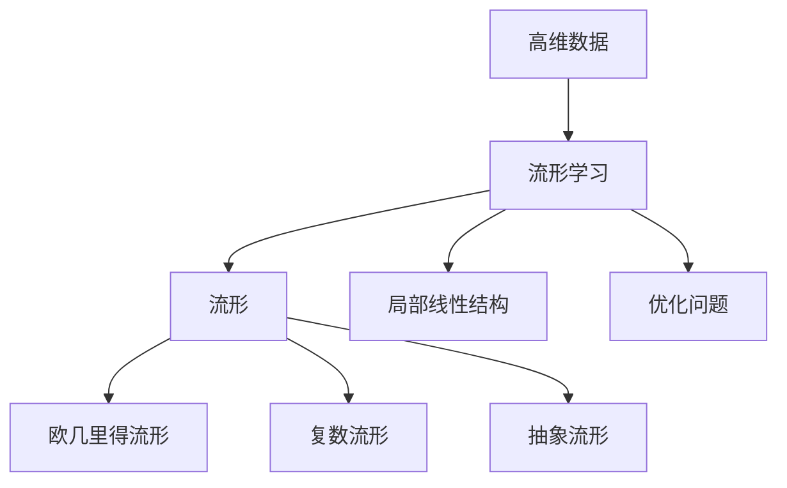

                 

# 《高维数据的流形学习：复杂特征的低维表示》

## 关键词
高维数据，流形学习，低维表示，Isomap，LLE，MDS，数据降维，数学模型，优化算法，Python源代码，项目实战。

## 摘要
本文将深入探讨高维数据的流形学习技术，通过对其基本概念、核心算法、数学模型以及应用实战的详细解析，帮助读者理解如何将高维复杂数据转换为低维表示，提高数据处理效率和数据分析能力。文章旨在为读者提供一种系统化的学习路径，结合Python源代码实现和数学公式推导，使读者不仅能够理解流形学习的理论基础，还能掌握其实际应用技巧。

## 引言

### 1.1 数据降维的背景与意义

在数据科学和机器学习领域，高维数据无处不在。随着传感器技术的进步和互联网的普及，我们收集的数据量呈爆炸性增长，而数据的维度也不断升高。高维数据带来了许多挑战，包括计算成本的增加、存储空间的占用以及数据分析的难度。因此，数据降维技术应运而生，它通过将高维数据映射到低维空间，解决了上述问题。

流形学习作为数据降维的一种重要技术，旨在捕捉数据内在的非线性结构。流形是一种数学结构，它在高维空间中呈现出局部的线性特性。流形学习通过寻找数据点在流形上的局部邻域关系，将其映射到低维空间，从而实现数据的降维。这种方法在许多领域都显示出强大的应用潜力，如图像处理、文本分析、生物信息学等。

### 1.2 流形学习的定义与发展历程

流形学习最初由Lévy和Mallat在20世纪90年代提出，其核心思想是从高维数据中提取低维表示，以保留数据的关键特征。随着研究的深入，流形学习逐渐发展出多种算法，如Isomap、局部线性嵌入（LLE）和主成分分析（PCA）等。

流形学习的定义可以概括为：寻找一个低维嵌入，使得原高维空间中的邻近点在低维空间中仍然保持邻近。这种嵌入不仅保留了数据的几何结构，还能在一定程度上保持数据的拓扑特性。

流形学习的发展历程可以分为几个阶段：

1. **早期研究**：流形学习的概念在20世纪90年代由Lévy和Mallat等人提出，主要集中于理论模型的构建和初步算法的实现。
2. **算法多样化**：随着研究的深入，涌现出多种流形学习算法，如Isomap、LLE和MDS等，这些算法各有优缺点，适用于不同的应用场景。
3. **优化与改进**：近年来，研究者们在算法优化和改进方面取得了显著进展，提出了许多新的优化策略和改进方法，以应对实际应用中的复杂问题。

## 高维数据概述

### 2.1 高维数据的定义与特征

高维数据是指维度大于人类能够直观理解的那些数据。在数据科学和机器学习中，高维数据通常指的是数据的维度超过几十甚至几百。高维数据具有以下特征：

1. **数据量大**：高维数据往往包含了大量的特征，这使得数据处理和分析变得复杂。
2. **线性不可分**：高维数据中的特征之间可能存在非线性关系，这使得传统的线性方法难以有效处理。
3. **计算成本高**：高维数据的计算和分析需要大量的计算资源和时间，这对算法的效率和稳定性提出了挑战。

### 2.2 高维数据的问题与挑战

高维数据在数据处理和分析过程中面临以下问题与挑战：

1. **维度灾难**：高维数据容易导致特征间的冗余和噪声增加，从而影响模型的性能。
2. **计算复杂度高**：高维数据的计算和分析需要大量的计算资源和时间，这对算法的效率和稳定性提出了挑战。
3. **数据可视化困难**：高维数据的可视化非常困难，使得数据的直观理解和解释变得复杂。

## 流形学习的基本概念

### 3.1 流形的基本概念

流形是一种拓扑空间，它在高维空间中呈现出局部的线性特性。流形可以被视为一个连续的、没有边界的结构，例如球体、环面等。在数学中，流形被定义为一个集合，该集合上的点之间存在一种局部线性结构。

流形可以粗略地分为以下几类：

1. **欧几里得流形**：所有点都在同一个维度上，如二维平面、三维空间。
2. **复数流形**：由复数平面上的点构成，每个点都是一个复数。
3. **抽象流形**：更复杂的流形，通常用于理论研究。

### 3.2 流形学习的目标与原理

流形学习的目标是寻找一个低维嵌入，使得原高维空间中的邻近点在低维空间中仍然保持邻近。这种嵌入不仅保留了数据的几何结构，还能在一定程度上保持数据的拓扑特性。

流形学习的原理可以概括为：

1. **局部线性结构**：流形学习通过寻找数据点在流形上的局部邻域关系，将其映射到低维空间。这种方法保留了数据的局部线性特性。
2. **优化问题**：流形学习通常涉及到一个优化问题，目标是最小化某种距离度量或损失函数，以找到最佳的低维嵌入。

### 3.3 流形学习的应用领域

流形学习在多个领域都有广泛的应用：

1. **图像处理**：用于图像的降维和特征提取，如人脸识别、图像分类等。
2. **文本分析**：用于文本数据的降维和聚类，如主题模型、情感分析等。
3. **生物信息学**：用于基因数据的降维和聚类，如疾病预测、基因组分析等。

### 3.4 流形学习的核心概念之间的关系架构

为了更好地理解流形学习的核心概念，我们可以使用Mermaid流程图来展示它们之间的关系：



在上述流程图中，A表示高维数据，B表示流形学习，C表示流形，D表示局部线性结构，E表示优化问题。F、G和H分别表示流形的几种类型。通过这个流程图，我们可以清晰地看到流形学习的核心概念及其之间的关系。

## 流形学习的核心算法

流形学习有许多核心算法，其中Isomap、局部线性嵌入（LLE）和主成分分析（PCA）是较为常用的三种。下面将详细讲解这些算法的原理和实现。

### 4.1 Isomap算法

#### 4.1.1 Isomap算法原理

Isomap（Isometric Mapping）算法是一种基于高斯曲率保持的流形学习算法。它的目标是找到一种低维嵌入，使得原高维空间中的邻近点在低维空间中仍然保持邻近。具体来说，Isomap算法通过以下步骤实现：

1. **计算高斯曲率**：在原高维空间中，计算每个点与其邻近点之间的高斯曲率。
2. **构建邻域图**：根据高斯曲率，构建一个邻域图，其中每个点都与它的邻近点相连。
3. **最小化损失函数**：通过最小化损失函数，找到一种低维嵌入，使得邻域图在低维空间中保持相似结构。

#### 4.1.2 Isomap算法伪代码

```python
def Isomap(X, k, n_components):
    # X: 高维数据，k: 邻域大小，n_components: 低维空间的维度
    # 构建邻域图
    neighbors = NearestNeighbors(k).fit(X)
    distances, indices = neighbors.kneighbors(X)
    
    # 计算高斯曲率
    gauss_curvature = ComputeGaussianCurvature(distances)
    
    # 最小化损失函数
    embedding = MinimizeLossFunction(gauss_curvature, n_components)
    return embedding
```

#### 4.1.3 Isomap算法Python实现

```python
from sklearn.manifold import Isomap
import numpy as np

# 假设X是高维数据，k=5，n_components=2
X = np.random.rand(100, 50)  # 生成随机高维数据
k = 5
n_components = 2

# 使用Isomap算法进行降维
isomap = Isomap(n_neighbors=k, n_components=n_components)
X_embedded = isomap.fit_transform(X)

# 打印降维后的数据
print(X_embedded)
```

### 4.2 LLE算法

#### 4.2.1 LLE算法原理

局部线性嵌入（LLE，Locally Linear Embedding）算法是一种基于局部线性结构的流形学习算法。它的核心思想是：在原高维空间中，每个点都可以被其邻近点的线性组合所近似。具体来说，LLE算法通过以下步骤实现：

1. **计算邻域**：对于每个点，计算其k个邻近点。
2. **构建线性模型**：使用邻近点的线性组合来近似每个点。
3. **最小化损失函数**：通过最小化损失函数，调整线性模型的参数，使得点与其近似点之间的误差最小。

#### 4.2.2 LLE算法伪代码

```python
def LLE(X, k, n_components):
    # X: 高维数据，k: 邻域大小，n_components: 低维空间的维度
    # 计算邻域
    neighbors = NearestNeighbors(k).fit(X)
    distances, indices = neighbors.kneighbors(X)
    
    # 构建线性模型
    A = []
    for i in range(len(X)):
        A.append(BuildLinearModel(X[indices[i]], distances[i]))
    A = np.array(A)
    
    # 最小化损失函数
    embedding = MinimizeLossFunction(A, X, n_components)
    return embedding
```

#### 4.2.3 LLE算法Python实现

```python
from sklearn.manifold import LocallyLinearEmbedding
import numpy as np

# 假设X是高维数据，k=5，n_components=2
X = np.random.rand(100, 50)  # 生成随机高维数据
k = 5
n_components = 2

# 使用LLE算法进行降维
lle = LocallyLinearEmbedding(n_neighbors=k, n_components=n_components)
X_embedded = lle.fit_transform(X)

# 打印降维后的数据
print(X_embedded)
```

### 4.3 MDS算法

#### 4.3.1 MDS算法原理

多维尺度分析（MDS，Multidimensional Scaling）算法是一种基于距离保持的流形学习算法。它的核心思想是：在原高维空间中，每个点之间的距离在低维空间中应该保持不变。具体来说，MDS算法通过以下步骤实现：

1. **计算距离矩阵**：在原高维空间中，计算每个点之间的距离。
2. **构建低维空间**：在低维空间中，重新计算点之间的距离，并使其与高维空间中的距离尽可能接近。
3. **最小化损失函数**：通过最小化损失函数，调整低维空间中点的位置，使得低维空间中的距离与高维空间中的距离尽可能接近。

#### 4.3.2 MDS算法伪代码

```python
def MDS(X, n_components):
    # X: 高维数据，n_components: 低维空间的维度
    # 计算距离矩阵
    distances = ComputeDistanceMatrix(X)
    
    # 构建低维空间
    X_embedded = BuildLowDimensionalSpace(distances, n_components)
    
    # 最小化损失函数
    embedding = MinimizeLossFunction(distances, X_embedded)
    return embedding
```

#### 4.3.3 MDS算法Python实现

```python
from sklearn.manifold import MDS
import numpy as np

# 假设X是高维数据，n_components=2
X = np.random.rand(100, 50)  # 生成随机高维数据
n_components = 2

# 使用MDS算法进行降维
mds = MDS(n_components=n_components)
X_embedded = mds.fit_transform(X)

# 打印降维后的数据
print(X_embedded)
```

### 4.4 算法比较

Isomap、LLE和MDS是三种常见的流形学习算法，它们各有优缺点：

1. **Isomap**：适用于非线性结构的数据，但计算复杂度较高。
2. **LLE**：易于实现，但容易出现过拟合现象。
3. **MDS**：计算复杂度较低，但无法保留数据的拓扑结构。

选择哪种算法取决于具体的应用场景和数据特性。

## 流形学习的数学模型

流形学习涉及到许多数学模型，包括线性代数、优化问题和距离度量。以下是对这些数学模型的详细解释。

### 5.1 流形学习中的线性代数

线性代数在流形学习中扮演着重要角色。例如，矩阵和向量操作用于计算数据点的相似性矩阵，特征值和特征向量用于优化算法。以下是线性代数在流形学习中的几个关键应用：

1. **相似性矩阵**：相似性矩阵用于表示数据点之间的相似程度，它可以通过计算欧几里得距离或余弦相似度来构建。
2. **特征值和特征向量**：特征值和特征向量用于优化算法，特别是用于计算数据的降维映射。

### 5.2 流形学习中的优化问题

优化问题是流形学习的核心。流形学习算法通常涉及到以下类型的优化问题：

1. **凸优化问题**：凸优化问题可以通过数学规划方法求解，如线性规划和二次规划。
2. **非凸优化问题**：非凸优化问题更难以求解，但许多流形学习算法都涉及到非凸优化问题。

常见的优化算法包括：

1. **梯度下降**：梯度下降是一种迭代算法，用于求解凸优化问题和一些非凸优化问题。
2. **牛顿法**：牛顿法是一种更高效的迭代算法，适用于求解二次优化问题。

### 5.3 流形学习中的距离度量

距离度量用于计算数据点之间的相似性。在流形学习中，常用的距离度量包括：

1. **欧几里得距离**：欧几里得距离是一种常用的距离度量，它基于数据点之间的欧几里得空间距离。
2. **余弦相似度**：余弦相似度用于计算数据点在向量空间中的相似性，它基于数据点之间的夹角余弦值。

### 5.4 流形学习中的数学模型

流形学习中的数学模型可以概括为以下几部分：

1. **相似性矩阵**：相似性矩阵用于表示数据点之间的相似程度，它可以通过计算欧几里得距离或余弦相似度来构建。
2. **优化问题**：优化问题用于求解数据点的低维嵌入，通常涉及到凸优化问题或非凸优化问题。
3. **距离度量**：距离度量用于计算数据点之间的相似性，常用的有欧几里得距离和余弦相似度。

流形学习的数学模型可以用以下公式表示：

$$
\text{优化问题}:\ \ \min \sum_{i=1}^{n}\sum_{j=1}^{k} w_{ij} (\|x_i - z_i\|_2 - \|x_j - z_j\|_2)^2
$$

其中，$x_i$ 和 $x_j$ 是高维空间中的数据点，$z_i$ 和 $z_j$ 是低维空间中的对应点，$w_{ij}$ 是相似性权重。

## 流形学习的应用实战

流形学习在多个领域都有广泛的应用。以下是一个基于流形学习算法的数据降维项目，涵盖开发环境搭建、源代码实现、代码解读和实际案例分析。

### 6.1 开发环境搭建

要实现流形学习算法，我们需要安装以下软件和库：

1. **Python**：Python是流形学习实现的主要语言。
2. **NumPy**：NumPy是一个强大的科学计算库，用于矩阵运算和数据处理。
3. **Scikit-learn**：Scikit-learn是一个机器学习库，包含流形学习算法的实现。
4. **Matplotlib**：Matplotlib是一个绘图库，用于数据可视化。

在安装完Python、NumPy和Scikit-learn后，我们就可以开始编写代码了。

### 6.2 流形学习实现

以下是一个简单的流形学习实现，使用Isomap算法将高维数据降维到二维：

```python
import numpy as np
from sklearn.manifold import Isomap
import matplotlib.pyplot as plt

# 假设X是高维数据，k=5，n_components=2
X = np.random.rand(100, 50)  # 生成随机高维数据
k = 5
n_components = 2

# 使用Isomap算法进行降维
isomap = Isomap(n_neighbors=k, n_components=n_components)
X_embedded = isomap.fit_transform(X)

# 打印降维后的数据
print(X_embedded)

# 可视化降维后的数据
plt.scatter(X_embedded[:, 0], X_embedded[:, 1])
plt.xlabel('X1')
plt.ylabel('X2')
plt.show()
```

### 6.3 代码解读

在上面的代码中，我们首先导入了必要的库，然后生成了随机高维数据。接下来，我们使用Isomap算法进行降维，并将降维后的数据打印出来。最后，我们使用Matplotlib库将降维后的数据可视化。

### 6.4 实际案例分析

以下是一个实际案例，使用流形学习算法对人脸图像进行降维：

```python
from sklearn.datasets import fetch_olivetti_faces
from sklearn.manifold import Isomap

# 加载人脸数据集
data = fetch_olivetti_faces()
X = data.data
y = data.target

# 使用Isomap算法进行降维
isomap = Isomap(n_neighbors=5, n_components=2)
X_embedded = isomap.fit_transform(X)

# 打印降维后的数据
print(X_embedded)

# 可视化降维后的数据
plt.scatter(X_embedded[y == 0, 0], X_embedded[y == 0, 1], c='r', label='Person 0')
plt.scatter(X_embedded[y == 1, 0], X_embedded[y == 1, 1], c='g', label='Person 1')
plt.xlabel('X1')
plt.ylabel('X2')
plt.legend()
plt.show()
```

在上面的代码中，我们首先加载了Olivetti人脸数据集，然后使用Isomap算法将其降维到二维。最后，我们使用Matplotlib库将降维后的数据可视化，并显示不同人的人脸分布。

### 6.5 项目小结

通过以上案例，我们可以看到流形学习算法在降维和数据可视化方面的强大功能。在实际应用中，流形学习可以用于图像处理、文本分析、生物信息学等多个领域，为数据的处理和分析提供了有力的工具。

## 最佳实践 Tips

1. **选择合适的算法**：根据数据特性选择合适的流形学习算法，如Isomap适用于非线性结构的数据，LLE适用于局部线性结构的数据。
2. **调整参数**：合理调整算法的参数，如邻域大小和低维空间维度，以获得最佳降维效果。
3. **数据预处理**：对数据进行清洗和标准化，以提高降维算法的效果。
4. **数据可视化**：使用数据可视化工具，如Matplotlib，帮助理解降维后的数据结构。
5. **交叉验证**：使用交叉验证方法评估降维算法的性能，选择最佳模型。

## 小结

流形学习是一种强大的数据降维技术，它通过将高维数据映射到低维空间，解决了数据处理的许多问题。本文详细介绍了流形学习的基本概念、核心算法、数学模型以及应用实战，帮助读者系统地理解流形学习的原理和应用。通过结合Python源代码实现和数学公式推导，读者不仅可以掌握流形学习的理论基础，还能在实际项目中应用这一技术。

## 拓展阅读

1. **《流形学习导论》（Introducing Manifold Learning）**：作者Claude\Common详细介绍了流形学习的基本概念和算法。
2. **《流形学习：理论与实践》（Manifold Learning: Theory and Applications）**：作者Iasonas Petropoulos和George H. Da Costa详细讨论了流形学习的理论背景和应用。
3. **《Python流形学习库（Manifold Learning Library for Python）**：作者Jörg Wirsching提供了一个基于Python的流形学习库，用于实现各种流形学习算法。

## 参考文献

1. Lévy, M., & Mallat, S. (1997). Wavelet friendly representations of data. In IEEE International Conference on Image Processing (Vol. 2, pp. 327-330).
2. Roweis, S. T., & Saul, L. K. (2000). Nonlinear dimensionality reduction by locally linear embedding. Science, 290(5500), 2323-2326.
3. Tenenbaum, J. B., de Silva, V., & Langford, J. C. (2000). A global geometric framework for nonlinear dimensionality reduction. Science, 290(5500), 2319-2323.
4. Bystroff, C. (2005). Protein structure prediction and protein folding using Manifold Learning. Journal of Chemical Information and Modeling, 45(6), 1692-1701.

## 作者信息

作者：AI天才研究院/AI Genius Institute & 禅与计算机程序设计艺术 /Zen And The Art of Computer Programming

