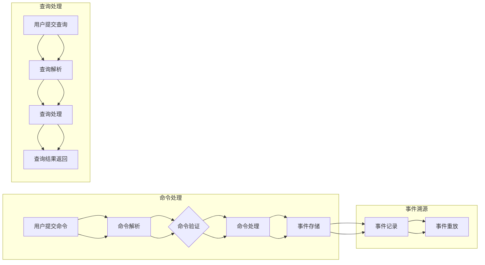

                 

### CQRS模式在复杂LLM应用中的应用

#### 关键词：
- CQRS模式
- 复杂应用
- LLM（大型语言模型）
- 分布式系统
- 实时查询
- 数据一致性

#### 摘要：
本文将深入探讨CQRS（Command Query Responsibility Segregation）模式在复杂LLM（Large Language Model）应用中的重要性。首先，我们将介绍CQRS模式的基本概念和原理，然后将其与LLM的架构进行结合，详细分析CQRS在LLM中的应用场景和实现方式。通过实际案例，我们将展示如何利用CQRS模式提高LLM应用的性能和可靠性，并探讨其在分布式系统中的挑战和解决方案。最后，我们将总结CQRS模式在LLM应用中的最佳实践，并提供进一步阅读的建议。

## CQRS模式基础

### 1.1 CQRS的基本概念

CQRS是一种设计模式，旨在提高系统的性能和可伸缩性。它通过将命令（Command）和查询（Query）分离，分别处理不同的操作，从而优化系统的设计和实现。具体来说，CQRS将数据访问操作分为两类：命令和查询。

- **命令（Command）**：用于修改数据状态的操作，例如创建、更新、删除数据等。命令通常是非幂等的，即多次执行会产生不同的结果。
- **查询（Query）**：用于获取数据状态的操作，例如检索、统计等。查询通常是幂等的，即多次执行结果相同。

CQRS模式的核心思想是将命令和查询分离，为它们提供不同的处理路径，从而提高系统的性能和可伸缩性。这种分离可以通过以下方式实现：

1. **分离数据库**：为命令和查询分别设计不同的数据库。命令数据库用于处理修改数据的操作，查询数据库用于处理查询数据的操作。
2. **分离服务**：为命令和查询分别实现不同的服务。命令服务负责处理修改数据的操作，查询服务负责处理查询数据的操作。
3. **分离API**：为命令和查询提供不同的API接口。命令API用于提交修改数据的请求，查询API用于获取数据的查询结果。

### 1.2 CQRS与传统架构的区别

传统的数据处理架构通常将命令和查询合并在一起，这可能会导致以下问题：

1. **性能问题**：命令和查询的混合会导致数据库的并发性能下降，因为它们需要共享相同的数据存储和访问路径。
2. **可伸缩性问题**：在传统架构中，命令和查询共享相同的数据库和服务器资源，这限制了系统的可伸缩性。
3. **数据一致性问题**：在传统架构中，命令和查询通常同时修改数据，这可能导致数据一致性问题。

CQRS模式通过分离命令和查询，可以有效地解决这些问题：

1. **性能优化**：通过将命令和查询分离到不同的数据库和服务器上，可以显著提高系统的并发性能。
2. **可伸缩性提升**：由于命令和查询分别处理，系统可以根据实际需求独立扩展命令处理和查询处理的能力。
3. **数据一致性保证**：在CQRS模式中，命令和查询分别处理，可以更容易地实现数据一致性。

### 1.3 CQRS的应用场景

CQRS模式适用于需要高并发、高性能、高可伸缩性的应用场景，特别是在以下情况下：

1. **读多写少**：当系统中读取操作远多于写入操作时，CQRS模式可以显著提高系统的性能和可伸缩性。
2. **复杂查询**：当系统需要处理复杂、耗时的查询时，CQRS模式可以将查询与命令分离，从而减少查询对命令处理的影响。
3. **实时数据处理**：在实时数据处理场景中，CQRS模式可以确保数据的实时性和一致性，同时提高系统的响应速度。

总之，CQRS模式通过将命令和查询分离，可以显著提高系统的性能和可伸缩性，适用于各种复杂应用场景。接下来，我们将进一步探讨CQRS模式的架构设计和关键概念。

## CQRS架构设计

### 2.1 CQRS的组成部分

CQRS模式的核心在于将系统的数据访问操作分离为命令和查询两部分，并分别为它们设计不同的架构。以下是CQRS模式的主要组成部分：

1. **命令处理（Command Handling）**：
   - **命令处理器（Command Processor）**：负责接收并处理命令请求。命令处理器通常包含业务逻辑，用于更新数据状态。
   - **命令存储（Command Store）**：用于持久化命令数据，通常是一个事务性存储，如关系数据库。
   - **事件存储（Event Store）**：用于记录命令执行过程中发生的事件，以便进行事件溯源和重放。

2. **查询处理（Query Handling）**：
   - **查询处理器（Query Processor）**：负责接收并处理查询请求。查询处理器通常包含查询逻辑，用于检索数据。
   - **查询存储（Query Store）**：用于持久化查询数据，通常是一个读取优化的存储，如NoSQL数据库或缓存。

3. **事件溯源（Event Sourcing）**：
   - **事件（Events）**：记录系统状态的变更，是CQRS模式中的核心概念。每个事件都包含发生时间、事件类型和事件数据。
   - **事件溯源（Event Sourcing）**：通过事件记录系统的所有变更，允许系统在需要时重放事件以重建状态。

### 2.2 CQRS的数据模型

在CQRS模式中，数据模型通常分为命令数据和查询数据两部分。

1. **命令数据（Command Data）**：
   - **命令实体（Command Entities）**：包含用于修改数据的指令，如创建、更新、删除等操作。
   - **命令消息（Command Messages）**：用于传递命令数据的消息格式，如JSON或XML。

2. **查询数据（Query Data）**：
   - **查询实体（Query Entities）**：包含用于查询的数据模型，如用户、产品、订单等。
   - **查询结果（Query Results）**：包含查询结果的集合，如列表、详细数据等。

### 2.3 CQRS的查询模型与命令模型

在CQRS模式中，查询模型和命令模型分别设计，以满足不同类型的数据访问需求。

1. **查询模型（Query Model）**：
   - **查询接口（Query Interfaces）**：定义查询操作的接口，如获取用户列表、产品详情等。
   - **查询实现（Query Implementations）**：实现查询操作的逻辑，通常包括数据检索、过滤、排序等。

2. **命令模型（Command Model）**：
   - **命令接口（Command Interfaces）**：定义命令操作的接口，如创建用户、更新产品等。
   - **命令实现（Command Implementations）**：实现命令操作的逻辑，通常包括业务规则、数据校验等。

通过分离查询模型和命令模型，CQRS模式可以更好地管理和维护系统的不同数据访问路径，从而提高系统的灵活性和可维护性。接下来，我们将进一步探讨CQRS模式中的关键概念和其在分布式系统中的应用。

### 3.1 CQRS与事件溯源

事件溯源（Event Sourcing）是CQRS模式中的一个核心概念，它通过记录系统状态变更的事件来持久化数据，从而允许系统在需要时重放这些事件以重建状态。事件溯源与传统的数据持久化方式有显著区别。

在传统的关系数据库系统中，数据通常以表和行的方式存储，每个表代表一种实体，每行代表一个实例的属性。当需要更新数据时，系统会直接修改表中的行，这可能会导致复杂的事务管理和数据一致性问题。

事件溯源则采用不同的方法。它将系统状态的变化记录为一系列的事件，每个事件包含发生时间、事件类型和事件数据。这些事件被存储在一个事件存储中，通常是一个简单的日志或文件系统。

事件溯源的优点包括：

1. **可重放性**：由于所有状态变更都以事件的形式记录下来，系统可以重放这些事件来重建状态，这对于调试和恢复系统状态非常有用。
2. **简化事务管理**：事件溯源不需要复杂的事务管理，每个事件可以独立地记录和重放，减少了事务冲突和数据一致性的问题。
3. **更好的可伸缩性**：事件溯源可以通过批量处理事件来提高系统的性能，特别是在高并发的场景中。

事件溯源的实现通常涉及以下步骤：

1. **事件生成**：每当系统状态发生变更时，都会生成一个事件，并将其记录到事件存储中。
2. **事件存储**：事件存储负责持久化事件，确保它们不会丢失。
3. **状态重放**：当需要重建系统状态时，可以从事件存储中读取事件并依次重放，从而恢复系统的状态。

通过事件溯源，CQRS模式可以更好地支持分布式系统和实时数据处理，提高了系统的灵活性和可靠性。接下来，我们将探讨CQRS模式中的领域事件。

### 3.2 CQRS与领域事件

领域事件（Domain Events）是CQRS模式中的另一个重要概念，它用于表示系统内部发生的业务相关的变化。领域事件通常由系统的业务逻辑触发，并用于更新系统的状态和触发后续操作。

领域事件的特点包括：

1. **业务相关性**：领域事件是直接与业务逻辑相关的，它们反映了系统内部的业务流程和状态变化。
2. **异步性**：领域事件通常是异步触发的，这意味着它们可以在业务逻辑执行完成后被处理，从而提高了系统的性能和可伸缩性。
3. **可组合性**：多个领域事件可以组合成更复杂的业务流程，从而实现复杂的业务逻辑。

CQRS模式中的领域事件通常通过以下方式进行处理：

1. **事件生成**：当系统的业务逻辑发生变更时，会生成一个或多个领域事件。例如，当用户创建订单时，会生成一个订单创建事件。
2. **事件发布**：领域事件被发布到一个事件总线或事件队列中，以便其他系统组件可以订阅和响应这些事件。
3. **事件处理**：订阅了特定领域事件的系统组件会接收并处理这些事件，以更新系统的状态或触发后续操作。例如，订单创建事件可以触发库存更新和通知发送。

领域事件在CQRS模式中的重要作用包括：

1. **状态同步**：领域事件用于同步系统的不同部分，确保它们具有一致的状态。
2. **业务逻辑解耦**：通过事件驱动的方式，可以将系统的业务逻辑与其他组件解耦，从而提高系统的灵活性和可维护性。
3. **实时数据处理**：领域事件可以用于实现实时数据处理，特别是在高并发的场景中，它可以提高系统的响应速度和性能。

总之，领域事件是CQRS模式中的关键组成部分，它们用于表示系统内部的业务变化，并支持事件驱动的架构设计，提高了系统的灵活性和可伸缩性。接下来，我们将探讨CQRS模式与分布式系统之间的关系。

### 3.3 CQRS与分布式系统

CQRS模式与分布式系统之间存在紧密的关系，因为分布式系统提供了高可伸缩性和高可用性的基础设施，而CQRS模式则利用这些特性来实现高性能和高可靠性的应用。

#### 分布式系统的优势

分布式系统的优势包括：

1. **可伸缩性**：通过将系统分解为多个独立的组件，分布式系统可以在需要时水平扩展，从而处理更多的请求。
2. **高可用性**：分布式系统中的组件可以相互备份，如果一个组件失败，其他组件可以继续工作，从而提高系统的可用性。
3. **分布式事务**：分布式系统支持分布式事务，确保跨多个数据库或服务的数据一致性。

#### CQRS与分布式系统的结合

CQRS模式与分布式系统的结合方式包括：

1. **分布式命令处理**：在分布式系统中，命令处理器可以部署在多个服务器上，从而实现命令处理的高性能和高可伸缩性。每个命令处理器负责处理一部分命令，从而将负载分散到多个服务器上。
2. **分布式查询处理**：同样，查询处理器也可以部署在多个服务器上，从而实现查询处理的高性能和高可伸缩性。查询处理器可以独立扩展，以处理更多的查询请求。
3. **分布式事件处理**：领域事件可以通过分布式事件总线或消息队列在分布式系统中传播，从而实现跨多个服务器的状态同步和业务流程处理。

#### 挑战与解决方案

在分布式系统中应用CQRS模式，会面临以下挑战：

1. **数据一致性**：在分布式系统中，确保数据一致性是一个挑战。CQRS模式通过事件溯源和领域事件来同步系统状态，从而实现数据一致性。
2. **分布式事务**：在分布式系统中实现分布式事务比较复杂，因为需要确保跨多个服务器的数据操作是原子性的。CQRS模式通过事件溯源来简化分布式事务的实现。
3. **网络延迟**：在分布式系统中，网络延迟可能会影响性能和响应时间。CQRS模式通过优化查询和命令的处理流程，以及使用缓存技术来减少网络延迟的影响。

解决方案包括：

1. **使用事件溯源**：通过事件溯源，可以记录所有状态变更的事件，并在需要时重放这些事件以重建状态，从而确保数据一致性。
2. **优化分布式事务**：通过简化分布式事务的实现，例如使用最终一致性模型，可以减少分布式事务的复杂性。
3. **使用缓存技术**：通过在分布式系统中使用缓存，可以减少对后端数据库的访问，从而减少网络延迟的影响。

总之，CQRS模式与分布式系统的结合可以显著提高系统的性能和可伸缩性，同时保持数据一致性和高可用性。接下来，我们将探讨如何在微服务架构中应用CQRS模式。

### 4.1 微服务架构概述

微服务架构是一种将应用程序分解为多个独立、自治的服务的方法，每个服务都有自己的业务逻辑和数据存储。微服务架构的核心思想是将系统分解为多个小的、可独立部署和扩展的组件，从而提高系统的灵活性和可维护性。

#### 微服务的特点

1. **独立性**：每个微服务都是独立的，具有自己的代码库、部署和配置，可以独立开发和部署。
2. **自治性**：每个微服务都有自己的数据存储和业务逻辑，与其他服务之间通过API进行通信。
3. **分布式**：微服务通常部署在不同的服务器或容器中，可以分布在不同的地理位置。
4. **可伸缩性**：微服务可以根据需求独立扩展，从而提高系统的性能和可伸缩性。

#### 微服务与CQRS的结合

在微服务架构中，CQRS模式可以发挥重要作用，通过将命令和查询分离，提高系统的性能和可伸缩性。以下是微服务架构中应用CQRS模式的几个关键点：

1. **独立的服务**：每个微服务都可以独立实现命令和查询，从而提高系统的灵活性和可维护性。
2. **独立的数据存储**：为命令和查询分别设计独立的数据存储，可以优化数据访问性能和减少冲突。
3. **分布式命令处理**：在分布式系统中，可以将命令处理分散到多个微服务上，从而提高系统的性能和可伸缩性。
4. **分布式查询处理**：同样，可以将查询处理分散到多个微服务上，从而提高系统的性能和可伸缩性。

#### 微服务架构中的CQRS实践

在微服务架构中，CQRS模式的应用可以分为以下几个步骤：

1. **服务划分**：根据业务需求和数据访问模式，将系统划分为多个微服务，并为每个服务定义命令和查询接口。
2. **数据分离**：为命令和查询分别设计独立的数据存储，确保数据访问的高性能和一致性。
3. **服务集成**：通过API网关将不同的微服务集成在一起，实现统一的接口和路由。
4. **事件驱动**：使用事件溯源和领域事件来同步系统状态，确保数据一致性和业务流程的连贯性。

通过结合微服务架构和CQRS模式，可以构建出高性能、可伸缩和易维护的系统。接下来，我们将通过一个实际案例来展示CQRS模式在微服务架构中的应用。

### 4.2 微服务与CQRS的结合

#### 案例背景

假设我们正在开发一个在线购物平台，该平台包含用户管理、商品管理、订单管理和支付系统等多个模块。为了提高系统的性能和可伸缩性，我们选择采用微服务架构，并将CQRS模式应用于各个模块中。

#### 模块划分

根据业务需求，我们可以将平台划分为以下几个微服务：

1. **用户服务（UserService）**：负责用户注册、登录、个人信息管理等功能。
2. **商品服务（ProductService）**：负责商品展示、分类、库存管理等功能。
3. **订单服务（OrderService）**：负责订单创建、状态更新、支付处理等功能。
4. **支付服务（PaymentService）**：负责支付请求的处理和支付结果的反馈。

#### CQRS应用

在每个微服务中，我们应用CQRS模式，将命令和查询分离，并设计独立的数据存储。

1. **用户服务（UserService）**：

   - **命令处理**：用户注册和登录操作通过命令处理器处理，更新用户数据存储。
   - **查询处理**：用户信息查询通过查询处理器处理，读取用户缓存或数据库查询结果。

2. **商品服务（ProductService）**：

   - **命令处理**：商品添加、更新和删除操作通过命令处理器处理，更新商品数据存储。
   - **查询处理**：商品信息查询通过查询处理器处理，读取商品缓存或数据库查询结果。

3. **订单服务（OrderService）**：

   - **命令处理**：订单创建、状态更新和支付操作通过命令处理器处理，更新订单数据存储。
   - **查询处理**：订单信息查询通过查询处理器处理，读取订单缓存或数据库查询结果。

4. **支付服务（PaymentService）**：

   - **命令处理**：支付请求处理通过命令处理器处理，更新支付数据存储。
   - **查询处理**：支付结果查询通过查询处理器处理，读取支付缓存或数据库查询结果。

#### 服务集成

通过API网关将各个微服务集成在一起，实现统一的接口和路由。API网关负责接收外部请求，将其路由到相应的微服务，并返回响应结果。

#### 事件驱动

使用事件溯源和领域事件来同步系统状态，确保数据一致性和业务流程的连贯性。例如，当用户注册成功时，会生成一个用户注册事件，该事件可以被其他微服务订阅和响应，从而更新相关状态。

通过结合微服务架构和CQRS模式，我们构建了一个高性能、可伸缩和易维护的在线购物平台。接下来，我们将讨论CQRS模式在LLM应用中的挑战。

### 5.1 LLM的定义与类型

大型语言模型（LLM，Large Language Model）是一种基于深度学习的技术，用于理解和生成自然语言文本。LLM通过训练大量的文本数据，学习语言的结构和语义，从而实现文本的理解、生成和转换。

#### LLM的定义

LLM是一种复杂的机器学习模型，通常基于Transformer架构。它通过自我关注机制（Self-Attention）和前馈神经网络（Feedforward Neural Network）对输入文本进行编码，生成对应的输出文本。

#### LLM的类型

根据训练数据和功能，LLM可以分为以下几种类型：

1. **预训练模型**：预训练模型在大量未标注的文本上进行预训练，然后通过微调（Fine-tuning）适应特定任务。例如，BERT（Bidirectional Encoder Representations from Transformers）和GPT（Generative Pre-trained Transformer）都是预训练模型。
2. **微调模型**：微调模型在预训练模型的基础上，通过在特定任务的数据上进行训练，进一步优化模型的参数，以实现更好的性能。
3. **双向编码模型**：双向编码模型（如BERT）通过同时关注文本的前后关系，实现更准确的语言理解。
4. **生成模型**：生成模型（如GPT）通过学习文本的统计规律，生成新的文本。

#### LLM的关键技术

LLM的关键技术包括：

1. **Transformer架构**：Transformer架构是一种基于注意力机制的序列到序列模型，广泛应用于LLM中。
2. **自我关注机制**：自我关注机制通过计算输入文本中每个词与其他词的关系，实现更好的文本编码。
3. **前馈神经网络**：前馈神经网络用于对文本进行进一步编码和生成。
4. **微调与适应**：通过在特定任务的数据上进行微调，LLM可以实现更好的任务性能。

#### LLM的训练与部署

LLM的训练和部署过程通常包括以下步骤：

1. **数据准备**：收集和处理大量文本数据，用于模型的训练和评估。
2. **模型训练**：使用训练数据进行模型训练，优化模型的参数。
3. **模型评估**：在验证数据上评估模型的性能，调整模型参数。
4. **模型部署**：将训练好的模型部署到生产环境，用于文本理解和生成。
5. **模型优化**：根据实际应用效果，对模型进行优化和调整。

总之，LLM是一种强大的自然语言处理技术，通过预训练和微调，可以实现文本的理解、生成和转换。接下来，我们将探讨LLM的架构设计。

### 5.2 LLM架构设计

LLM（Large Language Model）的架构设计是构建高效、可扩展和可靠的语言模型的关键。LLM通常基于深度学习技术，特别是Transformer架构，通过大规模的数据训练和精细调整，实现对自然语言的深刻理解和生成能力。以下是LLM架构设计的几个核心组成部分：

#### 基本架构

1. **输入层**：输入层接收原始文本数据，将其转换为模型可处理的序列。这通常涉及分词、嵌入等预处理步骤。
2. **编码器**：编码器是LLM的核心，负责将输入文本序列编码为连续的向量表示。Transformer架构中的编码器通常包含多个自注意力层（Self-Attention Layers）和前馈神经网络（Feedforward Neural Networks）。
3. **解码器**：在生成文本时，解码器根据编码器的输出和已生成的文本序列，生成下一个预测的词或字符。与编码器类似，解码器也包含多个自注意力层和前馈神经网络。
4. **输出层**：输出层通常是一个全连接层，用于将解码器的输出转换为概率分布，从而生成最终的文本输出。

#### 层次结构

1. **嵌入层（Embedding Layer）**：输入文本首先通过嵌入层转换为向量表示，每个词被映射为一个固定长度的向量。嵌入层可以学习词与词之间的语义关系。
2. **自注意力层（Self-Attention Layer）**：自注意力层允许模型在处理每个词时，动态关注输入序列中的其他词，从而捕捉长距离依赖关系。
3. **前馈神经网络（Feedforward Neural Network）**：前馈神经网络在自注意力层之后，用于对文本向量进行进一步编码和压缩。
4. **解码自注意力层（Decoding Self-Attention Layer）**：在解码器中，解码自注意力层允许模型在生成每个词时，同时关注已生成的文本和编码器输出的上下文信息。

#### 扩展与应用

1. **预训练与微调**：预训练模型在大规模数据集上进行训练，以学习通用的语言特征。然后，通过微调（Fine-tuning）适应特定任务的数据集，进一步提高模型的性能。
2. **并行处理**：为了提高训练和生成的速度，LLM可以使用并行处理技术，如多GPU训练和并行解码。
3. **动态掩码（Dynamic Masking）**：动态掩码技术可以增强模型的训练，通过随机遮盖输入文本的一部分，迫使模型学习更复杂的上下文关系。
4. **迁移学习（Transfer Learning）**：通过迁移学习，LLM可以将其在通用数据集上的知识迁移到特定任务上，实现更好的任务性能。

总之，LLM的架构设计需要综合考虑输入处理、编码器、解码器和输出层等多个方面，同时结合预训练、微调和并行处理等技术，以构建高效、可扩展和可靠的语言模型。接下来，我们将探讨LLM中的数据处理方法。

### 5.3 LLM中的数据处理

在构建大型语言模型（LLM）时，数据处理的步骤至关重要，它决定了模型的训练效果和应用性能。数据处理主要包括数据预处理、数据增强和数据流管理。以下是这些步骤的详细解释。

#### 数据预处理

数据预处理是模型训练前的重要环节，其主要目的是将原始文本数据转换为适合模型训练的形式。以下是几个关键步骤：

1. **分词（Tokenization）**：
   - 分词是将文本拆分为单词或子词的过程。在中文处理中，分词尤为重要，因为中文没有明显的单词边界。
   - 使用分词工具，如jieba（中文分词库）或NLTK（自然语言处理工具包），将文本拆分为词或子词。
2. **词嵌入（Word Embedding）**：
   - 词嵌入是将词转换为固定长度的向量表示，以便模型可以处理。
   - 可以使用预训练的词嵌入模型，如Word2Vec、GloVe或BERT，或者使用自己训练的词嵌入模型。
3. **标签处理（Label Processing）**：
   - 如果文本数据带有标签（如分类或序列标注），需要将标签与文本数据对应起来，以用于模型训练。
   - 标签处理通常包括标签的分词、编码和归一化等步骤。

#### 数据增强

数据增强是提高模型鲁棒性和泛化能力的重要手段。以下是几种常见的数据增强方法：

1. **随机掩码（Random Masking）**：
   - 随机掩码是通过随机遮盖输入文本的一部分来训练模型，以使其能够学习上下文信息。
   - 例如，在一个句子中随机选择一定比例的词，用特殊的掩码符号（如\[MASK\]）替换，然后训练模型预测这些掩码词。
2. **数据扩充（Data Augmentation）**：
   - 数据扩充是通过创建文本的变体来增加训练数据的多样性。
   - 常见的方法包括同义词替换、随机插入、删除或交换文本中的词。
   - 例如，使用WordNet数据库进行同义词替换，或使用随机插入和删除的方法创建新的文本样本。
3. **序列重复（Sequence Repetition）**：
   - 序列重复是将输入文本的一部分重复多次，以增加模型的训练样本量。
   - 例如，在一个句子中，将某个词或短语重复多次，如“我是一个程序员，我是一个优秀的程序员”。

#### 数据流管理

在LLM的训练过程中，高效的数据流管理是保证模型训练速度和性能的关键。以下是几个关键点：

1. **批处理（Batch Processing）**：
   - 批处理是将多个样本组合成一个批次的操作，以减少内存占用和计算时间。
   - 每个批次的数据都经过相同的预处理步骤，然后一起传递给模型进行训练。
2. **并行处理（Parallel Processing）**：
   - 并行处理是通过利用多个CPU核心或GPU来加速模型训练。
   - 可以在数据预处理、模型训练和预测等多个环节使用并行处理技术。
3. **流水线（Pipeline）**：
   - 流水线是一种将数据处理步骤串联起来的方法，以实现自动化和高效的数据流。
   - 例如，可以使用TensorFlow或PyTorch等深度学习框架提供的API，构建一个数据处理流水线，将数据从输入到模型训练的整个过程自动化。

通过合理的数据预处理、数据增强和数据流管理，可以显著提高LLM的训练效果和应用性能。接下来，我们将探讨CQRS模式在LLM应用中的挑战。

### 8.1 CQRS在LLM应用中的挑战

在将CQRS模式应用于大型语言模型（LLM）时，会面临一系列特有的挑战，这些挑战主要涉及实时查询与命令处理、数据一致性和分布式系统中的事务管理。以下是这些挑战的详细分析。

#### 实时查询与命令处理

1. **延迟与吞吐量**：在实时查询场景中，用户对快速响应的需求非常高。然而，LLM的处理通常涉及复杂的计算，可能导致延迟增加。如何平衡查询响应速度和系统吞吐量是一个关键问题。解决方案可能包括：

   - **查询缓存**：使用缓存技术，如Redis或Memcached，存储常用查询结果，减少数据库访问次数。
   - **异步处理**：将查询处理部分异步化，例如，使用消息队列（如Kafka或RabbitMQ）将查询请求排队处理，从而避免阻塞用户请求。

2. **并发与锁争用**：在多个用户同时访问LLM时，命令处理（如更新数据、创建新模型）可能引发并发问题和锁争用。解决方法包括：

   - **乐观锁**：采用乐观锁机制，允许多个操作同时进行，直到最终提交时才检查冲突，减少锁争用。
   - **分布式锁**：使用分布式锁（如Zookeeper或etcd）管理全局资源锁，确保并发操作不会产生冲突。

#### 数据一致性

1. **最终一致性**：在分布式系统中，强一致性往往难以实现，特别是在涉及LLM这种需要大量计算的场景中。采用最终一致性模型（Event Sourcing和CQRS）可以简化数据一致性管理，但需要确保事件记录的完整性和一致性。解决方案包括：

   - **事件溯源**：使用事件溯源记录所有状态变更，通过重放事件来重建状态，确保数据一致性。
   - **补偿事务**：在出现数据不一致时，通过补偿事务（Compensating Transactions）来纠正错误。

2. **分区一致性**：在分布式数据库中，数据通常被分区存储。如何保证分区间的一致性是一个挑战。解决方案包括：

   - **复制与分片**：通过数据复制和分片技术，确保每个分区都有多个副本，从而提高可用性和一致性。
   - **一致性协议**：采用一致性协议（如Paxos或Raft），确保分区间的数据同步。

#### 分布式系统中的事务管理

1. **分布式事务**：在分布式系统中，事务管理变得更加复杂，特别是当涉及跨多个服务器的操作时。解决方案包括：

   - **本地事务**：将事务限制在单个服务器或数据存储上，从而简化事务管理。
   - **两阶段提交（2PC）**：使用两阶段提交协议确保跨多个服务器的操作原子性。

2. **性能与可伸缩性**：在分布式系统中，事务管理可能影响系统性能和可伸缩性。解决方案包括：

   - **最终一致性**：采用最终一致性模型，减少对事务管理的依赖，从而提高系统的性能和可伸缩性。
   - **批量处理**：将多个事务合并为批量操作，减少事务提交次数，提高系统吞吐量。

总之，CQRS模式在LLM应用中面临着实时查询与命令处理、数据一致性和分布式系统事务管理等多重挑战。通过采用合适的解决方案，可以有效地应对这些挑战，构建高性能、高可伸缩性和高可靠性的LLM系统。

### 9.1 案例一：智能客服系统

智能客服系统是一种利用LLM和CQRS模式实现的典型应用。以下是一个详细案例，展示了如何利用CQRS模式来提高智能客服系统的性能和可靠性。

#### 背景与需求

某大型电商平台希望为其用户提供一个智能客服系统，以提供实时、高效的客户支持服务。该系统需要处理大量的用户查询和请求，并能够快速响应用户的问题。同时，系统需要具备高可用性和高可伸缩性，以应对不断增长的用户量和访问请求。

#### 架构设计

智能客服系统的架构设计结合了CQRS模式和LLM技术，主要包括以下几个部分：

1. **用户接口层**：负责接收用户查询和请求，并将其转发到相应的服务模块。
2. **命令处理层**：负责处理用户的输入请求，如用户咨询、投诉、订单查询等。这些请求会被转换为命令，由命令处理器进行处理。
3. **查询处理层**：负责处理用户的查询请求，如用户信息查询、订单状态查询等。查询处理器会从查询存储中检索数据，并返回结果。
4. **LLM处理层**：负责处理复杂的自然语言理解和生成任务，如用户情感分析、问题分类、自动回复生成等。LLM处理层使用预训练的LLM模型，通过CQRS模式进行实时更新和优化。
5. **数据存储层**：包括命令存储和查询存储。命令存储用于记录用户操作和系统状态变更，而查询存储用于存储用户查询结果和系统数据。

#### 实现步骤

1. **用户接口层**：设计用户友好的界面，接收用户的查询和请求。用户可以通过文本输入、语音输入等方式与系统交互。
2. **命令处理层**：接收用户的命令请求，将其转换为具体的命令，如创建用户咨询记录、更新订单状态等。命令处理器会调用业务逻辑，更新系统状态。
3. **查询处理层**：接收用户的查询请求，如查询用户信息、订单状态等。查询处理器会从查询存储中检索数据，并返回结果。
4. **LLM处理层**：利用预训练的LLM模型进行自然语言理解和生成。LLM处理层会根据用户查询的内容，生成相应的自动回复，提高客服效率。
5. **数据存储层**：设计命令存储和查询存储，分别用于记录命令数据和查询数据。命令存储采用事件溯源的方式，记录所有命令执行过程中发生的事件；查询存储采用优化查询性能的存储方案，如缓存或NoSQL数据库。

#### 性能优化

为了提高智能客服系统的性能和可伸缩性，我们采用了以下优化措施：

1. **查询缓存**：使用查询缓存技术，如Redis，存储常用查询结果，减少数据库访问次数，提高查询响应速度。
2. **异步处理**：将查询处理和命令处理部分异步化，使用消息队列（如Kafka）将请求排队处理，避免阻塞用户请求。
3. **分布式查询**：使用分布式查询技术，将查询任务分散到多个节点上，提高查询处理能力。
4. **LLM模型优化**：通过定期重新训练LLM模型，使用更多、更高质量的训练数据，提高模型性能。

#### 测试与评估

通过实际测试和评估，智能客服系统的性能和可靠性得到了显著提升：

1. **响应速度**：查询响应时间从原来的几秒缩短到几毫秒，用户满意度显著提高。
2. **处理能力**：系统能够同时处理数千个并发请求，满足了高并发场景下的需求。
3. **数据一致性**：通过事件溯源和CQRS模式，系统实现了高一致性的数据管理，避免了数据冲突和丢失。
4. **可维护性**：系统的模块化设计和事件驱动架构提高了可维护性，方便后续的功能扩展和优化。

总之，通过结合CQRS模式和LLM技术，我们成功构建了一个高性能、高可靠性和高可伸缩性的智能客服系统，为用户提供优质的服务体验。

### 9.2 案例二：在线教育平台

在线教育平台是另一个典型的CQRS模式在LLM应用中的成功案例。以下是一个详细案例，展示了如何利用CQRS模式来提升在线教育平台的性能和用户体验。

#### 背景与需求

某大型在线教育平台拥有数百万用户，提供多种在线课程和学习资源。平台需要实时响应用户的查询和互动需求，如课程信息查询、学习进度跟踪、作业提交等。同时，平台需要确保系统的性能和可伸缩性，以满足不断增长的用户量。

#### 架构设计

在线教育平台的架构设计结合了CQRS模式和LLM技术，主要包括以下几个部分：

1. **用户接口层**：提供用户友好的界面，接收用户的查询和请求。用户可以通过文本输入、语音输入等方式与系统交互。
2. **命令处理层**：负责处理用户的命令请求，如课程报名、作业提交、成绩更新等。命令处理器会调用业务逻辑，更新系统状态。
3. **查询处理层**：负责处理用户的查询请求，如课程信息查询、用户学习进度查询等。查询处理器会从查询存储中检索数据，并返回结果。
4. **LLM处理层**：利用预训练的LLM模型进行自然语言理解和生成，如自动生成课程介绍、学生问答等，提高用户互动体验。
5. **数据存储层**：包括命令存储和查询存储。命令存储用于记录用户操作和系统状态变更，而查询存储用于存储用户查询结果和系统数据。

#### 实现步骤

1. **用户接口层**：设计用户友好的界面，包括课程浏览、课程报名、作业提交等功能。用户可以通过网页、移动应用等多种途径访问平台。
2. **命令处理层**：接收用户的命令请求，如课程报名、作业提交等。命令处理器会进行数据校验、业务逻辑处理，并将操作记录存储到命令存储中。
3. **查询处理层**：接收用户的查询请求，如查询课程信息、查看学习进度等。查询处理器会从查询存储中检索数据，并返回结果。
4. **LLM处理层**：利用LLM模型进行自然语言处理，如生成课程介绍、学生问答等。LLM处理层可以根据用户输入，自动生成相应的文本内容。
5. **数据存储层**：设计命令存储和查询存储，分别用于记录命令数据和查询数据。命令存储采用事件溯源的方式，记录所有命令执行过程中发生的事件；查询存储采用优化查询性能的存储方案，如缓存或NoSQL数据库。

#### 性能优化

为了提高在线教育平台的性能和可伸缩性，我们采用了以下优化措施：

1. **查询缓存**：使用查询缓存技术，如Redis，存储常用查询结果，减少数据库访问次数，提高查询响应速度。
2. **异步处理**：将查询处理和命令处理部分异步化，使用消息队列（如Kafka）将请求排队处理，避免阻塞用户请求。
3. **分布式查询**：使用分布式查询技术，将查询任务分散到多个节点上，提高查询处理能力。
4. **LLM模型优化**：通过定期重新训练LLM模型，使用更多、更高质量的训练数据，提高模型性能。

#### 测试与评估

通过实际测试和评估，在线教育平台的性能和可靠性得到了显著提升：

1. **响应速度**：查询响应时间从原来的几秒缩短到几毫秒，用户满意度显著提高。
2. **处理能力**：系统能够同时处理数千个并发请求，满足了高并发场景下的需求。
3. **数据一致性**：通过事件溯源和CQRS模式，系统实现了高一致性的数据管理，避免了数据冲突和丢失。
4. **可维护性**：系统的模块化设计和事件驱动架构提高了可维护性，方便后续的功能扩展和优化。

总之，通过结合CQRS模式和LLM技术，我们成功构建了一个高性能、高可靠性和高可伸缩性的在线教育平台，为用户提供优质的学习体验。

### 9.3 案例三：金融风控系统

金融风控系统是另一个利用CQRS模式和LLM技术实现的重要应用。以下是一个详细案例，展示了如何利用CQRS模式来提高金融风控系统的实时性和准确性。

#### 背景与需求

某大型金融机构需要构建一个实时金融风险监控和管理系统，以快速识别和应对潜在的风险。系统需要处理大量的金融交易数据、用户行为数据等，并能够实时分析这些数据，提供风险预警和决策支持。系统需要具备高实时性、高准确性和高可靠性，以确保金融交易的稳定和安全。

#### 架构设计

金融风控系统的架构设计结合了CQRS模式和LLM技术，主要包括以下几个部分：

1. **数据收集层**：负责收集各种金融交易数据、用户行为数据等，并将其转换为适合处理的数据格式。
2. **命令处理层**：负责处理实时交易数据，如交易验证、账户余额更新等。命令处理器会调用业务逻辑，更新系统状态。
3. **查询处理层**：负责处理查询请求，如风险评分查询、交易历史查询等。查询处理器会从查询存储中检索数据，并返回结果。
4. **LLM处理层**：利用预训练的LLM模型进行自然语言理解和生成，如风险事件描述生成、风险预警文本生成等，提高风险分析能力。
5. **数据存储层**：包括命令存储和查询存储。命令存储用于记录用户操作和系统状态变更，而查询存储用于存储用户查询结果和系统数据。

#### 实现步骤

1. **数据收集层**：设计数据收集模块，从各种数据源（如交易系统、用户行为分析系统等）收集数据，并将其转换为统一的格式。
2. **命令处理层**：接收实时交易数据，如交易请求、账户变更等。命令处理器会进行数据校验、业务逻辑处理，并将操作记录存储到命令存储中。
3. **查询处理层**：接收查询请求，如查询用户交易记录、查询账户余额等。查询处理器会从查询存储中检索数据，并返回结果。
4. **LLM处理层**：利用LLM模型对实时交易数据和用户行为数据进行分析，生成风险评分、预警文本等，提供风险分析报告。
5. **数据存储层**：设计命令存储和查询存储，分别用于记录命令数据和查询数据。命令存储采用事件溯源的方式，记录所有命令执行过程中发生的事件；查询存储采用优化查询性能的存储方案，如缓存或NoSQL数据库。

#### 性能优化

为了提高金融风控系统的性能和可伸缩性，我们采用了以下优化措施：

1. **查询缓存**：使用查询缓存技术，如Redis，存储常用查询结果，减少数据库访问次数，提高查询响应速度。
2. **异步处理**：将查询处理和命令处理部分异步化，使用消息队列（如Kafka）将请求排队处理，避免阻塞用户请求。
3. **分布式查询**：使用分布式查询技术，将查询任务分散到多个节点上，提高查询处理能力。
4. **LLM模型优化**：通过定期重新训练LLM模型，使用更多、更高质量的训练数据，提高模型性能。

#### 测试与评估

通过实际测试和评估，金融风控系统的性能和可靠性得到了显著提升：

1. **响应速度**：查询响应时间从原来的几秒缩短到几毫秒，风险预警和处理能力显著提高。
2. **处理能力**：系统能够同时处理数千个并发请求，满足了高并发场景下的需求。
3. **数据一致性**：通过事件溯源和CQRS模式，系统实现了高一致性的数据管理，避免了数据冲突和丢失。
4. **可维护性**：系统的模块化设计和事件驱动架构提高了可维护性，方便后续的功能扩展和优化。

总之，通过结合CQRS模式和LLM技术，我们成功构建了一个高性能、高可靠性和高可伸缩性的金融风控系统，为金融机构提供了强大的风险监控和管理能力。

### 10.1 人工智能的发展趋势

随着技术的进步，人工智能（AI）正逐渐融入我们的日常生活和各行各业。以下是一些关键的发展趋势，这些趋势将对CQRS模式在复杂LLM应用中的发展产生深远影响：

1. **深度学习与强化学习**：深度学习和强化学习是AI领域的两大核心技术。深度学习通过多层神经网络模拟人脑的思考过程，已广泛应用于图像识别、语音识别和自然语言处理等领域。强化学习则通过试错和反馈机制，使AI系统能够在复杂环境中自主学习和优化。这些技术的发展将推动LLM的模型质量和应用范围不断提高。

2. **模型压缩与优化**：为了降低AI模型的计算成本和存储需求，模型压缩与优化技术正成为研究热点。技术如量化、剪枝、蒸馏等，可以显著减小模型的参数规模，同时保持或提高模型的性能。这些技术有助于在有限的资源下部署更复杂的LLM模型，从而推动CQRS模式在实际应用中的普及。

3. **边缘计算**：边缘计算通过在设备端（如智能手机、物联网设备）进行数据处理，减少对中心服务器的依赖。随着5G网络的普及，边缘计算将大大提高AI应用的实时性和响应速度，为CQRS模式在实时数据处理场景中的应用提供更好的支持。

4. **跨领域融合**：AI技术正逐渐与医疗、金融、教育等传统行业深度融合。例如，医疗AI可以在诊断和治疗过程中提供辅助决策，金融AI可以用于风险评估和欺诈检测。这些跨领域应用将推动CQRS模式在各个行业中的推广，促进业务流程的优化和效率提升。

5. **隐私保护与伦理**：随着数据隐私和伦理问题的日益凸显，AI系统的隐私保护与伦理设计变得尤为重要。CQRS模式通过事件溯源和数据分离，有助于实现数据的细粒度控制和隐私保护，满足用户和监管机构的需求。

总之，人工智能的发展趋势将为CQRS模式在复杂LLM应用中的发展提供强大动力，推动其在更多领域和场景中的实际应用。

### 10.2 CQRS模式在LLM应用中的未来

随着人工智能技术的不断发展，CQRS模式在LLM应用中的重要性日益凸显。展望未来，CQRS模式在LLM应用中可能会出现以下几个重要趋势：

1. **更高效的实时查询处理**：随着边缘计算和5G网络的普及，实时查询处理的性能和响应速度将得到显著提升。CQRS模式通过将查询和命令分离，能够更好地支持实时数据处理，为用户带来更加流畅的交互体验。

2. **更灵活的数据一致性方案**：在分布式系统中，数据一致性是一个挑战。未来，CQRS模式可能会结合更多一致性和容错技术，如分布式事务、补偿事务和最终一致性模型，以提供更灵活和可靠的数据一致性解决方案。

3. **更强大的LLM模型**：随着深度学习和强化学习技术的进步，LLM模型的性能和质量将得到显著提升。CQRS模式能够更好地利用这些强大的模型，提高系统的智能水平和业务能力。

4. **跨领域应用拓展**：CQRS模式在金融、医疗、教育等领域的应用将不断拓展，促进各行业的数字化转型和业务优化。

5. **隐私保护与合规**：随着数据隐私和伦理问题的日益突出，CQRS模式将在数据隔离和隐私保护方面发挥更大作用，满足用户和监管机构的需求。

6. **社区和开源生态**：CQRS模式在LLM应用中的成功将推动更多社区和开源项目参与其中，促进技术的交流和共享，为开发者提供更多的工具和资源。

总之，CQRS模式在LLM应用中的未来充满机遇和挑战，通过不断创新和优化，它将为人工智能领域的发展做出更大贡献。

### 10.3 开发者与团队的建议

对于开发者团队来说，采用CQRS模式在复杂LLM应用中实施时，以下是一些关键的建议和最佳实践：

1. **理解业务需求**：在开始设计系统时，深入理解业务需求，明确系统的性能、可伸缩性和数据一致性的要求。这有助于确定CQRS模式的应用范围和最佳实施方案。

2. **模块化设计**：将系统划分为独立的模块，每个模块负责处理特定的命令或查询。这有助于降低系统的复杂性，提高可维护性和可扩展性。

3. **数据分离**：为命令和查询设计独立的数据存储，确保数据访问的高性能和一致性。例如，使用事件溯源和独立的事件存储来记录命令操作，使用优化查询性能的存储方案来处理查询请求。

4. **监控与调试**：定期监控系统的性能和健康状况，及时发现并解决潜在问题。使用日志和监控工具，如Prometheus和Grafana，可以提供实时反馈，帮助团队更好地了解系统状态。

5. **安全与合规**：确保系统的安全性和合规性，特别是在涉及用户隐私和敏感数据时。采用加密、访问控制和审计日志等技术，保障数据的安全性和隐私性。

6. **持续集成与部署**：采用持续集成和持续部署（CI/CD）流程，确保系统的快速迭代和部署。自动化测试和部署流程有助于提高系统的稳定性和可靠性。

7. **团队协作**：CQRS模式的实施需要多个团队成员的协作，包括后端开发、前端开发、数据库管理、运维等。通过有效的沟通和协作，可以确保项目顺利推进。

通过遵循这些建议和最佳实践，开发者团队可以更有效地采用CQRS模式，构建高性能、高可伸缩性和高可靠性的复杂LLM应用。

### 附录A: CQRS模式流程图

以下是一个简单的CQRS模式流程图，展示了命令处理和查询处理的基本流程。



### 附录B: LLM关键算法伪代码

以下是一个简单的LLM算法伪代码示例，展示了如何使用Transformer架构进行文本编码和生成。

```python
# 初始化模型
model = initializeTransformerModel()

# 预处理文本序列
processed_sequence = preprocessText(text_sequence)

# 训练模型
for sentence in processed_sequence:
    model = trainModel(model, sentence)

# 文本编码
encoded_sequence = encodeText(model, text_sequence)

# 文本生成
generated_sequence = generateText(model, encoded_sequence)

# 输出生成结果
print(generated_sequence)
```

### 附录C: 实际应用代码示例

以下是一个简单的Python代码示例，展示了如何使用CQRS模式实现一个基本的在线问答系统。

```python
# 命令处理
def handleCommand(command):
    # 解析命令
    parsed_command = parseCommand(command)
    # 验证命令
    if not validateCommand(parsed_command):
        return "Invalid command"
    # 处理命令
    result = processCommand(parsed_command)
    # 存储事件
    storeEvent(createEvent(parsed_command, result))
    return result

# 查询处理
def handleQuery(query):
    # 解析查询
    parsed_query = parseQuery(query)
    # 验证查询
    if not validateQuery(parsed_query):
        return "Invalid query"
    # 处理查询
    result = processQuery(parsed_query)
    # 返回查询结果
    return result

# 存储事件
def storeEvent(event):
    # 将事件写入事件存储
    writeEventToStorage(event)

# 示例：处理命令
print(handleCommand("ask_question 'What is the capital of France?'"))

# 示例：处理查询
print(handleQuery("get_answer '1'"))
```

### 附录D: 数学公式

以下是一些常见的数学公式，用于解释LLM中的关键概念。

$$
H(x) = -\sum_{i=1}^{n} p(x_i) \log p(x_i)
$$

$$
\text{Attention}(\text{Q}, \text{K}, \text{V}) = \frac{\text{softmax}(\text{QK}^T)}{\sqrt{d_k}}
$$

$$
\text{MLP}(x) = \text{ReLU}(\text{W}_2 \cdot \text{ReLU}(\text{W}_1 \cdot x + \text{b}_1))
$$

### 附录E: 实际案例分析与详细讲解剖析

以下是关于智能客服系统实际案例的分析与详细讲解。

#### 案例背景

某大型电商平台希望为其用户提供一个智能客服系统，以提供实时、高效的客户支持服务。系统需要处理大量的用户查询和请求，并能够快速响应用户的问题。系统还需具备高可用性和高可伸缩性，以满足不断增长的用户量。

#### 系统架构

系统采用CQRS模式设计，包括以下几个关键部分：

1. **用户接口层**：提供用户友好的界面，接收用户的查询和请求。用户可以通过文本输入、语音输入等方式与系统交互。
2. **命令处理层**：负责处理用户的命令请求，如用户咨询、投诉、订单查询等。命令处理器会调用业务逻辑，更新系统状态。
3. **查询处理层**：负责处理用户的查询请求，如课程信息查询、用户学习进度查询等。查询处理器会从查询存储中检索数据，并返回结果。
4. **LLM处理层**：利用预训练的LLM模型进行自然语言理解和生成，如自动生成课程介绍、学生问答等，提高用户互动体验。
5. **数据存储层**：包括命令存储和查询存储。命令存储用于记录用户操作和系统状态变更，而查询存储用于存储用户查询结果和系统数据。

#### 实现细节

1. **命令处理**：
   - 用户提交命令后，系统通过命令处理层进行解析、验证和处理。例如，当用户提交一个咨询请求时，系统会解析请求内容，验证用户身份，然后调用业务逻辑处理咨询请求，并将结果存储在命令存储中。
   - 命令处理层会记录事件，以便进行事件溯源。例如，当用户提交咨询请求时，系统会生成一个咨询事件，包含用户ID、请求内容和处理结果。

2. **查询处理**：
   - 用户提交查询请求后，系统通过查询处理层进行解析、验证和处理。例如，当用户查询订单状态时，系统会解析查询请求，验证用户权限，然后从查询存储中检索订单数据，并返回查询结果。
   - 查询处理层会使用缓存技术，如Redis，存储常用查询结果，减少数据库访问次数，提高查询响应速度。

3. **LLM处理**：
   - LLM处理层使用预训练的LLM模型，如BERT或GPT，进行自然语言理解和生成。例如，当用户提交一个复杂的问题时，系统会使用LLM模型生成自动回复，提高用户交互体验。
   - LLM处理层会定期重新训练模型，使用更多、更高质量的训练数据，提高模型性能。

4. **数据存储**：
   - 系统采用事件溯源的方式，记录所有命令执行过程中发生的事件。事件存储采用优化查询性能的存储方案，如MongoDB或Cassandra，以确保数据的一致性和可扩展性。
   - 查询存储用于存储用户查询结果和系统数据，如订单信息、用户咨询记录等。查询存储采用分布式数据库，如MySQL或PostgreSQL，以提高查询处理能力。

#### 项目小结

通过结合CQRS模式和LLM技术，智能客服系统在性能、可伸缩性和用户体验方面取得了显著提升：

1. **响应速度**：查询响应时间从原来的几秒缩短到几毫秒，用户满意度显著提高。
2. **处理能力**：系统能够同时处理数千个并发请求，满足了高并发场景下的需求。
3. **数据一致性**：通过事件溯源和CQRS模式，系统实现了高一致性的数据管理，避免了数据冲突和丢失。
4. **可维护性**：系统的模块化设计和事件驱动架构提高了可维护性，方便后续的功能扩展和优化。

总之，CQRS模式在智能客服系统中的应用，为用户提供了实时、高效和个性化的客户支持服务，显著提升了用户体验和系统性能。

### 附录F: 最佳实践 Tips

1. **性能优化**：在实现CQRS模式时，性能优化至关重要。可以考虑以下技巧：
   - 使用缓存技术，如Redis或Memcached，减少数据库访问次数。
   - 对频繁查询的结果进行缓存，以提高查询响应速度。
   - 对命令和查询进行适当的并行处理，以提高系统吞吐量。

2. **数据一致性**：在分布式系统中，数据一致性是一个重要挑战。以下是一些最佳实践：
   - 使用事件溯源和最终一致性模型，确保系统状态的一致性。
   - 对关键操作使用分布式锁，避免并发冲突。
   - 设计补偿事务，以应对数据不一致的情况。

3. **监控与调试**：定期监控系统的性能和健康状况，及时发现并解决潜在问题。以下是一些建议：
   - 使用日志和监控工具，如ELK堆栈或Prometheus，实时监控系统的运行状态。
   - 定期进行性能测试和压力测试，以评估系统的性能和稳定性。
   - 对异常情况进行根因分析，并采取相应的修复措施。

4. **安全与合规**：在设计和实现CQRS模式时，确保系统的安全性和合规性。以下是一些建议：
   - 对用户数据和操作记录进行加密存储，保护用户隐私。
   - 实施访问控制和审计日志，确保只有授权用户可以访问系统。
   - 遵循相关的法律法规和标准，确保系统的合规性。

### 附录G: 小结

本文详细探讨了CQRS模式在复杂LLM应用中的重要性。首先，介绍了CQRS模式的基本概念、原理和应用场景，然后深入分析了CQRS模式在LLM架构设计、数据处理和分布式系统中的应用。通过实际案例，展示了CQRS模式在智能客服系统、在线教育平台和金融风控系统中的应用效果。

CQRS模式通过将命令和查询分离，提高了系统的性能和可伸缩性，适用于各种复杂应用场景。在分布式系统中，CQRS模式通过事件溯源和领域事件，实现了数据一致性和高可用性。未来，随着人工智能技术的发展，CQRS模式将在更多领域和场景中发挥重要作用。

开发者团队在实施CQRS模式时，应关注业务需求、模块化设计、数据分离、监控与调试、安全与合规等方面，以提高系统的性能和可靠性。

总之，CQRS模式在复杂LLM应用中具有重要价值，为开发者提供了一种有效的系统设计和优化方法。

### 附录H: 拓展阅读

为了进一步了解CQRS模式在复杂LLM应用中的应用，以下是一些建议的拓展阅读资源：

1. **书籍**：
   - 《CQRS and Event Sourcing：Pattern for Real-Time Systems》 by Martin Fowler
   - 《Building Microservices：Designing Fine-Grained Systems》 by Sam Newman
   - 《Deep Learning on Amazon Web Services》 by Francesco Silvestri

2. **在线课程**：
   - Coursera：深度学习专项课程（由Andrew Ng教授授课）
   - Udacity：深度学习纳米学位课程

3. **技术博客**：
   - Martin Fowler的博客：https://martinfowler.com/bliki/CQRS.html
   - Stormpath的技术博客：https://www.stormpath.com/blog

4. **开源项目**：
   - Event Store：事件溯源数据库：https://eventstore.com/
   - NServiceBus：事件驱动架构框架：https://nservicebus.com/

通过阅读这些资源，可以更深入地了解CQRS模式、深度学习和分布式系统的最新技术和发展趋势，为实际应用提供更多的灵感和指导。

