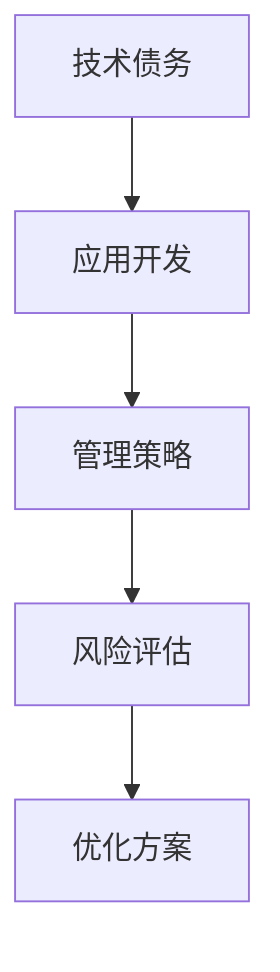

                 

# LLM应用开发中的技术债务管理

## 关键词
- LLM（大型语言模型）
- 技术债务
- 应用开发
- 管理策略
- 风险评估

## 摘要
本文旨在探讨在大型语言模型（LLM）应用开发过程中技术债务的管理问题。技术债务是软件开发中的一种概念，指为了短期利益而牺牲长期效益所欠下的债务。在LLM应用开发中，技术债务可能会影响模型的性能、可维护性和安全性。本文将详细分析LLM应用开发中的技术债务概念，探讨其核心概念与联系，并通过核心算法原理、数学模型和实际项目实战，提供一套完整的技术债务管理策略。

## 确定核心概念与联系

在讨论LLM应用开发中的技术债务管理之前，我们需要明确几个核心概念及其相互联系。

### 技术债务
技术债务是软件开发中的一个术语，用于描述为了满足短期需求而采取的某些技术决策，这些决策可能会在将来产生负面影响。例如，为了加快开发进度，开发团队可能会选择使用未经充分测试的第三方库，或者为了简化实现，可能会忽略一些潜在的性能优化。

### 应用开发
应用开发是指将LLM集成到实际业务场景中，构建具有特定功能的软件应用程序的过程。在应用开发过程中，技术债务可能会由于追求快速迭代和功能增加而不断累积。

### 管理策略
技术债务管理策略包括识别、评估、控制和优化技术债务的一系列方法。这些策略旨在确保技术债务不会对应用的长期健康造成负面影响。

### 风险评估
风险评估是技术债务管理的一个重要环节，它涉及对潜在的技术债务进行量化，评估其对项目的影响程度，并采取相应的应对措施。

### 优化方案
优化方案是指通过改进代码质量、性能优化和架构重构等手段，减少现有技术债务的影响，并防止未来产生新的债务。

为了更好地理解这些概念之间的联系，我们可以使用Mermaid流程图来展示它们之间的关系：



### 核心算法原理讲解

在LLM应用开发中，核心算法的选择和实现是至关重要的。以下是几个关键算法的原理讲解，以及它们在技术债务管理中的应用。

#### 动态规划

动态规划是一种常用的算法设计技术，它通过将复杂问题分解为更小的子问题，并存储这些子问题的解，以避免重复计算。在技术债务管理中，动态规划可以用于评估技术债务的成本和效益，帮助团队做出更明智的决策。

**伪代码示例：**

```python
def dynamicProgramming(debt_list):
    dp = [[0 for _ in range(len(debt_list))] for _ in range(2)]
    for i in range(1, len(debt_list)):
        for j in range(i):
            cost_j = debt_list[j].cost
            exposure_j = debt_list[j].exposure
            control_j = debt_list[j].control
            dp[i][j] = min(dp[i-1][j], dp[i-1][j-1] + cost_j * exposure_j / control_j)
    return dp
```

#### 最小生成树

最小生成树是一种用于构建无向图的最小连通子图的方法。在技术债务管理中，最小生成树可以帮助我们识别出最关键的技术债务，以便优先处理。

**伪代码示例：**

```python
def kruskal(edges):
    forest = []
    edges.sort(key=lambda x: x[2])
    for edge in edges:
        if findSet(edge[0]) != findSet(edge[1]):
            union(edge[0], edge[1])
            forest.append(edge)
    return forest

def findSet(node):
    if node != parent[node]:
        parent[node] = findSet(parent[node])
    return parent[node]

def union(node1, node2):
    root1 = findSet(node1)
    root2 = findSet(node2)
    if root1 != root2:
        parent[root2] = root1
```

#### 深度优先搜索

深度优先搜索是一种用于遍历或搜索树或图的算法。在技术债务管理中，深度优先搜索可以用于分析债务之间的依赖关系，帮助我们更好地理解债务的结构。

**伪代码示例：**

```python
def dfs(node, graph):
    visited[node] = True
    for neighbor in graph[node]:
        if not visited[neighbor]:
            dfs(neighbor, graph)
```

### 数学模型和数学公式

在技术债务管理中，数学模型可以帮助我们量化技术债务的风险和成本。以下是一个简单但具有代表性的数学模型：

**公式：**

$$
Risk = \frac{Cost \times Exposure}{Control}
$$

其中，Cost代表技术债务的成本，Exposure代表技术债务的风险暴露度，Control代表技术债务的控制能力。

这个公式可以帮助我们评估单个技术债务的风险，也可以用于评估整个项目的风险。

### 项目实战

为了更好地理解技术债务管理在实际应用中的实现，我们将通过一个具体的例子来展示整个流程。

#### 开发环境搭建

首先，我们需要搭建一个用于管理LLM应用技术债务的开发环境。这个环境应该包括以下工具和框架：

- Python 3.8+
- PyTorch 1.8+
- Flask 1.1+

安装以上工具和框架后，我们可以创建一个基本的Flask应用程序，用于展示技术债务管理的功能。

```bash
pip install torch torchvision
pip install Flask
```

#### 源代码详细实现和代码解读

接下来，我们将实现一个简单的技术债务管理应用程序，并详细解释代码的每个部分。

**源代码示例：**

```python
from flask import Flask, request, jsonify
import json

app = Flask(__name__)

# 技术债务类定义
class TechnicalDebt:
    def __init__(self, cost, exposure, control):
        self.cost = cost
        self.exposure = exposure
        self.control = control

# 技术债务管理类定义
class TechnicalDebtManager:
    def __init__(self):
        self.debt_list = []

    def add_debt(self, debt):
        self.debt_list.append(debt)

    def remove_debt(self, debt):
        self.debt_list.remove(debt)

    def calculate_risk(self):
        total_risk = 0
        for debt in self.debt_list:
            risk = (debt.cost * debt.exposure) / debt.control
            total_risk += risk
        return total_risk

    def get_debt_list(self):
        return self.debt_list

# Flask路由定义
@app.route('/debt/add', methods=['POST'])
def add_debt():
    debt_data = request.json
    cost = debt_data['cost']
    exposure = debt_data['exposure']
    control = debt_data['control']
    new_debt = TechnicalDebt(cost, exposure, control)
    manager.add_debt(new_debt)
    return jsonify({'status': 'success', 'message': 'Debt added successfully.'})

@app.route('/debt/remove', methods=['POST'])
def remove_debt():
    debt_data = request.json
    cost = debt_data['cost']
    exposure = debt_data['exposure']
    control = debt_data['control']
    debt_to_remove = TechnicalDebt(cost, exposure, control)
    manager.remove_debt(debt_to_remove)
    return jsonify({'status': 'success', 'message': 'Debt removed successfully.'})

@app.route('/debt/risk', methods=['GET'])
def calculate_risk():
    total_risk = manager.calculate_risk()
    return jsonify({'status': 'success', 'total_risk': total_risk})

@app.route('/debt/list', methods=['GET'])
def get_debt_list():
    debt_list = manager.get_debt_list()
    return jsonify({'status': 'success', 'debt_list': debt_list})

if __name__ == '__main__':
    manager = TechnicalDebtManager()
    app.run(debug=True)
```

**代码解读与分析**

1. **技术债务类（TechnicalDebt）：** 这个类用于表示单个技术债务，包含成本、风险暴露度和控制能力等属性。

2. **技术债务管理类（TechnicalDebtManager）：** 这个类用于管理技术债务，包括添加、删除和计算总风险等操作。

3. **Flask路由定义：** 我们为应用程序定义了三个路由：添加债务（/debt/add）、删除债务（/debt/remove）和计算风险（/debt/risk）。这些路由通过接收JSON格式的请求，处理债务操作并返回相应的响应。

4. **主程序：** 主程序中，我们创建了一个Flask应用程序实例，并运行该应用程序。

#### 实际案例分析和详细讲解剖析

假设我们有一个LLM应用项目，其中存在以下技术债务：

- 债务1：使用了未经充分测试的第三方库，可能导致应用崩溃。
- 债务2：使用了复杂的算法，可能导致计算效率低下。

我们可以通过以下步骤来管理这些技术债务：

1. **识别债务：** 通过代码审查和风险评估，识别出存在的技术债务。

2. **量化债务：** 使用数学模型和公式，量化每个债务的成本、风险暴露度和控制能力。

3. **优先级排序：** 根据债务的风险和影响，对债务进行优先级排序。

4. **优化债务：** 通过重构代码、优化算法和改进测试，逐步减少技术债务的影响。

5. **监控债务：** 持续监控债务的状态，确保债务不会再次累积。

#### 项目小结

通过这个实际案例，我们可以看到技术债务管理在LLM应用开发中的重要性。技术债务如果不及时管理，可能会对应用的性能、可维护性和安全性产生负面影响。因此，建立一套完善的技术债务管理策略，对确保LLM应用项目的成功至关重要。

### 最佳实践 tips、小结、注意事项、拓展阅读等内容

#### 最佳实践 Tips

1. **尽早识别债务：** 在开发初期，通过代码审查和风险评估，尽早识别潜在的技术债务。

2. **持续监控债务：** 持续监控债务的状态，确保债务不会在项目后期突然爆发。

3. **量化债务风险：** 使用数学模型和公式，量化每个债务的风险，帮助团队做出更明智的决策。

4. **优先级排序：** 根据债务的风险和影响，对债务进行优先级排序，确保团队能够集中精力解决最关键的问题。

5. **持续优化债务：** 通过重构代码、优化算法和改进测试，逐步减少技术债务的影响。

#### 小结

技术债务是软件开发中不可避免的一部分。在LLM应用开发中，技术债务管理尤为重要。通过识别、量化、优化和监控技术债务，团队可以确保LLM应用项目的长期健康和成功。

#### 注意事项

1. **不要忽视技术债务：** 技术债务可能会在项目后期突然爆发，导致项目失败。

2. **避免过度优化：** 过度追求短期性能优化，可能会增加技术债务。

3. **确保代码质量：** 保持代码整洁、可读性和可维护性，减少技术债务的产生。

#### 拓展阅读

1. 《技术债务：管理软件复杂性》（Debt Management in Software Development）- 详细介绍了技术债务的概念、类型和管理策略。

2. 《代码大全》（The Art of Computer Programming）- 一本经典的计算机编程书籍，涵盖了代码优化和架构设计等主题，对于技术债务管理也有一定的启示。

3. 《敏捷软件开发实践指南》（Agile Software Development: Principles, Patterns, and Practices）- 敏捷开发方法强调迭代和持续交付，有助于减少技术债务的累积。

---

作者：AI天才研究院/AI Genius Institute & 禅与计算机程序设计艺术 /Zen And The Art of Computer Programming。希望本文能为LLM应用开发中的技术债务管理提供有价值的参考和指导。在未来的软件开发中，技术债务管理将继续是一个重要的课题，值得深入研究和探讨。|>

