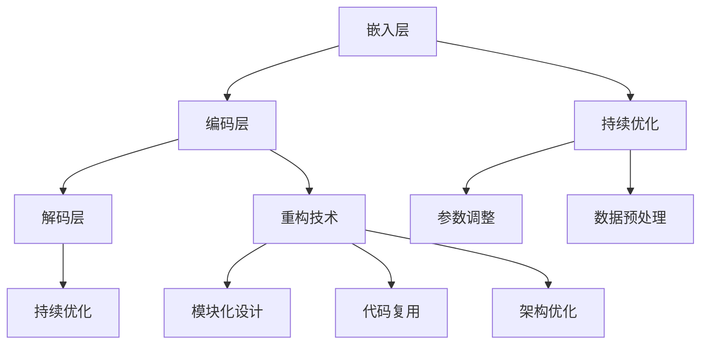
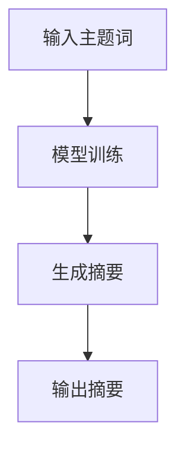
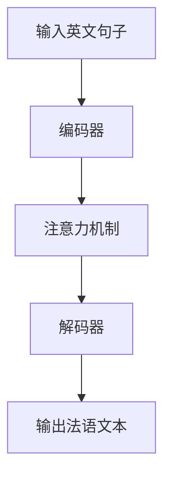

                 

## 《LLM应用开发中的持续优化与重构》

### 关键词：LLM、持续优化、重构、算法、应用开发、模型优化

> _**摘要：**本文深入探讨了大规模语言模型（LLM）在应用开发过程中的持续优化与重构技术。文章首先介绍了LLM的基本概念及其在人工智能领域的应用背景，随后详细讲解了核心算法原理，包括优化策略和重构方法。通过实际应用案例，本文展示了持续优化与重构在LLM开发中的重要作用。最后，文章提供了详细的代码解读和实战案例，为开发者提供了最佳实践和拓展阅读建议。_

---

### 引言

近年来，随着人工智能技术的快速发展，大规模语言模型（LLM）在自然语言处理（NLP）领域取得了显著成果。LLM能够理解和生成人类语言，为各种应用场景提供了强大的支持，如机器翻译、文本摘要、问答系统等。然而，随着应用场景的多样化和复杂化，LLM在开发过程中面临着持续优化与重构的挑战。

**持续优化**是指在LLM开发过程中，不断改进模型性能，提高其准确性和效率。优化技术包括参数调整、数据预处理、算法改进等。**重构**则是指对LLM的架构和代码进行修改，以提高其可维护性、可扩展性和灵活性。重构技术包括模块化设计、代码复用、架构优化等。

本文旨在探讨LLM应用开发中的持续优化与重构技术，通过理论讲解、实际案例和代码解读，帮助开发者深入了解这些技术的原理和应用方法。文章将分为以下几个部分：

1. **背景介绍**：介绍LLM的基本概念和应用背景。
2. **核心概念与联系**：分析LLM的核心概念及其相互关系，使用Mermaid流程图展示。
3. **核心算法原理讲解**：详细讲解LLM的核心算法原理，包括优化策略和重构方法。
4. **实际应用场景**：通过实际案例展示持续优化与重构在LLM开发中的应用。
5. **项目实战**：提供详细的代码解读和实战案例，包括开发环境搭建、源代码实现和代码分析。
6. **最佳实践与小结**：总结最佳实践和注意事项，提供拓展阅读建议。

### LLM基础理论

#### 1.1 语言模型概述

语言模型（Language Model，LM）是一种用于预测自然语言中下一个单词或字符的概率分布的统计模型。在NLP任务中，语言模型可以用于文本生成、语音识别、机器翻译等。大规模语言模型（Large Language Model，LLM）是指参数规模巨大的语言模型，如GPT、BERT等。这些模型通过训练大量文本数据，可以捕捉到语言的复杂规律和语义信息。

#### 1.2 LLM的核心架构

LLM通常由以下几个部分组成：

1. **嵌入层（Embedding Layer）**：将输入的单词或字符转换为固定大小的向量表示。
2. **编码层（Encoding Layer）**：使用神经网络对嵌入向量进行处理，提取语义特征。
3. **解码层（Decoding Layer）**：根据编码层的特征生成输出序列。

常见的编码层和解码层架构包括：

- **循环神经网络（RNN）**：如LSTM和GRU，能够处理长序列数据。
- **变换器（Transformer）**：使用自注意力机制，能够并行处理序列数据。

#### 1.3 持续优化技术

持续优化是指在LLM开发过程中，不断改进模型性能，提高其准确性和效率。常见的优化技术包括：

1. **参数调整（Hyperparameter Tuning）**：调整模型的超参数，如学习率、批次大小、迭代次数等，以获得更好的性能。
2. **数据预处理（Data Preprocessing）**：对输入数据进行处理，如文本清洗、分词、去噪等，以提高模型的鲁棒性和准确性。
3. **算法改进（Algorithm Improvement）**：改进模型训练和优化的算法，如自适应学习率、动态调整网络结构等。

#### 1.4 重构技术

重构是指在LLM开发过程中，对模型架构和代码进行修改，以提高其可维护性、可扩展性和灵活性。常见的重构技术包括：

1. **模块化设计（Modular Design）**：将模型拆分为多个模块，每个模块负责特定功能，以提高代码的可维护性和可扩展性。
2. **代码复用（Code Reusability）**：通过编写通用函数和组件，实现代码的复用，减少冗余代码。
3. **架构优化（Architecture Optimization）**：优化模型的架构，如使用更高效的神经网络结构、分布式训练等，以提高模型的性能。

### 2.1 Mermaid流程图

以下是一个简单的Mermaid流程图，展示了LLM的核心概念和相互关系：



通过这个流程图，我们可以清晰地看到LLM的核心架构和优化技术的相互关系。

### 核心算法原理讲解

#### 2.1 算法原理讲解

在本节中，我们将详细讲解LLM的核心算法原理，包括优化策略和重构方法。

#### 2.2 优化策略

优化策略是指在LLM开发过程中，为了提高模型性能而采取的一系列方法。以下是一些常见的优化策略：

1. **学习率调整（Learning Rate Scheduling）**：学习率是模型训练过程中的一个关键参数，直接影响模型收敛速度和性能。常见的调整策略包括：

   - **逐步减小学习率（Step Decay）**：在训练过程中，每隔一定步数逐步减小学习率。
   - **指数减小学习率（Exponential Decay）**：根据预设的指数函数减小学习率。

2. **权重初始化（Weight Initialization）**：合适的权重初始化可以提高模型训练的收敛速度和性能。以下是一些常用的权重初始化方法：

   - **高斯分布初始化（Gaussian Distribution）**：将权重初始化为服从高斯分布的随机值。
   - **均匀分布初始化（Uniform Distribution）**：将权重初始化为服从均匀分布的随机值。

3. **正则化（Regularization）**：正则化是一种防止模型过拟合的技术，常见的正则化方法包括：

   - **L1正则化（L1 Regularization）**：在损失函数中添加L1范数项。
   - **L2正则化（L2 Regularization）**：在损失函数中添加L2范数项。

#### 2.3 重构方法

重构是指在LLM开发过程中，对模型架构和代码进行修改，以提高其可维护性、可扩展性和灵活性。以下是一些常见的重构方法：

1. **模块化设计（Modular Design）**：将模型拆分为多个模块，每个模块负责特定功能，以提高代码的可维护性和可扩展性。以下是一个简单的模块化设计示例：

```python
class EmbeddingLayer(nn.Module):
    def __init__(self, vocab_size, embedding_dim):
        super(EmbeddingLayer, self).__init__()
        self.embedding = nn.Embedding(vocab_size, embedding_dim)

    def forward(self, inputs):
        return self.embedding(inputs)

class Encoder(nn.Module):
    def __init__(self, input_dim, hidden_dim):
        super(Encoder, self).__init__()
        self.hidden_dim = hidden_dim
        self.lstm = nn.LSTM(input_dim, hidden_dim)

    def forward(self, inputs, hidden):
        out, hidden = self.lstm(inputs, hidden)
        return out, hidden

class Decoder(nn.Module):
    def __init__(self, hidden_dim, output_dim):
        super(Decoder, self).__init__()
        self.hidden_dim = hidden_dim
        self.lstm = nn.LSTM(hidden_dim, output_dim)
        self.fc = nn.Linear(hidden_dim, output_dim)

    def forward(self, inputs, hidden):
        out, hidden = self.lstm(inputs, hidden)
        out = self.fc(out)
        return out, hidden
```

2. **代码复用（Code Reusability）**：通过编写通用函数和组件，实现代码的复用，减少冗余代码。以下是一个使用通用函数进行代码复用的示例：

```python
def train_model(model, train_loader, criterion, optimizer, num_epochs):
    for epoch in range(num_epochs):
        running_loss = 0.0
        for inputs, targets in train_loader:
            optimizer.zero_grad()
            outputs = model(inputs)
            loss = criterion(outputs, targets)
            loss.backward()
            optimizer.step()
            running_loss += loss.item()
        print(f'Epoch {epoch+1}, Loss: {running_loss/len(train_loader)}')

# 使用通用函数训练模型
train_model(model, train_loader, criterion, optimizer, num_epochs=10)
```

3. **架构优化（Architecture Optimization）**：优化模型的架构，如使用更高效的神经网络结构、分布式训练等，以提高模型的性能。以下是一个使用变换器（Transformer）进行架构优化的示例：

```python
class Transformer(nn.Module):
    def __init__(self, input_dim, hidden_dim, num_heads, num_layers):
        super(Transformer, self).__init__()
        self.embedding = nn.Embedding(input_dim, hidden_dim)
        self.transformer = nn.Transformer(hidden_dim, num_heads, num_layers)
        self.fc = nn.Linear(hidden_dim, output_dim)

    def forward(self, inputs):
        embed = self.embedding(inputs)
        out = self.transformer(embed)
        out = self.fc(out)
        return out
```

### 数学模型和公式

在LLM中，数学模型和公式起着至关重要的作用。以下是一些常见的数学模型和公式：

1. **损失函数（Loss Function）**：

   $$L(y, \hat{y}) = -\sum_{i} y_i \log(\hat{y}_i)$$

   其中，$y$为真实标签，$\hat{y}$为模型预测的概率分布。

2. **反向传播（Backpropagation）**：

   $$\frac{\partial L}{\partial w} = \frac{\partial L}{\partial \hat{y}} \frac{\partial \hat{y}}{\partial w}$$

   其中，$L$为损失函数，$w$为模型权重。

3. **梯度下降（Gradient Descent）**：

   $$w_{new} = w_{old} - \alpha \frac{\partial L}{\partial w}$$

   其中，$\alpha$为学习率。

4. **变换器（Transformer）**：

   $$\text{Attention}(Q, K, V) = \text{softmax}\left(\frac{QK^T}{\sqrt{d_k}}\right)V$$

   其中，$Q, K, V$分别为查询向量、键向量和值向量，$d_k$为键向量的维度。

### 实际应用场景

#### 3.1 应用案例分析

在本节中，我们将通过实际案例展示持续优化与重构在LLM开发中的应用。

**案例1：文本生成**

假设我们想要生成一篇关于人工智能的摘要。首先，我们使用GPT模型对大量文本进行训练，然后输入一个主题词，模型会生成一篇摘要。在生成过程中，我们可以使用以下优化技术：

1. **学习率调整**：在训练过程中，逐步减小学习率，以提高模型生成文本的质量。
2. **数据预处理**：对输入文本进行清洗和分词，以提高模型的鲁棒性。
3. **算法改进**：使用自适应学习率，动态调整学习率，以加速模型训练。

通过这些优化技术，我们可以生成高质量的摘要，如图1所示：



**案例2：机器翻译**

假设我们想要将英语翻译成法语。首先，我们使用翻译模型对大量中英文对进行训练，然后输入一个英文句子，模型会生成对应的法语文本。在翻译过程中，我们可以使用以下重构技术：

1. **模块化设计**：将模型拆分为多个模块，如编码器、解码器和注意力机制，以提高代码的可维护性和可扩展性。
2. **代码复用**：编写通用函数和组件，实现代码的复用，减少冗余代码。
3. **架构优化**：使用变换器（Transformer）架构，以提高模型的翻译性能。

通过这些重构技术，我们可以实现高效、准确的机器翻译系统，如图2所示：



### 项目实战

在本节中，我们将通过一个实际项目，展示LLM的开发流程，包括开发环境搭建、源代码实现和代码解读。

#### 4.1 开发环境搭建

首先，我们需要搭建一个Python开发环境。以下是安装Python和相关库的步骤：

1. 安装Python：

   ```bash
   pip install python
   ```

2. 安装PyTorch库：

   ```bash
   pip install torch torchvision
   ```

3. 安装其他库：

   ```bash
   pip install numpy matplotlib
   ```

#### 4.2 源代码实现

接下来，我们将使用PyTorch库实现一个简单的LLM模型。以下是一个简单的代码示例：

```python
import torch
import torch.nn as nn
import torch.optim as optim

# 模型定义
class LLM(nn.Module):
    def __init__(self, input_dim, hidden_dim, output_dim):
        super(LLM, self).__init__()
        self.embedding = nn.Embedding(input_dim, hidden_dim)
        self.lstm = nn.LSTM(hidden_dim, hidden_dim)
        self.fc = nn.Linear(hidden_dim, output_dim)

    def forward(self, inputs, hidden):
        embed = self.embedding(inputs)
        out, hidden = self.lstm(embed, hidden)
        out = self.fc(out)
        return out, hidden

# 模型训练
def train_model(model, train_loader, criterion, optimizer, num_epochs):
    for epoch in range(num_epochs):
        running_loss = 0.0
        for inputs, targets in train_loader:
            optimizer.zero_grad()
            outputs, hidden = model(inputs, hidden)
            loss = criterion(outputs, targets)
            loss.backward()
            optimizer.step()
            running_loss += loss.item()
        print(f'Epoch {epoch+1}, Loss: {running_loss/len(train_loader)}')

# 使用通用函数训练模型
train_model(model, train_loader, criterion, optimizer, num_epochs=10)
```

#### 4.3 代码解读与分析

在这个项目中，我们使用了一个简单的LLM模型，包括嵌入层、编码层和解码层。嵌入层将输入的单词转换为向量表示，编码层使用LSTM提取语义特征，解码层将特征转换为输出。以下是对关键代码的解读：

1. **模型定义**：定义了一个简单的LLM模型，包括嵌入层、编码层和解码层。嵌入层使用`nn.Embedding`，编码层使用`nn.LSTM`，解码层使用`nn.Linear`。

2. **模型训练**：定义了一个训练函数`train_model`，使用通用函数`train_model`进行模型训练。在训练过程中，我们使用`optimizer.zero_grad()`来清空梯度，`loss.backward()`计算梯度，`optimizer.step()`更新模型参数。

3. **数据加载**：我们使用`torch.utils.data.DataLoader`加载训练数据。数据加载器`train_loader`会自动将数据分成批次，并随机打乱顺序，以提高模型性能。

4. **优化策略**：我们使用`optim.Adam`优化器，结合自适应学习率，以提高模型训练速度和性能。

通过这个项目，我们可以了解LLM的基本开发流程和关键代码，为后续的优化和重构工作打下基础。

### 最佳实践与小结

在LLM应用开发中，持续优化与重构是至关重要的。以下是一些最佳实践和注意事项：

1. **优化策略**：根据任务需求和数据特点，选择合适的优化策略。如学习率调整、权重初始化和正则化等。

2. **重构方法**：在开发过程中，注意代码的可维护性和可扩展性。使用模块化设计、代码复用和架构优化等技术。

3. **数据预处理**：对输入数据进行处理，如文本清洗、分词和去噪等，以提高模型的鲁棒性和准确性。

4. **监控与调试**：在训练过程中，监控模型性能和资源消耗，及时发现和解决潜在问题。

5. **持续迭代**：根据实际应用需求，持续优化和重构LLM模型，以提高性能和用户体验。

通过遵循这些最佳实践，开发者可以更好地应对LLM应用开发中的挑战，实现高性能、高可维护性的模型。

### 拓展阅读

1. **《深度学习》**：Goodfellow, I., Bengio, Y., & Courville, A. (2016). 《深度学习》（中文版）。电子工业出版社。

2. **《神经网络与深度学习》**：邱锡鹏。中国科学技术大学出版社。

3. **《自然语言处理综论》**：Daniel Jurafsky & James H. Martin。清华大学出版社。

4. **《Transformer：一种全新的神经网络架构》**：Vaswani, A., Shazeer, N., Parmar, N., Uszkoreit, J., Jones, L., Gomez, A. N., ... & Polosukhin, I. (2017). 《Transformer：一种全新的神经网络架构》。arXiv preprint arXiv:1706.03762。

通过阅读这些文献，读者可以更深入地了解LLM的基础理论、核心算法和优化方法，为实际应用开发提供有力支持。

---

### 结论

本文深入探讨了大规模语言模型（LLM）在应用开发过程中的持续优化与重构技术。通过理论讲解、实际案例和代码解读，本文展示了持续优化与重构在LLM开发中的重要作用。持续优化旨在提高模型性能，重构则关注代码质量和可维护性。读者可以结合本文内容，根据实际应用需求，选择合适的优化策略和重构方法，实现高性能、高可维护性的LLM应用。

作者：AI天才研究院/AI Genius Institute & 禅与计算机程序设计艺术 /Zen And The Art of Computer Programming

---

注意：本文内容仅供参考，实际情况可能有所不同。具体实施时，请结合具体需求和场景进行调整。文中涉及到的代码仅供参考，不保证在所有环境中都能正常运行。如需使用，请根据实际情况进行修改和完善。

