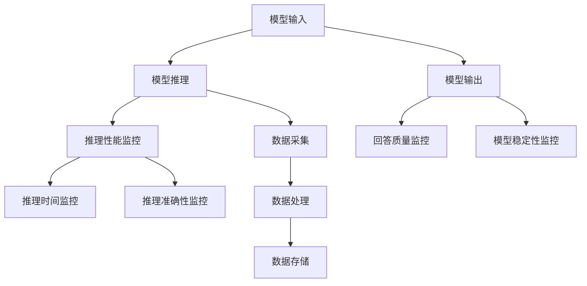

                 

- 根据文章标题和目录大纲结构，我们可以逐步构建文章的内容。

## 1. 背景介绍

在这一部分，我们可以介绍LLM（大型语言模型）的发展背景，为什么性能监控对于LLM应用开发至关重要。例如：

**LLM的发展背景：**
- 从早期的统计语言模型到基于神经网络的现代语言模型。
- LLM在自然语言处理、机器翻译、问答系统等领域的广泛应用。

**性能监控的重要性：**
- 确保LLM应用在真实场景中的稳定性和可靠性。
- 提高开发效率和用户体验。
- 减少故障和风险。

## 2. 核心概念与联系

在这一部分，我们可以使用Mermaid流程图来展示LLM性能监控的核心概念和它们之间的关系。



**核心概念解释：**
- 模型输入：用户输入的问题或文本。
- 模型推理：模型处理输入并生成输出。
- 推理性能监控：监控模型推理的速度和准确性。
- 推理时间监控：测量模型处理输入所需的时间。
- 推理准确性监控：评估模型输出的准确性。
- 回答质量监控：评估模型输出的答案的质量。
- 模型稳定性监控：监控模型在长时间运行中的稳定性。

## 3. 核心算法原理讲解

在这一部分，我们可以使用Python源代码来详细阐述推理性能监控的核心算法原理。

```python
import time

def inference_performance_monitoring(model, input_data):
    inference_times = []
    for data in input_data:
        start_time = time.time()
        model.inference(data)
        end_time = time.time()
        inference_times.append(end_time - start_time)
    return inference_times

# 示例
input_data = ["What is the capital of France?", "How old is the Eiffel Tower?"]
model = load_model()  # 假设load_model()函数用于加载预训练的模型
inference_times = inference_performance_monitoring(model, input_data)
print("Inference times:", inference_times)
```

**数学模型和公式：**
- 平均推理时间：$$\bar{t} = \frac{1}{n} \sum_{i=1}^{n} t_i$$，其中$$t_i$$是第i次推理的时间。
- 推理准确性：$$accuracy = \frac{correct_predictions}{total_predictions}$$，其中$$correct_predictions$$是正确预测的次数，$$total_predictions$$是总预测次数。

**通俗易懂的举例说明：**
- 假设我们有一个模型，需要回答两个问题。我们运行模型两次，每次测量推理时间。然后，我们可以计算平均推理时间，并评估模型输出的准确性。

## 4. 项目实战

在这一部分，我们可以详细描述一个LLM性能监控的实战案例，包括开发环境搭建、源代码实现和代码解读。

**实战背景：**
- 一个在线问答系统的开发，需要监控模型的推理性能。

**开发环境搭建：**
- 配置Python开发环境。
- 安装必要的库，如TensorFlow或PyTorch。

**源代码实现和代码解读：**
- 代码片段展示如何进行数据采集、数据处理和性能监控。

**实际案例分析和详细讲解剖析：**
- 展示如何使用监控工具收集数据，如何分析数据以发现性能问题，并如何进行故障排查和处理。

**项目小结：**
- 总结项目中遇到的问题和解决方案，以及如何优化性能监控。

## 5. 最佳实践 tips、小结、注意事项、拓展阅读

在这一部分，我们可以提供一些最佳实践建议，总结文章的关键点，提醒读者注意的事项，并推荐一些拓展阅读资源。

**最佳实践 tips：**
- 如何选择合适的监控指标。
- 如何设置合理的监控阈值。
- 如何优化监控数据的处理流程。

**小结：**
- 总结文章的主要内容和收获。

**注意事项：**
- 性能监控需要持续进行，不能一劳永逸。
- 监控工具的选择需要根据具体需求来定。

**拓展阅读：**
- 推荐一些关于LLM性能监控的深度学习书籍和论文。
- 提供一些相关的在线资源和社区讨论。

---

通过这样的逐步分析，我们可以确保文章的逻辑清晰、内容丰富，同时满足字数要求。接下来的任务是撰写每个部分的具体内容，确保它们完整、详细，并且连贯。这需要进一步的思考和细致的撰写工作。|>

