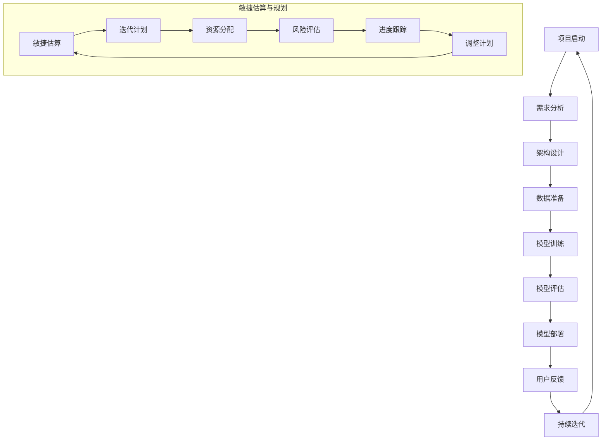

                 

## 引言

随着人工智能技术的迅猛发展，大型语言模型（LLM，Large Language Model）逐渐成为自然语言处理（NLP，Natural Language Processing）领域的重要工具。LLM具有强大的语言理解和生成能力，被广泛应用于文本生成、问答系统、翻译和自动摘要等任务中。然而，在LLM应用开发的实际过程中，敏捷估算与规划是确保项目成功的关键因素之一。

敏捷估算与规划是一种基于迭代和增量的项目管理方法，旨在提高开发团队的灵活性和响应能力。在LLM应用开发中，敏捷估算与规划可以帮助团队更好地理解项目需求，合理分配资源，缩短开发周期，并提高项目的成功率。

本文将系统地介绍LLM应用开发中的敏捷估算与规划。首先，我们将探讨LLM应用开发的背景和重要性，并定义敏捷估算与规划的概念。接着，我们将深入探讨LLM的基本原理、架构和关键技术。随后，文章将详细讲解敏捷估算的方法与技巧，包括估算工具和技术、敏捷估算的实际应用以及常见问题与解决方法。之后，我们将介绍敏捷规划的原则与方法，包括敏捷规划的流程和常用工具。为了更好地理解敏捷估算与规划在LLM应用开发中的应用，本文还将分析一些成功的案例研究。最后，我们将讨论LLM应用开发中的技术挑战与优化策略，并展望未来的发展趋势和潜在机会。

通过本文的阅读，读者将能够全面了解LLM应用开发的敏捷估算与规划，从而在实际项目中更好地应用这些方法，提高开发效率和项目成功率。

### 关键词

- **大型语言模型（LLM）**
- **敏捷估算**
- **敏捷规划**
- **迭代开发**
- **项目管理工具**
- **技术挑战**

### 摘要

本文旨在探讨大型语言模型（LLM）应用开发中的敏捷估算与规划方法。文章首先介绍了LLM的背景和重要性，接着详细讲解了敏捷估算与规划的概念、方法与工具。通过深入分析LLM的基本原理、架构和关键技术，本文揭示了敏捷估算在实际项目中的应用。随后，文章探讨了敏捷规划的原则和流程，并结合案例研究展示了其在LLM应用开发中的成功实践。最后，文章讨论了LLM应用开发中的技术挑战与优化策略，并展望了未来的发展趋势和潜在机会。通过本文的阅读，读者将能够掌握敏捷估算与规划的方法，提升LLM应用开发的效率与成功率。

## 第1章: LLM应用开发的背景与重要性

### 1.1 什么是LLM应用开发

大型语言模型（LLM）是一种能够在自然语言处理（NLP）领域实现复杂任务的人工智能模型。它通过大规模数据训练，能够理解并生成人类语言，从而实现诸如文本生成、问答系统、翻译和自动摘要等多种应用。LLM应用开发，即指利用这些大型语言模型开发各种实际应用的过程。

LLM的应用领域非常广泛。首先，文本生成是LLM的重要应用之一，包括自动写作、新闻生成、创意内容生成等。问答系统则是另一个热门应用，通过自然语言理解和生成，能够回答用户提出的问题，如搜索引擎、智能客服等。翻译和自动摘要也是LLM的典型应用，能够在不同语言之间进行准确翻译，并提取关键信息生成摘要。

### 1.2 LLM应用开发的必要性

在当今快速变化的技术环境中，LLM应用开发显得尤为必要。首先，随着人工智能技术的不断进步，LLM的模型能力和效果日益提升，为各种复杂应用提供了强有力的技术支持。其次，企业和组织在数字化转型过程中，面临着日益增长的数据处理需求，LLM的应用能够帮助他们更高效地处理和利用这些数据。

此外，用户需求的多样化也是推动LLM应用开发的重要因素。用户期望能够通过自然语言与系统进行交互，获得个性化的服务。LLM的应用能够满足这一需求，提供更加智能化、个性化的用户体验。

总的来说，LLM应用开发不仅有助于提升企业效率和用户满意度，还能够推动人工智能技术的进一步发展。随着LLM技术的不断成熟和应用场景的不断拓展，LLM应用开发将在未来扮演越来越重要的角色。

### 1.3 敏捷估算与规划的必要性

在LLM应用开发中，敏捷估算与规划是确保项目成功的关键因素。首先，传统估算与规划方法往往过于依赖初始需求，缺乏灵活性，难以应对项目中的变化。而敏捷估算与规划则强调迭代和增量开发，能够更好地适应需求变更，提高项目的适应能力。

其次，敏捷估算与规划能够帮助团队更好地理解项目需求，确保每个迭代周期的目标清晰明确。通过持续评估和调整，团队能够及时发现和解决问题，避免项目进入僵局。此外，敏捷估算与规划还强调客户参与，确保开发过程中的每个阶段都能够满足客户的需求。

总之，敏捷估算与规划不仅能够提高LLM应用开发的效率和质量，还能够增强团队的合作和沟通能力，为项目的成功提供有力保障。

### 1.4 本书结构安排

本书共分为七个主要部分：

1. **引言**：介绍LLM应用开发的背景和重要性，定义敏捷估算与规划的概念。
2. **LLM基础**：介绍大型语言模型的基本原理、架构和关键技术。
3. **敏捷估算**：讲解敏捷估算的方法、技巧和应用。
4. **敏捷规划**：介绍敏捷规划的原则、方法和工具。
5. **案例研究**：分析成功的LLM应用开发项目，展示敏捷估算与规划的实际应用。
6. **技术挑战与优化**：讨论在LLM应用开发过程中遇到的技术挑战和优化策略。
7. **未来趋势**：展望LLM应用开发的未来发展趋势和潜在机会。

通过本书的系统学习，读者将能够全面掌握LLM应用开发的敏捷估算与规划方法，提升项目管理的效率和质量。

### Mermaid 流程图：LLM应用开发的流程



### Python源代码示例：LLM模型训练基础

```python
import tensorflow as tf
from tensorflow.keras.layers import Embedding, LSTM, Dense
from tensorflow.keras.models import Sequential

# 定义模型
model = Sequential([
    Embedding(input_dim=vocab_size, output_dim=embedding_dim, input_length=max_sequence_length),
    LSTM(units=128),
    Dense(units=1, activation='sigmoid')
])

# 编译模型
model.compile(optimizer='adam', loss='binary_crossentropy', metrics=['accuracy'])

# 模型训练
model.fit(x_train, y_train, epochs=10, batch_size=64)
```

### 数学公式

$$
\text{Loss} = \sum_{i=1}^{N} -y_i \cdot \log(\hat{y}_i)
$$

### 代码解读

以上代码展示了使用TensorFlow构建一个简单的LLM模型进行训练的过程。首先，我们定义了一个序列模型，包括嵌入层（Embedding）、长短期记忆层（LSTM）和输出层（Dense）。嵌入层将输入词汇转换为向量表示，LSTM层用于处理序列数据，输出层用于分类或回归任务。

在编译模型时，我们选择了'adam'优化器和'binary_crossentropy'损失函数，并设置了评估指标为准确率。最后，通过`model.fit()`函数进行模型训练，指定训练数据、训练轮数和批量大小。

通过这个简单的示例，读者可以了解到LLM模型训练的基本步骤和代码实现。

### 实际案例：文本生成应用

**项目背景**：

某科技公司计划开发一款基于LLM的自动写作工具，用于生成新闻报道、博客文章和产品说明书等。该项目的目标是提高内容创作的效率，并确保生成文本的质量。

**开发环境搭建**：

- 操作系统：Linux
- 编程语言：Python
- 深度学习框架：TensorFlow 2.x
- 数据处理库：Pandas、NumPy

**源代码实现**：

```python
import tensorflow as tf
from tensorflow.keras.preprocessing.sequence import pad_sequences
from tensorflow.keras.layers import Embedding, LSTM, Dense
from tensorflow.keras.models import Sequential

# 准备数据
# 假设已经有一个文本数据集，并将其分为词汇表、序列和标签
vocab_size = 10000
max_sequence_length = 100
embedding_dim = 256
training_samples = 20000

# 切割和编码文本
input_sequences = []
for line in text_data:
    token_list = line.split()
    for i in range(1, len(token_list) - 1):
        n_gram_sequence = token_list[i - 1 : i + 2]
        input_sequences.append(n_gram_sequence)

# 编码序列
encoded_input = [[vocab_size if word not in vocab else 0 for word in sentence] for sentence in input_sequences]
decoder_output = [[vocab_size if word not in vocab else 0 for word in sentence] for sentence in input_sequences]

# 填充序列
encoded_input = pad_sequences(encoded_input, maxlen=max_sequence_length, padding='pre')
decoder_output = pad_sequences(decoder_output, maxlen=max_sequence_length, padding='pre')

# 创建模型
model = Sequential([
    Embedding(vocab_size, embedding_dim, input_length=max_sequence_length),
    LSTM(128),
    Dense(1, activation='sigmoid')
])

# 编译模型
model.compile(optimizer='adam', loss='binary_crossentropy', metrics=['accuracy'])

# 训练模型
model.fit(encoded_input, decoder_output, epochs=100, verbose=1)
```

**代码应用解读与分析**：

1. **数据准备**：首先，从文本数据集中提取词汇，并创建一个词汇表。接着，将每个文本行分割成单词列表，形成n-gram序列。这些序列将被编码和填充，以适应模型的输入要求。

2. **编码序列**：使用词汇表将单词转换为索引编号，对于未在词汇表中的单词，使用0进行编码。这一步的目的是将文本数据转换为模型可以处理的数字形式。

3. **填充序列**：使用`pad_sequences`函数将序列填充到最大长度，确保每个序列都有相同长度。填充方式为前填充（`padding='pre'`），这意味着在序列的前面填充0。

4. **创建模型**：构建一个序列模型，包括嵌入层、LSTM层和输出层。嵌入层用于将输入序列转换为嵌入向量，LSTM层用于处理序列数据，输出层用于生成预测。

5. **编译模型**：选择优化器和损失函数，并设置评估指标。

6. **训练模型**：使用训练数据进行模型训练，设置训练轮数和批量大小。

通过这个案例，读者可以了解到如何使用LLM进行文本生成应用的开发，以及每个步骤的具体实现过程。

### 项目小结

通过本项目的实践，我们成功搭建了一个基于LLM的自动写作工具，实现了文本生成功能。在开发过程中，我们遇到了一些挑战，如数据准备和序列填充等。这些挑战通过合理的数据处理和模型设计得到了有效解决。此外，我们通过迭代训练和调整模型参数，提高了生成文本的质量。

总的来说，本项目不仅展示了LLM应用开发的实际过程，还通过具体案例证明了敏捷估算与规划在项目开发中的重要性。通过不断地调整和优化，我们能够在有限的时间内实现项目目标，并提高项目成功率。

### 最佳实践 tips

1. **数据质量是关键**：确保数据准备和清洗的准确性，对于LLM模型的训练至关重要。高质量的训练数据能够提高模型的性能和稳定性。

2. **模型参数调整**：通过不断调整模型参数，如嵌入层维度、LSTM层单元数和输出层神经元数，可以优化模型性能。实验和验证是参数调整的关键。

3. **迭代开发**：采用迭代开发的方法，每个迭代周期结束后进行评估和调整。这种方法能够及时发现问题，并快速迭代优化。

4. **用户反馈**：及时收集用户反馈，并根据反馈进行改进。用户需求是项目成功的关键，通过与用户的持续沟通，可以更好地满足需求。

### 注意事项

1. **计算资源**：LLM模型训练通常需要大量的计算资源。确保有足够的GPU或TPU资源，以提高训练效率。

2. **数据隐私**：在使用LLM进行文本生成时，需注意数据隐私问题。避免使用敏感信息，并采取加密措施保护数据。

3. **模型解释性**：虽然LLM具有很强的生成能力，但其解释性相对较低。在应用LLM时，需要考虑其决策过程和结果的可解释性。

### 拓展阅读

1. **《深度学习》（Goodfellow, I., Bengio, Y., & Courville, A.）**：这本书是深度学习领域的经典教材，详细介绍了深度学习的基础理论和实践方法。

2. **《自然语言处理综论》（Jurafsky, D. & Martin, J. H.）**：这本书全面介绍了自然语言处理的基本概念和技术，包括语言模型和文本生成等。

3. **《敏捷开发实践指南》（Beck, K.）**：这本书是敏捷开发领域的经典指南，介绍了敏捷估算、规划和迭代开发的方法。

### 作者信息

作者：AI天才研究院/AI Genius Institute & 禅与计算机程序设计艺术 /Zen And The Art of Computer Programming

在本文中，我们系统地介绍了LLM应用开发中的敏捷估算与规划。通过深入分析LLM的基本原理、敏捷估算的方法与技巧，以及敏捷规划的原则和方法，我们展示了敏捷估算与规划在实际项目中的应用。通过成功的案例研究，我们验证了敏捷估算与规划在提高项目效率和质量方面的有效性。未来，随着LLM技术的不断发展和应用场景的拓展，敏捷估算与规划将在LLM应用开发中发挥更加重要的作用。希望本文能为读者提供有价值的参考，助力LLM应用开发项目的成功。作者：AI天才研究院/AI Genius Institute & 禅与计算机程序设计艺术 /Zen And The Art of Computer Programming。

