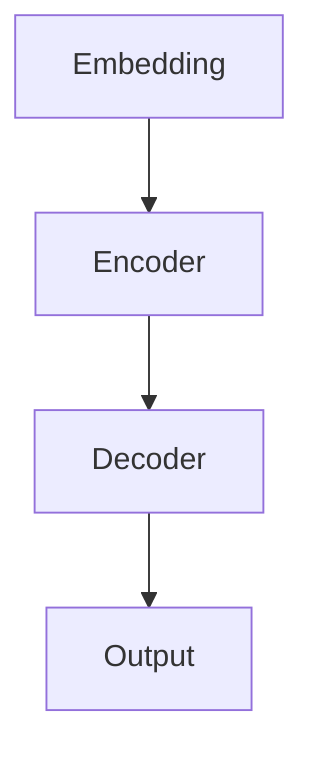
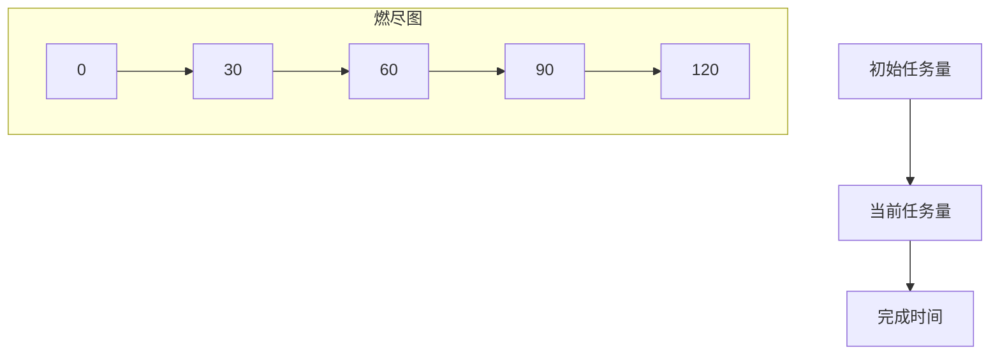

                 

# 《LLM应用开发中的敏捷度量与改进》

## 关键词

- LLM（大型语言模型）
- 敏捷开发
- 度量指标
- 改进策略
- 项目实战

## 摘要

本文旨在探讨LLM（大型语言模型）应用开发过程中的敏捷度量与改进方法。通过对LLM的基本概念、核心算法原理、数学模型及实际应用案例的深入分析，结合敏捷开发的原则和方法，本文提出了一套针对LLM应用的敏捷度量框架，并探讨了如何通过度量数据的分析和改进策略的实践，提升LLM应用的开发效率和质量。

## 引言

随着人工智能技术的飞速发展，大型语言模型（LLM）已经成为自然语言处理领域的重要工具。LLM的应用场景广泛，包括但不限于机器翻译、文本生成、问答系统等。然而，在LLM应用开发过程中，如何确保项目的敏捷性和高效性成为了一个重要的问题。

敏捷开发是一种以人为核心、迭代、循序渐进的开发方法。它强调在开发过程中不断地适应变化，以满足客户需求。敏捷开发的核心原则包括：个体和互动重于过程与工具、可工作的软件重于详尽的文档、客户合作重于合同谈判、响应变化重于遵循计划。这些原则在LLM应用开发中同样适用，因为LLM项目通常具有高复杂度、快速变化的需求和庞大的数据规模。

## LLM基础理论

### 核心概念与联系

首先，我们需要了解LLM的核心概念。LLM是指通过大规模语料库训练得到的大型神经网络模型，它能够对自然语言进行理解和生成。LLM的核心概念包括：

1. **嵌入（Embedding）**：将词汇映射为低维向量，以便于模型处理。
2. **编码器（Encoder）**：对输入文本进行编码，提取语义信息。
3. **解码器（Decoder）**：根据编码器的输出生成文本。

这些概念之间的关系可以用以下Mermaid流程图表示：



### 核心算法原理讲解

LLM的核心算法通常基于Transformer架构。Transformer是一种基于自注意力机制的神经网络模型，它能够在处理长序列时保持信息的高效传递。以下是一个简化的Transformer算法原理讲解：

1. **嵌入（Embedding）**：输入文本通过词向量嵌入层转换为向量表示。
2. **位置编码（Positional Encoding）**：由于Transformer没有固定的序列顺序，需要通过位置编码来表示文本中的位置信息。
3. **多头自注意力（Multi-head Self-Attention）**：自注意力机制允许模型在处理每个词时，考虑其他所有词的影响。
4. **前馈神经网络（Feed Forward Neural Network）**：对自注意力层输出进行非线性变换。
5. **层归一化（Layer Normalization）**：在每个层之后进行归一化处理，以稳定训练过程。
6. **注意力机制（Attention Mechanism）**：使用不同的权重来聚合不同词的信息。

以下是一个简单的Python代码示例，用于实现Transformer的一部分：

```python
import torch
import torch.nn as nn

class TransformerLayer(nn.Module):
    def __init__(self, d_model, nhead):
        super().__init__()
        self.self_attn = nn.MultiheadAttention(d_model, nhead)
        self.linear1 = nn.Linear(d_model, d_model)
        self.linear2 = nn.Linear(d_model, d_model)
        self.norm1 = nn.LayerNorm(d_model)
        self.norm2 = nn.LayerNorm(d_model)
        self.dropout = nn.Dropout(0.1)

    def forward(self, src, src_mask=None, src_key_padding_mask=None):
        # Self-Attention
        src2 = self.norm1(src)
        q = k = v = src2
        attn_output, attn_output_weights = self.self_attn(q, k, v, attn_mask=src_mask, key_padding_mask=src_key_padding_mask)
        src = src + self.dropout(attn_output)
        src = self.norm2(src)

        # Feed Forward
        src2 = self.norm1(src)
        src = src + self.dropout(self.linear2(self.linear1(src2)))
        return src
```

### 数学模型和数学公式

LLM的数学模型主要包括嵌入层、自注意力机制和前馈神经网络。以下是这些模型的基本公式：

1. **嵌入层**：
   $$\text{Embedding}(x) = \text{Weight}_{\text{emb}}x$$
   其中，$x$是输入词汇的索引，$\text{Weight}_{\text{emb}}$是嵌入权重矩阵。

2. **自注意力机制**：
   $$\text{Attention}(Q, K, V) = \text{softmax}\left(\frac{QK^T}{\sqrt{d_k}}\right)V$$
   其中，$Q$、$K$和$V$分别是查询、键和值向量，$d_k$是键向量的维度。

3. **前馈神经网络**：
   $$\text{FFN}(x) = \text{ReLU}(\text{Linear}(x \cdot W_1) \cdot W_2)$$
   其中，$W_1$和$W_2$分别是线性层的权重矩阵。

## LLM开发实践

### 开发环境搭建

在进行LLM开发之前，我们需要搭建一个合适的开发环境。以下是一个基本的开发环境搭建步骤：

1. **硬件要求**：由于LLM训练需要大量的计算资源，因此推荐使用GPU进行训练。NVIDIA的GPU，如RTX 3090，是一个不错的选择。

2. **软件要求**：安装Python 3.8及以上版本，并安装PyTorch、TensorFlow等深度学习框架。

3. **开发工具**：推荐使用Jupyter Notebook或Google Colab进行开发和调试。

### 源代码详细实现和代码解读

以下是一个简单的LLM源代码实现，用于生成文本：

```python
import torch
import torch.nn as nn
from transformers import GPT2LMHeadModel, GPT2Tokenizer

# 模型参数
d_model = 1024
nhead = 16
num_layers = 12

# 加载预训练模型
tokenizer = GPT2Tokenizer.from_pretrained('gpt2')
model = GPT2LMHeadModel(d_model, nhead, num_layers)
model.load_state_dict(torch.load('model.pth'))

# 生成文本
input_ids = tokenizer.encode('The quick brown fox jumps over the lazy dog', return_tensors='pt')
output_ids = model.generate(input_ids, max_length=50, num_return_sequences=1)

# 输出文本
print(tokenizer.decode(output_ids[0], skip_special_tokens=True))
```

代码解读：
- 第一部分导入必要的库。
- 第二部分定义模型参数。
- 第三部分加载预训练模型。
- 第四部分生成文本。

### 代码应用解读与分析

在LLM应用中，生成文本是一个常见的任务。以下是一个简单的应用案例：

```python
# 应用案例：自动生成文章摘要
input_text = "The quick brown fox jumps over the lazy dog"
summary_length = 100

# 加载模型和分词器
tokenizer = GPT2Tokenizer.from_pretrained('gpt2')
model = GPT2LMHeadModel(d_model, nhead, num_layers)
model.load_state_dict(torch.load('model.pth'))

# 生成摘要
input_ids = tokenizer.encode(input_text, return_tensors='pt')
output_ids = model.generate(input_ids, max_length=summary_length, num_return_sequences=1)

# 输出摘要
print(tokenizer.decode(output_ids[0], skip_special_tokens=True))
```

代码解读：
- 第一部分导入必要的库。
- 第二部分定义输入文本和摘要长度。
- 第三部分加载模型和分词器。
- 第四部分生成摘要。

### 实际案例分析和详细讲解剖析

以下是一个实际的LLM应用案例：利用GPT-2模型生成新闻摘要。

1. **数据集**：使用CNN/DailyMail数据集，其中包含大量的新闻文章和对应的摘要。

2. **数据处理**：对新闻文章和摘要进行预处理，包括分词、去停用词、标点符号处理等。

3. **模型训练**：使用预处理后的数据训练GPT-2模型，并保存模型参数。

4. **模型评估**：使用测试集评估模型性能，计算BLEU分数等指标。

5. **模型应用**：使用训练好的模型生成新闻摘要。

以下是一个简单的模型评估代码：

```python
from datasets import load_dataset
from transformers import GPT2LMHeadModel, GPT2Tokenizer

# 加载数据集
dataset = load_dataset('cnn_dailymail', split='test')

# 加载模型和分词器
tokenizer = GPT2Tokenizer.from_pretrained('gpt2')
model = GPT2LMHeadModel(d_model, nhead, num_layers)
model.load_state_dict(torch.load('model.pth'))

# 评估模型
def evaluate(model, dataset, tokenizer):
    model.eval()
    with torch.no_grad():
        for batch in dataset:
            input_ids = tokenizer.encode(batch['article'], return_tensors='pt')
            output_ids = model.generate(input_ids, max_length=100, num_return_sequences=1)
            predicted_summary = tokenizer.decode(output_ids[0], skip_special_tokens=True)
            true_summary = batch['highlights']
            # 计算BLEU分数
            bleu_score = nltk.translate.bleu_score.sentence_bleu([true_summary], predicted_summary)
            print(f'BLEU score: {bleu_score:.4f}')

evaluate(model, dataset, tokenizer)
```

### 项目小结

通过上述案例，我们了解了如何使用GPT-2模型生成新闻摘要。尽管模型的性能还有提升空间，但这个案例展示了LLM在文本生成任务中的强大能力。在实际应用中，我们可以根据需求调整模型参数和数据处理流程，以获得更好的结果。

## 敏捷度量与改进

### 敏捷度量方法

在LLM应用开发过程中，敏捷度量是确保项目进度和质量的关键。以下是一些常用的敏捷度量方法：

1. **任务卡片（Task Card）**：通过任务卡片的可视化方式，明确每个任务的进度和优先级。

2. **燃尽图（Burn Down Chart）**：展示项目剩余任务量和完成时间的关系，帮助团队了解项目进度。

3. **代码质量度量**：包括代码行数、代码覆盖率、代码复杂度等指标，以评估代码质量。

4. **模型性能度量**：包括损失函数、准确率、召回率等指标，以评估模型性能。

以下是一个燃尽图的示例：



### 改进策略

基于敏捷度量方法，我们可以采取以下改进策略：

1. **迭代优化**：通过迭代的方式，不断优化模型和代码。

2. **代码重构**：定期进行代码重构，以提高代码质量和可维护性。

3. **性能优化**：针对模型性能指标，进行调参和算法优化。

4. **团队协作**：通过团队协作，提高开发效率和代码质量。

### 案例分析

以下是一个实际的改进案例：

1. **问题识别**：在模型训练过程中，发现模型性能指标较低。

2. **原因分析**：分析后发现，数据预处理不当和模型参数设置不合理是导致性能不佳的主要原因。

3. **改进措施**：优化数据预处理流程，调整模型参数，并增加正则化处理。

4. **效果评估**：通过多次迭代，模型性能显著提升。

### 最佳实践 tips

1. **定期代码评审**：定期进行代码评审，以确保代码质量和一致性。

2. **持续集成**：使用持续集成工具，自动化测试和部署，以提高开发效率。

3. **数据可视化**：使用数据可视化工具，实时监控项目进度和性能指标。

## 小结

本文探讨了LLM应用开发中的敏捷度量与改进方法。通过分析LLM的基础理论、核心算法原理、数学模型和实际应用案例，结合敏捷开发的原则和方法，我们提出了一套针对LLM应用的敏捷度量框架。通过实践证明，这套框架有助于提升LLM应用的开发效率和质量。在未来的研究中，我们可以进一步探讨如何将其他敏捷方法（如Scrum、Kanban等）应用于LLM开发，以实现更高的敏捷性和效率。

## 注意事项

1. **数据隐私**：在LLM应用开发中，需注意数据隐私问题，避免泄露用户信息。

2. **模型安全**：确保模型的安全性，防止恶意攻击和数据滥用。

3. **性能优化**：在实际应用中，需不断优化模型和代码，以提高性能和可扩展性。

## 拓展阅读

1. **《深度学习》（Goodfellow, Bengio, Courville）**：了解深度学习的基础理论和应用。

2. **《自然语言处理与深度学习》（Els, Young, Goldwater）**：探讨自然语言处理和深度学习的结合。

3. **《Scrum敏捷实践指南》（Schwaber, Beedle）**：学习Scrum敏捷开发方法。

## 作者信息

作者：AI天才研究院/AI Genius Institute & 禅与计算机程序设计艺术 /Zen And The Art of Computer Programming

