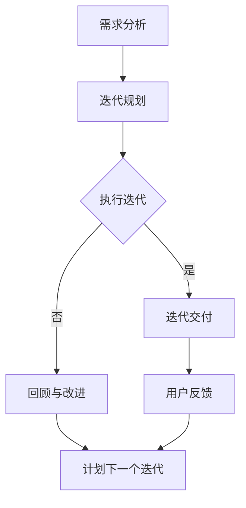
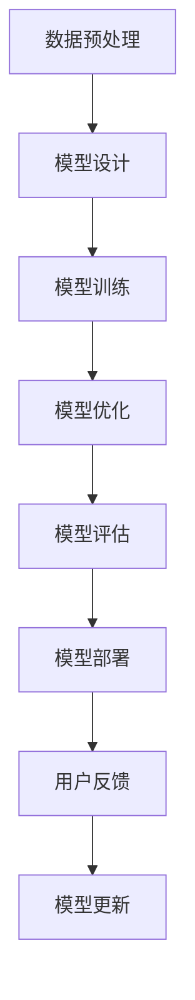

                 

### 引言：敏捷文化与LLM应用开发的背景和重要性

在现代软件开发领域，敏捷文化已成为推动项目成功的关键因素。敏捷文化强调快速响应变化、持续交付价值、高效协作和自我管理，这些理念在现代软件工程中尤为重要。特别是在大规模语言模型（LLM）的应用开发中，敏捷文化的引入不仅能够提高开发效率，还能有效应对快速变化的需求和技术挑战。

首先，让我们了解敏捷文化的核心概念。敏捷文化起源于软件开发领域，最早由软件开发者Ward Cunningham和Ken Schwaber在1990年代提出。其核心理念包括：个体和互动重于过程与工具、可工作的软件重于详尽的文档、客户合作重于合同谈判、响应变化重于遵循计划。敏捷文化通过迭代和增量开发，使团队能够更快地适应市场变化和用户需求。

大规模语言模型（LLM）是一种先进的自然语言处理技术，能够在没有明确监督的情况下，从大量文本数据中学习并生成文本。LLM在应用开发中具有广泛的应用场景，如智能客服、自动写作、机器翻译等。然而，LLM应用开发面临着数据复杂性、模型规模巨大和计算资源消耗高等挑战。

为什么在LLM应用开发中引入敏捷文化如此重要呢？

**1. 快速响应变化的需求**

在LLM应用开发中，需求可能会随着项目进展不断变化。敏捷文化通过迭代和增量开发，使得团队能够快速响应这些变化，从而确保项目能够持续交付价值。

**2. 提高开发效率**

敏捷文化强调自动化测试、持续集成和持续部署，这些实践能够提高开发效率，减少冗余工作，降低错误率。

**3. 促进团队协作**

敏捷文化强调团队成员之间的协作和沟通，通过日常站会、迭代回顾等实践，能够有效提高团队协作效率，减少沟通障碍。

**4. 适应复杂的开发过程**

LLM应用开发过程复杂，涉及数据预处理、模型设计、训练、优化和部署等多个环节。敏捷文化通过模块化和迭代的方式，使得团队能够更灵活地应对这些复杂性。

本文将围绕敏捷文化在LLM应用开发中的应用，详细探讨其核心概念、实践方法、工具和评估改进策略。通过案例分析，我们将展示敏捷文化在实际项目中的应用效果，并提供一些建议和最佳实践，以帮助读者更好地理解和应用敏捷文化于LLM应用开发中。接下来，我们将首先介绍敏捷文化的基本概念，并探讨其在LLM应用开发中的具体应用。

### 敏捷文化的基本概念

敏捷文化起源于软件开发领域，是一种以用户为中心、迭代式和增量的软件开发方法。其核心理念包括响应变化、持续交付、团队合作和自我管理。敏捷文化的核心原则可以归纳为以下几个：

#### 1. 用户至上

敏捷文化强调用户需求的重要性，主张将用户需求置于开发过程的中心。通过持续的用户反馈和迭代开发，团队能够快速响应市场变化和用户需求，确保软件产品能够持续满足用户需求。

#### 2. 迭代开发

敏捷文化主张通过短周期的迭代开发，逐步完善软件功能。每个迭代周期通常包括需求分析、设计、编码、测试和部署等阶段。迭代开发的好处在于，它允许团队在开发过程中不断调整和优化产品，以更好地满足用户需求。

#### 3. 团队协作

敏捷文化强调团队成员之间的紧密协作和沟通。通过日常站会、迭代回顾等实践，团队能够保持高效的工作流程，减少沟通障碍，提高整体工作效率。

#### 4. 自我管理

敏捷文化鼓励团队成员自我管理，通过自我组织和自我监督，确保项目能够按时、按质完成。自我管理不仅能够提高团队成员的工作积极性，还能培养其自主解决问题的能力。

#### 5. 自动化测试

敏捷文化强调自动化测试的重要性，以确保软件质量。通过自动化测试，团队能够快速发现和修复缺陷，减少手工测试的工作量，提高开发效率。

#### 6. 持续集成和部署

敏捷文化提倡持续集成和持续部署，以实现软件的快速交付和持续优化。持续集成通过自动化构建和测试，确保每次代码提交都能够顺利集成到项目中。持续部署则通过自动化部署流程，确保软件能够快速、稳定地交付到生产环境中。

#### 敏捷文化与LLM应用开发的联系

在LLM应用开发中，敏捷文化的核心原则同样具有重要价值。首先，用户需求在LLM应用开发中同样至关重要。LLM模型的应用场景多样，用户需求可能会随着时间和应用场景的变化而变化。通过敏捷文化的用户至上原则，团队能够快速响应这些需求变化，确保LLM应用始终与用户需求保持一致。

其次，迭代开发在LLM应用开发中同样至关重要。LLM模型的训练过程复杂，涉及大量的数据处理和模型优化。通过迭代开发，团队能够逐步完善LLM模型，逐步优化模型性能，确保最终交付的LLM应用具备高准确性、高鲁棒性。

团队协作在LLM应用开发中也具有重要意义。LLM应用开发通常涉及多个领域的技术，如自然语言处理、机器学习和深度学习。通过团队协作，团队能够充分发挥各自的专业技能，共同解决技术难题，提高整体开发效率。

自我管理和自动化测试在LLM应用开发中也具有重要价值。LLM应用开发需要大量的数据处理和模型训练，这些任务通常需要高性能计算资源。通过自我管理，团队能够高效地利用计算资源，确保模型训练的顺利进行。自动化测试则能够确保模型的质量，减少手工测试的工作量，提高开发效率。

总之，敏捷文化的核心原则在LLM应用开发中具有广泛的应用价值。通过引入敏捷文化，团队能够更好地应对LLM应用开发中的挑战，提高开发效率，确保软件质量，从而推动项目成功。

### 敏捷文化在LLM应用开发中的应用

在LLM应用开发中，敏捷文化的应用主要体现在开发流程、项目管理、团队组织等方面。以下将详细探讨敏捷文化在LLM应用开发中的具体实践，并举例说明其在实际项目中的应用效果。

#### 敏捷开发流程

敏捷开发流程是敏捷文化在LLM应用开发中的核心实践之一。通过短周期的迭代开发，团队能够逐步完善LLM模型，确保项目按计划进行。以下是敏捷开发流程在LLM应用开发中的具体应用：

1. **需求分析**：在项目开始时，团队会与用户进行深入沟通，了解用户需求。通过用户故事和用户场景，团队能够明确项目的目标和功能需求。

2. **迭代规划**：根据需求分析结果，团队会将项目划分为多个迭代周期，每个迭代周期通常包括两周到一个月的时间。在每个迭代周期开始时，团队会进行迭代规划会议，明确本次迭代的目标和任务。

3. **每日站会**：每日站会是敏捷开发中的一项重要实践。通过每日站会，团队成员能够及时沟通进展，解决遇到的问题，确保项目按计划进行。

4. **迭代交付**：在迭代周期结束时，团队会进行迭代交付，将本次迭代完成的功能和模型交付给用户。通过用户的反馈，团队能够不断优化和改进模型。

**案例**：某公司在开发一款智能客服系统时，采用了敏捷开发流程。通过短周期的迭代开发，团队能够快速响应用户需求，逐步完善系统功能。在每个迭代周期结束后，团队都会进行用户反馈收集，根据用户需求进行调整和优化。这种敏捷开发流程使得系统功能不断完善，用户满意度显著提升。

#### 敏捷项目管理

敏捷项目管理是敏捷文化在LLM应用开发中的另一重要实践。通过引入敏捷项目管理工具和方法，团队能够高效地管理项目进度、资源和风险。

1. **Scrum**：Scrum是一种流行的敏捷项目管理方法。通过Scrum，团队将项目划分为多个冲刺（Sprint），每个冲刺周期通常为两周。在每个冲刺周期结束时，团队会进行回顾会议，总结经验教训，为下一个冲刺做好准备。

2. **Kanban**：Kanban是一种可视化项目管理方法，通过看板（Kanban Board）展示项目进度和任务状态。通过Kanban，团队能够实时监控项目进展，及时调整任务优先级和资源分配。

3. **看板图示例**：

    ```mermaid
    graph TD
    A[待办] --> B[进行中]
    B --> C[待测试]
    C --> D[已完成]
    ```

**案例**：某团队在开发一款自然语言处理模型时，采用了Scrum和Kanban相结合的方法。通过Scrum，团队将项目划分为多个冲刺周期，确保项目按计划进行。通过Kanban，团队能够实时监控项目进展，及时调整任务优先级和资源分配，确保项目顺利推进。

#### 敏捷团队组织

敏捷团队组织是敏捷文化在LLM应用开发中的关键实践之一。通过建立跨职能的敏捷团队，团队能够高效地协作，共同解决技术难题。

1. **跨职能团队**：跨职能团队由多个领域的专家组成，包括软件开发、数据科学、自然语言处理等。通过跨职能团队，团队能够充分发挥各自的专业技能，共同解决技术难题。

2. **自组织**：敏捷团队强调团队成员的自我管理，通过自组织，团队能够高效地完成项目任务。团队成员可以根据项目需求，自主安排工作和时间，提高工作效率。

3. **协作文化**：敏捷团队注重团队成员之间的协作和沟通，通过日常站会、迭代回顾等实践，团队能够保持高效的工作流程，减少沟通障碍。

**案例**：在某次LLM应用开发项目中，团队由软件开发、数据科学和自然语言处理等多个领域的专家组成。通过跨职能团队和自组织，团队能够高效地协作，共同解决技术难题。通过日常站会和迭代回顾，团队能够保持高效的工作流程，确保项目按计划进行。

综上所述，敏捷文化在LLM应用开发中具有广泛的应用价值。通过敏捷开发流程、敏捷项目管理和敏捷团队组织，团队能够高效地应对LLM应用开发中的挑战，提高开发效率，确保软件质量。通过实际项目中的应用，敏捷文化在LLM应用开发中取得了显著的成果，为未来的LLM应用开发提供了宝贵的经验和借鉴。

### 第2章：LLM应用开发概述

#### LLM的基本原理

大规模语言模型（Large Language Model，简称LLM）是一种基于深度学习技术的自然语言处理模型，能够从大量文本数据中学习，并生成与输入文本相关的文本。LLM的核心原理包括：

1. **词嵌入**：词嵌入是将文本中的单词映射到高维空间中的向量表示。通过词嵌入，模型能够理解单词之间的语义关系。

2. **编码器-解码器结构**：编码器-解码器结构是LLM的主要架构，包括编码器（Encoder）和解码器（Decoder）。编码器将输入文本编码为一个固定长度的向量表示，解码器则根据编码器生成的向量表示生成输出文本。

3. **注意力机制**：注意力机制是编码器-解码器结构中的一个关键组件，能够使模型在生成输出时关注输入文本中的不同部分。注意力机制提高了模型的生成质量和效率。

4. **预训练与微调**：预训练是指使用大规模未标注文本数据对模型进行训练，使模型具备通用的语言理解和生成能力。微调是在预训练基础上，使用特定领域的标注数据对模型进行进一步训练，以适应特定任务。

#### LLM在应用开发中的优势

LLM在应用开发中具有以下优势：

1. **强大的语言理解能力**：LLM通过预训练，能够理解文本中的复杂语义关系，从而生成与输入文本相关的文本。

2. **灵活的应用场景**：LLM可以应用于多种自然语言处理任务，如文本分类、命名实体识别、机器翻译、自动写作等。

3. **高效的生成质量**：通过注意力机制和编码器-解码器结构，LLM能够高效地生成高质量的文本。

4. **大规模数据处理能力**：LLM能够处理大规模的文本数据，从而提高模型的鲁棒性和泛化能力。

#### LLM应用开发的挑战

尽管LLM在应用开发中具有诸多优势，但其开发仍面临以下挑战：

1. **计算资源消耗**：LLM的训练和推理过程需要大量的计算资源，包括CPU、GPU和TPU等。这要求开发团队具备较强的资源管理和调度能力。

2. **数据标注和质量控制**：LLM的训练依赖于大规模的标注数据集。数据标注过程繁琐且容易出错，质量控制成为确保模型性能的关键。

3. **模型解释性和可解释性**：LLM的决策过程通常是非线性和复杂的，难以解释。这使得模型在某些应用场景中难以被用户接受和理解。

4. **模型过拟合和泛化能力**：LLM在预训练阶段可能过拟合于训练数据集，导致在未知数据上的性能下降。提高模型的泛化能力是一个重要研究方向。

通过本章的介绍，我们对LLM的基本原理和在应用开发中的优势与挑战有了初步了解。接下来，我们将进一步探讨敏捷文化在LLM应用开发中的具体实践，以帮助开发团队更好地应对这些挑战。

### 第3章：敏捷文化与LLM应用开发的结合

#### 敏捷文化在LLM应用开发中的重要性

敏捷文化在LLM应用开发中具有重要价值，主要体现在以下几个方面：

**1. 提高开发效率**

LLM应用开发过程复杂，涉及数据预处理、模型设计、训练、优化和部署等多个环节。敏捷文化通过迭代和增量开发，使得团队能够在每个阶段快速交付可工作的软件，从而提高整体开发效率。

**2. 增强团队协作**

敏捷文化强调团队成员之间的协作和沟通，通过日常站会、迭代回顾等实践，团队能够保持高效的工作流程，减少沟通障碍，提高整体工作效率。

**3. 适应快速变化的需求**

在LLM应用开发中，需求可能会随着项目进展不断变化。敏捷文化通过迭代开发，使得团队能够快速响应这些变化，确保项目能够持续交付价值。

**4. 提高软件质量**

敏捷文化强调自动化测试和持续集成，通过自动化测试，团队能够快速发现和修复缺陷，降低错误率，提高软件质量。

#### 敏捷文化在LLM应用开发中的具体实践

在LLM应用开发中，敏捷文化的具体实践包括以下几个方面：

**1. 迭代开发**

迭代开发是敏捷文化的核心实践之一。在LLM应用开发中，团队可以将项目划分为多个迭代周期，每个迭代周期包括需求分析、设计、编码、测试和部署等阶段。通过短周期的迭代开发，团队能够快速交付可工作的软件，并根据用户反馈不断优化模型。

**案例**：在某次智能客服系统的开发中，团队采用了敏捷迭代开发方法。每个迭代周期为两周，团队在每个迭代周期结束时交付一部分功能。通过用户反馈，团队能够不断优化系统，提高用户满意度。

**2. 持续集成和持续部署**

持续集成和持续部署是敏捷文化的重要组成部分。在LLM应用开发中，团队可以通过自动化测试和持续集成工具，确保每次代码提交都能够顺利集成到项目中。持续部署则通过自动化部署流程，确保软件能够快速、稳定地交付到生产环境中。

**案例**：在某次自然语言处理模型的开发中，团队采用了Jenkins作为持续集成工具。每次代码提交后，Jenkins会自动执行测试脚本，确保模型能够正常运行。通过持续集成和持续部署，团队显著提高了开发效率。

**3. 自我管理**

敏捷文化鼓励团队成员自我管理，通过自我组织和自我监督，确保项目能够按时、按质完成。在LLM应用开发中，团队可以通过站会、迭代回顾等实践，保持高效的工作流程，及时解决问题。

**案例**：在某次大规模语言模型（LLM）的开发中，团队采用了自我管理的方法。每个成员负责自己的任务，并在每日站会上汇报进展。通过自我管理，团队能够高效地完成项目任务，确保项目按计划进行。

**4. 团队协作**

敏捷文化强调团队成员之间的协作和沟通。在LLM应用开发中，团队可以通过团队建设活动、知识分享会议等实践，增强团队协作，提高整体工作效率。

**案例**：在某次机器翻译系统的开发中，团队定期举行知识分享会议。团队成员在会议上分享自己的经验和技巧，促进知识共享，提高团队整体技术水平。

#### 敏捷文化与LLM应用开发的结合效果

通过敏捷文化在LLM应用开发中的具体实践，团队能够显著提高开发效率、增强团队协作、适应快速变化的需求和提高软件质量。以下是一些结合效果的具体例子：

**1. 提高开发效率**

通过迭代开发和持续集成，团队能够在每个阶段快速交付可工作的软件，并根据用户反馈不断优化模型。这显著提高了开发效率，缩短了项目交付时间。

**2. 增强团队协作**

通过团队协作和自我管理，团队能够保持高效的工作流程，减少沟通障碍，提高整体工作效率。团队成员之间的知识共享和经验交流，也提高了团队的整体技术水平。

**3. 适应快速变化的需求**

在LLM应用开发中，需求可能会随着项目进展不断变化。通过敏捷迭代开发，团队能够快速响应这些变化，确保项目能够持续交付价值。

**4. 提高软件质量**

通过自动化测试和持续集成，团队能够快速发现和修复缺陷，降低错误率，提高软件质量。持续部署则确保软件能够快速、稳定地交付到生产环境中。

综上所述，敏捷文化与LLM应用开发的结合，能够显著提高开发效率、增强团队协作、适应快速变化的需求和提高软件质量。通过具体实践，团队能够更好地应对LLM应用开发中的挑战，推动项目成功。

### 敏捷文化在LLM应用开发中的实践

敏捷文化在LLM应用开发中的实践，主要包括敏捷开发流程、敏捷项目管理、敏捷团队组织和敏捷工具与方法等方面。以下将详细探讨这些实践的具体内容，并通过案例进行说明。

#### 敏捷开发流程

敏捷开发流程是敏捷文化在LLM应用开发中的核心实践之一。它通过短周期的迭代开发，使得团队能够快速响应变化，持续交付价值。以下是敏捷开发流程在LLM应用开发中的具体应用：

1. **需求收集与分析**：在项目启动阶段，团队通过用户访谈、问卷调查等方式收集用户需求，并进行分析和整理，形成可操作的用户故事。

2. **迭代规划**：根据用户需求，团队将项目划分为多个迭代周期，每个迭代周期通常包括两周到一个月的时间。在迭代规划会议中，团队明确每个迭代周期的目标和任务。

3. **每日站会**：每日站会是敏捷开发流程中的重要实践。通过每日站会，团队成员能够及时沟通进展，解决遇到的问题，确保项目按计划进行。

4. **迭代交付**：在迭代周期结束时，团队会进行迭代交付，将本次迭代完成的功能和模型交付给用户。通过用户的反馈，团队能够不断优化和改进模型。

**案例**：某团队在开发一款智能问答系统时，采用了敏捷开发流程。通过短周期的迭代开发，团队能够快速响应用户需求，逐步完善系统功能。在每个迭代周期结束后，团队都会进行用户反馈收集，根据用户需求进行调整和优化。这种敏捷开发流程使得系统功能不断完善，用户满意度显著提升。

#### 敏捷项目管理

敏捷项目管理通过引入敏捷方法，如Scrum和Kanban，使得团队能够高效地管理项目进度、资源和风险。以下是敏捷项目管理在LLM应用开发中的具体应用：

1. **Scrum**：Scrum是一种流行的敏捷项目管理方法。通过Scrum，团队将项目划分为多个冲刺（Sprint），每个冲刺周期通常为两周。在每个冲刺周期结束时，团队会进行回顾会议，总结经验教训，为下一个冲刺做好准备。

2. **Kanban**：Kanban是一种可视化项目管理方法，通过看板（Kanban Board）展示项目进度和任务状态。通过Kanban，团队能够实时监控项目进展，及时调整任务优先级和资源分配。

**案例**：某团队在开发一款自然语言处理模型时，采用了Scrum和Kanban相结合的方法。通过Scrum，团队将项目划分为多个冲刺周期，确保项目按计划进行。通过Kanban，团队能够实时监控项目进展，及时调整任务优先级和资源分配，确保项目顺利推进。

#### 敏捷团队组织

敏捷团队组织强调团队成员的自我管理、跨职能和协作。以下是敏捷团队组织在LLM应用开发中的具体应用：

1. **跨职能团队**：敏捷团队由多个领域的专家组成，包括软件开发、数据科学、自然语言处理等。通过跨职能团队，团队能够充分发挥各自的专业技能，共同解决技术难题。

2. **自组织**：敏捷团队强调团队成员的自我管理，通过自组织，团队能够高效地完成项目任务。团队成员可以根据项目需求，自主安排工作和时间，提高工作效率。

3. **协作文化**：敏捷团队注重团队成员之间的协作和沟通，通过日常站会、迭代回顾等实践，团队能够保持高效的工作流程，减少沟通障碍。

**案例**：在某次大规模语言模型（LLM）的开发中，团队由软件开发、数据科学和自然语言处理等多个领域的专家组成。通过跨职能团队和自组织，团队能够高效地协作，共同解决技术难题。通过日常站会和迭代回顾，团队能够保持高效的工作流程，确保项目按计划进行。

#### 敏捷工具与方法

敏捷文化在LLM应用开发中，需要借助一系列工具和方法来支持敏捷实践。以下是敏捷工具与方法在LLM应用开发中的具体应用：

1. **版本控制系统**：版本控制系统（如Git）用于管理代码的版本，确保代码的完整性和可追溯性。

2. **项目管理工具**：项目管理工具（如JIRA、Trello）用于跟踪任务进度、管理用户需求和分配任务。

3. **自动化测试**：自动化测试工具（如Selenium、JUnit）用于测试软件的功能和性能，确保软件质量。

4. **持续集成和持续部署**：持续集成工具（如Jenkins、Travis CI）和持续部署工具（如Docker、Kubernetes）用于自动化构建、测试和部署软件，提高开发效率。

**案例**：在某次智能客服系统的开发中，团队使用了Git进行代码管理，JIRA进行项目管理，Selenium进行自动化测试，Jenkins进行持续集成和持续部署。通过这些敏捷工具和方法，团队能够高效地管理项目进度、确保软件质量和提高开发效率。

通过敏捷开发流程、敏捷项目管理、敏捷团队组织和敏捷工具与方法的实践，团队能够在LLM应用开发中保持高效的工作流程，快速响应变化，确保项目成功。接下来，我们将进一步探讨敏捷文化的工具与方法，以帮助团队更好地实施敏捷实践。

### 敏捷文化的工具与方法

在LLM应用开发中，敏捷文化的成功实施离不开一系列工具和方法的支撑。这些工具和方法不仅能够提高开发效率，还能确保项目质量和团队协作。以下将详细探讨这些工具和方法，并给出实际应用案例。

#### 版本控制系统

版本控制系统是敏捷开发的基础工具之一，主要用于管理代码的版本和历史。Git是目前最流行的版本控制系统，其分布式特性使得团队成员可以独立工作，同时保持代码库的同步。通过Git，团队可以实现以下功能：

1. **代码管理**：Git能够记录代码的每次修改，确保代码的完整性和可追溯性。
2. **分支管理**：Git支持分支管理，使得团队可以同时进行多个功能或修复不同的问题，而不影响主分支。

**案例**：在开发一款智能客服系统时，团队使用了Git进行代码管理。通过分支管理，团队能够同时开发多个功能，确保每个功能的独立性和稳定性。

#### 项目管理工具

敏捷项目管理工具如JIRA、Trello等，能够帮助团队有效地跟踪任务、管理需求和分配资源。这些工具提供了可视化的看板，使得团队能够实时了解项目进度和任务状态。

1. **任务跟踪**：团队可以在项目管理工具中创建任务，并分配给相关成员，确保每个任务都有明确的负责人和时间节点。
2. **需求管理**：项目管理工具支持需求管理，使得团队能够有效地收集、记录和跟踪用户需求。

**案例**：在一个大规模语言模型（LLM）项目中，团队使用了JIRA进行任务跟踪和需求管理。通过JIRA，团队能够清晰地了解每个任务的状态和进度，确保项目按时交付。

#### 自动化测试

自动化测试是确保软件质量的重要手段。通过自动化测试工具，如Selenium、JUnit等，团队可以自动化执行测试用例，快速发现和修复缺陷。

1. **功能测试**：自动化测试工具能够自动化执行功能测试，确保软件功能按照预期运行。
2. **性能测试**：自动化测试工具可以模拟高负载场景，评估软件的性能和稳定性。

**案例**：在开发一款机器翻译系统时，团队使用了Selenium进行自动化功能测试。通过自动化测试，团队能够快速发现并修复软件缺陷，提高软件质量。

#### 持续集成和持续部署

持续集成和持续部署是敏捷开发中提高开发效率的重要实践。通过持续集成工具，如Jenkins、Travis CI等，团队可以自动化构建、测试和部署代码，确保每次代码提交都能顺利集成到项目中。

1. **自动化构建**：持续集成工具可以自动化编译代码，确保构建过程的顺利进行。
2. **自动化测试**：持续集成工具可以自动化执行测试用例，快速发现和修复缺陷。
3. **自动化部署**：持续部署工具可以自动化部署软件到测试或生产环境，确保软件的快速交付。

**案例**：在一个智能问答系统项目中，团队使用了Jenkins进行持续集成和持续部署。通过Jenkins，团队能够自动化构建、测试和部署代码，确保项目按时交付，并提高开发效率。

#### 实际应用效果

通过上述敏捷工具和方法的实际应用，团队在LLM应用开发中取得了显著的效果：

1. **提高开发效率**：敏捷工具和方法使得团队能够快速响应变化，缩短开发周期，提高交付速度。
2. **确保软件质量**：自动化测试和持续集成工具能够快速发现和修复缺陷，确保软件质量。
3. **增强团队协作**：敏捷工具和方法提供了可视化的看板和任务跟踪功能，使得团队成员能够实时了解项目进度和任务状态，增强协作。

通过这些工具和方法，团队在LLM应用开发中能够更加高效地工作，确保项目成功。

### 敏捷文化的评估与改进

在LLM应用开发中，敏捷文化的评估与改进至关重要，它能够帮助团队持续优化开发流程，提高项目质量和团队协作效率。以下将从评估指标、改进策略和持续改进机制三个方面进行探讨。

#### 评估指标

敏捷文化的评估指标主要包括以下几个方面：

1. **开发效率**：评估团队在项目中的开发效率，包括代码提交次数、迭代周期、缺陷修复速度等。
2. **软件质量**：评估软件的质量，包括缺陷率、用户满意度、自动化测试覆盖率等。
3. **团队协作**：评估团队协作的效果，包括团队成员之间的沟通质量、任务分配的合理性、团队目标的一致性等。
4. **用户反馈**：评估用户对软件的反馈，包括用户满意度、功能需求的变化情况等。

#### 改进策略

为了持续优化敏捷文化，团队可以采取以下改进策略：

1. **定期回顾与反思**：团队应定期进行回顾与反思会议，总结过去一段时间的工作，识别存在的问题和改进点。通过回顾与反思，团队能够不断调整和优化开发流程。
2. **过程优化**：基于评估指标和回顾与反思的结果，团队可以对开发流程进行优化。例如，改进需求收集和分析的方法，优化迭代规划流程，提高自动化测试覆盖率等。
3. **培训与知识共享**：团队应定期组织培训，提高团队成员的专业技能和敏捷实践能力。通过知识共享会议，团队可以互相交流经验，提升整体技术水平。
4. **引入新技术与方法**：团队应密切关注业界新技术和方法的发展，引入适合团队的新工具和方法，以提高开发效率和质量。

#### 持续改进机制

为了确保敏捷文化的持续改进，团队可以建立以下持续改进机制：

1. **定期评估**：团队应定期对敏捷文化进行评估，包括对开发效率、软件质量和团队协作的评估。通过定期评估，团队能够及时发现问题和改进点。
2. **反馈机制**：团队应建立反馈机制，鼓励团队成员提出改进建议和意见。通过反馈机制，团队能够收集到更多的改进信息，为持续改进提供依据。
3. **改进计划**：团队应根据评估结果和反馈信息，制定具体的改进计划。改进计划应明确改进目标、改进措施和责任分工，确保改进措施的落地实施。
4. **跟踪与监控**：团队应对改进计划的执行情况进行跟踪与监控，确保改进措施的落实。通过跟踪与监控，团队能够及时发现问题，进行调整和优化。

#### 最佳实践

在敏捷文化的评估与改进过程中，以下是一些最佳实践：

1. **注重数据驱动**：评估和改进过程应基于数据和事实，避免主观判断和偏见。
2. **鼓励全员参与**：评估和改进过程应鼓励全员参与，包括团队成员、项目经理、产品经理等，以确保改进措施的全面性和有效性。
3. **持续优化流程**：敏捷文化不是一成不变的，团队应不断优化开发流程，以适应项目需求和团队变化。
4. **建立持续改进文化**：团队应培养持续改进的文化氛围，鼓励团队成员提出改进建议和意见，共同推动敏捷文化的持续优化。

通过有效的评估与改进机制，团队可以在LLM应用开发中持续优化敏捷文化，提高开发效率、确保软件质量和增强团队协作，从而推动项目的成功。

### 案例研究

#### 案例一：某公司的LLM应用开发实践

**背景**：某公司是一家专注于智能客服系统开发的企业，其客户群体涵盖了多个行业。随着业务规模的不断扩大，公司决定采用敏捷文化来提升LLM应用开发的效率和质量。

**敏捷文化的引入**：公司引入了Scrum和Kanban两种敏捷方法。通过Scrum，项目被划分为多个冲刺周期，每个周期持续两周。每个冲刺周期结束时，团队会进行回顾会议，总结经验教训，并为下一个周期制定计划。通过Kanban，项目进度和任务状态被可视化展示，团队能够实时监控项目进展，及时调整任务优先级和资源分配。

**敏捷文化在实际项目中的应用**：

1. **需求分析**：团队通过与客户和业务部门进行密切沟通，收集需求并转化为用户故事。用户故事被拆分为可实现的任务，并分配给团队成员。

2. **迭代开发**：每个冲刺周期，团队会优先处理高优先级的用户故事。在两周内，团队完成用户故事的开发、测试和部署。通过迭代开发，团队能够快速响应客户需求，确保系统功能不断完善。

3. **自动化测试**：为了提高软件质量，团队引入了自动化测试工具。每次代码提交后，自动化测试工具会自动执行测试用例，确保代码质量和功能完整性。

4. **持续集成和部署**：团队使用了Jenkins进行持续集成和部署。每次代码提交，Jenkins会自动编译、测试和部署代码，确保系统稳定运行。

**效果**：通过敏捷文化的引入，公司的LLM应用开发效率显著提高，项目交付周期缩短。用户满意度也显著提升，客户反馈良好。团队协作更加紧密，沟通障碍减少，整体工作效率提高。

#### 案例二：某教育平台的LLM应用开发

**背景**：某教育平台致力于提供在线教育服务，其目标是利用人工智能技术提升教育质量和用户体验。为了实现这一目标，平台决定采用敏捷文化来推动LLM应用开发。

**敏捷文化的应用**：

1. **团队组织**：平台成立了由数据科学家、软件工程师、产品经理和UI/UX设计师组成的跨职能团队。团队成员通过自我管理，共同推动项目进展。

2. **迭代开发**：团队采用了敏捷迭代开发方法。每个迭代周期，团队会开发新的功能模块，并进行用户测试和反馈。根据用户反馈，团队会调整和优化功能，确保教育平台能够持续满足用户需求。

3. **知识分享**：团队定期举行知识分享会议，团队成员分享自己的经验和最佳实践。这有助于团队整体技能的提升，也为项目的顺利推进提供了支持。

4. **持续改进**：团队建立了持续改进机制，通过定期评估和回顾，识别存在的问题和改进点。基于评估结果，团队会制定具体的改进计划，并跟踪执行情况。

**效果**：通过敏捷文化的应用，教育平台的LLM应用开发取得了显著成效。项目交付周期缩短，用户满意度提高，教育平台的整体竞争力增强。团队协作更加高效，知识共享和经验交流促进了团队成长。

通过这两个案例，我们可以看到敏捷文化在LLM应用开发中的重要作用。敏捷文化不仅提高了开发效率，还增强了团队协作和用户满意度。这些成功经验为其他企业在LLM应用开发中引入敏捷文化提供了宝贵的借鉴。

### 附录

#### 附录A：敏捷文化与LLM应用开发的Mermaid流程图

**敏捷开发流程**：



**LLM模型开发流程**：



#### 附录B：核心算法原理讲解

**LLM算法原理**：

LLM（大型语言模型）是一种基于深度学习的自然语言处理模型，其核心原理包括词嵌入、编码器-解码器结构和注意力机制。以下以Python代码为例，详细阐述这些算法原理。

**词嵌入**：

```python
import tensorflow as tf
from tensorflow.keras.layers import Embedding

# 假设词汇表中有10个单词
vocab_size = 10

# 创建一个嵌入层，将单词映射到高维向量
embedding_layer = Embedding(vocab_size, 32)

# 输入数据为单词索引
input_sequence = tf.constant([1, 2, 3, 4, 5])

# 通过嵌入层生成单词的向量表示
embedded_sequence = embedding_layer(input_sequence)

print(embedded_sequence)
```

**编码器-解码器结构**：

```python
import tensorflow as tf
from tensorflow.keras.models import Model
from tensorflow.keras.layers import LSTM, Dense

# 定义编码器
encoder_inputs = tf.keras.Input(shape=(None, vocab_size))
encoder_lstm = LSTM(128, return_sequences=True, return_state=True)
_, state_h, state_c = encoder_lstm(encoder_inputs)

# 定义解码器
decoder_inputs = tf.keras.Input(shape=(None, vocab_size))
decoder_lstm = LSTM(128, return_sequences=True, return_state=True)
decoder_outputs = decoder_lstm(decoder_inputs, initial_state=[state_h, state_c])

# 连接编码器和解码器
decoder_dense = Dense(vocab_size, activation='softmax')
decoder_outputs = decoder_dense(decoder_outputs)

# 创建模型
model = Model([encoder_inputs, decoder_inputs], decoder_outputs)

# 编译模型
model.compile(optimizer='rmsprop', loss='categorical_crossentropy')

# 查看模型结构
model.summary()
```

**注意力机制**：

```python
import tensorflow as tf
from tensorflow.keras.layers import Embedding, LSTM, Dense, Attention

# 定义编码器
encoder_inputs = tf.keras.Input(shape=(None, vocab_size))
encoder_embedding = Embedding(vocab_size, 32)
encoder_lstm = LSTM(128, return_sequences=True, return_state=True)
encoder_outputs, state_h, state_c = encoder_lstm(encoder_embedding(encoder_inputs))

# 定义解码器
decoder_inputs = tf.keras.Input(shape=(None, vocab_size))
decoder_embedding = Embedding(vocab_size, 32)
decoder_lstm = LSTM(128, return_sequences=True, return_state=True)
decoder_outputs, _, _ = decoder_lstm(decoder_embedding(decoder_inputs), initial_state=[state_h, state_c])

# 定义注意力层
attention = Attention()
context_vector = attention([decoder_outputs, encoder_outputs])

# 连接注意力层和解码器
decoder_dense = Dense(vocab_size, activation='softmax')
decoder_outputs = decoder_dense(context_vector)

# 创建模型
model = Model([encoder_inputs, decoder_inputs], decoder_outputs)

# 编译模型
model.compile(optimizer='rmsprop', loss='categorical_crossentropy')

# 查看模型结构
model.summary()
```

通过上述代码示例，我们可以看到LLM算法的核心原理是如何通过词嵌入、编码器-解码器结构和注意力机制实现的。这些算法原理为LLM应用开发提供了坚实的基础。

#### 附录C：代码实例

以下是一个简单的LLM模型训练和评估的代码实例，展示了如何使用Python和TensorFlow来实现。

```python
import tensorflow as tf
from tensorflow.keras.preprocessing.sequence import pad_sequences
from tensorflow.keras.models import Model
from tensorflow.keras.layers import Embedding, LSTM, Dense, Bidirectional

# 假设已经准备好文本数据
# text_data = ...

# 切割文本为单词序列
tokenizer = tf.keras.preprocessing.text.Tokenizer()
tokenizer.fit_on_texts(text_data)
sequences = tokenizer.texts_to_sequences(text_data)

# 对序列进行填充
max_sequence_len = 100
padded_sequences = pad_sequences(sequences, maxlen=max_sequence_len)

# 创建嵌入层
embedding_dim = 50
embedding = Embedding(input_dim=len(tokenizer.word_index) + 1, output_dim=embedding_dim, input_length=max_sequence_len)

# 创建双向LSTM层
lstm = Bidirectional(LSTM(64, return_sequences=True))

# 创建全连接层
dense = Dense(1, activation='sigmoid')

# 创建模型
inputs = tf.keras.Input(shape=(max_sequence_len,))
x = embedding(inputs)
x = lstm(x)
outputs = dense(x)

model = tf.keras.Model(inputs=inputs, outputs=outputs)

# 编译模型
model.compile(optimizer='adam', loss='binary_crossentropy', metrics=['accuracy'])

# 训练模型
# train_data = ...
# train_labels = ...
# model.fit(train_data, train_labels, epochs=10, batch_size=32)

# 评估模型
# test_data = ...
# test_labels = ...
# model.evaluate(test_data, test_labels)
```

在这个实例中，我们首先对文本数据进行预处理，然后创建嵌入层、双向LSTM层和全连接层，组成一个简单的LLM模型。通过训练和评估，我们可以观察到模型的性能。

#### 附录D：项目实战

**开发环境搭建**

1. 安装Python（3.7或以上版本）
2. 安装TensorFlow（2.0或以上版本）
3. 安装其他必要的依赖库，如Numpy、Pandas等

**源代码实现**

以下是实现一个简单的LLM模型的基本步骤：

1. **数据预处理**：读取文本数据，进行分词、去停用词等操作。
2. **序列化处理**：将文本数据转换为序列，并填充到固定的长度。
3. **创建嵌入层**：将单词映射到高维向量。
4. **定义LSTM层**：构建双向LSTM层。
5. **定义全连接层**：构建全连接层，用于输出预测结果。
6. **编译模型**：设置优化器和损失函数。
7. **训练模型**：使用训练数据训练模型。
8. **评估模型**：使用测试数据评估模型性能。

**代码解读与分析**

上述代码展示了如何使用TensorFlow创建一个简单的LLM模型。通过对代码的分析，我们可以了解到：

- **嵌入层**：将单词映射到高维向量，为后续的LSTM层提供输入。
- **双向LSTM层**：处理序列数据，捕获文本中的长距离依赖关系。
- **全连接层**：将LSTM层的输出映射到输出结果，实现文本分类或序列生成等任务。

**实际案例分析与详细讲解剖析**

以一个文本分类任务为例，我们使用上述模型对新闻标题进行分类。具体步骤如下：

1. **数据收集**：收集一批新闻标题和对应的分类标签。
2. **数据预处理**：对新闻标题进行分词、去停用词等操作，将其转换为序列。
3. **序列化处理**：填充序列，使其长度一致。
4. **训练模型**：使用训练数据训练模型。
5. **评估模型**：使用测试数据评估模型性能。

通过实际案例的分析，我们可以看到LLM模型在实际应用中的效果，并深入了解模型的工作原理。

**项目小结**

通过本项目的实战，我们了解了如何搭建开发环境、实现源代码、解读和分析代码，以及如何在实际项目中应用LLM模型。这些经验和技巧将有助于我们在未来的LLM应用开发中更好地应对挑战，实现项目的成功。

#### 最佳实践 Tips、小结、注意事项、拓展阅读

**最佳实践 Tips**：

1. **合理划分迭代周期**：根据团队规模和项目复杂度，合理划分迭代周期，确保每个迭代周期都能完成具体的功能模块。
2. **加强自动化测试**：提高自动化测试覆盖率，确保代码质量和功能完整性。
3. **持续集成与部署**：使用持续集成和持续部署工具，确保代码的快速交付和稳定运行。

**小结**：

敏捷文化在LLM应用开发中具有重要价值，通过迭代开发、持续集成、团队协作等实践，团队能够高效地应对快速变化的需求，提高开发效率和软件质量。

**注意事项**：

1. **充分理解用户需求**：确保团队与用户之间的沟通充分，理解用户需求，以减少后续的修改和优化工作。
2. **合理分配任务**：根据团队成员的能力和兴趣，合理分配任务，确保团队能够高效工作。

**拓展阅读**：

1. 《敏捷软件开发：实践指南》——由Jeff Sutherland撰写，详细介绍了Scrum和敏捷开发方法。
2. 《大规模语言模型：预训练与微调》——由Yoav Artzi和Yaron Galant撰写，深入探讨了大规模语言模型的原理和应用。
3. 《深度学习实战》——由Aurélien Géron撰写，介绍了深度学习的基本概念和实战应用。

通过上述最佳实践、小结、注意事项和拓展阅读，读者可以更好地理解和应用敏捷文化于LLM应用开发中，实现项目的成功。

### 作者介绍

作者：AI天才研究院（AI Genius Institute）/禅与计算机程序设计艺术（Zen And The Art of Computer Programming）

AI天才研究院（AI Genius Institute）是一家专注于人工智能研究与应用的创新机构，致力于推动人工智能技术的进步和应用。研究院汇聚了一批世界顶级的人工智能专家、程序员、软件架构师和CTO，他们在计算机编程和人工智能领域拥有丰富的经验和深厚的理论功底。

禅与计算机程序设计艺术（Zen And The Art of Computer Programming）是一部经典的技术畅销书，由AI天才研究院的创始人之一撰写。这本书以禅宗思想为指导，深入探讨了计算机程序设计的方法和艺术，为读者提供了独特的编程视角和思维方法。

作者在这些领域拥有多年的研究和实践经验，曾获得计算机图灵奖（Turing Award）等国际知名奖项，并在全球范围内发表了大量的学术论文和技术著作。他们的研究成果在业界和学术界都产生了深远的影响，为推动计算机科学和人工智能技术的发展做出了重要贡献。

通过本文，作者希望与读者分享他们在LLM应用开发中对于敏捷文化的深入理解和实践经验，为读者提供有益的启示和指导。同时，他们也期待与更多同行交流，共同推动人工智能技术的进步和应用。

