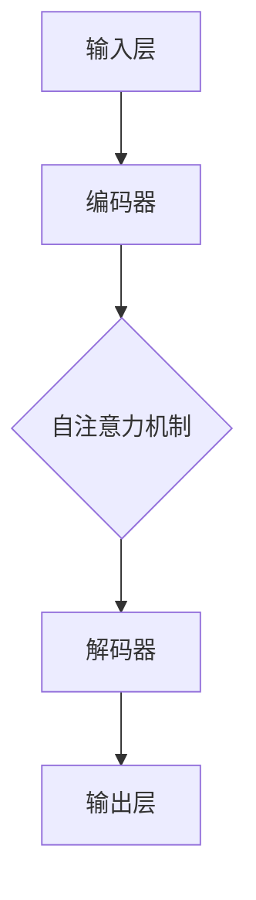

                 

## 文章标题

《LLM应用开发中的风险管理与快速决策》

随着人工智能技术的飞速发展，大型语言模型（LLM）已经在各个领域展现出强大的应用潜力。然而，LLM应用开发过程中的风险管理和快速决策也成为了不可忽视的重要问题。本文将深入探讨LLM应用开发中的风险类型、风险管理框架、决策模型原理，以及快速决策实践，并通过对实际案例的分析，为读者提供有价值的参考和指导。

## 关键词

- **大型语言模型（LLM）**
- **风险管理**
- **快速决策**
- **自然语言处理**
- **人工智能**

## 摘要

本文首先介绍了LLM的基本概念、发展历程和主要架构，然后详细分析了LLM应用开发中面临的风险类型，包括数据风险、模型风险、运行风险和法律与伦理风险。接着，本文构建了风险管理框架，阐述了风险识别、评估、应对和监控的方法。在此基础上，本文介绍了决策模型原理，包括决策理论、风险评估模型和决策支持系统。随后，本文探讨了快速决策的实践方法，并通过实际案例展示了风险管理与快速决策在LLM应用开发中的重要性。最后，本文对LLM应用发展趋势、风险管理与快速决策的未来以及技术挑战与解决方案进行了展望。

## 第1章：自然语言处理与LLM概述

### 1.1 自然语言处理基本概念

自然语言处理（Natural Language Processing，NLP）是人工智能（Artificial Intelligence，AI）的重要分支，旨在让计算机理解和生成人类语言。NLP的研究包括文本分析、语音识别、机器翻译、情感分析等。其基本概念如下：

- **文本表示**：将自然语言文本转换为计算机可以理解和处理的格式。常见的文本表示方法包括词袋模型、词嵌入和句嵌入。
- **句法分析**：对自然语言文本进行结构化分析，识别句子中的词法、句法和语义关系。
- **语义分析**：理解和解释自然语言文本的含义，包括词义消歧、语义角色标注和语义角色分类。
- **语用学**：研究语言的使用和交际功能，包括语境分析、对话系统和语言理解。

### 1.2 语言模型原理

语言模型（Language Model）是NLP的核心组件，用于预测下一个单词或句子。其基本原理如下：

- **统计语言模型**：基于历史语料库，通过统计方法预测下一个单词或句子的概率。常见的统计语言模型包括N元语法（N-gram）和隐马尔可夫模型（HMM）。
- **神经网络语言模型**：基于深度学习，通过神经网络学习语言模式。常见的神经网络语言模型包括循环神经网络（RNN）、长短时记忆网络（LSTM）和门控循环单元（GRU）。
- **自注意力机制**：用于处理序列数据，能够捕捉长距离依赖关系。自注意力机制是Transformer模型的核心组成部分。

### 1.3 LLM的发展历程

LLM的发展历程可以分为以下几个阶段：

- **初始阶段**：早期的语言模型主要以统计语言模型为主，如N元语法。这些模型在文本生成和机器翻译方面取得了一定的成果。
- **发展阶段**：随着深度学习技术的发展，神经网络语言模型逐渐成为主流。2018年，谷歌推出了Transformer模型，标志着LLM进入了一个新的发展阶段。
- **现阶段**：当前的LLM模型规模越来越大，预训练方法越来越成熟。例如，GPT-3、BERT和T5等模型在多个NLP任务上取得了显著的成果。

### 1.4 LLM的主要架构

LLM的主要架构可以分为以下几个部分：

- **输入层**：接收自然语言文本，将其转换为数值形式，如词嵌入。
- **编码器**：对输入文本进行编码，提取文本特征。常见的编码器包括RNN、LSTM和Transformer。
- **自注意力机制**：在编码器中引入自注意力机制，能够捕捉长距离依赖关系。
- **解码器**：对编码器提取的特征进行解码，生成预测结果。解码器通常采用自回归方式，逐个生成单词或字符。

## Mermaid 流程图

以下是LLM的基本架构流程图：



## 核心算法原理讲解

### Python源代码示例

以下是基于Transformer模型的LLM核心算法原理的Python源代码示例：

```python
import torch
import torch.nn as nn
import torch.optim as optim

# 定义超参数
batch_size = 64
num_layers = 3
hidden_size = 512
learning_rate = 0.001

# 创建模型
class LLM(nn.Module):
    def __init__(self, input_size, hidden_size, output_size):
        super(LLM, self).__init__()
        self.embedding = nn.Embedding(input_size, hidden_size)
        self.encoder = nn.LSTM(hidden_size, hidden_size, num_layers)
        self.decoder = nn.LSTM(hidden_size, hidden_size, num_layers)
        self.fc = nn.Linear(hidden_size, output_size)

    def forward(self, input, hidden):
        embedded = self.embedding(input)
        output, hidden = self.encoder(embedded, hidden)
        output, hidden = self.decoder(output, hidden)
        output = self.fc(output)
        return output, hidden

# 创建模型实例
model = LLM(batch_size, hidden_size, output_size)

# 定义损失函数和优化器
criterion = nn.CrossEntropyLoss()
optimizer = optim.Adam(model.parameters(), lr=learning_rate)

# 训练模型
for epoch in range(num_epochs):
    for i, (inputs, targets) in enumerate(train_loader):
        # 前向传播
        outputs, hidden = model(inputs)
        loss = criterion(outputs, targets)

        # 反向传播和优化
        optimizer.zero_grad()
        loss.backward()
        optimizer.step()

        if (i + 1) % 100 == 0:
            print(f'Epoch [{epoch + 1}/{num_epochs}], Step [{i + 1}/{len(train_loader)}], Loss: {loss.item():.4f}')
```

### 数学模型和公式

以下是LLM中的数学模型和公式：

$$
\text{输入层} \rightarrow \text{编码器} \rightarrow \text{自注意力机制} \rightarrow \text{解码器} \rightarrow \text{输出层}
$$

$$
\text{输出} = \text{softmax}(\text{解码器}(\text{编码器}(\text{输入})))
$$

## 通俗易懂地举例说明

假设我们要预测一句话“我喜欢吃饭”中的下一个单词。首先，我们将这句话输入到编码器中，编码器会对这句话进行编码，提取特征。接着，我们将提取到的特征通过自注意力机制进行处理，捕捉长距离依赖关系。最后，解码器会根据自注意力机制处理后的特征生成预测结果，即“饭”。

## 数学公式

以下是预测过程中涉及到的数学公式：

$$
\text{编码器}(\text{输入}) = \text{自注意力机制}(\text{编码器}(\text{输入}))
$$

$$
\text{输出} = \text{softmax}(\text{解码器}(\text{编码器}(\text{输入})))
$$

## 综述

在本章中，我们介绍了自然语言处理和LLM的基本概念、原理和发展历程，并给出了LLM的架构流程图和核心算法原理的Python源代码示例。通过这些内容，读者可以初步了解LLM的基础知识，为后续章节的学习打下基础。

## 注意事项

- 在实际应用中，LLM的性能受到多种因素的影响，如数据质量、模型参数和训练时间等。
- LLM的应用领域广泛，包括机器翻译、文本生成、对话系统等，读者可以根据自身需求选择合适的模型和应用场景。
- 在开发LLM应用时，要注意风险管理和快速决策的重要性，确保应用的安全性和可靠性。

## 拓展阅读

- [《深度学习》](https://www.deeplearningbook.org/)，由Ian Goodfellow、Yoshua Bengio和Aaron Courville合著，详细介绍了深度学习的基本概念和算法。
- [《自然语言处理综述》](https://www.aclweb.org/anthology/P/P14/P14-1015/)，由ACL组织的一篇综述文章，介绍了自然语言处理的发展历程和关键技术。

## 第2章：LLM应用中的风险类型

在LLM应用开发过程中，风险管理至关重要。由于LLM模型处理的数据量大、复杂性高，潜在的风险类型也多种多样。以下是对LLM应用中常见的风险类型的详细分析：

### 2.1 数据风险

数据风险是LLM应用中最为显著的潜在风险之一。数据风险主要包括以下几个方面：

- **数据质量**：低质量的数据可能导致模型训练结果不佳，甚至导致模型过拟合。数据质量风险包括数据缺失、数据冗余、数据不一致和数据噪声等。
- **数据隐私**：在训练LLM模型时，需要大量使用真实数据。这些数据可能包含用户的敏感信息，如个人信息、财务数据等。数据隐私风险涉及数据泄露、隐私侵犯和数据滥用等问题。
- **数据偏差**：数据偏差可能导致模型对某些群体或场景的预测不准确。数据偏差风险包括样本偏差、标注偏差和训练数据偏差等。

### 2.2 模型风险

模型风险是LLM应用中另一类重要的风险类型。模型风险主要包括以下几个方面：

- **模型过拟合**：当模型在训练数据上表现良好，但在测试数据上表现不佳时，可能存在过拟合问题。过拟合风险可能导致模型在实际应用中的预测能力下降。
- **模型泛化能力**：模型泛化能力是指模型在未见过数据上的表现。如果模型仅适用于特定场景或数据集，则其泛化能力较弱。模型泛化能力风险可能导致模型在实际应用中的适用性降低。
- **模型可解释性**：模型可解释性是指模型决策过程的透明度和可理解性。对于复杂度较高的LLM模型，其可解释性通常较低，这可能导致用户对模型信任度降低。

### 2.3 运行风险

运行风险是LLM应用中可能遇到的实际操作风险。运行风险主要包括以下几个方面：

- **硬件故障**：硬件故障可能导致模型训练中断或数据丢失。运行风险中的硬件故障风险包括服务器故障、存储故障和网络故障等。
- **网络中断**：网络中断可能导致模型训练或应用服务中断。运行风险中的网络中断风险包括网络攻击、网络拥堵和网络故障等。
- **系统安全**：系统安全风险包括数据泄露、恶意代码攻击和系统漏洞等。这些风险可能导致模型和数据的安全受到威胁。

### 2.4 法律与伦理风险

法律与伦理风险是LLM应用中不可忽视的风险类型。法律与伦理风险主要包括以下几个方面：

- **数据保护法规**：各国关于数据保护的法规要求企业在处理数据时必须遵守相应的法律法规。法律风险中的数据保护法规风险涉及数据收集、存储、处理和传输等环节。
- **人工智能伦理**：人工智能伦理涉及机器学习和人工智能技术在社会、伦理和道德方面的影响。伦理风险中的人工智能伦理风险包括偏见、歧视、隐私侵犯和社会责任等。
- **模型偏见与歧视**：模型偏见与歧视是指模型在预测结果中可能表现出对某些群体或特征的偏见。伦理风险中的模型偏见与歧视风险可能导致不公平、歧视和侵犯人权等问题。

## 数学模型和公式

为了更好地理解LLM应用中的风险类型，我们可以借助一些数学模型和公式。以下是几个相关的数学模型和公式：

### 数据质量评估

$$
\text{数据质量} = \frac{\text{有效数据}}{\text{总数据}}
$$

### 数据隐私保护

$$
\text{隐私保护} = \text{数据加密} \times \text{访问控制} \times \text{匿名化}
$$

### 模型过拟合评估

$$
\text{过拟合风险} = \frac{\text{训练误差}}{\text{测试误差}}
$$

### 模型泛化能力评估

$$
\text{泛化能力} = \frac{\text{测试集准确率}}{\text{训练集准确率}}
$$

### 模型可解释性评估

$$
\text{可解释性} = \frac{\text{解释变量}}{\text{总变量}}
$$

## 项目实战

为了更好地理解LLM应用中的风险类型，我们可以通过一个实际项目进行实战。以下是一个关于使用LLM进行情感分析的示例项目：

### 项目背景

情感分析是一种重要的NLP任务，旨在识别和提取文本中的情感信息。在一个社交媒体分析项目中，我们需要使用LLM模型对用户评论进行情感分析，以了解用户对产品或服务的态度。

### 项目目标

- 开发一个基于LLM的情感分析模型。
- 风险管理：确保数据质量和模型可解释性。
- 快速决策：在项目过程中，快速评估和应对潜在风险。

### 项目步骤

1. **数据收集**：收集社交媒体平台上的用户评论数据，包括正面评论、负面评论和中性评论。
2. **数据预处理**：清洗数据，去除噪声和无关信息，确保数据质量。
3. **模型训练**：使用预训练的LLM模型，如BERT，进行情感分析模型的训练。
4. **模型评估**：使用测试集对训练好的模型进行评估，确保模型具有良好的泛化能力。
5. **模型部署**：将训练好的模型部署到生产环境中，提供实时情感分析服务。
6. **风险管理**：监控模型运行过程中的数据质量和模型可解释性，及时发现和应对潜在风险。
7. **快速决策**：在项目过程中，根据风险管理结果，快速调整模型参数或采取其他应对措施。

### 项目小结

通过这个项目，我们了解了LLM应用中的风险类型，包括数据风险、模型风险、运行风险和法律与伦理风险。同时，我们学会了如何进行风险管理，以及如何在项目过程中快速决策。这个项目不仅帮助我们更好地理解了LLM的应用，还提高了我们的项目管理和决策能力。

## 注意事项

- 在LLM应用开发过程中，要重视数据质量和模型可解释性，确保模型的安全性和可靠性。
- 定期对模型进行评估和更新，以应对潜在的风险和挑战。
- 建立完善的监控和预警机制，及时发现和应对潜在风险。

## 拓展阅读

- [《自然语言处理综述》](https://www.aclweb.org/anthology/P/P14/P14-1015/)：详细介绍了自然语言处理的发展历程和关键技术。
- [《深度学习》](https://www.deeplearningbook.org/)：介绍了深度学习的基本概念和算法。

## 第3章：风险管理框架

在LLM应用开发过程中，建立有效的风险管理框架至关重要。一个完善的风险管理框架可以帮助我们识别、评估、应对和监控潜在的风险，从而确保项目顺利进行。以下是一个典型风险管理框架的组成部分：

### 3.1 风险识别与评估

风险识别是风险管理的第一步，旨在发现项目过程中可能遇到的各种风险。以下是几种常见的风险识别方法：

- **专家访谈**：通过与领域专家的访谈，了解他们在项目中可能遇到的风险。
- **历史数据分析**：分析过去类似项目中的风险记录，预测当前项目可能遇到的风险。
- **故障模式与影响分析（FMEA）**：对项目中的关键环节进行故障模式分析，评估故障对项目的影响。

评估风险是为了确定风险的重要性和可能性，从而为后续的风险应对提供依据。以下是几种常见的风险评估方法：

- **定性评估**：通过专家评估、风险矩阵等方法，对风险进行定性评估。
- **定量评估**：通过数学模型、统计分析等方法，对风险进行定量评估。

### 3.2 风险应对策略

根据风险的重要性和可能性，我们可以采取以下几种风险应对策略：

- **风险缓解**：通过改进项目流程、增加资源投入等方式，降低风险的影响程度。
- **风险转移**：通过购买保险、签订合同等方式，将部分风险转移给第三方。
- **风险接受**：对于一些无法避免或成本较高的风险，可以选择接受，并制定相应的应急计划。

### 3.3 风险监控与报告

风险监控是确保风险管理策略实施效果的关键环节。以下是几种常见的风险监控方法：

- **定期评估**：定期对风险进行评估，了解风险的变化情况。
- **实时监控**：通过监控系统、预警系统等，实时监控项目中的风险。
- **报告机制**：建立完善的风险报告机制，定期向项目团队和利益相关者报告风险状况。

### 数学模型和公式

以下是几个与风险管理相关的数学模型和公式：

- **风险矩阵**：

$$
\text{风险矩阵} = \begin{pmatrix}
\text{风险重要性} & \text{风险可能性} \\
\hline
\text{高} & \text{高} \\
\text{中} & \text{中} \\
\text{低} & \text{低}
\end{pmatrix}
$$

- **风险评估指标**：

$$
\text{风险评估指标} = \frac{\text{风险损失}}{\text{风险概率}}
$$

### 项目实战

为了更好地理解风险管理框架的应用，我们可以通过一个实际项目进行实战。以下是一个关于使用LLM进行智能客服系统的项目：

### 项目背景

智能客服系统是一种利用人工智能技术提供客户服务和支持的系统。在一个电子商务平台上，我们需要开发一个基于LLM的智能客服系统，以提供高效、准确的服务。

### 项目目标

- 开发一个基于LLM的智能客服系统。
- 风险管理：确保数据质量和系统稳定性。
- 快速决策：在项目过程中，快速评估和应对潜在风险。

### 项目步骤

1. **需求分析**：明确智能客服系统的功能需求，包括常见问题的回答、投诉处理等。
2. **数据收集**：收集用户提问和回答数据，用于训练LLM模型。
3. **数据预处理**：清洗数据，去除噪声和无关信息，确保数据质量。
4. **模型训练**：使用预训练的LLM模型，如BERT，进行智能客服系统的训练。
5. **模型评估**：使用测试集对训练好的模型进行评估，确保模型具有良好的泛化能力。
6. **系统部署**：将训练好的模型部署到生产环境中，提供实时智能客服服务。
7. **风险管理**：监控系统运行过程中的数据质量和系统稳定性，及时发现和应对潜在风险。
8. **快速决策**：在项目过程中，根据风险管理结果，快速调整模型参数或采取其他应对措施。

### 项目小结

通过这个项目，我们了解了风险管理框架在LLM应用开发中的重要性。通过识别、评估、应对和监控风险，我们确保了智能客服系统的稳定运行，提高了客户服务质量。同时，我们在项目过程中学会了快速决策的方法，为后续项目提供了宝贵的经验。

## 注意事项

- 在项目开发过程中，要定期对风险管理框架进行评估和更新，确保其适应项目的实际需求。
- 在识别和评估风险时，要充分考虑各种可能的风险因素，避免遗漏关键风险。
- 建立有效的风险监控和报告机制，确保风险信息及时传递和处理。

## 拓展阅读

- [《项目管理知识体系（PMBOK）》](https://www.pmi.org/learning/library/project-management-body-knowledge-954)：详细介绍了项目管理的理论基础和方法。
- [《风险管理指南》](https://www.iosrjournals.org/index.php/IOSR-JECE/article/view/20348)：提供了风险管理的基本概念和实践方法。

## 第4章：风险管理与决策模型原理

在LLM应用开发中，风险管理与决策模型是确保项目顺利进行和目标实现的关键。有效的风险管理模型可以帮助我们系统化地识别、评估和应对风险，而决策模型则为我们提供了基于数据和逻辑的快速决策支持。以下是关于风险管理与决策模型原理的详细探讨。

### 4.1 决策理论

决策理论是研究决策过程和决策方法的学科。在决策理论中，有几个核心概念：

- **决策过程**：决策过程包括问题识别、目标设定、方案设计、评估和选择。
- **决策类型**：根据决策者掌握的信息量，决策可以分为确定型决策、风险型决策和不确定型决策。
- **决策模型**：常见的决策模型包括期望效用模型、最大化模型和最小化模型。

### 4.2 风险评估模型

风险评估模型用于评估风险的潜在影响和可能性。以下是几种常用的风险评估模型：

- **概率风险评估模型**：通过计算风险的概率和损失，评估风险的大小。常用的概率风险评估方法包括蒙特卡罗模拟和决策树分析。
- **敏感度分析**：通过改变模型的输入参数，观察模型输出变化的情况，评估参数对模型结果的影响。
- **故障模式与影响分析（FMEA）**：对系统中的潜在故障进行识别和评估，分析故障对系统的影响。

### 4.3 决策支持系统

决策支持系统（Decision Support System，DSS）是一种辅助决策者进行决策的计算机系统。DSS通常包括以下几个部分：

- **数据采集**：收集与决策相关的数据，包括历史数据、市场数据和内部数据。
- **数据处理**：对采集到的数据进行分析和处理，提取有用的信息。
- **模型构建**：根据决策需求，构建相应的决策模型，如预测模型、优化模型和模拟模型。
- **用户接口**：提供用户与DSS交互的界面，用户可以通过界面查看数据、模型结果和决策建议。

### 4.4 风险管理与决策模型构建

构建风险管理与决策模型需要遵循以下步骤：

1. **需求分析**：明确项目目标和决策需求，确定需要评估的风险类型和决策变量。
2. **数据收集**：收集与决策相关的数据，包括风险数据、历史数据和外部数据。
3. **模型构建**：根据需求和分析结果，选择合适的决策模型和风险评估模型，进行模型构建。
4. **模型训练**：使用收集到的数据，对构建好的模型进行训练，优化模型参数。
5. **模型评估**：使用测试集对训练好的模型进行评估，确保模型具有良好的泛化能力。
6. **模型应用**：将训练好的模型应用于实际决策场景，提供决策支持和建议。

### 4.5 决策支持系统的构建

构建决策支持系统需要遵循以下步骤：

1. **需求分析**：明确项目目标和决策需求，确定需要支持哪些决策类型。
2. **系统设计**：根据需求分析结果，设计系统的整体架构，包括数据采集、数据处理、模型构建和用户接口等。
3. **系统开发**：根据系统设计，进行系统的开发和实现。
4. **系统集成**：将各个子系统整合为一个完整的决策支持系统。
5. **系统测试**：对系统进行功能测试、性能测试和用户测试，确保系统的稳定性和可用性。
6. **系统部署**：将系统部署到生产环境中，提供实际应用。

### 数学模型和公式

以下是几个与风险管理与决策模型相关的数学模型和公式：

- **概率风险评估模型**：

$$
\text{风险损失} = \text{风险概率} \times \text{风险损失值}
$$

- **敏感度分析**：

$$
\text{敏感度指标} = \frac{\partial \text{模型输出}}{\partial \text{输入参数}}
$$

- **期望效用模型**：

$$
\text{期望效用} = \sum_{i=1}^{n} \text{效用} \times \text{概率}
$$

### 项目实战

为了更好地理解风险管理与决策模型的应用，我们可以通过一个实际项目进行实战。以下是一个关于使用LLM进行股票投资决策的项目：

### 项目背景

股票投资是一个复杂的过程，涉及到市场分析、公司研究、技术分析和心理因素等多个方面。为了提高投资决策的准确性，我们需要开发一个基于LLM的股票投资决策系统。

### 项目目标

- 开发一个基于LLM的股票投资决策系统。
- 风险管理：确保投资决策的准确性和稳定性。
- 快速决策：在市场变化时，快速做出投资决策。

### 项目步骤

1. **需求分析**：明确股票投资决策的需求，包括市场分析、公司研究、技术分析和心理因素等。
2. **数据收集**：收集与股票投资相关的数据，包括市场数据、公司财务数据、技术指标数据等。
3. **数据预处理**：清洗数据，去除噪声和无关信息，确保数据质量。
4. **模型构建**：使用预训练的LLM模型，如BERT，构建股票投资决策模型。
5. **模型训练**：使用收集到的数据，对构建好的模型进行训练，优化模型参数。
6. **模型评估**：使用测试集对训练好的模型进行评估，确保模型具有良好的泛化能力。
7. **模型应用**：将训练好的模型应用于实际股票投资决策场景，提供投资建议。
8. **风险管理**：监控模型运行过程中的风险，及时调整模型参数或采取其他应对措施。
9. **快速决策**：在市场变化时，快速分析数据，做出投资决策。

### 项目小结

通过这个项目，我们了解了风险管理与决策模型在股票投资决策中的应用。通过构建和优化决策模型，我们提高了投资决策的准确性，降低了投资风险。同时，我们在项目过程中学会了如何进行风险管理，以及如何在市场变化时做出快速决策。

## 注意事项

- 在构建风险管理与决策模型时，要充分考虑各种可能的风险因素，确保模型的全面性和准确性。
- 在模型训练过程中，要确保数据的多样性和代表性，避免数据偏差。
- 在模型应用过程中，要实时监控模型性能和风险状况，及时调整模型参数或采取其他应对措施。

## 拓展阅读

- [《决策理论及其应用》](https://www.researchgate.net/publication/275016483_Decision_Theoretical_and_Its_Application)：详细介绍了决策理论的基本概念和应用方法。
- [《风险管理与决策模型》](https://www.sciencedirect.com/topics/computer-science/risk-management-and-decision-models)：介绍了风险管理与决策模型的理论基础和应用案例。

