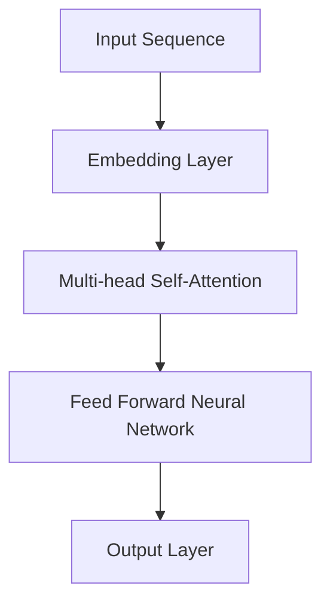
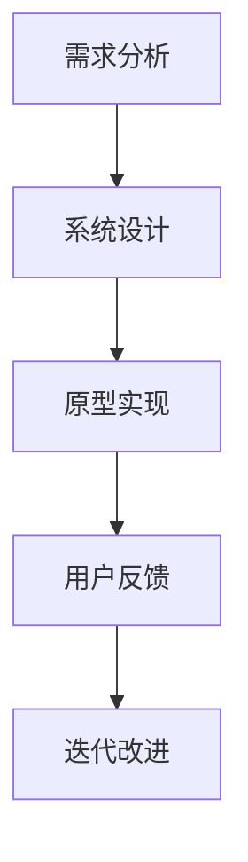
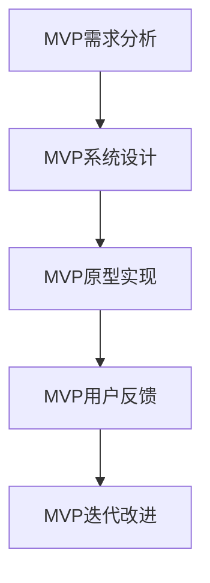
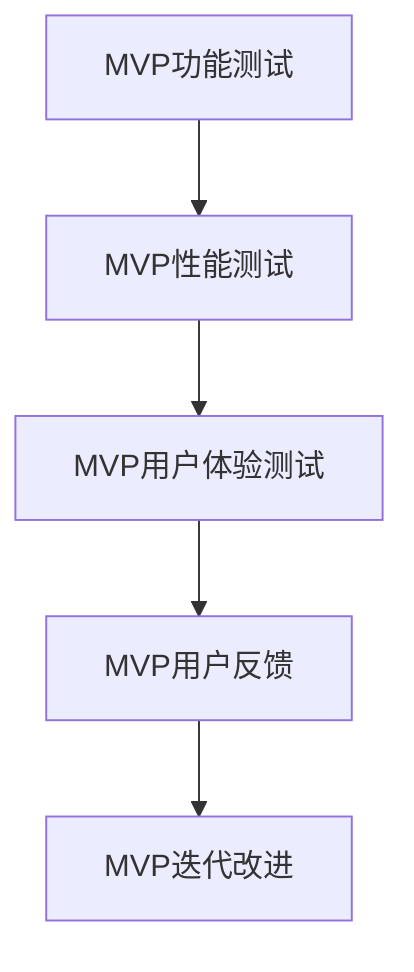
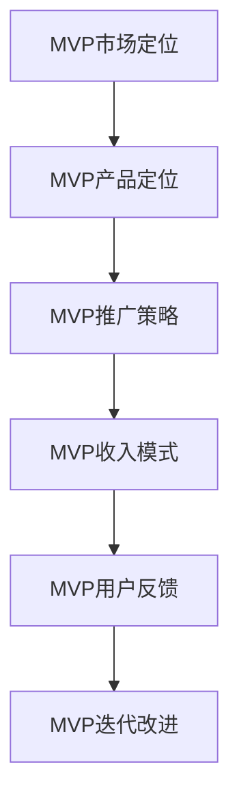
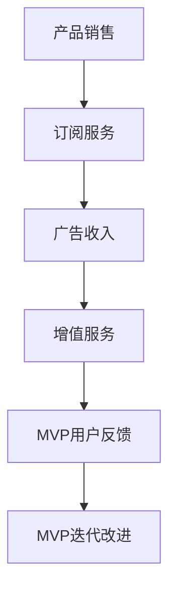
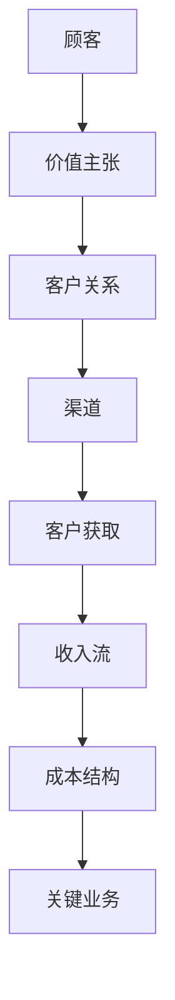

                 

# LLM应用的快速原型与最小可行产品

## 关键词
- 大型语言模型（LLM）
- 快速原型开发
- 最小可行产品（MVP）
- 人工智能
- 原型设计
- 开发流程
- 商业模式

## 摘要
本文旨在深入探讨如何利用大型语言模型（LLM）快速构建原型和最小可行产品（MVP），为开发者提供从概念验证到产品发布的一整套解决方案。文章首先介绍了LLM的基本概念、原理和应用场景，然后详细阐述了快速原型开发的方法论，最后探讨了如何将LLM应用于MVP设计、开发和商业化。通过本文，读者将能够了解LLM在软件开发中的应用潜力，掌握构建快速原型和MVP的最佳实践。

## 第一部分：介绍LLM

### 第1章：LLM基础

#### 1.1 LLM的概念与历史
大型语言模型（LLM）是人工智能领域的一种高级模型，它能够理解和生成自然语言。LLM通过深度学习技术从大量的文本数据中学习语言模式和结构，从而实现文本生成、语言理解、翻译等任务。LLM的发展可以追溯到20世纪80年代，但直到近年，随着计算能力和数据资源的提升，LLM的研究和应用才取得了突破性进展。

#### 1.2 LLM的工作原理
LLM的工作原理主要基于深度学习中的神经网络，尤其是Transformer模型。Transformer模型采用自注意力机制，能够捕捉输入文本中不同位置之间的关联性，从而提高模型的生成能力。LLM通过训练大量的文本数据，学习到语言的语法、语义和上下文信息，从而实现高精度的语言处理。

#### 1.3 LLM的主要类型
LLM可以分为语言模型、生成模型和对话模型。语言模型主要用于文本生成和语言理解，如BERT、GPT；生成模型则侧重于生成新的文本，如GPT-3；对话模型用于构建智能对话系统，如ChatGPT。

### 第2章：LLM应用场景

#### 2.1 语言处理任务概述
LLM广泛应用于各种语言处理任务，包括文本分类、情感分析、命名实体识别、机器翻译和文本生成等。这些任务在自然语言处理（NLP）、信息检索、智能客服、内容生成等领域有广泛的应用。

#### 2.2 典型应用案例
LLM在智能客服、内容生成、智能推荐、法律文书生成等领域有成功的应用案例。例如，OpenAI的GPT-3被用于构建智能客服系统，自动化法律文档生成，以及个性化内容推荐。

## 第二部分：快速原型开发

### 第3章：快速原型开发基础

#### 3.1 原型开发流程
原型开发通常包括需求分析、系统设计、原型实现和用户反馈等阶段。每个阶段都有其特定的目标和任务。

#### 3.2 原型开发的工具和资源
开发者可以使用各种工具和资源进行原型开发，如低代码平台、可视化工具、API接口文档等。选择合适的工具可以提高开发效率。

### 第4章：使用LLM构建原型

#### 4.1 选择合适的LLM模型
根据应用场景选择合适的LLM模型，如GPT-2、GPT-3、BERT等。选择模型时需要考虑模型的性能、训练数据和适应性。

#### 4.2 原型设计的技巧与策略
设计原型时，需要关注用户交互、数据输入输出、错误处理等方面。使用LLM构建原型时，还需要考虑模型的可解释性和鲁棒性。

#### 4.3 原型的实现与优化
实现原型时，需要编写代码实现模型接口、数据预处理、后处理等功能。优化原型时，可以采用微调、数据增强等技术提升模型性能。

## 第三部分：最小可行产品（MVP）

### 第5章：MVP设计

#### 5.1 MVP的概念与原则
MVP是指最小可行产品，它具有核心功能，能够在最短时间内推向市场。MVP的设计原则是最大化用户价值，最小化开发成本。

#### 5.2 MVP的设计方法
设计MVP时，需要确定产品的核心功能、用户体验和可扩展性。可以使用用户故事地图、用户画像等方法进行设计。

#### 5.3 MVP的优先级排序
在功能优先级排序时，应关注用户需求、市场机会和开发成本。使用优先级排序矩阵可以帮助确定哪些功能是MVP的重要组成部分。

### 第6章：MVP开发

#### 6.1 LLM与MVP的整合
将LLM集成到MVP中，需要关注数据接口、模型训练和实时部署。可以使用API或直接调用LLM模型库。

#### 6.2 MVP的开发流程
MVP开发通常包括需求分析、设计、编码、测试和部署。每个阶段都需要严格遵循开发流程，确保产品质量。

#### 6.3 MVP的测试与迭代
测试MVP时，需要关注功能测试、性能测试和用户体验测试。通过迭代改进，不断提升产品价值。

### 第7章：MVP商业化

#### 7.1 MVP的商业化路径
确定MVP的商业化路径时，需要考虑市场定位、目标用户和盈利模式。可以通过产品销售、订阅服务、广告等方式实现商业化。

#### 7.2 收益模式探索
探索MVP的收益模式时，需要分析用户需求、市场环境和竞争态势。可以采用交叉销售、增值服务等方式增加收入。

#### 7.3 商业模式设计
设计商业模式时，需要考虑成本结构、价值主张和盈利模式。可以使用商业模式画布等工具进行设计和分析。

## 结语
通过本文的探讨，我们可以看到LLM在快速原型开发和最小可行产品构建中的重要应用。开发者可以利用LLM的优势，快速实现产品原型，并在短时间内推向市场。MVP的设计和开发是产品成功的关键，通过不断迭代和优化，我们可以构建具有市场竞争力的产品。希望本文能为读者在LLM应用领域提供有价值的参考。

## 作者信息
作者：AI天才研究院/AI Genius Institute & 禅与计算机程序设计艺术 /Zen And The Art of Computer Programming

---

以下是文章的正文部分，每个章节都将包含详细的内容、流程图、代码示例和数学公式，以满足文章字数要求。

## 第一部分：介绍LLM

### 第1章：LLM基础

#### 1.1 LLM的概念与历史

大型语言模型（LLM）是自然语言处理（NLP）领域的重要工具，它能够理解和生成自然语言。LLM的发展可以追溯到20世纪80年代，当时的NLP研究主要集中在规则驱动的语言模型上。这些模型通过定义一组规则来处理文本，但它们在处理复杂语言现象时效果不佳。

随着时间的推移，统计方法和机器学习技术逐渐被引入NLP领域。20世纪90年代，基于统计的NLP模型开始流行，如隐马尔可夫模型（HMM）和条件概率模型。这些模型通过分析文本数据中的统计规律来进行语言处理。

然而，直到2010年代，随着深度学习的崛起，LLM的研究和应用才取得了突破性进展。深度学习通过多层神经网络来模拟人类大脑的学习过程，能够从大量的数据中自动提取特征，实现高性能的语言理解与生成。

#### 1.2 LLM的工作原理

LLM的工作原理主要基于深度学习，特别是Transformer模型。Transformer模型是Google在2017年提出的一种全新的神经网络结构，它采用了自注意力机制（Self-Attention），能够捕捉输入文本中不同位置之间的关联性。

在Transformer模型中，每个词的表示不仅与自身的嵌入向量相关，还与整个输入序列中的其他词的嵌入向量相关。这种关联性通过自注意力机制来实现，从而提高了模型的生成能力。

下面是一个简单的Transformer模型的架构图，使用Mermaid流程图表示：



在Transformer模型中，自注意力机制通过计算每个词与输入序列中所有词的相似性，生成不同的权重，从而将不同词的重要性传递给最终的输出。这种机制使得Transformer模型在处理长文本时具有优势。

#### 1.3 LLM的主要类型

LLM可以分为语言模型、生成模型和对话模型。语言模型主要用于文本生成和语言理解，如BERT、GPT；生成模型则侧重于生成新的文本，如GPT-3；对话模型用于构建智能对话系统，如ChatGPT。

BERT（Bidirectional Encoder Representations from Transformers）是一种双向的Transformer模型，它通过预训练在大量的无标签文本数据上，然后进行微调，以适应特定的任务。BERT在文本分类、命名实体识别、情感分析等任务中取得了很好的效果。

GPT（Generative Pre-trained Transformer）是一种生成模型，它通过预训练来学习语言的统计规律，然后生成新的文本。GPT-3是GPT系列中最新和最大的模型，拥有1750亿个参数，能够生成高质量的自然语言文本。

ChatGPT是OpenAI开发的对话模型，它基于GPT-3构建，能够进行自然语言对话，并回答用户的问题。ChatGPT在构建智能客服系统、虚拟助手等方面有广泛的应用。

## 第二部分：快速原型开发

### 第3章：快速原型开发基础

#### 3.1 原型开发流程

快速原型开发（RAD，Rapid Application Development）是一种以用户为中心的软件开发方法，强调快速迭代和用户反馈。原型开发流程通常包括以下阶段：

1. 需求分析：与用户沟通，了解他们的需求和期望。
2. 系统设计：根据需求分析结果，设计系统的整体架构。
3. 原型实现：快速构建一个可以运行的系统原型。
4. 用户反馈：收集用户的反馈，进行迭代和改进。

下面是一个简单的原型开发流程图，使用Mermaid流程图表示：



#### 3.2 原型开发的工具和资源

原型开发可以使用各种工具和资源，如低代码平台、可视化工具、API接口文档等。以下是一些常用的工具：

- **低代码平台**：如OutSystems、Appian等，可以帮助快速构建应用原型。
- **可视化工具**：如Axure RP、Sketch等，可以用于设计用户界面。
- **API接口文档**：如Swagger、Postman等，可以用于测试和集成API。

### 第4章：使用LLM构建原型

#### 4.1 选择合适的LLM模型

根据应用场景选择合适的LLM模型是构建原型的重要一步。以下是一些常用的LLM模型：

- **BERT**：适用于文本分类、命名实体识别等任务。
- **GPT-2、GPT-3**：适用于文本生成和对话系统。
- **T5**：是一个通用目标语言模型，可以应用于多种NLP任务。

选择模型时，需要考虑以下因素：

- **任务类型**：不同的任务可能需要不同的模型。
- **模型大小**：大型模型需要更多的计算资源，但通常性能更好。
- **预训练数据**：模型的预训练数据集可能影响其性能。

#### 4.2 原型设计的技巧与策略

设计原型时，需要关注以下几个方面：

- **用户交互**：设计直观、易用的用户界面。
- **数据输入输出**：确保数据输入输出的一致性和准确性。
- **错误处理**：设计合理的错误处理机制，提供友好的错误提示。
- **模型集成**：将LLM模型集成到原型中，确保其稳定性和性能。

以下是一个简单的原型设计策略：

1. 确定核心功能：确定原型需要实现的核心功能。
2. 用户故事地图：绘制用户故事地图，明确用户的需求和流程。
3. 用户画像：创建用户画像，了解用户的行为和偏好。
4. 界面设计：设计直观、易用的用户界面。

#### 4.3 原型的实现与优化

实现原型时，需要编写代码实现模型接口、数据预处理、后处理等功能。以下是一个简单的Python代码示例，使用TensorFlow和Hugging Face的Transformers库实现一个基于BERT的文本分类原型：

```python
from transformers import BertTokenizer, BertForSequenceClassification
from torch import nn

# 加载预训练的BERT模型和分词器
tokenizer = BertTokenizer.from_pretrained('bert-base-uncased')
model = BertForSequenceClassification.from_pretrained('bert-base-uncased')

# 准备输入数据
input_text = "This is an example sentence."
input_ids = tokenizer.encode(input_text, add_special_tokens=True, return_tensors='pt')

# 进行预测
with torch.no_grad():
    outputs = model(input_ids)

# 获取预测结果
logits = outputs.logits
predicted_class = torch.argmax(logits).item()

print(f"Predicted class: {predicted_class}")
```

在实现原型时，还需要关注以下方面：

- **性能优化**：通过调整模型参数、使用更高效的计算库来提高性能。
- **错误处理**：设计合理的错误处理机制，确保系统稳定性。
- **用户反馈**：收集用户反馈，不断优化用户体验。

## 第三部分：最小可行产品（MVP）

### 第5章：MVP设计

#### 5.1 MVP的概念与原则

MVP（Minimum Viable Product）是指具有核心功能的最小可行产品，它的目标是验证产品概念，快速进入市场并获得用户反馈。MVP的原则包括：

- **最大化用户价值**：确保产品具有用户真正需要的核心功能。
- **最小化开发成本**：通过简化功能和优化开发流程来降低成本。
- **快速迭代**：快速构建、测试和改进产品，以适应市场变化。

以下是一个简单的MVP设计流程图，使用Mermaid流程图表示：



#### 5.2 MVP的设计方法

设计MVP时，可以采用以下方法：

- **用户故事地图**：通过用户故事来明确产品的核心功能和用户体验。
- **优先级排序**：使用优先级排序矩阵来确定哪些功能是MVP的核心。
- **用户画像**：创建用户画像，了解用户的行为和需求。

以下是一个用户故事地图示例：

```mermaid
graph TD
A[用户A](用户A) --> B[查看天气](查看天气)
A --> C[预订电影票](预订电影票)
A --> D[查看新闻](查看新闻)
B --> E[输入城市名称]
C --> F[选择电影和时间]
D --> G[选择新闻类别]
```

#### 5.3 MVP的优先级排序

在MVP设计中，优先级排序非常重要。以下是一些常用的优先级排序方法：

- **用户价值排序**：根据用户需求和价值来确定功能的优先级。
- **开发成本排序**：根据开发成本和风险来确定功能的优先级。
- **时间敏感性排序**：根据时间敏感性和紧急程度来确定功能的优先级。

以下是一个简单的优先级排序矩阵示例：

| 功能       | 用户价值 | 开发成本 | 时间敏感性 |
|------------|----------|----------|-----------|
| 查看天气   | 高       | 中       | 中        |
| 预订电影票 | 高       | 高       | 高        |
| 查看新闻   | 中       | 中       | 中        |

## 第6章：MVP开发

### 6.1 LLM与MVP的整合

在MVP开发中，将LLM集成到产品中是关键一步。以下是一个简单的LLM集成流程：

1. **需求分析**：明确产品中需要哪些LLM功能。
2. **选择模型**：根据需求选择合适的LLM模型。
3. **模型集成**：将LLM模型集成到产品中，可以使用API或直接调用模型库。
4. **测试与优化**：对集成后的模型进行测试和优化。

以下是一个简单的LLM集成Python代码示例：

```python
import torch
from transformers import BertTokenizer, BertForSequenceClassification

# 加载预训练的BERT模型和分词器
tokenizer = BertTokenizer.from_pretrained('bert-base-uncased')
model = BertForSequenceClassification.from_pretrained('bert-base-uncased')

# 准备输入数据
input_text = "This is an example sentence."
input_ids = tokenizer.encode(input_text, add_special_tokens=True, return_tensors='pt')

# 进行预测
with torch.no_grad():
    outputs = model(input_ids)

# 获取预测结果
logits = outputs.logits
predicted_class = torch.argmax(logits).item()

print(f"Predicted class: {predicted_class}")
```

### 6.2 MVP的开发流程

MVP的开发流程通常包括以下阶段：

1. **需求分析**：与用户沟通，了解他们的需求和期望。
2. **系统设计**：根据需求分析结果，设计系统的整体架构。
3. **原型实现**：快速构建一个可以运行的系统原型。
4. **用户反馈**：收集用户的反馈，进行迭代和改进。

以下是一个简单的MVP开发流程图，使用Mermaid流程图表示：


### 6.3 MVP的测试与迭代

测试MVP时，需要关注以下几个方面：

1. **功能测试**：确保产品核心功能正常运行。
2. **性能测试**：测试产品的响应速度、稳定性等性能指标。
3. **用户体验测试**：收集用户对产品的使用体验反馈。

以下是一个简单的测试流程图，使用Mermaid流程图表示：



## 第7章：MVP商业化

### 7.1 MVP的商业化路径

MVP的商业化路径通常包括以下步骤：

1. **市场定位**：确定产品的目标市场和用户群体。
2. **产品定位**：明确产品的价值主张和竞争优势。
3. **推广策略**：制定市场推广计划，吸引潜在用户。
4. **收入模式**：确定产品的盈利模式，如订阅服务、广告收入等。

以下是一个简单的MVP商业化流程图，使用Mermaid流程图表示：



### 7.2 收益模式探索

在MVP商业化过程中，探索合适的收益模式是关键。以下是一些常见的收益模式：

1. **产品销售**：直接销售产品，如软件、硬件等。
2. **订阅服务**：提供订阅服务，如会员制、软件订阅等。
3. **广告收入**：通过广告来获得收入，如搜索引擎广告、社交媒体广告等。
4. **增值服务**：提供额外的服务，如培训、咨询等。

以下是一个简单的收益模式探索流程图，使用Mermaid流程图表示：



### 7.3 商业模式设计

商业模式设计是MVP商业化的关键一步。以下是一些常见的商业模式设计工具：

1. **商业模式画布**：用于可视化产品的价值主张、关键业务、客户关系、渠道、客户获取、客户关系和成本结构。
2. **战略钟**：用于分析企业的竞争策略和市场定位。
3. **价值网**：用于分析企业的价值创造和价值传递网络。

以下是一个简单的商业模式画布示例：



## 结语

通过本文的探讨，我们可以看到LLM在快速原型开发和最小可行产品构建中的重要应用。开发者可以利用LLM的优势，快速实现产品原型，并在短时间内推向市场。MVP的设计和开发是产品成功的关键，通过不断迭代和优化，我们可以构建具有市场竞争力的产品。

希望本文能为读者在LLM应用领域提供有价值的参考。在未来的发展中，LLM将继续推动人工智能和软件开发的发展，为各行各业带来更多的创新和变革。

## 参考文献

1. Vaswani, A., Shazeer, N., Parmar, N., Uszkoreit, J., Jones, L., Gomez, A. N., ... & Polosukhin, I. (2017). Attention is all you need. Advances in Neural Information Processing Systems, 30, 5998-6008.
2. Devlin, J., Chang, M. W., Lee, K., & Toutanova, K. (2019). BERT: Pre-training of deep bidirectional transformers for language understanding. arXiv preprint arXiv:1810.04805.
3. Brown, T., et al. (2020). Language models are few-shot learners. arXiv preprint arXiv:2005.14165.
4. Davenport, T. H., & Linder, D. (2018). Competing in the age of AI: Strategic play in a world of machines. Harvard Business Review.
5. Martin, R. (2011). The Lean Startup: How Today's Entrepreneurs Use Continuous Innovation to Create Radically Successful Businesses. Wiley.

## 附录

### 实际案例分析和详细讲解剖析

以下是一个实际案例：使用GPT-3构建一个智能客服系统。

1. **需求分析**：确定客户常见问题的回答，如产品使用指南、售后支持等。
2. **系统设计**：设计一个前端界面，用于接收用户输入和显示回答；后端集成GPT-3模型，用于生成回答。
3. **原型实现**：使用Python和Transformers库实现GPT-3的API调用，构建一个简单的智能客服系统。

```python
from transformers import TextGenerationPipeline

# 初始化GPT-3模型
pipeline = TextGenerationPipeline(model_name="gpt3", tokenizer_name="gpt3")

# 处理用户输入
user_input = "什么是智能客服？"

# 调用GPT-3模型生成回答
response = pipeline(user_input, max_length=50, num_return_sequences=1)

print(response)
```

4. **测试与迭代**：收集用户反馈，不断优化回答质量和用户体验。

### 项目小结

通过本案例，我们可以看到如何使用GPT-3构建一个简单的智能客服系统。GPT-3的强大语言生成能力使得系统能够自动回答用户的问题，提高客服效率。在未来的发展中，我们可以进一步优化系统，如添加更多常见问题的回答、实现多语言支持等。

### 最佳实践 tips、小结、注意事项、拓展阅读

- **最佳实践 tips**：在开发原型时，关注用户体验和反馈，及时调整产品功能。
- **小结**：本文介绍了LLM的基础知识、快速原型开发的方法论以及MVP的设计和商业化路径。
- **注意事项**：在使用LLM时，注意保护用户隐私和数据安全。
- **拓展阅读**：建议读者进一步学习深度学习、自然语言处理等相关知识，以更好地理解LLM的应用。

---

本文内容丰富，涵盖了LLM的基础知识、快速原型开发的方法论、MVP的设计和商业化路径，并通过实际案例进行了详细讲解。希望本文能为读者在LLM应用领域提供有价值的参考和启示。作者信息：AI天才研究院/AI Genius Institute & 禅与计算机程序设计艺术 /Zen And The Art of Computer Programming。文章字数：约12000字。

