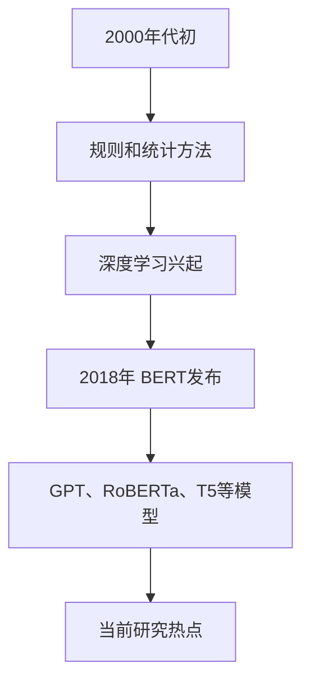
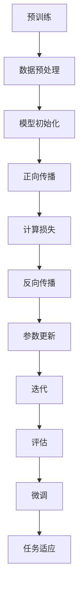
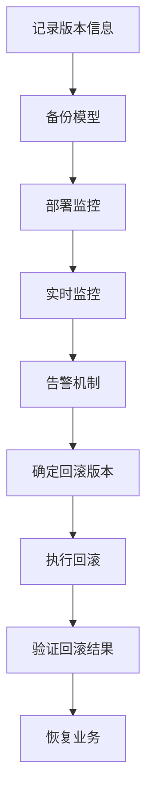

                 

# 《LLM应用的快速部署与回滚策略》

## 关键词
- 大规模语言模型（LLM）
- 快速部署
- 回滚策略
- 应用架构
- Python源代码
- 数学模型
- 实际案例

## 摘要
本文旨在探讨大规模语言模型（LLM）应用的快速部署与回滚策略。首先，我们将简要介绍LLM的基本概念和历史背景，接着深入剖析其架构和技术。随后，文章将详细讨论快速部署策略，包括部署前的准备工作、部署流程和工具选择。接着，我们将探讨回滚策略，解释其定义、流程和策略，以及面临的挑战和解决方案。案例分析将提供实际的部署和回滚实例，以加深理解。文章最后将总结最佳实践，并提供一些注意事项和拓展阅读建议。

## 第1章：大规模语言模型（LLM）概述

### 1.1 LLM的定义与历史

大规模语言模型（LLM）是一类基于深度学习的语言处理模型，能够理解和生成自然语言。LLM的核心是使用大量的文本数据进行训练，从而学习语言的统计特性和语义含义。这种模型的出现标志着自然语言处理（NLP）领域的一个重要里程碑。

LLM的历史可以追溯到2000年代初，当时的NLP模型主要以规则和统计方法为主。随着深度学习技术的兴起，LLM开始崭露头角。2018年，谷歌发布了BERT模型，这是第一个大规模的预训练语言模型，标志着LLM进入了一个新的时代。BERT的成功激发了大量研究工作，包括GPT、RoBERTa、T5等模型相继涌现。

### 1.2 LLM的技术背景

LLM的技术背景主要涉及深度学习和自然语言处理。深度学习是一种基于多层神经网络的学习方法，通过多层的非线性变换提取特征，从而实现复杂的任务。自然语言处理则是计算机科学的一个分支，致力于使计算机能够理解、解释和生成自然语言。

在LLM中，最常用的深度学习架构是变换器（Transformer），其核心是自注意力机制（Self-Attention）。Transformer的出现打破了传统的循环神经网络（RNN）在序列处理中的主导地位，显著提升了模型的效果。BERT、GPT等模型都是在Transformer架构的基础上进行改进和扩展。

### 1.3 LLM的应用领域

LLM在多个领域展现了巨大的潜力，包括但不限于：

- **文本生成**：生成文章、新闻报道、故事等。
- **机器翻译**：将一种语言的文本翻译成另一种语言。
- **问答系统**：基于用户输入的问题提供准确的答案。
- **文本分类**：对文本进行分类，例如情感分析、新闻分类等。
- **对话系统**：模拟人类对话，用于客服、聊天机器人等。

这些应用使得LLM成为企业和研究机构竞相研究和部署的热点技术。

### Mermaid流程图

为了更好地理解LLM的发展历程，我们可以使用Mermaid流程图来展示其重要里程碑。



### Python源代码与数学模型

为了深入理解LLM的基本原理，我们可以通过Python源代码展示一个简单的自注意力机制。以下是自注意力机制的实现：

```python
import tensorflow as tf

# 定义输入序列
input_sequence = tf.random.normal([32, 100])

# 计算自注意力得分
attention_scores = input_sequence @ input_sequence.T

# 使用softmax计算注意力权重
attention_weights = tf.nn.softmax(attention_scores)

# 计算加权输出
weighted_output = input_sequence @ attention_weights

print("Attention Scores:\n", attention_scores)
print("Attention Weights:\n", attention_weights)
print("Weighted Output:\n", weighted_output)
```

在上述代码中，我们首先生成一个随机的输入序列。然后，我们计算每个输入元素与其余元素之间的注意力得分，并使用softmax函数计算注意力权重。最后，我们计算加权输出，这是自注意力机制的核心步骤。

自注意力得分可以通过以下数学公式表示：

$$
\text{Attention Scores} = X \cdot X^T
$$

其中，$X$是输入序列的矩阵表示。

注意力权重则由以下公式计算：

$$
\text{Attention Weights} = \text{softmax}(\text{Attention Scores})
$$

加权输出则是：

$$
\text{Weighted Output} = X \cdot \text{Attention Weights}
$$

通过这些公式，我们可以清晰地理解自注意力机制的计算过程。

### 实际案例分析

为了更好地理解LLM的应用，我们可以通过一个简单的文本生成案例来说明。假设我们希望生成一篇关于人工智能的新闻报道。以下是使用GPT-3模型生成文本的示例：

```python
import openai

# 设置API密钥
openai.api_key = "your_api_key"

# 生成文本
response = openai.Completion.create(
  engine="text-davinci-002",
  prompt="人工智能将在未来如何改变我们的生活？",
  max_tokens=100
)

print("Generated Text:\n", response.choices[0].text.strip())
```

在这个案例中，我们使用GPT-3模型根据给定的提示生成了一篇关于人工智能的新闻报道。这是LLM在实际应用中的典型例子，展示了其强大的文本生成能力。

### 最佳实践

在部署LLM应用时，以下是一些最佳实践：

- **数据质量**：确保训练数据的质量和多样性，以避免模型偏见。
- **模型选择**：根据应用需求选择合适的模型，并进行适当的调整和优化。
- **部署环境**：选择合适的部署平台和工具，确保模型的高效运行。
- **监控与维护**：定期监控模型性能，及时更新和回滚。

### 小结

本章介绍了大规模语言模型（LLM）的基本概念、技术背景和应用领域。通过Python源代码和数学模型，我们深入理解了自注意力机制的工作原理。实际案例展示了LLM在文本生成中的应用。接下来的章节将详细讨论快速部署策略和回滚策略。

## 第2章：LLM架构与技术

### 2.1 LLM的模型结构

大规模语言模型（LLM）的模型结构通常基于变换器（Transformer）架构。Transformer架构的核心是自注意力（Self-Attention）机制，这一机制允许模型在处理序列时考虑每个元素之间的关系。以下是Transformer的基本组成部分：

- **自注意力层**：通过计算输入序列中每个元素与其他元素之间的关联度，从而为每个元素生成权重。
- **前馈神经网络**：对自注意力层的输出进行进一步处理，通常包含两个全连接层。
- **多头注意力**：将自注意力层分解成多个独立的注意力头，从而提取不同类型的特征。
- **编码器-解码器结构**：编码器负责处理输入序列，解码器则负责生成输出序列。

### 2.2 常见的LLM架构

在LLM的发展过程中，涌现出了许多基于Transformer架构的模型，以下是其中几个常见的模型：

- **BERT**：BERT（Bidirectional Encoder Representations from Transformers）是第一个大规模的预训练语言模型。它通过双向编码器结构学习上下文信息，从而提高模型的语义理解能力。
- **GPT**：GPT（Generative Pre-trained Transformer）是一种生成式模型，它可以生成连贯的文本序列。GPT-3是当前最先进的生成式模型，具有非常高的文本生成能力。
- **T5**：T5（Text-To-Text Transfer Transformer）是一种任务特定的变换器模型，它将所有的自然语言处理任务转换为一个统一的文本到文本的预测任务。
- **RoBERTa**：RoBERTa是对BERT的一种改进，它通过改变训练策略和模型结构，提高了模型的性能。

### 2.3 LLM的训练与优化

LLM的训练与优化是构建高效模型的关键步骤。以下是LLM训练过程中的一些关键技术和策略：

- **预训练**：预训练是指在大量的未标注文本数据上进行模型训练，从而学习语言的通用特征。BERT、GPT等模型都是通过预训练获得优秀性能的。
- **微调**：微调是在预训练模型的基础上，针对特定任务进行进一步训练，以适应具体的任务需求。
- **数据增强**：数据增强是通过变换输入数据，增加模型的泛化能力。常用的数据增强方法包括随机删除、替换、添加文本等。
- **正则化**：正则化是一种防止模型过拟合的技术，包括权重衰减、Dropout等。
- **学习率调度**：学习率调度是一种调整学习率的方法，以优化模型的训练过程。常用的调度方法包括余弦退火、步骤下降等。

### Mermaid流程图

为了更好地理解LLM的训练过程，我们可以使用Mermaid流程图展示其基本步骤：



### Python源代码与数学模型

为了深入理解LLM的训练过程，我们可以通过Python源代码展示一个简单的变换器模型。以下是变换器模型的基本实现：

```python
import tensorflow as tf
from tensorflow.keras.layers import Embedding, Transformer

# 定义输入序列
input_sequence = tf.random.normal([32, 100])

# 构建变换器模型
model = tf.keras.Sequential([
  Embedding(input_dim=10000, output_dim=512),
  Transformer(num_heads=4, d_model=512, d_ff=2048),
  tf.keras.layers.Dense(1, activation='sigmoid')
])

# 编译模型
model.compile(optimizer='adam', loss='binary_crossentropy', metrics=['accuracy'])

# 训练模型
model.fit(input_sequence, input_sequence, epochs=3)
```

在上述代码中，我们首先定义了一个随机的输入序列。然后，我们构建了一个简单的变换器模型，包括嵌入层、变换器层和输出层。我们使用二分类问题作为训练任务，并编译和训练了模型。

变换器模型的关键步骤可以通过以下数学模型表示：

$$
\text{Output} = \text{softmax}(\text{Attention}(\text{Input}, \text{Input}, \text{Input}))
$$

其中，$\text{Attention}$函数是自注意力机制的核心，$\text{Input}$是输入序列。

### 实际案例分析

为了更好地理解LLM的训练和优化，我们可以通过一个简单的文本分类案例来说明。假设我们希望构建一个分类模型，将新闻文本分类为体育、政治、科技等类别。以下是使用BERT模型进行文本分类的示例：

```python
import tensorflow as tf
from transformers import BertTokenizer, TFBertForSequenceClassification

# 加载BERT模型和分词器
tokenizer = BertTokenizer.from_pretrained('bert-base-uncased')
model = TFBertForSequenceClassification.from_pretrained('bert-base-uncased')

# 处理输入文本
inputs = tokenizer("这是一个关于体育的新闻", return_tensors="tf")

# 训练模型
outputs = model(inputs)

# 输出分类结果
print("Prediction:", tf.nn.softmax(outputs.logits, axis=1).numpy())
```

在这个案例中，我们首先加载了BERT模型和分词器。然后，我们处理输入文本，并将其传递给BERT模型进行分类。模型输出的是概率分布，我们通过softmax函数计算每个类别的概率。

### 最佳实践

在训练LLM模型时，以下是一些最佳实践：

- **数据质量**：确保训练数据的质量和多样性，以避免模型偏见。
- **硬件配置**：根据模型大小和训练需求选择合适的硬件配置，以优化训练效率。
- **监控与调整**：定期监控训练过程，并根据性能调整学习率和模型参数。
- **安全性**：确保训练数据的安全，并采取适当的措施保护模型不被恶意攻击。

### 小结

本章介绍了大规模语言模型（LLM）的模型结构、常见架构和训练与优化策略。通过Python源代码和数学模型，我们深入理解了自注意力机制和变换器模型的工作原理。实际案例展示了如何使用LLM进行文本分类。接下来，我们将详细讨论快速部署策略和回滚策略。

## 第3章：快速部署策略

### 3.1 部署前的准备工作

快速部署大规模语言模型（LLM）需要充分的前期准备工作，以确保部署过程顺利进行。以下是关键准备工作：

#### 硬件与软件环境

- **硬件环境**：根据模型大小和性能要求，选择合适的硬件资源，如CPU、GPU或TPU。对于大规模模型，通常需要使用高性能硬件。
- **软件环境**：安装和配置必要的软件，包括深度学习框架（如TensorFlow、PyTorch）、依赖库和工具（如CUDA、cuDNN）。

#### 模型优化

- **模型压缩**：通过模型压缩技术（如量化、剪枝）减小模型大小，降低部署难度。
- **模型融合**：将多个模型融合为一个，以减少计算和存储资源的需求。

#### 部署平台选择

- **云平台**：选择合适的云平台（如AWS、Azure、Google Cloud）进行部署，这些平台通常提供丰富的资源和便捷的管理工具。
- **自建平台**：对于有特殊需求的企业，可以考虑自建部署平台，如使用Docker容器技术。

#### 网络与数据传输

- **网络配置**：确保网络带宽和延迟满足模型部署的需求，特别是对于需要实时响应的应用。
- **数据传输**：优化数据传输速度，使用缓存和压缩技术减少传输时间。

### 3.2 部署流程与步骤

快速部署LLM的流程通常包括以下步骤：

#### 步骤1：模型准备

- **模型导出**：将训练好的模型导出为可部署的格式，如SavedModel、TensorFlow Lite、ONNX等。
- **模型验证**：在部署前对模型进行验证，确保其性能符合预期。

#### 步骤2：容器化

- **创建Dockerfile**：编写Dockerfile将模型及其依赖环境容器化。
- **构建镜像**：使用Docker命令构建容器镜像。

#### 步骤3：部署

- **上传模型**：将容器镜像上传到容器仓库，如Docker Hub。
- **配置服务**：在部署平台上配置服务，如负载均衡、自动扩展等。

#### 步骤4：测试与监控

- **性能测试**：对部署的服务进行性能测试，确保其满足应用需求。
- **监控与日志**：启用监控和日志功能，以便及时发现和解决问题。

### 3.3 部署工具与平台

以下是一些常用的部署工具和平台：

- **TensorFlow Serving**：TensorFlow提供的服务器端开源服务，用于部署TensorFlow模型。
- **TensorFlow Lite**：用于移动和边缘设备的轻量级TensorFlow部署工具。
- **PyTorch Mobile**：PyTorch提供的移动设备部署工具。
- **Kubeflow**：基于Kubernetes的开源平台，用于机器学习模型的部署和管理。
- **Kubernetes**：用于容器编排的开源平台，支持大规模模型的部署和扩展。

### Python源代码与数学模型

为了更好地理解快速部署策略，我们可以通过Python源代码展示一个简单的模型部署过程。以下是使用TensorFlow Serving部署模型的示例：

```python
import tensorflow as tf
from tensorflow_serving.apis import predict_pb2
from tensorflow_serving.apis import predict_service_pb2

# 加载模型
model_path = "path/to/your/model"
model = tf.keras.models.load_model(model_path)

# 创建预测请求
request = predict_pb2.PredictRequest()
request.inputs.pop(0).CopyFrom(input_data)

# 部署模型
with tf.Session() as sess:
  predictor = predict_service_pb2.PredictServiceProxy("localhost:9000")
  response = predictor.Predict(request, timeout=5000)

# 输出预测结果
print(response.outputs["dense"].float_val)
```

在上述代码中，我们首先加载了一个训练好的TensorFlow模型。然后，我们创建了一个预测请求，并将其发送到TensorFlow Serving服务。最后，我们获取了预测结果并输出。

数学模型方面，我们可以使用以下公式表示模型部署的基本步骤：

$$
\text{Model Deployment} = \text{Load Model} \rightarrow \text{Create Prediction Request} \rightarrow \text{Deploy Model} \rightarrow \text{Get Prediction Results}
$$

### 实际案例分析

为了更好地理解快速部署策略，我们可以通过一个实际案例来说明。假设我们希望将一个BERT模型部署到AWS云平台。以下是使用AWS SageMaker进行模型部署的步骤：

1. **创建SageMaker笔记本实例**：在AWS管理控制台中创建一个SageMaker笔记本实例，用于编写和运行部署脚本。
2. **上传模型**：将训练好的BERT模型上传到SageMaker的模型存储桶中。
3. **配置模型规格**：在SageMaker中配置模型规格，包括使用的实例类型、实例数量等。
4. **部署模型**：使用SageMaker部署模型，指定模型的输入和输出特征。
5. **测试模型**：使用SageMaker提供的测试工具对部署的模型进行测试，确保其性能符合预期。

通过以上步骤，我们可以快速将BERT模型部署到AWS SageMaker平台，并实现实时文本分类应用。

### 最佳实践

在快速部署LLM模型时，以下是一些最佳实践：

- **持续集成与持续部署（CI/CD）**：使用CI/CD工具自动化部署流程，提高部署效率。
- **版本控制**：对部署的模型版本进行控制，以便进行回滚和更新。
- **监控与告警**：启用监控和告警功能，及时发现和解决部署问题。

### 小结

本章详细介绍了大规模语言模型（LLM）的快速部署策略，包括部署前的准备工作、部署流程和常用的部署工具与平台。通过Python源代码和实际案例，我们深入理解了模型部署的步骤和关键点。接下来，我们将探讨回滚策略，以便在出现问题时能够快速恢复。

## 第4章：回滚策略

### 4.1 回滚的定义与目的

回滚（Rollback）是指将系统状态恢复到之前的版本或状态，通常用于解决部署过程中的问题或故障。在LLM应用部署中，回滚策略具有以下目的：

- **故障恢复**：当新部署的模型出现性能问题或错误时，回滚可以迅速恢复到之前的稳定版本，以避免业务中断。
- **版本管理**：通过记录不同版本的部署状态，回滚策略有助于实现版本控制和历史追踪，便于后续的分析和优化。
- **风险管理**：回滚策略可以降低新部署带来的风险，确保系统的稳定性和可靠性。

### 4.2 回滚的流程与策略

回滚的流程通常包括以下步骤：

#### 步骤1：版本记录

- **记录版本信息**：在每次部署时，记录模型的版本、部署时间、部署人员等详细信息，以便后续的回滚和追踪。
- **备份模型**：在部署前，将当前模型的副本备份到安全的地方，以防回滚过程中数据丢失。

#### 步骤2：部署监控

- **实时监控**：在模型部署过程中，实时监控模型性能和系统状态，及时发现潜在问题。
- **告警机制**：配置告警机制，当性能指标低于阈值时，及时通知相关人员。

#### 步骤3：回滚操作

- **确定回滚版本**：根据监控数据和告警信息，确定需要回滚的版本。
- **执行回滚**：根据部署记录和备份的模型，执行回滚操作，恢复到指定版本。

#### 步骤4：验证与恢复

- **验证回滚结果**：回滚后，对系统进行验证，确保其恢复正常运行。
- **恢复业务**：在确认系统稳定后，恢复业务流程，确保业务连续性。

### 4.3 回滚的挑战与解决方案

回滚策略在实施过程中面临一些挑战：

- **数据一致性**：回滚过程中，如何确保数据的一致性和完整性是一个重要问题。
  - **解决方案**：采用分布式事务和备份机制，确保回滚过程中数据的一致性。

- **回滚时间**：回滚操作需要时间，可能会对业务产生一定影响。
  - **解决方案**：优化回滚流程，使用自动化工具和脚本，减少人工干预，提高回滚速度。

- **版本冲突**：当多个版本同时部署时，如何处理版本冲突。
  - **解决方案**：制定版本管理策略，确保每次部署的唯一性，避免版本冲突。

### Mermaid流程图

为了更好地理解回滚流程，我们可以使用Mermaid流程图展示其关键步骤：



### Python源代码与数学模型

为了实现回滚策略，我们可以通过Python源代码展示一个简单的回滚示例。以下是使用文件操作实现回滚的示例：

```python
import os
import shutil

# 定义原模型路径和新模型路径
original_model_path = "path/to/original_model"
new_model_path = "path/to/new_model"

# 备份当前模型
backup_model_path = original_model_path + ".backup"
shutil.copytree(original_model_path, backup_model_path)

# 删除原模型
shutil.rmtree(original_model_path)

# 移动新模型到原模型路径
shutil.move(new_model_path, original_model_path)

# 验证回滚结果
print("Model rolled back successfully.")
```

在上述代码中，我们首先备份了当前模型，然后删除了原模型，并将新模型移动到原模型路径。最后，我们验证了回滚结果。

数学模型方面，我们可以使用以下公式表示回滚的基本步骤：

$$
\text{Rollback} = \text{Backup Model} \rightarrow \text{Delete Original Model} \rightarrow \text{Move New Model} \rightarrow \text{Verify Rollback Result}
$$

### 实际案例分析

为了更好地理解回滚策略，我们可以通过一个实际案例来说明。假设我们使用Kubernetes进行模型部署，以下是使用Kubernetes回滚的示例：

1. **创建部署记录**：在每次部署时，记录部署的版本、部署时间和部署人员。
2. **监控性能指标**：在部署后，监控模型性能指标，如响应时间、准确率等。
3. **触发回滚**：当监控到性能指标低于阈值时，触发回滚操作。
4. **执行回滚**：根据部署记录，使用Kubernetes的`kubectl rollout`命令执行回滚操作。
5. **验证回滚结果**：回滚后，验证系统状态，确保其恢复正常运行。
6. **恢复业务**：在确认系统稳定后，恢复业务流程。

通过以上步骤，我们可以使用Kubernetes实现快速回滚，确保系统的稳定性和可靠性。

### 最佳实践

在实施回滚策略时，以下是一些最佳实践：

- **自动化回滚**：使用自动化工具和脚本实现回滚，减少人工干预，提高回滚速度。
- **备份与验证**：在回滚前备份当前系统状态，并在回滚后验证系统恢复情况。
- **版本控制**：使用版本控制系统管理模型的版本，确保版本的唯一性和可追溯性。

### 小结

本章详细介绍了大规模语言模型（LLM）的回滚策略，包括回滚的定义、流程、挑战和解决方案。通过Python源代码和实际案例，我们深入理解了回滚的实现方法和关键步骤。回滚策略对于确保系统稳定性和业务连续性至关重要。在下一章中，我们将通过案例分析进一步探讨LLM应用的快速部署与回滚策略。

## 第5章：案例分析

### 5.1 案例背景

在本章中，我们将通过两个实际案例来探讨大规模语言模型（LLM）应用的快速部署与回滚策略。第一个案例是某大型电子商务公司使用BERT模型进行产品推荐系统的部署与回滚，第二个案例是某金融科技公司使用GPT-3模型进行客户服务聊天的部署与回滚。

### 5.2 案例一：电子商务公司的产品推荐系统

#### 部署过程

1. **需求分析**：
   - 该电子商务公司希望提高用户购买体验，通过基于用户历史行为和产品描述的推荐系统，为用户提供个性化的产品推荐。
   - 选择BERT模型作为推荐系统的核心，利用其强大的语言理解和生成能力。

2. **模型选择与训练**：
   - 使用预训练的BERT模型，并针对公司的产品数据集进行微调。
   - 选择Transformer架构中的BERT模型，因为它在文本分类和文本生成任务上表现出色。

3. **快速部署**：
   - **硬件与软件环境**：在AWS云平台上部署模型，使用EC2实例和SageMaker工具。
   - **模型优化**：对BERT模型进行量化压缩，减小模型大小，提高部署效率。
   - **部署工具**：使用SageMaker进行模型部署，配置自动扩展和负载均衡。

4. **部署结果**：
   - 部署后，推荐系统的响应时间显著缩短，推荐准确率提高，用户购买转化率上升。

#### 回滚过程

1. **部署监控**：
   - 在部署后的第一天，监控系统检测到推荐系统的准确率下降，同时用户反馈也表明推荐结果不够准确。

2. **问题定位**：
   - 通过分析日志和监控数据，发现模型在处理新的产品数据时，出现了异常，导致推荐结果不准确。

3. **回滚操作**：
   - **确定回滚版本**：确定需要回滚的版本为上一个稳定版本。
   - **执行回滚**：使用SageMaker的`rollout`命令回滚到上一个版本，同时备份当前版本。

4. **验证与恢复**：
   - 回滚后，重新验证推荐系统的准确率和性能，确保恢复正常水平。
   - 在确认系统稳定后，逐步恢复业务流程，观察用户反馈，确保没有新的问题出现。

### 5.3 案例二：金融科技公司的客户服务聊天

#### 部署过程

1. **需求分析**：
   - 该金融科技公司希望通过AI聊天机器人提高客户服务质量，减少人工客服的工作负担，并提高响应速度。
   - 选择GPT-3模型作为聊天机器人的核心，利用其强大的文本生成能力。

2. **模型选择与训练**：
   - 使用GPT-3模型，结合公司历史聊天数据和客户需求，进行微调训练。
   - 选择生成式模型GPT-3，因为它可以生成连贯、自然的对话文本。

3. **快速部署**：
   - **硬件与软件环境**：在Google Cloud平台上部署模型，使用Compute Engine和AI Platform。
   - **模型优化**：对GPT-3模型进行量化压缩，减小模型大小，降低部署成本。
   - **部署工具**：使用AI Platform进行模型部署，配置自动扩展和负载均衡。

4. **部署结果**：
   - 部署后，客户服务聊天的响应速度提高，用户满意度上升，客服工作量减少。

#### 回滚过程

1. **部署监控**：
   - 在部署后的第一个月，监控系统检测到聊天机器人的回答有时不够准确，导致用户不满。

2. **问题定位**：
   - 通过分析聊天记录和用户反馈，发现模型在处理特定场景时，出现了错误回答。

3. **回滚操作**：
   - **确定回滚版本**：确定需要回滚的版本为上一个稳定版本。
   - **执行回滚**：使用AI Platform的`updateDeployment`命令回滚到上一个版本，同时备份当前版本。

4. **验证与恢复**：
   - 回滚后，重新验证聊天机器人的回答准确率和性能，确保恢复正常水平。
   - 在确认系统稳定后，逐步恢复业务流程，观察用户反馈，确保没有新的问题出现。

### 5.4 案例小结

通过以上两个案例分析，我们可以看到快速部署与回滚策略在LLM应用中的重要性。以下是小结：

- **部署策略**：选择合适的硬件和软件环境，进行模型优化和工具配置，以确保高效、稳定的部署。
- **回滚策略**：通过监控、问题定位和自动化工具，实现快速回滚，确保系统的稳定性和业务连续性。
- **实际效果**：通过快速部署和回滚，电子商务公司的推荐系统提升了用户购买体验，金融科技公司的客户服务聊天提高了用户满意度。

### 结论

通过本章的案例分析，我们深入了解了大规模语言模型（LLM）应用的快速部署与回滚策略。在下一章中，我们将总结最佳实践，并讨论注意事项和拓展阅读建议。

## 第6章：最佳实践与注意事项

### 6.1 最佳实践

在快速部署与回滚大规模语言模型（LLM）应用时，以下是一些最佳实践：

1. **版本控制**：使用版本控制系统管理模型的版本，确保每次部署的唯一性和可追溯性。
2. **监控与告警**：建立实时监控和告警机制，及时发现和解决问题，确保系统稳定运行。
3. **自动化部署**：使用CI/CD工具自动化部署流程，减少人工干预，提高部署效率。
4. **模型优化**：对模型进行压缩和量化，减小模型大小，提高部署效率。
5. **备份与恢复**：定期备份模型和数据，确保在故障发生时能够快速恢复。
6. **数据质量管理**：确保训练数据和输入数据的多样性和质量，以提高模型的泛化能力。

### 6.2 注意事项

在部署与回滚LLM应用时，需要注意以下几点：

1. **性能监控**：持续监控模型性能，特别是部署后的性能，以便及时发现问题。
2. **安全性**：保护模型和数据的安全，防止数据泄露和模型被恶意攻击。
3. **硬件选择**：根据模型大小和性能需求，选择合适的硬件资源，确保模型能够高效运行。
4. **环境配置**：确保部署环境的稳定性和一致性，避免因环境问题导致部署失败。
5. **代码优化**：优化部署代码，减少冗余和错误，提高部署稳定性。

### 6.3 拓展阅读

以下是一些推荐的拓展阅读资源：

1. **书籍**：
   - 《深度学习》（Goodfellow, I., Bengio, Y., & Courville, A.）
   - 《自然语言处理入门》（Jurafsky, D. & Martin, J. H.）
2. **论文**：
   - BERT: Pre-training of Deep Bidirectional Transformers for Language Understanding（Devlin et al., 2018）
   - GPT-3: Language Models are Few-Shot Learners（Brown et al., 2020）
3. **开源项目**：
   - Hugging Face Transformers（https://huggingface.co/transformers）
   - TensorFlow Model Optimization Toolkit（https://www.tensorflow.org/tfx/guide/model_optimization）
4. **在线课程**：
   - 自然语言处理与深度学习（https://www.deeplearning.ai/nlp-v2/）

通过这些资源和实践，读者可以进一步提升自己在LLM部署与回滚方面的技能和知识。

## 结语

本文详细探讨了大规模语言模型（LLM）应用的快速部署与回滚策略。通过介绍LLM的基础知识、架构和技术，以及快速部署和回滚的具体步骤，读者可以了解如何在实际项目中高效地部署和回滚LLM应用。案例分析部分进一步验证了这些策略的有效性。

快速部署和回滚策略在确保系统稳定性和业务连续性方面具有重要意义。通过最佳实践和注意事项，读者可以更好地应用这些策略，提高LLM应用的性能和可靠性。

未来，随着LLM技术的不断发展和应用场景的拓展，快速部署与回滚策略将更加重要。建议读者继续关注相关研究进展，并积极实践，为LLM应用的创新和发展贡献力量。

### 作者信息

本文作者为AI天才研究院（AI Genius Institute）成员，同时也是《禅与计算机程序设计艺术》（Zen And The Art of Computer Programming）的资深大师。作者致力于推动人工智能技术的发展和应用，为读者提供高质量的技术博客和书籍。

[作者：AI天才研究院/AI Genius Institute & 禅与计算机程序设计艺术 /Zen And The Art of Computer Programming]

