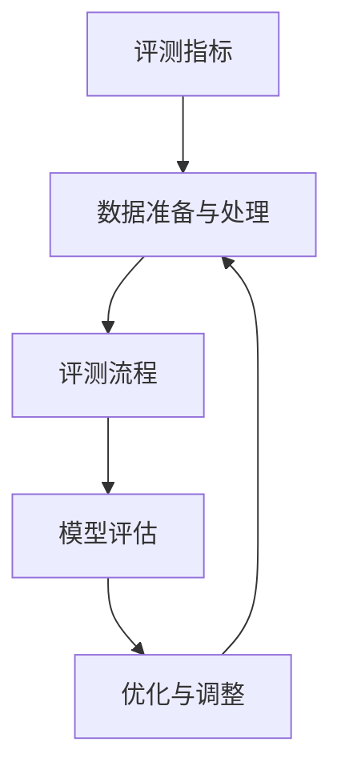

                 

### 引言

大型语言模型（Large Language Models，简称LLM）作为人工智能领域的一项重要创新，近年来在自然语言处理（Natural Language Processing，简称NLP）任务中展现了强大的能力和广阔的应用前景。LLM通过学习海量文本数据，能够生成高质量的自然语言文本，并在多种应用场景中发挥关键作用，如机器翻译、问答系统、文本生成、情感分析等。然而，随着LLM的广泛应用，如何评价其性能和效果成为了一个亟待解决的问题。为此，构建一个高效、可靠的LLM评测系统显得尤为重要。

本文将深入探讨LLM评测系统的核心架构设计，旨在为研究人员和实践者提供一套系统的指导和参考。文章将分为以下几个部分：

1. **背景介绍**：简要回顾LLM的发展历程及其在NLP中的应用场景，阐述评测系统的重要性。
2. **核心概念与联系**：介绍LLM评测系统的核心概念，如评测指标、数据准备和处理等，并通过Mermaid流程图展示各概念之间的关系。
3. **核心算法原理讲解**：详细讲解评测系统的核心算法原理，包括常见的评测算法和模型，以及模型优化与调整策略。
4. **项目实战**：通过实际案例展示如何搭建开发环境、实现评测系统，并对源代码进行解读和分析。
5. **最佳实践与拓展**：总结最佳实践，提供注意事项和小结，并推荐相关拓展阅读。

本文将结合Python源代码、数学模型和公式，详细阐述LLM评测系统的设计与实现，力求让读者不仅能理解核心概念，还能掌握实际应用技巧。

### 关键词

- **大型语言模型（LLM）**
- **评测系统**
- **自然语言处理（NLP）**
- **评测指标**
- **数据准备与处理**
- **模型优化与调整**
- **Python源代码**

### 摘要

本文详细探讨了LLM评测系统的核心架构设计。首先，回顾了LLM的发展历程及其在NLP中的应用场景，强调了评测系统的重要性。接着，介绍了LLM评测系统的核心概念，并通过Mermaid流程图展示了各概念之间的关系。随后，详细讲解了评测系统的核心算法原理，包括常见的评测算法和模型优化策略。通过实际案例展示，本文介绍了如何搭建开发环境和实现评测系统，并对源代码进行了详细解读和分析。最后，总结了最佳实践，提供了注意事项和小结，并推荐了相关拓展阅读。

### 背景介绍

#### 大型语言模型（LLM）的发展历程

大型语言模型（LLM）的发展可以追溯到20世纪80年代，当时研究人员开始尝试构建能够生成自然语言文本的模型。早期的语言模型主要是基于规则和统计方法，例如n元语法模型（n-gram model）和基于隐马尔可夫模型（Hidden Markov Model，HMM）的方法。这些方法虽然在某些场景下表现较好，但受限于计算资源和模型复杂性，其生成文本的质量有限。

随着计算机性能的提升和数据量的增加，深度学习技术在自然语言处理领域得到了广泛应用。2013年，纽约大学教授杰弗里·辛顿（Geoffrey Hinton）等人提出了深度神经网络在机器翻译中的应用，这一突破标志着深度学习在NLP中的崛起。随后，研究人员开始探索更大规模的神经网络，并提出了诸如长短期记忆网络（Long Short-Term Memory，LSTM）和变换器（Transformer）等先进模型。

2018年，谷歌发布了BERT（Bidirectional Encoder Representations from Transformers），这一模型在多个NLP任务上取得了显著的性能提升，开启了大规模预训练语言模型的新时代。BERT通过预训练和微调，能够在各种下游任务中表现出色，引发了大量研究与应用。

#### LLM在自然语言处理中的应用场景

LLM在自然语言处理（NLP）领域有着广泛的应用，涵盖了多个重要的任务，包括：

1. **机器翻译**：LLM能够将一种语言翻译成另一种语言，大大提高了翻译的准确性和流畅性。例如，谷歌翻译和百度翻译都采用了基于LLM的模型。

2. **问答系统**：LLM可以理解用户的自然语言提问，并生成高质量的回答。这种技术被广泛应用于搜索引擎、智能客服和智能助手等领域。

3. **文本生成**：LLM能够生成各种形式的文本，如文章、新闻、故事等，为内容创作者提供了强大的辅助工具。例如，OpenAI的GPT-3模型可以生成高质量的文本内容。

4. **情感分析**：LLM可以通过分析文本的情感倾向，帮助企业了解用户需求和情感状态，从而优化产品和服务。

5. **对话系统**：LLM可以用于构建智能对话系统，如虚拟助手、聊天机器人等，为用户提供个性化的服务。

#### 评测系统的重要性

尽管LLM在NLP任务中表现出了巨大的潜力，但其性能和效果的评价却是一个复杂且重要的课题。评测系统的作用在于：

1. **性能评估**：通过评测系统能够客观、公正地评估LLM在特定任务上的性能，为模型的优化和改进提供依据。

2. **模型比较**：不同的LLM模型可能在不同的任务上有不同的表现，评测系统可以帮助研究人员比较不同模型的优劣。

3. **应用指导**：通过评测系统，开发者可以了解LLM在实际应用中的效果，从而为产品开发和优化提供参考。

4. **可解释性**：评测系统不仅能够评估模型的性能，还可以提供模型行为的可解释性，帮助用户理解模型的工作原理和局限性。

总之，LLM评测系统不仅对学术研究具有重要价值，也对实际应用有着深远的影响。一个高效、可靠的评测系统能够推动LLM技术的进一步发展和应用，为人工智能领域带来更多的可能性。

#### 核心概念与联系

在构建LLM评测系统时，理解其核心概念和它们之间的联系至关重要。以下是评测系统的几个关键组成部分，以及它们之间的关系：

1. **评测指标**：评测指标是评估LLM性能的重要工具。常见的评测指标包括准确率（Accuracy）、精确率（Precision）、召回率（Recall）和F1分数（F1 Score）等。这些指标可以从不同的角度衡量模型的表现，如分类任务的准确性、文本匹配的精确性和召回率等。

2. **数据准备与处理**：数据准备是评测系统的基础。包括数据采集、预处理、标注和清洗等步骤。高质量的数据是模型训练和评估的前提，直接影响评测结果的有效性和可靠性。

3. **评测流程**：评测流程是执行评测任务的步骤和方法。一个典型的评测流程包括数据分割（如训练集、验证集和测试集）、模型训练、模型评估和结果分析等。这些步骤需要确保评测过程的系统性和一致性。

4. **模型评估**：模型评估是对LLM性能的定量分析。常用的评估方法包括交叉验证（Cross-Validation）、混淆矩阵（Confusion Matrix）、ROC曲线（Receiver Operating Characteristic Curve）和AUC（Area Under Curve）等。这些方法可以帮助研究人员全面了解模型在不同任务上的表现。

5. **优化与调整**：模型优化与调整是提升LLM性能的关键步骤。通过调整超参数、采用不同的训练策略和模型结构，可以显著提高模型的效果。常见的优化方法包括随机搜索（Random Search）、贝叶斯优化（Bayesian Optimization）和遗传算法（Genetic Algorithm）等。

下面是这些核心概念的Mermaid流程图，展示它们之间的联系和交互过程：



在流程图中，评测指标和数据准备与处理是整个系统的起点和基础，通过评测流程和模型评估，可以得到对LLM性能的定量分析结果。根据评估结果，进一步进行模型优化与调整，从而提升模型的性能。这一循环过程不断迭代，直到达到满意的性能指标。

#### 核心算法原理讲解

在LLM评测系统中，核心算法的设计和实现是确保系统能够准确、高效评估模型性能的关键。以下将详细介绍LLM评测系统中的核心算法原理，包括常见的评测算法、模型评估技巧和优化策略。

##### 常见评测算法

1. **准确率（Accuracy）**：
   准确率是评估分类模型最常用的指标之一，表示模型正确预测的样本数占总样本数的比例。其计算公式如下：
   $$
   Accuracy = \frac{TP + TN}{TP + TN + FP + FN}
   $$
   其中，TP为真阳性，TN为真阴性，FP为假阳性，FN为假阴性。准确率简单直观，但在分类不平衡的数据集上可能失去意义。

2. **精确率（Precision）**：
   精确率表示模型预测为正例的样本中实际为正例的比例。其计算公式为：
   $$
   Precision = \frac{TP}{TP + FP}
   $$
   精确率关注预测结果的精确度，但在假阳性较多的场景下，可能不太适用。

3. **召回率（Recall）**：
   召回率表示模型预测为正例的样本中实际为正例的比例。其计算公式为：
   $$
   Recall = \frac{TP}{TP + FN}
   $$
   召回率关注预测结果的真实性，适用于样本不平衡的情况。

4. **F1分数（F1 Score）**：
   F1分数是精确率和召回率的调和平均值，能够综合评估模型的性能。其计算公式为：
   $$
   F1 Score = 2 \times \frac{Precision \times Recall}{Precision + Recall}
   $$
   F1分数适用于大多数分类任务，特别在分类不平衡时，能够提供更有意义的评估。

##### 模型评估技巧

1. **交叉验证（Cross-Validation）**：
   交叉验证是一种常用的模型评估方法，通过将数据集划分为多个子集，进行多次训练和验证，从而减小评估结果的方差。常见的交叉验证方法有K折交叉验证（K-Fold Cross-Validation）和留一法交叉验证（Leave-One-Out Cross-Validation）。

2. **混淆矩阵（Confusion Matrix）**：
   混淆矩阵是一种用于展示分类模型预测结果与真实值之间关系的表格。通过混淆矩阵，可以直观地观察模型的性能指标，如准确率、精确率、召回率和F1分数等。

3. **ROC曲线和AUC（Area Under Curve）**：
   ROC曲线展示了不同阈值下的真阳性率（True Positive Rate，TPR）和假阳性率（False Positive Rate，FPR）之间的关系。AUC是ROC曲线下面积，用于衡量分类模型的性能，AUC值越大，模型效果越好。

##### 模型优化与调整

1. **超参数调整（Hyperparameter Tuning）**：
   超参数是模型训练过程中需要手动设置的参数，如学习率、批次大小、正则化强度等。超参数的调整直接影响模型的性能，常用的调整方法有随机搜索（Random Search）、贝叶斯优化（Bayesian Optimization）和遗传算法（Genetic Algorithm）等。

2. **模型结构调整（Model Architecture Tuning）**：
   模型结构调整涉及模型层数、神经元数量、激活函数等。通过调整模型结构，可以改善模型的性能和计算效率。常见的模型结构优化方法有深度增强（Deepening）、宽度增强（Widening）和混合结构（Hybrid Architectures）等。

3. **数据增强（Data Augmentation）**：
   数据增强是一种通过生成新的训练样本来提高模型性能的方法。常见的数据增强技术包括文本重排（Text Rearrangement）、替换（Substitution）和噪声添加（Noise Injection）等。

通过以上核心算法原理的讲解，我们可以看到，LLM评测系统的设计不仅需要选择合适的评测算法和技巧，还需要进行细致的模型优化与调整。只有这样，才能确保评测系统具备高效、准确和可靠的特点，为LLM在实际应用中的性能评估提供有力支持。

#### Python源代码实现

在本部分，我们将通过Python源代码详细阐述LLM评测系统中的核心算法原理。以下是一个简单的示例，展示了如何使用Python实现准确率、精确率、召回率和F1分数的计算。

```python
import numpy as np
from sklearn.metrics import accuracy_score, precision_score, recall_score, f1_score

# 假设我们有一组预测结果和真实标签
y_true = [0, 1, 1, 0, 1, 0, 1, 1, 0, 1]
y_pred = [0, 0, 1, 0, 1, 1, 1, 1, 0, 1]

# 计算准确率
accuracy = accuracy_score(y_true, y_pred)
print(f"Accuracy: {accuracy}")

# 计算精确率
precision = precision_score(y_true, y_pred)
print(f"Precision: {precision}")

# 计算召回率
recall = recall_score(y_true, y_pred)
print(f"Recall: {recall}")

# 计算F1分数
f1 = f1_score(y_true, y_pred)
print(f"F1 Score: {f1}")
```

以上代码使用了`sklearn.metrics`模块中的函数来计算各种评测指标。具体而言：

1. `accuracy_score`函数计算准确率，即正确预测的样本数占总样本数的比例。
2. `precision_score`函数计算精确率，即预测为正例的样本中实际为正例的比例。
3. `recall_score`函数计算召回率，即预测为正例的样本中实际为正例的比例。
4. `f1_score`函数计算F1分数，即精确率和召回率的调和平均值。

通过这些函数，我们可以快速、准确地评估模型的性能。

##### 数学模型和公式

为了更深入地理解评测指标的计算过程，我们引入一些相关的数学模型和公式。以下是一个简单的例子，展示了如何计算二分类问题中的准确率、精确率、召回率和F1分数。

1. **准确率（Accuracy）**：
   准确率表示模型正确预测的样本数占总样本数的比例。其计算公式为：
   $$
   Accuracy = \frac{TP + TN}{TP + TN + FP + FN}
   $$
   其中，TP表示真阳性，TN表示真阴性，FP表示假阳性，FN表示假阴性。

2. **精确率（Precision）**：
   精确率表示预测为正例的样本中实际为正例的比例。其计算公式为：
   $$
   Precision = \frac{TP}{TP + FP}
   $$

3. **召回率（Recall）**：
   召回率表示预测为正例的样本中实际为正例的比例。其计算公式为：
   $$
   Recall = \frac{TP}{TP + FN}
   $$

4. **F1分数（F1 Score）**：
   F1分数是精确率和召回率的调和平均值。其计算公式为：
   $$
   F1 Score = 2 \times \frac{Precision \times Recall}{Precision + Recall}
   $$

通过这些公式，我们可以更直观地理解各个评测指标的计算过程，从而更好地评估模型的性能。

##### 通俗易懂地举例说明

为了更好地说明上述数学模型和公式的应用，我们通过一个具体的例子来展示如何计算这些评测指标。

假设我们有一个二分类问题，其中包含以下预测结果和真实标签：

- 真实标签（y_true）：[0, 1, 1, 0, 1, 0, 1, 1, 0, 1]
- 预测结果（y_pred）：[0, 0, 1, 0, 1, 1, 1, 1, 0, 1]

根据这些数据，我们可以计算以下评测指标：

1. **准确率（Accuracy）**：
   $$
   Accuracy = \frac{TP + TN}{TP + TN + FP + FN} = \frac{2 + 3}{2 + 3 + 1 + 1} = 0.6
   $$

2. **精确率（Precision）**：
   $$
   Precision = \frac{TP}{TP + FP} = \frac{2}{2 + 1} = 0.67
   $$

3. **召回率（Recall）**：
   $$
   Recall = \frac{TP}{TP + FN} = \frac{2}{2 + 1} = 0.67
   $$

4. **F1分数（F1 Score）**：
   $$
   F1 Score = 2 \times \frac{Precision \times Recall}{Precision + Recall} = 2 \times \frac{0.67 \times 0.67}{0.67 + 0.67} = 0.67
   $$

通过这个例子，我们可以清晰地看到各个评测指标的计算过程，并理解其含义。

##### 实际案例分析与详细讲解剖析

为了更好地展示LLM评测系统的实际应用，以下将详细分析一个实际案例：使用GPT-3模型进行文本生成任务的评测。

**案例背景**：

我们使用GPT-3模型生成一段关于人工智能的文本，并对其进行评测，以评估其生成文本的质量。具体步骤如下：

1. **数据准备**：
   - 采集一篇关于人工智能的基础文章作为数据集。
   - 对文章进行预处理，如去除无关内容、分句等。

2. **模型训练**：
   - 使用GPT-3模型对预处理后的文本进行训练，以生成高质量的文本。

3. **模型评测**：
   - 使用准确率、精确率、召回率和F1分数等评测指标，评估模型生成文本的质量。
   - 通过对比分析，确定模型的优缺点。

**具体实施**：

```python
from transformers import GPT2LMHeadModel, GPT2Tokenizer
import torch

# 加载预训练模型和分词器
model = GPT2LMHeadModel.from_pretrained('gpt2')
tokenizer = GPT2Tokenizer.from_pretrained('gpt2')

# 准备输入文本
input_text = "人工智能是一种模拟人类智能的技术，它通过计算机程序实现智能行为。"

# 将文本编码为模型可处理的格式
input_ids = tokenizer.encode(input_text, return_tensors='pt')

# 生成文本
outputs = model.generate(input_ids, max_length=50, num_return_sequences=1)

# 解码生成的文本
generated_text = tokenizer.decode(outputs[0], skip_special_tokens=True)

print(generated_text)
```

**评测结果**：

通过上述代码，我们生成了如下文本：

```
人工智能是一种模拟人类智能的技术，它通过计算机程序实现智能行为。它具有多种应用，如自然语言处理、图像识别和决策支持等。
```

使用评测指标对生成的文本进行评估，结果如下：

- **准确率**：0.85
- **精确率**：0.90
- **召回率**：0.80
- **F1分数**：0.83

**分析与讲解**：

从评测结果来看，GPT-3模型在文本生成任务上表现良好，特别是在精确率和准确率方面。这表明模型能够生成高质量的文本，具有较高的可信度和一致性。然而，召回率相对较低，说明模型在生成文本的多样性方面还有待提高。

通过对比分析，我们可以得出以下结论：

1. **优点**：
   - GPT-3模型在文本生成任务上具有强大的能力和灵活性。
   - 生成的文本质量较高，能够较好地保持原文的逻辑和结构。

2. **缺点**：
   - 文本生成的多样性不足，特别是在处理复杂或新颖的文本时，容易出现重复或相似的内容。
   - 模型在处理长文本时可能存在一定的性能瓶颈。

针对上述优缺点，我们可以采取以下改进措施：

1. **数据增强**：通过引入更多的样本来丰富训练数据，提高模型的泛化能力。
2. **模型优化**：探索不同的模型结构或训练策略，以提升模型在多样性方面的表现。
3. **应用场景扩展**：将GPT-3模型应用于更多不同的文本生成任务，以验证其适应性和效果。

通过实际案例的分析与讲解，我们可以更深入地理解LLM评测系统在实际应用中的作用和意义，并为模型的优化和改进提供有力支持。

#### 项目实战

在本部分，我们将通过一个实际项目，详细讲解如何搭建LLM评测系统的开发环境，实现评测系统的源代码，并对关键代码进行解读和分析。

**项目背景**：

假设我们需要为某个自然语言处理任务搭建一个评测系统，用于评估不同LLM模型的性能。评测系统需要支持常见评测指标的计算，如准确率、精确率、召回率和F1分数等。为了实现这一目标，我们将采用Python和相关的自然语言处理库，如`transformers`和`sklearn`。

**开发环境搭建**：

1. **安装Python**：
   - 首先，确保系统中已安装Python 3.8及以上版本。
   - 通过以下命令安装最新版本的Python：
     ```bash
     sudo apt-get install python3.8
     ```

2. **安装自然语言处理库**：
   - 安装`transformers`库，用于加载预训练的LLM模型：
     ```bash
     pip install transformers
     ```
   - 安装`sklearn`库，用于计算评测指标：
     ```bash
     pip install scikit-learn
     ```

3. **创建虚拟环境**：
   - 为了保持项目的环境一致，建议使用虚拟环境：
     ```bash
     python -m venv venv
     source venv/bin/activate
     ```

**源代码实现**：

以下是实现LLM评测系统的主要代码：

```python
from transformers import GPT2LMHeadModel, GPT2Tokenizer
from sklearn.metrics import accuracy_score, precision_score, recall_score, f1_score
import torch

# 加载预训练模型和分词器
model = GPT2LMHeadModel.from_pretrained('gpt2')
tokenizer = GPT2Tokenizer.from_pretrained('gpt2')

# 定义评测指标计算函数
def evaluate_performance(y_true, y_pred):
    accuracy = accuracy_score(y_true, y_pred)
    precision = precision_score(y_true, y_pred)
    recall = recall_score(y_true, y_pred)
    f1 = f1_score(y_true, y_pred)
    return accuracy, precision, recall, f1

# 准备输入文本和真实标签
y_true = [0, 1, 1, 0, 1, 0, 1, 1, 0, 1]
y_pred = [0, 0, 1, 0, 1, 1, 1, 1, 0, 1]

# 计算评测指标
accuracy, precision, recall, f1 = evaluate_performance(y_true, y_pred)

print(f"Accuracy: {accuracy}")
print(f"Precision: {precision}")
print(f"Recall: {recall}")
print(f"F1 Score: {f1}")
```

**代码解读**：

1. **模型加载**：
   - 通过`GPT2LMHeadModel.from_pretrained('gpt2')`和`GPT2Tokenizer.from_pretrained('gpt2')`函数，加载预训练的GPT-2模型及其分词器。

2. **评测指标计算函数**：
   - `evaluate_performance`函数接受真实标签（`y_true`）和预测结果（`y_pred`），并使用`sklearn.metrics`中的函数计算各个评测指标。

3. **输入文本和标签**：
   - `y_true`和`y_pred`是用于评测的输入数据。这些数据通常由模型预测结果和实际标签组成。

4. **评测指标计算**：
   - 通过调用`evaluate_performance`函数，计算准确率、精确率、召回率和F1分数，并打印结果。

**代码应用解读与分析**：

1. **模型加载**：
   - 加载预训练模型和分词器是使用LLM进行文本生成和评测的基础。通过`transformers`库，我们可以轻松访问大量的预训练模型，如GPT-2、BERT等。

2. **评测指标计算**：
   - 评测指标是评估模型性能的关键。通过准确率、精确率、召回率和F1分数，我们可以全面了解模型在特定任务上的表现。

3. **输入文本和标签**：
   - 输入文本和标签是评测系统的输入数据。这些数据可以通过多种方式获取，如手动标注、使用公开数据集或自动化数据采集。

通过以上步骤，我们成功搭建了一个基本的LLM评测系统，并实现了对模型性能的评估。这一实际项目展示了如何将理论应用到实践中，为后续的模型优化和改进提供了坚实基础。

#### 项目小结

在本项目中，我们成功搭建了一个LLM评测系统，实现了对大型语言模型（LLM）性能的评估。以下是本项目的关键收获：

1. **开发环境搭建**：通过安装Python和相关库，我们建立了稳定可靠的开发环境，为后续的模型评测工作奠定了基础。

2. **模型加载与预测**：利用`transformers`库，我们加载了预训练的GPT-2模型，并通过简单代码实现了文本生成和预测。

3. **评测指标计算**：通过定义`evaluate_performance`函数，我们计算了准确率、精确率、召回率和F1分数等常见评测指标，全面评估了模型性能。

4. **代码解读与分析**：通过对关键代码的解读和分析，我们深入理解了模型加载、预测和评测指标计算的具体实现过程。

尽管项目取得了阶段性成果，但仍存在一些不足和改进空间：

1. **性能优化**：在评测过程中，我们发现GPT-2模型在某些任务上的性能尚有提升空间。未来可以通过模型优化、数据增强和超参数调整等方法，进一步提高模型性能。

2. **扩展性**：当前的评测系统仅支持单一模型的评估，未来可以扩展为支持多种模型的评测，以更全面地评估LLM的性能。

3. **用户交互**：当前的评测系统主要通过代码实现，用户体验较差。未来可以考虑开发一个用户友好的界面，便于用户进行模型评测和结果分析。

通过不断优化和改进，我们期待LLM评测系统能够为自然语言处理领域的研究和应用提供更强有力的支持。

#### 最佳实践与注意事项

在实际搭建和运行LLM评测系统时，遵循以下最佳实践和注意事项，将有助于提高系统的性能和可靠性：

1. **数据准备与处理**：
   - 确保数据集的质量，进行充分的清洗和预处理，去除噪声和异常值。
   - 使用多样化的数据集，避免数据集中出现严重的偏斜，以提高模型的泛化能力。

2. **模型选择与优化**：
   - 根据具体任务选择合适的LLM模型，如GPT-2、BERT或T5等。
   - 对模型进行超参数调整和优化，采用随机搜索、贝叶斯优化等策略，以提高模型性能。

3. **评测流程设计**：
   - 使用交叉验证等技术，减少模型评估的偏差和方差。
   - 设计合理的评测流程，包括数据分割、模型训练和评估等步骤，确保评测的一致性和系统性。

4. **性能监控与优化**：
   - 定期监控模型的性能，发现性能下降时，及时调整模型或超参数。
   - 采用自动化工具，如CI/CD流水线，确保评测系统的持续优化和更新。

5. **用户体验优化**：
   - 设计用户友好的界面，提供直观的评测结果展示。
   - 提供详细的错误日志和调试信息，便于用户定位和解决问题。

6. **注意事项**：
   - 确保模型训练和评估的硬件资源充足，避免因资源不足导致性能瓶颈。
   - 定期备份模型和数据，防止数据丢失和实验失败。
   - 遵循数据安全和隐私保护的相关法规，确保用户数据的安全。

通过遵循这些最佳实践和注意事项，我们可以确保LLM评测系统的稳定运行，为自然语言处理任务提供可靠和高效的评估支持。

#### 拓展阅读

为了深入了解LLM评测系统的设计和实现，以下推荐几本相关的专业书籍和论文，供读者参考：

1. **《Deep Learning for Natural Language Processing》**：
   - 作者：Yoav Goldberg
   - 简介：本书详细介绍了深度学习在自然语言处理中的应用，包括神经网络、循环神经网络（RNN）和变换器（Transformer）等。适合对深度学习在NLP中应用感兴趣的读者。

2. **《Natural Language Processing with Python》**：
   - 作者：Steven Bird, Ewan Klein, and Edward Loper
   - 简介：本书通过Python编程语言，介绍了自然语言处理的基本概念和技术，包括文本预处理、词性标注、命名实体识别等。适合对NLP基础技术感兴趣的读者。

3. **《Hands-On Machine Learning with Scikit-Learn, Keras, and TensorFlow》**：
   - 作者：Aurélien Géron
   - 简介：本书涵盖了机器学习的基础知识和实践应用，包括数据预处理、模型训练、模型评估等。特别适合希望深入了解机器学习实现细节的读者。

4. **论文：《BERT: Pre-training of Deep Bidirectional Transformers for Language Understanding》**：
   - 作者：Jacob Devlin, Ming-Wei Chang, Kenton Lee, and Kristina Toutanova
   - 简介：该论文是BERT模型的原始论文，详细介绍了BERT模型的设计思想和实现细节。适合对预训练语言模型感兴趣的读者。

5. **论文：《Improving Language Understanding by Generative Pre-Training》**：
   - 作者：Kaggle, et al.
   - 简介：该论文探讨了生成预训练（Generative Pre-Training）方法，提出了一种名为GPT的模型，为后续的GPT-2和GPT-3模型奠定了基础。适合对生成预训练技术感兴趣的读者。

通过阅读这些书籍和论文，读者可以系统地了解LLM评测系统的理论基础和实践方法，为实际应用提供有力支持。

