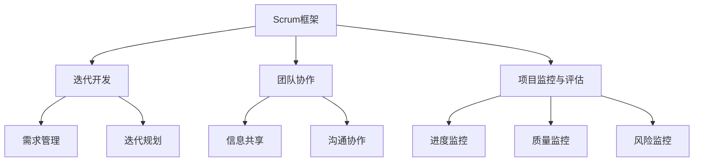

                 

# 《Scrum框架在LLM应用开发中的应用与实践》

## 关键词

Scrum框架、LLM（大型语言模型）、应用开发、敏捷开发、迭代开发、团队协作、项目监控与评估。

## 摘要

本文将深入探讨Scrum框架在LLM（大型语言模型）应用开发中的应用与实践。首先，我们将简要介绍Scrum框架的基本概念和核心原则，然后详细讲解LLM的基础知识，包括其定义、特点、架构和训练优化方法。接着，我们将重点阐述Scrum框架在LLM开发中的实际应用，包括项目规划、需求管理和迭代开发等环节。在此基础上，我们将探讨Scrum在团队协作、项目监控与评估等方面的应用，并通过实际案例进行分析和讲解。最后，我们将总结Scrum在LLM应用开发中的最佳实践，并提出相关注意事项和拓展阅读建议。

## 引言

### 1.1 书籍背景与目的

近年来，随着人工智能技术的飞速发展，LLM（大型语言模型）在自然语言处理、智能问答、文本生成等领域取得了显著成果。然而，LLM应用开发的复杂性日益增加，对项目管理和团队协作提出了更高的要求。Scrum作为一种敏捷开发方法，以其灵活、高效的特性，逐渐成为LLM应用开发中的重要工具。本书旨在深入探讨Scrum框架在LLM应用开发中的应用与实践，帮助读者了解Scrum的基本原理和实际操作方法，提升项目管理和团队协作能力。

### 1.2 LLM的发展现状与趋势

LLM作为一种先进的自然语言处理技术，近年来在人工智能领域取得了广泛关注。随着计算能力的提升和海量数据资源的积累，LLM在语言理解、文本生成、机器翻译、对话系统等方面取得了显著进展。未来，随着技术的不断成熟和应用场景的拓展，LLM将在更多的领域发挥重要作用，如智能客服、智能教育、智能医疗等。

### 1.3 Scrum框架在LLM开发中的应用

Scrum框架作为一种敏捷开发方法，适用于复杂、多变的项目管理。在LLM应用开发中，Scrum框架可以帮助团队快速响应需求变化，提高开发效率，确保项目顺利进行。通过Scrum的迭代开发模式、持续集成和持续交付，LLM项目可以更快地推向市场，满足用户需求。

### 2. Scrum框架概述

#### 2.1 Scrum的基本概念

Scrum是一种敏捷开发方法，旨在通过迭代、增量开发的方式，快速响应需求变化，提高项目交付效率。Scrum框架包括三个核心角色：产品负责人（Product Owner）、Scrum Master和开发团队；五个事件：冲刺计划、每日站会、冲刺评审、冲刺回顾和冲刺；以及三个艺术：透明度、检视和适应。

#### 2.2 Scrum的框架和流程

Scrum框架包括三个主要阶段：冲刺（Sprint）、迭代（Iteration）和发布（Release）。每个阶段包含多个事件，具体流程如下：

1. **冲刺计划**：产品负责人与开发团队共同确定本次冲刺的目标和任务。
2. **每日站会**：开发团队每日召开站会，讨论进展、问题和计划。
3. **冲刺评审**：开发团队向产品负责人和利益相关者展示冲刺成果，获取反馈。
4. **冲刺回顾**：团队总结本次冲刺的经验和教训，为下一次冲刺做好准备。

#### 2.3 Scrum的核心原则

Scrum的核心原则包括：

1. **透明度**：项目进展、问题和风险对团队成员和利益相关者透明。
2. **检视**：通过持续评审和反思，不断改进项目过程和产品质量。
3. **适应**：快速响应需求变化，调整计划和策略。

### 3. LLM基础知识

#### 3.1 LLM的定义与特点

LLM（Large Language Model）是指具有强大语言理解和生成能力的大型神经网络模型。与传统的语言模型相比，LLM具有以下特点：

1. **规模庞大**：LLM通常具有数十亿到千亿个参数，能够处理复杂的语言现象。
2. **高精度**：通过训练大量数据，LLM在自然语言处理任务中具有很高的准确率。
3. **灵活性**：LLM可以应用于多种自然语言处理任务，如文本生成、机器翻译、问答系统等。

#### 3.2 LLM的架构与组件

LLM的架构通常包括以下组件：

1. **编码器（Encoder）**：将输入文本编码为高维向量。
2. **解码器（Decoder）**：将编码后的向量解码为输出文本。
3. **注意力机制（Attention Mechanism）**：用于捕捉输入文本中的关键信息。
4. **损失函数（Loss Function）**：用于评估模型在训练过程中的表现。

#### 3.3 LLM的训练与优化

LLM的训练与优化通常涉及以下步骤：

1. **数据收集与预处理**：收集大量文本数据，并进行预处理，如分词、去噪等。
2. **模型训练**：通过反向传播算法，不断调整模型参数，使模型在训练数据上达到最小损失。
3. **模型评估与优化**：在验证集和测试集上评估模型性能，根据评估结果调整模型结构和参数。

### 4. Scrum在LLM开发中的实际应用

#### 4.1 Scrum在LLM项目规划中的应用

Scrum框架在LLM项目规划中的应用主要体现在以下几个方面：

1. **需求管理**：产品负责人与利益相关者共同确定项目目标和需求。
2. **项目计划**：开发团队根据需求和资源情况，制定冲刺计划和迭代计划。
3. **风险评估**：识别项目风险，制定应对策略。

#### 4.2 Scrum在LLM需求管理中的应用

在LLM需求管理中，Scrum框架可以帮助团队快速响应需求变化，提高需求实现的效率。具体方法包括：

1. **用户故事编写**：将需求分解为用户故事，明确故事的价值和实现条件。
2. **优先级排序**：根据用户故事的重要性和紧急性，进行优先级排序。
3. **迭代交付**：在每次迭代中，选择高优先级的故事进行开发。

#### 4.3 Scrum在LLM迭代开发中的应用

在LLM迭代开发中，Scrum框架可以帮助团队实现快速迭代和持续改进。具体方法包括：

1. **冲刺计划**：确定本次冲刺的目标和任务，明确每个任务的责任人。
2. **每日站会**：确保团队成员了解项目进展，及时解决遇到的问题。
3. **冲刺评审**：展示冲刺成果，获取用户和利益相关者的反馈。
4. **冲刺回顾**：总结冲刺过程中的经验教训，为下一次冲刺做好准备。

### 5. Scrum在LLM团队协作中的应用

#### 5.1 Scrum在LLM团队构建中的应用

Scrum框架在LLM团队构建中的应用主要体现在以下几个方面：

1. **角色定义**：明确团队中每个成员的角色和职责。
2. **技能匹配**：确保团队成员具备完成项目所需的技能。
3. **团队协作**：通过日常站会和冲刺评审等会议，促进团队成员之间的沟通和协作。

#### 5.2 Scrum在LLM沟通协作中的应用

Scrum框架在LLM沟通协作中的应用主要体现在以下几个方面：

1. **信息共享**：确保项目进展、问题和风险对团队成员透明。
2. **反馈机制**：通过冲刺评审和冲刺回顾，及时获取用户和利益相关者的反馈。
3. **决策透明**：确保团队成员了解项目决策的依据和过程。

#### 5.3 Scrum在LLM风险管理中的应用

Scrum框架在LLM风险管理中的应用主要体现在以下几个方面：

1. **风险识别**：在项目规划和迭代开发过程中，持续识别项目风险。
2. **风险分析**：评估风险的概率和影响，制定应对策略。
3. **风险监控**：在项目执行过程中，持续监控风险，及时调整项目计划。

### 6. Scrum在LLM项目监控与评估中的应用

#### 6.1 Scrum在LLM项目监控中的应用

Scrum框架在LLM项目监控中的应用主要体现在以下几个方面：

1. **进度监控**：通过每日站会和冲刺评审，了解项目进展情况。
2. **质量监控**：通过模型评估和用户反馈，评估项目成果的质量。
3. **风险监控**：识别项目风险，并及时采取应对措施。

#### 6.2 Scrum在LLM项目评估中的应用

Scrum框架在LLM项目评估中的应用主要体现在以下几个方面：

1. **成果评估**：通过模型评估和用户反馈，评估项目成果的有效性。
2. **过程评估**：通过冲刺回顾和项目总结，评估项目过程的有效性。
3. **经验总结**：总结项目过程中的经验教训，为后续项目提供参考。

#### 6.3 Scrum在LLM项目改进中的应用

Scrum框架在LLM项目改进中的应用主要体现在以下几个方面：

1. **问题解决**：通过冲刺回顾和项目总结，识别项目中的问题，并采取改进措施。
2. **过程优化**：根据项目评估结果，优化项目过程和管理方法。
3. **持续改进**：通过持续监控和评估，不断改进项目质量和效率。

### 7. Scrum在LLM应用开发中的实践案例

#### 7.1 实践案例1：某公司的LLM应用开发

在本案例中，某公司采用Scrum框架进行LLM应用开发。通过冲刺计划和每日站会，确保团队成员了解项目进展和任务分配。在每次迭代中，团队根据用户反馈和需求变化，调整开发计划和任务。通过冲刺评审和冲刺回顾，团队及时解决问题，持续改进项目质量。

#### 7.2 实践案例2：某平台的LLM应用开发

在本案例中，某平台采用Scrum框架进行LLM应用开发。平台团队通过Scrum的迭代开发模式，快速响应市场需求，优化模型性能和用户体验。通过持续集成和持续交付，平台实现了快速迭代和持续改进，提升了用户满意度。

#### 7.3 实践案例3：某智能客服系统的LLM应用开发

在本案例中，某智能客服系统采用Scrum框架进行LLM应用开发。通过Scrum的团队协作和沟通机制，确保团队成员紧密合作，共同解决项目中遇到的问题。通过冲刺评审和冲刺回顾，团队不断优化客服系统的性能和用户体验。

### 结论

Scrum框架在LLM应用开发中具有广泛的应用前景。通过Scrum的迭代开发模式、团队协作和持续改进，LLM项目可以更快地响应市场需求，提高开发效率，提升产品质量。未来，随着人工智能技术的不断发展，Scrum框架将在LLM应用开发中发挥更为重要的作用。

### 最佳实践 Tips

1. **明确需求和目标**：在项目启动阶段，确保与利益相关者明确需求和目标，为后续开发提供指导。
2. **定期进行冲刺评审和冲刺回顾**：通过冲刺评审和冲刺回顾，及时获取用户和利益相关者的反馈，持续改进项目质量。
3. **保持团队沟通与协作**：通过每日站会、冲刺评审和冲刺回顾，确保团队成员之间的沟通与协作，提高项目效率。
4. **持续优化项目管理方法**：根据项目评估结果和团队反馈，不断优化项目管理方法，提高项目质量和效率。

### 小结

本文深入探讨了Scrum框架在LLM应用开发中的应用与实践。通过分析Scrum的基本概念、核心原则和在LLM项目开发中的实际应用，我们了解到Scrum框架在提高开发效率、团队协作和项目监控等方面的优势。未来，随着人工智能技术的不断发展，Scrum框架在LLM应用开发中将发挥更为重要的作用。

### 注意事项

1. **需求管理**：在项目启动阶段，确保与利益相关者明确需求和目标，为后续开发提供指导。
2. **团队协作**：保持团队沟通与协作，通过每日站会、冲刺评审和冲刺回顾，确保团队成员之间的沟通与协作。
3. **风险管理**：在项目规划和执行过程中，持续识别项目风险，并及时采取应对措施。

### 拓展阅读

1. 《Scrum精髓：实践指南》作者：杰夫·萨瑟兰（Jeff Sutherland）
2. 《敏捷软件开发：原则、实践与模式》作者：迈克尔·斯特里特（Michael Street）
3. 《大型语言模型：原理与实践》作者：黄宇、刘知远、谢幸

## 作者信息

作者：AI天才研究院/AI Genius Institute & 禅与计算机程序设计艺术 /Zen And The Art of Computer Programming

（完）

## 附录

### 1. Mermaid 流程图

以下是一个简单的Mermaid流程图示例，用于展示核心概念与联系：



### 2. Python源代码与数学模型

以下是一个简单的Python源代码示例，用于解释LLM的训练过程：

```python
import tensorflow as tf
from tensorflow.keras.models import Sequential
from tensorflow.keras.layers import Embedding, LSTM, Dense

# 假设输入词汇个数为1000，序列长度为50
vocab_size = 1000
sequence_length = 50

# 构建模型
model = Sequential()
model.add(Embedding(vocab_size, 256, input_length=sequence_length))
model.add(LSTM(128))
model.add(Dense(vocab_size, activation='softmax'))

# 编译模型
model.compile(optimizer='adam', loss='categorical_crossentropy', metrics=['accuracy'])

# 模型训练
model.fit(x_train, y_train, epochs=10, batch_size=32)
```

### 3. 数学公式

以下是一些与LLM训练相关的数学公式：

$$
\text{损失函数} = -\sum_{i=1}^{N} y_i \log(p_i)
$$

$$
\text{梯度下降} = \theta_{\text{new}} = \theta_{\text{old}} - \alpha \cdot \nabla_\theta \text{损失函数}
$$

其中，$y_i$ 为第 $i$ 个样本的真实标签，$p_i$ 为模型预测的概率，$N$ 为样本总数，$\theta$ 为模型参数，$\alpha$ 为学习率。

（完）

