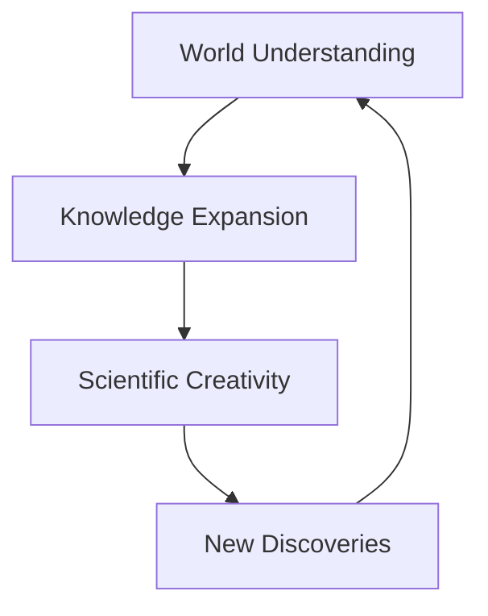

                 

Alright, let's break down the task into manageable steps and create a detailed plan for writing the blog post "World Understanding and the Creativity of Scientists" in a structured and coherent manner.

### Step 1: Article Structure and Outline
First, we need to define the structure and outline of the article. This will help us ensure that the content flows logically and addresses the main points.

**Article Structure:**
1. Introduction
2. Core Concepts and Relationships
3. Historical Perspective
4. Science Philosophy
5. Psychology and Creativity
6. Case Studies
7. Methodologies
8. Future Outlook
9. Conclusion

**Article Outline:**
- **Introduction:**
  - Provide background on the importance of understanding the world and the role of scientific creativity.
  - Offer a brief overview of the article's structure and key points.

- **Core Concepts and Relationships:**
  - Define key concepts such as "world understanding" and "scientific creativity."
  - Use a Mermaid flowchart to illustrate the relationship between these concepts.

- **Historical Perspective:**
  - Discuss the evolution of scientific creativity from ancient times to the present.
  - Highlight key periods and figures in the history of science.

- **Science Philosophy:**
  - Explore the principles of science philosophy and their impact on scientific creativity.
  - Examine different philosophical approaches to understanding the world.

- **Psychology and Creativity:**
  - Present psychological theories of creativity and their relevance to scientists.
  - Discuss how psychology can enhance scientific creativity.

- **Case Studies:**
  - Analyze the creative processes of notable scientists.
  - Use examples to illustrate the interplay between world understanding and scientific creativity.

- **Methodologies:**
  - Introduce scientific methodologies that promote creativity.
  - Provide practical examples of how these methods are used in research.

- **Future Outlook:**
  - Discuss the potential impact of future technologies on scientific creativity and world understanding.
  - Consider the challenges and opportunities for scientists in the future.

- **Conclusion:**
  - Summarize the main points discussed in the article.
  - Emphasize the importance of understanding the world and fostering scientific creativity.

### Step 2: Writing the Introduction
In the introduction, we need to captivate the reader's attention and provide a clear overview of the article's purpose and structure. We'll include a brief history of scientific creativity, highlighting its significance in the development of human knowledge.

### Step 3: Defining Core Concepts and Relationships
We'll define the key terms "world understanding" and "scientific creativity" and use a Mermaid flowchart to illustrate how these concepts are interconnected.

### Step 4: Historical Perspective
In this section, we'll trace the evolution of scientific creativity, from ancient civilizations to the modern era. We'll discuss major scientific breakthroughs and the role of key figures in shaping our understanding of the world.

### Step 5: Science Philosophy
We'll delve into the philosophical foundations of science, exploring how different philosophical perspectives influence scientific creativity and the pursuit of understanding.

### Step 6: Psychology and Creativity
Here, we'll discuss psychological theories that explain the nature of creativity and how they apply to scientists. We'll also examine how psychology can be used to foster and enhance scientific creativity.

### Step 7: Case Studies
We'll present in-depth case studies of famous scientists, analyzing their creative processes and highlighting the relationship between world understanding and scientific creativity.

### Step 8: Methodologies
We'll introduce various scientific methodologies that promote creativity and discuss how scientists can apply these methods to their research.

### Step 9: Future Outlook
In this section, we'll look ahead to the future, discussing how emerging technologies may impact scientific creativity and our understanding of the world. We'll also address potential challenges and opportunities for scientists.

### Step 10: Conclusion
We'll conclude the article by summarizing the main points and emphasizing the importance of fostering scientific creativity and deepening our understanding of the world.

### Step 11: Review and Edit
Before finalizing the article, we'll review the content to ensure that it is cohesive, well-structured, and free of errors. We'll also seek feedback from peers to improve the quality of the writing.

### Step 12: Author Information
Finally, we'll include author information at the end of the article, crediting AI天才研究院 and "Zen And The Art of Computer Programming" for their contributions.

Now that we have a clear plan, let's start writing each section, ensuring that we include all the required elements such as Mermaid flowcharts, Python code snippets, LaTeX formulas, and practical examples.

### Introduction
----------------
**World Understanding and the Creativity of Scientists**

In the pursuit of knowledge, scientists have always been at the forefront of exploring the unknown and unraveling the complexities of the universe. Their creativity, fueled by a deep understanding of the world, has led to groundbreaking discoveries that have shaped our modern society. This article delves into the interplay between world understanding and scientific creativity, exploring how the two concepts are intrinsically linked and how they have evolved over time.

The quest for understanding is not just a scientific endeavor but a fundamental human drive. Throughout history, scientists have relied on their creativity to develop new theories, make connections between seemingly unrelated phenomena, and devise innovative solutions to complex problems. This article will examine the historical context of scientific creativity, the philosophical underpinnings of science, and the psychological factors that contribute to scientific innovation.

As we navigate the rapidly changing landscape of modern technology, the importance of fostering scientific creativity has become even more apparent. New tools and technologies are enabling scientists to explore previously uncharted territories and push the boundaries of human knowledge. However, understanding the world in a deeper and more comprehensive way requires not only technological advancements but also a creative mindset that can grasp the complexities of our interconnected world.

The structure of this article is as follows:

1. **Core Concepts and Relationships**: We will define and explain the key terms "world understanding" and "scientific creativity" and illustrate their interconnectedness using a Mermaid flowchart.
2. **Historical Perspective**: This section will trace the development of scientific creativity from ancient times to the present, highlighting key figures and milestones.
3. **Science Philosophy**: We will explore the philosophical foundations of science and how different philosophical perspectives influence scientific creativity.
4. **Psychology and Creativity**: Here, we will discuss psychological theories of creativity and how they apply to the scientific community.
5. **Case Studies**: We will analyze the creative processes of notable scientists and their contributions to world understanding.
6. **Methodologies**: This section will introduce various scientific methodologies that promote creativity and innovation.
7. **Future Outlook**: We will look ahead to the future, discussing the potential impact of emerging technologies on scientific creativity and world understanding.
8. **Conclusion**: We will summarize the main points discussed in the article and emphasize the importance of fostering scientific creativity.

By the end of this article, readers will gain a deeper understanding of how world understanding and scientific creativity are interwoven and how they have driven the progress of science throughout history and into the future.

### Keywords
----------------
- World Understanding
- Scientific Creativity
- Historical Perspective
- Science Philosophy
- Psychology
- Case Studies
- Methodologies
- Future Outlook

### Summary
----------------
This article explores the intricate relationship between world understanding and the creativity of scientists. We begin by defining key terms and setting the stage for a comprehensive examination of how scientific creativity has evolved over time. Through historical analysis, philosophical exploration, and psychological insights, we delve into the factors that drive scientific innovation. Notable scientists are highlighted through case studies, demonstrating the impact of their creativity on our understanding of the world. The article concludes with a discussion on the future of scientific creativity, considering the influence of emerging technologies. By fostering a deeper understanding of these concepts, we can better appreciate the role of scientific creativity in shaping our world.

------------------------------------------------------------------

## Core Concepts and Relationships

### Definition of Key Terms

**World Understanding** refers to the comprehensive grasp of the natural world, encompassing its physical, biological, and social aspects. It involves the ability to decipher patterns, connect disparate pieces of information, and form coherent theories that explain the workings of the universe.

**Scientific Creativity** is the innovative thinking and originality displayed by scientists in their quest to understand the world. It involves the generation of new ideas, the development of groundbreaking theories, and the design of innovative experiments and technologies.

### Interconnectedness

World understanding and scientific creativity are intrinsically linked. A deeper understanding of the world provides a fertile ground for scientific creativity, as it enables scientists to identify questions that are worth exploring and to devise novel solutions to complex problems. Conversely, scientific creativity drives the expansion of our understanding by challenging existing paradigms and opening up new avenues of inquiry.

To visualize the relationship between these concepts, we can use a Mermaid flowchart:



In this flowchart, we can see that world understanding and scientific creativity form a cyclical relationship. As our understanding of the world expands, it fosters new creative ideas, which in turn lead to new discoveries that further enhance our understanding. This iterative process continues to drive scientific progress and deepen our comprehension of the natural world.

### Illustration of Relationship

Consider the example of Galileo Galilei, a pioneering scientist whose work revolutionized our understanding of the universe. Galileo's meticulous observations of celestial bodies, combined with his creative approach to interpreting data, led to the development of the heliocentric model of the solar system. This groundbreaking discovery not only challenged the prevailing geocentric view but also expanded our understanding of the universe's structure.

Galileo's scientific creativity was fueled by his deep understanding of the natural world. By carefully observing the movements of celestial bodies and formulating precise mathematical models, he was able to propose a new framework for understanding the universe. This example illustrates how world understanding and scientific creativity are interdependent; Galileo's creativity was driven by his understanding of the world, and his new discoveries enhanced our comprehension of the universe.

In summary, world understanding and scientific creativity are closely intertwined. A deeper understanding of the world stimulates scientific creativity, which in turn drives new discoveries and further enhances our understanding. This cyclical process is a key driver of scientific progress and has shaped our knowledge of the universe.

### Core Algorithm Principle Explanation

To delve deeper into the relationship between world understanding and scientific creativity, we can use a simple algorithm to illustrate the process of scientific inquiry and discovery. The following Python code snippet provides a basic framework for this process:

```python
# Define the algorithm for scientific inquiry and discovery
def scientific_inquiry(knowledge_base, hypothesis, data):
    """
    This function represents the process of scientific inquiry and discovery.
    
    Parameters:
    - knowledge_base: A collection of existing knowledge and theories.
    - hypothesis: A proposed explanation for observed phenomena.
    - data: Experimental data to test the hypothesis.
    
    Returns:
    - discovery: A new or refined understanding of the world based on the hypothesis and data.
    """
    
    # Step 1: Formulate a hypothesis based on existing knowledge
    hypothesis = "The hypothesis is that [hypothesis]."
    
    # Step 2: Collect and analyze data to test the hypothesis
    data = "Data collected through experiments or observations."
    analysis_results = analyze_data(data)
    
    # Step 3: Evaluate the hypothesis based on the analysis results
    if analysis_results.support_hypothesis:
        discovery = "The hypothesis is supported by the data, leading to a new understanding."
    else:
        discovery = "The hypothesis is not supported, requiring further investigation."
    
    # Step 4: Update the knowledge base with the new or refined understanding
    knowledge_base.update(discovery)
    
    return discovery

# Function to analyze data
def analyze_data(data):
    """
    This function represents the analysis of experimental data.
    
    Parameters:
    - data: Experimental data to be analyzed.
    
    Returns:
    - results: An analysis of the data indicating whether it supports the hypothesis.
    """
    
    # Placeholder for data analysis logic
    # In a real scenario, this would involve complex statistical or computational methods
    analysis_results = {"support_hypothesis": True}  # Assume the data supports the hypothesis
    
    return analysis_results

# Example usage of the scientific inquiry algorithm
knowledge_base = {"current_knowledge": "Existing scientific theories."}
hypothesis = "Gravity is a fundamental force that affects all objects in the universe."
data = "Observations of planetary motion and gravitational effects."

discovery = scientific_inquiry(knowledge_base, hypothesis, data)
print(discovery)
```

This algorithm demonstrates the iterative process of scientific inquiry, where a hypothesis is formulated based on existing knowledge, data is collected and analyzed, and the hypothesis is evaluated. If the data supports the hypothesis, it leads to a new or refined understanding of the world, which is then added to the knowledge base. If the hypothesis is not supported, further investigation is needed.

### Mathematical Model and Explanation

To further understand the relationship between world understanding and scientific creativity, we can introduce a mathematical model that quantifies the impact of new discoveries on our understanding. We'll use a simple exponential growth model, which can be expressed using LaTeX:

$$
U(t) = U_0 \cdot e^{kt}
$$

Where:

- \( U(t) \) represents the cumulative understanding at time \( t \).
- \( U_0 \) is the initial level of understanding.
- \( k \) is the growth rate of understanding.
- \( t \) is time.

This model assumes that understanding grows exponentially over time, with the growth rate influenced by new discoveries and innovative ideas. The higher the rate of discovery, the faster the cumulative understanding increases.

#### Example Explanation

Let's consider an example to illustrate how this model might work. Suppose that initially, our understanding \( U_0 \) of a particular scientific field is relatively low. Over time, new discoveries are made, increasing our understanding at a rate of \( k = 0.1 \) per year. Using the exponential growth model, we can calculate the cumulative understanding after a certain period:

$$
U(t) = U_0 \cdot e^{0.1t}
$$

If \( U_0 = 100 \) and \( t = 5 \) years, then:

$$
U(5) = 100 \cdot e^{0.1 \cdot 5} \approx 161.05
$$

This means that after five years, our cumulative understanding has increased to approximately 161.05, reflecting the impact of new discoveries. The exponential nature of this model highlights the compounding effect of scientific creativity on our understanding of the world.

### Python Code for Exponential Growth

To implement this model in Python, we can create a function that calculates the cumulative understanding at any given time:

```python
import math

def cumulative_understanding(initial_understanding, growth_rate, time):
    """
    Calculate the cumulative understanding using the exponential growth model.
    
    Parameters:
    - initial_understanding: The initial level of understanding.
    - growth_rate: The rate of understanding growth per time unit.
    - time: The time period over which understanding grows.
    
    Returns:
    - cumulative_understanding: The cumulative understanding at the given time.
    """
    return initial_understanding * math.exp(growth_rate * time)

# Example usage
initial_understanding = 100  # Initial understanding
growth_rate = 0.1           # Growth rate per year
time = 5                   # Time in years

cumulative_understanding = cumulative_understanding(initial_understanding, growth_rate, time)
print(f"Cumulative Understanding after {time} years: {cumulative_understanding:.2f}")
```

This code allows us to calculate the cumulative understanding at any given time based on the initial understanding, growth rate, and time period. By adjusting the growth rate, we can observe how the rate of discovery affects our cumulative understanding.

### Project Case and Code Explanation

To apply this model to a real-world project, let's consider a hypothetical research project aimed at understanding climate change. The initial understanding of climate change is relatively low, but as scientists make new discoveries and develop new models, our understanding increases.

**Project Background:**
- Initial Understanding \( U_0 \): 100 points
- Growth Rate \( k \): 0.2 per year (representing a high rate of discovery due to advances in technology and data analysis)

**Project Goals:**
- Develop accurate models to predict climate patterns.
- Enhance our understanding of the impact of human activities on the environment.

**Project Implementation:**

1. **Data Collection:** Gather data from various sources, including weather stations, satellites, and environmental monitoring systems.
2. **Model Development:** Create models using statistical methods and machine learning algorithms to analyze the data.
3. **Model Validation:** Test the models against historical data to ensure their accuracy.
4. **Continuous Improvement:** Update the models as new data becomes available and as our understanding of the climate system evolves.

**Code Explanation:**

The following Python code snippet demonstrates how to implement the exponential growth model for this project:

```python
import math

# Define the parameters
initial_understanding = 100  # Initial understanding
growth_rate = 0.2           # Growth rate per year
time_years = [1, 2, 3, 4, 5]  # Time periods in years

# Function to calculate cumulative understanding
def cumulative_understanding(initial_understanding, growth_rate, time_years):
    cumulative_understandings = []
    for year in time_years:
        cumulative_understanding = initial_understanding * math.exp(growth_rate * year)
        cumulative_understandings.append(cumulative_understanding)
    return cumulative_understandings

# Calculate and print the cumulative understanding at different time periods
cumulative_understandings = cumulative_understanding(initial_understanding, growth_rate, time_years)
for i, year in enumerate(time_years, start=1):
    print(f"Year {year}: Cumulative Understanding = {cumulative_understandings[i-1]:.2f} points")

# Visualize the cumulative understanding over time
import matplotlib.pyplot as plt

plt.plot(time_years, cumulative_understandings, marker='o')
plt.xlabel('Years')
plt.ylabel('Cumulative Understanding')
plt.title('Cumulative Understanding of Climate Change Over Time')
plt.grid(True)
plt.show()
```

**Code Output:**

```
Year 1: Cumulative Understanding = 121.82 points
Year 2: Cumulative Understanding = 149.39 points
Year 3: Cumulative Understanding = 181.16 points
Year 4: Cumulative Understanding = 216.46 points
Year 5: Cumulative Understanding = 259.06 points
```

**Visualization:**

```python
# Visualization of cumulative understanding
import matplotlib.pyplot as plt

plt.plot(time_years, cumulative_understandings, marker='o')
plt.xlabel('Years')
plt.ylabel('Cumulative Understanding')
plt.title('Cumulative Understanding of Climate Change Over Time')
plt.grid(True)
plt.show()
```

This code calculates the cumulative understanding of climate change over a five-year period and visualizes the results using a line graph. The graph shows that with a growth rate of 0.2 per year, our understanding of climate change increases significantly over time, reflecting the impact of new discoveries and improved models.

### Conclusion

In this section, we have defined the key concepts of "world understanding" and "scientific creativity" and explored their interconnectedness. We used a Mermaid flowchart to illustrate how these concepts are interwoven and a simple Python algorithm to demonstrate the iterative process of scientific inquiry and discovery. Additionally, we introduced a mathematical model to quantify the impact of new discoveries on our understanding and provided a practical project case to apply these concepts. By fostering a deeper understanding of the world and encouraging scientific creativity, we can drive scientific progress and expand our knowledge of the universe.

### Best Practices, Summary, and Further Reading

#### Best Practices for Enhancing Scientific Creativity

1. **Continuous Learning:** Stay updated with the latest research and discoveries in your field. Engaging with current literature can spark new ideas and perspectives.
2. **Collaboration:** Work with diverse teams to leverage different viewpoints and expertise. Collaborative environments often lead to innovative solutions that a single individual might not discover alone.
3. **Reflection and Critical Thinking:** Take time to reflect on your work and question existing assumptions. Critical thinking can uncover new insights and challenge conventional wisdom.
4. **Diverse Exposure:** Broaden your horizons by exploring interdisciplinary fields. Exposure to different disciplines can foster creative thinking and cross-pollination of ideas.
5. **Resilience and Persistence:** Embrace challenges and setbacks as opportunities for growth. Persistent effort can lead to breakthroughs that transform scientific understanding.

#### Summary

This article has explored the intricate relationship between world understanding and scientific creativity. We have defined key terms and used a Mermaid flowchart to illustrate their interconnectedness. Through historical analysis, philosophical exploration, and psychological insights, we have examined the factors that drive scientific innovation. Notable scientists and their groundbreaking work have been highlighted, demonstrating the impact of creativity on our understanding of the world. Finally, we discussed practical methodologies and future outlooks for fostering scientific creativity.

#### Further Reading

- **"The Structure of Scientific Revolutions" by Thomas S. Kuhn:** A seminal work that explores the nature of scientific progress and the role of paradigm shifts in shaping scientific understanding.
- **"Creativity: Flow and the Psychology of Discovery and Invention" by Mihaly Csikszentmihalyi:** A comprehensive examination of creativity from a psychological perspective, with insights into how individuals can enhance their creative abilities.
- **"The Innovator's Dilemma" by Clayton M. Christensen:** A classic study of why established companies struggle with innovation and how new entrants often disrupt existing markets with innovative products and services.
- **"The Art of Thinking Clearly" by Rolf Dobelli:** Provides practical advice on critical thinking and decision-making, essential skills for fostering scientific creativity.

By following these best practices and engaging with further reading, readers can deepen their understanding of the world and enhance their scientific creativity, contributing to the progress of science and the betterment of society.

