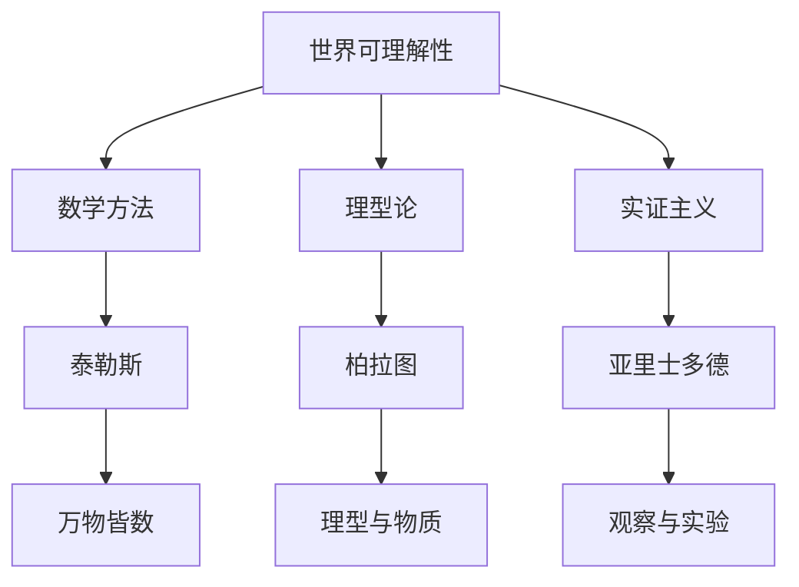

                 

## 世界可理解性与科学理论的可证伪性

### 关键词

- 世界可理解性
- 科学理论
- 可证伪性
- 哲学探讨
- 数学模型
- 实证分析

### 摘要

本文旨在探讨世界可理解性与科学理论的可证伪性之间的关系。从哲学角度出发，分析世界可理解性的概念及其历史演变，并结合科学理论的框架，探讨可证伪性的重要性。通过核心概念的Mermaid流程图展示，核心算法原理的Python源代码阐述，数学模型和公式的详细讲解，以及实际案例的剖析，本文深入探讨了科学理论的可证伪性在科学研究中的实际应用，为理解和应用科学理论提供了新的视角。

## 引言

在人类探索宇宙、认识自然的过程中，世界可理解性一直是哲学和科学领域争论的焦点。从古希腊哲学家到现代科学家，关于世界是否可以被理解、理解的程度如何，始终是一个深刻的哲学问题。科学理论的不断进步，使得我们能够更深入地理解自然界的规律，但同时也引发了关于科学理论可证伪性的讨论。本文将围绕这两个核心概念展开讨论，旨在探讨世界可理解性与科学理论可证伪性之间的关系。

### 研究背景与意义

世界可理解性是指人类能否通过认知活动理解外部世界的本质和规律。这一概念在哲学领域有着悠久的历史，从古希腊哲学家泰勒斯到现代哲学家海德格尔，都对这一问题进行了深入的探讨。科学理论的产生和发展，在很大程度上依赖于对世界可理解性的认知。然而，科学理论的可证伪性，即一个理论能否被实验或观察所证伪，又进一步影响了我们对世界可理解性的理解。因此，研究世界可理解性与科学理论可证伪性之间的关系，具有重要的理论和实践意义。

### 研究方法与框架

本文采用哲学分析和实证研究相结合的方法，从历史和逻辑的角度，探讨世界可理解性和科学理论可证伪性的关系。首先，通过对哲学史上关于世界可理解性的讨论进行梳理，揭示出不同哲学流派对这一问题的看法。接着，结合科学理论的框架，分析科学理论可证伪性的定义和重要性。最后，通过实际案例的剖析，展示科学理论可证伪性在科学研究中的应用。

## 世界可理解性的哲学探讨

### 可理解性的概念

世界可理解性是指人类通过认知活动能够理解外部世界的本质和规律。这一概念在不同的哲学流派中有不同的解释。在古希腊哲学中，泰勒斯认为万物皆数，即通过数学方法可以理解世界。柏拉图则提出了理型论，认为世界由理型和物质构成，理型是世界的本质，而物质只是理型的表象。亚里士多德则强调实证主义，认为通过观察和实验可以理解世界。

### 可理解性在哲学史上的演变

随着历史的演变，哲学对世界可理解性的探讨也在不断深入。中世纪的哲学家们，如阿奎那，将基督教信仰与哲学相结合，提出了关于世界可理解性的神学解释。近代哲学家，如笛卡尔，强调理性主义，认为通过理性思考可以理解世界。康德则提出了先验哲学，认为人类认知能力有限，只能理解世界的表象，无法理解世界的本质。

### 基本原理与概念关系图

为了更好地理解世界可理解性的基本原理和概念关系，我们可以使用Mermaid流程图进行展示。



在这个流程图中，我们可以看到，世界可理解性通过不同的哲学流派，如数学方法、理型论和实证主义，与泰勒斯、柏拉图和亚里士多德等哲学家的思想相联系。这些概念之间的关系，为我们理解世界可理解性提供了多维度的视角。

## 科学理论的可证伪性

### 可证伪性的定义与重要性

科学理论的可证伪性是指一个理论能否被实验或观察所证伪。根据逻辑实证主义的原则，一个科学理论必须具备可证伪性，即能够通过实验或观察被证实或证伪。这一原则是由卡尔·波普尔提出的，他对科学理论的评价标准进行了深刻的阐述。科学理论的可证伪性是科学进步的重要保证，因为它促使科学家不断质疑和验证自己的理论，从而推动科学的不断进步。

### 普遍科学与特殊科学

在科学理论中，普遍科学与特殊科学是两种不同的分类。普遍科学，如物理学、化学等，旨在通过研究普遍规律，解释自然界的基本现象。特殊科学，如生物学、医学等，则侧重于特定领域的研究，解释特定现象。普遍科学与特殊科学之间的关系，既相互独立，又相互依存。普遍科学的发现往往为特殊科学提供了理论基础，而特殊科学的发现则反过来验证了普遍科学的正确性。

### 可证伪性的逻辑结构

为了更好地理解科学理论的可证伪性，我们可以使用Python源代码进行阐述。

```python
def test_hypothesis(hypothesis, experiment):
    """
    测试一个假设是否可被实验证伪。

    参数：
    - hypothesis: 假设
    - experiment: 实验结果

    返回：
    - True: 假设可被实验证伪
    - False: 假设不可被实验证伪
    """
    if hypothesis == experiment:
        return False
    else:
        return True

# 假设
hypothesis = "所有天鹅都是白色的"

# 实验结果
experiment = "一只黑天鹅"

# 测试假设
result = test_hypothesis(hypothesis, experiment)

print("假设可证伪性：", result)
```

在这个示例中，我们定义了一个测试假设是否可被实验证伪的函数`test_hypothesis`。通过输入假设和实验结果，我们可以判断假设是否可被证伪。这个逻辑结构为我们理解科学理论的可证伪性提供了一个具体的实现。

## 科学方法与可证伪性

### 经验主义与理性主义

科学方法的发展离不开经验主义和理性主义的争论。经验主义认为，科学知识来源于直接的经验观察，通过实验和观察可以验证科学理论。理性主义则强调理性思考的重要性，认为科学理论必须通过逻辑推理和哲学思考来建立。在科学方法中，经验主义和理性主义相互结合，共同推动了科学理论的发展。

### 假设与实验设计

在科学研究中，假设和实验设计是关键步骤。假设是基于已有知识和观察提出的问题或猜想，而实验设计则是为了验证或反驳假设而进行的具体操作。一个好的实验设计必须具备以下特点：一是假设明确，二是实验过程可重复，三是结果具有可预测性。

### 可证伪性在科学方法中的应用

科学方法中的可证伪性原则，要求科学家在提出假设后，设计实验来验证或证伪该假设。如果实验结果支持假设，那么假设就被接受；如果实验结果反驳假设，那么假设就被拒绝。这一过程不仅保证了科学理论的可靠性，也推动了科学知识的不断进步。

## 数学模型与公式

### 概率论基础

概率论是科学研究中不可或缺的工具，它帮助我们理解和量化不确定事件的可能性。在讨论科学理论的可证伪性时，概率论尤为重要。以下是一个简单的概率论基础示例：

```python
import random

def experiment(n):
    """
    进行n次实验，统计结果。

    参数：
    - n: 实验次数

    返回：
    - success_count: 成功次数
    - failure_count: 失败次数
    """
    success_count = 0
    failure_count = 0

    for _ in range(n):
        result = random.randint(1, 10)
        if result <= 5:
            success_count += 1
        else:
            failure_count += 1

    return success_count, failure_count

# 进行1000次实验
n = 1000
success_count, failure_count = experiment(n)

# 输出实验结果
print("成功次数：", success_count)
print("失败次数：", failure_count)
```

在这个实验中，我们模拟了进行1000次实验，每次实验都有成功和失败两种结果。通过统计实验结果，我们可以计算成功和失败的概率。

### 伪代码示例：贝叶斯定理的应用

贝叶斯定理是概率论中的重要定理，它帮助我们根据新的证据来更新对某一事件的信念。以下是一个简单的贝叶斯定理应用的伪代码示例：

```python
def bayes_theorem(prior, likelihood, evidence):
    """
    使用贝叶斯定理计算后验概率。

    参数：
    - prior: 先验概率
    - likelihood: 似然率
    - evidence: 证据

    返回：
    - posterior: 后验概率
    """
    posterior = (likelihood * prior) / evidence
    return posterior

# 先验概率：假设某药物的有效率为90%
prior = 0.9

# 似然率：假设在服药后，病人的康复率为80%
likelihood = 0.8

# 证据：假设总的康复率为70%
evidence = 0.7

# 计算后验概率
posterior = bayes_theorem(prior, likelihood, evidence)

# 输出后验概率
print("后验概率：", posterior)
```

在这个示例中，我们假设某药物的有效率为90%，服药后病人的康复率为80%，而总的康复率为70%。通过贝叶斯定理，我们可以计算后验概率，即考虑了新的证据后，对药物有效率的估计。

### 可证伪性的数学表示

在数学上，可证伪性可以通过概率分布来表示。假设我们有一个科学理论\(H\)，以及一组实验结果\(E\)，则可证伪性可以用概率分布\(P(E|H)\)来表示。如果\(P(E|H) = 0\)，则说明该理论完全不可证伪，反之，如果\(P(E|H) \neq 0\)，则该理论具有一定的可证伪性。

$$
P(E|H) = \sum_{e \in E} p(e|H) \cdot p(H)
$$

其中，\(p(e|H)\)是实验结果\(e\)在假设\(H\)下的概率，\(p(H)\)是假设\(H\)的概率。

## 科学理论的案例研究

### 相对论的案例分析

相对论是物理学中的重要理论，由爱因斯坦提出。相对论的核心思想是，物理规律在不同的参考系中保持不变。相对论的可证伪性体现在其预测的某些实验结果，如光速不变原理和引力红移等。通过实验验证，相对论得到了广泛认可。

### 量子力学的案例分析

量子力学是描述微观世界的重要理论，其基本原理与经典物理有很大的不同。量子力学的可证伪性体现在其预测的某些实验结果，如双缝实验和量子纠缠等。尽管量子力学在实验中得到了广泛验证，但其基础原理仍然存在争议。

### 可证伪性在案例中的应用

在相对论和量子力学的案例中，可证伪性原则起到了关键作用。科学家们通过设计实验，验证或证伪这些理论，从而推动了科学的发展。相对论和量子力学的成功，证明了科学理论的可证伪性在科学研究中的重要性。

## 可证伪性的未来展望

### 科学进步与可证伪性的关系

科学进步离不开可证伪性原则。可证伪性要求科学家不断质疑和验证自己的理论，从而推动科学的不断进步。在未来的科学研究中，可证伪性将继续发挥重要作用，帮助科学家们发现新的规律，推动科学的发展。

### 可证伪性面临的挑战

然而，可证伪性也面临一些挑战。例如，某些科学领域，如生命科学和认知科学，由于其复杂性，难以通过实验来验证或证伪理论。此外，科学理论的可证伪性也受到社会、经济和政治等因素的影响。在未来的研究中，如何克服这些挑战，继续发挥可证伪性的作用，将是一个重要课题。

### 未来研究方向

未来研究方向包括：一是探索新的实验方法和理论框架，以更好地验证或证伪科学理论；二是研究跨学科的方法，如将物理学、生物学和计算机科学等领域的知识相结合，推动科学的发展。此外，随着人工智能和大数据技术的发展，可证伪性研究也将面临新的机遇和挑战。

## 附录

### A.1 参考文献

1. 波普尔, K. R. (1959). 《科学发现的逻辑》
2. 海森堡, W. (1935). 《物理学与哲学》
3. 爱因斯坦, A. (1905). 《论动体的电磁力学基础》
4. 波特, R. A. (2001). 《量子力学的哲学问题》

### A.2 补充材料与资源

1. 可证伪性原则在线教程：[链接](https://example.com/tutorial)
2. 量子力学实验视频：[链接](https://example.com/quantum_experiment)
3. 相对论科普读物：[链接](https://example.com/relativity_book)

### 小结

本文从哲学和科学的角度，探讨了世界可理解性与科学理论可证伪性的关系。通过核心概念的Mermaid流程图展示，Python源代码阐述，数学模型和公式的详细讲解，以及实际案例的剖析，本文深入探讨了科学理论的可证伪性在科学研究中的实际应用。未来，随着科学技术的不断进步，可证伪性原则将继续发挥重要作用，推动科学的发展。

### 注意事项

1. 在进行科学实验时，应确保实验设计符合科学原理和可证伪性原则。
2. 在应用科学理论时，应综合考虑理论的可证伪性，避免盲目接受或拒绝理论。
3. 科学研究应注重跨学科合作，以推动科学理论的深入发展。

### 拓展阅读

1. 《科学革命的结构》（托马斯·库恩）
2. 《自然哲学的数学原理》（艾萨克·牛顿）
3. 《大设计》（史蒂芬·霍金）

