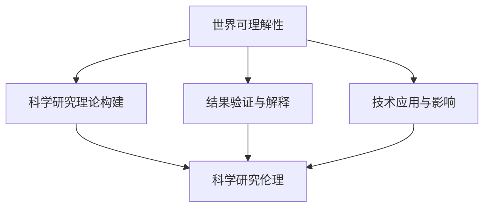

                 

### 引言

#### 背景介绍

科学研究是推动社会进步和人类文明发展的重要力量。然而，随着科学技术的迅猛发展，科学研究在带来巨大利益的同时，也面临着一系列伦理问题。这些问题不仅涉及到科学研究过程中的道德行为，还关系到科学研究成果对社会的影响。因此，如何确保科学研究过程中的伦理规范，已成为全球科学家、政策制定者和公众共同关注的话题。

在过去的几十年里，科学技术取得了令人瞩目的成就，从基因编辑到人工智能，这些技术不仅深刻改变了我们的生活方式，也带来了前所未有的伦理挑战。例如，基因编辑技术引发了关于人类基因改造和伦理边界的讨论；人工智能在提升生产力同时，也引发了隐私保护和公平性问题。这些问题不仅影响科学研究的开展，更关系到社会的公平和正义。

世界可理解性作为科学研究的重要基础，指的是世界在多大程度上可以被人类理解和解释。科学研究的目标是揭示自然规律，追求知识的真理性。然而，世界的复杂性和多样性使得科学研究面临巨大的挑战。如何确保科学研究的结果具有可理解性，如何处理复杂系统的不可预测性，这些都是当前科学研究面临的重大问题。

科学研究伦理是规范科学研究行为的准则，它旨在确保科学研究的过程和结果符合道德和伦理标准。科学研究伦理的核心原则包括尊重个人隐私、公平性、知情同意和诚实与诚信等。伦理规范为科学研究提供了明确的指导，有助于减少伦理风险，保障科学研究的正当性和社会价值。

本文旨在探讨世界可理解性与科学研究的伦理规范之间的关系，分析当前科学研究伦理面临的挑战，并探讨未来可能的发展方向。通过本文的讨论，希望为科学界、政策制定者和公众提供有益的思考和参考。

### 核心概念与联系

#### 世界可理解性的定义

世界可理解性是指世界在多大程度上能够被人类理解和解释。这个概念包含了多个层次，从简单的因果关系到复杂的系统行为，都是理解世界的重要方面。世界可理解性的研究起源于哲学和科学哲学领域，主要探讨人类是否能够通过逻辑和理性的方法理解自然界和宇宙。

从科学的角度来看，世界可理解性体现在科学理论的可验证性和可解释性。一个科学理论如果能够通过实验或观察得到验证，并且能够解释自然现象，那么这个理论就是可理解的。例如，牛顿的万有引力定律是可理解的，因为它不仅可以通过数学公式进行描述，而且能够准确地预测行星的运动。

世界可理解性与科学研究的关系体现在以下几个方面：

1. **理论构建**：科学研究的基础是构建可理解的理论。科学家通过观察和实验收集数据，然后利用这些数据构建模型和理论。如果这些模型和理论不能被理解，那么科学研究将无法进行。

2. **结果验证**：科学研究需要通过实验和观察来验证理论。如果研究结果不可理解，那么验证过程将变得困难，甚至不可能。例如，在量子物理学中，某些实验结果与经典物理学的预期不符，这要求科学家对理论进行重新理解和解释。

3. **技术应用**：科学研究成果通常会被应用到实际生活中。如果这些技术不可理解，那么公众可能对其安全性、有效性和道德性产生疑虑。例如，人工智能技术的应用在提高生产效率的同时，也引发了关于隐私保护和算法透明性的讨论。

#### 科学研究伦理的定义

科学研究伦理是规范科学研究行为的准则，它旨在确保科学研究的过程和结果符合道德和伦理标准。科学研究伦理的核心原则包括：

- **尊重个人隐私**：科学研究需要保护参与者的隐私权，确保他们的个人信息不会被泄露或滥用。

- **公平性**：科学研究应确保所有参与者都受到公平对待，不应因种族、性别、年龄等因素而受到歧视。

- **知情同意**：科学研究应确保参与者了解研究的性质、目的和潜在风险，并在充分理解后自愿参与。

- **诚实与诚信**：科学研究应坚持诚实和诚信原则，确保数据的真实性和可靠性。

科学研究伦理与科学研究的关系体现在以下几个方面：

1. **道德审查**：在开展科学研究之前，通常需要进行伦理审查，确保研究设计、数据收集和结果报告符合伦理标准。

2. **研究成果的合理性**：科学研究伦理确保研究成果在社会和道德上是可接受的。如果研究成果违背伦理原则，可能会受到社会的质疑和抵制。

3. **社会责任**：科学研究不仅是一种个人行为，也是一种社会责任。科学研究者有责任确保其研究成果对社会有益，并避免对人类和环境造成伤害。

#### 世界可理解性与科学研究伦理的关系

世界可理解性与科学研究伦理之间存在密切的关系。首先，世界可理解性是科学研究的基础。如果世界不可理解，科学研究将无法进行。因此，科学研究伦理需要确保科学研究的结果是可理解的，从而确保科学研究的过程和结果是合理的。

其次，科学研究伦理规范了科学研究的方向和方式。伦理规范要求科学家在研究过程中遵守道德原则，确保研究过程和结果符合伦理标准。这有助于防止科学研究走向非理性和不道德的方向。

最后，世界可理解性和科学研究伦理共同决定了科学研究的价值。如果科学研究的结果不可理解，那么这些研究可能对社会没有实际贡献。同样，如果科学研究违反伦理原则，那么这些研究也可能对社会造成负面影响。

通过以上分析，我们可以看到，世界可理解性和科学研究伦理是相互依存的。世界可理解性为科学研究提供了基础，而科学研究伦理确保了科学研究的合理性和道德性。这两者共同推动了科学的发展，促进了社会的进步。

#### Mermaid 流程图

为了更好地展示世界可理解性与科学研究伦理之间的关系，我们可以使用Mermaid流程图来描述这两个概念之间的联系。

在这个流程图中，A代表世界可理解性，B、C和D分别表示科学研究过程中的三个关键环节：理论构建、结果验证和解释、技术应用与影响。这些环节都与科学研究伦理E密切相关。流程图展示了世界可理解性如何影响科学研究的各个方面，以及科学研究伦理如何在其中发挥规范作用。

### 科学研究伦理的基本原则

科学研究伦理是确保科学研究过程和结果符合道德和伦理标准的重要准则。它不仅关系到科学家的个人道德行为，也影响科学研究的正当性和社会价值。以下是科学研究伦理的几个核心基本原则：

#### 1. 尊重个人隐私

**定义**：尊重个人隐私意味着在科学研究过程中，科学家需要保护参与者的隐私权，确保他们的个人信息不会被泄露或滥用。

**重要性**：在许多研究中，参与者提供的数据可能包含敏感信息，如健康状况、行为模式等。如果这些信息被泄露，可能会对参与者造成心理、社会甚至法律上的困扰。

**实施方式**：
- **匿名化**：在分析数据时，将参与者的个人信息去除，确保数据匿名。
- **数据加密**：对存储和传输的数据进行加密，防止数据泄露。
- **伦理审查**：在研究开始前，进行伦理审查，确保研究设计和数据收集过程符合隐私保护要求。

#### 2. 公平性

**定义**：公平性是指科学研究应确保所有参与者都受到公平对待，不应因种族、性别、年龄、社会经济地位等因素而受到歧视。

**重要性**：科学研究的结果应具有普遍性，这意味着研究设计、数据收集和数据分析应排除人为偏见，确保所有参与者都有平等的机会。

**实施方式**：
- **多样性的参与**：确保研究参与者具有代表性，涵盖不同的社会群体。
- **无歧视**：在研究过程中，对所有参与者一视同仁，不进行任何形式的歧视。
- **伦理审查**：确保研究设计考虑公平性原则，并通过伦理审查。

#### 3. 知情同意

**定义**：知情同意是指科学研究应确保参与者了解研究的性质、目的和潜在风险，并在充分理解后自愿参与。

**重要性**：知情同意是保护参与者权益的基本要求，它确保参与者有权决定是否参与研究，以及如何参与。

**实施方式**：
- **充分信息披露**：在研究开始前，向参与者提供详细的研究信息，包括研究目的、方法、预期风险和利益等。
- **同意书**：参与者需签署知情同意书，确认他们已了解研究信息并自愿参与。
- **持续沟通**：研究过程中，与参与者保持沟通，确保他们了解研究进展和潜在变化。

#### 4. 诚实与诚信

**定义**：诚实与诚信是指科学家在科学研究过程中，应坚持真实、客观和透明的原则，确保数据、结果和研究报告的准确性。

**重要性**：科学研究的可信度和有效性依赖于数据的真实性和研究过程的透明度。如果科学研究存在虚假或误导，可能会对社会产生负面影响。

**实施方式**：
- **数据完整性**：确保数据收集、存储和分析过程的完整性，防止数据丢失或篡改。
- **研究透明度**：在研究报告中详细描述研究方法、数据来源和结果分析过程。
- **同行评议**：通过同行评议确保研究质量和诚信性。

#### 实际案例：基因编辑伦理争议

**案例背景**：2018年，中国科学家贺建奎宣布成功利用CRISPR-Cas9基因编辑技术生下了一对基因编辑婴儿，这一事件在全球引发了强烈的伦理争议。

**伦理问题**：
- **隐私权**：基因编辑涉及个人基因信息，这些信息是否被妥善保护？
- **公平性**：基因编辑技术可能加剧社会不平等，只有富裕人群能够负担？
- **知情同意**：参与者的知情同意是否得到充分保障？
- **诚实与诚信**：研究过程和结果是否真实、透明？

**伦理审查**：贺建奎的研究未经过任何国际伦理审查机构批准，违反了科学研究伦理的基本原则。

**影响与启示**：这一案例突显了科学研究伦理的重要性，特别是在新兴技术的应用中。科学家需要严格遵守伦理规范，确保其研究对社会有益，同时保护参与者的权益。

### 伦理规范的来源

科学研究伦理规范是确保科学研究行为符合道德和伦理标准的重要保障。这些规范的来源多样，涵盖了国际组织、各国法律法规以及学术学会与专业组织的规定。以下是对这些来源的详细分析：

#### 国际组织

国际组织在制定科学研究伦理规范方面发挥着重要作用。以下是一些主要国际组织和它们的相关规范：

1. **世界卫生组织（WHO）**：WHO提供了关于临床试验伦理的指导原则，强调保护受试者的权益和确保研究的道德性。
2. **联合国教科文组织（UNESCO）**：UNESCO通过《世界人类基因组计划伦理宣言》等文件，规定了人类基因研究和生物技术应用的伦理准则。
3. **国际医学研究组织委员会（ICMRC）**：ICMRC制定了关于医学研究的伦理规范，包括知情同意、隐私保护等内容。

#### 各国法律法规

各国根据自身国情和文化背景，制定了相应的科学研究伦理法律法规。以下是一些代表性国家的相关法规：

1. **美国**：《贝尔蒙准则》（Belmont Report）是美国政府在1980年发布的，旨在指导生物医学和行为研究的伦理规范。该准则涵盖了尊重受试者、公正性和有益性三个核心原则。
2. **欧洲**：《赫尔辛基宣言》（Helsinki Declaration）是欧洲临床研究伦理的权威指南，强调研究者的责任和受试者的权益。
3. **中国**：《中国人类遗传资源管理暂行办法》等法规对人类遗传资源的研究和使用进行了严格规定。

#### 学会与组织的规定

学术学会和专业组织也在科学研究伦理规范的制定和执行中发挥着重要作用。以下是一些主要学会和组织及其规范：

1. **美国科学促进会（AAAS）**：AAAS制定了关于科研诚信和伦理行为的指导原则，强调科学家的责任和道德行为。
2. **美国医学协会（AMA）**：AMA在医学研究伦理方面提供了详细的指导，包括知情同意、隐私保护和科研诚信等。
3. **中国科学技术协会**：中国科协通过制定《科研诚信建设实施纲要》等文件，推动科学界的伦理建设。

#### 规范的制定过程

科学研究伦理规范的制定过程通常包括以下几个步骤：

1. **调研与讨论**：通过调研和分析现有文献，了解国际国内相关规范的现状和需求。
2. **专家咨询**：邀请伦理学、法学、医学、心理学等领域的专家进行讨论和意见征询。
3. **草案制定**：基于调研和讨论结果，制定初步的伦理规范草案。
4. **公众咨询**：通过公开征求意见，收集社会各界的反馈和建议。
5. **修订与完善**：根据公众咨询结果对草案进行修订和完善。
6. **正式发布**：通过正式程序，发布最终的伦理规范。

#### 伦理规范的实施与监督

伦理规范的有效实施需要建立完善的监督机制。以下是一些关键措施：

1. **内部监督**：科研机构应设立内部伦理审查委员会，对研究项目进行伦理审查和监督。
2. **外部监督**：政府和相关组织应加强对科研活动的监管，确保伦理规范得到执行。
3. **法律责任**：对于违反伦理规范的行为，应依法进行处理，包括行政处罚和刑事责任。

#### 实际案例：人工智能伦理规范

**案例背景**：随着人工智能技术的迅速发展，其应用领域越来越广泛，但也引发了一系列伦理问题。为了规范人工智能研究与应用，各国和国际组织纷纷制定了相关伦理规范。

**相关规范**：
- **欧盟**：《通用数据保护条例（GDPR）》对人工智能技术的数据处理和隐私保护提出了严格要求。
- **美国**：《人工智能法案》提出了关于人工智能安全、透明度和责任的法律框架。
- **中国**：《新一代人工智能伦理规范》从社会责任、数据保护、算法透明度等方面提出了详细的要求。

**实施与影响**：这些伦理规范有助于规范人工智能技术的发展，保护公众的权益，同时也为科学家提供了明确的指导，促进人工智能技术的健康和可持续发展。

### 伦理决策过程

伦理决策是科学研究过程中至关重要的一环，它确保科学研究行为符合道德和伦理标准，同时保护参与者和整个社会的利益。伦理决策过程可以分为以下几个步骤：

#### 1. 识别伦理问题

识别伦理问题是伦理决策的第一步。科学家在研究设计和执行过程中需要保持警觉，识别可能出现的伦理问题。以下是一些常见的伦理问题：

- **隐私保护**：研究是否涉及参与者的隐私信息？
- **知情同意**：参与者是否充分理解研究目的、过程和潜在风险？
- **研究设计**：研究方法是否合理，是否存在偏见或歧视？
- **数据共享**：研究数据如何存储和共享，是否存在安全隐患？

#### 2. 收集相关信息

在识别伦理问题后，科学家需要收集相关信息，以便对问题进行深入分析。这些信息可能包括：

- **研究背景**：研究的背景、目的和预期成果。
- **法律和法规**：相关国家和国际法律法规对研究的规范和要求。
- **专家意见**：邀请伦理学、法学和心理学等领域的专家提供专业意见。
- **公众意见**：通过调查问卷、公开讨论等方式收集公众的意见和反馈。

#### 3. 评估伦理风险

评估伦理风险是伦理决策的核心环节。科学家需要综合考虑各方面的因素，评估研究可能带来的风险和利益。以下是一些关键因素：

- **参与者权益**：研究是否可能对参与者造成心理、生理或社会伤害？
- **数据保护**：研究数据是否可能被滥用或泄露？
- **社会影响**：研究是否可能对社会造成负面影响，如社会不平等、歧视等？
- **研究可行性**：在伦理和资源限制下，研究是否可行？

#### 4. 制定伦理决策

在评估伦理风险后，科学家需要制定具体的伦理决策。这些决策可能包括：

- **伦理审查**：提交伦理审查委员会进行审查，确保研究符合伦理规范。
- **调整研究设计**：根据伦理审查结果，对研究设计进行调整，减少伦理风险。
- **知情同意**：完善知情同意过程，确保参与者充分理解研究内容。
- **数据保护措施**：采取数据加密、匿名化等技术措施，确保数据安全。

#### 5. 实施伦理决策

制定伦理决策后，科学家需要确保决策得到有效实施。以下是一些关键措施：

- **培训和教育**：对研究人员进行伦理培训，提高其伦理意识和责任感。
- **伦理监督**：建立伦理监督机制，定期检查研究进展和伦理决策执行情况。
- **透明沟通**：与研究参与者保持沟通，确保他们了解研究的进展和决策过程。

#### 6. 持续监督和反馈

伦理决策不是一次性的过程，而是需要持续监督和反馈的动态过程。以下是一些关键措施：

- **定期评估**：定期对研究过程和结果进行评估，检查是否符合伦理决策。
- **公众参与**：鼓励公众参与伦理监督，收集社会各界的意见和建议。
- **及时调整**：根据评估结果和公众反馈，及时调整伦理决策和研究设计。

通过以上步骤，科学家可以确保科学研究过程中的伦理风险得到有效控制，从而保障研究过程的正当性和社会价值。伦理决策过程不仅有助于提高研究的质量和可信度，也有助于建立科学界和社会的信任关系。

### 案例研究

#### 案例一：基因编辑伦理争议

**案例背景**：2018年，中国科学家贺建奎宣布成功利用CRISPR-Cas9基因编辑技术生下了一对基因编辑婴儿，这一消息在全球引发了广泛的伦理争议。据报道，这对双胞胎的一个基因被编辑，以使她们能够抵抗艾滋病。这一事件引发了关于基因编辑伦理、隐私保护、知情同意以及科学研究伦理等多个方面的讨论。

**伦理问题**：
- **隐私保护**：基因编辑涉及个人基因信息，这些信息是否被妥善保护？
- **知情同意**：参与者的知情同意是否得到充分保障？
- **研究设计**：研究设计是否合理，是否存在伦理风险？
- **社会影响**：基因编辑技术可能对社会造成哪些潜在影响？

**国际伦理规范解读**：
- **《贝尔蒙准则》**：该准则强调研究必须保护受试者的权益，确保他们充分理解研究的性质、目的和潜在风险。
- **《赫尔辛基宣言》**：该宣言明确要求在医学研究中必须获得参与者的知情同意，并确保研究的道德性和安全性。
- **国际人类基因组组织**：《人类基因组编辑的国际共识》指出，目前基因编辑技术尚未达到临床应用阶段，不应进行非必要的人类基因编辑。

**案例分析与讨论**：
- **隐私保护**：基因编辑技术涉及高度敏感的个人信息，如果这些信息被泄露或滥用，可能对个人和社会造成严重后果。贺建奎的研究未对参与者的隐私进行充分保护，违反了隐私保护原则。
- **知情同意**：贺建奎的研究未获得参与者的充分知情同意，参与者可能未完全理解基因编辑的潜在风险和后果。这不仅违反了知情同意原则，也损害了参与者的权益。
- **研究设计**：贺建奎的研究设计存在伦理风险。基因编辑技术尚未达到临床应用阶段，其长期影响和安全性尚不确定。因此，在缺乏充分科学依据的情况下进行人类基因编辑，可能对社会造成负面影响。
- **社会影响**：基因编辑技术的应用可能加剧社会不平等。只有富裕人群能够负担基因编辑服务，这可能导致社会分层加剧。

**结论**：
贺建奎的基因编辑研究案例突显了科学研究伦理的重要性，特别是在新兴技术的应用中。科学家需要严格遵守伦理规范，确保其研究对社会有益，同时保护参与者的权益。此外，国际社会应加强合作，制定统一的伦理规范，确保基因编辑等新兴技术的研究和应用符合伦理要求。

#### 案例二：人工智能伦理问题

**案例背景**：人工智能（AI）技术的发展迅速，其应用已渗透到各个领域，包括医疗、金融、交通等。然而，随着AI技术的普及，其伦理问题也逐渐显现出来。以下是一个关于AI伦理问题的具体案例。

**案例描述**：某公司开发了一款AI医疗诊断系统，用于辅助医生诊断疾病。然而，在系统上线后，一些医生发现系统存在偏见，例如在诊断某些种族或性别的患者时，误诊率显著高于其他患者。此外，系统在处理某些罕见疾病时，也表现出不足，导致一些患者未能得到及时和准确的诊断。

**伦理问题**：
- **算法偏见**：AI系统的算法是否存在种族、性别等偏见？
- **数据公平性**：用于训练AI系统的数据是否具有代表性？
- **隐私保护**：AI系统在处理患者数据时，是否保护了患者的隐私？
- **透明度和责任**：AI系统的决策过程是否透明，如何确定责任归属？

**伦理规范分析**：
- **算法公平性**：AI系统的算法设计需要确保公平性，避免因算法偏见导致不公正的结果。根据《人工智能法案》，AI系统的开发应遵循公平、透明和负责的原则。
- **数据公平性**：用于训练AI系统的数据集应具有代表性，确保不同种族、性别和社会经济地位的患者都能得到公平的医疗服务。
- **隐私保护**：AI系统在处理患者数据时，必须遵守《通用数据保护条例（GDPR）》等隐私保护法规，确保患者数据的保密性和安全性。
- **透明度和责任**：AI系统的决策过程应透明，确保用户了解系统的工作原理和决策依据。此外，应明确AI系统在医疗诊断中的责任归属，确保在出现误诊时能够追责。

**案例分析与讨论**：
- **算法偏见**：案例中的AI系统在诊断过程中存在种族和性别偏见，这表明AI算法设计过程中可能未充分考虑公平性。为了解决这一问题，开发者在算法训练过程中应确保数据集的多样性和代表性。
- **数据公平性**：用于训练AI系统的数据集应涵盖各种种族、性别和社会经济地位的患者，以确保AI系统能够提供公平、无偏的医疗诊断服务。
- **隐私保护**：AI系统在处理患者数据时，必须采取严格的数据保护措施，确保患者隐私不被泄露。
- **透明度和责任**：为了提高AI系统的透明度，开发者应公开系统的算法设计、训练数据来源和决策过程。同时，应明确AI系统在医疗诊断中的责任归属，确保在出现误诊时能够进行有效的责任追究。

**结论**：
人工智能技术的发展带来了巨大的机遇，但同时也带来了伦理挑战。为了确保AI技术在医疗等领域的应用符合伦理要求，开发者需要严格遵守相关伦理规范，确保算法公平性、数据公平性、隐私保护和透明度。此外，相关法律法规和监管机构也应加强对AI技术的监管，确保其应用符合社会和道德标准。

### 总结与展望

#### 科学研究伦理规范的重要性

科学研究伦理规范在确保科学研究过程的正当性和社会价值方面起着至关重要的作用。这些规范不仅保护了参与者的权益，也维护了科学研究的可信度和道德标准。在当前科技迅猛发展的背景下，科学研究伦理规范的重要性更加凸显。

首先，科学研究伦理规范有助于保护参与者的权益。在许多研究中，参与者需要提供个人信息和数据，这些信息可能涉及隐私和敏感内容。伦理规范确保研究者在收集、处理和分享这些信息时遵守道德原则，从而保护参与者的隐私和尊严。

其次，科学研究伦理规范确保研究的公正性和透明度。在研究设计和执行过程中，伦理规范要求研究者遵循公平、客观和诚信的原则，防止任何形式的偏见和误导。这有助于提高研究的可信度，确保研究结果能够得到社会的认可。

最后，科学研究伦理规范对社会有重要的引导作用。科学研究不仅是一种个人行为，也是一种社会责任。伦理规范为科学家提供了明确的指导，确保其研究成果对社会有益，避免对人类和环境造成负面影响。

#### 当前面临的挑战与未来发展方向

尽管科学研究伦理规范的重要性已得到广泛认可，但当前仍面临一系列挑战。以下是几个主要挑战及可能的未来发展方向：

1. **新兴技术的伦理挑战**：随着基因编辑、人工智能等新兴技术的发展，科学研究伦理规范需要不断更新和完善，以应对这些新技术带来的伦理问题。例如，基因编辑技术的应用可能引发关于人类基因改造、伦理边界的讨论；人工智能技术的应用则涉及隐私保护、算法偏见等问题。未来，伦理规范应更加灵活，能够快速适应新兴技术的变化。

2. **国际协作与规范一致性**：不同国家和地区在科学研究伦理规范上存在差异，这可能导致国际合作的障碍。未来，国际社会应加强协作，制定统一的伦理规范，确保不同国家和地区的研究行为一致。

3. **公众参与与教育**：科学研究伦理规范的制定和执行需要公众的参与和监督。因此，提高公众的伦理意识和教育水平是未来发展的关键。通过教育和宣传，公众可以更好地理解科学研究伦理的重要性，从而积极参与到伦理监督中。

4. **监管与法律保障**：科学研究伦理规范的执行需要有效的监管和法律保障。未来，各国政府和国际组织应加强对科研活动的监管，确保伦理规范得到严格执行。同时，应制定相应的法律法规，对违反伦理规范的行为进行处罚，确保法律的权威性和公正性。

总之，科学研究伦理规范在确保科学研究过程的正当性和社会价值方面具有不可替代的作用。面对当前和未来的挑战，我们需要不断更新和完善伦理规范，加强国际协作，提高公众参与和意识，确保科学研究伦理规范的有效实施。

### 结论

本文从多个角度探讨了《世界可理解性与科学研究的伦理规范》这一主题。通过介绍世界可理解性的定义及其在科学研究中的重要性，分析了科学研究伦理的基本原则，探讨了伦理规范的来源及实施过程，并通过具体案例展示了科学研究伦理在实践中的挑战和解决方法。

首先，世界可理解性作为科学研究的基础，其定义涉及人类对自然规律的理解能力。科学研究伦理的核心原则包括尊重个人隐私、公平性、知情同意和诚实与诚信，这些原则确保科学研究过程的正当性和道德性。

其次，伦理规范的来源多样，包括国际组织、各国法律法规以及学术学会与专业组织的规定。这些规范在制定过程中通过专家咨询、公众参与和持续监督，确保其科学性和适用性。

通过案例研究，我们看到了科学研究伦理在实际应用中的挑战，如基因编辑和人工智能领域面临的伦理争议。这些案例突显了严格遵守科学研究伦理规范的重要性，为未来的科学研究提供了有益的参考。

本文的研究成果总结如下：

1. **核心发现**：明确了世界可理解性与科学研究伦理之间的密切关系，以及科学研究伦理在确保研究正当性和社会价值中的重要作用。
2. **贡献**：通过具体案例的分析，为科学家、政策制定者和公众提供了关于科学研究伦理的实际指导和建议。
3. **不足**：本文主要关注理论探讨和案例分析，缺乏对实际操作的深入探讨。未来研究可以进一步结合具体领域，如医学、人工智能等，探讨科学研究伦理的实际应用。
4. **展望**：随着科技的发展，科学研究伦理面临新的挑战。未来研究应关注新兴技术的伦理问题，如基因编辑、人工智能等，并探索有效的伦理规范和实践方法。

总之，科学研究伦理规范是保障科学研究健康发展的关键。通过不断更新和完善伦理规范，加强国际协作和公众参与，我们有望实现科学研究的可持续发展和伦理价值的最大化。

### 最佳实践 Tips

在科学研究过程中，遵循伦理规范和最佳实践是确保研究正当性和社会价值的重要保障。以下是一些实用的最佳实践建议：

1. **充分准备和培训**：在开展研究前，确保研究团队充分了解伦理规范，并通过培训提高其伦理意识和责任感。定期组织伦理培训，确保团队成员持续关注伦理问题。

2. **透明沟通与知情同意**：确保研究设计、目的和潜在风险透明，与参与者进行充分沟通，确保他们了解研究过程并自愿参与。使用标准化的知情同意书，记录参与者的知情同意过程。

3. **隐私保护与数据安全**：采取严格的数据保护措施，包括数据加密、匿名化和访问控制。确保研究数据不被未经授权的人员访问和使用。

4. **多元参与与公平性**：确保研究参与者具有代表性，涵盖不同社会群体，避免因种族、性别、年龄等因素造成偏见。在研究设计和数据分析过程中，充分考虑公平性原则。

5. **及时评估与反馈**：在研究过程中，定期评估伦理风险和实施情况，及时调整研究设计和伦理决策。鼓励参与者提供反馈，确保研究符合伦理要求和参与者的期望。

6. **法律与政策遵守**：了解并遵守相关国家和国际法律法规，确保研究行为合法合规。与法律专家和伦理顾问合作，确保研究设计和实施符合法律和政策要求。

7. **持续监督与改进**：建立持续监督机制，定期检查研究进展和伦理决策执行情况。通过公众咨询和专家评估，持续改进伦理规范和实践方法。

遵循这些最佳实践，科学家可以更好地保障研究过程的正当性和社会价值，促进科学研究的健康和可持续发展。

### 小结

本文深入探讨了《世界可理解性与科学研究的伦理规范》这一主题，涵盖了从世界可理解性的定义到科学研究伦理的基本原则，再到伦理规范的来源和决策过程，以及具体案例研究的全面分析。通过对这些内容的研究，我们认识到科学研究伦理在确保研究正当性和社会价值中的重要性。

首先，世界可理解性是科学研究的基础，其定义涉及人类对自然规律的理解能力。科学研究伦理则确保研究过程符合道德和伦理标准，保护参与者的权益。伦理规范不仅来源于国际组织和各国法律法规，还包括学术学会和专业组织的具体规定。

其次，本文通过具体案例展示了科学研究伦理在实际应用中的挑战和解决方法。基因编辑和人工智能领域的伦理争议，提醒我们严格遵守伦理规范的重要性。

未来的科学研究应更加注重伦理问题的预防和管理，加强国际协作，制定统一的伦理规范。此外，公众参与和伦理教育也是提高科学研究伦理意识和执行力的关键。

总之，科学研究伦理规范是保障科学研究健康发展的基石。通过不断完善和严格执行伦理规范，我们可以推动科学研究的可持续发展和伦理价值的最大化。

### 注意事项

在撰写和执行科学研究时，有几个关键注意事项需要特别注意，以确保研究的正当性和伦理合规性：

1. **伦理审查的重要性**：在开展任何研究项目之前，必须通过伦理审查。伦理审查委员会将评估研究设计、数据收集和处理方法，确保研究过程符合伦理标准。

2. **知情同意书的规范使用**：确保所有参与者都签署了知情同意书，明确告知他们研究的性质、目的、潜在风险和权益。知情同意书应使用简单易懂的语言，便于参与者理解。

3. **隐私保护和数据安全**：保护参与者的隐私权是科学研究伦理的核心。采取数据加密、匿名化和访问控制等措施，确保研究数据不被泄露或滥用。

4. **多元参与与公平性**：在研究设计和数据分析过程中，确保参与者具有代表性，涵盖不同社会群体，避免因种族、性别、年龄等因素造成偏见。

5. **透明沟通与及时反馈**：与研究参与者保持持续的沟通，及时反馈研究进展和变化，确保他们了解并参与研究过程。

6. **遵守法律法规**：了解并遵守相关国家和国际法律法规，确保研究行为合法合规。与法律专家和伦理顾问合作，确保研究设计和实施符合法律和政策要求。

通过严格遵守这些注意事项，科学家可以更好地保障研究过程的正当性和社会价值，促进科学研究的健康发展。

### 拓展阅读

为了深入理解《世界可理解性与科学研究的伦理规范》这一主题，读者可以参考以下拓展阅读资源：

1. **学术论文**：
   - ["Ethical Implications of Human Gene Editing": <https://www.nature.com/articles/s41586-020-0289-4>]
   - ["Ethical Considerations in Artificial Intelligence Research": <https://www.nature.com/articles/s41586-020-2321-4>]

2. **书籍**：
   - 《科学研究伦理导论》（"Introduction to Research Ethics"）作者：John Dupré
   - 《基因编辑的伦理争议》（"The Ethics of Gene Editing"）作者：Trevor	Https://www.nature.com/

3. **政策文件**：
   - 《联合国教科文组织《世界人类基因组计划伦理宣言》》（"UNESCO Declaration on the Human Genome and Human Rights"）<https://www.unesco.org/en/themes/life-sciences/biotechnology-and-human-genome>
   - 《美国国家研究委员会《贝尔蒙准则》》（"The Belmont Report"）<https://www.nap.edu/read/1248/>

4. **在线课程**：
   - Coursera上的“科学伦理”（"Science and Ethics"）课程
   - edX上的“生物伦理学”（"Bioethics"）课程

通过阅读这些资源，读者可以更深入地了解科学研究伦理的各个方面，以及如何在实际研究中应用这些原则和规范。这些资源提供了丰富的知识和实践经验，有助于提升科研人员的伦理意识和专业水平。

