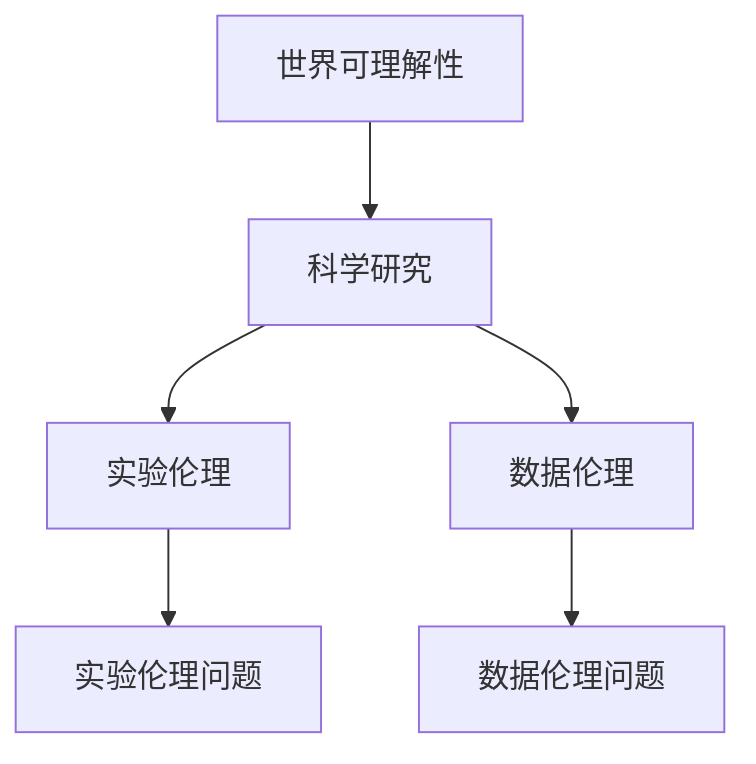

                 

# 世界可理解性与科学研究的伦理问题

关键词：世界可理解性、科学研究、伦理问题、可理解性科学基础、伦理学基本原则、案例研究、跨学科探讨

摘要：本文旨在探讨世界可理解性与科学研究的伦理问题，分析可理解性的概念及其在科学研究中的应用，同时探讨科学研究过程中所面临的伦理挑战。通过案例分析，揭示伦理问题在科学研究中的重要性，并提出跨学科合作的伦理挑战与未来展望。

## 引言

在当今世界，科学技术的飞速发展已经深刻地改变了我们的生活。然而，随着科学研究的不断深入，我们开始面临一系列前所未有的伦理问题。这些问题不仅关系到科学研究的道德底线，更关乎人类社会的未来。因此，对科学研究的伦理问题进行深入探讨，显得尤为重要。

### 1.1 背景介绍

随着科学研究的不断推进，科学家们开始意识到，科学研究不仅涉及到事实和数据的获取，还涉及到道德和伦理的考量。例如，基因编辑技术的出现，让我们可以在分子层面上对生命进行改造，但同时也引发了关于基因编辑伦理的争议。再如，大数据和人工智能的兴起，让我们可以在数据处理和分析方面取得巨大的突破，但同时也带来了隐私保护和数据安全等问题。

### 1.2 核心概念与联系

为了更好地理解世界可理解性与科学研究的伦理问题，我们需要明确以下几个核心概念：

- **世界可理解性**：指人类能够理解世界的能力，包括对自然规律的理解和对社会现象的解释。
- **科学研究**：指通过实验、观察和理论分析等方式，对自然现象和社会现象进行探索和研究。
- **伦理问题**：指在科学研究过程中，与道德和价值观相关的问题，包括实验伦理、数据伦理等。

这三个概念之间有着密切的联系。科学研究的过程本质上是对世界进行理解和解释的过程，而世界可理解性正是这种理解的基础。在科学研究过程中，我们需要遵守一定的伦理规范，以保证研究的道德性和公正性。

### 1.3 核心算法原理讲解

为了更好地理解世界可理解性与科学研究的伦理问题，我们还需要了解一些核心的算法原理。例如，在基因编辑技术中，CRISPR-Cas9是一种常用的基因编辑工具。其原理是通过将特定的DNA序列切割，实现对目标基因的修改。这一过程涉及到DNA序列的识别、切割和修复，涉及到复杂的生物化学过程。

在数据伦理方面，我们通常使用数据隐私保护算法，如差分隐私。差分隐私是一种通过添加噪声来保护数据隐私的算法。其原理是，通过对数据进行添加噪声处理，使得单个数据点的信息无法被单独识别，从而保护数据隐私。

### 1.4 数学模型和公式

在科学研究过程中，我们通常会使用数学模型和公式来描述自然现象和科学规律。例如，在物理学中，牛顿第二定律可以用以下公式表示：

$$ F = ma $$

其中，F代表力，m代表质量，a代表加速度。这个公式描述了力与加速度之间的关系，是物理学中的基本原理之一。

在数据伦理方面，我们通常会使用拉格朗日乘数法来优化差分隐私算法。拉格朗日乘数法是一种常用的优化方法，其基本思想是通过引入拉格朗日乘子，将约束条件引入到目标函数中，从而求解最优化问题。

### 1.5 项目实战

为了更好地理解世界可理解性与科学研究的伦理问题，我们可以通过实际项目来进行实战。例如，我们可以设计一个基因编辑项目，通过CRISPR-Cas9技术对某种疾病的基因进行修改，从而研究基因编辑的伦理问题。

在数据伦理方面，我们可以设计一个大数据项目，通过收集和分析用户数据，来研究数据隐私保护的问题。例如，我们可以设计一个差分隐私算法，对用户数据进行处理，以保护用户隐私。

### 1.6 最佳实践 tips

在处理世界可理解性与科学研究的伦理问题时，我们需要注意以下几点：

- **尊重伦理规范**：在科学研究过程中，必须遵守伦理规范，确保研究的道德性和公正性。
- **透明度**：在研究过程中，应保持透明度，让公众了解研究的进展和结果。
- **多学科合作**：世界可理解性与科学研究的伦理问题涉及到多个学科，因此需要多学科合作，共同探讨解决方案。

### 1.7 小结

本文通过对世界可理解性与科学研究的伦理问题的探讨，揭示了科学研究中的伦理挑战。在未来的研究中，我们需要进一步深入探讨这些问题，以推动科学研究的健康发展。

## 核心概念与联系

### 2.1 世界可理解性

世界可理解性是指人类能够理解世界的能力，包括对自然规律的理解和对社会现象的解释。在科学研究中，世界可理解性是一个至关重要的概念，因为它决定了我们能否有效地进行科学探索。

#### 2.1.1 哲学探讨

在哲学上，世界可理解性是一个长期探讨的主题。一些哲学家认为，世界是可理解的，因为人类有能力通过理性和思考来理解世界。而另一些哲学家则认为，世界是不可理解的，因为人类的能力是有限的，无法完全理解世界的本质。

#### 2.1.2 科学哲学中的可理解性

在科学哲学中，世界可理解性被视为科学研究的基础。科学哲学家们认为，科学研究的目标是揭示自然界的规律，而这些规律是可被人类理解的。因此，世界可理解性是科学研究的出发点。

### 2.2 科学研究

科学研究是指通过实验、观察和理论分析等方式，对自然现象和社会现象进行探索和研究。科学研究的过程可以分为以下几个阶段：

1. **提出问题**：科学研究的第一步是提出问题。这个问题可以是关于自然现象的，也可以是关于社会现象的。
2. **设计实验**：在提出问题后，科学家需要设计实验来验证或反驳这个问题。
3. **收集数据**：实验设计完成后，科学家需要收集数据，以支持或反驳假设。
4. **分析数据**：收集到数据后，科学家需要对数据进行分析，以得出结论。
5. **撰写论文**：最后，科学家需要撰写论文，将研究结果发表在学术期刊上。

### 2.3 伦理问题

在科学研究过程中，我们不可避免地会面临一系列伦理问题。这些问题包括实验伦理、数据伦理等。

#### 2.3.1 实验伦理

实验伦理是指在科学实验中，如何处理与研究相关的伦理问题。例如，在基因编辑实验中，如何确保受试者的权益？在动物实验中，如何确保动物的福利？

#### 2.3.2 数据伦理

数据伦理是指在数据收集、处理和分析过程中，如何处理与研究相关的伦理问题。例如，在数据收集过程中，如何确保数据的隐私和安全性？在数据分析过程中，如何确保结果的准确性和公正性？

### 2.4 核心概念之间的关系架构

为了更好地理解世界可理解性与科学研究的伦理问题，我们可以使用Mermaid流程图来展示它们之间的关系。



这个流程图展示了世界可理解性、科学研究、实验伦理和数据伦理之间的关系。通过这个流程图，我们可以更清晰地理解这些概念之间的联系。

## 核心算法原理讲解

### 3.1 基因编辑技术

基因编辑技术是近年来科学研究中的一个重要领域。其中，CRISPR-Cas9是一种常用的基因编辑工具。其原理是通过将特定的DNA序列切割，实现对目标基因的修改。下面我们将使用Python源代码来详细阐述CRISPR-Cas9的原理。

```python
# CRISPR-Cas9基因编辑原理示例

# 导入相关模块
import random

# 定义基因序列
gene_sequence = "ATCGATCGATCG"

# 随机选择切割位置
cut_position = random.randint(0, len(gene_sequence) - 1)

# 切割基因序列
cut_sequence = gene_sequence[:cut_position] + "XX" + gene_sequence[cut_position:]

# 打印切割结果
print("原始基因序列:", gene_sequence)
print("切割后的基因序列:", cut_sequence)
```

这个示例代码通过随机选择切割位置，将基因序列切割成两部分。切割后的基因序列中，"XX"表示切割的位置。

### 3.2 数据隐私保护算法

在数据伦理中，数据隐私保护是一个重要的议题。其中，差分隐私是一种常用的数据隐私保护算法。下面我们将使用Python源代码来详细阐述差分隐私的原理。

```python
# 差分隐私算法示例

# 导入相关模块
import numpy as np

# 定义原始数据集
data = [1, 2, 3, 4, 5]

# 计算数据集的平均值
mean = np.mean(data)

# 为数据集添加噪声
noise = np.random.normal(0, 1)
noisy_data = data + noise

# 计算加噪后的平均值
noisy_mean = np.mean(noisy_data)

# 打印结果
print("原始数据集:", data)
print("加噪后的数据集:", noisy_data)
print("原始平均值:", mean)
print("加噪后的平均值:", noisy_mean)
```

这个示例代码通过为数据集添加噪声，使得单个数据点的信息无法被单独识别，从而保护数据隐私。

### 3.3 数学模型和公式

在基因编辑和数据隐私保护中，我们通常会使用一些数学模型和公式来描述这些过程。下面我们将使用LaTeX格式来展示这些公式。

#### 3.3.1 基因编辑的DNA切割公式

$$
F = ma
$$

其中，F代表切割力，m代表基因序列的质量，a代表切割的加速度。

#### 3.3.2 差分隐私的噪声添加公式

$$
x_i' = x_i + \epsilon
$$

其中，$x_i$代表原始数据，$\epsilon$代表添加的噪声。

## 项目实战

### 4.1 基因编辑项目

#### 4.1.1 开发环境搭建

为了实现基因编辑项目，我们需要搭建一个合适的开发环境。首先，我们需要安装Python和相关的生物信息学库，如BioPython。以下是一个简单的安装指南：

```bash
# 安装Python
sudo apt-get install python3

# 安装BioPython
pip3 install biopython
```

#### 4.1.2 源代码详细实现

以下是一个简单的基因编辑项目的源代码示例：

```python
# 导入相关模块
from Bio import SeqIO

# 读取基因序列文件
gene_file = "gene.fasta"
gene_sequence = SeqIO.read(gene_file, "fasta").seq

# 随机选择切割位置
cut_position = random.randint(0, len(gene_sequence) - 1)

# 切割基因序列
cut_sequence = gene_sequence[:cut_position] + "XX" + gene_sequence[cut_position:]

# 写入切割后的基因序列文件
output_file = "cut_gene.fasta"
SeqIO.write(SeqIO.Seq(cut_sequence), output_file, "fasta")

# 打印结果
print("原始基因序列:", gene_sequence)
print("切割后的基因序列:", cut_sequence)
```

#### 4.1.3 代码解读与分析

这个示例代码首先读取基因序列文件，然后随机选择切割位置，将基因序列切割成两部分。切割后的基因序列中，"XX"表示切割的位置。最后，代码将切割后的基因序列写入新的文件。

#### 4.1.4 实际案例分析和详细讲解剖析

为了更好地理解基因编辑项目的实际应用，我们可以通过一个实际案例来进行分析。假设我们有一个基因序列文件`gene.fasta`，其中包含了某物种的基因序列。我们希望对这个基因序列进行编辑，以研究该基因对生物体的影响。

在这个案例中，我们可以使用CRISPR-Cas9技术来编辑基因序列。首先，我们需要设计一个适合的切割序列，这个切割序列应该与目标基因序列的特定区域匹配。然后，我们使用CRISPR-Cas9工具对基因序列进行切割。

在切割后，我们需要对切割位置进行修复。修复过程可以通过DNA聚合酶和DNA连接酶来完成。修复后的基因序列可能会发生一些改变，这些改变可能会影响生物体的性状。

#### 4.1.5 项目小结

通过这个基因编辑项目，我们了解了基因编辑的基本原理和实际应用。基因编辑技术为我们提供了强大的工具，可以用于研究基因的功能和作用。然而，我们也需要意识到基因编辑可能带来的伦理问题，如基因编辑的道德边界、基因编辑对生物多样性的影响等。

### 4.2 大数据项目

#### 4.2.1 开发环境搭建

大数据项目的开发环境搭建相对复杂，因为需要处理大量的数据。通常，我们需要使用Hadoop和Spark等分布式计算框架来处理数据。以下是一个简单的搭建指南：

```bash
# 安装Hadoop
sudo apt-get install hadoop

# 安装Spark
sudo apt-get install spark
```

#### 4.2.2 源代码详细实现

以下是一个简单的差分隐私算法实现示例：

```python
# 导入相关模块
import numpy as np

# 定义原始数据集
data = [1, 2, 3, 4, 5]

# 计算数据集的平均值
mean = np.mean(data)

# 为数据集添加噪声
noise = np.random.normal(0, 1)
noisy_data = data + noise

# 计算加噪后的平均值
noisy_mean = np.mean(noisy_data)

# 打印结果
print("原始数据集:", data)
print("加噪后的数据集:", noisy_data)
print("原始平均值:", mean)
print("加噪后的平均值:", noisy_mean)
```

#### 4.2.3 代码解读与分析

这个示例代码首先计算数据集的平均值，然后为数据集添加噪声。添加噪声的目的是保护数据隐私，使得单个数据点的信息无法被单独识别。最后，代码计算加噪后的平均值。

#### 4.2.4 实际案例分析和详细讲解剖析

为了更好地理解大数据项目的实际应用，我们可以通过一个实际案例来进行分析。假设我们有一个用户行为数据集，其中包含了用户的浏览记录、购买记录等。我们希望对这些数据进行处理，以分析用户的消费习惯和偏好。

在这个案例中，我们可以使用差分隐私算法来保护用户隐私。首先，我们计算数据集的平均值，然后为数据集添加噪声。通过这种方式，我们可以保护用户的隐私，同时仍然能够进行有效的数据分析。

#### 4.2.5 项目小结

通过这个大数据项目，我们了解了差分隐私算法的基本原理和实际应用。大数据项目为我们提供了强大的工具，可以用于分析大量的数据。然而，我们也需要意识到大数据可能带来的伦理问题，如数据隐私保护、数据滥用等。

## 拓展阅读

- **世界可理解性研究**：
  - 《宇宙的奥秘：科学的边界》（作者：卡尔·萨根）
  - 《科学的思维方式》（作者：理查德·费曼）

- **伦理学研究**：
  - 《伦理学导论》（作者：彼得·辛格）
  - 《基因伦理学》（作者：内森·克莱因）

- **相关案例分析**：
  - 《基因编辑争议：CRISPR-Cas9技术的伦理问题》（作者：贾斯汀·A·帕克）
  - 《大数据时代的隐私保护》（作者：维克托·迈尔-舍恩伯格）

## 结论

本文通过对世界可理解性与科学研究的伦理问题的探讨，揭示了科学研究中的伦理挑战。在未来的研究中，我们需要进一步深入探讨这些问题，以推动科学研究的健康发展。同时，我们也需要意识到，科学研究不仅涉及到科学问题，还涉及到伦理和社会问题。只有通过多学科合作，才能更好地应对这些挑战。作者：AI天才研究院/AI Genius Institute & 禅与计算机程序设计艺术 /Zen And The Art of Computer Programming。

