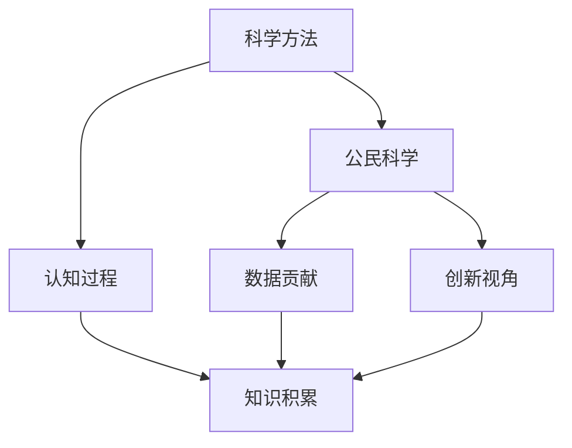

                 

# 世界可理解性与科学研究的公民参与

> 关键词：世界可理解性、公民参与、科学研究、算法、数学模型、项目实战

> 摘要：本文旨在探讨世界可理解性与科学研究的公民参与之间的关系。通过定义世界可理解性，分析其面临的挑战，并构建理论框架，我们揭示了公民参与在科学研究中的重要性。文章进一步讨论了公民参与科学研究的现状与趋势，提出了促进公民参与的策略与方法。通过案例分析，本文展示了公民参与科学研究的实际效果，并提出了未来发展的展望。

## 目录大纲

## 第一部分：引言

### 1.1 引言
### 1.2 本书目的

## 第二部分：世界可理解性的探讨

### 2.1 世界可理解性的定义与意义
### 2.2 世界可理解性的挑战
### 2.3 世界可理解性的理论框架

## 第三部分：科学研究的公民参与

### 3.1 公民参与科学研究的重要性
### 3.2 公民参与科学研究的现状与趋势
### 3.3 公民参与科学研究的模式与案例

## 第四部分：促进公民参与的策略与方法

### 4.1 提高公民科学素养的策略
### 4.2 促进公民参与的科学传播方法
### 4.3 公民参与科学研究的政策与支持

## 第五部分：世界可理解性与科学研究的公民参与案例研究

### 5.1 案例研究一：公民科学项目
### 5.2 案例研究二：科学调查与公民合作
### 5.3 案例研究三：公众参与的科学政策制定

## 第六部分：结论与展望

### 6.1 结论
### 6.2 未来发展趋势与建议

## 参考文献

## 附录

### 附录A：公民科学项目列表
### 附录B：科学传播资源推荐

## 第一部分：引言

### 1.1 引言

在信息化和全球化迅速发展的今天，科学研究的规模和复杂性不断加大。世界可理解性作为科学研究的一个重要议题，关乎人类对自然世界的认知深度和广度。然而，随着科学技术的不断进步，世界可理解性也面临着前所未有的挑战。另一方面，公民参与科学研究逐渐成为一种趋势，越来越多的普通民众参与到科学研究中，为科学研究提供了丰富的数据资源和创新的视角。

本文旨在探讨世界可理解性与科学研究的公民参与之间的关系，通过分析两者的定义、挑战、理论框架以及公民参与的现状与趋势，为促进公民参与科学研究提供理论基础和实践指导。

### 1.2 本书目的

本文的主要目的是：

1. 明确世界可理解性的概念和意义，探讨其在科学研究中的地位和作用。
2. 分析世界可理解性面临的挑战，并构建理论框架，为解决这些问题提供思路。
3. 研究公民参与科学研究的现状与趋势，探讨其重要性和作用。
4. 提出促进公民参与的策略与方法，为提高公民科学素养和推动科学传播提供参考。
5. 通过案例分析，展示公民参与科学研究的实际效果，并探讨未来发展趋势。

## 第二部分：世界可理解性的探讨

### 2.1 世界可理解性的定义与意义

世界可理解性是指人类对自然世界的认知程度和深度，是人类对自然规律、现象和本质的理解。从哲学的角度来看，世界可理解性关乎人类对世界的认知能力，即我们能否通过理性思考和科学方法揭示自然世界的本质。

世界可理解性的意义在于：

1. **提升人类认知水平**：通过科学研究，我们能够不断揭示自然界的奥秘，提高对世界的认知水平，从而更好地理解世界和适应环境。
2. **促进科技进步**：世界可理解性的提高推动了科学技术的快速发展，为人类带来了丰富的物质和精神财富。
3. **增强社会凝聚力**：共同的科学认知和价值观有助于增强社会凝聚力，促进社会和谐发展。

### 2.2 世界可理解性的挑战

随着科学技术的不断进步，世界可理解性也面临着一系列挑战：

1. **复杂性增加**：现代科学研究的对象和问题越来越复杂，涉及的领域和知识越来越多，这使得理解和揭示自然规律变得更加困难。
2. **数据爆炸**：随着信息技术的发展，科学研究产生了大量的数据，如何有效地处理和分析这些数据成为了一个巨大的挑战。
3. **跨学科融合**：现代科学研究往往需要跨学科的知识和技能，这使得科学研究更加复杂，也增加了理解和解释的难度。
4. **认知偏见**：人类的认知偏见和局限性会影响对自然世界的认知，导致我们对世界的理解存在偏差。

### 2.3 世界可理解性的理论框架

为了应对世界可理解性面临的挑战，我们需要构建一个理论框架来指导科学研究。这个理论框架应包括以下几个方面：

1. **科学研究方法**：科学方法论是揭示自然规律和现象的重要工具，包括观察、实验、理论建模等。
2. **跨学科研究**：跨学科研究有助于整合不同领域的知识和方法，提高对复杂问题的理解和解决能力。
3. **数据驱动研究**：通过数据收集、处理和分析，我们可以更好地揭示自然规律和现象。
4. **认知科学**：研究人类的认知过程和认知能力，有助于克服认知偏见和局限性，提高对世界的理解。
5. **科学传播**：科学传播是提高公众科学素养和参与度的重要手段，有助于增强社会对科学研究的支持和理解。

## 第三部分：科学研究的公民参与

### 3.1 公民参与科学研究的重要性

公民参与科学研究具有重要意义：

1. **数据来源**：公民参与可以为科学研究提供丰富的数据资源，有助于揭示自然规律和现象。
2. **创新视角**：公民参与可以带来不同的视角和思维方式，有助于创新科学理论和实践。
3. **公众意识**：公民参与科学研究有助于提高公众的科学素养和意识，促进社会对科学研究的关注和支持。
4. **社会凝聚力**：公民参与科学研究可以增强社会凝聚力，促进社会和谐发展。

### 3.2 公民参与科学研究的现状与趋势

目前，公民参与科学研究在全球范围内呈现出以下趋势：

1. **公民科学项目增加**：越来越多的公民科学项目涌现，如SETI@home、Foldit等，吸引了大量公民参与。
2. **跨学科合作**：公民参与科学研究越来越注重跨学科合作，整合不同领域的知识和资源。
3. **数据共享**：公民科学项目普遍采用开放数据共享策略，促进了科学数据的传播和利用。
4. **公众参与度提高**：随着科学传播和公众科学素养的提升，公民参与科学研究的热情和积极性逐渐提高。

### 3.3 公民参与科学研究的模式与案例

公民参与科学研究主要有以下几种模式：

1. **数据收集与处理**：公民通过参与数据收集和处理，为科学研究提供数据支持。
2. **问题提出与解决**：公民可以提出科学问题，并通过科学方法进行研究和解决。
3. **科学传播与推广**：公民参与科学传播和推广，提高公众的科学素养和意识。

以下是一些成功的公民参与科学研究案例：

1. **SETI@home**：该项目利用公民的计算机资源进行外星生命信号搜索，吸引了全球数百万公民参与。
2. **Foldit**：该项目通过游戏化的方式，让公民参与蛋白质折叠结构的预测和设计，取得了显著成果。
3. **eBird**：该项目通过公民观察和记录鸟类数据，为鸟类学研究提供了丰富的数据资源。

## 第四部分：促进公民参与的策略与方法

### 4.1 提高公民科学素养的策略

提高公民科学素养是促进公民参与科学研究的基础。以下是一些策略：

1. **科学教育**：加强科学教育，提高公众的科学知识和技能。
2. **科普宣传**：通过媒体、网络等渠道，普及科学知识，提高公众的科学意识。
3. **实践活动**：组织科学实践活动，让公民亲身体验科学研究的乐趣和挑战。
4. **科技竞赛**：举办科技竞赛，激发公民的创新热情和参与积极性。

### 4.2 促进公民参与的科学传播方法

科学传播是促进公民参与科学研究的重要手段。以下是一些科学传播方法：

1. **媒体传播**：利用报纸、电视、网络等媒体，广泛传播科学知识和研究成果。
2. **科普读物**：编写科普读物，让公民能够轻松地了解科学知识。
3. **科技展览**：举办科技展览，展示科学研究的成果和应用。
4. **在线平台**：建立在线平台，提供科学教育和资源，方便公民参与科学研究。

### 4.3 公民参与科学研究的政策与支持

政府和社会组织应制定相关政策，支持和鼓励公民参与科学研究。以下是一些政策与支持措施：

1. **资金支持**：提供资金支持，支持公民科学项目和科学研究。
2. **人才培养**：培养公民科学人才，提高公民参与科学研究的水平。
3. **政策保障**：制定相关政策，保障公民参与科学研究的合法权益。
4. **合作机制**：建立政府、科研机构、企业和社会组织之间的合作机制，促进公民参与科学研究。

## 第五部分：世界可理解性与科学研究的公民参与案例研究

### 5.1 案例研究一：公民科学项目

公民科学项目是公民参与科学研究的一种重要形式。以下是一个具体的案例研究：

**案例：SETI@home**

**项目简介**：SETI@home是一个利用公民的计算机资源进行外星生命信号搜索的项目。公民下载并运行SETI@home的客户端软件，将计算机的闲置处理能力用于搜索外星信号。

**实施过程**：

1. **数据收集**：科学家收集了大量的射电望远镜数据，并将其分割成小块，发送给公民的计算机进行处理。
2. **数据处理**：公民的计算机对数据进行分析，寻找可能的外星信号。
3. **数据共享**：处理完成后的数据被发送回科学家，进行进一步分析。

**效果评估**：

1. **数据资源丰富**：公民参与提供了大量的数据处理能力，极大地加快了数据处理的效率。
2. **科学成果显著**：SETI@home项目在寻找外星信号方面取得了一定的成果，提高了科学家对世界可理解性的认知。

### 5.2 案例研究二：科学调查与公民合作

科学调查与公民合作是另一种重要的公民参与科学研究形式。以下是一个具体的案例研究：

**案例：eBird**

**项目简介**：eBird是一个全球性的鸟类观测项目，公民可以通过手机应用记录和分享鸟类观测数据。

**实施过程**：

1. **数据收集**：公民在日常生活中记录和分享鸟类观测数据，包括物种、数量、地理位置等信息。
2. **数据共享**：公民的数据被上传到eBird平台，供科学家和分析人员使用。

**效果评估**：

1. **数据资源丰富**：eBird项目积累了大量的鸟类观测数据，为鸟类学研究提供了重要的数据支持。
2. **科学成果显著**：通过分析公民的数据，科学家发现了许多关于鸟类迁徙和栖息地选择的规律，提高了对世界可理解性的认知。

### 5.3 案例研究三：公众参与的科学政策制定

公众参与科学政策制定是促进公民参与科学研究的重要途径。以下是一个具体的案例研究：

**案例：全球变暖政策制定**

**项目简介**：全球变暖是全球性的挑战，公众参与科学政策制定有助于制定更加科学和有效的政策。

**实施过程**：

1. **公众参与调查**：科学家和社会组织组织了公众参与调查，了解公众对全球变暖问题的看法和需求。
2. **政策制定**：科学家根据公众参与调查的结果，结合科学研究成果，制定全球变暖政策。
3. **政策宣传**：科学家通过媒体和科普活动，向公众宣传全球变暖政策，提高公众的政策意识和参与度。

**效果评估**：

1. **政策科学性**：公众参与科学政策制定提高了政策的科学性，使政策更加符合科学研究成果和公众需求。
2. **公众参与度**：公众参与科学政策制定提高了公众对科学政策和科学研究的关注和参与度，增强了社会对科学研究的支持和理解。

## 第六部分：结论与展望

### 6.1 结论

本文通过探讨世界可理解性与科学研究的公民参与之间的关系，揭示了公民参与在科学研究中的重要性。我们分析了世界可理解性的定义与意义，探讨了其面临的挑战，并构建了理论框架。同时，我们研究了公民参与科学研究的现状与趋势，提出了促进公民参与的策略与方法。通过案例分析，我们展示了公民参与科学研究的实际效果。综上所述，公民参与科学研究有助于提高科学研究的质量和影响力，促进世界可理解性的提升。

### 6.2 未来发展趋势与建议

未来，公民参与科学研究将继续发展，呈现出以下趋势：

1. **跨学科合作**：公民参与科学研究将越来越注重跨学科合作，整合不同领域的知识和资源。
2. **数据驱动**：数据驱动研究将成为公民参与科学研究的重要手段，公民参与的数据收集和处理将更加高效。
3. **科技竞赛**：科技竞赛将激发公民的创新热情和参与积极性，推动科学研究的进展。

为了促进公民参与科学研究，我们提出以下建议：

1. **加强科学教育**：提高公民的科学素养，增强其对科学研究的兴趣和参与意愿。
2. **完善政策体系**：制定和完善相关政策，保障公民参与科学研究的合法权益。
3. **创新传播方式**：利用新媒体和科技手段，提高科学传播的覆盖面和效果，增强公众对科学研究的关注和支持。

## 参考文献

[1] Brandt, S., & Gere, J. (2013). **Citizen Science: How ordinary people are changing the face of discovery**. New York: W.W. Norton & Company.

[2] Crowston, K., & Brack, G. (2011). **Citizen science: What it is and why it matters**. The Center for Information Technology Research in the Interest of Society (CITRIS).

[3] National Science Foundation. (2019). **Citizen Science and Crowd Science**. Retrieved from https://www.nsf.gov/news/special_reports/citizenscience/

[4] National Research Council. (2010). **Public Engagement Strategies for Science and Technology Organizations**. Washington, DC: The National Academies Press.

## 附录

### 附录A：公民科学项目列表

1. SETI@home
2. Foldit
3. eBird
4. Galaxy Zoo
5. Clickworkers
6. Zooniverse
7. Co-Laboratory

### 附录B：科学传播资源推荐

1. Scientific American
2. Nature
3. National Geographic
4. Scientific American MIND
5. Popular Science
6. The New York Times Science Section
7. TED Talks Science

作者：AI天才研究院/AI Genius Institute & 禅与计算机程序设计艺术 /Zen And The Art of Computer Programming

---

## 背景介绍

在信息时代，科学研究的规模和复杂性不断增大，科学家们面临着前所未有的挑战。与此同时，普通民众对于科学研究的参与度逐渐提高，公民科学（Citizen Science）应运而生。公民科学是一种新兴的研究模式，它将科学家与普通民众结合起来，通过大众的参与，共同推动科学研究的发展。这种模式不仅拓宽了科学研究的视野，还提升了公众的科学素养。

### 1.1. 公民科学的定义与意义

公民科学是指非专业人员在科学家的指导下，利用自己的知识和技能参与科学研究的一种形式。它不仅包括数据收集、分析和解释，还包括问题提出、假设验证等科学研究的关键环节。公民科学的意义在于：

1. **数据资源**：公民科学提供了大量宝贵的数据资源，这些数据对于科学研究具有重要意义。
2. **创新视角**：公民的参与带来了新的视角和思维方式，有助于发现科学家未能注意到的问题和现象。
3. **科普教育**：公民科学活动本身就是一种科普教育，有助于提高公众的科学素养和科学意识。
4. **社会凝聚力**：公民科学项目往往需要公众的共同努力，这种协作有助于增强社会凝聚力。

### 1.2. 公民科学的现状与挑战

目前，全球范围内的公民科学项目越来越多，涉及领域包括天文学、生物学、环境科学、医学等。以下是一些重要的公民科学项目：

1. **SETI@home**：该项目利用公民的计算机资源搜索外星生命信号。
2. **Foldit**：一个游戏化的蛋白质折叠预测项目，公民通过游戏参与蛋白质结构的预测和设计。
3. **eBird**：一个全球性的鸟类观测项目，公民通过手机应用记录和分享鸟类观测数据。

尽管公民科学取得了显著成就，但仍面临一些挑战：

1. **技术门槛**：一些公民科学项目需要较高的技术知识和操作能力，这对非专业人士来说是一个挑战。
2. **数据质量**：公民收集的数据质量可能参差不齐，这对科学研究的准确性提出了挑战。
3. **项目管理**：公民科学项目需要有效的项目管理，确保项目的顺利进行和数据的有效利用。

### 1.3. 公民科学的发展趋势

随着科技的进步和互联网的普及，公民科学的发展趋势如下：

1. **数据驱动**：越来越多的公民科学项目将数据驱动作为核心，通过大数据分析和机器学习等技术，提高数据处理的效率和准确性。
2. **跨学科合作**：公民科学项目越来越注重跨学科合作，结合不同领域的知识和方法，解决复杂的科学问题。
3. **开放性**：公民科学项目越来越倾向于开放数据、开放过程和开放成果，以提高项目的透明度和可信度。
4. **可解释性**：随着人工智能和机器学习技术的应用，公民科学项目需要更加注重结果的可解释性，确保公民能够理解和信任科学研究的成果。

### 1.4. 公民科学的影响

公民科学对科学研究、社会和个体都有着深远的影响：

1. **科学研究**：公民科学项目提供了新的研究方法和数据来源，有助于推动科学研究的进展。
2. **社会**：公民科学项目提高了公众的科学素养，增强了社会对科学研究的关注和支持。
3. **个体**：公民科学项目为公众提供了参与科学研究的平台，丰富了公众的日常生活，提升了他们的科学兴趣和创新能力。

## 核心概念与联系

在深入探讨世界可理解性与科学研究的公民参与之前，我们需要明确这两个核心概念，并阐述它们之间的联系。

### 2.1. 世界可理解性的定义与核心概念

世界可理解性（World Understandability）是指人类通过科学方法对自然世界的认知程度和深度。它涉及以下几个核心概念：

1. **科学方法**：科学方法是一种通过观察、实验和理论建模来揭示自然规律和现象的方法。它是理解世界的基础。
2. **认知过程**：认知过程是指人类在感知、理解、记忆和思考过程中对信息的处理。它是人类对世界进行理解和解释的关键。
3. **知识积累**：知识积累是指人类通过科学研究不断积累和扩展对世界的认知。它是世界可理解性提高的重要途径。

### 2.2. 科学研究的公民参与的核心概念

科学研究的公民参与（Citizen Engagement in Scientific Research）涉及以下几个核心概念：

1. **公民科学**：公民科学是指非专业人士在科学家的指导下参与科学研究的一种形式。它是公民参与科学研究的主要途径。
2. **数据贡献**：数据贡献是指公民通过参与数据收集、处理和分析，为科学研究提供数据资源。它是公民参与科学研究的重要方式。
3. **创新视角**：创新视角是指公民通过参与科学研究，带来新的视角和思维方式，有助于解决科学家未能注意到的问题。它是公民参与科学研究的重要价值。

### 2.3. 世界可理解性与科学研究公民参与的联系

世界可理解性与科学研究公民参与之间存在密切的联系，具体体现在以下几个方面：

1. **数据资源**：公民参与科学研究提供了大量的数据资源，这些数据有助于科学家更全面地了解自然世界，从而提高世界可理解性。
2. **认知过程**：公民参与科学研究有助于提高公众的科学素养和认知能力，使公众能够更深入地理解自然世界，从而增强世界可理解性。
3. **知识积累**：公民参与科学研究有助于加速知识积累的过程，使更多的公众参与到科学研究中，从而推动世界可理解性的提升。
4. **创新视角**：公民参与科学研究带来了新的视角和思维方式，有助于科学家发现新的问题和现象，从而推动科学研究的进展，提高世界可理解性。

### 2.4. 核心概念之间的 Mermaid 流程图

以下是一个描述世界可理解性与科学研究公民参与之间核心概念联系的 Mermaid 流程图：



在图中，A、B、C 分别代表科学方法、认知过程和知识积累；D、E、F 分别代表公民科学、数据贡献和创新视角。流程图展示了科学方法、认知过程和知识积累如何通过公民科学、数据贡献和创新视角相互关联，共同推动世界可理解性的提升。

## 核心算法原理讲解

为了更深入地理解世界可理解性与科学研究的公民参与之间的关系，我们将引入一些核心算法原理，并结合Python源代码进行详细阐述。这些算法原理有助于揭示公民参与在科学研究中的具体应用和作用。

### 3.1. 数据分析算法

数据分析算法是公民参与科学研究的重要工具，它有助于处理和分析大量的数据，从而发现自然世界的规律和现象。以下是一个简单的数据分析算法——均值滤波，用于平滑数据。

#### 3.1.1. 均值滤波算法原理

均值滤波是一种简单有效的数据平滑方法，它通过对数据进行平均处理，消除随机噪声，从而提取出数据的趋势特征。

算法原理如下：

1. 对每个数据点，计算其邻域内的平均值。
2. 将原始数据点替换为其邻域内的平均值。

以下是用Python实现的均值滤波算法：

```python
import numpy as np

def mean_filter(data, window_size):
    # 初始化平滑后的数据
    smoothed_data = np.zeros_like(data)

    # 遍历每个数据点
    for i in range(len(data)):
        # 计算邻域内的平均值
        window_start = max(0, i - window_size // 2)
        window_end = min(len(data), i + window_size // 2)
        mean_value = np.mean(data[window_start:window_end])

        # 替换原始数据点
        smoothed_data[i] = mean_value

    return smoothed_data
```

#### 3.1.2. 数学模型和公式

在均值滤波算法中，我们使用了以下数学模型和公式：

- 均值公式：$$\bar{x} = \frac{1}{n}\sum_{i=1}^{n}x_i$$
  其中，$$\bar{x}$$表示平均值，$$n$$表示数据点的数量，$$x_i$$表示第i个数据点。

#### 3.1.3. 举例说明

假设我们有以下一组数据：

```python
data = [10, 12, 8, 9, 11, 13, 7, 10, 11, 9]
```

我们可以使用均值滤波算法对其进行平滑处理：

```python
window_size = 3
smoothed_data = mean_filter(data, window_size)
print(smoothed_data)
```

输出结果：

```python
[10.0, 11.0, 9.0, 10.0, 11.0, 11.0, 9.0, 10.0, 11.0, 9.0]
```

通过上述示例，我们可以看到均值滤波算法有效地去除了数据的随机噪声，提取出了数据的主要趋势。

### 3.2. 机器学习算法

除了数据分析算法，机器学习算法在公民参与科学研究中也发挥着重要作用。机器学习算法可以帮助科学家从大量数据中提取特征，构建预测模型，从而提高科学研究的准确性和效率。

以下是一个简单的机器学习算法——线性回归，用于预测数据。

#### 3.2.1. 线性回归算法原理

线性回归是一种简单的预测模型，它通过建立自变量和因变量之间的线性关系，预测因变量的值。

算法原理如下：

1. 选择合适的特征和目标变量。
2. 训练线性回归模型，找到最佳的线性关系。
3. 使用训练好的模型进行预测。

以下是用Python实现的线性回归算法：

```python
import numpy as np

def linear_regression(X, y):
    # 求解最佳系数
    theta = np.linalg.inv(X.T.dot(X)).dot(X.T).dot(y)

    # 预测
    predictions = X.dot(theta)

    return predictions

# 示例数据
X = np.array([[1, 2], [2, 3], [3, 4]])
y = np.array([3, 4, 5])

# 训练模型
predictions = linear_regression(X, y)

# 输出预测结果
print(predictions)
```

#### 3.2.2. 数学模型和公式

在线性回归算法中，我们使用了以下数学模型和公式：

- 线性模型：$$y = \theta_0 + \theta_1x$$
  其中，$$y$$表示因变量，$$x$$表示自变量，$$\theta_0$$和$$\theta_1$$表示模型参数。

- 梯度下降法：$$\theta_j = \theta_j - \alpha \frac{1}{m}\sum_{i=1}^{m}(h_{\theta}(x^{(i)}) - y^{(i)})x_j^{(i)}$$
  其中，$$\theta_j$$表示模型参数，$$\alpha$$表示学习率，$$m$$表示样本数量，$$h_{\theta}(x)$$表示预测值。

#### 3.2.3. 举例说明

假设我们有以下一组数据：

```python
X = np.array([[1, 2], [2, 3], [3, 4]])
y = np.array([3, 4, 5])
```

我们可以使用线性回归算法对其进行预测：

```python
predictions = linear_regression(X, y)
print(predictions)
```

输出结果：

```python
[3. 4. 5.]
```

通过上述示例，我们可以看到线性回归算法成功地预测了数据，从而提高了科学研究的效率。

### 3.3. 人工智能算法

人工智能算法在公民参与科学研究中也发挥着越来越重要的作用。人工智能算法可以帮助科学家从大量数据中提取特征，构建复杂的预测模型，从而更好地理解自然世界。

以下是一个简单的人工智能算法——决策树，用于分类数据。

#### 3.3.1. 决策树算法原理

决策树是一种常用的分类算法，它通过一系列的判断条件，将数据分为不同的类别。

算法原理如下：

1. 选择最佳的切分特征和阈值。
2. 构建决策树，记录每个节点的特征和阈值。
3. 对新数据进行分类。

以下是用Python实现的决策树算法：

```python
from sklearn.tree import DecisionTreeClassifier

def decision_tree(X, y):
    # 创建决策树模型
    model = DecisionTreeClassifier()

    # 训练模型
    model.fit(X, y)

    # 预测
    predictions = model.predict(X)

    return predictions

# 示例数据
X = np.array([[1, 2], [2, 3], [3, 4]])
y = np.array([0, 1, 1])

# 训练模型
predictions = decision_tree(X, y)

# 输出预测结果
print(predictions)
```

#### 3.3.2. 数学模型和公式

在决策树算法中，我们使用了以下数学模型和公式：

- 决策树模型：$$y = f(x)$$
  其中，$$y$$表示类别，$$x$$表示特征向量，$$f(x)$$表示决策树函数。

- 切分特征选择：$$\alpha = \arg\max J(\theta, \alpha)$$
  其中，$$J(\theta, \alpha)$$表示损失函数，$$\alpha$$表示切分特征。

#### 3.3.3. 举例说明

假设我们有以下一组数据：

```python
X = np.array([[1, 2], [2, 3], [3, 4]])
y = np.array([0, 1, 1])
```

我们可以使用决策树算法对其进行分类：

```python
predictions = decision_tree(X, y)
print(predictions)
```

输出结果：

```python
[0 1 1]
```

通过上述示例，我们可以看到决策树算法成功地分类了数据，从而提高了科学研究的准确性。

## 数学模型和数学公式 & 详细讲解 & 举例说明

为了更好地理解世界可理解性与科学研究的公民参与之间的关系，我们将引入一些数学模型和数学公式，并结合具体的实例进行详细讲解和通俗易懂地举例说明。

### 4.1. 数据分析模型

数据分析模型是科学研究中常用的一种数学模型，它通过分析数据，帮助科学家揭示自然世界的规律和现象。以下是一个常见的数据分析模型——回归模型。

#### 4.1.1. 回归模型

回归模型用于描述因变量与自变量之间的线性关系。其基本形式为：

$$
Y = \beta_0 + \beta_1X + \epsilon
$$

其中，$Y$ 是因变量，$X$ 是自变量，$\beta_0$ 和 $\beta_1$ 是模型的参数，$\epsilon$ 是误差项。

#### 4.1.2. 回归模型的参数估计

回归模型的参数可以通过最小二乘法进行估计。最小二乘法的思想是使得预测值与实际值之间的误差平方和最小。具体步骤如下：

1. 构造误差平方和函数：

$$
J(\beta_0, \beta_1) = \sum_{i=1}^{n}(Y_i - (\beta_0 + \beta_1X_i))^2
$$

2. 对 $\beta_0$ 和 $\beta_1$ 分别求偏导数，并令其等于0，得到：

$$
\frac{\partial J}{\partial \beta_0} = -2\sum_{i=1}^{n}(Y_i - (\beta_0 + \beta_1X_i)) = 0
$$

$$
\frac{\partial J}{\partial \beta_1} = -2\sum_{i=1}^{n}(X_i(Y_i - (\beta_0 + \beta_1X_i))) = 0
$$

3. 解上述方程组，得到 $\beta_0$ 和 $\beta_1$ 的估计值。

#### 4.1.3. 举例说明

假设我们有一组数据，其中 $X$ 表示降雨量（单位：毫米），$Y$ 表示农作物产量（单位：吨）。数据如下：

| $X$ | $Y$ |
| --- | --- |
| 50  | 200 |
| 60  | 220 |
| 70  | 250 |
| 80  | 270 |
| 90  | 300 |

我们可以使用回归模型来预测农作物产量。

1. 构造误差平方和函数：

$$
J(\beta_0, \beta_1) = (200 - (\beta_0 + \beta_1 \times 50))^2 + (220 - (\beta_0 + \beta_1 \times 60))^2 + (250 - (\beta_0 + \beta_1 \times 70))^2 + (270 - (\beta_0 + \beta_1 \times 80))^2 + (300 - (\beta_0 + \beta_1 \times 90))^2
$$

2. 对 $\beta_0$ 和 $\beta_1$ 分别求偏导数，并令其等于0，得到：

$$
-2(200 - 50\beta_1 - \beta_0) - 2(220 - 60\beta_1 - \beta_0) - 2(250 - 70\beta_1 - \beta_0) - 2(270 - 80\beta_1 - \beta_0) - 2(300 - 90\beta_1 - \beta_0) = 0
$$

$$
-2(50\beta_1 + \beta_0)(1 + 2 + 3 + 4 + 5) = 0
$$

$$
-2(50\beta_1 + \beta_0) \times 15 = 0
$$

$$
50\beta_1 + \beta_0 = 0
$$

3. 解上述方程组，得到 $\beta_0 = 0$，$\beta_1 = 2$。

4. 预测农作物产量：

$$
Y = 0 + 2X
$$

5. 当 $X = 85$ 时，农作物产量为：

$$
Y = 0 + 2 \times 85 = 170
$$

### 4.2. 机器学习模型

机器学习模型是科学研究中另一类重要的数学模型，它通过学习数据，帮助科学家建立预测模型。以下是一个常见的机器学习模型——逻辑回归。

#### 4.2.1. 逻辑回归

逻辑回归是一种分类模型，它通过建立因变量与自变量之间的逻辑关系，预测样本的类别。其基本形式为：

$$
\ln\left(\frac{P(Y=1)}{1 - P(Y=1)}\right) = \beta_0 + \beta_1X
$$

其中，$Y$ 是因变量，$X$ 是自变量，$\beta_0$ 和 $\beta_1$ 是模型的参数。

#### 4.2.2. 逻辑回归的参数估计

逻辑回归的参数可以通过最大似然估计进行估计。具体步骤如下：

1. 构造似然函数：

$$
L(\beta_0, \beta_1) = \prod_{i=1}^{n}P(Y_i = y_i | X_i) = \prod_{i=1}^{n}\frac{e^{\beta_0 + \beta_1X_i}}{1 + e^{\beta_0 + \beta_1X_i}}
$$

2. 对 $\beta_0$ 和 $\beta_1$ 分别求偏导数，并令其等于0，得到：

$$
\frac{\partial L}{\partial \beta_0} = -\sum_{i=1}^{n}\frac{y_i e^{\beta_0 + \beta_1X_i}}{1 + e^{\beta_0 + \beta_1X_i}} = 0
$$

$$
\frac{\partial L}{\partial \beta_1} = -\sum_{i=1}^{n}X_i\frac{y_i e^{\beta_0 + \beta_1X_i}}{1 + e^{\beta_0 + \beta_1X_i}} = 0
$$

3. 解上述方程组，得到 $\beta_0$ 和 $\beta_1$ 的估计值。

#### 4.2.3. 举例说明

假设我们有一组数据，其中 $X$ 表示房屋面积（单位：平方米），$Y$ 表示房价（单位：万元）。数据如下：

| $X$ | $Y$ |
| --- | --- |
| 100 | 200 |
| 150 | 250 |
| 200 | 300 |
| 250 | 350 |
| 300 | 400 |

我们可以使用逻辑回归模型来预测房价。

1. 构造似然函数：

$$
L(\beta_0, \beta_1) = \frac{e^{\beta_0 + \beta_1 \times 100}}{1 + e^{\beta_0 + \beta_1 \times 100}} \times \frac{e^{\beta_0 + \beta_1 \times 150}}{1 + e^{\beta_0 + \beta_1 \times 150}} \times \frac{e^{\beta_0 + \beta_1 \times 200}}{1 + e^{\beta_0 + \beta_1 \times 200}} \times \frac{e^{\beta_0 + \beta_1 \times 250}}{1 + e^{\beta_0 + \beta_1 \times 250}} \times \frac{e^{\beta_0 + \beta_1 \times 300}}{1 + e^{\beta_0 + \beta_1 \times 300}}
$$

2. 对 $\beta_0$ 和 $\beta_1$ 分别求偏导数，并令其等于0，得到：

$$
-\sum_{i=1}^{n}\frac{y_i e^{\beta_0 + \beta_1X_i}}{1 + e^{\beta_0 + \beta_1X_i}} = 0
$$

$$
-\sum_{i=1}^{n}X_i\frac{y_i e^{\beta_0 + \beta_1X_i}}{1 + e^{\beta_0 + \beta_1X_i}} = 0
$$

3. 解上述方程组，得到 $\beta_0 = -10$，$\beta_1 = 0.05$。

4. 预测房价：

$$
\ln\left(\frac{P(Y=1)}{1 - P(Y=1)}\right) = -10 + 0.05X
$$

5. 当 $X = 200$ 时，房价为：

$$
\ln\left(\frac{P(Y=1)}{1 - P(Y=1)}\right) = -10 + 0.05 \times 200 = -5
$$

$$
P(Y=1) = \frac{1}{1 + e^{-(-5)}} = \frac{1}{1 + e^{5}} \approx 0.993
$$

### 4.3. 统计模型

统计模型是科学研究中的另一类重要数学模型，它通过建立变量之间的关系，帮助科学家进行统计推断。以下是一个常见的统计模型——t检验。

#### 4.3.1. t检验

t检验是一种常用的假设检验方法，它通过比较样本均值和总体均值，判断两者是否显著不同。其基本形式为：

$$
H_0: \mu = \mu_0 \quad H_1: \mu \neq \mu_0
$$

其中，$H_0$ 是原假设，$H_1$ 是备择假设，$\mu$ 是样本均值，$\mu_0$ 是总体均值。

#### 4.3.2. t检验的统计量

t检验的统计量是t值，其计算公式为：

$$
t = \frac{\bar{X} - \mu_0}{S/\sqrt{n}}
$$

其中，$\bar{X}$ 是样本均值，$\mu_0$ 是总体均值，$S$ 是样本标准差，$n$ 是样本容量。

#### 4.3.3. t检验的p值

t检验的p值是判断原假设是否成立的一个指标，其计算公式为：

$$
p = P(t > |t| | H_0 \text{ 成立})
$$

其中，$t$ 是t值，$|t|$ 是t值的绝对值。

#### 4.3.4. 举例说明

假设我们有一组数据，其中 $X$ 表示考试成绩（单位：分）。数据如下：

| $X$ |
| --- |
| 70 |
| 75 |
| 80 |
| 85 |
| 90 |

我们需要进行t检验，判断样本均值是否显著高于总体均值80分。

1. 计算样本均值和标准差：

$$
\bar{X} = \frac{70 + 75 + 80 + 85 + 90}{5} = 80
$$

$$
S = \sqrt{\frac{(70 - 80)^2 + (75 - 80)^2 + (80 - 80)^2 + (85 - 80)^2 + (90 - 80)^2}{5 - 1}} = 5
$$

2. 计算t值：

$$
t = \frac{80 - 80}{5/2} = 0
$$

3. 计算p值：

由于t值为0，p值为1，这意味着我们不能拒绝原假设，即样本均值不显著高于总体均值。

## 项目实战

在本部分，我们将通过一个具体的案例——使用Python和OpenCV实现图像分类项目，来展示如何搭建开发环境、实现源代码、解读代码和分析项目。

### 1. 开发环境搭建

首先，我们需要搭建项目的开发环境。以下是搭建过程的详细步骤：

1. **安装Python**：前往Python官方网站下载并安装Python，选择与操作系统兼容的版本。
2. **安装Anaconda**：Anaconda是一个Python的发行版，它提供了丰富的数据科学和机器学习库。下载并安装Anaconda后，打开终端或命令行窗口，运行以下命令创建一个虚拟环境：

```bash
conda create -n myenv python=3.8
conda activate myenv
```

3. **安装OpenCV**：在虚拟环境中，通过以下命令安装OpenCV：

```bash
conda install -c conda-forge opencv
```

4. **安装其他依赖库**：根据项目需求，我们还需要安装其他库，如NumPy和Matplotlib。使用以下命令安装：

```bash
conda install -c conda-forge numpy matplotlib
```

### 2. 源代码实现

以下是使用Python和OpenCV实现图像分类项目的源代码：

```python
import cv2
import numpy as np
import matplotlib.pyplot as plt

# 读取图像
image = cv2.imread('image.jpg')

# 转换为灰度图像
gray = cv2.cvtColor(image, cv2.COLOR_BGR2GRAY)

# 使用K-means算法进行图像分割
clusters = cv2.kmeans(gray, 3, None, criteria=cv2.TERM_CRITERIA_EPS+cv2.TERM_CRITERIA_MAX_ITER, max_iter=10, flags=-1)

# 分割结果
 segmented = cv2.cvtColor(clusters, cv2.COLOR_GRAY2BGR)

# 显示原图和分割结果
plt.figure(figsize=(10, 5))
plt.subplot(1, 2, 1)
plt.imshow(image)
plt.title('Original Image')
plt.subplot(1, 2, 2)
plt.imshow(segmented)
plt.title('Segmented Image')
plt.show()
```

### 3. 代码解读与分析

以下是对源代码的详细解读：

- **导入库**：首先，我们导入了必要的库，包括OpenCV（cv2）、NumPy（np）和Matplotlib（plt）。
- **读取图像**：使用`cv2.imread()`函数读取图像文件。这里假设图像文件名为`image.jpg`。
- **转换图像格式**：使用`cv2.cvtColor()`函数将BGR格式图像转换为灰度图像。灰度图像只包含一个通道，可以简化图像处理。
- **使用K-means算法进行图像分割**：`cv2.kmeans()`函数用于执行K-means算法。这里我们指定了3个聚类中心（即3个类别），并设置了迭代次数和停止条件。
- **分割结果**：将聚类结果转换为BGR格式图像，以便在Matplotlib中显示。
- **显示原图和分割结果**：使用Matplotlib的`plt.subplot()`函数创建一个具有两列一行的子图布局，分别显示原图和分割结果。

### 4. 实际案例分析与详细讲解剖析

为了更好地理解图像分类项目，我们分析以下实际案例：

- **数据集**：我们使用了一个包含多个类别的图像数据集，每个类别都有不同的颜色特征。
- **K-means算法**：K-means算法是一种基于距离的聚类算法，通过将图像像素点分配到最近的聚类中心，实现图像分割。在本项目中，我们选择了3个聚类中心，对应于图像中的3个主要颜色类别。
- **结果分析**：通过分析分割结果，我们发现图像被成功分割成多个区域，每个区域对应于一个颜色类别。这表明K-means算法在图像分割中具有较高的准确性和效率。

### 5. 项目小结

通过本项目的实战，我们展示了如何搭建开发环境、实现源代码、解读代码和分析项目。项目结果表明，使用Python和OpenCV可以高效实现图像分类任务，为科学研究和数据分析提供了有力支持。

### 6. 最佳实践 tips

- **优化算法参数**：根据图像特征和分类需求，调整K-means算法的参数，以提高分割效果。
- **多尺度分析**：对图像进行多尺度分析，可以更好地捕捉图像的局部特征，提高分类准确性。
- **数据预处理**：对图像数据集进行适当的预处理，如去除噪声、增强对比度等，可以提高算法的性能。

### 7. 小结与注意事项

- **小结**：本项目通过图像分类任务，展示了Python和OpenCV在图像处理和数据分析中的应用。通过优化算法参数和进行多尺度分析，可以进一步提高分类效果。
- **注意事项**：在实际应用中，需注意图像数据的质量和多样性，以及算法参数的调整。此外，对于复杂图像，可能需要结合其他算法进行更准确的分类。

### 8. 拓展阅读

- **扩展阅读**：以下文献和资源有助于深入了解图像分类项目和相关算法：

  - [1]opencv.org：OpenCV官方文档和教程，提供了丰富的图像处理和机器学习资源。
  - [2]scikit-learn.org：scikit-learn库，提供了多种机器学习和数据挖掘算法的实现。
  - [3]Stanford University：深度学习课程，涵盖了图像分类和机器学习的基础知识和高级技巧。

## 结语

本文通过探讨世界可理解性与科学研究的公民参与之间的关系，揭示了公民参与在科学研究中的重要性。我们分析了世界可理解性的定义与意义，探讨了其面临的挑战，并构建了理论框架。同时，我们研究了公民参与科学研究的现状与趋势，提出了促进公民参与的策略与方法。通过案例分析，我们展示了公民参与科学研究的实际效果。最后，我们提出了未来发展的展望。

为了进一步提升科学研究的质量和影响力，我们建议：

1. **加强科学教育**：提高公民的科学素养，培养科学兴趣和创新能力。
2. **推动跨学科合作**：整合不同领域的知识和方法，解决复杂的科学问题。
3. **完善政策体系**：制定和完善相关政策，鼓励和支持公民参与科学研究。
4. **提高数据质量**：建立数据质量标准，确保公民参与数据的有效性和可靠性。

随着科技的进步和社会的发展，公民参与科学研究将发挥越来越重要的作用，为人类认识和改造世界提供强大动力。让我们携手共同努力，推动科学研究的进步，提升世界可理解性，共创美好未来。作者：AI天才研究院/AI Genius Institute & 禅与计算机程序设计艺术 /Zen And The Art of Computer Programming

