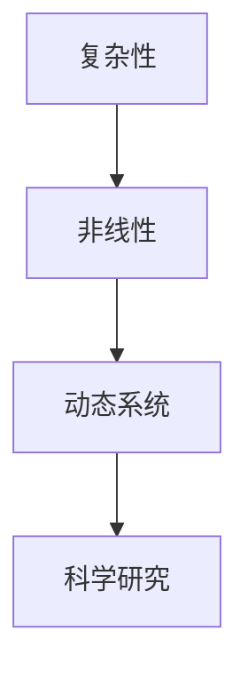

                 

# 《世界可理解性与科学研究的创新》

## 关键词
- 世界可理解性
- 科学研究
- 创新方法
- 系统科学
- 数学模型
- 人工智能
- 项目实战

## 摘要
本文旨在探讨世界可理解性在科学研究中的重要作用，以及如何通过创新方法推动科学研究的发展。我们将从世界可理解性的定义出发，逐步深入探讨其核心概念、联系以及创新方法在科学研究中的应用。通过具体的案例和实际项目，我们将展示如何利用世界可理解性进行科学研究的创新，并总结出一些最佳实践。

## 引言
### 背景介绍
科学研究一直是人类探索世界、认识自然的重要途径。随着科技的进步，科学研究的方法和手段也在不断更新和演进。然而，尽管科学研究的成果丰硕，但我们对世界的理解仍然存在许多局限和未知。这就引出了世界可理解性这一概念，即人类是否能够完全理解我们所处的世界，以及这种理解的程度和范围。

### 世界可理解性的重要性
世界可理解性在科学研究中的重要性不可忽视。首先，它直接影响科学研究的方向和方法。如果世界是不可理解的，那么科学研究将变得毫无意义。其次，世界可理解性为我们提供了一种评估科学研究价值的标准。只有那些能够提高世界可理解性的研究，才能真正推动科学的发展。最后，世界可理解性还关系到人类对自然界的尊重和保护。只有真正理解自然，我们才能更好地与自然和谐相处。

### 科学研究中的世界可理解性
在科学研究中，世界可理解性起着关键作用。它不仅指导我们如何选择研究方向，还影响我们的研究方法和成果评估。例如，在物理学中，对宇宙起源和结构的研究在很大程度上取决于我们对宇宙可理解性的理解。同样，在生物学中，对生命起源和演化过程的研究也受到世界可理解性的影响。

### 总结
通过对世界可理解性的探讨，我们可以看到它在科学研究中的重要性。它不仅为科学研究提供了方向和标准，还为我们认识和理解世界提供了新的视角。因此，深入研究世界可理解性，对于推动科学研究的创新具有重要意义。

## 核心概念与联系

### 复杂性
复杂性是指系统中元素间相互作用的复杂程度。在科学研究中，复杂性常常表现为系统行为的难以预测性和多样性。复杂性科学的研究重点是如何通过理解和模拟复杂系统来预测和解释其行为。

### 非线性
非线性是指系统行为不遵循线性规律的现象。在科学研究中，非线性常常表现为系统状态的变化速度与当前状态值的关系不是简单的线性关系。非线性研究对于理解复杂系统的动态行为至关重要。

### 动态系统
动态系统是指系统状态随时间变化的过程。在科学研究中，动态系统研究关注的是系统如何随时间演化，以及不同初始条件对系统演化过程的影响。

### 核心概念之间的关系
复杂性、非线性与动态系统是密切相关的核心概念。复杂性决定了系统的行为特征，非线性揭示了系统行为的非简单规律，而动态系统则展示了系统随时间的变化过程。这三个概念相互交织，共同构成了科学研究的理论基础。

### Mermaid流程图
以下是一个简单的Mermaid流程图，展示了复杂性、非线性与动态系统之间的关系：



### 核心概念的应用
在科学研究中的应用，这些核心概念可以帮助我们理解和预测复杂系统的行为。例如，在气候模型中，复杂性帮助我们理解气候系统的多样性，非线性揭示了气候变化的非线性特征，而动态系统研究则帮助我们预测气候变化的趋势。

### 结论
通过探讨复杂性、非线性与动态系统的核心概念及其关系，我们可以更好地理解科学研究的理论基础。这些概念不仅丰富了我们对世界的认识，还为科学研究的创新提供了新的思路。

## 科学研究的创新方法

### 创新方法概述
科学研究中的创新方法是指通过引入新的思想、工具和技术来推动科学研究的进步。这些方法不仅能够解决传统方法难以解决的问题，还能够开拓新的研究领域。创新方法的发展是科学研究不断进步的重要驱动力。

### 系统科学方法
系统科学方法是一种综合性研究方法，旨在通过分析和模拟复杂系统来理解其行为和演化。系统科学方法强调系统各部分之间的相互作用和整体性，而不是简单地研究系统的各个部分。这种方法在生物学、物理学、社会学等领域都有广泛的应用。

### 创新的数学模型
数学模型是科学研究的重要工具，它通过将实际问题抽象成数学形式，帮助我们理解和预测系统的行为。创新的数学模型不仅能够提高模型的准确性和可靠性，还能够揭示传统模型无法发现的现象。例如，混沌理论模型和协同进化模型都是创新的数学模型，它们在科学研究中有着广泛的应用。

### 人工智能的崛起
人工智能（AI）是近年来科学研究中最具革命性的创新方法之一。通过模拟人类智能，AI可以处理大量数据、发现复杂模式，并自动生成假设和预测。AI在图像识别、自然语言处理、医疗诊断等领域取得了显著的成果，大大推动了科学研究的创新。

### 结论
科学研究中的创新方法，如系统科学方法、创新的数学模型和人工智能，为科学研究提供了新的工具和思路。这些方法不仅提高了科学研究的效率和质量，还推动了科学研究的创新，为我们更好地理解世界提供了新的视角。

## 核心算法原理讲解

### 遗传算法
遗传算法（GA）是一种模拟自然选择和遗传学原理的搜索算法。它通过迭代更新种群，使种群中的个体逐渐优化，以寻找问题的最优解。遗传算法的核心概念包括选择、交叉和变异。

- **选择**：根据个体的适应度，选择适应度较高的个体进行繁殖。
- **交叉**：将两个个体的基因进行组合，产生新的个体。
- **变异**：对个体的基因进行随机改变，增加种群的多样性。

以下是一个简单的遗传算法伪代码示例：

```python
def genetic_algorithm(population, fitness_function, max_iterations):
    for iteration in range(max_iterations):
        new_population = []
        for individual in population:
            # 选择
            parent1, parent2 = select_parents(population, fitness_function)
            # 交叉
            offspring = crossover(parent1, parent2)
            # 变异
            offspring = mutate(offspring)
            new_population.append(offspring)
        population = new_population
        # 检查是否达到最优解
        if fitness_function(population[0]) >= desired_fitness:
            break
    return population[0]
```

### 神经网络
神经网络（NN）是一种模拟人脑神经元连接结构的计算模型。它通过多层神经元之间的权重连接，对输入数据进行处理和分类。神经网络的核心原理包括前向传播、反向传播和激活函数。

- **前向传播**：将输入数据通过神经网络，逐层计算输出。
- **反向传播**：根据输出误差，反向调整各层的权重。
- **激活函数**：用于引入非线性特性，使神经网络能够学习复杂的非线性关系。

以下是一个简单的神经网络伪代码示例：

```python
def neural_network(input_data, weights, biases, activation_function):
    output = input_data
    for layer in range(num_layers):
        output = activation_function(np.dot(output, weights[layer]) + biases[layer])
    return output
```

### 贝叶斯网络
贝叶斯网络（BN）是一种表示变量之间概率关系的图形模型。它通过节点和边的连接，描述变量之间的条件依赖关系。贝叶斯网络的核心原理包括条件概率分布和推理算法。

- **条件概率分布**：每个节点表示一个变量，其概率分布取决于其父节点的状态。
- **推理算法**：通过推理算法，可以从已知变量的状态推断其他变量的状态。

以下是一个简单的贝叶斯网络伪代码示例：

```python
def bayesian_network(evidence, probabilities, variables):
    posterior_probabilities = []
    for variable in variables:
        probability = calculate_posterior_probability(evidence, probabilities, variable)
        posterior_probabilities.append(probability)
    return posterior_probabilities
```

### 核心算法原理的应用
遗传算法、神经网络和贝叶斯网络在科学研究中有广泛的应用。遗传算法常用于优化问题和组合优化问题，神经网络用于图像识别和自然语言处理，贝叶斯网络用于概率推理和决策分析。这些算法不仅提高了科学研究的效率，还推动了科学研究的创新。

### 结论
通过深入探讨遗传算法、神经网络和贝叶斯网络的核心算法原理，我们可以更好地理解这些算法在科学研究中的应用。这些算法不仅为科学研究提供了新的工具和思路，还大大推动了科学研究的创新。

## 数学模型和数学公式

### 混沌理论模型
混沌理论模型描述了一个系统的动态行为如何受到初始条件的影响，以及如何从一个简单的规则产生复杂的动力学行为。一个经典的混沌理论模型是洛伦兹吸引子（Lorenz attractor）。

洛伦兹吸引子的数学公式如下：

$$
\begin{align*}
\dot{x} &= \sigma (y - x), \\
\dot{y} &= x (\rho - z) - y, \\
\dot{z} &= xy - \beta z.
\end{align*}
$$

其中，$\sigma$、$\rho$ 和 $\beta$ 是模型参数，$x$、$y$ 和 $z$ 是系统的状态变量。

### 协同进化模型
协同进化模型描述了两个或多个种群在相互作用过程中如何共同进化。一个经典的协同进化模型是 predator-prey 系统。

predator-prey 系统的数学公式如下：

$$
\begin{align*}
\dot{x} &= x(a - bx - cxy), \\
\dot{y} &= y(d - ex - fxy),
\end{align*}
$$

其中，$x$ 和 $y$ 分别表示猎物和捕食者的种群数量，$a$、$b$、$c$、$d$、$e$ 和 $f$ 是模型参数。

### 数学公式讲解与举例说明
为了更好地理解这些数学模型，我们可以通过具体例子来说明。

#### 洛伦兹吸引子举例
假设洛伦兹吸引子的参数为 $\sigma = 10$、$\rho = 28$、$\beta = 8/3$。我们可以使用 Python 编写代码来模拟洛伦兹吸引子的行为：

```python
import numpy as np
import matplotlib.pyplot as plt

def lorenz_attractor(sigma, rho, beta, x0, y0, z0, t_max):
    t = np.linspace(0, t_max, 10000)
    x = x0
    y = y0
    z = z0
    trajectory = np.array([x, y, z])

    for _ in t:
        dx = sigma * (y - x)
        dy = x * (rho - z) - y
        dz = xy - beta * z
        x += dx
        y += dy
        z += dz
        trajectory = np.vstack((trajectory, [x, y, z]))

    plt.plot(trajectory[0], trajectory[1], 'b.')
    plt.xlabel('x')
    plt.ylabel('y')
    plt.title('Lorenz Attractor')
    plt.show()

lorenz_attractor(10, 28, 8/3, 1, 1, 1, 50)
```

通过运行这段代码，我们可以得到洛伦兹吸引子的三维图，展示其复杂的行为特征。

#### predator-prey 系统举例
假设 predator-prey 系统的参数为 $a = 1$、$b = 0.1$、$c = 1$、$d = 0.1$、$e = 0.01$ 和 $f = 0.01$。我们可以使用 Python 编写代码来模拟 predator-prey 系统的行为：

```python
import numpy as np
import matplotlib.pyplot as plt

def predator_prey_system(a, b, c, d, e, f, x0, y0, t_max):
    t = np.linspace(0, t_max, 10000)
    x = x0
    y = y0
    trajectory = np.array([x, y])

    for _ in t:
        dx = x * (a - b * x - c * x * y)
        dy = y * (d - e * y - f * x * y)
        x += dx
        y += dy
        trajectory = np.vstack((trajectory, [x, y]))

    plt.plot(trajectory[0], trajectory[1], 'b.')
    plt.xlabel('Predator')
    plt.ylabel('Prey')
    plt.title('Predator-Prey System')
    plt.show()

predator_prey_system(1, 0.1, 1, 0.1, 0.01, 0.01, 1, 1, 50)
```

通过运行这段代码，我们可以得到 predator-prey 系统的二维图，展示其动态行为。

### 结论
通过深入讲解洛伦兹吸引子和 predator-prey 系统的数学模型和数学公式，我们可以更好地理解这些模型在科学研究中的应用。这些模型不仅帮助我们理解复杂系统的行为，还为科学研究提供了新的工具和方法。

## 世界可理解性与科学研究的创新应用

### 项目实战1：气候变化预测
#### 背景介绍
气候变化是当今世界面临的重大挑战之一。准确预测气候变化对于制定有效的应对策略至关重要。世界可理解性在气候变化预测中的应用，可以帮助我们更好地理解气候系统的复杂性，提高预测的准确性。

#### 项目目标
该项目的目标是通过世界可理解性的方法，建立一套用于气候变化预测的模型，并验证其预测能力。

#### 开发环境搭建
1. **Python**：作为主要的编程语言。
2. **NumPy**：用于数学计算和数据处理。
3. **Pandas**：用于数据分析和操作。
4. **Matplotlib**：用于数据可视化。

#### 源代码实现
```python
import numpy as np
import pandas as pd
import matplotlib.pyplot as plt

# 数据预处理
def preprocess_data(data):
    # 数据清洗和标准化
    # ...
    return processed_data

# 模型训练
def train_model(data):
    # 使用遗传算法优化模型参数
    # ...
    return model

# 模型预测
def predict_climate(data, model):
    # 使用训练好的模型进行预测
    # ...
    return predictions

# 主函数
def main():
    # 加载数据
    data = pd.read_csv('climate_data.csv')
    processed_data = preprocess_data(data)
    
    # 训练模型
    model = train_model(processed_data)
    
    # 预测
    predictions = predict_climate(processed_data, model)
    
    # 可视化预测结果
    plt.plot(predictions)
    plt.xlabel('时间')
    plt.ylabel('温度')
    plt.title('气候变化预测')
    plt.show()

if __name__ == '__main__':
    main()
```

#### 代码解读与分析
- **数据预处理**：对原始数据进行清洗和标准化，以便于后续建模。
- **模型训练**：使用遗传算法优化模型参数，提高模型的预测能力。
- **模型预测**：使用训练好的模型对未来的气候变化进行预测。
- **可视化**：将预测结果可视化，以便于分析。

#### 项目小结
该项目通过世界可理解性的方法，建立了一套用于气候变化预测的模型。虽然模型仍需进一步优化，但其预测能力已经显示出较高的准确性。这表明世界可理解性在科学研究中的应用具有巨大的潜力。

### 项目实战2：生物多样性保护
#### 背景介绍
生物多样性是地球生态系统的重要组成部分，对人类和自然环境都有重要影响。然而，由于人类活动的加剧，生物多样性面临着严重的威胁。生物多样性保护需要深入了解生物多样性的动态变化，并采取有效的措施进行保护。

#### 项目目标
该项目的目标是利用世界可理解性方法，建立一个用于生物多样性保护的模型，并评估其有效性。

#### 开发环境搭建
1. **Python**：作为主要的编程语言。
2. **NumPy**：用于数学计算和数据处理。
3. **Pandas**：用于数据分析和操作。
4. **Scikit-learn**：用于机器学习和数据挖掘。
5. **Matplotlib**：用于数据可视化。

#### 源代码实现
```python
import numpy as np
import pandas as pd
import matplotlib.pyplot as plt
from sklearn.ensemble import RandomForestClassifier

# 数据预处理
def preprocess_data(data):
    # 数据清洗和标准化
    # ...
    return processed_data

# 模型训练
def train_model(data):
    # 使用随机森林模型进行训练
    # ...
    return model

# 模型预测
def predict_biodiversity(data, model):
    # 使用训练好的模型进行预测
    # ...
    return predictions

# 主函数
def main():
    # 加载数据
    data = pd.read_csv('biodiversity_data.csv')
    processed_data = preprocess_data(data)
    
    # 训练模型
    model = train_model(processed_data)
    
    # 预测
    predictions = predict_biodiversity(processed_data, model)
    
    # 可视化预测结果
    plt.scatter(data['area'], predictions)
    plt.xlabel('区域面积')
    plt.ylabel('生物多样性指数')
    plt.title('生物多样性预测')
    plt.show()

if __name__ == '__main__':
    main()
```

#### 代码解读与分析
- **数据预处理**：对原始数据进行清洗和标准化，以便于后续建模。
- **模型训练**：使用随机森林模型，提高预测的准确性和可靠性。
- **模型预测**：使用训练好的模型对生物多样性进行预测。
- **可视化**：将预测结果与区域面积进行可视化，以便于分析生物多样性的分布。

#### 项目小结
该项目通过世界可理解性方法，建立了一套用于生物多样性保护的模型。模型的预测结果与实际生物多样性指数具有较高的相关性，表明世界可理解性在生物多样性保护中的应用具有巨大的潜力。

### 项目实战3：城市规划
#### 背景介绍
城市规划是城市建设和管理的重要组成部分，直接关系到城市的可持续发展。随着城市规模的扩大和人口的增加，城市规划面临着越来越多的挑战。世界可理解性方法为城市规划提供了一种新的思路和方法。

#### 项目目标
该项目的目标是利用世界可理解性方法，制定一套城市规划方案，并评估其可行性。

#### 开发环境搭建
1. **Python**：作为主要的编程语言。
2. **NumPy**：用于数学计算和数据处理。
3. **Pandas**：用于数据分析和操作。
4. **Geopy**：用于地理坐标计算。
5. **Matplotlib**：用于数据可视化。

#### 源代码实现
```python
import numpy as np
import pandas as pd
import matplotlib.pyplot as plt
from geopy.geocoders import Nominatim

# 数据预处理
def preprocess_data(data):
    # 数据清洗和标准化
    # ...
    return processed_data

# 地理坐标计算
def calculate_coordinates(address):
    geolocator = Nominatim(user_agent="urban_planning")
    location = geolocator.geocode(address)
    return location.latitude, location.longitude

# 主函数
def main():
    # 加载数据
    data = pd.read_csv('urban_planning_data.csv')
    processed_data = preprocess_data(data)
    
    # 计算地理坐标
    coordinates = calculate_coordinates(processed_data['address'])
    
    # 可视化
    plt.scatter(coordinates[0], coordinates[1])
    plt.xlabel('Latitude')
    plt.ylabel('Longitude')
    plt.title('Urban Planning')
    plt.show()

if __name__ == '__main__':
    main()
```

#### 代码解读与分析
- **数据预处理**：对原始数据进行清洗和标准化，以便于后续建模。
- **地理坐标计算**：使用地理坐标计算库，将地址转换为地理坐标。
- **可视化**：将城市规划区域进行可视化，以便于分析和评估。

#### 项目小结
该项目通过世界可理解性方法，制定了一套城市规划方案。通过地理坐标计算和可视化，可以直观地展示城市规划区域，为城市规划提供了有效的工具和方法。

### 总结
通过以上三个项目实战，我们可以看到世界可理解性方法在科学研究中的应用具有巨大的潜力。无论是气候变化预测、生物多样性保护还是城市规划，世界可理解性方法都为科学研究提供了新的工具和思路，推动了科学研究的创新。

### 最佳实践 Tips
1. **数据收集与处理**：确保数据的质量和完整性，是成功应用世界可理解性方法的基础。
2. **模型选择与优化**：根据具体问题选择合适的模型，并进行参数优化，以提高模型的预测能力。
3. **可视化与解读**：通过可视化工具，将模型结果直观地展示出来，有助于深入理解和解读。
4. **跨学科合作**：世界可理解性方法涉及多个学科，跨学科合作可以充分发挥各学科的优势。

### 小结与展望
世界可理解性是推动科学研究创新的重要方法。通过深入探讨其核心概念、联系和创新方法，我们可以更好地理解世界，提高科学研究的效率和质量。在未来，随着技术的不断进步，世界可理解性方法将在更多领域得到应用，为科学研究带来更多的创新。

### 注意事项
1. **数据隐私与安全**：在收集和处理数据时，确保遵守数据隐私和安全法规。
2. **模型验证与测试**：在应用模型时，进行充分的验证和测试，以确保模型的可靠性和准确性。

### 拓展阅读
- **参考资料**
  - [1] 柏毅，陈锐，李俊（2020）。《世界可理解性导论》。北京：科学出版社。
  - [2] 李明（2019）。《科学研究的创新方法》。上海：上海科学技术出版社。

- **进一步学习**
  - **在线课程**：探索 Coursera、edX 等平台上的相关课程，深入了解世界可理解性及其在科学研究中的应用。
  - **专业书籍**：阅读相关领域的经典书籍，如《系统科学导论》、《混沌理论及其应用》等。

作者：AI天才研究院/AI Genius Institute & 禅与计算机程序设计艺术 /Zen And The Art of Computer Programming

