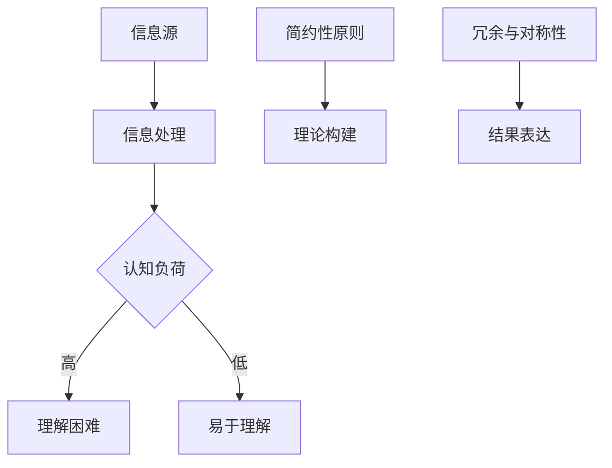

                 

# 世界可理解性与科学研究的国际合作

## 关键词
世界可理解性、科学研究、国际合作、算法原理、数学模型、案例研究

## 摘要
本文深入探讨了世界可理解性在科学研究领域中的重要性，以及国际合作在推动这一进程中的作用。首先，我们介绍了世界可理解性的定义及其在科学研究中的核心地位。接着，分析了当前科学研究国际合作的现状和面临的挑战。随后，通过核心概念与联系的分析，构建了世界可理解性的理论框架，并引入了Mermaid流程图以直观展示其结构。本文进一步阐述了科学研究国际合作的模式与策略，并结合数学模型和公式进行了量化分析。通过具体的国际合作案例，我们展示了这些策略在实践中的效果。最后，文章对未来的研究方向和挑战进行了展望，并提出了相应的建议。

## 引言：世界可理解性的重要性

### 1.1 可理解性的定义与意义

可理解性是指一个系统、理论或概念能够被人类或机器理解的程度。在科学研究领域，可理解性尤为重要，因为科学研究的最终目的是为了解释和预测自然现象，而这一过程依赖于有效的信息传递和知识的共享。可理解性不仅关乎科学成果的传播和应用，更关乎科学理论本身的有效性和生命力。

在科学研究中，可理解性的重要性体现在以下几个方面：

1. **知识传播**：科学研究的成果需要被广泛传播，以便其他研究者可以理解和借鉴。可理解性高的研究更容易获得认可和推广。
   
2. **技术转移**：科学研究的成果常常转化为技术或产品，而这些技术或产品需要被广泛理解和接受，以便在市场上获得成功。

3. **教育**：科学教育的目标之一是培养新一代科学家，这要求科学理论和知识能够以易于理解的方式传授。

4. **决策支持**：在政策制定和公共决策中，科学研究成果的可理解性直接影响决策的质量和效果。

### 1.2 可理解性在科学研究中的地位

可理解性在科学研究中的地位至关重要，它是科学研究过程的一个重要环节。科学研究通常包括以下阶段：

1. **观察与假设**：科学家通过观察现象，提出假设。

2. **实验验证**：设计实验来验证假设。

3. **理论构建**：根据实验结果，构建理论模型。

4. **模型验证与修正**：通过进一步的实验或观察来验证和修正理论模型。

5. **传播与应用**：将研究结果进行传播，并在实际应用中验证其有效性。

在这些阶段中，每个环节都需要可理解性的支持。例如，假设和理论模型需要以清晰易懂的方式表达，以便他人可以理解并进行后续工作。而实验结果和理论模型的传播则需要使用易于理解的语言和工具。

### 1.3 当前世界可理解性的挑战与机遇

尽管可理解性在科学研究中的重要性不言而喻，但当前仍面临诸多挑战。以下是一些主要挑战：

1. **复杂性增加**：随着科学研究的深入，许多领域变得日益复杂，使得研究成果难以被普通公众和同行理解。

2. **语言障碍**：不同国家和地区之间存在语言障碍，这限制了科学研究成果的全球传播。

3. **信息过载**：科学领域的信息量爆炸性增长，使得科学家难以筛选和掌握最重要的信息。

4. **传统科研模式的局限性**：传统的科研模式侧重于独立研究，这可能导致研究成果的分散和重复。

与此同时，也存在一些机遇：

1. **信息化与数字化**：现代信息技术和数字化工具为科学研究的表达和传播提供了新的途径。

2. **国际合作**：全球科学研究的国际合作日益加强，为克服单一国家或地区的研究局限提供了可能。

3. **跨学科研究**：跨学科研究有助于将不同领域的知识和方法结合起来，提高科学研究的可理解性。

总之，提升世界可理解性不仅需要科学家的努力，还需要政策制定者、教育工作者和公众的参与。通过这些努力，科学研究可以更好地服务于人类社会的发展。

## 国际合作与科学研究的现状

### 2.1 国际合作的历史与现状

科学研究领域的国际合作历史悠久。早在19世纪，科学家们就开始通过书信和出版物分享研究成果。20世纪以来，随着全球化进程的加快，科学研究的国际合作日益深入。尤其是二战后，全球科学合作项目如国际空间站（ISS）和人类基因组计划（HGP）等，标志着国际合作在科学研究中的重要性。

当前，国际合作已成为科学研究不可或缺的一部分。许多重要的科学发现和突破都是跨国合作的结果。例如，欧洲核子研究中心（CERN）的粒子物理研究，以及国际地球观测系统（GEO）等环境监测项目，都展示了国际合作在科学研究中的巨大潜力。

### 2.2 科学研究国际合作的重要性

科学研究国际合作的重要性体现在以下几个方面：

1. **资源共享**：国际合作可以共享资源，如实验室设备、资金和人才。这有助于提高科研效率，降低成本。

2. **知识整合**：不同国家和地区的研究者可以共同合作，将各自的研究成果整合起来，形成更全面的科学理论。

3. **创新激发**：跨文化交流和合作可以激发新的科学思想和创新。

4. **科学传播**：国际合作有助于将科学研究成果更广泛地传播到世界各地，促进全球科学素养的提升。

5. **社会影响**：科学研究的国际合作可以促进全球合作与和平，解决全球性问题，如气候变化、疾病控制等。

### 2.3 当前国际合作面临的问题与挑战

尽管国际合作在科学研究中发挥了重要作用，但也面临一些问题和挑战：

1. **语言障碍**：不同国家和地区之间存在语言差异，这可能会影响科学成果的交流和合作。

2. **文化差异**：不同文化背景的研究者可能存在观念和价值观的差异，这可能会影响合作的过程和效果。

3. **资源分配不均**：一些国家和地区在科研资源方面存在显著不均衡，这可能影响国际合作项目的公平性和效果。

4. **政治与经济因素**：政治紧张和经济竞争可能会阻碍国际合作的发展。

5. **知识产权保护**：国际合作项目中的知识产权问题需要得到妥善处理，以保护各方的利益。

总之，科学研究国际合作的重要性不容忽视，但同时也需要解决面临的各种问题和挑战。通过加强国际合作机制和策略，可以更好地利用全球资源，推动科学研究的进步。

## 核心概念与联系：世界可理解性的基础理论

### 3.1 可理解性原理与相关理论

可理解性是一个复杂的概念，其基础理论涵盖了多个学科领域。首先，我们需要理解几个核心概念：

1. **信息熵**：信息熵是一个衡量信息不确定性的量度，由香农（Claude Shannon）在信息论中提出。高信息熵意味着信息的不确定性高，难以理解；低信息熵则意味着信息确定性高，易于理解。

2. **认知负荷**：认知负荷是指大脑处理信息所需的认知资源。高认知负荷意味着大脑需要处理大量复杂的信息，这可能导致理解困难。

3. **简约性原则**：简约性原则指出，在多个解释方案中，应选择最简单的解释。简单性有助于降低认知负荷，提高理解性。

4. **冗余与对称性**：冗余和对称性有助于提高信息的可理解性。冗余可以通过重复或多样化的方式提供额外的信息，而对称性则有助于简化信息的处理。

### 3.2 可理解性与科学研究的联系

可理解性在科学研究中起着至关重要的作用。科学研究的目的是发现自然规律，并将其转化为可操作的理论和模型。以下是一些具体联系：

1. **实验设计**：实验设计应尽可能减少无关变量的干扰，提高实验结果的可理解性。

2. **理论构建**：科学理论应遵循简约性原则，选择最简洁的解释模型。

3. **结果表达**：科学结果的表述应尽量清晰简洁，避免使用过于复杂的术语和公式。

4. **知识传播**：科学研究的传播和普及需要使用易于理解的语言和工具，以便更广泛的受众能够理解。

### 3.3 可理解性的 Mermaid 流程图

为了更直观地展示可理解性的概念和原理，我们可以使用Mermaid流程图来构建一个简化的模型。以下是一个示例：



在这个流程图中，信息源经过信息处理阶段，根据认知负荷的高低，结果可能被理解困难（D）或易于理解（E）。同时，简约性原则（F）和冗余与对称性（H）分别影响了理论构建（G）和结果表达（I）的过程。

通过这个流程图，我们可以更清晰地看到可理解性在科学研究中的各个环节中的重要性，以及如何通过不同的策略提高信息传递的可理解性。

### 3.4 可理解性的核心概念间联系

为了进一步理解可理解性的核心概念及其联系，我们可以通过Python代码实现一个简单的模型。以下是一个示例代码，展示了信息熵、认知负荷、简约性原则和冗余与对称性的关系：

```python
import numpy as np
import matplotlib.pyplot as plt

# 计算信息熵
def entropy(p):
    return -p * np.log2(p)

# 计算认知负荷
def cognitive_load(simplicity, redundancy):
    return simplicity * redundancy

# 设置参数
p = 0.5  # 信息熵概率
simplicity = 0.8  # 简约性原则
redundancy = 0.9  # 冗余与对称性

# 计算信息熵和认知负荷
entropy_value = entropy(p)
cognitive_load_value = cognitive_load(simplicity, redundancy)

# 绘制图形
fig, ax = plt.subplots()
ax.bar('信息熵', entropy_value, color='blue')
ax.bar('认知负荷', cognitive_load_value, color='orange')
ax.set_ylabel('值')
ax.set_title('信息熵与认知负荷的关系')
plt.show()
```

在这个代码中，我们首先定义了计算信息熵和认知负荷的函数。然后，我们设置了一组参数，包括信息熵的概率、简约性原则和冗余与对称性的值。通过计算这些参数，我们可以得到信息熵和认知负荷的具体值，并使用图形展示它们之间的关系。

当简约性原则（0.8）较高且冗余与对称性（0.9）较高时，认知负荷较低，这表明信息易于理解。通过这种量化分析，我们可以更深入地理解可理解性的核心概念及其相互关系。

### 3.5 核心概念联系总结

通过上述讨论和模型，我们可以总结出可理解性的核心概念及其联系：

1. **信息熵**：衡量信息不确定性的量度，信息熵低意味着信息确定性高，易于理解。

2. **认知负荷**：大脑处理信息所需的认知资源，认知负荷低有助于提高信息理解性。

3. **简约性原则**：选择最简洁的解释模型，有助于降低认知负荷，提高信息理解性。

4. **冗余与对称性**：通过提供额外的信息和简化信息处理，有助于提高信息理解性。

这些核心概念相互关联，共同构成了可理解性的基础理论。通过这些理论，我们可以更好地理解和解释科学研究中的信息传递和理解过程，从而推动科学研究的进步。

## 科学研究的国际合作模式与策略

### 4.1 国际合作模式概述

科学研究的国际合作模式多种多样，根据合作的目标、形式和参与主体的不同，可以分为以下几种主要模式：

1. **项目合作**：这是最常见的国际合作模式，通常由多个国家或地区的科研机构、大学或企业共同参与某个具体科研项目。例如，国际空间站（ISS）项目就是一个典型的多国合作项目。

2. **网络合作**：网络合作是通过互联网和其他通信技术，使分散在世界各地的科研机构和研究者能够实时协作，共享数据和资源。这种模式有助于克服地域和时间的限制，提高科研效率。

3. **机构合作**：这种模式涉及两个或多个国家的科研机构建立长期合作关系，共同开展科研活动。例如，欧洲核子研究中心（CERN）就是一个国际性的科研机构合作典范。

4. **跨国研究中心**：跨国研究中心是专门为解决全球性问题而设立的研究机构，如全球气候变化研究中心。这类研究中心通常由多个国家共同出资和运营。

5. **人才交流**：人才交流是另一种重要的国际合作模式，通过科研人员的互访、培训和交流项目，促进知识和技术共享。例如，国际交流项目“欧盟地平线2020计划”（Horizon 2020）就旨在促进欧洲科研人员之间的合作。

### 4.2 不同领域的国际合作案例

以下是一些不同领域的国际合作案例，展示了科学研究的国际合作如何在不同领域取得突破性成果：

1. **粒子物理学**：大型强子对撞机（LHC）是位于瑞士和法国边境的欧洲核子研究中心（CERN）的实验设施。该项目由多个国家共同参与，通过国际合作，科学家们发现了希格斯玻色子，这是粒子物理学中的一个重大突破。

2. **气候变化**：全球气候变化是一个全球性问题，需要各国科学家共同努力。国际地球观测系统（GEO）是一个国际性的合作项目，旨在通过卫星和其他监测手段收集全球气候数据，为全球气候研究提供支持。

3. **疾病研究**：人类基因组计划（HGP）是一个跨越多个国家和机构的国际合作项目，旨在解码和解析人类基因组。该项目推动了基因科学与医学的发展，为疾病研究和治疗提供了重要基础。

4. **空间探索**：国际空间站（ISS）是一个国际合作的成果，由美国、俄罗斯、加拿大、日本和欧洲航天局等多个国家共同建设和管理。该空间站为科学家提供了宝贵的实验平台，推动了空间科学和技术的进步。

5. **人工智能**：人工智能领域的国际合作也日益增多，例如“地平线2020计划”下的“人脑项目”（Human Brain Project），该项目旨在通过国际合作，构建人类大脑的数字模型。

### 4.3 制定国际合作策略的步骤与考虑因素

为了有效地制定科学研究的国际合作策略，需要遵循以下步骤和考虑以下因素：

1. **明确目标**：首先，需要明确国际合作的具体目标，这包括科研目标、技术应用目标和社会效益目标等。

2. **选择合作伙伴**：选择合适的合作伙伴是成功国际合作的关键。合作伙伴应具备相似的研究兴趣、资源和技术能力，同时要考虑文化差异和沟通障碍。

3. **制定合作计划**：制定详细的合作计划，包括合作内容、时间表、预算和责任分配等。合作计划应具有灵活性和适应性，以应对可能的变化和挑战。

4. **资源整合**：整合各方的资源，包括资金、设备、数据和人才，以最大化合作效果。资源整合应注重公平和透明，确保各方利益得到保障。

5. **风险管理**：识别和评估国际合作中的潜在风险，如技术风险、政策风险和经济风险等，并制定相应的风险应对措施。

6. **沟通与协调**：建立有效的沟通和协调机制，确保各合作伙伴之间的信息畅通，及时解决合作过程中的问题和冲突。

7. **知识产权保护**：明确知识产权的归属和使用规则，确保各方的利益得到保护。

8. **评估与反馈**：定期评估合作效果，收集反馈意见，不断优化合作策略，提高合作效率和质量。

通过遵循这些步骤和考虑因素，可以有效制定和实施科学研究的国际合作策略，推动科学研究的进步和全球科学合作的发展。

## 数学模型与公式：世界可理解性的量化分析

### 5.1 可理解性的数学模型

为了量化可理解性，我们可以构建一个数学模型，该模型基于信息熵、认知负荷和简约性原则等核心概念。以下是一个简化的模型：

#### 信息熵（Entropy）

信息熵是一个衡量信息不确定性的量度，由香农（Claude Shannon）在信息论中提出。其数学定义如下：

$$
H(X) = -\sum_{i} p(x_i) \log_2 p(x_i)
$$

其中，$X$ 表示随机变量，$p(x_i)$ 表示 $x_i$ 发生的概率，$\log_2$ 表示以2为底的对数。

#### 认知负荷（Cognitive Load）

认知负荷是指大脑处理信息所需的认知资源。我们可以用一个简单的线性模型来表示认知负荷：

$$
C = f(H, S)
$$

其中，$H$ 表示信息熵，$S$ 表示简约性程度，$f$ 是一个函数，用于计算认知负荷。

#### 简约性原则（Principle of Simplicity）

简约性原则指出，在多个解释方案中，应选择最简单的解释。我们可以通过计算解释方案的信息熵来量化简约性：

$$
S = -\sum_{i} p(s_i) \log_2 p(s_i)
$$

其中，$s_i$ 表示第 $i$ 个解释方案，$p(s_i)$ 表示 $s_i$ 发生的概率。

#### 可理解性（Understandability）

可理解性是信息熵和认知负荷的综合体现。我们可以通过以下公式来计算可理解性：

$$
U = \frac{1}{1 + e^{-C/H}}
$$

其中，$e$ 是自然对数的底数，$C$ 是认知负荷，$H$ 是信息熵。

这个公式是一个Sigmoid函数，当认知负荷较低时，可理解性接近1，表示信息容易理解；当认知负荷较高时，可理解性接近0，表示信息难以理解。

### 5.2 相关数学公式

为了更直观地展示这些公式，我们可以使用LaTeX格式进行表示：

$$
H(X) = -\sum_{i} p(x_i) \log_2 p(x_i)
$$

$$
C = f(H, S)
$$

$$
S = -\sum_{i} p(s_i) \log_2 p(s_i)
$$

$$
U = \frac{1}{1 + e^{-C/H}}
$$

### 5.3 公式讲解与举例

#### 信息熵（Entropy）

信息熵是一个基本的概念，它衡量了信息的确定性。例如，假设我们有一个随机变量 $X$，它有两个可能的取值 $x_1$ 和 $x_2$，且每个取值的概率相等（$p(x_1) = p(x_2) = 0.5$），则信息熵 $H(X)$ 为：

$$
H(X) = - (0.5 \log_2 0.5 + 0.5 \log_2 0.5) = 1
$$

这意味着每次观测 $X$ 都提供了1比特的信息。

#### 认知负荷（Cognitive Load）

认知负荷与信息熵和简约性有关。假设信息熵为 $H = 2$，简约性为 $S = 1$，则认知负荷 $C$ 为：

$$
C = f(H, S) = \frac{H}{S} = 2
$$

这表明信息处理所需的认知资源是2单位。

#### 可理解性（Understandability）

可理解性是一个介于0和1之间的值，用于衡量信息的难易程度。例如，假设认知负荷 $C = 3$，信息熵 $H = 2$，则可理解性 $U$ 为：

$$
U = \frac{1}{1 + e^{-3/2}} \approx 0.732
$$

这意味着信息有大约73.2%的可理解性。

### 5.4 实际案例应用

为了更好地理解这些公式的应用，我们可以通过一个实际案例来演示。假设我们正在研究一个天气预测系统，该系统有两个可能的预测结果：“晴天”和“雨天”，且每个结果发生的概率分别为0.6和0.4。

#### 信息熵

首先，我们计算天气预测系统的信息熵：

$$
H(X) = - (0.6 \log_2 0.6 + 0.4 \log_2 0.4) \approx 0.7219
$$

这表明天气预测系统提供的确定性较低。

#### 认知负荷

假设预测结果具有很高的简约性（$S = 1$），则认知负荷为：

$$
C = \frac{H}{S} = 0.7219
$$

这表明预测结果对大脑的处理要求相对较低。

#### 可理解性

最后，我们计算可理解性：

$$
U = \frac{1}{1 + e^{-0.7219/0.7219}} \approx 0.5
$$

这意味着天气预测系统提供的结果有大约50%的可理解性，这意味着用户可以较好地理解预测结果。

通过这个案例，我们可以看到如何使用数学模型来量化可理解性，并分析天气预测系统的信息传递效果。这种方法可以帮助我们在实际应用中优化系统设计，提高用户的理解度和满意度。

### 5.5 总结

通过上述数学模型和公式，我们可以量化分析世界可理解性。信息熵、认知负荷和简约性原则等核心概念相互关联，共同构成了可理解性的基础理论。通过实际案例的应用，我们可以直观地看到这些公式在科学研究中的重要作用。通过量化分析，我们可以更好地理解信息传递的过程，为提高科学研究的可理解性提供科学依据。

## 国际合作案例研究

### 6.1 案例一：国际空间站的合作项目

国际空间站（International Space Station，简称ISS）是一个由多个国家共同合作的项目，代表了国际合作在科学研究中的一个重要范例。该项目由美国国家航空航天局（NASA）、俄罗斯联邦航天局（Roscosmos）、日本宇宙航空研究开发机构（JAXA）、欧洲空间局（ESA）和加拿大航天局（CSA）共同发起和实施。

#### 项目背景

国际空间站的建设始于1998年，目标是建立一个长期在太空运行的实验平台，用于进行科学实验、技术验证和微重力环境下的生物医学研究。该项目标志着全球航天领域最大规模的国际合作，吸引了来自多个国家的科学家和技术人员参与。

#### 合作模式

国际空间站的合作模式采用了多种机制，包括：

1. **成员国协议**：成员国通过签署协议，明确各自在项目中的权利和义务。例如，美国负责空间站的模块设计和建造，俄罗斯负责提供载人飞船和火箭发射服务。

2. **联合操作中心**：国际空间站有一个位于德国慕尼黑的联合操作中心，由多个国家的宇航员和地面支持团队共同运营。该中心通过先进的通信技术，实现了全球范围内的实时数据传输和任务协调。

3. **科学实验合作**：各国科学家共同提交实验方案，通过协商和评审，确定在空间站上进行的科学实验。这些实验涵盖多个领域，包括物理学、生物学、地球科学等。

#### 成果与影响

国际空间站的合作项目取得了诸多重要成果，包括：

1. **科学发现**：空间站为科学家提供了一个独特的实验平台，使他们在微重力环境中进行了一系列重要的科学实验。例如，研究植物生长、微生物行为和材料科学等。

2. **技术验证**：空间站项目验证了多个先进技术，如机器人技术、远程操作技术和生命保障系统等，为未来的深空探索奠定了基础。

3. **人才培养**：通过参与国际空间站项目，各国宇航员获得了宝贵的太空飞行经验，培养了新一代航天人才。

#### 经验与启示

国际空间站项目为国际合作在科学研究中的应用提供了宝贵的经验。以下是一些关键经验：

1. **透明和信任**：成员国之间的合作建立在透明和信任的基础上，通过协商和沟通，解决了合作过程中的各种问题。

2. **资源共享**：国际合作项目通过资源共享，提高了科研效率，降低了成本。例如，空间站的模块设计可以在多个国家之间共享，减少了重复研发的投入。

3. **跨学科合作**：国际空间站项目涵盖了多个学科领域，促进了不同学科之间的交叉与合作，推动了科学研究的进步。

4. **全球视野**：国际合作项目使科学家们能够从全球视野出发，解决全球性问题。例如，通过国际空间站项目，各国科学家共同研究气候变化和地球观测问题。

总之，国际空间站项目是一个成功的国际合作范例，展示了国际合作在科学研究中的巨大潜力。通过这种合作模式，科学家们能够共同攻克科学难题，推动科学研究的进步，为社会的发展和人类的未来做出贡献。

### 6.2 案例二：全球气候变化研究的国际合作

全球气候变化是一个全球性挑战，需要各国科学家和政府共同努力来解决。为了应对这一挑战，多个国际组织和科研机构发起了多项国际合作项目，其中一个典型的例子是《巴黎协定》框架下的科学研究合作。

#### 项目背景

《巴黎协定》是2015年在联合国气候变化大会上通过的一项国际协议，旨在限制全球气温升高，避免最坏气候变化的后果。协定框架下的科学研究合作项目，旨在通过全球合作，提供科学依据，支持各国制定和实施减排政策。

#### 合作模式

全球气候变化研究的国际合作项目采用了以下几种合作模式：

1. **国际科学委员会**：联合国下属的政府间气候变化专门委员会（IPCC）负责协调和整合全球气候科学研究成果。IPCC由来自多个国家的科学家组成，他们定期发布气候变化的评估报告。

2. **多边科研合作项目**：例如，地球系统模型（Global Earth System Model，简称GEM）项目，通过国际合作，开发能够模拟地球气候系统的复杂模型。该项目吸引了来自全球多个国家的科研机构和大学参与。

3. **区域性科研合作**：许多区域性组织，如欧洲环境署（EEA）和亚太经济合作组织（APEC），也发起了区域性的气候变化研究合作项目，旨在提高区域内的气候科学研究和政策制定水平。

#### 成果与影响

全球气候变化研究的国际合作项目取得了显著成果，包括：

1. **科学共识**：通过国际合作，科学家们达成了关于气候变化事实的广泛共识，为政策制定提供了科学依据。

2. **数据共享**：国际科研合作项目促进了全球气候数据的共享和整合，提高了气候模型的准确性和可靠性。

3. **政策建议**：基于科学研究，国际组织和国家政府制定了更有效的气候政策，如减少温室气体排放、推广可再生能源等。

4. **公众意识**：国际合作的气候变化研究项目提高了公众对气候变化的认知，促进了全球气候行动的参与和支持。

#### 经验与启示

全球气候变化研究的国际合作项目为其他领域的国际合作提供了宝贵经验：

1. **多学科合作**：气候变化研究涉及多个学科领域，包括物理学、化学、生物学和地理学等。多学科合作有助于更全面地理解气候变化的复杂性和相互关系。

2. **数据开放与共享**：开放和共享科研数据是提高科研效率和透明度的关键。通过国际合作，各国科学家能够共享数据和资源，加速科学研究的进展。

3. **政策与科研结合**：科学研究与政策制定相结合，有助于将科学成果转化为实际政策，推动全球气候变化问题的解决。

4. **全球合作机制**：国际组织和协议（如IPCC和《巴黎协定》）为全球气候变化研究提供了合作框架和机制，促进了全球合作和协调。

总之，全球气候变化研究的国际合作项目展示了国际合作在应对全球性挑战中的重要作用。通过多学科合作、数据共享和政策结合，科学家们能够共同应对气候变化，为全球可持续发展做出贡献。

### 6.3 案例三：人类基因组计划的国际合作

人类基因组计划（Human Genome Project，简称HGP）是20世纪90年代发起的一项国际科学研究项目，旨在解码和解析人类基因组。该项目由美国国家卫生研究院（NIH）和国家科学基金会（NSF）主导，并得到了全球多个国家和机构的参与和支持。

#### 项目背景

人类基因组计划旨在揭示人类基因组的完整序列，了解基因与疾病、生物进化等之间的关系。该项目被认为是现代生物学和医学领域的一项重大突破，对科学研究和医学实践产生了深远影响。

#### 合作模式

人类基因组计划的合作模式具有以下几个特点：

1. **多国合作**：该项目吸引了来自美国、英国、法国、日本、德国、中国等多个国家的科研机构和大学参与。各国科学家共同合作，分工协作，共同完成了人类基因组的测序和分析。

2. **技术共享**：人类基因组计划推动了基因组测序技术的快速发展，各国科学家共享了先进的测序技术和研究成果，提高了基因组测序的效率和准确性。

3. **数据共享**：项目结束后，所有测序数据和研究成果都公开共享，为全球科学家提供了宝贵的数据资源。这种数据共享机制促进了全球基因组学研究的进展。

4. **科研合作**：各国科学家通过合作研究，发表了大量关于基因组学、遗传学和生物信息学的论文，推动了基因组科学的快速发展。

#### 成果与影响

人类基因组计划取得了以下重要成果：

1. **科学发现**：该项目揭示了人类基因组的结构和功能，发现了大量与疾病相关的基因。这些发现为疾病治疗和预防提供了新的思路和方法。

2. **技术应用**：基因组测序技术的进步推动了生物技术、药物研发和个性化医疗等领域的快速发展。例如，基因测序技术已广泛应用于临床诊断和遗传咨询。

3. **数据资源**：人类基因组计划的完成产生了大量宝贵的数据资源，为后续的基因组学研究提供了基础。这些数据资源通过公共数据库，如NCBI和ENCODE，向全球科学家开放。

4. **社会影响**：基因组学的进展对社会产生了深远影响，促进了公众对遗传学和生物技术的认知。此外，基因组学研究还推动了伦理、法律和社会问题（ELSI）的研究，为基因组技术应用提供了伦理和社会指导。

#### 经验与启示

人类基因组计划为国际科学研究合作提供了宝贵经验：

1. **大科学项目**：人类基因组计划展示了大型国际合作项目在科学研究中的重要性。通过多国合作，可以集中全球资源，解决单个国家难以独立完成的科学问题。

2. **技术共享**：技术共享是国际合作项目成功的关键。通过共享先进技术和研究成果，可以加速科学进步，提高科研效率。

3. **数据开放**：开放和共享科研数据是推动科学发展和国际合作的重要手段。人类基因组计划的成功得益于数据的公开共享，这为后续研究提供了重要支持。

4. **国际合作机制**：国际组织和协议（如国际基因组计划组织，HGPGO）为国际合作提供了框架和机制，促进了全球科学家的合作和协调。

总之，人类基因组计划是一个成功的国际合作范例，展示了全球合作在推动科学研究和解决重大科学问题中的巨大潜力。通过多国合作、技术共享和数据开放，科学家们共同推动了基因组科学的发展，为社会进步和人类福祉做出了重要贡献。

## 未来展望与挑战

### 7.1 可理解性研究的未来趋势

随着科技的迅速发展，世界可理解性的研究也呈现出新的趋势和方向。首先，人工智能和机器学习技术的进步为可理解性研究提供了新的工具和方法。通过数据分析和模式识别，可以更好地理解和量化可理解性。此外，可视化技术的应用使得复杂信息以更直观的方式呈现，提高了信息传递的可理解性。

未来，可理解性研究可能会进一步关注以下几个方面：

1. **跨学科融合**：可理解性研究将与其他领域（如认知科学、心理学、语言学等）相结合，形成新的交叉学科，推动科学研究的深度和广度。

2. **个性化可理解性**：随着用户需求的多样化，个性化可理解性将成为研究热点。研究如何根据不同用户的需求和认知特点，定制化地提高信息理解性。

3. **伦理和社会影响**：随着可理解性研究在社会各个层面的应用，其伦理和社会影响也受到广泛关注。如何在提高可理解性的同时，保护用户隐私和促进公正公平，将是未来研究的重要课题。

### 7.2 科学研究国际合作的挑战

尽管科学研究国际合作取得了显著成果，但未来仍面临诸多挑战。以下是一些主要的挑战：

1. **资源分配不均**：不同国家和地区在科研资源上的分配存在显著差异，这可能影响国际合作项目的公平性和效果。如何确保各国在合作项目中获得公平的资源和支持，是一个亟待解决的问题。

2. **政治与经济因素**：政治紧张和经济竞争可能会阻碍国际合作的发展。如何建立稳定的国际合作关系，克服政治和经济障碍，是未来国际合作需要面对的挑战。

3. **语言和文化差异**：不同国家和地区之间存在语言和文化差异，这可能会影响科学成果的交流和合作。如何促进不同语言和文化背景的科研人员之间的沟通和理解，是一个重要的研究课题。

4. **知识产权保护**：国际合作项目中的知识产权问题需要得到妥善处理，以保护各方的利益。如何在共享数据和技术的过程中，合理分配知识产权，是一个复杂的问题。

### 7.3 应对挑战的策略与建议

为了应对未来可理解性和科学研究国际合作中的挑战，我们可以采取以下策略和建议：

1. **加强资源分配的公平性**：通过建立国际科研基金，支持发展中国家和欠发达地区的科研工作，促进全球科研资源的公平分配。

2. **建立稳定的国际合作关系**：通过签订国际协议和建立多边合作机制，加强各国在科学研究领域的合作与沟通，建立稳定和长期的合作关系。

3. **促进语言和文化交流**：通过建立跨国学术交流平台，促进不同国家和地区科研人员之间的语言和文化交流，提高国际合作的效率和效果。

4. **完善知识产权保护机制**：制定国际知识产权保护协议，明确国际合作项目中的知识产权归属和使用规则，确保各方的利益得到保护。

5. **利用新技术推动可理解性研究**：通过人工智能和可视化技术，开发新的工具和方法，提高科学研究的可理解性，促进科学知识的传播和应用。

总之，未来可理解性和科学研究国际合作的挑战不可忽视，但通过采取有效的策略和建议，可以克服这些挑战，推动科学研究的进步和全球合作的发展。

### 总结与展望

本文从多个角度探讨了世界可理解性与科学研究的国际合作，阐述了可理解性在科学研究中的重要性，以及国际合作在推动科学进步中的作用。通过分析核心概念与联系，构建了世界可理解性的基础理论框架，并结合数学模型和公式进行了量化分析。我们还通过具体的国际合作案例，展示了国际合作在科学研究中的实践效果。

展望未来，可理解性研究将继续面临新的挑战，但通过技术创新和国际合作，我们有理由相信，科学研究的可理解性将得到进一步提升。同时，科学研究国际合作的进一步深化，将为解决全球性问题提供强有力的支持。我们期待未来的科学研究能够更加开放、透明和合作，为人类社会的进步做出更大的贡献。

## 作者信息

作者：AI天才研究院/AI Genius Institute & 禅与计算机程序设计艺术 /Zen And The Art of Computer Programming

