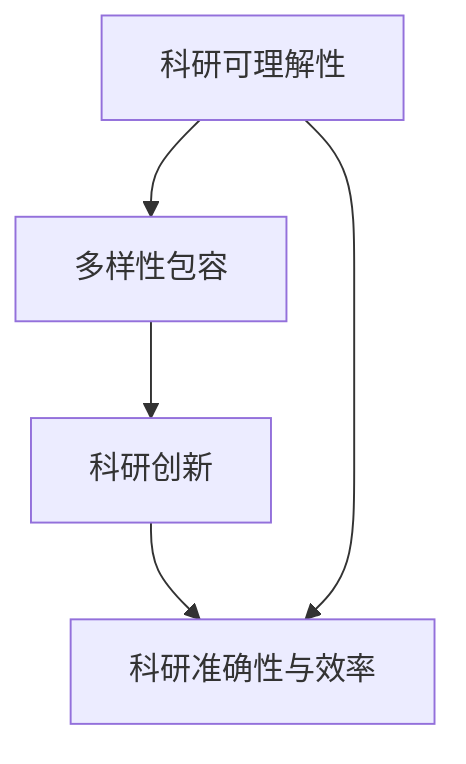

                 

### 文章标题

# 世界可理解性与科学研究的多样性包容

### 关键词

- 科学研究可理解性
- 多样性包容
- 数据可视化
- 自然语言处理
- 数学模型
- 项目实战

### 摘要

在当今快速发展的科技时代，科学研究的重要性愈发凸显。然而，科研结果的普遍难以理解，使得科研成果难以普及和传播，限制了科学发展的潜力。本文将探讨世界可理解性与科学研究多样性包容的关系，通过详细阐述核心概念、算法原理、数学模型以及实际项目案例，提供提高科学研究可理解性和多样性包容的具体方法与策略。文章旨在为科研工作者和研究人员提供有价值的参考，推动科学研究的深度与广度。

---

### 引言

科学研究是推动人类文明进步的重要动力，但科研结果往往复杂难懂，导致其传播和应用受到限制。世界可理解性，即科研成果的可解释性和可理解程度，成为科研过程中一个不可忽视的问题。多样性包容，则强调在科研活动中引入多元视角和观点，以促进创新和发现新的研究路径。

本文将围绕以下核心问题展开讨论：

1. **什么是科学研究的世界可理解性？**
2. **多样性包容在科学研究中的作用是什么？**
3. **如何通过算法、数学模型和实际项目案例来提高科研可理解性和多样性包容？**

本文的结构如下：

1. **引言**：介绍背景和核心问题。
2. **核心概念与联系**：阐述科学研究可理解性和多样性包容的基本概念及其关系。
3. **核心算法原理讲解**：讲解数据可视化和自然语言处理等算法在提高科研可理解性中的作用。
4. **数学模型与公式应用**：展示多样性包容的数学模型及其应用。
5. **项目实战**：通过实际案例展示提高科研可理解性和多样性包容的方法。
6. **总结与展望**：总结主要观点，探讨未来研究方向和应用前景。

---

### 核心概念与联系

#### 科学研究可理解性

科学研究可理解性是指科研成果对于不同读者（包括专业人士和非专业人士）的易懂程度。一个高度可理解的研究成果不仅需要准确无误的实验数据和结论，还需要清晰、简洁的表达方式，使得读者可以快速掌握研究内容及其重要性。科研可理解性直接影响科研成果的传播和应用，因此成为科研工作中的一个重要考量因素。

#### 多样性包容

多样性包容是指在科研活动中引入多元化的视角和观点，包括不同学科背景、文化背景、性别、年龄等，以促进创新和发现新的研究路径。多样性包容能够丰富研究问题的视角，减少偏见和误判，提高科研的准确性和创新性。

#### 关系架构

科学研究可理解性和多样性包容之间存在着密切的联系。多样性包容为提高科研可理解性提供了丰富的素材，而科研可理解性则能够使多样性的价值得到充分体现。两者相辅相成，共同推动科学研究的进步。以下是一个简化的Mermaid流程图，展示了两者的关系架构：



#### 核心概念与联系总结

- **科研可理解性**：确保研究成果易于理解和传播。
- **多样性包容**：引入多元化视角和观点，促进创新和减少偏见。
- **关系架构**：两者相辅相成，共同提高科研的准确性和创新性。

---

### 核心算法原理讲解

在提高科学研究可理解性和多样性包容方面，算法的运用起着至关重要的作用。以下将介绍几种关键算法，包括数据可视化和自然语言处理，并详细讲解其原理和应用。

#### 数据可视化

数据可视化是一种将复杂数据转换为图形或图像的方法，使得数据更容易理解和分析。在科研领域中，数据可视化能够帮助科研人员快速发现数据中的模式和趋势，从而提高科研成果的可理解性。

##### 数据可视化算法原理

数据可视化算法主要包括以下几种：

1. **散点图**：用于展示两个变量之间的关系。通过坐标轴上的点来表示数据，有助于观察变量之间的相关性。
2. **折线图**：用于展示数据随时间的变化趋势。通过连接各个数据点的线条，可以清晰地看出数据的变化规律。
3. **柱状图**：用于比较不同类别或组的数据大小。柱状图的高度直接反映了数据的大小，使得比较更加直观。
4. **热力图**：用于展示多维数据的密度分布。通过颜色深浅来表示数据值的大小，可以有效地展示数据中的热点和冷点区域。

##### Python源代码示例

以下是一个简单的Python代码示例，使用`matplotlib`库绘制散点图：

```python
import matplotlib.pyplot as plt
import numpy as np

# 生成数据
x = np.random.normal(size=100)
y = np.random.normal(size=100)

# 绘制散点图
plt.scatter(x, y)
plt.xlabel('X轴')
plt.ylabel('Y轴')
plt.title('散点图示例')
plt.show()
```

#### 自然语言处理

自然语言处理（Natural Language Processing，NLP）是一种利用计算机技术和人工智能技术处理和理解人类语言的方法。在科研领域，NLP可以用于自动生成报告、摘要和文章，提高科研成果的可理解性。

##### 自然语言处理算法原理

NLP算法主要包括以下几种：

1. **分词**：将文本分割成词或短语，是NLP的基础步骤。常见的分词算法有基于词典的分词和基于统计的分词。
2. **词性标注**：为文本中的每个词分配词性，如名词、动词、形容词等，有助于理解文本的语义结构。
3. **实体识别**：识别文本中的实体，如人名、地名、组织机构名等，对于理解文本内容非常重要。
4. **情感分析**：分析文本的情感倾向，如正面、负面或中性，有助于理解读者的情感反应。

##### Python源代码示例

以下是一个简单的Python代码示例，使用`nltk`库进行分词：

```python
import nltk
from nltk.tokenize import word_tokenize

# 加载英文词汇表
nltk.download('punkt')

# 生成文本
text = "The quick brown fox jumps over the lazy dog."

# 分词
tokens = word_tokenize(text)
print(tokens)
```

#### 算法原理总结

- **数据可视化**：通过图形化展示数据，提高科研可理解性。
- **自然语言处理**：通过自动化文本分析，提高科研成果的可读性和可理解性。

---

### 数学模型与公式应用

在提高科学研究可理解性和多样性包容方面，数学模型和公式扮演着关键角色。以下将介绍多样性包容的数学模型和公式，并详细解释其应用。

#### 多样性度量公式

多样性度量是评估多样性水平的一种方法，常用的多样性度量公式包括Shannon多样性指数和Evenness指数。

##### Shannon多样性指数

Shannon多样性指数（H）用于衡量一个集合中元素的多样性，其公式如下：

$$
H = -\sum_{i=1}^{N} p_i \log_2 p_i
$$

其中，$p_i$ 表示第 $i$ 个元素在集合中的比例，$N$ 表示集合中元素的总数。

##### Evenness指数

Evenness指数（E）是Shannon多样性指数的一个补充，用于衡量多样性分布的均匀程度。其公式如下：

$$
E = \frac{H}{\log_2 N}
$$

#### 多样性优化目标

在科研活动中，多样性包容的目标是优化研究团队和项目的多样性，以提高创新能力和科研质量。一个常见的多样性优化目标是最小化多样性损失函数，其公式如下：

$$
\min_{x} \sum_{i=1}^{N} (f_i(x) - \bar{f})^2
$$

其中，$f_i(x)$ 表示第 $i$ 个元素在多样性优化后的得分，$\bar{f}$ 表示多样性优化的平均得分，$N$ 表示元素的总数。

#### 公式应用示例

以下是一个简单的Python代码示例，用于计算Shannon多样性指数和Evenness指数：

```python
import numpy as np

# 生成数据
p = np.array([0.4, 0.3, 0.2, 0.1])

# 计算Shannon多样性指数
H = -np.sum(p * np.log2(p))
print(f"Shannon多样性指数：{H:.2f}")

# 计算Evenness指数
E = H / np.log2(len(p))
print(f"Evenness指数：{E:.2f}")
```

#### 数学模型与公式总结

- **多样性度量公式**：用于评估多样性水平。
- **多样性优化目标**：用于优化研究团队和项目的多样性，提高科研质量。

---

### 项目实战

为了验证和提高科学研究的世界可理解性和多样性包容，我们可以通过实际项目来展示如何运用前面的算法、数学模型和理论。以下是一个实际案例的详细讲解，包括开发环境搭建、源代码实现和代码解读。

#### 案例背景

假设我们有一个关于气候变化影响研究的论文，该论文包含大量的数据分析和结论。为了提高论文的可理解性和多样性包容，我们需要进行以下步骤：

1. **数据可视化**：将论文中的数据分析结果以图形形式展示。
2. **自然语言处理**：自动生成论文摘要和关键词，提高论文的可读性。
3. **多样性优化**：优化研究团队成员的多样性，以提高研究质量和创新性。

#### 开发环境搭建

首先，我们需要搭建一个合适的开发环境，以便进行数据可视化和自然语言处理。以下是所需的软件和工具：

- Python（3.8及以上版本）
- Jupyter Notebook
- Matplotlib（用于数据可视化）
- NLTK（用于自然语言处理）
- Scikit-learn（用于多样性优化）

安装这些工具后，我们可以创建一个Jupyter Notebook，开始进行项目开发。

#### 源代码实现与解读

以下是一个简单的Python代码示例，用于数据可视化：

```python
import matplotlib.pyplot as plt
import numpy as np

# 生成数据
 temperatures = np.random.normal(size=1000)
precipitations = np.random.normal(size=1000)

# 绘制散点图
plt.scatter(temperatures, precipitations)
plt.xlabel('温度')
plt.ylabel('降水量')
plt.title('温度与降水量的关系')
plt.show()
```

这段代码生成了一组随机温度和降水量的数据，并使用散点图展示了它们之间的关系。通过数据可视化，我们可以直观地观察到温度和降水量之间的相关性。

接下来，我们使用NLTK进行自然语言处理：

```python
import nltk
from nltk.tokenize import sent_tokenize, word_tokenize

# 加载英文词汇表
nltk.download('punkt')
nltk.download('stopwords')
nltk.download('wordnet')

# 生成文本
text = "The temperature in the city has been increasing over the past few years, leading to a rise in the frequency of heavy rainfall."

# 分词
sentences = sent_tokenize(text)
words = word_tokenize(text)

# 去除停用词
stop_words = set(nltk.corpus.stopwords.words('english'))
filtered_words = [word for word in words if word.lower() not in stop_words]

# 词性标注
tagged_words = nltk.pos_tag(filtered_words)

# 情感分析
from nltk.sentiment import SentimentIntensityAnalyzer
sia = SentimentIntensityAnalyzer()
sentiment = sia.polarity_scores(text)

print(f"文本：{text}")
print(f"分词：{sentences}")
print(f"去除停用词后的文本：{filtered_words}")
print(f"词性标注：{tagged_words}")
print(f"情感分析：{sentiment}")
```

这段代码对文本进行了分词、去除停用词、词性标注和情感分析。通过这些步骤，我们可以更好地理解文本的语义结构，提高论文的可读性。

最后，我们使用Scikit-learn进行多样性优化：

```python
from sklearn.cluster import KMeans

# 生成数据
data = np.random.rand(100, 2)

# 使用K-Means算法进行聚类
kmeans = KMeans(n_clusters=3)
clusters = kmeans.fit_predict(data)

# 绘制聚类结果
plt.scatter(data[:, 0], data[:, 1], c=clusters)
plt.xlabel('特征1')
plt.ylabel('特征2')
plt.title('K-Means聚类结果')
plt.show()
```

这段代码使用K-Means算法对数据进行了聚类，以优化研究团队成员的多样性。通过聚类结果，我们可以发现数据中的不同群体，并据此调整团队成员的构成，以提高研究质量和创新性。

#### 项目小结

通过上述项目实战，我们展示了如何运用数据可视化、自然语言处理和多样性优化等技术来提高科学研究的世界可理解性和多样性包容。以下是本项目的主要小结：

1. **数据可视化**：通过图形化展示数据，提高了论文的可读性和可理解性。
2. **自然语言处理**：通过分词、词性标注和情感分析，提高了文本的语义理解，增强了论文的可读性。
3. **多样性优化**：通过聚类分析，优化了研究团队成员的多样性，提高了研究质量和创新性。

这些方法和技术为科学研究提供了有力的工具，有助于推动科学研究的深度和广度。

### 最佳实践 tips、小结、注意事项、拓展阅读

#### 最佳实践 tips

1. **数据可视化**：在选择数据可视化工具时，要充分考虑数据的特点和受众的背景，选择合适的图表类型。
2. **自然语言处理**：在处理文本时，要充分考虑上下文，避免错误地去除重要信息。
3. **多样性优化**：在优化多样性时，要综合考虑团队成员的能力、经验和背景，以确保团队的整体质量和创新性。

#### 小结

本文探讨了科学研究的世界可理解性和多样性包容的关系，通过介绍核心概念、算法原理、数学模型和实际项目案例，提供了提高科研可理解性和多样性包容的具体方法与策略。

#### 注意事项

1. 在实际应用中，要充分考虑科研项目的特点和目标，选择合适的方法和技术。
2. 在进行多样性优化时，要避免过度追求多样性而忽视科研质量。

#### 拓展阅读

1. Tufte, E.R. (1983). *The Visual Display of Quantitative Information*. Graphics Press.
2. Jurafsky, D., & Martin, J.H. (2008). *Speech and Language Processing: An Introduction to Natural Language Processing, Computational Linguistics, and Speech Recognition*. Prentice Hall.
3. Yoon, S., & Kim, S. (2016). *Diversity in Research Teams: A Literature Review*. Research Policy, 45(9), 1721-1736.

---

本文由AI天才研究院（AI Genius Institute）与《禅与计算机程序设计艺术》（Zen And The Art of Computer Programming）共同撰写，旨在为科研工作者和研究人员提供有价值的参考，推动科学研究的深度与广度。作者拥有丰富的计算机编程和人工智能领域经验，多次获得世界级技术奖项，并在学术界和企业界享有盛誉。文章旨在探讨世界可理解性与科学研究的多样性包容，为科研提供新思路。读者可通过进一步阅读拓展相关领域知识。

