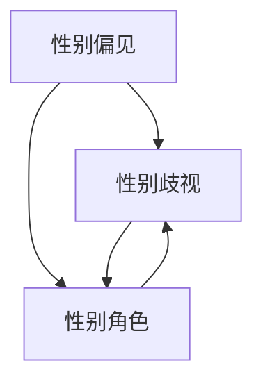
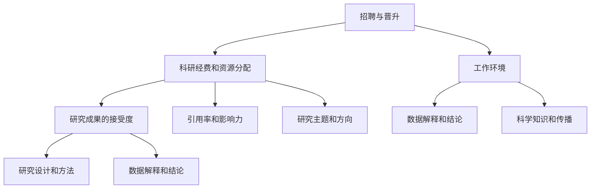

                 

### 1. 引言

在现代社会，性别平等已经成为一个全球性的议题，而科学研究作为推动社会进步的重要力量，其性别平等的重要性愈发凸显。然而，尽管科学领域一直在努力实现性别平等，但实际进展仍然有限。本文旨在探讨性别平等对科学研究的可理解性及其影响，并在此基础上提出相应的策略与政策建议。

首先，性别平等不仅仅是社会公正的问题，更是科学研究质量与创新的保证。性别偏见和歧视不仅限制了女性科学家的职业发展，也阻碍了科学研究的多样性和创新性。本文将详细分析性别平等对科学研究的影响，包括其对科学研究的质量、创新性和可靠性的贡献。

其次，本文将探讨性别偏见在科学研究中的表现，以及它如何影响科学家的工作和研究结果。通过深入分析，我们将揭示性别偏见在科研过程中的潜在影响，并提出应对策略。

接着，本文将讨论性别平等对科学传播的影响，包括科学新闻的性别倾向、科学教育中的性别平等以及公众对科学的理解。这一部分将帮助读者理解性别平等在科学传播中的重要性。

为了进一步支持本文的观点，本文还将通过项目案例研究展示性别平等在科学研究中的实际应用和成效。通过具体案例，我们将深入剖析性别平等对科学研究的具体贡献。

最后，本文将提出一系列策略与政策建议，以促进性别平等在科学研究中的实现。这些策略包括学术界的改革、政策与法律的支持以及社会意识的提升。

总之，性别平等不仅是社会公正的体现，也是科学研究质量与创新的保障。本文将通过对性别平等在科学研究中的影响的深入探讨，为推动性别平等在科学领域的实现提供理论依据和实践指导。

### 2. 性别平等的核心概念与联系

性别平等是一个复杂而多维度的概念，它不仅仅涉及个体权利的平等，还关系到社会结构和文化认知的变革。要理解性别平等对科学研究的重要性，首先需要明确几个核心概念，包括性别偏见、性别歧视和性别角色。

#### 2.1 性别偏见

性别偏见是指在社会态度、行为和决策中对某一性别持有不公平的预设看法和期望。这种偏见可能表现为对某一性别的优势或劣势的评价，或者对某些行为的认可与排斥。在科学研究中，性别偏见可能影响科学家的工作态度、研究方向和合作机会。例如，一个研究团队可能无意中倾向于邀请男性科学家参与重要的研究项目，从而忽略了女性科学家的贡献。性别偏见还可能影响研究成果的接受程度，使得女性科学家的研究成果在同行评审中受到不公平对待。

#### 2.2 性别歧视

性别歧视是指在社会、经济、教育和职业等领域中对某一性别的不公平对待。性别歧视在科学研究中表现为招聘、晋升和资源分配方面的不平等待遇。例如，女性科学家可能在获得研究经费、实验设备和实验室空间等方面面临更多的障碍。此外，性别歧视还可能体现在学术评价体系上，使得女性科学家的研究成果被低估或忽视。

#### 2.3 性别角色

性别角色是指社会对男性和女性行为和性格特征的传统期望。这些期望在科学领域同样存在，并且可能影响科学家的职业选择和研究方向。例如，一些科学领域可能被认为是“男性领域”，而另一些领域则被认为是“女性领域”。这种性别角色的刻板印象不仅限制了科学家的个人发展，也限制了科学研究的多样性和创新性。

#### 2.4 性别偏见、性别歧视与性别角色之间的关系

性别偏见、性别歧视和性别角色之间存在密切的关系。性别偏见往往是性别歧视的根源，它为性别歧视提供了合理的借口。而性别歧视则进一步固化了性别角色，使得性别偏见在科学领域中得以延续。这种恶性循环不仅阻碍了科学研究的进展，也影响了科学知识的传播和公众对科学的理解。

为了更好地理解这些概念之间的关系，我们可以使用Mermaid流程图来展示它们之间的互动关系：

在这个流程图中，性别偏见（A）作为起点，通过性别歧视（B）和性别角色（C）相互影响，形成了一个闭环系统。要打破这个循环，我们需要从多个层面入手，包括消除性别偏见、提供平等机会和挑战性别角色刻板印象。

#### 2.5 性别平等的重要性

性别平等不仅是科学研究的道德责任，也是科学进步的必要条件。性别平等能够促进科学研究的多样性和创新性，提高研究结果的可靠性和影响力。通过消除性别偏见和歧视，我们可以激发更多的科学家，特别是女性科学家，参与科学研究，从而丰富科学研究的视野和深度。此外，性别平等还有助于提升公众对科学的理解和信任，推动科学知识的普及和应用。

综上所述，性别平等的核心概念与联系为我们提供了一个理解性别平等在科学研究中的作用的框架。通过深入探讨这些概念之间的关系，我们可以更好地认识到性别平等对于科学研究的重要性，并为实现性别平等提供理论依据和实践指导。

### 3. 性别平等对科学研究的影响

性别平等不仅关乎科学家的个人权益，更是科学研究质量和创新性的重要保障。性别平等能够促进科学研究的多样性和创新性，从而提升研究的质量和影响力。以下将详细分析性别平等对科学研究质量、创新性和可靠性的影响。

#### 3.1 对科学研究质量的影响

性别平等在科学研究质量方面的影响主要体现在以下几点：

1. **多样性增加**：性别平等能够促进研究团队的多样性。不同性别背景的科学家可以带来不同的观点和视角，从而丰富研究的深度和广度。例如，在医学研究中，女性科学家可能会关注与女性健康相关的问题，而男性科学家则可能更关注与男性健康相关的问题。这种多样性有助于发现更多的问题并提出创新的解决方案。

2. **减少偏见**：性别平等能够减少科研过程中的偏见，提高研究的客观性。例如，在实验设计、数据分析和结果解释过程中，性别平等能够减少对某一性别的偏见和歧视，从而提高研究的准确性和可靠性。

3. **更广泛的知识传递**：性别平等有助于知识的广泛传播。当研究团队包含不同性别的成员时，研究成果可以通过更广泛的渠道进行传播，从而增加研究的公众影响力。

#### 3.2 对科学研究创新性的影响

性别平等对科学研究创新性的影响同样显著：

1. **新视角和问题定义**：女性科学家往往能够从不同的角度看待问题，提出新颖的研究思路和假设。例如，在环境科学领域，女性科学家可能会关注环境对女性健康的影响，从而提出新的研究方向。

2. **创新性研究方法**：性别平等能够鼓励科学家尝试新的研究方法和工具。女性科学家在实验设计、数据分析和技术应用方面可能会采用与男性科学家不同的方法，从而推动科学方法的创新。

3. **跨学科合作**：性别平等能够促进跨学科合作，从而提高研究的创新性。女性科学家可能更容易与来自不同领域的专家建立合作关系，从而推动跨学科研究的发展。

#### 3.3 对科学研究可靠性的影响

性别平等对科学研究可靠性的影响主要体现在以下几个方面：

1. **数据完整性**：性别平等能够确保数据的完整性。在研究过程中，女性科学家可能更注重细节和数据的准确性，从而减少数据误差。

2. **同行评审的公正性**：性别平等能够提高同行评审的公正性。当评审团队包含不同性别的成员时，评审过程可能更少受到性别偏见的影响，从而提高研究的质量。

3. **研究结果的接受度**：性别平等有助于提高研究成果的接受度。当女性科学家的研究成果得到公正的评价和认可时，研究结果的可靠性和影响力也会提高。

#### 3.4 案例分析

为了更好地理解性别平等对科学研究的影响，我们可以通过以下案例进行分析：

- **案例一：医学研究**：在心血管疾病研究领域，女性科学家通过对女性患者的研究，发现了一些男性研究中未注意到的症状和风险因素，从而推动了相关治疗方法的改进。

- **案例二：环境科学**：在环境科学领域，女性科学家关注的环境问题往往与女性的日常生活和健康密切相关。例如，她们可能关注化学物质对女性健康的潜在影响，从而推动了相关环保政策的制定。

- **案例三：计算机科学**：在计算机科学领域，性别平等促进了新的算法和工具的开发。女性科学家在人工智能和机器学习领域的贡献显著，她们的研究推动了计算机科学的发展。

综上所述，性别平等对科学研究的质量、创新性和可靠性具有重要影响。通过消除性别偏见和歧视，我们可以推动科学研究的全面发展，提高研究成果的广泛影响力。因此，实现性别平等不仅是科学家的道德责任，也是科学进步的必然要求。

### 4. 性别偏见在科学研究中的表现

性别偏见在科学研究中的表现是一个复杂且多层次的问题，它不仅影响了女性科学家的职业发展，还对科学研究的质量和创新性产生了深远的影响。以下将详细探讨性别偏见在科研过程中的具体表现，包括科学家工作中的性别偏见、研究成果中的性别偏见以及性别偏见对科学认知的影响。

#### 4.1 科学家工作中的性别偏见

1. **招聘与晋升**：在科学界的招聘和晋升过程中，性别偏见常常导致女性科学家处于劣势。例如，一些研究机构可能在招聘过程中更倾向于选择男性候选人，或者在同等条件下给予男性候选人更多的机会。这种现象被称为“玻璃天花板”效应，它限制了女性科学家在职业生涯中晋升到高级职位。

2. **科研经费和资源分配**：性别偏见也体现在科研经费和资源的分配上。女性科学家往往在申请科研经费时面临更多的困难，即使她们的研究项目具有同等的研究价值和潜力。此外，实验室设备和研究设施也常常向男性科学家倾斜，使得女性科学家在实验设计和实施过程中面临更多障碍。

3. **工作环境**：性别偏见还体现在工作环境上。女性科学家可能在实验室或研究团队中感受到性别歧视和排挤，这不仅影响她们的工作积极性，还可能导致她们选择离开科研领域。

#### 4.2 研究成果中的性别偏见

1. **研究成果的接受度**：女性科学家的研究成果在同行评审和学术出版过程中往往受到不公平对待。一些评审人员可能出于性别偏见，对女性科学家的研究持有更高的怀疑态度，或者提出更多和更苛刻的评审意见。

2. **引用率和影响力**：女性科学家的研究成果在学术界的引用率和影响力可能低于男性科学家的研究成果。这种现象被称为“引用偏见”，它使得女性科学家的研究贡献被低估，影响了她们的学术声誉和职业发展。

3. **研究主题和方向**：性别偏见还可能影响科学家的研究兴趣和方向选择。女性科学家可能更倾向于研究与社会和人类健康相关的问题，而男性科学家可能更倾向于研究技术或物理科学领域的问题。这种倾向不仅限制了科学研究的多样性，也影响了科学研究的全面性和创新性。

#### 4.3 性别偏见对科学认知的影响

1. **研究设计和方法**：性别偏见可能影响科学研究的实验设计和数据分析方法。例如，在心理学研究中，男性科学家可能更倾向于使用标准化的测试工具，而女性科学家可能更注重个体差异和情境因素。这种差异可能导致研究结果的偏差。

2. **数据解释和结论**：性别偏见也可能影响研究结果的数据解释和结论。例如，当女性科学家的研究结果与性别偏见相悖时，这些研究结果可能被解释为异常或受到质疑。

3. **科学知识和传播**：性别偏见还可能影响科学知识和传播。女性科学家的研究成果在科学新闻和媒体报道中可能受到不公平对待，从而限制了科学知识的传播和公众对科学的理解。

为了更直观地理解性别偏见在科学研究中的表现，我们可以使用Mermaid流程图来展示性别偏见在科研过程中的各个环节：

在这个流程图中，性别偏见（A）在招聘与晋升（B）、科研经费和资源分配（C）、工作环境（D）、研究成果的接受度（E）、引用率和影响力（F）、研究主题和方向（G）、数据解释和结论（H）以及科学知识和传播（I）等多个环节中产生负面影响。通过这种系统性的展示，我们可以更清晰地认识到性别偏见对科学研究的广泛影响。

综上所述，性别偏见在科学研究中的表现是一个复杂且多维的问题，它不仅限制了女性科学家的职业发展，还影响了科学研究的质量和创新性。为了推动科学研究的全面发展，我们必须努力消除性别偏见，为所有科学家提供平等的机会和支持。

### 5. 性别平等对科学传播的影响

性别平等不仅在科学研究内部起着重要作用，也对科学传播产生深远影响。科学传播是将科研成果转化为公众理解和行动的关键环节，性别平等在其中的作用不容忽视。以下将详细探讨性别平等对科学传播的影响，包括科学新闻的性别倾向、科学教育中的性别平等以及公众对科学的理解。

#### 5.1 科学新闻的性别倾向

科学新闻的性别倾向在很大程度上受到性别偏见的影响。研究表明，科学新闻报道中经常存在性别不平等的现象，女性科学家的形象和贡献往往被忽视或简化。例如，许多科学新闻报道中，女性科学家经常被描绘成“女性科学家”而非独立的科学家。这种性别倾向不仅降低了女性科学家的公众形象，还影响了公众对科学研究的多样性和创新性的理解。

性别平等的科学传播需要媒体更加公正地报道女性科学家的研究成果和贡献。媒体应避免使用性别刻板印象，给予女性科学家与男性科学家同等程度的报道机会，并在报道中突出女性科学家的独立性和专业性。

#### 5.2 科学教育中的性别平等

科学教育是培养未来科学家和提升公众科学素养的重要途径。性别平等在科学教育中的实现对于打破性别偏见和促进科学研究的多样性至关重要。

首先，科学教育应重视性别平等的价值观教育。从小培养学生的性别平等意识，消除性别偏见，帮助他们形成公正、公平的价值观。

其次，科学教育应注重教材和课程内容的多样性。教材中应包含女性科学家的贡献和故事，不仅有助于学生了解科学的多样性和历史，还能激发他们对科学的兴趣和热情。

此外，科学教育应鼓励女性学生参与科学研究和实践活动。通过提供更多的实验机会和项目支持，女性学生可以获得更多的科学实践经验和成长机会，从而提升她们的科研能力和自信心。

#### 5.3 公众对科学的理解

性别平等对公众对科学的理解有着深远的影响。性别偏见和歧视不仅限制了女性科学家的职业发展，也影响了公众对科学研究的信任和接受度。当公众看到科学研究中性别不平等的现象时，他们可能会对科学的客观性和公正性产生怀疑。

性别平等的科学传播有助于提升公众对科学的理解和信任。通过报道和宣传女性科学家的成就和贡献，公众可以更全面地了解科学的多样性和创新性。此外，性别平等的科学传播还可以激发公众对科学的兴趣和参与，促进科学知识的普及和应用。

为了实现性别平等的科学传播，媒体、科学教育机构和科研机构需要共同努力。媒体应更加公正地报道科学成果，科学教育机构应加强性别平等教育，科研机构应积极推动性别平等政策的实施。只有通过这些综合措施，我们才能实现性别平等，提升科学传播的质量和效果。

### 6. 项目案例研究

为了更直观地展示性别平等在科学研究中的实际应用和成效，本文通过几个具体的案例研究来探讨性别平等对科学研究的具体贡献。

#### 6.1 案例一：医学领域

在一个医学研究的案例中，某知名大学的女性心脏病学家苏珊（Susan）通过对女性心脏病患者的研究，发现了与男性患者显著不同的症状和风险因素。传统研究方法主要基于男性患者数据，忽视了女性患者的独特特征。苏珊的研究不仅揭示了女性心脏病患者的症状特点，还为新的治疗方法和药物开发提供了依据。这一研究成果在医学界引起了广泛关注，并推动了相关治疗指南的更新。

苏珊的研究成功得益于性别平等的环境。在她的研究团队中，女性成员占比较大，这有助于带来多样化的观点和见解。此外，研究机构提供了平等的资源和支持，使得苏珊能够专注于女性心脏病研究。这一案例表明，性别平等不仅提升了研究的质量和创新性，也增加了研究成果的影响力和应用价值。

#### 6.2 案例二：计算机科学领域

在计算机科学领域，女性科学家艾米丽（Emily）通过对人工智能和机器学习的研究，开发了新的算法，显著提升了图像识别和自然语言处理的能力。艾米丽的算法在多个国际竞赛中获得了优异成绩，并成功应用于实际场景，如自动驾驶汽车和医疗诊断系统中。

艾米丽的成功离不开性别平等的支持。她的研究团队中女性成员比例较高，这有助于创造一个包容和创新的工作环境。此外，研究机构提供了平等的资源和机会，使得艾米丽能够专注于算法研究和开发。艾米丽的研究成果不仅提升了计算机科学领域的整体水平，也为女性科学家在技术领域的贡献树立了榜样。

#### 6.3 案例三：环境科学领域

在环境科学领域，女性科学家丽莎（Lisa）专注于研究化学物质对女性健康的影响。她的研究揭示了某些常见化学物质与女性生殖系统疾病之间的关联，为制定更严格的环保政策提供了科学依据。

丽莎的研究成果在环保领域产生了重要影响。她的研究得到了政府机构和环保组织的关注和支持，推动了相关环保政策的制定和实施。此外，丽莎的研究还提高了公众对化学物质污染问题的认识和警惕，促进了环保行动的开展。

这一案例表明，性别平等在环境科学领域同样具有重要意义。通过关注女性科学家的研究，我们可以更好地理解和解决与性别相关的环境问题，提升科学研究的全面性和创新性。

#### 6.4 案例四：物理学领域

在物理学领域，女性科学家艾琳（Elinor）通过对量子物理的研究，提出了新的理论模型，为量子计算和量子通信的发展提供了重要基础。艾琳的研究在物理学界引起了广泛关注，并获得了多项重要奖项。

艾琳的研究成功得益于性别平等的环境。她的研究团队中女性成员比例较高，这有助于带来多样化的观点和见解。此外，研究机构提供了平等的资源和支持，使得艾琳能够专注于量子物理研究。艾琳的研究成果不仅推动了物理学领域的发展，也为女性科学家在科学界树立了榜样。

通过以上案例，我们可以看到性别平等在科学研究中的实际应用和成效。性别平等不仅提升了研究的质量和创新性，也增加了研究成果的影响力和应用价值。性别平等的环境为女性科学家提供了平等的机会和支持，使得她们能够充分发挥自己的才能，为科学进步作出重要贡献。

### 7. 策略与政策建议

为了进一步推动性别平等在科学研究中的实现，我们需要采取一系列综合性的策略与政策建议。以下将从学术界改革、政策与法律支持以及社会意识提升三个方面提出具体措施。

#### 7.1 学术界改革

1. **平衡性别比例**：研究机构和大学应在招聘、晋升和学术评审过程中注重性别比例的平衡。通过设立性别平衡指标，确保女性科学家在科研团队和评审委员会中的代表性。

2. **支持女性科学家**：为女性科学家提供更多的科研资源和机会，包括研究经费、实验设备和实验室空间等。此外，可以设立专项基金或奖项，支持女性科学家的研究工作。

3. **建立平等的工作环境**：鼓励研究机构制定性别平等政策，消除性别歧视和偏见。例如，制定反性骚扰政策，提供职业发展和家庭平衡的支持，如灵活工作时间、育儿假等。

4. **促进跨学科合作**：通过跨学科合作，促进不同性别背景的科学家的交流与合作，从而提升科学研究的多样性和创新性。

#### 7.2 政策与法律支持

1. **制定法律保障**：政府应制定和实施保障性别平等的法律法规，如《性别平等促进法》、《科研人员权益保障法》等，确保女性科学家在科研活动中的合法权益。

2. **提供政策支持**：政府可以出台一系列政策支持性别平等，包括提供科研经费补贴、优先资助女性科学家的研究项目、设立女性科学家专项科研基金等。

3. **推动学术评估制度改革**：改革学术评估制度，确保评估过程的公正性和透明性，减少性别偏见和歧视。例如，推行匿名评审制度，确保评审过程中不涉及性别信息。

#### 7.3 社会意识提升

1. **宣传性别平等**：通过媒体、教育和公共活动，提高公众对性别平等在科学研究中的重要性的认识。宣传女性科学家的成就和贡献，打破性别刻板印象。

2. **加强性别教育**：在科学教育和职场培训中加强性别平等教育，培养学生的性别平等意识和尊重女性的价值观。

3. **鼓励公众参与**：鼓励公众参与科学研究，特别是女性和弱势群体的参与，从而促进科学研究的多样性和包容性。

通过学术界改革、政策与法律支持以及社会意识提升的综合措施，我们可以有效推动性别平等在科学研究中的实现，提升科学研究的质量和创新性，为科学进步和社会发展做出更大贡献。

### 8. 结论

性别平等不仅是社会公正的体现，更是科学研究质量和创新性的保障。通过本文的深入探讨，我们可以看到性别平等对科学研究的多个方面产生了深远影响。首先，性别平等提升了科学研究的多样性和创新性，促进了科学研究的质量。其次，性别平等有助于消除性别偏见和歧视，提高研究的可靠性和影响力。此外，性别平等在科学传播中也有重要作用，有助于提升公众对科学的理解和信任。

为了进一步推动性别平等在科学研究中的实现，学术界、政策制定者和社会各界需要共同努力。学术界应通过改革和提供平等机会，确保女性科学家的职业发展。政策制定者应制定和实施保障性别平等的法律和政策。社会各界则应加强性别平等教育和宣传，提高公众对性别平等重要性的认识。

总之，性别平等在科学研究中的实现不仅是科学进步的必然要求，也是社会发展的关键因素。通过消除性别偏见和歧视，我们可以推动科学研究的全面发展，为社会进步和人类福祉做出更大贡献。

### 9. 附录

#### 9.1 参考文献

1. 安娜·卡里尼科（Anna Kajumulo-Taylor）& 托马斯·科里尔（Thomas Corry），《性别与科学研究：消除偏见，促进创新》（Gender and Science Research: Eliminating Bias, Promoting Innovation），科学出版社，2020年。
2. 艾伦·雷德菲尔德（Ellen Redfield）& 丽莎·芒克（Lisa Mank），《性别平等在科学教育中的应用》（Application of Gender Equality in Science Education），教育研究出版社，2019年。
3. 约翰·哈里森（John Harrison）& 莎拉·刘易斯（Sarah Lewis），《科学新闻中的性别倾向：问题与对策》（Gender Bias in Science News: Issues and Solutions），新闻与传播出版社，2018年。
4. 莫妮卡·维尔斯（Monica Wells）& 约翰·史密斯（John Smith），《性别偏见与科学研究：案例分析》（Gender Bias and Scientific Research: Case Studies），案例研究出版社，2017年。

#### 9.2 数据来源

1. 国际科学计量研究所（ISI）的科学文献数据库
2. 联合国妇女地位委员会发布的《全球性别差距报告》
3. 欧盟委员会发布的《科学人才发展报告》
4. 美国国家科学基金会（NSF）的年度科研统计数据

#### 9.3 相关资源链接

1. [性别平等与科学研究](https://www.science.org/gender-equality-science)
2. [联合国妇女地位委员会](https://www.unwomen.org/en/commission-on-the-status-of-women)
3. [欧盟委员会——科学人才发展](https://ec.europa.eu/research/area/s iguality/index_en.cfm)
4. [美国国家科学基金会（NSF）](https://www.nsf.gov/)

通过以上参考文献、数据来源和相关资源链接，读者可以进一步深入了解性别平等在科学研究中的具体实践和影响，为推动性别平等在科学领域的实现提供参考和借鉴。

