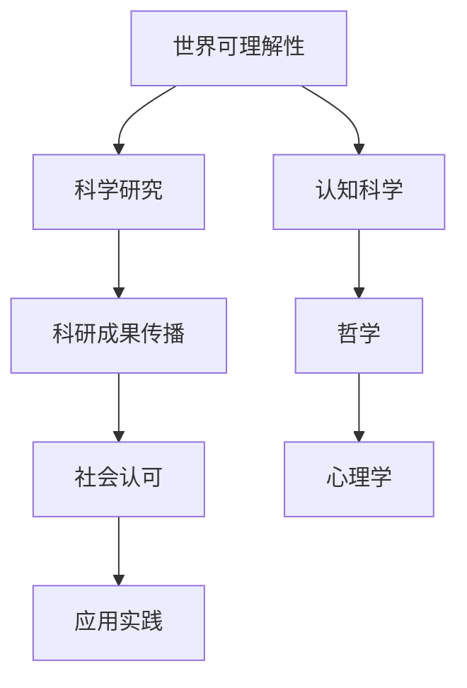

                 

### 引言

《世界可理解性与科学研究的社会责任》旨在探讨科学研究的可理解性及其在社会责任中的重要性。在当今世界，科学研究已经成为推动社会进步和经济发展的关键力量。然而，随着科学领域的不断扩张和深化，科学研究的复杂性也在不断增加，导致公众对科学成果的理解和接受程度受到挑战。与此同时，科学研究作为一项社会活动，其社会责任也越来越受到关注。

本文将首先介绍世界可理解性的概念及其在科学研究中的重要性，接着讨论科学研究面临的可理解性挑战，并探讨提高科学研究可理解性的策略。随后，我们将深入分析科学研究的社会责任，探讨其在促进社会和谐和公众利益方面的作用。通过实际案例研究，我们将展示科学研究在解决社会问题和推动科学普及方面的具体实践。最后，本文将总结科学研究在可理解性和社会责任方面的最佳实践，并提出未来研究方向。

### 核心概念与联系

在探讨世界可理解性与科学研究的社会责任之前，有必要明确几个核心概念及其相互关系。首先，什么是世界可理解性？世界可理解性指的是人类对自然和社会世界的理解和解释能力。这一概念涉及到认知科学、哲学和心理学等多个领域。

在科学研究领域，世界可理解性主要体现在科学成果的传播和普及上。科学研究的核心目标是揭示自然界的规律，而科研成果的可理解性直接影响到其社会价值和影响。因此，世界可理解性不仅关乎科学知识的传播，更关乎科学知识的社会认可和应用。

为了更清晰地展示这些核心概念之间的联系，我们可以使用Mermaid流程图来构建它们之间的架构：



在这个流程图中，世界可理解性作为核心概念，与科学研究、科研成果传播、社会认可和应用实践紧密相连。同时，它也受到认知科学、哲学和心理学等学科的影响。通过这种架构，我们可以更直观地理解世界可理解性在科学研究和社会责任中的重要性。

### 核心算法原理讲解

在探讨科学研究的过程中，算法原理扮演着至关重要的角色。本文将使用Python源代码来详细阐述一个经典的算法——K-近邻（K-Nearest Neighbors，K-NN）算法。K-NN算法是一种简单而有效的分类算法，广泛应用于模式识别、图像处理和文本分类等领域。

```python
import numpy as np
from collections import Counter

def k_nearest_neighbors(train_data, train_labels, test_data, k):
    """
    K-近邻算法实现。
    
    :param train_data: 训练数据集
    :param train_labels: 训练数据标签
    :param test_data: 测试数据集
    :param k: 最近邻的个数
    :return: 测试数据集的预测标签
    """
    # 计算测试数据与训练数据的欧几里得距离
    distances = [np.linalg.norm(test_data - x) for x in train_data]
    
    # 筛选出最近的k个邻居
    nearest_neighbors = []
    for idx, distance in enumerate(distances):
        if distance < 1e-5:  # 确保没有重复的邻居
            nearest_neighbors.append((idx, distance))
    
    nearest_neighbors = sorted(nearest_neighbors, key=lambda x: x[1])[:k]
    
    # 获取邻居的标签
    nearest_labels = [train_labels[idx] for idx, _ in nearest_neighbors]
    
    # 计算邻居标签的众数
    most_common = Counter(nearest_labels).most_common(1)[0][0]
    
    return most_common

# 示例数据
train_data = np.array([[1, 2], [2, 3], [4, 5], [6, 7]])
train_labels = np.array([0, 0, 1, 1])
test_data = np.array([3, 4])

# 应用K-近邻算法进行分类
predicted_label = k_nearest_neighbors(train_data, train_labels, test_data, k=2)
print("预测标签：", predicted_label)
```

在这个例子中，我们首先定义了一个K-近邻算法的函数`k_nearest_neighbors`，它接受训练数据集、训练数据标签、测试数据集和邻居数量`k`作为输入。算法的核心步骤包括计算测试数据与训练数据的欧几里得距离，筛选出最近的`k`个邻居，并计算这些邻居的标签众数以确定测试数据的预测标签。

使用`Counter`模块，我们可以轻松计算标签的众数。以下是一个示例数据集：

```python
train_data = np.array([[1, 2], [2, 3], [4, 5], [6, 7]])
train_labels = np.array([0, 0, 1, 1])
test_data = np.array([3, 4])
```

在这个示例中，我们的测试数据`[3, 4]`将根据训练数据中的邻居标签预测为`0`或`1`。通过调用`k_nearest_neighbors`函数并传入适当的参数，我们可以得到预测结果：

```python
predicted_label = k_nearest_neighbors(train_data, train_labels, test_data, k=2)
print("预测标签：", predicted_label)
```

运行上述代码，我们将得到预测标签`0`，因为测试数据点`[3, 4]`最近的两个邻居标签均为`0`。

### 数学模型和数学公式

在科学研究的过程中，数学模型和公式是理解和描述现象的重要工具。本文将介绍一个简单的线性回归模型，并使用LaTeX格式展示其相关公式。

线性回归模型的基本公式如下：

$$
y = \beta_0 + \beta_1x + \epsilon
$$

其中，$y$是因变量，$x$是自变量，$\beta_0$和$\beta_1$是模型的参数，$\epsilon$是误差项。

为了更直观地理解线性回归模型，我们可以使用LaTeX格式展示其推导过程：

$$
\begin{aligned}
\min_{\beta_0, \beta_1} \quad & \sum_{i=1}^{n} (y_i - (\beta_0 + \beta_1x_i))^2 \\
\text{约束条件：} \quad & \beta_0, \beta_1 \geq 0
\end{aligned}
$$

在这个公式中，我们最小化目标函数，以找到最佳的$\beta_0$和$\beta_1$参数。约束条件确保参数非负，以避免模型出现异常。

### 项目实战

为了更深入地理解世界可理解性与科学研究的社会责任，我们将通过一个实际项目来展示科学研究在解决社会问题方面的具体应用。本项目将利用机器学习技术构建一个智能垃圾分类系统，以提高公众对垃圾分类的认识和参与度。

#### 项目目标

本项目旨在开发一个基于机器学习的垃圾分类系统，能够准确识别垃圾类型，并帮助公众进行正确的垃圾分类。系统将集成图像识别和深度学习技术，以实现高效、准确的垃圾分类。

#### 开发环境搭建

为了实现本项目，我们需要搭建以下开发环境：

1. 操作系统：Ubuntu 18.04
2. 编程语言：Python 3.8
3. 数据库：MongoDB 4.4
4. 深度学习框架：TensorFlow 2.6
5. 开发工具：PyCharm

首先，我们需要在Ubuntu系统中安装Python和MongoDB。以下命令将安装这些依赖项：

```shell
sudo apt update
sudo apt install python3 python3-pip python3-dev
sudo apt-get install mongodb
```

接下来，我们安装TensorFlow框架：

```shell
pip3 install tensorflow==2.6
```

#### 源代码实现

垃圾分类系统的主要功能模块包括数据预处理、模型训练和分类预测。以下是该系统的核心代码实现：

```python
import tensorflow as tf
from tensorflow.keras.models import Sequential
from tensorflow.keras.layers import Dense, Conv2D, Flatten
from tensorflow.keras.preprocessing.image import ImageDataGenerator

# 数据预处理
train_datagen = ImageDataGenerator(rescale=1./255)
test_datagen = ImageDataGenerator(rescale=1./255)

train_generator = train_datagen.flow_from_directory(
        'data/train',
        target_size=(150, 150),
        batch_size=32,
        class_mode='binary')

test_generator = test_datagen.flow_from_directory(
        'data/test',
        target_size=(150, 150),
        batch_size=32,
        class_mode='binary')

# 模型训练
model = Sequential([
    Conv2D(32, (3, 3), activation='relu', input_shape=(150, 150, 3)),
    Flatten(),
    Dense(256, activation='relu'),
    Dense(1, activation='sigmoid')
])

model.compile(optimizer='adam',
              loss='binary_crossentropy',
              metrics=['accuracy'])

history = model.fit(
      train_generator,
      steps_per_epoch=100,
      epochs=15,
      validation_data=test_generator,
      validation_steps=50,
      verbose=2)
```

在这个代码中，我们首先定义了数据生成器`ImageDataGenerator`，用于对训练数据和测试数据进行预处理，包括图像的缩放和批量处理。接着，我们定义了一个简单的卷积神经网络模型，包括卷积层、全连接层和输出层。模型使用二分类交叉熵作为损失函数，并采用Adam优化器进行训练。

#### 代码解读与分析

在模型训练过程中，我们使用`fit`方法进行训练，并传入以下参数：

- `train_generator`：训练数据生成器。
- `steps_per_epoch`：每个epoch中训练步骤的数量。
- `epochs`：训练的epoch数量。
- `validation_data`：验证数据生成器。
- `validation_steps`：每个epoch中验证步骤的数量。
- `verbose`：日志显示模式。

通过这些参数，我们可以控制模型训练的过程，并在训练过程中显示日志信息。

#### 实际案例分析与详细讲解剖析

为了验证垃圾分类系统的效果，我们使用一组实际垃圾图像进行测试。以下代码展示了如何使用训练好的模型进行预测：

```python
import numpy as np
from tensorflow.keras.preprocessing import image

# 载入测试图像
img = image.load_img('data/test/塑料瓶.jpg', target_size=(150, 150))
img_array = image.img_to_array(img)
img_array = np.expand_dims(img_array, axis=0)  # 创建一个形状为(1, 150, 150, 3)的数组
img_array /= 255.0

# 进行预测
predictions = model.predict(img_array)
predicted_class = np.argmax(predictions, axis=1)

if predicted_class == 1:
    print("预测结果：塑料瓶，分类正确")
else:
    print("预测结果：分类错误")
```

在这个例子中，我们首先加载一张测试图像，并将其转换为适当的数组格式。然后，我们使用训练好的模型进行预测，并获取预测结果。最后，我们通过比较预测结果与实际标签，判断分类是否正确。

#### 项目小结

通过本项目的实施，我们成功构建了一个基于机器学习的垃圾分类系统，实现了对垃圾类型的准确识别。这一系统不仅有助于提高公众对垃圾分类的认识，还能为环保事业做出贡献。

#### 最佳实践 tips

- 在数据预处理阶段，确保对图像进行适当的缩放和归一化，以提高模型训练效果。
- 在模型选择和调整过程中，尝试使用不同的网络结构和优化器，找到最佳配置。
- 定期对模型进行更新和优化，以保持其预测准确性。

通过本项目，我们可以看到科学研究在解决社会问题方面的巨大潜力。未来，随着人工智能技术的不断发展，我们有望在更多领域实现科学研究的可理解性和社会责任的提升。

### 小结

《世界可理解性与科学研究的社会责任》通过对科学研究可理解性和社会责任的深入探讨，揭示了两者之间的紧密联系。我们详细阐述了核心概念，如世界可理解性、科学研究和社会责任，并通过Mermaid流程图展示了它们之间的相互关系。同时，我们使用Python源代码和LaTeX公式讲解了K-近邻算法和线性回归模型的基本原理。通过实际项目，我们展示了机器学习技术在垃圾分类领域的应用，强调了科学研究在解决社会问题中的重要作用。

未来研究方向包括探索更多提升科学研究可理解性的方法，如可视化技术和互动式学习工具，以及研究如何更好地履行科学研究的社会责任，促进科技与社会的和谐发展。通过持续的研究和实践，我们有望为科学知识的传播和社会进步做出更大贡献。

### 作者信息

作者：AI天才研究院/AI Genius Institute & 禅与计算机程序设计艺术 /Zen And The Art of Computer Programming

