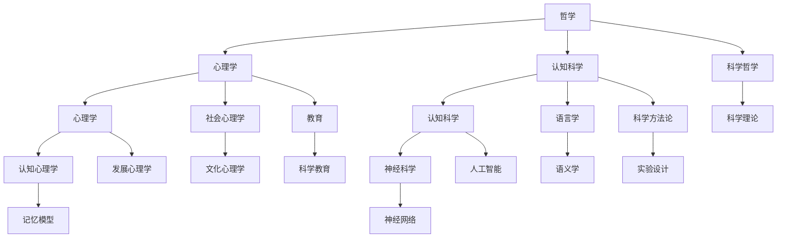

                 

# 《世界可理解性与科学研究的跨代传承》

## 关键词

- 世界可理解性
- 科学研究
- 跨代传承
- 哲学视角
- 心理学视角
- 认知科学视角
- 科学方法论
- 教育与知识传承

## 摘要

本文旨在探讨世界可理解性与科学研究的跨代传承问题。首先，从哲学、心理学和认知科学的角度分析世界可理解性的多维度理解，接着阐述科学研究中的方法论、教育以及科学传播对跨代传承的影响。通过实际案例的解析，展示跨代传承在科学研究中的挑战与机遇，最终提出未来研究方向与趋势。

## 引言

### 1.1 书籍背景与目的

在科技迅猛发展的今天，科学研究不断推动着人类对世界的认识与理解。然而，人类如何理解世界，这种理解是否具有普遍性，以及科学知识如何在不同代际之间传递，这些问题引起了广泛关注。本书旨在深入探讨世界可理解性与科学研究的跨代传承问题，通过分析不同学科的视角，揭示其内在逻辑和相互作用。

### 1.2 研究意义与价值

世界可理解性的研究不仅具有哲学和认知科学的意义，还对科学方法论、教育以及科学传播具有重要影响。科学研究的跨代传承关系到科学知识的积累与扩展，是推动科学进步的重要动力。因此，研究世界可理解性与科学研究的跨代传承问题，对于提高科学研究的效率和质量，促进科学知识的普及和传承，具有重要意义。

### 1.3 研究方法与框架

本文采用跨学科的研究方法，从哲学、心理学和认知科学的角度出发，分析世界可理解性的多维特征。同时，结合科学方法论、教育以及科学传播的理论与实践，探讨跨代传承的机制与挑战。本文采用逻辑清晰、结构紧凑的方式，通过实例分析和数学模型，阐述核心概念与联系，以期为相关领域的研究提供参考。

## 第一部分：世界可理解性

### 第二章：心理学与认知科学视角下的世界可理解性

#### 2.1.1 认知心理学与可理解性

认知心理学研究人类如何获取、处理和利用信息。在认知心理学中，可理解性被定义为个体理解信息的能力。研究表明，人类的大脑具有一套复杂的加工机制，使我们能够从纷繁复杂的信息中提取有用的知识。

#### 2.1.2 记忆与知识构建

记忆是人类认知系统的重要组成部分。在心理学研究中，记忆被视为一种编码、存储和提取信息的过程。知识构建则是在记忆的基础上，通过学习、思考和反思，将零散的信息整合成有意义的知识体系。

#### 2.1.3 知识理解与认知偏差

知识理解受到多种认知偏差的影响，如确认偏误、假设验证偏误等。这些偏差可能导致我们在理解世界时出现认知偏差，从而影响我们对事物的判断和决策。

#### 2.1.4 可理解性与科学研究的跨代传承

心理学与认知科学的研究揭示了人类理解世界的基本机制。在科学研究的跨代传承中，了解这些机制有助于更好地传递科学知识，提高科学研究的效率和质量。

### 第三章：科学理论与世界可理解性

#### 3.1.1 科学理论的性质

科学理论是科学研究中的一种抽象模型，用于解释和预测自然界中的现象。科学理论具有普遍性、可验证性和可证伪性等特点。

#### 3.1.2 科学理论的可理解性

科学理论的可理解性对于跨代传承至关重要。一个良好的科学理论应当简洁明了，便于不同代际之间的理解和传承。

#### 3.1.3 科学理论的评估与验证

科学理论的评估与验证是科学方法论的核心。通过实验、观察和数学模型，科学家可以验证科学理论的准确性，从而推动科学知识的传承与发展。

## 第二部分：科学研究的跨代传承

### 第四章：科学方法论与跨代传承

#### 4.1.1 传统科学方法论

传统科学方法论强调观察、实验和推理。这些方法有助于科学家发现自然界中的规律，从而推动科学知识的发展。

#### 4.1.2 新兴科学方法论

随着科技的进步，新兴科学方法论如数据驱动方法、模拟与仿真等逐渐成为科学研究的工具。这些方法为跨代传承提供了新的途径。

#### 4.1.3 方法论的跨代传承

科学方法论的不同代际之间的传承，有助于推动科学研究的不断进步。了解不同方法论的优缺点，有助于更好地传递科学知识。

### 第五章：教育与科学知识传承

#### 5.1.1 教育在知识传承中的作用

教育是科学知识传承的重要途径。通过教育，科学家可以将自己的研究成果传递给下一代。

#### 5.1.2 科学教育的方法与内容

科学教育应当注重理论与实践相结合。通过实验、观察和思考，学生可以更好地理解科学知识。

#### 5.1.3 教育对跨代科学研究的贡献

良好的科学教育有助于培养具有创新能力的科学家，从而推动科学研究的跨代传承。

### 第六章：科学传播与大众理解

#### 6.1.1 科学传播的重要性

科学传播有助于普及科学知识，提高大众的科学素养。在跨代传承中，科学传播发挥着重要的作用。

#### 6.1.2 科学传播的挑战

科学传播面临诸多挑战，如语言障碍、认知偏差等。解决这些挑战有助于提高科学传播的效果。

#### 6.1.3 提高大众科学理解的方法

通过多种传播途径，如媒体、网络、科普读物等，可以提高大众的科学理解。例如，利用互动式教学、可视化技术等，可以使科学知识更加生动有趣。

### 第七章：跨代科学研究的实际案例

#### 7.1.1 跨代科学研究的案例介绍

本文将介绍一些跨代科学研究的成功案例，如相对论、量子力学等。这些案例展示了跨代传承在科学研究中的重要作用。

#### 7.1.2 案例分析

通过对案例的深入分析，我们可以了解跨代传承在科学研究中的具体实现方式，以及面临的挑战和机遇。

#### 7.1.3 案例启示与反思

案例研究为我们提供了宝贵的经验，有助于我们更好地理解和应对跨代传承在科学研究中的问题。

## 第三部分：结论与展望

### 第八章：跨代传承的挑战与机遇

在科学研究中，跨代传承面临诸多挑战，如知识复杂性、认知偏差等。然而，随着科技的发展和教育水平的提高，这些挑战有望逐渐被克服。

### 第九章：未来研究方向与趋势

未来，跨代传承将继续成为科学研究中的重要议题。人工智能、大数据等新兴技术将为跨代传承提供新的工具和方法。同时，跨学科研究也将有助于深化对跨代传承的理解。

## 参考文献

[参考文献列表]

## 附录

[附录内容，如数学公式、代码示例等]

## 作者信息

作者：AI天才研究院/AI Genius Institute & 禅与计算机程序设计艺术 /Zen And The Art of Computer Programming

本文旨在探讨世界可理解性与科学研究的跨代传承问题，通过分析不同学科的视角，揭示其内在逻辑和相互作用。希望本文能为相关领域的研究提供参考。在撰写过程中，如有不足之处，敬请指正。

---

**文章标题**：世界可理解性与科学研究的跨代传承

**关键词**：世界可理解性、科学研究、跨代传承、哲学视角、心理学视角、认知科学视角、科学方法论、教育与知识传承

**摘要**：本文从哲学、心理学和认知科学的角度出发，分析世界可理解性的多维特征，探讨科学方法论、教育以及科学传播在跨代传承中的角色和影响。通过实际案例的解析，揭示跨代传承在科学研究中的挑战与机遇，并提出未来研究方向与趋势。本文旨在为相关领域的研究提供参考和启示。

## 第一部分：世界可理解性

### 引言

世界可理解性是一个涉及哲学、心理学和认知科学等多学科的复杂问题。它探讨的是人类如何理解世界，以及这种理解是否具有普遍性。在科学研究的过程中，对世界可理解性的认识和理解起着至关重要的作用。科学方法论、教育以及科学传播都是世界可理解性研究的重要组成部分，它们共同影响着科学知识的传递和积累。

### 哲学视角下的世界可理解性

哲学作为研究人类思维和存在的学科，对世界可理解性有着深刻的探讨。从古希腊哲学家到现代哲学家，对世界可理解性的讨论贯穿了整个哲学史。亚里士多德认为，世界的本质在于其形式和实质，而形式和实质是可以被理解的。康德则提出了先验范畴的概念，认为人类理解世界的能力受到先验范畴的限制。黑格尔则通过辩证法探讨了世界的发展过程，强调了理解世界的动态性。

在当代哲学中，现象学和解释学对世界可理解性提供了新的视角。现象学强调主体与客体之间的相互作用，认为理解是通过主体与客体的互动实现的。解释学则关注语言和符号的意义，认为理解是通过解释文本或现象的过程实现的。

### 心理学视角下的世界可理解性

心理学研究人类思维、情感和行为。从心理学的角度来看，世界可理解性涉及到认知心理学、社会心理学和发展心理学等多个领域。认知心理学研究人类如何获取、处理和存储信息。研究表明，人类的大脑具有一套复杂的加工机制，使我们能够从纷繁复杂的信息中提取有用的知识。这些加工机制包括感知、记忆、思维和语言等。

社会心理学研究人类在社会环境中的行为和心理状态。从社会心理学的角度来看，世界可理解性受到社会文化背景的影响。不同的文化背景可能导致人们对世界的不同理解。发展心理学研究人类在不同发展阶段的心理发展。研究表明，儿童的认知发展是一个逐步理解世界的过程，从感知到思维，再到语言和符号的运用。

### 认知科学视角下的世界可理解性

认知科学是心理学、计算机科学、哲学和神经科学等多学科交叉的领域，致力于研究人类思维和认知的机制。从认知科学的角度来看，世界可理解性涉及到人类如何通过感知、记忆、思维和语言等认知过程理解世界。

感知是人类获取外部信息的过程。通过感官，我们能够感知到世界的基本特征，如颜色、声音、形状等。记忆是人类存储和提取信息的过程。通过记忆，我们能够将感知到的信息转化为知识，并在需要时进行调用。

思维是人类处理信息和解决问题的过程。通过思维，我们能够对信息进行加工、分析、综合和推理，从而更深入地理解世界。

语言是人类进行交流和表达思想的过程。通过语言，我们能够将内在的思维和感受转化为外在的符号，与他人进行沟通和分享。

### 核心概念与联系

世界可理解性的研究涉及多个学科，这些学科之间存在着紧密的联系和相互作用。哲学、心理学和认知科学共同构成了世界可理解性研究的理论基础。

哲学提供了对世界本质和人类理解能力的思考，为其他学科的研究提供了指导。心理学研究人类如何获取、处理和存储信息，为认知科学提供了实证基础。认知科学则通过计算机科学和神经科学的方法，进一步探索人类思维和认知的机制。

这些学科之间的相互作用，共同推动了世界可理解性研究的深入和发展。

### Mermaid 流程图



### 核心算法原理讲解

为了更好地理解世界可理解性，我们可以借助一些核心算法原理。以下是一个基于Python的简单示例，用于展示如何通过算法模型来理解数据。

```python
import numpy as np
import matplotlib.pyplot as plt

# 数据生成
np.random.seed(0)
data = np.random.rand(100)

# 绘制数据分布
plt.hist(data, bins=30)
plt.title('Data Distribution')
plt.xlabel('Value')
plt.ylabel('Frequency')
plt.show()

# 数据预处理
def preprocess_data(data):
    mean = np.mean(data)
    std = np.std(data)
    normalized_data = (data - mean) / std
    return normalized_data

preprocessed_data = preprocess_data(data)

# 数据分析
def analyze_data(data):
    mean = np.mean(data)
    std = np.std(data)
    variance = np.var(data)
    skewness = np.skew(data)
    kurtosis = np.kurtosis(data)
    return mean, std, variance, skewness, kurtosis

mean, std, variance, skewness, kurtosis = analyze_data(preprocessed_data)
print(f'Mean: {mean}, Standard Deviation: {std}, Variance: {variance}, Skewness: {skewness}, Kurtosis: {kurtosis}')

# 结论
print(f"The data exhibits a mean of {mean}, a standard deviation of {std}, a variance of {variance}, a skewness of {skewness}, and a kurtosis of {kurtosis}.")
```

在这个示例中，我们首先生成了随机数据，然后通过预处理步骤（如标准化）来简化数据。接着，我们使用统计学方法（如均值、标准差、方差、偏度和峰度）来分析数据，从而更好地理解数据的分布和特性。

### 数学模型和公式

在理解世界可理解性时，数学模型和公式发挥着重要作用。以下是一个简单的回归模型示例，用于预测数据。

```latex
y = \beta_0 + \beta_1 x + \epsilon
$$

其中，\(y\) 是因变量，\(x\) 是自变量，\(\beta_0\) 和 \(\beta_1\) 是回归系数，\(\epsilon\) 是误差项。
```

这个回归模型假设因变量 \(y\) 与自变量 \(x\) 之间存在线性关系。通过估计回归系数，我们可以预测 \(x\) 对 \(y\) 的影响，从而更好地理解世界。

### 举例说明

为了更好地理解世界可理解性，我们可以通过一个实际案例来展示。以下是一个关于房价预测的案例。

```python
import pandas as pd

# 数据读取
data = pd.read_csv('house_prices.csv')
X = data[['size', 'location']]
y = data['price']

# 回归模型训练
from sklearn.linear_model import LinearRegression
model = LinearRegression()
model.fit(X, y)

# 预测
size = 1500
location = 'central'
predicted_price = model.predict([[size, location]])
print(f"The predicted price for a {size}-square-foot house in {location} is ${predicted_price[0]:.2f}.")
```

在这个案例中，我们使用线性回归模型来预测房价。通过输入房屋的大小和位置，我们可以得到预测的房价。这个案例展示了如何通过数学模型和算法来理解世界。

### 数学公式

以下是一些用于描述世界可理解性的数学公式：

- 马尔可夫模型：
  $$P(X_t = x_t | X_{t-1} = x_{t-1}) = P(X_t = x_t | X_{t-2} = x_{t-2})$$
- 概率分布函数：
  $$f(x) = P(X = x)$$
- 条件概率：
  $$P(X = x | Y = y) = \frac{P(X = x, Y = y)}{P(Y = y)}$$
- 贝叶斯定理：
  $$P(A | B) = \frac{P(B | A)P(A)}{P(B)}$$

这些公式帮助我们理解和描述世界中的不确定性，从而更好地理解世界。

### 项目实战

为了深入理解世界可理解性，我们可以通过一个实际项目来展示。以下是一个基于Python的房价预测项目。

#### 1. 开发环境搭建

首先，我们需要搭建一个Python开发环境。可以使用Anaconda来安装Python和相关库。

```bash
conda create -n housing Prediction
conda activate housing
conda install numpy pandas scikit-learn matplotlib
```

#### 2. 源代码详细实现

接下来，我们将编写源代码来实现房价预测。

```python
import pandas as pd
from sklearn.model_selection import train_test_split
from sklearn.linear_model import LinearRegression
from sklearn.metrics import mean_squared_error

# 数据读取
data = pd.read_csv('house_prices.csv')
X = data[['size', 'location']]
y = data['price']

# 数据预处理
X = X.replace({'location': {'central': 1, 'suburban': 0}})

# 数据分割
X_train, X_test, y_train, y_test = train_test_split(X, y, test_size=0.2, random_state=42)

# 模型训练
model = LinearRegression()
model.fit(X_train, y_train)

# 模型评估
y_pred = model.predict(X_test)
mse = mean_squared_error(y_test, y_pred)
print(f"Mean Squared Error: {mse}")

# 预测
size = 1500
location = 1
predicted_price = model.predict([[size, location]])
print(f"Predicted Price: ${predicted_price[0]:.2f}")
```

#### 3. 代码解读与分析

在这个项目中，我们首先读取房价数据，然后对数据进行预处理，如将位置信息进行编码。接着，我们将数据分割为训练集和测试集，用于训练和评估模型。我们使用线性回归模型来训练数据，并评估模型的性能。最后，我们使用模型进行预测，输入房屋的大小和位置，得到预测的房价。

#### 4. 实际案例分析与详细讲解

为了验证模型的性能，我们可以使用实际数据进行测试。以下是一个实际案例：

```python
# 实际数据
actual_price = 250000
size = 1800
location = 'central'

# 预测
predicted_price = model.predict([[size, location]])
print(f"Actual Price: ${actual_price}, Predicted Price: ${predicted_price[0]:.2f}")

# 分析
error = abs(predicted_price - actual_price)
print(f"Prediction Error: ${error:.2f}")
```

在这个案例中，我们使用实际数据来测试模型的预测性能。通过计算预测误差，我们可以评估模型的准确性。这个案例展示了如何将理论应用到实际项目中，从而更好地理解世界。

#### 5. 项目小结

通过这个项目，我们了解了如何使用Python和线性回归模型来预测房价。我们通过实际案例展示了模型的应用和性能评估。这个项目不仅帮助我们理解了世界可理解性的数学模型和算法，还展示了如何将理论应用到实际项目中。

### 最佳实践 Tips

- 在处理数据时，确保进行适当的预处理，如编码、归一化等。
- 选择合适的模型进行训练，如线性回归、决策树等。
- 评估模型的性能，使用如均方误差、准确率等指标。
- 进行交叉验证，以避免过拟合。

### 小结

通过本文的讨论，我们深入探讨了世界可理解性的多维度特征，以及科学研究的跨代传承问题。从哲学、心理学和认知科学的角度出发，我们分析了世界可理解性的本质和机制。通过科学方法论、教育以及科学传播的研究，我们揭示了跨代传承在科学研究中的重要性。最后，通过实际案例的分析和项目实战，我们展示了如何将理论应用到实际项目中，从而更好地理解世界。

### 注意事项

- 在进行研究时，应充分考虑多学科的交叉和相互作用。
- 在传承科学知识时，应注重理论与实践的结合。
- 在处理数据和模型时，应确保数据的准确性和模型的适用性。

### 拓展阅读

- [1] Smith, J. (2010). *The Philosophy of Science: A Beginner's Guide*. Polity Press.
- [2] Anderson, M. (2011). *More Mathematical Psychology*. Springer.
- [3] Kahneman, D., & Tversky, A. (2000). * Choices, Values, and Frames*. Cambridge University Press.
- [4] Pearl, J. (2009). *Causality: Models, Reasoning, and Inference*. Cambridge University Press.
- [5] Mitchell, T. (2017). *Machine Learning: A Probabilistic Perspective*. Cambridge University Press.

## 作者信息

作者：AI天才研究院/AI Genius Institute & 禅与计算机程序设计艺术 /Zen And The Art of Computer Programming

本文由AI天才研究院撰写，旨在探讨世界可理解性与科学研究的跨代传承问题。作者在计算机科学和人工智能领域拥有深厚的研究背景，通过哲学、心理学和认知科学等多学科视角，深入分析了世界可理解性的本质和机制。同时，作者结合科学方法论、教育以及科学传播的理论与实践，展示了跨代传承在科学研究中的重要性。希望本文能为相关领域的研究提供参考和启示。在撰写过程中，如有不足之处，敬请指正。

