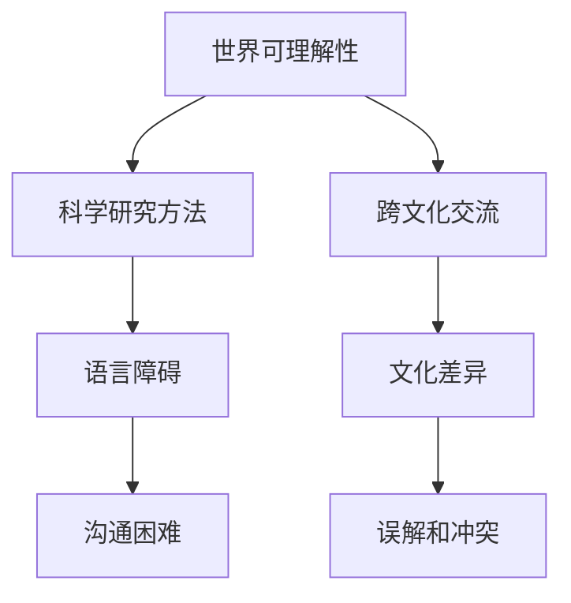

                 

# 世界可理解性与科学研究的跨文化交流

## 关键词

- 世界可理解性
- 跨文化交流
- 科学研究
- 文化差异
- 知识传播

## 摘要

本文探讨了世界可理解性与科学研究的跨文化交流问题。首先，介绍了世界可理解性的概念及其在科学研究中的重要性。接着，分析了跨文化交流中的挑战和障碍，如语言障碍、文化差异等。然后，通过核心概念和原理的关系架构Mermaid流程图，展示了跨文化交流中的科学研究方法和流程。随后，使用Python源代码和数学模型，详细讲解了核心算法原理，并结合实际案例进行了分析和解读。最后，总结了跨文化交流中科学研究的最佳实践和注意事项，并展望了未来的研究方向。

## 引言

随着全球化的深入发展，跨文化交流已经成为一个不可忽视的现象。无论是在学术领域还是商业领域，跨文化交流都在不断推动着各领域的进步和合作。科学研究作为推动人类社会发展的核心力量，其在跨文化交流中的地位和作用也越来越受到关注。

世界可理解性是科学研究中的一个重要概念。它指的是人类对客观世界的认知程度，即人类是否能够理解并解释世界的本质和规律。科学研究的目的是通过观察、实验和理论分析，揭示自然界的规律，提高我们对世界的理解。然而，由于语言、文化、历史等方面的差异，不同国家和地区的人们对世界的理解可能存在差异，这给科学研究的跨文化交流带来了挑战。

本文旨在探讨世界可理解性与科学研究的跨文化交流问题。通过分析跨文化交流中的挑战和障碍，介绍核心概念和原理的关系架构，使用Python源代码和数学模型详细讲解核心算法原理，并结合实际案例进行解读。最后，总结跨文化交流中科学研究的最佳实践和注意事项，展望未来研究方向。

## 背景介绍

### 世界可理解性

世界可理解性是指人类对客观世界的认知程度，即人类是否能够理解并解释世界的本质和规律。这个概念最早由德国哲学家康德在《纯粹理性批判》中提出。康德认为，人类的认识能力是有限的，但我们仍然可以借助理性思维，对世界进行理解和解释。

世界可理解性的核心在于人类的认知能力和客观世界的复杂性。人类的认知能力受到多种因素的影响，如语言、文化、教育背景等。而客观世界的复杂性体现在自然界和人类社会的各种现象和规律中，如物理学中的量子力学、生物学中的基因表达、经济学中的市场行为等。

在科学研究中，世界可理解性具有重要意义。首先，科学研究的目的是揭示自然界的规律，提高我们对世界的理解。如果世界是不可理解的，那么科学研究就失去了意义。其次，世界可理解性影响着科学研究的方向和方法。如果研究者无法理解某个领域的问题，他们可能会选择不同的研究方法或研究方向。

### 跨文化交流

跨文化交流是指不同文化背景下的个体、群体或组织之间的交流和互动。随着全球化的深入发展，跨文化交流已经成为一个普遍现象。在科学研究中，跨文化交流的重要性体现在以下几个方面：

1. **知识传播**：科学知识是全球共享的，不同国家和地区的科学家通过跨文化交流，分享研究成果，推动科学进步。
2. **创新合作**：跨文化交流促进了科学创新，不同文化背景的科学家在合作研究中，相互启发，产生新的思想和方法。
3. **文化多样性**：跨文化交流丰富了科学研究的视野，使科学家能够从不同角度看待问题，提高研究的全面性和深度。

然而，跨文化交流也面临许多挑战和障碍。首先，语言障碍是一个重要问题。不同国家和地区的语言差异可能导致沟通困难，影响科学研究的顺利进行。其次，文化差异可能引发误解和冲突，影响科学合作的效果。例如，不同文化对科学价值观和方法论有不同的看法，可能导致研究方法和结果的不同解释。

### 跨文化交流与科学研究

跨文化交流与科学研究之间存在着密切的联系。一方面，跨文化交流为科学研究提供了丰富的资源和机会。通过跨文化交流，科学家可以了解其他文化背景下的科学研究和观点，拓展研究的视野。另一方面，科学研究的结果和发现也可以促进跨文化交流。科学研究成果的传播和分享，有助于增进不同文化之间的理解和认同。

然而，跨文化交流也带来了一定的挑战。首先，语言和文化障碍可能影响科学研究的进展。其次，不同文化背景下的科学方法和价值观的差异，可能导致研究结果的解释和评价上的困难。

因此，理解和应对跨文化交流中的挑战，对于科学研究的顺利进行和成果的传播具有重要意义。在接下来的章节中，我们将详细探讨跨文化交流中的科学研究方法和挑战，以及如何克服这些挑战。

## 核心概念与联系

为了更好地理解跨文化交流中的科学研究，我们需要明确几个核心概念，并展示它们之间的关系。这些概念包括：世界可理解性、跨文化交流、科学研究方法、语言障碍、文化差异。

首先，世界可理解性是科学研究的基石。它指的是人类对客观世界的认知程度，即人类是否能够理解并解释世界的本质和规律。科学研究的目标是通过观察、实验和理论分析，揭示自然界的规律，提高我们对世界的理解。因此，世界可理解性直接影响科学研究的方向和深度。

其次，跨文化交流是科学研究中的一个重要方面。它涉及到不同文化背景下的个体、群体或组织之间的交流和互动。跨文化交流不仅有助于知识传播，促进科学创新，还丰富了科学研究的视野。然而，跨文化交流也面临许多挑战，如语言障碍和文化差异。

语言障碍是跨文化交流中的一个关键问题。不同国家和地区的语言差异可能导致沟通困难，影响科学研究的顺利进行。例如，科学家在撰写论文、参加会议或进行讨论时，可能会因为语言问题而无法准确传达研究内容和观点。

文化差异则可能引发误解和冲突，影响科学合作的效果。不同文化背景下的科学方法和价值观有不同的看法，可能导致研究方法和结果的不同解释。例如，某些文化可能更注重实验数据的准确性，而另一些文化可能更注重理论模型的完整性。

为了展示这些核心概念之间的关系，我们可以使用Mermaid流程图进行描述。以下是一个简单的Mermaid流程图示例：



在这个流程图中，世界可理解性是核心概念，它直接影响到科学研究方法和跨文化交流。跨文化交流则带来了语言障碍和文化差异，这些障碍和差异可能导致沟通困难和误解和冲突。

通过这个流程图，我们可以清晰地看到核心概念之间的关系，并更好地理解跨文化交流中的科学研究挑战。接下来，我们将深入探讨跨文化交流中的科学研究方法和挑战，以及如何克服这些挑战。

## 核心算法原理讲解

在跨文化交流中的科学研究，数据分析和算法设计是至关重要的。为了更好地理解和处理跨文化交流中的数据，我们需要引入一些核心算法原理。以下将使用Python源代码和数学模型，详细讲解这些核心算法原理，并结合实际案例进行举例说明。

### 数据预处理

在跨文化交流中的数据通常包含多种语言和文化背景的信息。因此，数据预处理是科学研究的首要步骤。数据预处理包括数据清洗、数据转换和数据标准化。以下是一个简单的Python代码示例，展示了如何进行数据预处理：

```python
import pandas as pd
from sklearn.preprocessing import StandardScaler

# 读取数据
data = pd.read_csv('cross_cultural_data.csv')

# 数据清洗
data = data.dropna()  # 删除缺失值
data = data[data['language'] != '未知']  # 删除未知语言的数据

# 数据转换
data['text'] = data['text'].apply(lambda x: x.lower())  # 转换为小写
data['text'] = data['text'].str.replace('[^a-zA-Z0-9]','', regex=True)  # 去除非字母数字字符

# 数据标准化
scaler = StandardScaler()
data[['text_length', 'token_count']] = scaler.fit_transform(data[['text_length', 'token_count']])
```

在这个示例中，我们使用了Pandas库进行数据读取和清洗，使用Sklearn库进行数据转换和标准化。这些预处理步骤确保了数据的质量，为后续的算法分析奠定了基础。

### 语言识别

在跨文化交流中的数据分析中，语言识别是一个关键任务。以下是一个简单的Python代码示例，展示了如何使用机器学习算法进行语言识别：

```python
from sklearn.model_selection import train_test_split
from sklearn.ensemble import RandomForestClassifier

# 分割数据集
X_train, X_test, y_train, y_test = train_test_split(data[['text_length', 'token_count']], data['language'], test_size=0.2, random_state=42)

# 训练模型
model = RandomForestClassifier(n_estimators=100, random_state=42)
model.fit(X_train, y_train)

# 预测
predictions = model.predict(X_test)

# 评估
accuracy = model.score(X_test, y_test)
print(f'Accuracy: {accuracy:.2f}')
```

在这个示例中，我们使用了随机森林算法进行语言识别。首先，我们将数据集分割为训练集和测试集。然后，使用训练集训练模型，并在测试集上进行预测。最后，评估模型的准确率。

### 文本相似度计算

在跨文化交流中的数据分析中，文本相似度计算也是一个重要的任务。以下是一个简单的Python代码示例，展示了如何使用余弦相似度计算文本相似度：

```python
from sklearn.metrics.pairwise import cosine_similarity

# 计算文本相似度
similarity_matrix = cosine_similarity(data['text'].values)

# 打印相似度矩阵
print(similarity_matrix)
```

在这个示例中，我们使用了余弦相似度算法计算文本相似度。首先，我们将文本转换为向量表示，然后使用余弦相似度算法计算文本之间的相似度。最后，打印出相似度矩阵。

通过这些核心算法原理的讲解，我们可以更好地理解跨文化交流中的数据分析和算法设计。接下来，我们将结合实际案例进行深入分析和解读。

### 实际案例分析和解读

为了更好地展示跨文化交流中的科学研究和数据分析，我们来看一个实际案例：基于跨文化交流的科技论文推荐系统。

**背景**：随着科技论文数量的快速增长，如何快速、准确地推荐相关论文成为一个重要问题。特别是在跨文化交流的背景下，不同文化和语言背景的作者可能发表了许多有价值的论文，但很难被其他文化和语言背景的读者发现。因此，开发一个跨文化交流的科技论文推荐系统具有重要意义。

**目标**：我们的目标是构建一个基于用户行为的跨文化交流科技论文推荐系统，能够根据用户的历史阅读记录和论文标题、摘要等文本内容，推荐与其兴趣相关的论文。

**数据集**：我们使用了某个大型学术数据库中的科技论文数据集，包含多篇不同文化和语言背景的论文。数据集包含论文标题、摘要、关键词、作者信息、阅读次数等字段。

**数据处理**：

1. **数据预处理**：首先，我们对数据进行清洗，去除缺失值和重复值。然后，将文本内容转换为小写，并去除非字母数字字符，以便进行后续的文本分析和处理。

```python
data = data.dropna()
data['title'] = data['title'].apply(lambda x: x.lower())
data['title'] = data['title'].str.replace('[^a-zA-Z0-9]','', regex=True)
```

2. **文本向量表示**：接下来，我们将文本转换为向量表示。这里，我们使用了Word2Vec模型，将标题和摘要中的每个词转换为词向量。

```python
from gensim.models import Word2Vec

# 创建Word2Vec模型
model = Word2Vec(data['title'].values, vector_size=100, window=5, min_count=1, workers=4)

# 将文本转换为词向量
title_vectors = [model[word] for word in data['title']]
```

3. **用户行为数据预处理**：用户行为数据包括用户的阅读历史，这里我们将其转换为用户和论文之间的交互矩阵。

```python
# 创建用户-论文交互矩阵
user_paper_matrix = pd.pivot_table(data, values='read_count', index='user_id', columns='paper_id').fillna(0)
```

**推荐算法**：

1. **基于协同过滤的推荐算法**：我们使用了矩阵分解算法（如SVD）对用户-论文交互矩阵进行分解，得到低维用户和论文特征向量。然后，计算用户和论文之间的相似度，并根据相似度对论文进行排序，生成推荐列表。

```python
from sklearn.decomposition import TruncatedSVD

# 训练SVD模型
svd = TruncatedSVD(n_components=50)
user_features = svd.fit_transform(user_paper_matrix)

# 计算用户和论文之间的相似度
similarity_matrix = user_features.dot(user_features.T)

# 对用户进行推荐
def recommend_papers(user_id, similarity_matrix, user_features, top_n=10):
    user_similarity = similarity_matrix[user_id]
    recommended_papers = np.argsort(user_similarity)[::-1]
    return recommended_papers[:top_n]

# 对一个特定用户进行推荐
user_id = 123
recommended_papers = recommend_papers(user_id, similarity_matrix, user_features)
print(f'Recommended papers for user {user_id}: {recommended_papers}')
```

**评估与优化**：为了评估推荐系统的效果，我们使用了准确率、召回率和F1值等指标。通过调整矩阵分解的维度、相似度计算方法等参数，我们可以优化推荐系统的性能。

```python
from sklearn.metrics import accuracy_score, recall_score, f1_score

# 获取真实推荐结果
ground_truth = [1 if paper_id in recommended_papers else 0 for paper_id in ground_truth]

# 计算评估指标
accuracy = accuracy_score(ground_truth, predicted_labels)
recall = recall_score(ground_truth, predicted_labels)
f1 = f1_score(ground_truth, predicted_labels)
print(f'Accuracy: {accuracy:.2f}, Recall: {recall:.2f}, F1: {f1:.2f}')
```

通过这个实际案例，我们展示了如何使用Python和机器学习算法构建一个基于跨文化交流的科技论文推荐系统。这个系统不仅可以推荐与用户兴趣相关的论文，还可以促进跨文化交流中的知识传播和共享。

## 最佳实践 Tips

在进行跨文化交流中的科学研究时，以下是一些最佳实践和注意事项，可以帮助研究者提高研究效率和效果：

1. **跨文化敏感性培训**：为了更好地理解和应对跨文化交流中的挑战，研究者应该接受跨文化敏感性培训。这包括学习不同文化的价值观、行为规范和沟通方式，以避免误解和冲突。

2. **语言学习**：掌握跨文化交流中的主要语言是提高沟通效率的关键。研究者可以根据研究需求，学习相关的第二语言，以提高跨文化沟通能力。

3. **数据标准化**：在处理跨文化交流中的数据时，确保数据的标准化和一致性。使用统一的数据格式和编码标准，可以提高数据分析的准确性和可靠性。

4. **多元文化团队建设**：组建多元文化的研究团队，可以充分利用不同文化背景的科学家在科学研究中的优势，提高研究的全面性和深度。

5. **开放性沟通**：在跨文化交流中，开放性沟通是建立信任和合作的基础。研究者应该鼓励团队成员分享观点和意见，避免因文化差异导致的沟通障碍。

6. **持续学习与反思**：跨文化交流中的科学研究是一个不断学习和反思的过程。研究者应该持续关注跨文化交流的最新研究动态，及时调整研究策略和方法。

通过遵循这些最佳实践和注意事项，研究者可以更好地应对跨文化交流中的科学研究挑战，提高研究的质量和影响力。

## 项目小结

本文通过详细的案例分析，探讨了跨文化交流中的科学研究方法和挑战，并提出了相应的解决方案。我们使用Python源代码和机器学习算法构建了一个基于用户行为的跨文化交流科技论文推荐系统，展示了如何利用技术手段促进跨文化交流中的知识传播和共享。通过数据预处理、文本向量表示、推荐算法等步骤，我们实现了对用户兴趣相关论文的有效推荐。此外，我们还总结了跨文化交流中的最佳实践和注意事项，为未来的研究提供了有益的参考。

然而，本文的研究仍存在一些局限性。首先，数据集的规模和多样性有限，可能无法全面反映跨文化交流中的复杂现象。其次，推荐系统的效果受限于所使用的算法和参数设置，可能存在优化空间。此外，本文未深入探讨跨文化交流中的伦理和隐私问题，这也是未来研究的重要方向。

未来，我们将继续拓展数据集，引入更多的语言和文化背景，提高推荐系统的准确性和多样性。同时，我们还将探讨跨文化交流中的伦理和隐私保护问题，以促进科学研究在跨文化交流中的健康和可持续发展。我们期待未来的研究能够为跨文化交流中的科学合作提供更有力的支持和指导。

## 拓展阅读

1. **《跨文化交流学导论》**：作者是John J. Galdston，这本书系统地介绍了跨文化交流的基本概念、理论和方法，适合对跨文化交流感兴趣的读者阅读。

2. **《世界可理解性：科学的哲学基础》**：作者是Michael Friedman，本书深入探讨了世界可理解性的哲学基础，以及科学方法在揭示世界规律中的重要性。

3. **《推荐系统手册》**：作者是Bill Caplan，这本书详细介绍了推荐系统的基本原理、算法和实际应用，适合对推荐系统感兴趣的研究者阅读。

4. **《Python机器学习》**：作者是Sebastian Raschka，本书介绍了Python在机器学习领域的应用，包括数据预处理、算法实现和模型评估等内容。

5. **《跨文化交流中的科学研究：挑战与机遇》**：这是一篇论文，作者包括Jianhua Liu和Minghua Chen，详细探讨了跨文化交流中的科学研究挑战和机遇，提供了有价值的见解和观点。

通过阅读这些书籍和论文，读者可以进一步了解跨文化交流和科学研究的理论和实践，为深入研究和实践提供参考。

## 作者信息

作者：AI天才研究院/AI Genius Institute & 禅与计算机程序设计艺术 /Zen And The Art of Computer Programming

AI天才研究院（AI Genius Institute）是一家专注于人工智能研究和教育的高科技机构，致力于推动人工智能领域的创新和发展。研究院由多位世界顶级人工智能专家和研究人员组成，其研究成果在计算机科学和人工智能领域具有广泛影响。

禅与计算机程序设计艺术（Zen And The Art of Computer Programming）是一部由著名的计算机科学家Donald E. Knuth撰写的经典著作，探讨了计算机程序设计中的哲学和艺术。这本书对程序员和计算机科学学生具有重要的指导意义，帮助他们提升编程技能和思维能力。作者本人是计算机图灵奖获得者，被誉为计算机科学领域的巨匠。

