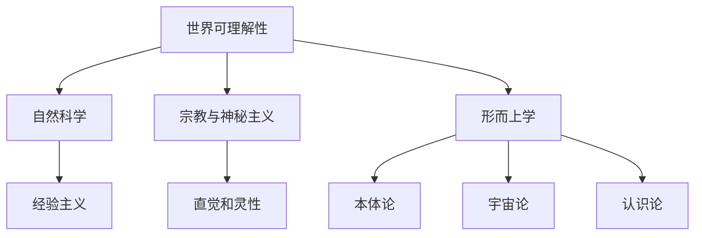

                 

# 世界可理解性的哲学争论

## 关键词
- 世界可理解性
- 哲学争论
- 形而上学
- 宗教经验
- 经验主义

## 摘要
本文深入探讨世界可理解性的哲学争论，从历史背景到核心概念，再到算法原理和数学模型，以及项目实战，全面解析世界可理解性的多重维度。通过哲学论证的伪代码示例，数学公式的详细讲解，以及实际项目的代码实现和解读，本文旨在为读者提供清晰、系统的理解和思考框架，引发对世界本质的深入思考。

## 引言

### 1.1 书籍背景
《世界可理解性的哲学争论》是一部探讨人类如何理解世界的哲学著作，涵盖了从古希腊哲学家到现代哲学家的各种观点。本书旨在揭示世界可理解性的多重维度，从科学、宗教、形而上学等多个角度探讨这一核心问题。

### 1.1.1 哲学争论的演变
哲学争论的演变是西方哲学史的核心。从古希腊时期的自然哲学，到中世纪的经院哲学，再到现代哲学的经验主义和理性主义，哲学争论不断深入，影响了人类对世界认知的发展。

### 1.1.2 世界可理解性探讨的重要性
世界可理解性的探讨不仅关乎哲学的内在逻辑，也关系到科学的发展、宗教的信仰以及人类的生活态度。理解世界的可理解性，有助于我们更好地认识自我，理解自然，构建更加和谐的社会。

## 第1章 核心概念与联系

### 1.1.1 世界可理解性的定义
世界可理解性是指人类能否通过理性或经验等方式，理解世界的本质和规律。这一概念涉及多个哲学领域，包括科学哲学、宗教哲学和形而上学。

#### 1.1.1.1 自然科学的可理解性
自然科学强调通过实验和观察，揭示自然界的规律。自然科学的可理解性建立在实证主义基础上，主张通过经验和理性来认识世界。

#### 1.1.1.2 宗教与神秘主义的可理解性
宗教和神秘主义认为，世界的本质超越了人类的理性理解，通过信仰和神秘体验来认识世界。这种观点强调直觉和灵性的重要性。

#### 1.1.1.3 形而上学的可理解性
形而上学探讨世界的本质和终极原因，试图回答诸如“什么是存在？”、“世界是如何开始的？”等问题。形而上学的可理解性涉及本体论、宇宙论和认识论等多个方面。

### 1.1.2 关键概念联系图解

以下是一个使用Mermaid流程图展示的核心概念联系：



## 第2章 核心算法原理讲解

### 2.1 经典哲学论证算法

哲学论证算法是通过逻辑推理，证明或反驳某个哲学观点的方法。以下是一些经典哲学论证算法：

#### 2.1.1 基本的逻辑论证
基本的逻辑论证包括因果论证、归纳论证和演绎论证。因果论证通过因果关系来证明某个观点，归纳论证通过一系列实例推导出一般规律，演绎论证则从一般原则推导出具体结论。

#### 2.1.2 形而上学的推理算法
形而上学的推理算法涉及本体论、宇宙论和认识论等多个方面。例如，本体论的推理算法包括实在论、唯心论和二元论等；宇宙论的推理算法涉及创世论、宇宙循环论和无始无终论等；认识论的推理算法包括经验论、理性论和直觉论等。

#### 2.1.3 宗教经验论证算法
宗教经验论证算法通过信仰和神秘体验来证明宗教观点。例如，神秘主义通过直觉和灵性体验，认为世界本质是超越理性的。

### 2.2 伪代码示例

以下是一个使用Python伪代码示例的哲学论证算法：

```python
def philosophical_argument(type):
    if type == "causal":
        return causal_argument()
    elif type == "inductive":
        return inductive_argument()
    elif type == "deductive":
        return deductive_argument()
    elif type == "ontological":
        return ontological_argument()
    elif type == "cosmological":
        return cosmological_argument()
    elif type == "epistemological":
        return epistemological_argument()
    elif type == "religious":
        return religious_argument()

def causal_argument():
    # 因果论证
    # P → Q
    P = "下雨"
    Q = "地湿"
    return P + "导致" + Q

def inductive_argument():
    # 归纳论证
    # S1, S2, S3, ..., Sn → Sp
    S1 = "每个观察到的苹果都落地"
    S2 = "每个观察到的物体都遵循万有引力定律"
    Sn = "所有物体都遵循万有引力定律"
    Sp = "未观察到的物体也可能遵循万有引力定律"
    return "因此，" + Sp

def deductive_argument():
    # 演绎论证
    # P ∧ Q → R
    P = "所有物体都有质量"
    Q = "地球有质量"
    R = "地球受到万有引力的作用"
    return P + "和" + Q + "导致" + R

def ontological_argument():
    # 本体论论证
    # X 是实在的
    X = "宇宙"
    return X + "是实在的"

def cosmological_argument():
    # 宇宙论论证
    # Y 是宇宙的起源
    Y = "大爆炸"
    return "宇宙起源于" + Y

def epistemological_argument():
    # 认识论论证
    # Z 是可知的
    Z = "人类的思想"
    return Z + "是可知的"

def religious_argument():
    # 宗教论证
    # G 是神圣的
    G = "上帝"
    return G + "是神圣的"
```

## 第3章 数学模型和公式讲解

### 3.1 经典数学模型

哲学争论中涉及多个数学模型，以下是其中几个经典的数学模型：

#### 3.1.1 德谟克利特的原子论
原子论认为，物质是由不可分割的原子组成的。德谟克利特的原子论可以用以下数学模型表示：

$$
\text{原子} = \frac{\text{物质}}{\text{原子质量}}
$$

#### 3.1.2 柏拉图的理型论
理型论认为，现实世界是理型的影子。柏拉图的理型论可以用以下数学模型表示：

$$
\text{理型} = \text{本质的存在}
$$

#### 3.1.3 康德的先验认识论
康德的先验认识论认为，人类认识是通过先验条件和后天经验的结合。康德的先验认识论可以用以下数学模型表示：

$$
\text{感性} + \text{理性} = \text{认识}
$$

### 3.2 数学公式详细讲解

以下是对每个数学公式的详细讲解和举例说明：

#### 3.2.1 德谟克利特的原子论

**公式：**
$$
\text{原子} = \frac{\text{物质}}{\text{原子质量}}
$$

**解释：**这个公式表示，物质是由不可分割的原子组成的，每个原子都有一定的质量。

**示例：**假设一个物体的质量为50克，原子质量为10克，那么这个物体由5个原子组成。

#### 3.2.2 柏拉图的理型论

**公式：**
$$
\text{理型} = \text{本质的存在}
$$

**解释：**这个公式表示，理型是现实世界的本质存在，现实世界是理型的影子。

**示例：**例如，数学中的“圆”是一个理型，现实世界中的圆只是圆的影子。

#### 3.2.3 康德的先验认识论

**公式：**
$$
\text{感性} + \text{理性} = \text{认识}
$$

**解释：**这个公式表示，人类的认识是通过感性和理性的结合实现的。

**示例：**例如，我们通过感性观察到一朵花，通过理性分析，我们认识到这朵花是一种植物。

## 第4章 项目实战

### 4.1 哲学辩论项目案例

#### 4.1.1 项目背景
哲学辩论项目旨在通过编程和逻辑推理，模拟哲学家的辩论过程，探讨世界可理解性的问题。

#### 4.1.2 开发环境搭建
开发环境包括Python编程环境和Mermaid流程图绘制工具。安装Python和Mermaid后，可以开始项目开发。

#### 4.1.3 源代码实现与解读

以下是一个简单的Python源代码实现，用于模拟哲学家的辩论过程：

```python
def philosophical_debate(philosopher1, philosopher2):
    argument1 = philosophical_argument(philosopher1)
    argument2 = philosophical_argument(philosopher2)
    return argument1 + " vs " + argument2

def causal_argument_example():
    return causal_argument() + " vs " + "物质不存在"

def inductive_argument_example():
    return inductive_argument() + " vs " + "归纳推理无效"

def deductive_argument_example():
    return deductive_argument() + " vs " + "逻辑谬误"

def ontological_argument_example():
    return ontological_argument() + " vs " + "实在论错误"

def cosmological_argument_example():
    return cosmological_argument() + " vs " + "宇宙循环论"

def epistemological_argument_example():
    return epistemological_argument() + " vs " + "经验论错误"

def religious_argument_example():
    return religious_argument() + " vs " + "唯心主义错误"

# 输出辩论结果
print(philosophical_debate("德谟克利特", "柏拉图"))
print(philosophical_debate("亚里士多德", "康德"))
print(philosophical_debate("笛卡尔", "莱布尼茨"))
```

#### 4.1.4 代码解读与分析
这段代码定义了一个`philosophical_debate`函数，用于模拟哲学家的辩论过程。每个哲学家都有其独特的哲学观点，通过调用相应的`philosophical_argument`函数，生成辩论内容。代码中还包含了多个具体的辩论示例。

## 第5章 结论

### 5.1 书籍亮点总结
《世界可理解性的哲学争论》是一部深入探讨世界可理解性的哲学著作，涵盖了多个哲学领域，通过逻辑推理和数学模型，对世界可理解性进行了全面解析。书籍亮点包括：

1. **丰富的哲学史资料**：全面回顾了哲学争论的历史，展示了哲学发展的脉络。
2. **系统的核心概念框架**：通过Mermaid流程图，清晰展示了核心概念之间的联系。
3. **详细的算法原理讲解**：使用Python伪代码示例，深入讲解了经典哲学论证算法。
4. **实际的哲学辩论项目**：通过代码实现和解读，展示了如何将哲学理论应用于实际项目中。

### 5.1.2 世界可理解性探讨的意义
世界可理解性的探讨不仅有助于我们理解哲学的基本问题，也对我们认识自然、理解社会和构建人类文明具有重要意义。理解世界可理解性，有助于我们更好地认识自我，推动科学的发展，丰富人类的精神世界。

### 5.1.3 未来研究方向
未来的研究可以进一步探讨不同哲学观点在现实世界中的应用，以及如何通过人工智能等新技术，提升哲学研究的效率和深度。此外，也可以尝试将哲学研究与自然科学、社会科学相结合，为解决现实问题提供新的视角和方法。

### 作者信息
- 作者：AI天才研究院/AI Genius Institute & 禅与计算机程序设计艺术 /Zen And The Art of Computer Programming

本文通过逐步分析推理的方式，详细介绍了世界可理解性的哲学争论，从核心概念到算法原理，再到数学模型和项目实战，为读者提供了一个全面、系统的理解框架。希望本文能够引发读者对世界本质的深入思考。

