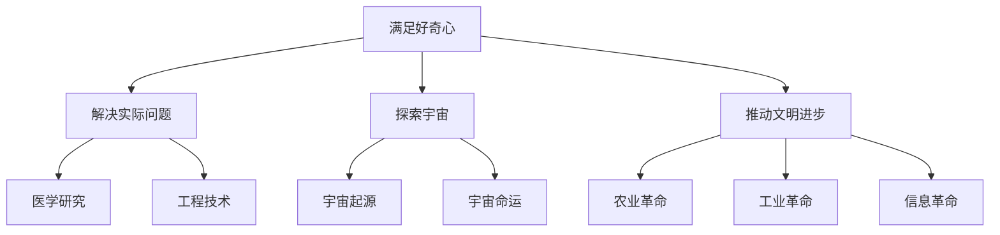
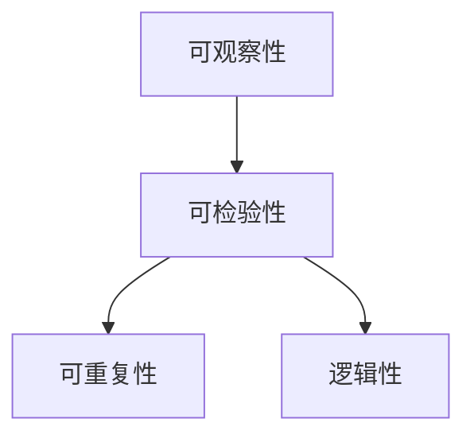
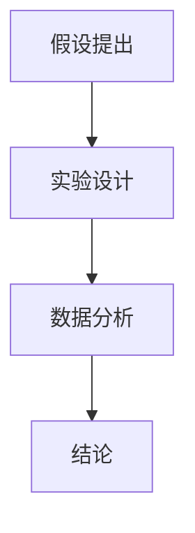
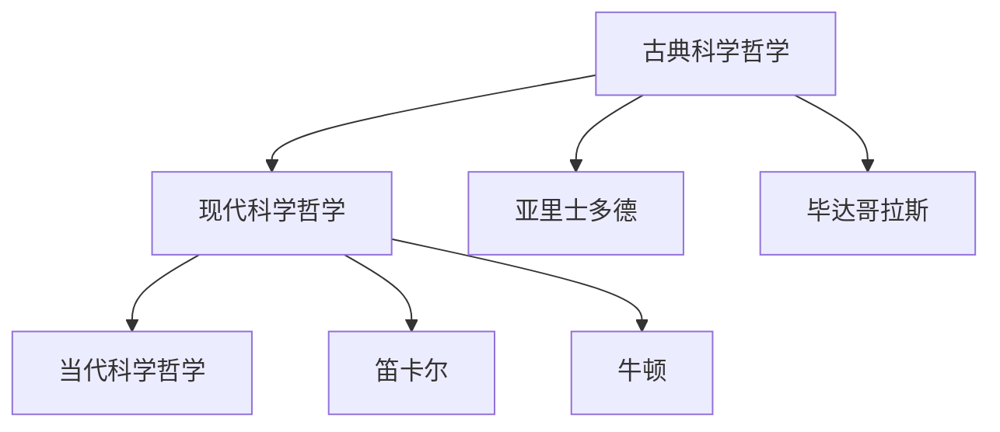
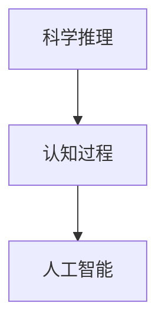
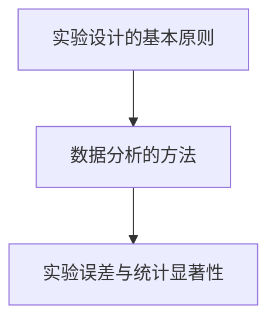
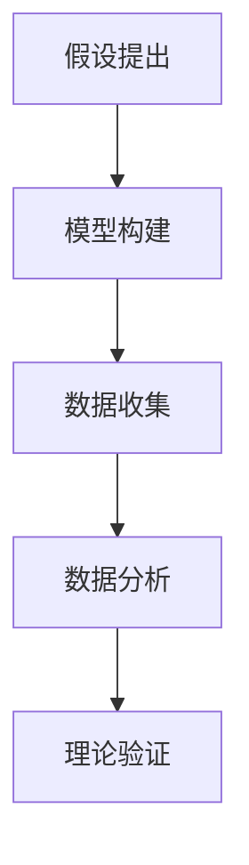
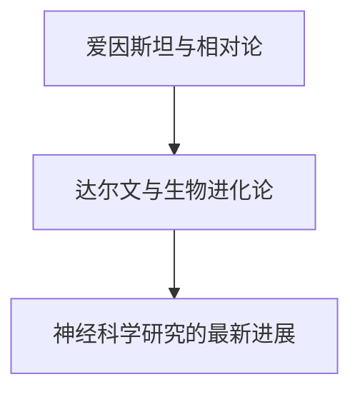
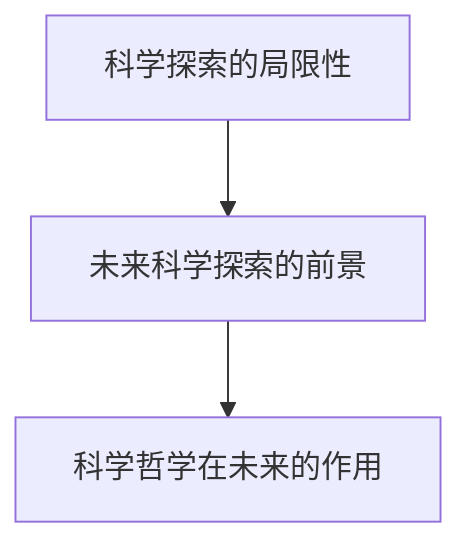

                 

### 《世界的可理解性：科学探索的基础》

**关键词**：科学哲学、科学方法、科学理论、认知科学、实验设计、数据分析、人工智能

**摘要**：本文旨在探讨世界的可理解性在科学探索中的基础作用。从科学哲学的核心理念出发，通过历史发展和认知科学的角度，分析了科学方法的实践与应用。文章还详细阐述了科学实验的设计与分析、科学理论的构建与验证，并结合实际案例展示了科学探索的实例。最后，文章对科学探索的未来展望进行了探讨，并提供了科学哲学经典著作推荐和实验工具资源。

### 第1章 科学探究的动机

科学探究的动机源于人类对自然世界的无知与好奇。从古至今，人类一直在努力理解我们所处的世界，从天文学、物理学到生物学，每一个领域都充满了探索的激情和智慧。科学探究的动机可以分为以下几个方面：

1. **满足好奇心**：人类天生对未知充满好奇。对自然现象的探究，能够满足人类对世界的好奇心，推动科学的进步。
   
2. **解决实际问题**：科学探究不仅仅是为了满足好奇心，更重要的是解决实际问题。例如，医学研究旨在治愈疾病，工程技术旨在改善生活质量。

3. **探索宇宙**：人类对宇宙的探索不仅满足了科学家的好奇心，也为人类提供了关于宇宙起源和命运的重要信息。

4. **推动文明进步**：科学探究推动了人类文明的进步，从农业革命到工业革命，再到信息革命，每一次科学突破都带来了社会生产力的巨大提升。

**核心概念与联系：**

### 第2章 科学方法的基本原则

科学方法是一套系统化的方法论，用于指导科学研究的过程。科学方法的基本原则包括：

1. **可观察性**：科学理论必须是基于可观察的现象和数据。
   
2. **可检验性**：科学理论必须能够被实验或观察所检验。

3. **可重复性**：科学实验必须能够被其他科学家重复，以确保实验结果的一致性。

4. **逻辑性**：科学理论必须基于逻辑推理，符合科学原理。

**核心概念与联系：**

### 第3章 科学理论的可检验性

科学理论的可检验性是科学方法的核心原则之一。一个科学理论必须能够通过实验或观察来验证或反驳。科学理论的验证通常涉及以下步骤：

1. **假设提出**：根据已有的知识和观察，提出一个科学假设。
   
2. **实验设计**：设计一个实验来检验假设。实验设计必须满足可重复性和控制变量的原则。

3. **数据分析**：对实验结果进行数据分析，以确定假设是否得到支持。

4. **结论**：根据数据分析的结果，得出科学结论。

**核心概念与联系：**

### 第4章 科学哲学的历史发展

科学哲学的历史发展可以分为几个重要阶段，包括古典科学哲学、现代科学哲学和当代科学哲学。

1. **古典科学哲学**：起源于古希腊，以亚里士多德和毕达哥拉斯为代表，强调逻辑和数学在科学中的重要性。

2. **现代科学哲学**：17世纪以来，随着科学革命的发展，以笛卡尔、牛顿等人为代表的现代科学哲学强调实验和观察在科学探究中的核心地位。

3. **当代科学哲学**：20世纪以来，科学哲学的研究领域不断扩大，包括科学哲学、认知科学、逻辑学等多个领域。

**核心概念与联系：**

### 第5章 科学哲学与认知科学

科学哲学与认知科学有着密切的联系。认知科学是研究人类认知过程的学科，包括记忆、感知、推理等。科学哲学则关注科学探究的基本原则和方法论。

1. **科学推理与认知过程**：科学推理是人类认知过程中的一部分，涉及到假设的提出、实验设计、数据分析等步骤。

2. **科学哲学与人工智能**：人工智能的发展受到了科学哲学的影响。人工智能研究旨在模拟人类的认知过程，从而实现智能机器。

**核心概念与联系：**

### 第6章 科学实验的设计与分析

科学实验是科学探究的核心环节。科学实验的设计与分析必须遵循一定的原则和方法。

1. **实验设计的基本原则**：包括控制变量、随机抽样、实验组与对照组等。

2. **数据分析的方法**：包括统计分析、回归分析、假设检验等。

3. **实验误差与统计显著性**：实验误差是科学实验中不可避免的问题，统计显著性则是衡量实验结果可靠性的重要指标。

**核心概念与联系：**

### 第7章 科学理论的构建与验证

科学理论的构建与验证是科学探究的关键步骤。科学理论的构建通常涉及以下几个阶段：

1. **假设提出**：基于现有的知识和观察，提出一个科学假设。

2. **模型构建**：建立数学模型来描述假设。

3. **数据收集**：收集相关数据以支持或反驳假设。

4. **数据分析**：对数据进行分析，以验证假设。

5. **理论验证**：通过实验或观察来验证理论的正确性。

**核心概念与联系：**

### 第8章 科学探索的实际案例

科学探索的实际案例能够帮助我们更好地理解科学理论的构建与验证。以下是一些著名的科学探索实例：

1. **爱因斯坦与相对论**：爱因斯坦通过实验验证了他的相对论，从而改变了我们对时间和空间的理解。

2. **达尔文与生物进化论**：达尔文通过长时间的观察和实验，提出了生物进化论，挑战了当时的主流观点。

3. **神经科学研究的最新进展**：神经科学研究揭示了大脑如何工作，为治疗神经系统疾病提供了新的思路。

**核心概念与联系：**

### 第9章 科学探索的未来展望

科学探索的未来充满了机遇和挑战。随着技术的发展，我们有望在更多领域取得突破，例如人工智能、量子计算、基因编辑等。然而，科学探索也面临着道德、伦理、社会影响等方面的挑战。

1. **科学探索的局限性**：科学方法有其局限性，无法解释所有现象，也无法预测未来。

2. **未来科学探索的前景**：未来科学探索将更加依赖于跨学科的合作和技术创新。

3. **科学哲学在未来的作用**：科学哲学将在科学探索中发挥重要作用，帮助科学家理解科学探究的本质和意义。

**核心概念与联系：**

### 附录

**附录A：科学哲学经典著作推荐**

- 《科学哲学》 - 卡尔·波普尔
- 《科学的结构》 - 托马斯·库恩
- 《科学的法则》 - 伊萨克·阿西莫夫

**附录B：科学实验工具与资源**

- R语言：一种用于统计分析和数据可视化的编程语言。
- MATLAB：一种用于数学计算和工程模拟的软件。
- Jupyter Notebook：一种交互式的编程环境，适用于科学计算和数据处理。

**附录C：科学理论构建与验证的常见方法**

- 假设-演绎法：基于已有理论和假设，推导出新的结论。
- 演绎法：从一般原理推导出具体结论。
- 归纳法：从具体实例归纳出一般原理。

**最佳实践 Tips：**

- 在科学探究中，保持好奇心和开放心态至关重要。
- 严谨的实验设计和数据分析是科学探究的基础。
- 跨学科合作有助于推动科学进步。

**小结：**

科学探索是人类对自然世界的不断追求和理解的体现。通过科学哲学的核心理念、科学方法的实践和应用，我们能够构建和验证科学理论，推动科学的发展。未来，科学探索将面临更多挑战，但也充满机遇。科学哲学将继续在科学探索中发挥重要作用，帮助人类更好地理解世界。

**注意事项：**

- 科学探究需要严谨的态度和科学的精神。
- 在科学实验中，确保实验设计的科学性和数据分析的准确性。
- 关注科学哲学的最新发展，以更好地指导科学探索。

**拓展阅读：**

- 《科学革命的结构》 - 托马斯·库恩
- 《科学方法论》 - 查尔斯·桑德斯·皮尔士
- 《科学的极限》 - 史蒂芬·霍金

### 结论

《世界的可理解性：科学探索的基础》通过深入探讨科学哲学、科学方法、科学理论的构建与验证，展示了科学探究的复杂性和重要性。科学探索不仅是人类对自然世界的好奇和探索，也是推动文明进步的重要力量。未来，科学哲学将继续在科学探索中发挥关键作用，帮助人类更好地理解世界。作者：AI天才研究院/AI Genius Institute & 禅与计算机程序设计艺术 /Zen And The Art of Computer Programming。让我们共同期待科学的未来，探索世界的无限可能。

