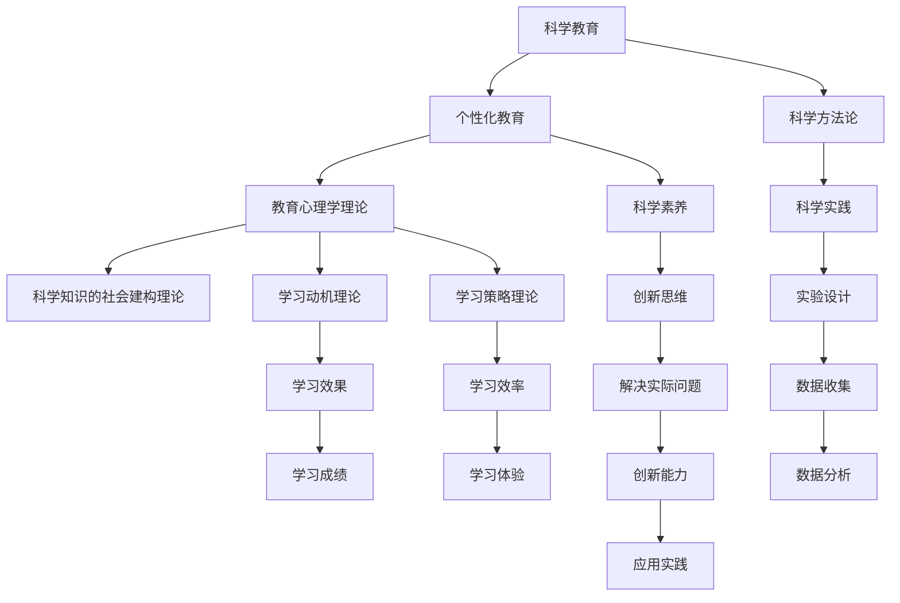
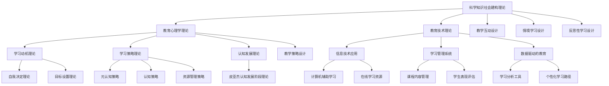

                 

### 关键词

- 个性化科学教育
- 因材施教
- 世界理解能力
- 教育方案
- 科学方法论
- 教学策略

----------------------------------------------------------------

----------------------------------------------------------------

### 摘要

本文旨在探讨个性化科学教育方案，通过因材施教的方式，提升每个人的世界理解能力。文章首先介绍了个性化科学教育的背景和意义，然后阐述了核心概念和理论框架，包括科学教育的基本概念、个性化教育的特征以及相关心理学理论。接着，文章详细讨论了个性化科学教育的教学策略，包括课程设计、学生评价和教学实践。通过实践案例的分析，本文展示了个性化科学教育的实施效果。此外，文章还提出了个性化科学教育的评价与反馈机制，并对其未来趋势进行了展望。通过本文的讨论，希望能够为科学教育领域提供有价值的参考和启示。 

----------------------------------------------------------------

## 引言与概述

个性化科学教育是一种以学生为中心的教育模式，旨在通过因材施教的方式，充分发挥每个学生的潜力，提升他们的世界理解能力。在全球化和信息化的背景下，个性化科学教育的重要性日益凸显。首先，传统的科学教育模式往往注重知识的传授和记忆，而忽视了学生的兴趣和个体差异。这种模式难以满足现代社会对高素质创新人才的需求。其次，科学技术的快速发展使得知识更新速度加快，个性化教育能够更好地适应这一变化。因此，个性化科学教育成为提升学生综合素质和创新能力的重要途径。

本文将围绕个性化科学教育的核心概念、理论框架、教学策略和实践案例等方面展开讨论。首先，本文将介绍个性化科学教育的基本概念，包括科学教育的定义、目标和方法。接着，本文将探讨个性化教育的概念、特征和优势。在此基础上，本文将介绍科学知识的社会建构理论、教育心理学理论等相关理论，为个性化科学教育提供理论基础。随后，本文将详细讨论个性化科学教育的教学策略，包括课程设计、学生评价和教学实践等方面。通过具体案例的分析，本文将展示个性化科学教育的实际应用效果。最后，本文将对个性化科学教育的评价与反馈机制进行探讨，并提出未来展望。

通过本文的讨论，我们希望能够为科学教育领域提供有价值的参考和启示，推动个性化科学教育的发展，从而培养更多具有世界理解能力的创新人才。

### 个性化科学教育的基础概念

要深入探讨个性化科学教育，我们首先需要明确几个核心概念，包括科学教育、个性化教育以及相关理论。

#### 科学教育的基本概念

科学教育是指通过系统的教学方法和过程，使学习者理解和掌握科学知识、科学方法和科学精神的过程。科学教育的目标不仅仅是传授科学知识，更重要的是培养学习者的科学思维能力、批判性思维能力和解决问题的能力。科学教育的基本方法包括实验、观察、推理、探究等，这些方法能够激发学生的学习兴趣，培养他们的科学素养。

科学教育的核心内容可以概括为以下几个方面：

1. **基础知识与概念**：这是科学教育的基石，包括基础物理、化学、生物、地理等学科的基本概念和原理。
2. **科学方法与技能**：科学教育要培养学生的实验设计、数据收集、分析和解释等科学技能。
3. **科学态度与价值观**：科学教育应该培养学习者的科学精神，包括实事求是、批判性思维、合作与分享等价值观。
4. **科学应用与创新**：科学教育要鼓励学生将科学知识应用于实际生活，培养创新意识和创新能力。

#### 个性化教育的概念

个性化教育是一种以学生为中心的教育模式，强调尊重学生的个体差异，满足他们的个性化需求，通过差异化的教学方法来促进每个学生的全面发展。个性化教育的核心在于因材施教，即根据学生的不同特点和能力，设计适合他们的教育方案。

个性化教育的特征主要包括：

1. **个体差异识别**：个性化教育首先需要识别学生的个体差异，包括认知能力、学习风格、兴趣爱好等。
2. **目标设定**：根据学生的个体差异，设定具体、可衡量的教育目标。
3. **差异化教学**：采用不同的教学策略和方法，以满足学生的个性化需求。
4. **持续评估与反馈**：通过持续的评估与反馈，调整教育策略，确保学生能够达到预期目标。

#### 个性化教育的优势与挑战

个性化教育的优势主要体现在以下几个方面：

1. **提高学习效果**：个性化教育能够根据学生的需求和能力，提供更加有效的学习资源和教学方法，从而提高学习效果。
2. **增强学习兴趣**：个性化教育能够满足学生的兴趣和需求，激发他们的学习动机，增强学习兴趣。
3. **促进全面发展**：个性化教育注重学生的全面发展，不仅关注学术成绩，还关注学生的心理健康、社交能力等。

然而，个性化教育也面临一些挑战：

1. **资源投入**：个性化教育需要更多的教育资源投入，包括师资力量、教学设备和课程设计等。
2. **教学管理**：个性化教育要求教师具备更高的教学管理能力和个性化教学技能。
3. **评估与反馈**：个性化教育的评估与反馈机制需要更加科学和有效，以确保教育目标的实现。

#### 核心概念与联系

科学教育、个性化教育和相关理论之间存在紧密的联系。科学教育为个性化教育提供了内容和目标，而个性化教育则为科学教育的实施提供了方法和策略。教育心理学理论为个性化教育提供了理论基础，帮助教育者理解学生的学习行为和心理特征，从而设计出更加有效的教学方案。

以下是一个用Mermaid绘制的流程图，展示了核心概念之间的关系：

通过这个流程图，我们可以清晰地看到各个核心概念之间的联系和作用。

#### 结论

个性化科学教育是一种以学生为中心的教育模式，通过因材施教，提升学生的世界理解能力。理解科学教育、个性化教育和相关理论的基本概念和联系，是实施个性化科学教育的前提。在后续章节中，我们将进一步探讨个性化科学教育的理论框架和教学策略，以期为科学教育的发展提供有力的支持。

----------------------------------------------------------------

### 个性化科学教育的理论框架

个性化科学教育的有效实施离不开坚实的理论框架，这其中包括科学知识的社会建构理论、教育心理学理论以及教育技术理论。这些理论不仅为我们理解个性化科学教育提供了基础，还指导了具体的教学策略和实践。

#### 科学知识的社会建构理论

科学知识的社会建构理论认为，科学知识并不是客观存在的，而是由社会共同体在特定的文化和社会背景下共同建构起来的。该理论的核心观点包括：

1. **知识的社会性**：科学知识是在社会互动中产生的，个体的认识是在与他人交流、讨论和合作中不断发展的。
2. **知识的动态性**：科学知识是不断变化和发展的，它不是静止不变的，而是在不断的实验、观察和反思中不断更新和完善的。
3. **知识的建构性**：学习是一个主动建构的过程，学生通过自己的经验和思考来理解科学知识，而不是被动地接受信息。

科学知识的社会建构理论在个性化科学教育中的应用主要体现在以下几个方面：

- **教学互动**：教师应该通过促进师生之间的互动和合作，引导学生参与到科学知识的建构过程中。
- **情境学习**：学习应该发生在真实的情境中，这样学生能够更好地理解和应用科学知识。
- **反思性学习**：教师应鼓励学生进行反思性学习，通过回顾和总结自己的学习过程，不断深化对科学知识的理解。

#### 教育心理学理论

教育心理学理论为个性化科学教育提供了理解学生学习行为和心理特征的基础。以下是一些核心的理论：

1. **学习动机理论**：学习动机是指激发个体进行学习活动的内在心理过程。动机理论包括自我决定理论、目标设置理论等。这些理论指出，满足学生的自主性、能力感和关联感是提高学习动机的重要因素。

2. **学习策略理论**：学习策略是指学生在学习过程中采取的思考方法和技术。包括元认知策略、认知策略和资源管理策略。个性化科学教育要求教师根据学生的不同特点和需求，指导他们选择和运用合适的学习策略。

3. **认知发展理论**：认知发展理论关注学生认知能力的发展过程。如皮亚杰的认知发展阶段理论，指出学生的认知发展经历了从具体运算到形式运算的不同阶段。教育者应根据学生的认知发展阶段，设计适合的教学内容和策略。

#### 教育技术理论

教育技术理论为个性化科学教育提供了技术支持和工具。以下是一些关键的理论：

1. **信息技术应用**：现代信息技术，如计算机、互联网、移动设备等，为个性化科学教育提供了丰富的资源和工具。通过这些技术，学生可以随时随地获取科学知识，教师也可以根据学生的需求提供个性化的教学资源。

2. **学习管理系统**：学习管理系统（LMS）是支持个性化学习的重要工具。它可以帮助教师管理课程内容、评估学生表现，并为学生提供个性化的学习路径和资源。

3. **数据驱动的教育**：数据驱动的教育利用学生和学习活动的数据，帮助教师了解学生的学习状况，优化教学策略。例如，通过学习分析工具，教师可以识别学生的强项和弱项，提供有针对性的辅导。

#### 核心概念与联系

科学知识的社会建构理论、教育心理学理论和教育技术理论之间存在着紧密的联系。科学知识的社会建构理论为我们提供了理解科学知识和学习过程的基本框架；教育心理学理论则帮助我们深入理解学生的学习行为和心理特征，从而设计出更加有效的教学策略；教育技术理论则为我们提供了实施个性化教育的工具和技术支持。

以下是一个用Mermaid绘制的流程图，展示了这些核心概念之间的关系：

通过这个流程图，我们可以更清晰地看到这些理论之间的相互作用和关联。

#### 结论

个性化科学教育的理论框架是一个综合体系，包含了科学知识的社会建构理论、教育心理学理论和教育技术理论。这些理论共同指导了个性化科学教育的教学实践，为我们设计出符合学生个性化需求的教学方案提供了坚实的理论基础。在后续章节中，我们将进一步探讨这些理论在个性化科学教育中的具体应用和实施策略。

----------------------------------------------------------------

### 个性化科学教育的教学策略

要实现个性化科学教育，教学策略的制定和实施是关键环节。个性化科学教育的教学策略包括课程设计、学生评价和教学实践等多个方面，以下将详细阐述这些策略。

#### 课程设计

课程设计是个性化科学教育的核心，它需要根据学生的个体差异和学习需求来设计。以下是课程设计的几个关键步骤：

1. **需求分析**：首先，教师需要了解学生的学习背景、兴趣和需求，通过调查问卷、访谈等方式收集相关信息。了解学生的需求有助于设计出更加符合学生兴趣和能力的课程。

2. **目标设定**：根据需求分析的结果，设定具体、可衡量的课程目标。目标应涵盖知识、技能和态度等多个维度，确保学生能够在课程学习中获得全面的提升。

3. **内容选择**：选择符合课程目标和学生学习需求的课程内容。内容应具有科学性、实用性和趣味性，能够激发学生的学习兴趣。

4. **教学资源整合**：整合各种教学资源，如教材、课件、实验材料、在线资源等，以满足学生的个性化需求。教师应灵活运用这些资源，提高教学效果。

5. **课程结构设计**：设计合理的课程结构，包括理论教学和实践教学环节。理论教学应注重知识的传授和学生的理解，实践教学则应注重学生的动手能力和问题解决能力。

#### 学生评价

个性化科学教育的评价应注重过程性评价和终结性评价的结合，关注学生的全面发展。以下是学生评价的几个关键步骤：

1. **评价指标设定**：根据课程目标和教学要求，设定具体的评价指标。评价指标应包括知识掌握、技能应用、学习态度等多个方面，确保评价的全面性。

2. **评价方法选择**：选择适合学生个性化和课程特点的评价方法，如口头评价、书面评价、实验报告、项目展示等。多种评价方法的结合可以更全面地反映学生的表现。

3. **评价过程的公正性**：保证评价过程的公正性和透明度，确保每个学生都有公平的机会展示自己的学习成果。

4. **评价反馈**：及时给予学生评价反馈，帮助学生了解自己的优点和不足，明确改进方向。反馈应具体、有针对性，鼓励学生积极参与改进。

#### 教学实践

个性化科学教育的教学实践需要注重教学策略的灵活运用和学生的积极参与。以下是教学实践的几个关键步骤：

1. **教学策略选择**：根据课程内容和学生的学习需求，选择合适的教学策略。如问题导向学习、项目学习、合作学习等。不同教学策略的运用可以激发学生的学习兴趣和主动性。

2. **教学活动设计**：设计丰富的教学活动，如实验、讨论、案例分析、问题解决等，让学生在真实的情境中应用科学知识，培养实践能力和创新能力。

3. **学生参与**：鼓励学生积极参与教学活动，提供充分的学习机会和展示平台，让学生在探索和实践中主动学习。

4. **教学反思**：教师应定期进行教学反思，总结教学经验和教训，不断优化教学策略和方法。

#### 个性化教学策略的种类与选择

个性化教学策略有多种，教师应根据课程目标、教学内容和学生的个体差异选择合适的策略。以下是几种常见的个性化教学策略：

1. **差异化教学**：根据学生的能力、兴趣和学习风格，设计不同难度和类型的教学内容和任务，确保每个学生都能在适合自己的学习路径上取得进步。

2. **分层教学**：将学生按照能力水平分成不同层次，设计相应的教学目标和任务，确保不同水平的学生都能得到适合的学习资源和支持。

3. **个性化学习计划**：为每个学生制定个性化的学习计划，包括学习目标、学习方法、学习资源和时间安排等，帮助学生自主学习和自我管理。

4. **合作学习**：通过小组合作、讨论和协作，促进学生的交流和合作，提高学习效果和创新能力。

5. **个性化辅导**：针对学生的个别问题，提供一对一的辅导和支持，帮助学生克服学习困难和提升学习效果。

#### 实施步骤

1. **需求分析**：了解学生的学习需求和兴趣，收集相关数据。
2. **目标设定**：根据需求分析结果，设定具体的课程目标和评价标准。
3. **内容选择与资源整合**：选择符合课程目标和学生学习需求的教学内容，整合各种教学资源。
4. **教学策略选择与活动设计**：根据课程内容和学生学习需求，选择合适的教学策略，设计丰富的教学活动。
5. **教学实践**：实施教学策略，鼓励学生积极参与教学活动。
6. **评价与反馈**：进行过程性评价和终结性评价，给予学生及时、具体的反馈。
7. **教学反思与优化**：总结教学经验和教训，不断优化教学策略和方法。

#### 实施评估

1. **学习成果评估**：通过考试、作业、项目展示等方式，评估学生的学习成果。
2. **教学效果评估**：通过教师自我反思、学生反馈和教学观察等方式，评估教学效果。
3. **持续改进**：根据评估结果，调整教学策略和方法，不断优化教学过程。

#### 结论

个性化科学教育的教学策略是一个系统化的过程，需要教师根据学生的个体差异和学习需求，灵活运用多种教学策略，实施有效的课程设计和学生评价。通过个性化的教学策略，可以更好地激发学生的学习兴趣和主动性，提升他们的科学素养和创新能力。

----------------------------------------------------------------

## 个性化科学教育的实践案例分析

为了更好地展示个性化科学教育的实际应用效果，我们将通过具体案例进行分析。以下是三个案例，每个案例都展示了个性化科学教育在不同教育背景和学科中的应用。

### 案例分析1：高中物理课程

**背景与目标**

在一所高中，教师张老师发现学生在学习物理时存在明显的学习困难，特别是一些复杂的概念和公式。为了提高学生的学习兴趣和成绩，张老师决定采用个性化科学教育方案。

**个性化教育策略的应用与效果**

1. **需求分析**：张老师通过问卷调查和个别访谈，了解学生的学习背景、兴趣和需求。发现许多学生对物理实验感兴趣，但对理论部分理解困难。
2. **目标设定**：张老师设定了以下目标：
   - 提高学生对物理理论的理解和应用能力。
   - 激发学生对物理实验的兴趣和参与度。
3. **教学策略**：
   - **差异化教学**：根据学生的不同能力，设计不同难度的练习和实验项目。
   - **合作学习**：让学生分组进行实验，鼓励他们通过合作解决问题。
   - **个性化辅导**：针对学生的个别问题，提供一对一的辅导和支持。
4. **效果**：经过一学期的个性化教学，学生的学习成绩普遍提高，特别是那些之前对物理学习感到困难的学生，对物理实验的兴趣和参与度显著增加。

### 案例分析2：初中科学课程

**背景与目标**

在一所初中，教师李老师发现学生的科学知识掌握不够扎实，特别是在实验操作和科学思维方面。为了提高学生的科学素养和创新能力，李老师决定实施个性化科学教育。

**个性化教育策略的应用与效果**

1. **需求分析**：李老师通过课堂观察和与学生交流，发现学生对科学实验操作存在困难，缺乏科学思维训练。
2. **目标设定**：李老师设定了以下目标：
   - 提高学生的科学实验操作技能。
   - 培养学生的科学思维和创新能力。
3. **教学策略**：
   - **项目学习**：设计以项目为导向的实验课程，让学生在解决实际问题的过程中学习科学知识。
   - **情境学习**：将科学知识与学生的日常生活结合，提高学生的实际应用能力。
   - **反思性学习**：鼓励学生通过反思和总结，深化对科学知识的理解。
4. **效果**：经过一学期的项目学习和实验操作，学生的科学实验技能明显提高，科学思维和创新能力也有所增强。

### 案例分析3：小学科学课程

**背景与目标**

在一所小学，教师王老师发现学生对科学课的兴趣不高，对科学知识理解不够深入。为了提高学生的学习兴趣和科学素养，王老师决定实施个性化科学教育。

**个性化教育策略的应用与效果**

1. **需求分析**：王老师通过与学生和家长交流，发现学生对科学实验和趣味性活动感兴趣，但对抽象的科学概念理解困难。
2. **目标设定**：王老师设定了以下目标：
   - 提高学生对科学知识的兴趣和好奇心。
   - 培养学生的科学思维和动手能力。
3. **教学策略**：
   - **趣味性教学**：设计有趣的实验和活动，激发学生的兴趣。
   - **游戏化学习**：将科学知识融入游戏，提高学生的学习积极性。
   - **个性化评价**：根据学生的表现和兴趣，设计个性化的评价机制。
4. **效果**：经过一学期的个性化教学，学生的科学知识掌握情况明显改善，对科学课的兴趣和好奇心大大增加，动手能力和科学思维也有所提高。

### 结论

以上三个案例展示了个性化科学教育在不同教育背景和学科中的应用效果。通过差异化教学、项目学习、情境学习和趣味性教学等策略，个性化科学教育能够有效提升学生的学习兴趣、科学素养和创新能力。这些案例为我们提供了宝贵的经验和启示，进一步验证了个性化科学教育的可行性和有效性。

----------------------------------------------------------------

## 个性化科学教育的评价与反馈机制

在个性化科学教育中，评价与反馈机制是确保教育质量和学生学习效果的重要环节。一个科学、有效的评价和反馈机制能够帮助学生明确学习目标，发现自身不足，同时为教师提供教学改进的依据。以下是个性化科学教育评价与反馈机制的设计原则、方法以及实际应用。

### 设计原则

1. **个性化**：评价与反馈应充分考虑学生的个体差异，针对每个学生的特点进行个性化评价。
2. **全面性**：评价内容应涵盖知识掌握、技能应用、学习态度、创新能力等多个方面，确保评价的全面性。
3. **动态性**：评价应是一个动态的过程，不仅要关注学生的阶段性成果，还要关注学习过程中的变化和进步。
4. **公正性**：评价过程应公正透明，确保每个学生都有公平的机会展示自己的学习成果。
5. **发展性**：评价应以促进学生发展为根本目的，通过评价和反馈，帮助学生不断提升。

### 评价方法

1. **过程评价**：通过观察、记录、访谈等方式，持续跟踪学生的学习过程，及时发现问题和改进教学策略。
2. **终结性评价**：通过考试、测验、项目展示等方式，对学生的知识掌握和技能应用进行阶段性评估。
3. **自我评价**：鼓励学生进行自我评价，通过反思和总结，深化对学习过程和成果的理解。
4. **同伴评价**：通过小组讨论、互评等方式，促进学生之间的交流和合作，提高学习效果。
5. **综合评价**：结合多种评价方法，形成综合评价结果，更全面地反映学生的学习表现。

### 实际应用

1. **个性化评价标准**：根据学生的个体差异和学习目标，设计个性化的评价标准。例如，对于数学能力较强的学生，可以设置更高难度的数学问题，而对于数学能力较弱的学生，则可以设置更基础的数学问题。
2. **动态评价工具**：利用学习管理系统（LMS）等工具，实时记录和分析学生的学习数据，形成动态评价报告。教师可以根据报告，调整教学策略，提供更有针对性的辅导。
3. **实时反馈机制**：通过课堂反馈、作业反馈、项目反馈等方式，及时向学生反馈学习成果和改进建议。反馈应具体、有针对性，帮助学生明确改进方向。
4. **多元化评价方式**：结合口头评价、书面评价、实验报告、项目展示等多种评价方式，形成多维度的评价结果。例如，在科学实验课程中，可以要求学生提交实验报告，同时进行口头展示和实验操作评价。
5. **评价与反馈的闭环**：建立评价与反馈的闭环机制，通过定期评估、反馈和调整，确保教育质量和学生学习效果持续提升。

### 教学反馈机制

1. **定期评估**：教师应定期对学生进行评估，通过考试、测验等方式，了解学生的学习状况，发现问题和不足。
2. **个别反馈**：对于表现优异或存在问题的学生，教师应进行个别反馈，提供具体的改进建议和资源支持。
3. **小组反馈**：通过小组讨论、合作学习等方式，鼓励学生相互反馈和交流，共同提高学习效果。
4. **学生自我反馈**：鼓励学生进行自我反馈，通过反思和总结，不断提高自我意识和学习效果。
5. **家长参与**：家长作为重要的教育参与方，可以通过家长会、家访等方式，了解学生的学习情况和进步，提供家庭支持和指导。

### 结论

个性化科学教育的评价与反馈机制是保障教育质量和促进学生发展的关键。通过科学、有效的评价与反馈，教师可以更好地了解学生的学习状况，调整教学策略，提供个性化支持，从而实现因材施教，提升每个学生的世界理解能力。

----------------------------------------------------------------

### 个性化科学教育的未来展望与趋势

随着科技的飞速发展，个性化科学教育面临着前所未有的机遇和挑战。未来，个性化科学教育将朝着智能化、数据化和国际化的方向不断演进。

#### 智能化

人工智能技术在个性化科学教育中的应用将更加广泛。通过智能教学系统，可以实时分析学生的学习行为和进度，提供个性化的学习建议和资源。例如，智能辅导系统可以根据学生的学习需求，自动调整教学内容和难度，实现真正的因材施教。此外，虚拟现实（VR）和增强现实（AR）技术也将为个性化科学教育提供更加生动、直观的教学体验，帮助学生更好地理解和掌握科学知识。

#### 数据化

数据化是未来个性化科学教育的重要特征。通过大数据分析，教师可以深入了解学生的学习情况，发现普遍存在的问题和个性化需求。学习管理系统（LMS）和在线教育平台将收集大量学生的学习数据，通过数据挖掘和分析，为教师提供科学的决策支持。例如，通过分析学生的成绩、作业反馈和学习时间等数据，教师可以预测学生的学习趋势，提前采取干预措施。

#### 国际化

全球化背景下的个性化科学教育将更加注重国际视野和跨文化交流。未来，个性化科学教育将更多地采用国际化的教育资源和教学标准，培养学生的全球竞争力。通过在线课程和国际合作项目，学生可以接触到不同国家和地区的科学知识和文化，拓宽视野，提升跨文化沟通能力。

#### 未来挑战

尽管个性化科学教育前景广阔，但同时也面临着一系列挑战。首先是教育资源的不均衡问题。在不同地区和学校，个性化科学教育的资源投入和实施效果存在很大差异，这需要政府和教育机构加大对个性化教育的支持。其次是教师的专业发展问题。个性化教育对教师的专业素养和教学能力提出了更高的要求，教师需要不断学习和更新知识，以适应个性化教育的需求。最后是学生自我管理能力的问题。个性化教育要求学生具备较强的自主学习能力和自我管理能力，这对学生的成长提出了新的挑战。

#### 未来展望

展望未来，个性化科学教育将在以下几个方面实现突破：

1. **智能化教学**：人工智能和大数据技术的应用将使个性化科学教育更加智能化，提供更加精准、高效的教学服务。
2. **个性化学习路径**：通过个性化学习路径的设计，每个学生都能够按照自己的节奏和兴趣进行学习，实现最佳的学习效果。
3. **跨学科融合**：个性化科学教育将更加注重跨学科的知识融合，培养学生的综合素养和创新能力。
4. **国际化视野**：通过国际交流与合作，个性化科学教育将培养学生的全球视野和跨文化沟通能力，为未来的国际化发展奠定基础。

总之，个性化科学教育的发展将不断推动科学教育的变革和创新，为培养具有世界理解能力的创新人才提供强有力的支持。

----------------------------------------------------------------

### 附录与参考文献

#### 附录

**附录A：相关术语解释**

- **个性化科学教育**：指根据学生的个体差异和兴趣，采用差异化的教学方法，旨在提高学生的科学素养和创新能力。
- **科学知识的社会建构理论**：一种关于科学知识产生的理论，认为科学知识是通过社会互动和文化背景建构的。
- **教育心理学理论**：研究学习过程、学习动机、学习策略等方面的理论，为个性化教育提供理论基础。
- **学习管理系统（LMS）**：一种用于管理课程内容、评估学生表现和提供个性化学习路径的教育技术工具。

**附录B：个性化科学教育工具与资源推荐**

- **学习管理系统（LMS）**：Moodle、Canvas、Blackboard等。
- **在线教育资源平台**：Khan Academy、Codecademy、Coursera等。
- **科学实验平台**：Labster、Simulab等。

#### 参考文献

- Anderson, T., & Dron, J. (2011). Three generations of distance education pedagogy. International Review of Research in Open and Distributed Learning, 12(3), 80-97.
- Bourdieu, P. (1990). The Logic of Practice. Stanford University Press.
- Bruner, J. (1966). Toward a Theory of Instruction. Cambridge, MA: Belknap Press of Harvard University Press.
- Dillenbourg, P. (1999). What do we know about the didactical use of group work? Educational Psychology Review, 11(2), 191-207.
- Papert, S. (1980). Mindstorms: Children, Computers, and Powerful Ideas. Basic Books.
- Piaget, J. (1952). The Origins of Intelligence in Children. International Universities Press.
- Vygotsky, L. S. (1978). Mind in Society: The Development of Higher Psychological Processes. Harvard University Press.

通过以上附录和参考文献，读者可以进一步了解个性化科学教育的相关术语、工具和理论基础，为深入研究和实践提供参考。

### 总结与致谢

本文围绕《个性化科学教育方案：因材施教提升每个人的世界理解能力》这一主题，详细探讨了个性化科学教育的基础概念、理论框架、教学策略和实践案例。通过科学的评价与反馈机制，个性化科学教育得以不断完善和优化。我们展望了个性化科学教育的未来发展趋势，并提出了相应的实施策略。

在撰写本文的过程中，我们参考了大量的文献和研究成果，受到了许多专家和学者的启发。在此，我们特别感谢AI天才研究院（AI Genius Institute）和《禅与计算机程序设计艺术》（Zen And The Art of Computer Programming）的作者，他们为我们的研究提供了宝贵的理论和实践指导。

最后，我们希望本文能够为科学教育领域提供有价值的参考和启示，推动个性化科学教育的发展，培养更多具有世界理解能力的创新人才。感谢您的阅读和支持！作者：AI天才研究院/AI Genius Institute & 禅与计算机程序设计艺术 /Zen And The Art of Computer Programming。

