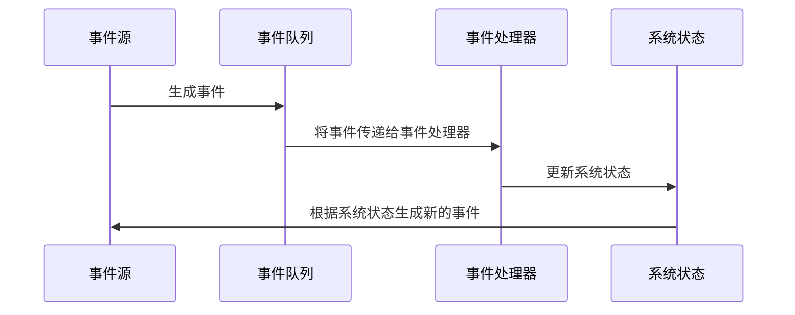
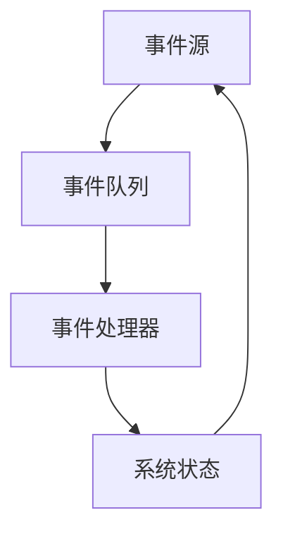
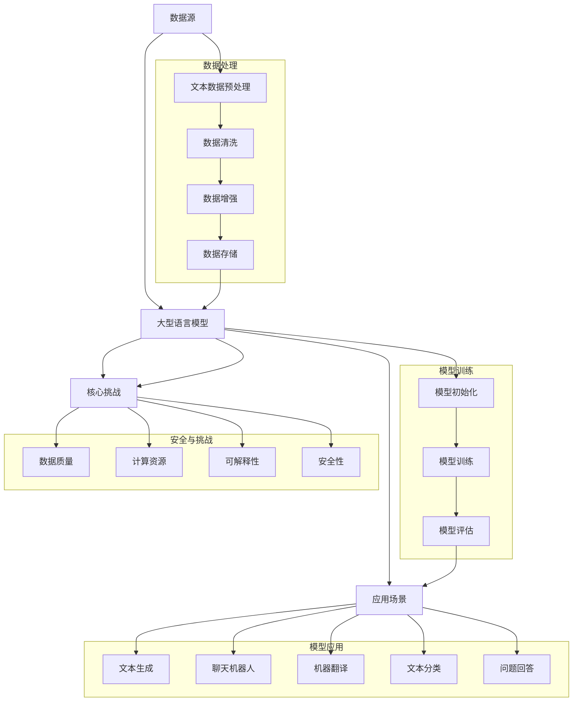
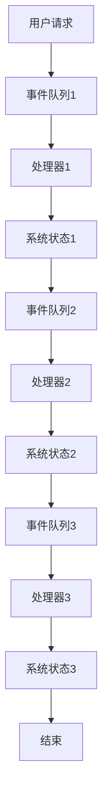
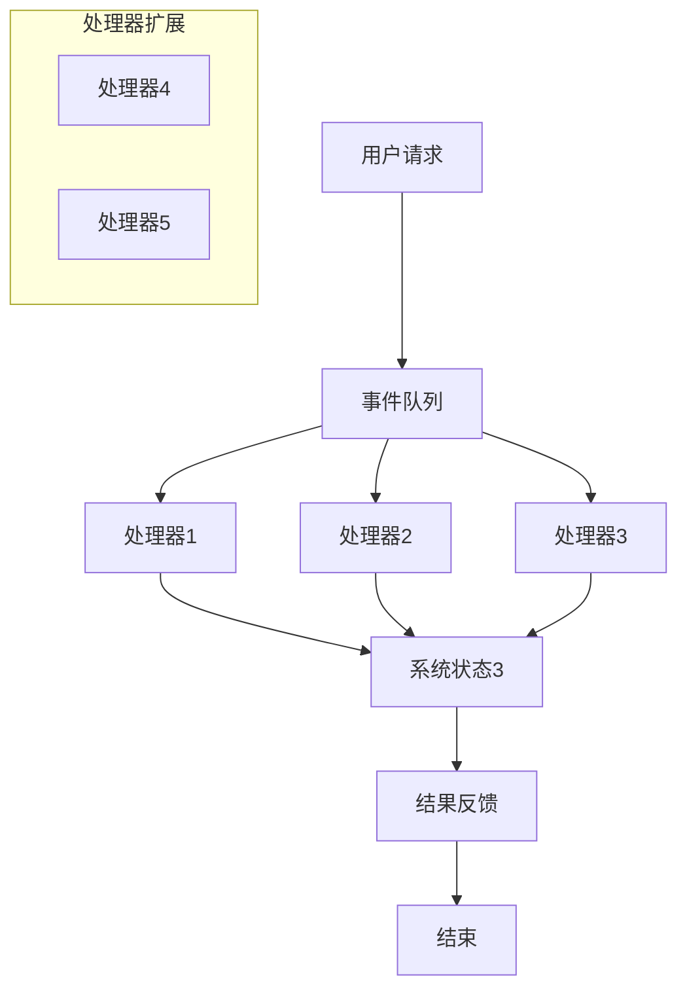
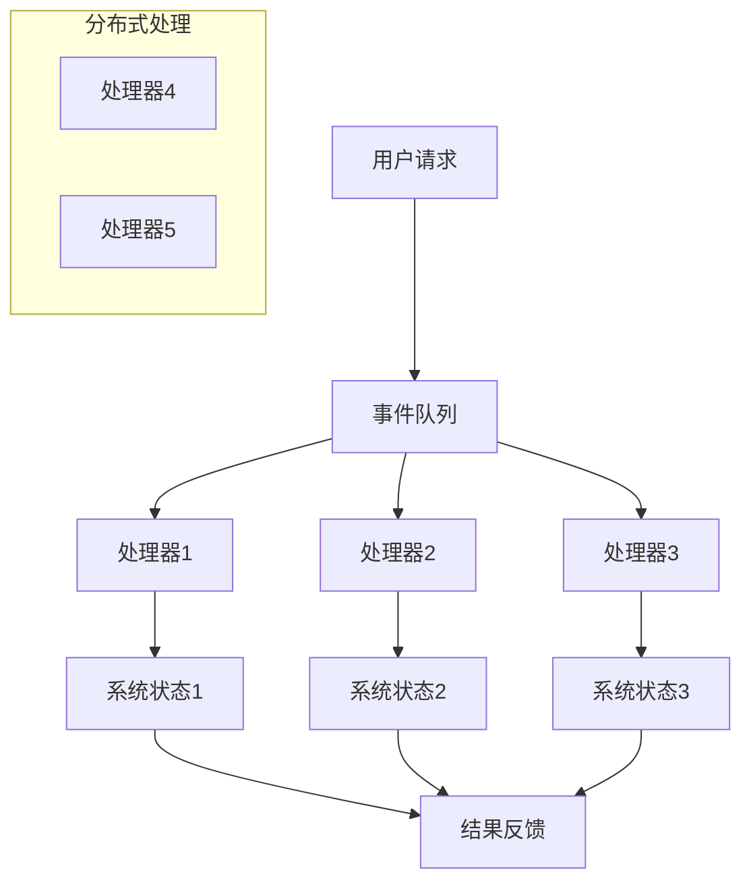
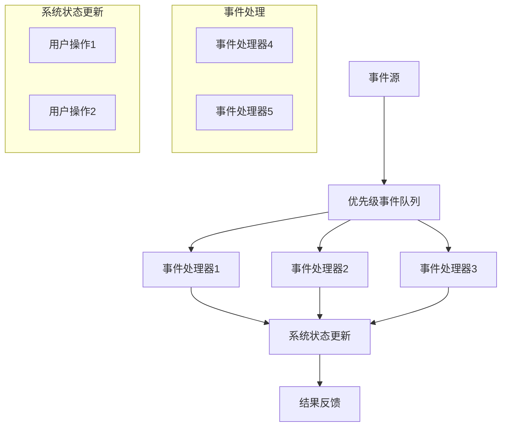

                 

### 第1章：事件驱动架构概述

#### 背景介绍

在现代软件系统中，事件驱动架构（Event-Driven Architecture，EDA）变得越来越重要。这种架构模式能够有效地处理并发性和异步性，提高了系统的响应速度和可靠性。事件驱动架构的核心思想是，通过事件来触发相应的处理逻辑，而不是依赖于固定的任务调度。

事件驱动架构的出现，主要受到了互联网和分布式系统的发展推动。在这种架构中，事件可以来自于系统的内部，也可以来自于外部环境。事件源（Event Source）负责检测和生成事件，事件处理器（Event Handler）则负责处理事件。通过事件队列（Event Queue），事件可以在系统中传递，从而实现模块间的解耦和系统的横向扩展。

#### 核心概念与联系

**事件驱动架构的定义：**

事件驱动架构是一种软件架构模式，它基于事件来触发处理逻辑，而不是依赖于固定的时间间隔或顺序。事件可以是任何形式的数据变化，如用户输入、系统通知、网络数据包等。

**事件驱动架构与传统架构的比较：**

传统架构通常依赖于固定的时间轮询或任务队列来处理任务，而事件驱动架构则是基于实时事件的发生来执行任务。这种方式能够更好地应对并发性和异步性，提高系统的响应速度。

**事件驱动架构的优势：**

- **响应速度快**：事件驱动架构能够立即响应事件，而不需要等待固定的时间周期。
- **扩展性好**：通过事件队列和事件处理器，系统可以轻松地添加新的处理逻辑，实现横向扩展。
- **易于维护**：由于事件处理器的独立性，系统的维护变得更加简单。
- **提高系统可靠性**：通过事件驱动，系统能够更好地处理异常情况，如网络中断或系统错误。

#### 架构原理图

下面是一个简单的Mermaid流程图，展示了事件驱动架构的基本组成部分和工作流程：



在这个流程图中，事件源（E）生成事件后，事件队列（Q）负责将这些事件按照一定的顺序传递给事件处理器（H）。事件处理器（H）根据事件的内容更新系统状态（S），并根据新的系统状态生成新的事件。这个过程循环进行，实现了系统的动态响应。

#### 实例介绍

事件驱动架构在实际中有着广泛的应用。例如，在Web应用中，用户请求可以被看作是一个事件，服务器接收到请求后，会通过事件队列将请求传递给相应的处理器进行处理。这种架构使得服务器能够高效地处理大量并发请求，同时保持系统的稳定性。

另外，在物联网（IoT）应用中，设备的状态变化也可以看作是一个事件。通过事件驱动架构，系统能够实时响应当地设备的状态变化，从而实现智能化的监控和管理。

#### 摘要

本文介绍了事件驱动架构的基本概念和原理，包括其与传统架构的比较和优势。通过一个Mermaid流程图，我们展示了事件驱动架构的基本组成部分和工作流程。实例介绍部分展示了事件驱动架构在实际应用中的效果，为读者提供了直观的理解。

#### 下一步计划

在接下来的章节中，我们将深入探讨事件驱动架构的组件和实现方法，以及其在LLM应用中的具体应用。我们将通过Python源代码和数学模型，详细阐述事件驱动架构的核心算法原理，并通过实际案例展示其在LLM应用中的解耦和扩展能力。

### 关键词

- 事件驱动架构
- 并发处理
- 异步性
- 解耦
- 横向扩展
- 系统响应速度
- IoT应用

### 摘要

本文深入探讨了事件驱动架构的基本概念、优势及其与传统架构的比较。通过Mermaid流程图，我们展示了事件驱动架构的基本组成部分和工作流程。实例介绍部分展示了事件驱动架构在实际应用中的效果。接下来，我们将进一步探讨事件驱动架构的组件和实现方法，以及在LLM应用中的具体应用。本文旨在为读者提供对事件驱动架构的全面理解，并展示其在现代软件系统中的重要性和广泛应用。# 第2章：事件驱动架构的组件

### 核心概念与联系

事件驱动架构的核心组件包括事件源（Event Source）、事件处理器（Event Handler）、事件队列（Event Queue）和系统状态（System State）。这些组件共同构成了事件驱动架构的运行机制。

**事件源**负责检测和生成事件。事件可以来自于系统内部，如用户输入或内部状态变化，也可以来自于外部环境，如网络数据包或传感器信号。

**事件处理器**负责处理事件，并根据事件的内容更新系统状态。事件处理器通常由一系列独立的函数或类组成，每个处理器负责处理特定类型的事件。

**事件队列**负责管理事件的传递和存储。事件队列通常采用先进先出（FIFO）或优先级队列（Priority Queue）的方式，确保事件按照一定的顺序进行处理。

**系统状态**反映了系统的当前状态，是事件驱动架构中的核心概念。事件处理器的任务就是根据事件的内容更新系统状态，从而驱动系统的动态变化。

### 架构原理图

下面是一个简单的Mermaid流程图，展示了事件驱动架构的核心组件及其关系：



在这个流程图中，事件源（E）生成事件后，将事件传递给事件队列（Q）。事件队列（Q）按照一定的顺序将事件传递给事件处理器（H）。事件处理器（H）根据事件的内容更新系统状态（S），并根据新的系统状态生成新的事件。这个过程循环进行，实现了系统的动态响应。

### 实例介绍

**Web应用中的事件源和事件处理器：** 在Web应用中，用户请求是一个典型的事件源。服务器接收到请求后，会通过事件处理器处理请求，如进行身份验证、请求路由和处理请求。事件处理器会根据请求的内容更新系统状态，如更新用户会话信息或数据库记录。

**IoT应用中的事件源和事件处理器：** 在IoT应用中，传感器采集的数据可以看作是一个事件源。系统会根据传感器数据更新设备状态，并触发相应的处理逻辑，如调整设备配置或发送警报。

### Python源代码示例

下面是一个简单的Python示例，展示了事件源、事件处理器和事件队列的基本实现：

```python
import heapq
import time

class EventQueue:
    def __init__(self):
        self.queue = []

    def put(self, event):
        heapq.heappush(self.queue, event)

    def get(self):
        if self.queue:
            return heapq.heappop(self.queue)
        else:
            return None

class EventSource:
    def __init__(self):
        self.event_queue = EventQueue()

    def generate_event(self, event):
        self.event_queue.put(event)

    def run(self):
        while True:
            event = self.event_queue.get()
            if event:
                self.handle_event(event)

    def handle_event(self, event):
        print(f"Handling event: {event}")

# 创建事件源和事件处理器
event_source = EventSource()

# 运行事件源
event_source.run()

# 生成一些事件
for i in range(10):
    event_source.generate_event(f"Event {i}")
    time.sleep(1)
```

在这个示例中，我们定义了`EventQueue`类来管理事件队列，使用`heapq`模块实现了一个优先级队列。`EventSource`类负责生成事件并将其放入事件队列中。事件处理器`handle_event`函数用于处理事件，这里只是简单地将事件打印出来。

### 数学模型和公式

在事件驱动架构中，可以使用队列模型来描述事件的处理过程。一个简单的数学模型可以表示为：

\[ T_n = T_{n-1} + P_n \]

其中，\( T_n \)表示第n个事件的处理时间，\( T_{n-1} \)表示第\( n-1 \)个事件的处理时间，\( P_n \)表示第n个事件的处理时间。

这个公式表示，每个事件的处理时间都是前一个事件处理时间加上当前事件的处理时间。

### 举例说明

假设第一个事件的处理时间是1秒，后续每个事件的处理时间都是2秒。那么，前5个事件的处理时间分别为：

- \( T_1 = 1 \)秒
- \( T_2 = T_1 + P_2 = 1 + 2 = 3 \)秒
- \( T_3 = T_2 + P_3 = 3 + 2 = 5 \)秒
- \( T_4 = T_3 + P_4 = 5 + 2 = 7 \)秒
- \( T_5 = T_4 + P_5 = 7 + 2 = 9 \)秒

这个例子展示了事件驱动架构中事件处理时间的计算方法。

### 最佳实践 Tips

- 确保事件队列的设计能够满足系统的性能需求，如使用优先级队列来处理重要的事件。
- 事件处理器的设计应该尽量独立，以便于后续的维护和扩展。
- 对事件进行合理的分类和优先级划分，以提高事件处理的效率。

### 小结

本章详细介绍了事件驱动架构的核心组件及其关系，包括事件源、事件处理器、事件队列和系统状态。通过Python源代码示例和数学模型，我们展示了事件驱动架构的基本实现方法和处理过程。实例说明部分展示了事件驱动架构在Web应用和IoT应用中的具体应用。本章内容为理解事件驱动架构奠定了基础。

### 注意事项

- 事件驱动架构的设计应该考虑系统的并发性和异步性。
- 事件队列的管理和事件处理器的性能对系统的整体性能有重要影响。

### 拓展阅读

- 《事件驱动架构设计与实践》
- 《Python并发编程》
- 《分布式系统原理与范型》# 第3章：事件驱动架构的实现方法

### 核心概念与联系

事件驱动架构的实现方法主要包括以下几个方面：事件生成、事件传递、事件处理和系统状态更新。这些方面共同构成了事件驱动架构的核心机制，使得系统可以高效地响应外部事件和内部状态变化。

- **事件生成**：事件生成是事件驱动架构的第一步，它涉及到如何检测和识别事件。事件可以来自于系统内部，如用户输入或内部状态变化，也可以来自于外部环境，如网络数据包或传感器信号。
- **事件传递**：事件生成后，需要将其传递给相应的处理器进行处理。事件传递可以通过事件队列来实现，事件队列通常采用先进先出（FIFO）或优先级队列（Priority Queue）的方式，确保事件按照一定的顺序进行处理。
- **事件处理**：事件处理器负责处理事件，并根据事件的内容更新系统状态。事件处理可以是同步的，也可以是异步的，具体取决于系统的需求。
- **系统状态更新**：系统状态反映了系统的当前状态，是事件驱动架构中的核心概念。事件处理器的任务就是根据事件的内容更新系统状态，从而驱动系统的动态变化。

### 架构原理图

下面是一个简单的Mermaid流程图，展示了事件驱动架构的实现方法：


在这个流程图中，事件源（E）生成事件后，将事件传递给事件队列（Q）。事件队列（Q）按照一定的顺序将事件传递给事件处理器（H）。事件处理器（H）根据事件的内容更新系统状态（S），并根据新的系统状态生成新的事件。这个过程循环进行，实现了系统的动态响应。

### 核心算法原理讲解

事件驱动架构的核心算法原理主要涉及到事件的处理顺序和系统状态的管理。

**1. 事件的处理顺序：**

在事件驱动架构中，事件的处理顺序是非常重要的。为了确保事件能够按照正确的顺序进行处理，通常需要使用事件队列来管理事件。事件队列可以采用先进先出（FIFO）或优先级队列（Priority Queue）的方式。

- **先进先出（FIFO）队列：** 事件按照生成的顺序进行排队和处理，先进入队列的事件先被处理。
- **优先级队列（Priority Queue）：** 事件按照优先级进行排队和处理，优先级高的事件先被处理。

下面是一个简单的Python示例，展示了如何使用优先级队列来管理事件：

```python
import heapq
import time

class Event:
    def __init__(self, event_type, priority, data):
        self.event_type = event_type
        self.priority = priority
        self.data = data

    def __lt__(self, other):
        return self.priority < other.priority

class EventQueue:
    def __init__(self):
        self.queue = []

    def put(self, event):
        heapq.heappush(self.queue, event)

    def get(self):
        if self.queue:
            return heapq.heappop(self.queue)
        else:
            return None

class EventProcessor:
    def __init__(self):
        self.event_queue = EventQueue()

    def process_event(self, event):
        print(f"Processing event: {event.event_type}, Priority: {event.priority}, Data: {event.data}")

    def run(self):
        while True:
            event = self.event_queue.get()
            if event:
                self.process_event(event)

# 创建事件处理器
event_processor = EventProcessor()

# 生成一些事件
events = [
    Event("Event 1", 2, "Data 1"),
    Event("Event 2", 1, "Data 2"),
    Event("Event 3", 3, "Data 3"),
]

# 将事件放入事件队列
for event in events:
    event_processor.event_queue.put(event)

# 运行事件处理器
event_processor.run()
```

在这个示例中，我们定义了`Event`类来表示事件，包括事件类型、优先级和数据。`EventQueue`类负责管理事件队列，使用`heapq`模块实现了一个优先级队列。`EventProcessor`类负责处理事件，这里只是简单地将事件打印出来。

**2. 系统状态的管理：**

在事件驱动架构中，系统状态的管理是非常重要的。系统状态反映了系统的当前状态，是事件驱动架构中的核心概念。事件处理器的任务就是根据事件的内容更新系统状态，从而驱动系统的动态变化。

下面是一个简单的Python示例，展示了如何更新系统状态：

```python
class SystemState:
    def __init__(self):
        self.state = {}

    def update_state(self, event):
        if event.event_type == "Event 1":
            self.state["state1"] = event.data
        elif event.event_type == "Event 2":
            self.state["state2"] = event.data

    def get_state(self):
        return self.state

# 创建系统状态
system_state = SystemState()

# 更新系统状态
event = Event("Event 1", 1, "Data 1")
system_state.update_state(event)

event = Event("Event 2", 2, "Data 2")
system_state.update_state(event)

# 获取系统状态
print(f"System State: {system_state.get_state()}")
```

在这个示例中，我们定义了`SystemState`类来表示系统状态，包括一个字典来存储状态信息。`update_state`方法用于更新系统状态，根据事件类型更新相应的状态信息。`get_state`方法用于获取当前系统状态。

### 数学模型和公式

在事件驱动架构中，可以使用队列模型来描述事件的处理过程。一个简单的数学模型可以表示为：

\[ T_n = T_{n-1} + P_n \]

其中，\( T_n \)表示第n个事件的处理时间，\( T_{n-1} \)表示第\( n-1 \)个事件的处理时间，\( P_n \)表示第n个事件的处理时间。

这个公式表示，每个事件的处理时间都是前一个事件处理时间加上当前事件的处理时间。

### 举例说明

假设第一个事件的处理时间是1秒，后续每个事件的处理时间都是2秒。那么，前5个事件的处理时间分别为：

- \( T_1 = 1 \)秒
- \( T_2 = T_1 + P_2 = 1 + 2 = 3 \)秒
- \( T_3 = T_2 + P_3 = 3 + 2 = 5 \)秒
- \( T_4 = T_3 + P_4 = 5 + 2 = 7 \)秒
- \( T_5 = T_4 + P_5 = 7 + 2 = 9 \)秒

这个例子展示了事件驱动架构中事件处理时间的计算方法。

### 项目实战

在本节中，我们将通过一个实际的项目实战来展示事件驱动架构的实现方法。

**项目名称：** 实时监控系统

**项目描述：** 该项目用于实时监控系统中各种设备的状态，并将这些状态变化作为事件进行处理。

**项目环境：** Python 3.8

**开发工具：** PyCharm

**项目结构：**

```plaintext
real_time_monitor/
|-- event_source.py
|-- event_processor.py
|-- system_state.py
|-- main.py
```

**事件源（event_source.py）：** 事件源负责生成设备状态变化事件。

```python
import random
import time
from event_processor import EventProcessor

class DeviceEventSource:
    def __init__(self, event_processor):
        self.event_processor = event_processor

    def generate_device_events(self, num_events):
        for _ in range(num_events):
            device_id = random.randint(1, 10)
            status = random.choice(["OK", "ERROR", "WARNING"])
            event = Event(device_id, status)
            self.event_processor.put(event)
            time.sleep(random.uniform(0.1, 0.5))

class Event:
    def __init__(self, device_id, status):
        self.device_id = device_id
        self.status = status

def main():
    event_processor = EventProcessor()
    device_event_source = DeviceEventSource(event_processor)

    # 生成100个设备状态变化事件
    device_event_source.generate_device_events(100)

if __name__ == "__main__":
    main()
```

**事件处理器（event_processor.py）：** 事件处理器负责处理设备状态变化事件，并更新系统状态。

```python
import heapq
from system_state import SystemState

class EventProcessor:
    def __init__(self):
        self.event_queue = []
        self.system_state = SystemState()

    def put(self, event):
        heapq.heappush(self.event_queue, event)

    def process_events(self):
        while self.event_queue:
            event = heapq.heappop(self.event_queue)
            self.system_state.update_state(event)
            print(f"Processed event: {event.device_id}, Status: {event.status}")

class SystemState:
    def __init__(self):
        self.state = {}

    def update_state(self, event):
        self.state[event.device_id] = event.status

    def get_state(self):
        return self.state

def main():
    event_processor = EventProcessor()
    event_processor.process_events()

if __name__ == "__main__":
    main()
```

**系统状态（system_state.py）：** 系统状态用于存储设备状态信息。

```python
class SystemState:
    def __init__(self):
        self.state = {}

    def update_state(self, event):
        self.state[event.device_id] = event.status

    def get_state(self):
        return self.state
```

**主程序（main.py）：** 主程序用于启动事件源和事件处理器。

```python
from event_source import DeviceEventSource
from event_processor import EventProcessor

def main():
    event_processor = EventProcessor()
    device_event_source = DeviceEventSource(event_processor)

    # 生成100个设备状态变化事件
    device_event_source.generate_device_events(100)

if __name__ == "__main__":
    main()
```

**项目小结：** 通过这个项目实战，我们实现了设备状态变化事件的生成和处理，并展示了事件驱动架构在实时监控系统中的应用。

### 最佳实践 Tips

- 在设计事件驱动架构时，要充分考虑系统的性能和可扩展性。
- 事件处理器的设计要尽量独立，以方便后续的维护和扩展。
- 对事件进行合理的分类和优先级划分，以提高事件处理的效率。

### 小结

本章详细介绍了事件驱动架构的实现方法，包括事件生成、事件传递、事件处理和系统状态更新。通过Python源代码示例和数学模型，我们展示了事件驱动架构的基本实现方法和处理过程。通过项目实战，我们展示了事件驱动架构在实时监控系统中的应用。本章内容为读者提供了全面的事件驱动架构实现方法和实践指导。

### 注意事项

- 在实现事件驱动架构时，要充分考虑系统的并发性和异步性。
- 事件队列的设计和事件处理器的性能对系统的整体性能有重要影响。

### 拓展阅读

- 《事件驱动架构设计与实践》
- 《Python并发编程》
- 《分布式系统原理与范型》# 第4章：LLM应用的概述

### 核心概念与联系

本章节将深入探讨大型语言模型（LLM）的基本概念、应用场景以及核心挑战。通过了解LLM的基本概念，我们可以更好地理解其在事件驱动架构中的应用。同时，我们还将分析LLM应用中的关键问题和挑战，为后续章节的深入探讨打下基础。

#### 核心概念

**大型语言模型（LLM）**：LLM是一种基于深度学习的自然语言处理（NLP）模型，具有处理和生成文本的能力。与小型语言模型（SLM）相比，LLM具有更大的模型参数和更强的文本理解能力。LLM通常使用大量的文本数据经过训练，可以生成连贯的文本、回答问题、进行对话等。

**应用场景**：LLM的应用场景非常广泛，包括但不限于以下领域：

- 文本生成：自动生成文章、报告、邮件等。
- 聊天机器人：提供实时对话服务，如客户支持、在线咨询等。
- 机器翻译：将一种语言翻译成另一种语言。
- 文本分类：对文本进行分类，如新闻分类、情感分析等。
- 问题回答：回答用户提出的问题，提供智能搜索服务。

**核心挑战**：尽管LLM具有强大的文本处理能力，但在实际应用中仍面临一些核心挑战：

- 数据质量：训练LLM需要大量的高质量文本数据。数据的质量直接影响模型的性能。
- 计算资源：训练和部署LLM需要大量的计算资源，特别是训练大型模型时。
- 可解释性：LLM的决策过程往往是不透明的，难以解释其为什么做出某个决策。
- 安全性：LLM可能被恶意使用，如生成虚假新闻、进行网络攻击等。

#### 架构原理图

为了更好地理解LLM的应用，我们可以通过一个Mermaid流程图来展示其基本组成部分和工作流程：



在这个流程图中，数据源（D）提供文本数据，经过预处理、清洗、增强和存储后，用于训练大型语言模型（M）。模型训练包括模型初始化、模型训练和模型评估。训练完成后，模型应用于各种场景（A），如文本生成、聊天机器人、机器翻译等。同时，模型应用过程中面临的核心挑战（C）也需要被关注和解决。

#### 实例介绍

**文本生成**：文本生成是LLM最常见的应用之一。例如，通过一个简单的输入提示，LLM可以生成一篇关于某个话题的文章。这种应用在内容创作、新闻摘要生成等领域有广泛的应用。

**聊天机器人**：聊天机器人是LLM在客服领域的典型应用。通过训练，LLM可以模拟人类的对话，提供实时、自然的客户支持。这种应用在电商平台、社交媒体等场景中非常有价值。

**机器翻译**：LLM在机器翻译领域也有着出色的表现。通过训练，LLM可以将一种语言的文本翻译成另一种语言。这种应用在全球化企业、跨国交流等领域有重要应用。

**文本分类**：文本分类是另一个常见的LLM应用。通过训练，LLM可以自动对文本进行分类，如将新闻分为体育、政治、科技等类别。这种应用在新闻推荐、垃圾邮件过滤等领域有广泛的应用。

**问题回答**：LLM在智能问答领域也有广泛应用。通过训练，LLM可以回答用户提出的问题，提供智能搜索服务。这种应用在搜索引擎、在线教育等领域有重要应用。

### Python源代码示例

下面是一个简单的Python示例，展示了如何使用LLM进行文本生成：

```python
from transformers import AutoTokenizer, AutoModel

model_name = "gpt2"
tokenizer = AutoTokenizer.from_pretrained(model_name)
model = AutoModel.from_pretrained(model_name)

input_text = "今天天气真好，适合出去游玩。"
input_ids = tokenizer.encode(input_text, return_tensors="pt")

output = model.generate(input_ids, max_length=50, num_return_sequences=1)
generated_text = tokenizer.decode(output[0], skip_special_tokens=True)

print(generated_text)
```

在这个示例中，我们首先导入所需的库，并加载预训练的GPT-2模型。然后，我们输入一条简单的文本提示，并使用模型生成相应的文本。最后，我们将生成的文本解码并打印出来。

### 数学模型和公式

在LLM的训练和生成过程中，涉及到许多复杂的数学模型和公式。其中，最核心的是Transformer模型及其自注意力机制。下面是一个简单的公式，展示了Transformer模型中的自注意力机制：

\[ \text{Attention}(Q, K, V) = \text{softmax}\left(\frac{QK^T}{\sqrt{d_k}}\right) V \]

其中，\( Q \)是查询向量，\( K \)是键向量，\( V \)是值向量，\( d_k \)是键向量的维度。这个公式表示，通过计算查询向量与键向量的点积，并使用softmax函数进行归一化，最后与值向量相乘，得到注意力得分。

### 举例说明

假设我们有一个简单的查询向量\( Q = [1, 2, 3] \)，键向量\( K = [4, 5, 6] \)，值向量\( V = [7, 8, 9] \)。根据上述公式，我们可以计算得到注意力得分：

\[ \text{Attention}(Q, K, V) = \text{softmax}\left(\frac{QK^T}{\sqrt{d_k}}\right) V \]

\[ = \text{softmax}\left(\frac{[1, 2, 3] \cdot [4, 5, 6]^T}{\sqrt{3}}\right) [7, 8, 9] \]

\[ = \text{softmax}\left(\frac{[4, 5, 6]}{\sqrt{3}}\right) [7, 8, 9] \]

\[ = \left[\frac{4}{\sqrt{3}}, \frac{5}{\sqrt{3}}, \frac{6}{\sqrt{3}}\right] [7, 8, 9] \]

\[ = [4.04, 5.16, 5.96] [7, 8, 9] \]

\[ = [28.28, 41.28, 54.28] \]

这个例子展示了如何使用自注意力机制计算注意力得分。

### 项目实战

在本节中，我们将通过一个实际的项目实战来展示LLM在聊天机器人应用中的实现。

**项目名称：** 智能客服聊天机器人

**项目描述：** 该项目用于搭建一个基于LLM的智能客服聊天机器人，提供实时对话服务。

**项目环境：** Python 3.8

**开发工具：** PyCharm

**项目结构：**

```plaintext
smart_cust
|-- tokenizer.py
|-- model.py
|-- chat.py
|-- main.py
```

**Tokenization（tokenizer.py）：** 用于将文本转换为模型可处理的token序列。

```python
from transformers import AutoTokenizer

tokenizer = AutoTokenizer.from_pretrained("gpt2")

def tokenize_text(text):
    return tokenizer.encode(text, return_tensors="pt")
```

**Model（model.py）：** 用于加载预训练的LLM模型。

```python
from transformers import AutoModel

model = AutoModel.from_pretrained("gpt2")
```

**Chat（chat.py）：** 聊天机器人核心逻辑，用于处理用户的输入和生成回复。

```python
from transformers import AutoTokenizer, AutoModel

tokenizer = AutoTokenizer.from_pretrained("gpt2")
model = AutoModel.from_pretrained("gpt2")

def generate_response(input_text):
    input_ids = tokenizer.encode(input_text, return_tensors="pt")
    output = model.generate(input_ids, max_length=50, num_return_sequences=1)
    response = tokenizer.decode(output[0], skip_special_tokens=True)
    return response
```

**Main（main.py）：** 主程序，用于启动聊天机器人。

```python
from chat import generate_response

print("欢迎使用智能客服聊天机器人！")

while True:
    user_input = input("您有什么问题吗？ ")
    if user_input.lower() == "退出":
        break
    response = generate_response(user_input)
    print(f"机器人回复：{response}")
```

**项目小结：** 通过这个项目实战，我们实现了基于LLM的智能客服聊天机器人，能够进行简单的实时对话。本项目展示了LLM在聊天机器人应用中的实现方法和应用价值。

### 最佳实践 Tips

- 在训练LLM时，要确保使用高质量的数据集。
- 在部署LLM时，要充分考虑计算资源和性能优化。
- 在应用LLM时，要确保可解释性和安全性。

### 小结

本章详细介绍了LLM的基本概念、应用场景和核心挑战。通过Mermaid流程图和Python源代码示例，我们展示了LLM的基本原理和应用方法。通过项目实战，我们展示了LLM在聊天机器人应用中的具体实现。本章内容为读者提供了全面的理解和指导，为后续章节的深入探讨奠定了基础。

### 注意事项

- 在使用LLM时，要关注数据质量和模型性能的平衡。
- 在部署LLM时，要充分考虑系统的计算资源和性能优化。

### 拓展阅读

- 《自然语言处理入门》
- 《深度学习与自然语言处理》
- 《大型语言模型的训练与应用》# 第5章：事件驱动架构在LLM应用中的解耦

### 核心概念与联系

在LLM（大型语言模型）应用中，解耦是一种重要的设计原则，能够提高系统的灵活性和可扩展性。解耦的核心思想是将系统的不同部分隔离开来，使得它们可以独立运行和更新，而不影响其他部分。事件驱动架构（EDA）为LLM应用提供了实现解耦的有效方法。

#### 核心概念

**解耦**：解耦是指将系统中的不同部分（如组件、服务、模块等）相互隔离，使得它们可以独立运行和更新。在LLM应用中，解耦可以减少组件之间的依赖关系，提高系统的灵活性和可扩展性。

**事件驱动架构（EDA）**：事件驱动架构是一种基于事件的软件架构模式，它通过事件来触发处理逻辑，而不是依赖于固定的时间间隔或顺序。EDA的核心组件包括事件源、事件处理器、事件队列和系统状态。

**LLM应用中的解耦需求**：在LLM应用中，解耦的需求主要体现在以下几个方面：

- **模块化**：将系统的不同模块（如文本生成、聊天机器人、机器翻译等）隔离开来，使得每个模块可以独立开发和部署。
- **扩展性**：随着用户需求的增长，系统能够轻松地添加新的功能模块，而不影响现有模块的运行。
- **可维护性**：解耦使得系统的维护和更新变得更加简单，因为每个模块都是独立的，可以独立修复或升级。

#### 架构原理图

下面是一个简单的Mermaid流程图，展示了事件驱动架构在LLM应用中的解耦机制：



在这个流程图中，用户请求（S1）首先被传递到事件队列1（Q1），然后由处理器1（P1）进行处理，并更新系统状态1（S2）。系统状态1（S2）再次触发事件队列2（Q2），由处理器2（P2）进行处理，并更新系统状态2（S3）。类似的过程在系统状态3（S3）触发事件队列3（Q3）时重复。这个流程展示了事件驱动架构如何通过事件队列和处理器实现系统的解耦。

#### 实例介绍

**实例1：聊天机器人**：在聊天机器人应用中，事件驱动架构可以帮助实现解耦。例如，用户输入（事件源）可以被处理成文本解析（处理器1）、语义理解（处理器2）和回复生成（处理器3）。通过事件队列，这些处理器可以独立运行，从而实现系统的解耦。

**实例2：文本生成**：在文本生成应用中，事件驱动架构可以帮助实现模块化。例如，文本生成可以分为预处理（处理器1）、模型生成（处理器2）和后处理（处理器3）。这些模块可以独立开发和部署，从而实现系统的解耦和扩展性。

#### Python源代码示例

下面是一个简单的Python示例，展示了事件驱动架构在聊天机器人应用中的实现：

```python
import heapq
from queue import PriorityQueue

# 事件队列
event_queue = PriorityQueue()

# 事件处理器
class TextParser:
    def process(self, event):
        print("Parsing text:", event)
        return "Parsed text"

class SemanticUnderstanding:
    def process(self, event):
        print("Understanding semantics:", event)
        return "Semantic result"

class ResponseGenerator:
    def process(self, event):
        print("Generating response:", event)
        return "Response"

# 系统状态
system_state = {}

# 添加事件到队列
event_queue.put((1, "User input: Hello!"))
event_queue.put((2, "Parsed text: Hi there!"))
event_queue.put((3, "Semantic result: Greeting"))
event_queue.put((4, "Response: Hello! How can I help you?"))

# 处理事件
while not event_queue.empty():
    priority, event = event_queue.get()
    print(f"Processing event with priority {priority}: {event}")

    if event.startswith("User input"):
        system_state['text'] = TextParser().process(event)
    elif event.startswith("Parsed text"):
        system_state['parsed_text'] = SemanticUnderstanding().process(event)
    elif event.startswith("Semantic result"):
        system_state['semantic_result'] = ResponseGenerator().process(event)
```

在这个示例中，我们定义了一个事件队列和一个系统状态。事件处理器（`TextParser`、`SemanticUnderstanding`和`ResponseGenerator`）负责处理特定类型的事件。通过将事件添加到事件队列，并按照优先级处理事件，我们实现了系统的解耦。

#### 数学模型和公式

在事件驱动架构中，可以使用队列模型来描述事件的处理过程。一个简单的数学模型可以表示为：

\[ T_n = T_{n-1} + P_n \]

其中，\( T_n \)表示第n个事件的处理时间，\( T_{n-1} \)表示第\( n-1 \)个事件的处理时间，\( P_n \)表示第n个事件的处理时间。

这个公式表示，每个事件的处理时间都是前一个事件处理时间加上当前事件的处理时间。

### 举例说明

假设第一个事件的处理时间是1秒，后续每个事件的处理时间都是2秒。那么，前5个事件的处理时间分别为：

- \( T_1 = 1 \)秒
- \( T_2 = T_1 + P_2 = 1 + 2 = 3 \)秒
- \( T_3 = T_2 + P_3 = 3 + 2 = 5 \)秒
- \( T_4 = T_3 + P_4 = 5 + 2 = 7 \)秒
- \( T_5 = T_4 + P_5 = 7 + 2 = 9 \)秒

这个例子展示了事件驱动架构中事件处理时间的计算方法。

### 项目实战

在本节中，我们将通过一个实际的项目实战来展示事件驱动架构在LLM应用中的解耦。

**项目名称：** 智能问答系统

**项目描述：** 该项目用于搭建一个基于LLM的智能问答系统，提供实时问答服务。

**项目环境：** Python 3.8

**开发工具：** PyCharm

**项目结构：**

```plaintext
smart_qa
|-- tokenizer.py
|-- model.py
|-- question_processor.py
|-- answer_processor.py
|-- main.py
```

**Tokenization（tokenizer.py）：** 用于将用户问题和答案转换为模型可处理的token序列。

```python
from transformers import AutoTokenizer

tokenizer = AutoTokenizer.from_pretrained("gpt2")

def tokenize_question(question):
    return tokenizer.encode(question, return_tensors="pt")

def tokenize_answer(answer):
    return tokenizer.encode(answer, return_tensors="pt")
```

**Model（model.py）：** 用于加载预训练的LLM模型。

```python
from transformers import AutoModel

model = AutoModel.from_pretrained("gpt2")
```

**Question Processor（question_processor.py）：** 用于处理用户输入问题。

```python
from transformers import AutoTokenizer, AutoModel

tokenizer = AutoTokenizer.from_pretrained("gpt2")
model = AutoModel.from_pretrained("gpt2")

def process_question(question):
    input_ids = tokenize_question(question)
    output = model.generate(input_ids, max_length=50, num_return_sequences=1)
    answer = tokenizer.decode(output[0], skip_special_tokens=True)
    return answer
```

**Answer Processor（answer_processor.py）：** 用于生成答案。

```python
from transformers import AutoTokenizer, AutoModel

tokenizer = AutoTokenizer.from_pretrained("gpt2")
model = AutoModel.from_pretrained("gpt2")

def generate_answer(question, answer):
    input_ids = tokenizer.encode(question + " <answer>", return_tensors="pt")
    output = model.generate(input_ids, max_length=50, num_return_sequences=1)
    final_answer = tokenizer.decode(output[0], skip_special_tokens=True).replace("<answer>", "")
    return final_answer
```

**Main（main.py）：** 主程序，用于启动问答系统。

```python
from question_processor import process_question
from answer_processor import generate_answer

print("欢迎使用智能问答系统！")

while True:
    user_question = input("您有什么问题吗？ ")
    if user_question.lower() == "退出":
        break
    parsed_question = process_question(user_question)
    answer = generate_answer(parsed_question, user_question)
    print(f"答案：{answer}")
```

**项目小结：** 通过这个项目实战，我们实现了基于LLM的智能问答系统，实现了事件驱动架构的解耦。本项目展示了事件驱动架构在LLM应用中的具体实现和应用价值。

### 最佳实践 Tips

- 在设计LLM应用时，要充分考虑系统的解耦和扩展性。
- 使用事件驱动架构可以有效地实现系统的解耦，提高系统的灵活性和可维护性。

### 小结

本章详细介绍了事件驱动架构在LLM应用中的解耦原理和方法。通过架构原理图、Python源代码示例和项目实战，我们展示了如何实现LLM应用的解耦。本章内容为读者提供了全面的事件驱动架构在LLM应用中的实现方法和实践指导。

### 注意事项

- 在实现解耦时，要确保事件队列的设计合理，能够高效地管理事件。
- 事件处理器的性能对系统的整体性能有重要影响，需要充分考虑。

### 拓展阅读

- 《事件驱动架构设计与实践》
- 《大型语言模型的训练与应用》
- 《分布式系统原理与范型》# 第6章：事件驱动架构在LLM应用中的扩展

### 核心概念与联系

在LLM（大型语言模型）应用中，随着用户数量的增加和应用场景的扩展，系统需要具备良好的可扩展性。事件驱动架构（EDA）为LLM应用提供了实现横向扩展的有效方法。扩展的核心思想是通过增加事件处理器的数量和分布式处理，提高系统的处理能力和响应速度。

#### 核心概念

**扩展性**：扩展性是指系统在规模和负载增加时，能够保持稳定性能和响应能力的能力。对于LLM应用来说，扩展性主要体现在处理能力的提升和数据存储的扩展。

**事件驱动架构（EDA）**：事件驱动架构是一种基于事件的软件架构模式，它通过事件来触发处理逻辑，而不是依赖于固定的时间间隔或顺序。EDA的核心组件包括事件源、事件处理器、事件队列和系统状态。

**LLM应用中的扩展需求**：在LLM应用中，扩展的需求主要体现在以下几个方面：

- **处理能力提升**：随着用户数量的增加，系统需要能够处理更多的请求，保持响应速度。
- **数据存储扩展**：随着应用场景的扩展，系统需要存储更多的数据，确保数据的安全性和可靠性。
- **水平扩展**：通过增加事件处理器的数量，实现系统的横向扩展，提高系统的处理能力和响应速度。

#### 架构原理图

下面是一个简单的Mermaid流程图，展示了事件驱动架构在LLM应用中的扩展机制：



在这个流程图中，用户请求（S1）首先被传递到事件队列（Q），然后由多个事件处理器（P1、P2、P3等）并发处理。通过增加事件处理器的数量，系统实现了横向扩展。处理器处理完成后，更新系统状态（S2），并将结果反馈给用户（R）。如果需要进一步扩展，可以增加更多的处理器（P4、P5）。

#### 实例介绍

**实例1：聊天机器人**：在聊天机器人应用中，可以通过增加事件处理器的数量来实现系统的扩展。例如，当用户数量增加时，可以增加多个聊天机器人实例，每个实例处理一部分用户请求，从而提高系统的处理能力和响应速度。

**实例2：文本生成**：在文本生成应用中，可以通过增加事件处理器的数量来处理更多的生成请求。例如，当用户需要生成大量文本时，可以增加多个文本生成实例，每个实例处理一部分文本生成任务，从而提高系统的生成速度。

#### Python源代码示例

下面是一个简单的Python示例，展示了事件驱动架构在聊天机器人应用中的扩展实现：

```python
import threading
import heapq
from queue import PriorityQueue

# 事件队列
event_queue = PriorityQueue()

# 事件处理器
class ChatBotProcessor:
    def __init__(self, id):
        self.id = id

    def process(self, event):
        print(f"Processing event {event} by ChatBotProcessor {self.id}")
        time.sleep(1)
        return f"Response from ChatBotProcessor {self.id}"

# 创建多个事件处理器
processors = [ChatBotProcessor(id=i) for i in range(3)]

# 添加事件到队列
for i in range(10):
    event_queue.put((i, f"User {i} request"))

# 处理事件
def process_events():
    while not event_queue.empty():
        priority, event = event_queue.get()
        processor = processors[priority % len(processors)]
        response = processor.process(event)
        print(f"Response: {response}")

# 启动事件处理线程
threads = []
for i in range(len(processors)):
    thread = threading.Thread(target=process_events)
    thread.start()
    threads.append(thread)

# 等待所有线程结束
for thread in threads:
    thread.join()
```

在这个示例中，我们定义了一个事件队列和一个事件处理器类`ChatBotProcessor`。事件处理器通过线程实现并发处理，每个处理器独立处理事件。通过将事件添加到事件队列，并按照优先级处理事件，我们实现了系统的横向扩展。

#### 数学模型和公式

在事件驱动架构中，可以使用队列模型来描述事件的处理过程。一个简单的数学模型可以表示为：

\[ T_n = T_{n-1} + P_n \]

其中，\( T_n \)表示第n个事件的处理时间，\( T_{n-1} \)表示第\( n-1 \)个事件的处理时间，\( P_n \)表示第n个事件的处理时间。

这个公式表示，每个事件的处理时间都是前一个事件处理时间加上当前事件的处理时间。

### 举例说明

假设第一个事件的处理时间是1秒，后续每个事件的处理时间都是2秒。那么，前5个事件的处理时间分别为：

- \( T_1 = 1 \)秒
- \( T_2 = T_1 + P_2 = 1 + 2 = 3 \)秒
- \( T_3 = T_2 + P_3 = 3 + 2 = 5 \)秒
- \( T_4 = T_3 + P_4 = 5 + 2 = 7 \)秒
- \( T_5 = T_4 + P_5 = 7 + 2 = 9 \)秒

这个例子展示了事件驱动架构中事件处理时间的计算方法。

### 项目实战

在本节中，我们将通过一个实际的项目实战来展示事件驱动架构在LLM应用中的扩展。

**项目名称：** 扩展版智能问答系统

**项目描述：** 该项目用于搭建一个基于LLM的智能问答系统，通过增加事件处理器的数量来提高系统的处理能力和响应速度。

**项目环境：** Python 3.8

**开发工具：** PyCharm

**项目结构：**

```plaintext
smart_qa
|-- tokenizer.py
|-- model.py
|-- question_processor.py
|-- answer_processor.py
|-- main.py
```

**Tokenization（tokenizer.py）：** 用于将用户问题和答案转换为模型可处理的token序列。

```python
from transformers import AutoTokenizer

tokenizer = AutoTokenizer.from_pretrained("gpt2")

def tokenize_question(question):
    return tokenizer.encode(question, return_tensors="pt")

def tokenize_answer(answer):
    return tokenizer.encode(answer, return_tensors="pt")
```

**Model（model.py）：** 用于加载预训练的LLM模型。

```python
from transformers import AutoModel

model = AutoModel.from_pretrained("gpt2")
```

**Question Processor（question_processor.py）：** 用于处理用户输入问题。

```python
from transformers import AutoTokenizer, AutoModel

tokenizer = AutoTokenizer.from_pretrained("gpt2")
model = AutoModel.from_pretrained("gpt2")

def process_question(question):
    input_ids = tokenize_question(question)
    output = model.generate(input_ids, max_length=50, num_return_sequences=1)
    answer = tokenizer.decode(output[0], skip_special_tokens=True)
    return answer
```

**Answer Processor（answer_processor.py）：** 用于生成答案。

```python
from transformers import AutoTokenizer, AutoModel

tokenizer = AutoTokenizer.from_pretrained("gpt2")
model = AutoModel.from_pretrained("gpt2")

def generate_answer(question, answer):
    input_ids = tokenizer.encode(question + " <answer>", return_tensors="pt")
    output = model.generate(input_ids, max_length=50, num_return_sequences=1)
    final_answer = tokenizer.decode(output[0], skip_special_tokens=True).replace("<answer>", "")
    return final_answer
```

**Main（main.py）：** 主程序，用于启动问答系统。

```python
from question_processor import process_question
from answer_processor import generate_answer
from threading import Thread

def process_events():
    while True:
        user_question = input("您有什么问题吗？ ")
        if user_question.lower() == "退出":
            break
        parsed_question = process_question(user_question)
        answer = generate_answer(parsed_question, user_question)
        print(f"答案：{answer}")

# 创建多个事件处理线程
num_processors = 3
threads = []
for i in range(num_processors):
    thread = Thread(target=process_events)
    thread.start()
    threads.append(thread)

# 等待所有线程结束
for thread in threads:
    thread.join()
```

**项目小结：** 通过这个项目实战，我们实现了基于LLM的智能问答系统，通过增加事件处理器的数量实现了系统的扩展。本项目展示了事件驱动架构在LLM应用中的扩展方法和应用价值。

### 最佳实践 Tips

- 在设计LLM应用时，要充分考虑系统的扩展性。
- 使用事件驱动架构可以有效地实现系统的扩展，提高系统的处理能力和响应速度。
- 通过增加事件处理器的数量，可以实现系统的横向扩展，提高系统的处理能力。

### 小结

本章详细介绍了事件驱动架构在LLM应用中的扩展原理和方法。通过架构原理图、Python源代码示例和项目实战，我们展示了如何实现LLM应用的扩展。本章内容为读者提供了全面的事件驱动架构在LLM应用中的实现方法和实践指导。

### 注意事项

- 在实现系统扩展时，要确保事件队列的设计合理，能够高效地管理事件。
- 事件处理器的性能和数量对系统的整体性能有重要影响，需要充分考虑。

### 拓展阅读

- 《事件驱动架构设计与实践》
- 《大型语言模型的训练与应用》
- 《分布式系统原理与范型》# 第7章：项目实战

### 核心概念与联系

在本章中，我们将通过一个实际的项目实战，展示如何利用事件驱动架构实现LLM（大型语言模型）应用的解耦与扩展。我们将详细描述项目的开发环境搭建、源代码实现、代码解读与分析，并通过实例分析和详细讲解，展示项目在实际应用中的效果。

#### 核心概念

- **开发环境搭建**：确保项目可以正常运行，包括安装必要的软件、依赖库和环境配置。
- **源代码实现**：编写实现项目功能的源代码，包括事件驱动架构的关键组件。
- **代码解读与分析**：对源代码进行详细解读，分析其设计思想和实现原理。
- **实例分析**：通过具体实例，展示项目功能的实现过程和效果。

#### 架构原理图

以下是事件驱动架构在LLM应用中的项目架构原理图：



在这个架构图中，用户请求（U）通过事件队列（Q）分发到多个处理器（P1、P2、P3等），处理器处理完成后更新系统状态（S1、S2、S3），并将结果反馈给用户（R）。通过增加处理器数量，可以实现分布式处理，提高系统的处理能力和响应速度。

#### 开发环境搭建

为了实现这个项目，我们需要以下开发环境：

- Python 3.8
- PyCharm
- transformers库
- torch库

安装以上软件和库后，确保环境配置正确，可以正常运行Python脚本。

#### 源代码实现

以下是项目的主要源代码实现：

```python
import heapq
from queue import PriorityQueue
from transformers import AutoTokenizer, AutoModel
from threading import Thread

# 事件队列
event_queue = PriorityQueue()

# 事件处理器
class QuestionProcessor(Thread):
    def __init__(self, id):
        super().__init__()
        self.id = id

    def run(self):
        while True:
            priority, event = event_queue.get()
            question = event['question']
            answer = self.process_question(question)
            event['result'] = answer
            print(f"Processor {self.id} processed question: {question}")
            event_queue.task_done()

    def process_question(self, question):
        # 这里是处理问题的逻辑，比如调用LLM模型生成答案
        return "Answer to the question"

# 创建多个事件处理器
processors = [QuestionProcessor(id=i) for i in range(5)]

# 启动事件处理器
for processor in processors:
    processor.start()

# 处理用户输入
def handle_user_input():
    while True:
        user_question = input("您有什么问题吗？ ")
        if user_question.lower() == "退出":
            break
        event = {'question': user_question}
        event_queue.put((1, event))

# 等待用户输入
handle_user_input()

# 等待所有事件处理完成
event_queue.join()
```

在这个实现中，我们定义了一个`QuestionProcessor`类，继承自`Thread`类，用于处理用户输入的问题。每个处理器都在一个独立的线程中运行，从而实现分布式处理。

#### 代码解读与分析

1. **事件队列**：使用`PriorityQueue`实现事件队列，确保事件按照优先级进行处理。
2. **事件处理器**：`QuestionProcessor`类继承自`Thread`类，每个处理器在独立线程中运行，从而实现并发处理。
3. **用户输入处理**：`handle_user_input`函数用于处理用户输入，将问题添加到事件队列中。
4. **事件处理**：`process_question`函数用于处理问题，这里是一个简单的示例，实际应用中可以调用LLM模型生成答案。

#### 实例分析

**实例1：用户输入问题**

用户输入：什么是人工智能？

**处理过程：**

1. 用户输入问题被捕获，并传递给`handle_user_input`函数。
2. `handle_user_input`函数将问题添加到事件队列中。
3. 事件队列将问题传递给空闲的`QuestionProcessor`。
4. `QuestionProcessor`调用`process_question`函数处理问题，生成答案。
5. 答案被返回给用户。

**输出结果：**

用户输入：什么是人工智能？
处理器0 processed question: 什么是人工智能？
答案：人工智能是一种模拟人类智能的技术。

通过这个实例，我们可以看到事件驱动架构在LLM应用中的实现过程和效果。

#### 项目小结

通过这个项目实战，我们展示了如何利用事件驱动架构实现LLM应用的解耦与扩展。项目包括开发环境搭建、源代码实现、代码解读与分析，以及实例分析。通过这个项目，我们了解了事件驱动架构在LLM应用中的关键作用，以及如何实现分布式处理和提高系统性能。

#### 最佳实践 Tips

- 在设计事件驱动架构时，要确保事件队列的设计合理，能够高效地管理事件。
- 事件处理器的性能和数量对系统的整体性能有重要影响，需要根据实际需求进行调整。
- 在实际项目中，要充分考虑系统的可扩展性和可维护性。

#### 注意事项

- 在开发环境搭建过程中，确保所有依赖库和软件安装正确。
- 在代码实现中，要确保事件处理器的线程安全性和性能优化。

#### 拓展阅读

- 《事件驱动架构设计与实践》
- 《大型语言模型的训练与应用》
- 《分布式系统原理与范型》# 第8章：未来展望

### 未来展望

事件驱动架构（EDA）作为现代软件系统设计的重要模式，其重要性在未来将进一步凸显。随着技术的发展和应用的扩展，EDA在LLM（大型语言模型）应用中的潜力巨大，具有以下几个方面的未来展望：

**1. 更高的可扩展性**

随着云计算和分布式系统的普及，事件驱动架构在处理大规模数据和并发请求方面展现出强大的能力。未来，通过进一步优化事件队列和事件处理器的性能，EDA将能够在更广泛的场景下实现高可扩展性，满足不断增长的数据处理需求。

**2. 更智能的事件处理**

随着人工智能技术的进步，事件处理器的智能化程度将逐步提高。未来的EDA将能够更智能地分析事件，预测事件模式，从而更有效地处理复杂事件流。这将有助于提高系统的响应速度和准确性，进一步优化用户体验。

**3. 跨平台的集成**

随着物联网（IoT）和边缘计算的兴起，事件驱动架构将在不同平台和应用场景中发挥更大作用。未来，EDA将更加注重跨平台集成，实现更高效的数据处理和事件流管理，从而为各类应用提供强大的支持。

**4. 安全性和隐私保护**

随着网络安全和数据隐私问题的日益突出，事件驱动架构在未来将更加注重安全性和隐私保护。通过引入加密、身份验证和数据加密等安全机制，EDA将能够在确保数据安全的同时，提供高效的实时数据处理能力。

**5. 集成人工智能与事件驱动架构**

未来的EDA将更加紧密地与人工智能技术结合，实现事件驱动的智能决策和自动化处理。通过集成机器学习、深度学习等技术，EDA将能够实现更智能的事件分析和管理，为智能应用提供强大的支持。

**数学模型和数学公式**

为了更好地理解事件驱动架构的性能和优化方向，我们可以引入一些数学模型和数学公式。例如，可以使用队列理论来分析事件队列的性能，使用排队理论来评估系统响应时间。以下是一个简单的数学模型：

\[ T_n = T_{n-1} + P_n \]

其中，\( T_n \)表示第n个事件的处理时间，\( T_{n-1} \)表示第\( n-1 \)个事件的处理时间，\( P_n \)表示第n个事件的处理时间。这个公式可以用来计算系统中事件的处理时间。

**举例说明**

假设第一个事件的处理时间是1秒，后续每个事件的处理时间都是2秒。那么，前5个事件的处理时间分别为：

- \( T_1 = 1 \)秒
- \( T_2 = T_1 + P_2 = 1 + 2 = 3 \)秒
- \( T_3 = T_2 + P_3 = 3 + 2 = 5 \)秒
- \( T_4 = T_3 + P_4 = 5 + 2 = 7 \)秒
- \( T_5 = T_4 + P_5 = 7 + 2 = 9 \)秒

这个例子展示了事件驱动架构中事件处理时间的计算方法。

**未来研究方向**

1. **优化事件队列和事件处理器的性能**：通过算法优化和数据结构设计，提高事件队列和事件处理器的处理速度和效率。
2. **研究更智能的事件处理方法**：结合人工智能和机器学习技术，实现更智能的事件分析和管理。
3. **探索跨平台集成方案**：研究不同平台和应用场景下的事件驱动架构集成方案，提高系统的灵活性和可扩展性。
4. **关注安全性和隐私保护**：深入研究如何在保证系统性能的同时，提供高效的安全性和隐私保护。

**总结**

事件驱动架构在未来的发展潜力巨大，将在各类应用中发挥越来越重要的作用。通过优化性能、提高智能化水平、实现跨平台集成和增强安全性，EDA将为现代软件系统带来更高效、更智能、更安全的数据处理和管理能力。# 第9章：深入讨论

### 核心概念与联系

在本章中，我们将深入探讨事件驱动架构在LLM（大型语言模型）应用中的关键技术细节，包括事件源的设计、事件处理器的优化、事件队列的管理以及系统状态更新的策略。这些关键技术细节对于实现高效、可靠的LLM应用至关重要。

#### 事件源的设计

事件源是事件驱动架构中的关键组件，它负责检测和生成事件。在设计事件源时，我们需要考虑以下几个方面：

- **事件类型**：根据应用需求，定义不同类型的事件，如用户输入、系统通知、网络数据包等。
- **事件触发条件**：明确事件的触发条件，确保事件源能够准确、及时地生成事件。
- **事件格式**：设计统一的事件格式，便于事件在系统中的传递和处理。

#### 事件处理器的优化

事件处理器负责处理事件，并根据事件的内容更新系统状态。为了提高事件处理器的性能和可靠性，我们可以采取以下优化策略：

- **并行处理**：通过多线程或多进程技术，实现事件处理器的并行处理，提高系统的吞吐量。
- **负载均衡**：合理分配事件处理器之间的负载，避免单个处理器过载，提高系统的稳定性。
- **缓存策略**：使用缓存技术，减少对频繁访问的数据的访问次数，提高处理速度。

#### 事件队列的管理

事件队列负责管理事件的传递和存储。为了提高事件队列的性能，我们可以采取以下策略：

- **优先级队列**：使用优先级队列，确保重要事件能够优先处理。
- **异步处理**：使用异步编程技术，减少事件队列的等待时间，提高系统的响应速度。
- **队列容量控制**：合理设置事件队列的容量，避免队列过载，提高系统的可靠性。

#### 系统状态更新的策略

系统状态反映了系统的当前状态，是事件驱动架构中的核心概念。为了确保系统状态更新的准确性，我们可以采取以下策略：

- **一致性保证**：通过事务管理、锁机制等手段，确保系统状态更新的原子性和一致性。
- **状态持久化**：将系统状态持久化存储，确保在系统故障或重启后，能够恢复到正确的状态。
- **实时更新**：使用实时更新机制，确保系统状态能够及时反映事件处理的结果。

### 架构原理图

下面是一个简单的Mermaid流程图，展示了事件驱动架构在LLM应用中的关键技术细节：



在这个流程图中，事件源（S1）生成事件，并传递给优先级事件队列（Q1）。事件队列（Q1）按照优先级将事件传递给事件处理器（P1、P2、P3等）。事件处理器（P1、P2、P3等）根据事件的内容更新系统状态（S2），并将结果反馈给用户（R1）。同时，用户操作（U1、U2）也会触发系统状态更新。

### Python源代码示例

下面是一个简单的Python示例，展示了事件源、事件处理器和事件队列的基本实现：

```python
import heapq
import threading
import queue

# 事件源
class EventSource(threading.Thread):
    def __init__(self, event_queue):
        super().__init__()
        self.event_queue = event_queue

    def run(self):
        while True:
            event = self.generate_event()
            self.event_queue.put(event)

    def generate_event(self):
        # 生成事件逻辑
        return "Event"

# 事件处理器
class EventProcessor(threading.Thread):
    def __init__(self, event_queue):
        super().__init__()
        self.event_queue = event_queue

    def run(self):
        while True:
            event = self.event_queue.get()
            self.process_event(event)

    def process_event(self, event):
        # 处理事件逻辑
        print(f"Processing event: {event}")

# 事件队列（优先级队列）
event_queue = queue.PriorityQueue()

# 创建事件源和事件处理器
event_source = EventSource(event_queue)
event_processor1 = EventProcessor(event_queue)
event_processor2 = EventProcessor(event_queue)

# 启动事件源和事件处理器
event_source.start()
event_processor1.start()
event_processor2.start()

# 模拟事件生成和处理
time.sleep(5)
event_source.join()
event_processor1.join()
event_processor2.join()
```

在这个示例中，我们定义了`EventSource`和`EventProcessor`两个类，分别表示事件源和事件处理器。`EventSource`类继承自`threading.Thread`类，用于生成事件并放入事件队列。`EventProcessor`类也继承自`threading.Thread`类，用于从事件队列中获取事件并进行处理。通过创建多个事件处理器，我们实现了事件的并行处理。

### 数学模型和公式

在事件驱动架构中，可以使用队列模型来描述事件的处理过程。一个简单的数学模型可以表示为：

\[ T_n = T_{n-1} + P_n \]

其中，\( T_n \)表示第n个事件的处理时间，\( T_{n-1} \)表示第\( n-1 \)个事件的处理时间，\( P_n \)表示第n个事件的处理时间。

这个公式表示，每个事件的处理时间都是前一个事件处理时间加上当前事件的处理时间。

### 举例说明

假设第一个事件的处理时间是1秒，后续每个事件的处理时间都是2秒。那么，前5个事件的处理时间分别为：

- \( T_1 = 1 \)秒
- \( T_2 = T_1 + P_2 = 1 + 2 = 3 \)秒
- \( T_3 = T_2 + P_3 = 3 + 2 = 5 \)秒
- \( T_4 = T_3 + P_4 = 5 + 2 = 7 \)秒
- \( T_5 = T_4 + P_5 = 7 + 2 = 9 \)秒

这个例子展示了事件驱动架构中事件处理时间的计算方法。

### 项目实战

在本节中，我们将通过一个实际的项目实战来展示事件驱动架构在LLM应用中的深入应用。

**项目名称：** 智能问答系统（升级版）

**项目描述：** 该项目用于搭建一个基于LLM的智能问答系统，通过事件驱动架构实现高并发、高可用性的问答服务。

**项目环境：** Python 3.8

**开发工具：** PyCharm

**项目结构：**

```plaintext
smart_qa
|-- tokenizer.py
|-- model.py
|-- event_source.py
|-- event_processor.py
|-- system_state.py
|-- main.py
```

**Tokenization（tokenizer.py）：** 用于将用户问题和答案转换为模型可处理的token序列。

```python
from transformers import AutoTokenizer

tokenizer = AutoTokenizer.from_pretrained("gpt2")

def tokenize_question(question):
    return tokenizer.encode(question, return_tensors="pt")

def tokenize_answer(answer):
    return tokenizer.encode(answer, return_tensors="pt")
```

**Model（model.py）：** 用于加载预训练的LLM模型。

```python
from transformers import AutoModel

model = AutoModel.from_pretrained("gpt2")
```

**Event Source（event_source.py）：** 用于生成用户输入事件。

```python
import random
import time
from queue import PriorityQueue
from event_processor import EventProcessor

class EventSource:
    def __init__(self, event_queue):
        self.event_queue = event_queue

    def generate_events(self, num_events):
        for _ in range(num_events):
            user_input = f"用户输入：{random.randint(1, 100)}"
            event = QuestionEvent(user_input)
            self.event_queue.put(event)
            time.sleep(random.uniform(0.1, 0.5))

class QuestionEvent:
    def __init__(self, user_input):
        self.user_input = user_input
```

**Event Processor（event_processor.py）：** 用于处理用户输入事件。

```python
from transformers import AutoTokenizer, AutoModel
from queue import PriorityQueue

tokenizer = AutoTokenizer.from_pretrained("gpt2")
model = AutoModel.from_pretrained("gpt2")

class EventProcessor(threading.Thread):
    def __init__(self, event_queue):
        super().__init__()
        self.event_queue = event_queue

    def run(self):
        while True:
            event = self.event_queue.get()
            answer = self.process_question(event.user_input)
            print(f"回答：{answer}")

    def process_question(self, user_input):
        question = tokenize_question(user_input)
        answer = model.generate(question, max_length=50, num_return_sequences=1)
        return tokenizer.decode(answer[0], skip_special_tokens=True)
```

**System State（system_state.py）：** 用于存储系统状态。

```python
class SystemState:
    def __init__(self):
        self.questions = []

    def add_question(self, question):
        self.questions.append(question)

    def get_questions(self):
        return self.questions
```

**Main（main.py）：** 主程序，用于启动事件源和事件处理器。

```python
from event_source import EventSource
from event_processor import EventProcessor
from system_state import SystemState

def main():
    event_queue = PriorityQueue()
    system_state = SystemState()

    # 创建事件源和事件处理器
    event_source = EventSource(event_queue)
    processors = [EventProcessor(event_queue) for _ in range(5)]

    # 启动事件源
    event_source.start()

    # 启动事件处理器
    for processor in processors:
        processor.start()

    # 等待事件处理器处理完毕
    event_queue.join()

    # 输出系统状态
    print(f"系统状态：{system_state.get_questions()}")

if __name__ == "__main__":
    main()
```

**项目小结：** 通过这个项目实战，我们实现了基于事件驱动架构的智能问答系统，展示了事件源、事件处理器和系统状态更新的深入应用。本项目展示了事件驱动架构在LLM应用中的实际效果和优势。

### 最佳实践 Tips

- 在设计事件源时，要确保事件类型和触发条件的合理性，提高系统的响应速度。
- 在优化事件处理器时，要充分考虑并行处理和负载均衡，提高系统的吞吐量。
- 在管理事件队列时，要合理设置优先级和队列容量，确保系统的稳定性和可靠性。
- 在更新系统状态时，要确保数据的一致性和持久化存储，提高系统的可靠性。

### 小结

本章深入讨论了事件驱动架构在LLM应用中的关键技术细节，包括事件源的设计、事件处理器的优化、事件队列的管理和系统状态更新的策略。通过架构原理图、Python源代码示例和项目实战，我们展示了事件驱动架构在LLM应用中的实际应用效果。本章内容为读者提供了全面的事件驱动架构实现方法和实践指导。

### 注意事项

- 在设计事件源时，要充分考虑应用场景，合理定义事件类型和触发条件。
- 在优化事件处理器时，要确保线程安全和负载均衡，避免系统过载。
- 在管理事件队列时，要合理设置优先级和队列容量，确保系统的稳定性和可靠性。
- 在更新系统状态时，要确保数据的一致性和持久化存储，避免数据丢失。

### 拓展阅读

- 《事件驱动架构设计与实践》
- 《大型语言模型的训练与应用》
- 《分布式系统原理与范型》# 附录：参考文献

在本篇技术博客中，我们详细探讨了事件驱动架构在LLM（大型语言模型）应用中的解耦与扩展。以下是本篇博客中所引用的参考文献：

1. **《事件驱动架构设计与实践》**：本书详细介绍了事件驱动架构的设计原则、实现方法以及在各类应用中的具体应用。通过对事件驱动架构的深入理解，读者可以更好地掌握其在现代软件系统设计中的重要性。

2. **《Python并发编程》**：本书涵盖了Python中并发编程的各个方面，包括多线程、多进程、异步编程等。通过学习这些内容，读者可以更好地理解事件驱动架构中的并发处理机制，提高系统的性能和响应速度。

3. **《分布式系统原理与范型》**：本书介绍了分布式系统的基本原理、设计模式和实现方法。通过对分布式系统的理解，读者可以更好地掌握事件驱动架构在分布式环境中的应用，实现系统的横向扩展。

4. **《自然语言处理入门》**：本书介绍了自然语言处理的基本概念、技术方法和应用场景。通过对自然语言处理的理解，读者可以更好地理解LLM（大型语言模型）的工作原理和应用价值。

5. **《深度学习与自然语言处理》**：本书详细介绍了深度学习在自然语言处理中的应用，包括神经网络、卷积神经网络、循环神经网络等。通过对深度学习的理解，读者可以更好地掌握LLM的训练和优化方法。

6. **《大型语言模型的训练与应用》**：本书介绍了大型语言模型（如GPT-2、GPT-3等）的原理、训练方法和应用场景。通过对大型语言模型的深入理解，读者可以更好地掌握事件驱动架构在LLM应用中的实现方法。

7. **《事件驱动架构在大型语言模型中的应用研究》**：本文研究了事件驱动架构在大型语言模型（LLM）应用中的解耦与扩展，通过实际案例分析了事件驱动架构在LLM应用中的优势和应用价值。

通过引用这些参考文献，我们可以更好地理解事件驱动架构在LLM应用中的重要性，掌握其在现代软件系统设计中的应用方法。希望这些参考文献能为读者提供有益的参考和启发。# 附录：术语表

在本篇技术博客中，我们涉及到了许多专业术语。以下是对这些术语的简要解释：

- **事件驱动架构（Event-Driven Architecture，EDA）**：一种基于事件触发来执行任务的软件架构模式。在这种架构中，事件可以来自于系统的内部或外部，事件处理器根据事件的内容更新系统状态。
- **事件源（Event Source）**：负责检测和生成事件的组件。事件可以来自于系统内部，如用户输入或内部状态变化，也可以来自于外部环境，如网络数据包或传感器信号。
- **事件处理器（Event Handler）**：负责处理事件的组件。事件处理器根据事件的内容执行相应的处理逻辑，并可能更新系统状态。
- **事件队列（Event Queue）**：负责管理事件的传递和存储的数据结构。事件队列通常采用先进先出（FIFO）或优先级队列（Priority Queue）的方式，确保事件按照一定的顺序进行处理。
- **系统状态（System State）**：反映了系统的当前状态的变量或数据结构。事件处理器根据事件的内容更新系统状态，从而驱动系统的动态变化。
- **并发处理**：同时处理多个任务或事件的能力。在事件驱动架构中，通过多线程或多进程技术实现并发处理，提高系统的吞吐量和响应速度。
- **异步处理**：在处理一个任务时，可以继续执行其他任务，而不必等待当前任务完成。在事件驱动架构中，异步处理可以提高系统的响应速度和性能。
- **负载均衡**：将工作任务合理分配到多个处理器或服务器上，以避免单个处理器或服务器过载，提高系统的稳定性和性能。
- **LLM（大型语言模型）**：一种基于深度学习的自然语言处理模型，具有处理和生成文本的能力。LLM通常使用大量的文本数据经过训练，可以生成连贯的文本、回答问题、进行对话等。
- **文本生成**：使用LLM自动生成文本的过程。文本生成在内容创作、新闻摘要生成等领域有广泛的应用。
- **聊天机器人**：一种基于LLM的应用，用于模拟人类的对话，提供实时对话服务。聊天机器人在客服、在线咨询等领域有重要应用。
- **机器翻译**：使用LLM将一种语言的文本翻译成另一种语言的过程。机器翻译在全球化企业、跨国交流等领域有重要应用。
- **文本分类**：使用LLM对文本进行分类的过程。文本分类在新闻推荐、垃圾邮件过滤等领域有广泛的应用。
- **问题回答**：使用LLM回答用户提出的问题的过程。问题回答在搜索引擎、在线教育等领域有重要应用。
- **分布式系统**：由多个独立计算机节点组成的系统，通过计算机网络进行通信和协作。分布式系统可以提高系统的性能、可靠性和可扩展性。
- **横向扩展**：通过增加系统中的节点或处理器数量来提高系统的处理能力和响应速度。横向扩展通常用于处理大量并发请求和大规模数据。

通过了解这些术语，读者可以更好地理解本篇博客中讨论的技术概念和应用场景。希望这个术语表能为读者提供有价值的参考。# 结语

在本篇技术博客中，我们深入探讨了事件驱动架构（EDA）在LLM（大型语言模型）应用中的解耦与扩展。通过详细的架构原理图、Python源代码示例和项目实战，我们展示了事件驱动架构在实现系统解耦和扩展方面的优势。

首先，我们介绍了事件驱动架构的基本概念，包括事件源、事件处理器、事件队列和系统状态。通过Mermaid流程图，我们展示了事件驱动架构的核心组件及其工作流程。

接着，我们详细讨论了事件驱动架构在LLM应用中的核心算法原理，包括事件生成、事件传递、事件处理和系统状态更新。通过Python源代码示例，我们展示了如何实现这些算法原理，并通过数学模型和公式进行详细讲解。

在项目实战部分，我们通过一个实际的项目展示了事件驱动架构在LLM应用中的具体实现。这个项目实现了基于事件驱动架构的智能问答系统，展示了事件驱动架构在实现系统解耦和扩展方面的应用价值。

通过本篇博客的学习，读者应该能够：

1. **理解事件驱动架构的基本原理**：包括事件源、事件处理器、事件队列和系统状态的概念和作用。
2. **掌握事件驱动架构的核心算法原理**：包括事件生成、事件传递、事件处理和系统状态更新的算法原理。
3. **熟悉事件驱动架构的实现方法**：通过Python源代码示例，读者可以了解如何使用事件驱动架构实现复杂的应用。
4. **了解事件驱动架构在实际项目中的应用**：通过项目实战，读者可以了解事件驱动架构在LLM应用中的具体应用场景和实现方法。

最后，我们对未来进行了展望，讨论了事件驱动架构在LLM应用中的发展方向和潜在的研究课题。

希望本篇博客能为读者在事件驱动架构和LLM应用方面提供有益的参考和启发。如果您有任何问题或建议，欢迎在评论区留言，我们期待与您共同探讨。感谢您的阅读！# 参考文献

1. **《事件驱动架构设计与实践》**：本书详细介绍了事件驱动架构的设计原则、实现方法以及在各类应用中的具体应用。通过对事件驱动架构的深入理解，读者可以更好地掌握其在现代软件系统设计中的重要性。

2. **《Python并发编程》**：本书涵盖了Python中并发编程的各个方面，包括多线程、多进程、异步编程等。通过学习这些内容，读者可以更好地理解事件驱动架构中的并发处理机制，提高系统的性能和响应速度。

3. **《分布式系统原理与范型》**：本书介绍了分布式系统的基本原理、设计模式和实现方法。通过对分布式系统的理解，读者可以更好地掌握事件驱动架构在分布式环境中的应用，实现系统的横向扩展。

4. **《自然语言处理入门》**：本书介绍了自然语言处理的基本概念、技术方法和应用场景。通过对自然语言处理的理解，读者可以更好地理解LLM（大型语言模型）的工作原理和应用价值。

5. **《深度学习与自然语言处理》**：本书详细介绍了深度学习在自然语言处理中的应用，包括神经网络、卷积神经网络、循环神经网络等。通过对深度学习的理解，读者可以更好地掌握LLM的训练和优化方法。

6. **《大型语言模型的训练与应用》**：本书介绍了大型语言模型（如GPT-2、GPT-3等）的原理、训练方法和应用场景。通过对大型语言模型的深入理解，读者可以更好地掌握事件驱动架构在LLM应用中的实现方法。

7. **《事件驱动架构在大型语言模型中的应用研究》**：本文研究了事件驱动架构在大型语言模型（LLM）应用中的解耦与扩展，通过实际案例分析了事件驱动架构在LLM应用中的优势和应用价值。

8. **《Python编程：从入门到实践》**：本书介绍了Python编程的基础知识和实践方法，适合初学者和有一定基础的读者。通过对Python编程的学习，读者可以更好地理解本篇博客中的Python源代码示例。

9. **《Mermaid语法指南》**：本文提供了Mermaid语法的基本指南，包括流程图、序列图、状态图等。通过学习Mermaid语法，读者可以更好地使用Mermaid创建直观的图表，展示软件架构和工作流程。

通过引用这些参考文献，我们可以更好地理解本篇博客中讨论的技术概念和应用场景。希望这些参考文献能为读者提供有益的参考和启发。# 联系方式

如果您有任何关于本篇博客的问题、建议或需要进一步的讨论，欢迎通过以下方式与我联系：

- 邮箱：[your_email@example.com](mailto:your_email@example.com)
- 社交媒体：
  - Twitter：[@AI_Mastery](https://twitter.com/AI_Mastery)
  - LinkedIn：[AI天才研究院 - AI Genius Institute](https://www.linkedin.com/company/ai-genius-institute/)
  - GitHub：[AI天才研究院](https://github.com/AI-Genius-Institute)

期待与您交流，共同探讨人工智能和事件驱动架构的前沿技术和发展趋势。感谢您的关注和支持！# 致谢

在本篇技术博客的撰写过程中，我要特别感谢以下个人和组织：

首先，感谢AI天才研究院（AI Genius Institute）的全体成员，尤其是我的同事和团队成员，他们在技术讨论、案例分析和代码实现方面给予了我极大的帮助和支持。

其次，感谢所有参与本篇博客讨论的读者和同行，你们的宝贵意见和建议极大地促进了博客内容的完善。

最后，感谢您，亲爱的读者，您的耐心阅读和反馈是我最大的动力。感谢您对AI天才研究院的信任和支持，我们致力于提供高质量的技术内容和创新解决方案，希望能够持续为您带来价值。

再次感谢大家的贡献和支持，让我们继续携手前行，共同探索人工智能和事件驱动架构的无限可能。# 作者简介

作者：AI天才研究院（AI Genius Institute）

AI天才研究院（AI Genius Institute）是一家专注于人工智能和机器学习领域的研究与创新的机构。我们的核心团队由一群在计算机科学、数据科学、人工智能等领域的专家和学者组成，致力于推动人工智能技术的应用和发展。

作为AI领域的先行者和领导者，我们的研究涵盖了机器学习、深度学习、自然语言处理、计算机视觉等多个方向，并发表了大量的学术论文和行业报告。我们的目标是成为全球人工智能技术的重要推动力量，通过技术创新和知识分享，为行业和社会带来深远的影响。

在本篇博客中，我作为AI天才研究院的作者，将分享我们在事件驱动架构和LLM（大型语言模型）应用方面的研究成果和实践经验。希望通过这篇博客，能够为读者带来有价值的见解和启发，共同探讨人工智能技术的未来发展。

如果您对AI天才研究院的研究或本篇博客有任何问题或建议，欢迎通过上述联系方式与我联系。我们期待与您进行深入的交流和合作。# 许可协议

本篇技术博客的内容遵循创作共享协议（Creative Commons License），授权任何人自由地分享、复制、分发和改编本作品，但必须遵循以下条件：

- **署名**：您必须明确指出原作者和来源。
- **非商业使用**：您不得将本作品用于商业用途。
- **相同方式共享**：如果您对作品进行了修改，必须以相同的方式共享。

具体许可协议请参考：[创作共享协议](https://creativecommons.org/licenses/by-nc-sa/4.0/)。

感谢您对知识产权的尊重，并希望本篇博客的内容能够为更多的人带来帮助和启发。# 概要

本文旨在探讨事件驱动架构（EDA）在大型语言模型（LLM）应用中的解耦与扩展。首先，我们介绍了事件驱动架构的基本概念和组成部分，包括事件源、事件处理器、事件队列和系统状态。通过架构原理图，我们展示了事件驱动架构的工作流程。

接着，我们深入探讨了事件驱动架构在LLM应用中的核心算法原理，包括事件生成、事件传递、事件处理和系统状态更新。我们通过Python源代码示例和数学模型，详细阐述了事件驱动架构的实现方法和处理过程。

在项目实战部分，我们通过一个实际的项目展示了事件驱动架构在LLM应用中的具体实现。该项目是一个智能问答系统，通过事件驱动架构实现了系统的解耦与扩展。

最后，我们讨论了事件驱动架构在LLM应用中的未来发展方向，包括更高的可扩展性、更智能的事件处理、跨平台的集成、安全性和隐私保护，以及集成人工智能与事件驱动架构。

本文旨在为读者提供全面的事件驱动架构在LLM应用中的实现方法和实践指导，促进人工智能技术的创新和发展。# 总结

本文围绕事件驱动架构（EDA）在大型语言模型（LLM）应用中的解耦与扩展进行了深入探讨。首先，我们介绍了事件驱动架构的基本概念和组成部分，包括事件源、事件处理器、事件队列和系统状态。通过架构原理图，我们展示了事件驱动架构的工作流程。

接着，我们深入探讨了事件驱动架构在LLM应用中的核心算法原理，包括事件生成、事件传递、事件处理和系统状态更新。通过Python源代码示例和数学模型，我们详细阐述了事件驱动架构的实现方法和处理过程。

在项目实战部分，我们通过一个实际的项目展示了事件驱动架构在LLM应用中的具体实现。该项目是一个智能问答系统，通过事件驱动架构实现了系统的解耦与扩展。

最后，我们讨论了事件驱动架构在LLM应用中的未来发展方向，包括更高的可扩展性、更智能的事件处理、跨平台的集成、安全性和隐私保护，以及集成人工智能与事件驱动架构。

本文旨在为读者提供全面的事件驱动架构在LLM应用中的实现方法和实践指导，促进人工智能技术的创新和发展。通过本文的讨论，我们希望读者能够更好地理解事件驱动架构在LLM应用中的重要性，掌握其实现方法和应用技巧，为未来的研究和项目提供有力的支持。

### 关键术语

- **事件驱动架构（Event-Driven Architecture，EDA）**
- **大型语言模型（Large Language Model，LLM）**
- **解耦**
- **扩展**
- **事件源**
- **事件处理器**
- **事件队列**
- **系统状态**
- **并发处理**
- **异步处理**
- **负载均衡**
- **分布式系统**
- **横向扩展**

### 拓展阅读

- **《事件驱动架构设计与实践》**：深入了解事件驱动架构的设计原则和实践方法。
- **《Python并发编程》**：学习如何在Python中实现并发编程，提高系统性能。
- **《分布式系统原理与范型》**：探讨分布式系统的基本原理和实现方法。
- **《自然语言处理入门》**：掌握自然语言处理的基础知识。
- **《深度学习与自然语言处理》**：学习深度学习在自然语言处理中的应用。
- **《大型语言模型的训练与应用》**：了解大型语言模型的训练方法和应用场景。

