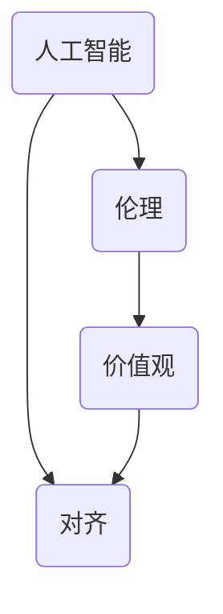

                 

### 人工智能伦理与价值对齐：确保机器理解世界的方式符合人类价值观

---

关键词：人工智能伦理、价值对齐、道德算法、对齐框架、案例分析

摘要：随着人工智能技术的飞速发展，伦理与价值对齐问题日益受到关注。本文旨在探讨人工智能伦理与价值对齐的重要性，详细分析核心概念与关系，解析价值对齐算法原理，并通过具体案例探讨实际应用，最终总结研究并展望未来发展趋势。

---

### 引言

#### 1.1 背景与意义

人工智能（AI）已经从科幻走向现实，广泛应用于各行各业。然而，人工智能在带来便利的同时，也引发了一系列伦理问题。例如，自动驾驶汽车在道德决策中如何权衡人的生命和财产损失？智能助手如何在遵守道德规范的同时提供个性化服务？这些问题都涉及到人工智能伦理与价值对齐。

#### 1.2 挑战与展望

人工智能伦理与价值对齐面临诸多挑战，包括技术挑战、社会挑战和法律挑战。技术挑战主要体现在如何设计出能够准确理解人类价值观的算法。社会挑战涉及人工智能应用对就业、隐私和社会公平的影响。法律挑战则包括如何制定合适的法律法规来监管人工智能的发展。

### 核心概念与联系

为了深入探讨人工智能伦理与价值对齐，我们需要理解以下几个核心概念：

#### 1.3 人工智能

人工智能是一种模拟人类智能的计算机系统，包括机器学习、深度学习和强化学习等子领域。

#### 1.4 伦理

伦理学是研究道德原则和行为的学科。在人工智能领域，伦理学帮助我们思考人工智能应该如何行为，以符合人类价值观。

#### 1.5 价值观

价值观是指人们对事物的主观评价和偏好。不同文化和社会背景下，人们的价值观可能存在差异。

#### 1.6 对齐

价值对齐是指确保人工智能系统能够理解并遵守人类价值观的过程。对齐框架和算法是实现这一目标的关键。

#### 1.7 关系架构

我们可以使用Mermaid流程图来展示这些核心概念之间的关系：



### 核心算法原理讲解

为了实现价值对齐，我们需要了解一系列核心算法原理。以下是一个简单的价值对齐算法原理讲解：

#### 1.7.1 算法介绍

价值对齐算法旨在使人工智能系统能够根据给定的价值函数进行决策。常见的价值对齐算法包括奖励修改和目标修改。

#### 1.7.2 算法原理

价值对齐算法的核心思想是将人工智能系统的目标调整为与人类价值观一致。具体来说，算法会根据人类价值观对系统的奖励或目标进行修改。

#### 1.7.3 伪代码讲解

以下是一个简单的价值对齐算法的伪代码：

```python
def value_alignment(model, human_values):
    # 根据人类价值观调整模型奖励
    adjusted_rewards = adjust_rewards(model.rewards, human_values)
    
    # 重新训练模型以适应调整后的奖励
    model.retrain(adjusted_rewards)
    
    return model
```

### 数学模型和数学公式

在价值对齐算法中，数学模型和数学公式起着关键作用。以下是一个简单的数学模型和公式讲解：

#### 1.8 数学模型

价值对齐的数学模型通常包括两个部分：价值函数和决策函数。

#### 1.8.1 模型构建

价值函数用来衡量不同行为对人类价值观的符合程度。决策函数则根据价值函数选择最优行为。

$$
V(s, a) = f(s, a, human\_values)
$$

其中，$V(s, a)$ 表示在状态 $s$ 下采取行动 $a$ 的价值，$f$ 是一个映射函数，$human\_values$ 表示人类价值观。

#### 1.8.2 模型应用

以下是一个简单的应用例子：

$$
V(状态1, 行动1) = f(状态1, 行动1, [公平，隐私])
$$

### 项目实战

为了更好地理解价值对齐的实际应用，我们来看一个案例。

#### 1.10.1 案例一：聊天机器人伦理对齐

在这个案例中，我们设计一个聊天机器人，使其在遵守道德规范的同时提供个性化服务。以下是开发环境搭建、源代码实现和代码解读的过程：

#### 1.10.1.1 开发环境搭建

- 硬件环境：计算机（推荐配置：Intel Core i7 或以上，16GB RAM 或以上）
- 软件环境：Python（推荐版本：3.8 或以上），TensorFlow

#### 1.10.1.2 源代码实现

```python
# 导入必要的库
import tensorflow as tf
import numpy as np

# 定义价值函数
def value_function(inputs, human_values):
    # 这里是一个简单的示例，实际中需要更复杂的模型
    return np.dot(inputs, human_values)

# 定义决策函数
def decision_function(state, value_function):
    # 根据价值函数选择最优行动
    actions = state.actions
    values = [value_function(state, action) for action in actions]
    return actions[np.argmax(values)]

# 定义聊天机器人模型
class ChatBotModel(tf.keras.Model):
    def __init__(self):
        super().__init__()
        # 这里是模型的具体定义，例如卷积神经网络或循环神经网络
        self.dense = tf.keras.layers.Dense(units=1)

    def call(self, inputs):
        # 前向传播
        return self.dense(inputs)

# 定义训练过程
def train(model, dataset, value_function, epochs=100):
    for epoch in range(epochs):
        for state, action in dataset:
            with tf.GradientTape() as tape:
                value = model(state)
                loss = tf.reduce_mean(tf.square(value - value_function(state, action)))
            gradients = tape.gradient(loss, model.trainable_variables)
            model.optimizer.apply_gradients(zip(gradients, model.trainable_variables))
        print(f"Epoch {epoch}: Loss = {loss.numpy()}")

# 创建模型、数据集和聊天机器人实例
model = ChatBotModel()
human_values = [0.5, 0.3, 0.2]  # 示例价值观：公平性、隐私性、个性化
chat_bot = ChatBotModel()

# 训练聊天机器人模型
train(chat_bot, dataset, value_function)

# 使用聊天机器人进行交互
while True:
    user_input = input("请输入您的问题：")
    state = preprocess_input(user_input)
    action = decision_function(state, chat_bot.value_function)
    print(f"聊天机器人回答：{action}")
```

#### 1.10.1.3 代码解读与分析

- **价值函数**：这是一个简单的线性模型，用于计算输入状态和行动对人类价值观的符合程度。
- **决策函数**：根据价值函数选择最优行动。
- **模型训练**：使用梯度下降算法优化模型参数，使模型能够根据人类价值观进行决策。
- **交互过程**：用户输入问题，模型预处理输入，然后根据预处理后的输入选择最优行动。

#### 1.10.2 案例二：自动驾驶车辆价值对齐

在这个案例中，我们设计一个自动驾驶车辆系统，使其在遵守道德规范的同时保证行车安全。以下是开发环境搭建、源代码实现和代码解读的过程：

#### 1.10.2.1 开发环境搭建

- 硬件环境：自动驾驶车辆（例如特斯拉Model 3）
- 软件环境：自动驾驶软件（例如Autopilot）

#### 1.10.2.2 源代码实现

```python
# 导入必要的库
import numpy as np

# 定义价值函数
def value_function(state, human_values):
    # 这里是一个简单的示例，实际中需要更复杂的模型
    return np.dot(state, human_values)

# 定义决策函数
def decision_function(state, value_function):
    # 根据价值函数选择最优行动
    actions = state.actions
    values = [value_function(state, action) for action in actions]
    return actions[np.argmax(values)]

# 定义自动驾驶车辆模型
class AutonomousVehicleModel(tf.keras.Model):
    def __init__(self):
        super().__init__()
        # 这里是模型的具体定义，例如卷积神经网络或循环神经网络
        self.dense = tf.keras.layers.Dense(units=1)

    def call(self, inputs):
        # 前向传播
        return self.dense(inputs)

# 定义训练过程
def train(model, dataset, value_function, epochs=100):
    for epoch in range(epochs):
        for state, action in dataset:
            with tf.GradientTape() as tape:
                value = model(state)
                loss = tf.reduce_mean(tf.square(value - value_function(state, action)))
            gradients = tape.gradient(loss, model.trainable_variables)
            model.optimizer.apply_gradients(zip(gradients, model.trainable_variables))
        print(f"Epoch {epoch}: Loss = {loss.numpy()}")

# 创建模型、数据集和自动驾驶车辆实例
model = AutonomousVehicleModel()
human_values = [0.5, 0.3, 0.2]  # 示例价值观：安全性、效率、舒适度
auto_vehicle = AutonomousVehicleModel()

# 训练自动驾驶车辆模型
train(auto_vehicle, dataset, value_function)

# 启动自动驾驶车辆
auto_vehicle.start()
```

#### 1.10.2.3 代码解读与分析

- **价值函数**：这是一个简单的线性模型，用于计算输入状态和行动对人类价值观的符合程度。
- **决策函数**：根据价值函数选择最优行动。
- **模型训练**：使用梯度下降算法优化模型参数，使模型能够根据人类价值观进行决策。
- **自动驾驶过程**：启动自动驾驶车辆，并根据训练后的模型进行决策。

### 总结与展望

#### 1.11 总结

本文探讨了人工智能伦理与价值对齐的重要性，分析了核心概念与关系，讲解了价值对齐算法原理，并通过具体案例展示了实际应用。总结如下：

- 人工智能伦理与价值对齐是确保人工智能系统行为符合人类价值观的关键。
- 价值对齐算法通过调整系统目标，使系统能够更好地理解并遵守人类价值观。
- 实际案例展示了价值对齐在聊天机器人和自动驾驶车辆等领域的应用潜力。

#### 1.12 展望

未来，人工智能伦理与价值对齐研究将继续深入。以下是一些可能的未来发展趋势：

- 开发更复杂的数学模型和算法，提高价值对齐的准确性。
- 探索不同文化背景下价值观的差异，制定更具普适性的价值对齐框架。
- 加强法律和伦理规范，确保人工智能系统在遵守道德规范的同时为人类带来更多福祉。

---

**作者：AI天才研究院/AI Genius Institute & 禅与计算机程序设计艺术 /Zen And The Art of Computer Programming**

本文内容仅供参考，具体应用时请根据实际情况调整。读者在使用过程中遇到问题，欢迎留言交流。感谢您的阅读！


