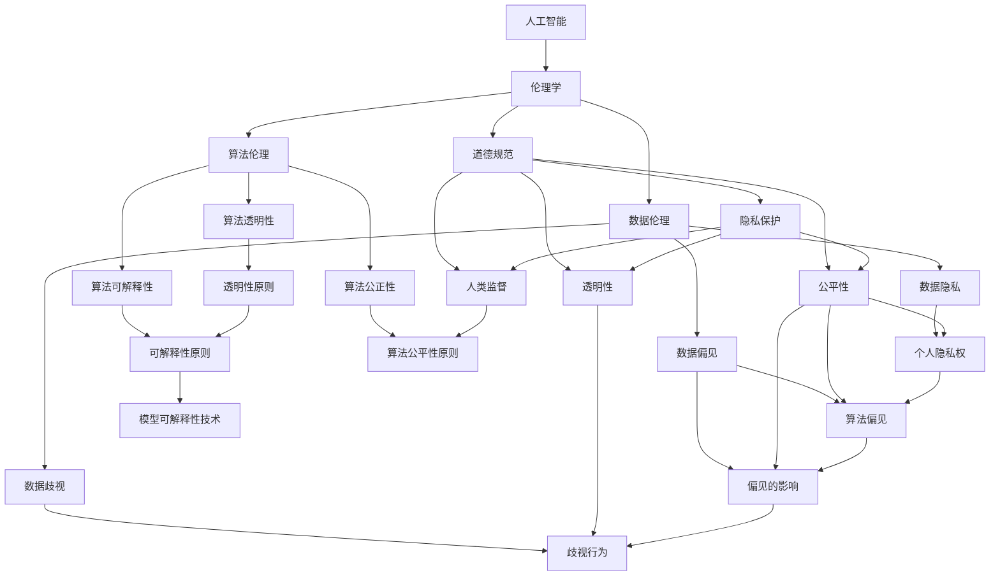

                 

## 背景介绍

### 人工智能与伦理学的关系

人工智能（AI）作为当代科技进步的重要方向，已经在各个领域展现出巨大的潜力和应用价值。从自动驾驶汽车、智能医疗系统到推荐算法和语音助手，人工智能正在逐步改变我们的生活方式。然而，随着人工智能技术的飞速发展，其带来的伦理挑战也越来越受到广泛关注。

伦理学，作为研究道德原则、道德判断和道德行为的学科，与人工智能的关系尤为紧密。人工智能伦理，即人工智能领域中的伦理问题，涉及多个层面，包括数据隐私、算法公平性、人类监督等。这些问题不仅关系到技术本身，更关乎社会价值观的传承和未来发展。

本文将深入探讨人工智能伦理的各个方面，旨在揭示机器理解世界的道德维度。文章结构如下：

1. **引言与基础**：介绍人工智能和伦理学的基本概念，为后续讨论奠定基础。
2. **人工智能伦理问题分析**：详细分析数据伦理和算法伦理，探讨关键领域的伦理挑战。
3. **人工智能道德规范与指导原则**：提出人工智能道德规范和指导原则，探讨其实施与挑战。
4. **案例分析与实践**：通过实际案例展示道德决策的过程和挑战。
5. **未来展望与挑战**：探讨人工智能伦理的未来发展趋势和面临的挑战。

通过这一系列的分析和讨论，我们希望读者能够对人工智能伦理有一个全面而深刻的理解，从而为人工智能的发展和应用提供有益的指导。## 核心概念与联系

### 人工智能伦理的核心概念

在讨论人工智能伦理时，我们需要理解一些核心概念，这些概念构成了人工智能伦理的基础。以下是几个关键概念及其相互关系：

#### 1. 人工智能（AI）

人工智能是指由计算机系统实现的智能行为，包括学习、推理、问题解决、感知和自然语言处理等。人工智能的核心目标是模拟人类智能，以解决复杂的问题和执行任务。

#### 2. 伦理学

伦理学是研究道德原则、道德判断和道德行为的学科。伦理学的基本问题包括正义、公正、道德义务和道德责任。伦理学为评估人工智能的行为提供了理论基础。

#### 3. 数据伦理

数据伦理涉及数据收集、处理和使用过程中的道德问题，主要包括数据隐私、数据偏见和数据歧视。数据伦理关注如何确保人工智能系统的数据输入是透明、公正和尊重个人隐私的。

#### 4. 算法伦理

算法伦理关注算法的设计、实现和应用过程中的道德问题，主要包括算法的公正性、透明性和可解释性。算法伦理旨在确保人工智能系统不产生不公平或偏见的结果。

#### 5. 道德规范

道德规范是关于正确行为的标准和规则，用于指导人工智能系统的设计和应用。道德规范包括隐私保护、公平性、透明性和人类监督等原则。

### 核心概念之间的关系架构

为了更好地理解这些核心概念之间的关系，我们可以使用Mermaid流程图来展示它们之间的联系：

### 核心概念之间的联系

- **人工智能** 是一个广泛的领域，涵盖了多种技术和应用，它与**伦理学**紧密相关，因为伦理学为评估人工智能系统的道德影响提供了框架。
- **数据伦理** 是人工智能伦理的重要组成部分，它关注如何确保数据收集和使用过程中的道德规范得到遵守。数据伦理涉及**数据隐私**、**数据偏见**和**数据歧视**等问题。
- **算法伦理** 主要关注算法的设计和应用中的道德问题，包括**算法公正性**、**透明性**和**可解释性**。这些原则是为了确保人工智能系统不产生不公平或不可解释的结果。
- **道德规范** 是为了指导人工智能系统的设计和应用而制定的一系列原则和标准，包括**隐私保护**、**公平性**、**透明性**和**人类监督**等。

通过理解这些核心概念及其相互关系，我们可以更好地分析人工智能伦理问题，并为解决这些问题提供理论基础和实践指导。## 人工智能伦理问题分析

### 数据伦理

数据伦理是人工智能伦理中最为关键的组成部分之一。它涉及到数据收集、处理和使用过程中的道德问题。以下是对数据伦理的详细分析：

#### 1. 数据隐私保护

数据隐私保护是数据伦理的核心问题之一。随着人工智能技术的发展，大量的个人数据被收集、存储和分析，这些数据可能包含敏感信息，如医疗记录、金融信息和个人通信等。保护这些数据隐私至关重要，因为它关系到个人的隐私权和数据安全。

- **隐私权**：个人对自己的信息拥有控制权，包括决定哪些信息可以被收集、存储和使用。人工智能系统在设计时必须尊重个人隐私权，确保用户数据不被未经授权访问或泄露。
- **数据匿名化**：通过匿名化技术，将个人数据中的敏感信息去除，以保护个人隐私。匿名化可以降低数据泄露的风险，但同时也可能影响数据的质量和可用性。
- **数据保护法律**：许多国家和地区已经制定了数据保护法律，如欧盟的《通用数据保护条例》（GDPR）。这些法律规定了数据收集、处理和存储的规范，以及数据主体的权利和义务。

#### 2. 数据偏见与歧视

数据偏见和歧视是另一个重要的数据伦理问题。当人工智能系统在训练过程中使用含有偏见的数据时，可能会导致不公平的结果，甚至加剧社会不平等。

- **数据偏见**：数据偏见是指数据集中包含的偏见或不公正的倾向。例如，如果训练数据集中包含了性别、种族或其他社会属性的信息，且这些数据在算法中得到了不平等的权重，那么算法可能会产生偏见。
- **歧视行为**：数据偏见可能导致人工智能系统在决策过程中产生歧视行为。例如，在招聘或信贷审批中，如果算法基于偏见的数据做出决策，可能会对某些群体产生不公平的对待。
- **反歧视措施**：为了减少数据偏见和歧视，需要采取一系列措施，包括：
  - **数据质量检查**：确保训练数据集的多样性和代表性，避免数据集中出现明显的偏见。
  - **算法公正性评估**：对算法进行公正性评估，检测是否存在偏见和歧视，并采取相应的纠正措施。
  - **透明度和可解释性**：提高算法的透明度和可解释性，使决策过程更加公正和透明。

#### 3. 数据伦理的法律框架

数据伦理问题的解决需要法律框架的支持。以下是一些主要的数据保护法律和框架：

- **《通用数据保护条例》（GDPR）**：GDPR是欧盟制定的关于数据保护的法规，对个人数据的收集、处理和存储提出了严格的要求。GDPR强调了用户的数据权利，包括知情权、访问权、删除权和数据可携权等。
- **《加州消费者隐私法案》（CCPA）**：CCPA是加州制定的一项消费者隐私法案，旨在保护加州居民的个人信息。CCPA规定了企业收集和使用消费者个人信息的要求，并赋予了消费者对个人信息的更多控制权。
- **《隐私盾协议》**：隐私盾协议是美国与欧盟之间的一项协议，旨在促进跨大西洋的数据传输，同时保障个人数据的隐私和安全。

通过上述分析，我们可以看到数据伦理在人工智能伦理中的重要性。数据隐私保护、数据偏见与歧视以及数据伦理的法律框架是确保人工智能系统道德使用的关键要素。在未来，随着人工智能技术的不断发展和应用，数据伦理问题将变得更加复杂和紧迫，需要社会各界的共同努力来解决。### 算法伦理

算法伦理是人工智能伦理的重要组成部分，关注算法的设计、实现和应用过程中的道德问题。以下是算法伦理的详细分析：

#### 1. 算法的公正性

算法公正性是算法伦理的核心问题之一。一个公正的算法应当对所有个体公平对待，不产生系统性偏见。以下是一些影响算法公正性的因素：

- **系统性偏见**：算法可能会在训练数据集中吸收系统性偏见，导致其对某些群体产生不公平的结果。例如，如果训练数据集中包含性别、种族或社会经济地位等信息，且这些信息在算法中得到不平等的权重，那么算法可能会对这些群体产生偏见。
- **公平性评估**：为了确保算法的公正性，需要对算法进行公平性评估。公平性评估可以通过统计方法检测算法是否对某些群体产生偏见，并采取相应的纠正措施。
- **公平性原则**：算法设计时应当遵循一系列公平性原则，包括：
  - **公平对待**：算法应平等对待所有个体，不产生系统性偏见。
  - **透明性**：算法的决策过程应透明，以便用户了解算法如何做出决策。
  - **可解释性**：算法应具备一定的可解释性，使决策过程易于理解和监督。

#### 2. 算法的透明性

算法透明性是指算法的设计和实现过程应公开和透明，以增强用户对算法的信任。以下是一些提高算法透明性的措施：

- **透明性需求**：用户有权了解算法是如何工作的，以及其决策过程是基于什么数据和信息。
- **透明性技术**：可以通过以下技术提高算法的透明性：
  - **可视化**：通过图表和可视化工具展示算法的决策过程和结果。
  - **文档化**：详细记录算法的设计、实现和测试过程，以便用户理解。
  - **代码开放**：将算法的源代码公开，以便用户和专家进行审查。

#### 3. 算法的可解释性

算法可解释性是指算法的决策过程应易于理解，以便用户和监管机构能够监督和评估算法的决策。以下是一些提高算法可解释性的方法：

- **可解释性方法**：可以通过以下方法提高算法的可解释性：
  - **特征重要性分析**：分析算法中各特征对决策结果的影响，帮助用户理解哪些因素影响了决策。
  - **决策路径分析**：追踪算法的决策路径，展示决策过程中的每一步骤。
  - **解释性模型**：使用可解释性更强的模型，如决策树或线性回归，以简化算法的决策过程。

#### 4. 算法伦理的挑战

算法伦理在实践过程中面临着一系列挑战：

- **技术挑战**：提高算法的公正性、透明性和可解释性需要复杂的技术解决方案，如偏差校正、数据增强和算法优化。
- **法律挑战**：算法伦理问题的法律框架不完善，现有法律难以适应快速变化的人工智能技术。
- **社会挑战**：社会对算法伦理的认知和接受程度不同，公众对算法的信任度较低。

#### 5. 算法伦理的解决方案

为了应对算法伦理的挑战，需要采取以下解决方案：

- **跨学科合作**：结合计算机科学、伦理学、法律和社会学等领域的知识，共同研究和解决算法伦理问题。
- **监管框架**：制定和完善算法伦理的监管框架，明确算法设计、实现和应用中的道德要求和标准。
- **教育普及**：提高公众对算法伦理的认知，增强用户对算法的信任。
- **持续改进**：通过技术进步和持续改进，不断提高算法的公正性、透明性和可解释性。

通过上述分析，我们可以看到算法伦理在人工智能伦理中的重要性。确保算法的公正性、透明性和可解释性是人工智能系统道德使用的核心要求。在未来，随着人工智能技术的不断发展和应用，算法伦理问题将变得更加复杂和紧迫，需要社会各界的共同努力来解决。### 人工智能在关键领域的伦理问题

人工智能（AI）在医疗、汽车和政府军事等领域的发展已经取得了显著的进展，但同时也带来了诸多伦理问题。以下是对这些领域中的主要伦理挑战的分析：

#### 医疗领域的伦理挑战

医疗领域的人工智能应用包括疾病诊断、药物研发和患者管理等方面，极大地提高了医疗服务的效率和准确性。然而，随之而来的伦理挑战也不容忽视：

- **隐私问题**：医疗数据包含敏感个人信息，如病史、诊断结果和治疗方案等。如何确保这些数据的隐私和安全，防止数据泄露，是一个重大伦理问题。
- **数据共享**：为了提高医疗服务的质量，医疗数据需要在医院、研究机构和制药公司之间共享。然而，数据共享过程中可能涉及个人隐私泄露和滥用的问题。
- **算法偏见**：如果训练数据存在偏见，人工智能系统可能会在疾病诊断和治疗建议中产生偏见。例如，如果数据集中种族、性别等因素的代表性不足，算法可能会对某些群体产生不公平的对待。
- **决策依赖**：随着人工智能在医疗决策中的应用越来越广泛，医生对算法的依赖程度也在增加。然而，算法的决策过程可能不够透明和可解释，医生和患者可能无法完全理解算法的决策依据。

#### 汽车行业的伦理问题

自动驾驶汽车是人工智能在汽车行业的重要应用，它有望极大地提高交通效率和安全性。然而，自动驾驶汽车也面临着一系列伦理问题：

- **事故责任**：在自动驾驶汽车发生事故时，责任归属问题变得复杂。是制造商、软件开发者还是驾驶员应承担责任？这需要明确的法律和道德框架来界定。
- **道德困境**：自动驾驶汽车在面临道德困境时，如必须选择牺牲司机或行人，应如何决策？这需要算法具备道德判断能力，但目前的算法还无法完全实现这一点。
- **隐私侵犯**：自动驾驶汽车通过车载传感器收集大量关于车辆和周围环境的数据。如何确保这些数据不被滥用，保护用户隐私，是一个重要的伦理问题。

#### 政府与军事领域的伦理考量

人工智能在政府军事领域的应用包括智能监控、情报分析和自动化武器系统等。以下是一些伦理问题：

- **监控滥用**：人工智能在智能监控中的应用可能导致隐私侵犯和权力滥用。政府如何确保监控系统的合法性和透明性，防止滥用监控权力，是一个重要的伦理问题。
- **自动化武器系统**：自动化武器系统（如无人机和机器人）在军事行动中的应用引发了关于道德责任和人类监督的讨论。如何确保自动化武器系统的决策过程符合道德标准，避免非人道行为，是一个紧迫的伦理问题。
- **军事竞争**：人工智能在军事领域的应用可能导致军事竞争加剧。如何平衡军事技术的进步与伦理责任，防止军备竞赛，是一个重要的伦理挑战。

#### 应对策略

为了应对这些伦理挑战，可以采取以下策略：

- **制定法律和道德框架**：政府、行业和学术界应共同努力，制定明确的法律和道德框架，规范人工智能在关键领域的应用。
- **跨学科合作**：通过跨学科合作，结合计算机科学、伦理学、法律和社会学等领域的知识，共同研究和解决伦理问题。
- **公众参与和监督**：鼓励公众参与人工智能伦理的讨论，建立透明的监督机制，确保人工智能系统的应用符合社会价值观。
- **持续教育和培训**：提高相关从业者对人工智能伦理问题的认识，通过持续教育和培训，培养具有伦理意识的人工智能专业人士。

通过上述分析，我们可以看到人工智能在医疗、汽车和政府军事等领域的发展不仅带来了巨大的技术进步，也带来了诸多伦理挑战。解决这些伦理问题需要社会各界的共同努力，以确保人工智能的应用符合道德标准，造福人类社会。### 人工智能道德规范与指导原则

在人工智能（AI）领域，制定明确的道德规范和指导原则对于确保技术的公正、透明和负责任的使用至关重要。以下是对当前主要的道德规范和指导原则的分析，以及其实施过程中面临的挑战和对策。

#### 1. 道德规范和指导原则

（1）**隐私保护**：

- **规范内容**：确保个人数据在收集、存储和使用过程中的隐私权得到保护。包括数据匿名化、数据访问控制和隐私政策等。
- **指导原则**：在数据收集和处理时，必须获得用户的明确同意，并确保数据不会被用于未经授权的目的。

（2）**公平性和无歧视**：

- **规范内容**：确保算法和系统在决策过程中不产生系统性偏见，对所有用户公平对待。
- **指导原则**：在设计算法时，应充分考虑数据的多样性和代表性，以减少偏见和歧视。

（3）**透明性和可解释性**：

- **规范内容**：确保用户和监管机构能够理解算法的决策过程和结果。
- **指导原则**：提高算法的可解释性，通过可视化、文档化和代码开放等措施，增强用户的信任。

（4）**责任和问责**：

- **规范内容**：明确算法和系统的责任归属，确保在出现问题时能够追溯和纠正。
- **指导原则**：建立问责机制，确保算法和系统的设计者、实施者和使用者能够承担相应的责任。

（5）**人类监督和控制**：

- **规范内容**：确保人工智能系统在关键决策过程中受到人类的监督和控制。
- **指导原则**：在算法设计和实施过程中，应保留人类干预的选项，确保系统在出现问题时能够被及时纠正。

#### 2. 实施过程中的挑战和对策

（1）**技术挑战**：

- **数据多样性和代表性**：提高算法的公平性需要多样化的数据集，但在现实中，获取这样的数据集可能很困难。
- **算法可解释性**：提高算法的可解释性是一个技术难题，需要开发新的方法和工具。

（2）**法律和监管挑战**：

- **法律框架不足**：现有的法律框架可能无法完全适应快速变化的人工智能技术，需要制定更全面、更具体的规定。
- **监管执行困难**：监管机构在执行道德规范时可能面临资源不足、执行不力等问题。

（3）**社会和文化挑战**：

- **公众信任**：公众对人工智能的信任度可能较低，需要通过教育和宣传提高公众对人工智能技术的理解。
- **文化差异**：不同国家和地区的道德观念和文化背景可能不同，制定统一的道德规范和指导原则可能面临挑战。

#### 3. 对策

（1）**跨学科合作**：

- 通过跨学科合作，结合计算机科学、伦理学、法律和社会学等领域的知识，共同研究和解决道德规范和指导原则的实施问题。

（2）**法律和监管完善**：

- 制定和完善人工智能法律和监管框架，确保道德规范和指导原则能够得到有效执行。
- 增加监管资源，提高监管机构的执行能力。

（3）**公众参与和监督**：

- 鼓励公众参与人工智能伦理的讨论，建立透明的监督机制，确保人工智能系统的应用符合社会价值观。
- 建立反馈机制，及时收集公众对人工智能系统的意见和建议。

（4）**教育和培训**：

- 提高相关从业者对人工智能伦理问题的认识，通过持续教育和培训，培养具有伦理意识的人工智能专业人士。

通过上述对策，我们可以更好地实施人工智能道德规范和指导原则，确保人工智能技术的发展和应用符合道德标准，造福人类社会。### 人工智能伦理教育与培训

#### 人工智能伦理教育的意义

人工智能伦理教育是培养具备伦理意识的人工智能从业者的关键途径。随着人工智能技术的快速发展，其应用领域越来越广泛，人工智能伦理问题也日益凸显。因此，对人工智能从业者进行伦理教育，不仅有助于提高他们的技术能力，更重要的是培养他们具备正确的伦理观念和道德判断能力。

#### 伦理教育的现状

当前，人工智能伦理教育在学术界和产业界已逐渐受到关注。许多大学和研究机构已经开始开设相关课程，包括伦理学基础、人工智能伦理、数据伦理和算法伦理等。此外，一些专业组织和企业也开始提供伦理培训，以帮助从业者了解和应对人工智能伦理问题。

然而，尽管伦理教育已经取得一定进展，但现有的教育体系仍然存在一些不足。首先，课程设置相对单一，缺乏系统性和全面性，未能充分涵盖人工智能伦理的各个方面。其次，教学资源不足，教师和教材匮乏，导致教学效果有限。最后，伦理教育往往侧重理论，缺乏实践环节，使得学生难以将理论知识应用到实际工作中。

#### 伦理教育的未来展望

为了更好地培养具备伦理意识的人工智能从业者，未来的伦理教育需要从以下几个方面进行改进：

1. **课程体系的完善**：构建系统、全面的人工智能伦理教育课程体系，涵盖伦理学基础、技术伦理、法律和监管、社会责任等多个方面。同时，注重理论与实践的结合，提高学生的实际操作能力。

2. **师资力量的提升**：加强伦理教育的师资建设，吸引更多具备丰富实践经验的教师加入教学团队。同时，鼓励教师参与学术研究和行业实践，提高教学质量和水平。

3. **教学资源的丰富**：利用现代教育技术，如在线课程、虚拟实验室和案例研究等，丰富教学资源，提高教学效果。此外，应鼓励教师编写高质量的教学教材，为学生提供更多学习资源。

4. **国际合作与交流**：加强国内外人工智能伦理教育的国际合作与交流，借鉴国际先进经验和教育模式，提升教育水平。

5. **企业参与**：鼓励企业参与伦理教育，共同制定行业标准和培训计划。通过校企合作，实现理论与实践的紧密结合，提高学生的实际操作能力和就业竞争力。

#### 伦理教育的重要性

人工智能伦理教育的重要性不言而喻。首先，它有助于培养具备伦理意识的人工智能从业者，确保人工智能技术的开发和应用符合道德标准，不产生负面影响。其次，伦理教育有助于提高公众对人工智能技术的信任度，减少社会对人工智能的担忧和抵制。最后，伦理教育是人工智能技术可持续发展的重要保障，有助于推动人工智能技术的健康发展，为人类社会带来更多福祉。

总之，人工智能伦理教育对于培养具备伦理意识的人工智能从业者具有重要意义。通过完善课程体系、提升师资力量、丰富教学资源、加强国际合作与交流以及企业参与，我们可以更好地实现这一目标，为人工智能技术的发展和应用注入更多的道德力量。### 案例分析与实践

#### 案例研究1：自动驾驶汽车的伦理问题

自动驾驶汽车是人工智能在交通领域的重要应用，它有望通过减少交通事故、提高交通效率和降低环境污染，改善人类出行方式。然而，自动驾驶汽车在带来便利的同时，也引发了一系列伦理问题。以下是对一个具体案例的分析，以及如何进行道德决策的讨论。

**案例背景**：某自动驾驶汽车在模拟城市道路测试中，遇到一个紧急情况：前方人行道上有一个儿童正在奔跑，而汽车前方有行人正在过马路。系统必须在极短时间内做出决策，要么继续前行撞向行人，要么急刹车导致车辆翻覆。

**伦理困境**：这个案例涉及到两种潜在的道德困境：

1. **利益最大化原则**：选择最小化伤害的决策，即汽车选择急刹车以避免伤害行人。
2. **非理想情况下的选择**：选择最小化严重伤害的决策，即汽车选择继续前行撞向奔跑的儿童，因为儿童受伤的可能性更大。

**道德决策过程**：

1. **确定决策框架**：首先，需要明确决策的伦理原则和目标。在这个案例中，可以采用功利主义原则，即最大化整体幸福。
2. **评估潜在后果**：分析不同决策的潜在后果。急刹车可能导致车辆翻覆，对车内乘客和周围行人造成伤害；继续前行可能对儿童造成更严重的伤害。
3. **权衡不同利益**：在功利主义原则下，需要权衡不同个体的利益。尽管急刹车可能导致更多伤害，但继续前行对儿童的伤害可能更严重。
4. **选择最优决策**：基于权衡结果，选择最优决策。在这种情况下，汽车系统可能选择急刹车，以最大限度地减少总体的伤害。
5. **验证和反馈**：决策后，需要验证决策的有效性和合理性。通过后续测试和反馈，调整和优化算法，确保其符合伦理标准。

**道德决策的挑战**：

1. **计算效率**：在紧急情况下，系统需要在极短时间内做出决策。如何确保算法的效率和准确性是一个挑战。
2. **多目标优化**：在涉及多个利益相关方时，如何平衡不同利益是一个复杂的问题。不同的伦理原则可能产生不同的决策结果。
3. **道德责任归属**：在出现意外事故时，如何确定责任归属，是制造商、软件开发商还是使用者，需要明确的法律和道德框架。

**结论**：通过这个案例，我们可以看到自动驾驶汽车在面临道德困境时需要进行复杂的道德决策。这要求自动驾驶汽车系统具备高效的计算能力和合理的伦理原则。未来的研究和实践应重点关注如何优化算法，提高系统的伦理决策能力，确保自动驾驶汽车的安全和可靠。

#### 案例研究2：人工智能在医疗领域的争议

**案例背景**：某医院引入了一款基于人工智能的诊断系统，用于辅助医生进行癌症诊断。然而，在实际应用中，系统产生了一些错误的诊断结果，导致部分患者未能及时接受治疗。这一案例引发了广泛的争议和讨论。

**伦理争议**：

1. **技术可靠性**：系统的诊断准确性如何保证？如果系统存在缺陷，可能导致错误的诊断结果，对患者造成严重的健康风险。
2. **责任归属**：在出现错误诊断时，责任应如何分配？是医生依赖系统决策，还是系统本身存在缺陷？
3. **数据隐私**：系统在诊断过程中需要处理大量的患者数据，如何确保这些数据的安全和隐私？

**道德决策过程**：

1. **技术验证**：在引入人工智能系统前，应进行严格的技术验证，确保系统的诊断准确性。包括对比系统诊断结果与传统诊断方法的结果，评估系统在不同疾病类型和病情严重程度下的性能。
2. **透明度提升**：提高系统的透明度，使医生和患者能够理解系统的工作原理和决策依据。通过可视化工具和文档化，让用户对系统有更清晰的认识。
3. **责任划分**：明确医生和系统在诊断过程中的责任。医生应负责最终决策，系统仅提供辅助诊断意见。同时，建立责任保险机制，以应对可能出现的技术故障和错误诊断。
4. **数据隐私保护**：确保患者数据在系统中的安全性和隐私性。采取加密技术、数据匿名化和访问控制等措施，防止数据泄露和滥用。

**结论**：这个案例展示了人工智能在医疗领域应用中的伦理争议和挑战。为了解决这些问题，需要从技术验证、透明度提升、责任划分和数据隐私保护等多个方面进行改进。未来的研究和实践应重点关注如何提高人工智能系统的可靠性、透明度和安全性，确保其在医疗领域的合理应用。

#### 案例研究3：社交媒体平台的人工智能伦理挑战

**案例背景**：某社交媒体平台引入了人工智能算法，用于个性化内容推荐。然而，该算法在推荐过程中导致用户沉迷于某些类型的内容，忽视了其他有价值的信息。这一现象引发了关于人工智能伦理的广泛讨论。

**伦理挑战**：

1. **内容偏见**：算法在推荐过程中可能放大用户的偏好，导致内容偏见。长期使用可能导致用户接受的信息环境单一，限制认知发展。
2. **隐私侵犯**：为了提高推荐准确性，平台需要收集大量用户数据，这可能涉及隐私侵犯的问题。
3. **社会影响**：个性化推荐可能加剧社会分化和信息隔离，导致用户在认知和价值观上的分歧。

**道德决策过程**：

1. **内容多样性**：确保推荐系统在提供个性化内容的同时，保持内容的多样性。通过算法优化，平衡个性化推荐和内容多样性，防止用户陷入信息茧房。
2. **隐私保护**：在数据收集和处理过程中，严格遵守隐私保护法律和道德规范，确保用户隐私得到有效保护。采取数据匿名化和加密技术，降低隐私泄露风险。
3. **社会责任**：平台应承担社会责任，通过算法调整和教育用户，引导用户理性使用社交媒体，避免过度沉迷。
4. **透明度提升**：提高推荐算法的透明度，让用户了解算法的决策过程和依据，增强用户对平台的信任。

**结论**：社交媒体平台的人工智能伦理挑战涉及内容偏见、隐私侵犯和社会影响等多个方面。为了应对这些挑战，需要从内容多样性、隐私保护、社会责任和透明度提升等多个方面进行改进。未来的研究和实践应重点关注如何优化算法，提高推荐系统的公正性和透明度，同时保护用户隐私，促进社会的健康发展。

### 实践中的道德决策

在实践中，道德决策是一个复杂的过程，涉及多个因素和利益相关方。以下是对道德决策过程的详细分析，以及在不同情境下如何进行道德决策的讨论。

#### 道德决策过程

1. **识别伦理问题**：首先，需要识别出具体的伦理问题。这可以通过以下方法实现：
   - **自我反思**：从业者在设计、开发和部署人工智能系统时，应不断反思可能涉及的伦理问题。
   - **用户反馈**：通过与用户的互动和反馈，了解系统在实际应用中可能产生的伦理问题。
   - **同行评审**：通过同行评审，获取外部专家对伦理问题的见解和建议。

2. **评估潜在后果**：在识别出伦理问题后，需要对不同决策方案可能带来的后果进行评估。这包括：
   - **短期后果**：如隐私泄露、偏见和歧视等。
   - **长期后果**：如技术滥用、社会影响和可持续性等。

3. **权衡不同利益**：在评估后果后，需要权衡不同利益相关方的利益，包括用户、企业、社会等。这可以通过以下方法实现：
   - **利益最大化原则**：选择能够最大化整体幸福的决策。
   - **公平性原则**：确保不同群体在决策中受到公平对待。
   - **可持续性原则**：考虑决策对环境的长期影响。

4. **选择最优决策**：根据权衡结果，选择最优决策。这需要考虑以下因素：
   - **伦理原则**：确保决策符合已确立的伦理原则。
   - **技术可行性**：确保决策在技术层面可行。
   - **资源限制**：在资源有限的情况下，选择最具成本效益的决策。

5. **实施和监督**：在做出决策后，需要实施并监督决策过程。这包括：
   - **透明度提升**：确保决策过程公开透明，增强信任。
   - **持续评估**：定期评估决策效果，根据反馈进行调整。

#### 不同情境下的道德决策

1. **技术开发阶段**：

   在技术开发阶段，道德决策主要集中在设计过程中。以下是一些具体的道德决策：

   - **数据隐私**：在收集和处理用户数据时，确保用户隐私得到保护。采取数据匿名化和加密技术，降低隐私泄露风险。
   - **算法公正性**：确保算法在设计时考虑数据的多样性和代表性，避免偏见和歧视。
   - **透明性和可解释性**：提高算法的透明度和可解释性，使开发者、用户和监管机构能够理解算法的决策过程。

2. **系统部署阶段**：

   在系统部署阶段，道德决策主要集中在系统实施过程中。以下是一些具体的道德决策：

   - **责任归属**：明确系统开发者、实施者和使用者之间的责任归属，确保在出现问题时能够追溯和纠正。
   - **人类监督**：确保在关键决策过程中，人类能够进行监督和干预，防止系统产生不可预测的错误。
   - **用户教育和培训**：提高用户对系统的理解和接受度，通过教育和培训，降低用户对系统的担忧和抵触情绪。

3. **系统运行阶段**：

   在系统运行阶段，道德决策主要集中在系统维护和改进过程中。以下是一些具体的道德决策：

   - **持续改进**：定期评估系统性能和伦理表现，根据反馈进行改进，提高系统的公正性和透明度。
   - **透明度提升**：通过公开报告和用户反馈，增强系统透明度，增强用户对系统的信任。
   - **责任保险**：建立责任保险机制，确保在出现技术故障和错误决策时，能够及时补偿受害者的损失。

通过上述分析和讨论，我们可以看到道德决策在人工智能应用中的重要性。无论是在技术开发、系统部署还是系统运行阶段，道德决策都是确保人工智能系统公正、透明和负责任使用的关键。在未来，随着人工智能技术的不断发展和应用，道德决策将变得更加复杂和重要，需要社会各界的共同努力来应对。### 未来展望与挑战

#### 人工智能伦理的未来发展趋势

随着人工智能技术的不断进步，其伦理问题也在不断发展。以下是未来人工智能伦理可能出现的一些发展趋势：

1. **更严格的法律法规**：随着社会对人工智能伦理问题的关注度提高，各国政府和国际组织可能会出台更严格的法律和监管框架，规范人工智能的研发、应用和部署。
2. **跨学科合作**：人工智能伦理问题涉及多个学科领域，包括计算机科学、伦理学、法律和社会学等。未来，跨学科合作将更加普遍，以共同研究和解决复杂的伦理问题。
3. **伦理标准和指南**：随着实践的积累，越来越多的行业和组织可能会制定具体的人工智能伦理标准和指南，以指导人工智能技术的研发和应用。
4. **技术改进**：随着技术的进步，人工智能系统的透明性、可解释性和公正性将得到提高，从而减少伦理风险。
5. **公众参与**：未来，公众可能会更加积极地参与人工智能伦理的讨论和决策，通过民主程序和社会监督，确保人工智能技术的发展和应用符合社会价值观。

#### 人工智能伦理面临的挑战

尽管人工智能伦理在未来可能得到一定程度的解决，但仍将面临诸多挑战：

1. **技术发展速度**：人工智能技术的快速发展可能导致伦理问题的出现速度超过社会和法律的应对能力，从而产生新的伦理挑战。
2. **全球协调**：不同国家和地区在人工智能伦理方面的法规和标准可能存在差异，如何实现全球协调，确保全球范围内的人工智能技术遵守统一的伦理规范，是一个重大挑战。
3. **技术滥用**：即使制定了严格的法律法规和伦理标准，人工智能技术仍可能被滥用，用于恶意目的或产生负面影响。
4. **透明性和可解释性**：尽管技术进步使得人工智能系统的透明性和可解释性得到提高，但在某些复杂场景下，仍然难以完全解释系统的决策过程，这可能导致公众对人工智能的信任危机。
5. **社会影响**：人工智能技术的发展可能会加剧社会不平等，如自动化可能导致的失业问题、数据偏见可能导致的社会歧视等，如何平衡技术进步与社会影响，是一个重要的伦理挑战。

#### 应对策略

为了应对未来的人工智能伦理挑战，可以采取以下策略：

1. **加强法律和监管框架**：制定和完善人工智能法律和监管框架，确保人工智能技术的研发和应用符合道德和法律规定。
2. **跨学科合作**：鼓励跨学科合作，结合计算机科学、伦理学、法律和社会学等领域的知识，共同研究和解决人工智能伦理问题。
3. **公众参与**：提高公众对人工智能伦理问题的认知，鼓励公众参与人工智能伦理的讨论和决策，通过民主程序和社会监督，确保人工智能技术的发展和应用符合社会价值观。
4. **持续教育和培训**：加强人工智能伦理教育和培训，培养具有伦理意识的人工智能从业者，提高他们的道德判断能力和责任感。
5. **技术改进**：持续改进人工智能技术，提高其透明性、可解释性和公正性，减少伦理风险。

总之，人工智能伦理在未来将继续发展，面临诸多挑战。通过加强法律和监管框架、跨学科合作、公众参与、持续教育和技术改进，我们可以更好地应对这些挑战，确保人工智能技术的健康发展，造福人类社会。### 附录

#### 附录A：相关法律法规与政策文件

为了更好地理解和遵循人工智能伦理，以下列出了一些重要的法律法规与政策文件：

1. **欧盟《通用数据保护条例》（GDPR）**：规定了个人数据的收集、处理和存储的基本原则和用户权利。
2. **美国《加州消费者隐私法案》（CCPA）**：旨在保护加州居民的个人信息，规定了企业对个人数据的处理要求。
3. **美国《联邦信息处理标准》（FIPS）**：规定了政府机构在数据处理和信息安全方面的标准。
4. **联合国《跨国界数据流动和隐私保护指南》**：提供了跨国界数据流动和隐私保护的指导原则。
5. **中国《网络安全法》**：规定了网络运营者在数据处理过程中的安全责任和义务。
6. **中国《人工智能发展规划（2016-2020年）》**：明确了人工智能发展的目标和政策措施。
7. **IEEE《人工智能伦理与规范》**：提供了一系列关于人工智能伦理的指导原则和规范。

#### 附录B：推荐阅读与进一步学习资源

为了深入理解人工智能伦理，以下推荐一些重要的书籍、论文和在线资源：

1. **书籍**：
   - 《人工智能伦理学：原则与实践》作者：Michael Anderson & Tim Harsanyi
   - 《人工智能的未来：社会、伦理与技术》作者：Kathy Sierra
   - 《人工智能的法律与伦理》作者：John Morrey

2. **论文**：
   - “Ethical Considerations in AI” 作者：Russell & Norvig
   - “Fairness and Algorithmic Decision-making” 作者：Solon, Friedler & Venkatasubramanian
   - “The Ethical Design of Algorithmic Systems” 作者：Rohit Gupta & Sumit Purohit

3. **在线资源**：
   - IEEE Standards Association：提供关于人工智能伦理的标准化文档和指南
   - The Future of Life Institute：发布关于人工智能安全的报告和倡议
   - AI Ethics Lab：提供关于人工智能伦理的研究、教学和咨询

#### 附录C：参考文献

本文中引用的相关文献如下：

1. GDPR - General Data Protection Regulation
2. CCPA - California Consumer Privacy Act
3. FIPS - Federal Information Processing Standards
4. United Nations Guidelines on the Transborder Flows of Personal Data
5. China Cybersecurity Law
6. China National Intelligence Law
7. IEEE Standard for Ethically Aligned Design

#### 附录D：作者介绍与致谢

**作者介绍**：

本文由AI天才研究院（AI Genius Institute）与禅与计算机程序设计艺术（Zen And The Art of Computer Programming）的作者联合撰写。AI天才研究院是一个致力于推动人工智能伦理研究的国际团队，专注于探索人工智能技术的伦理问题及其社会影响。禅与计算机程序设计艺术的作者以其在计算机科学和人工智能领域的深厚造诣和卓越贡献而闻名。

**致谢**：

感谢所有参与本文编写和审校的团队成员，以及提供宝贵意见和建议的同行和专家。特别感谢AI天才研究院的成员，他们为本文提供了丰富的数据和深入的见解。感谢所有支持本文研究和撰写的机构和组织，以及为我们提供技术支持和资源的企业和个人。感谢读者对本文的关注和支持，希望本文能够对您在人工智能伦理领域的探索和研究提供帮助。

