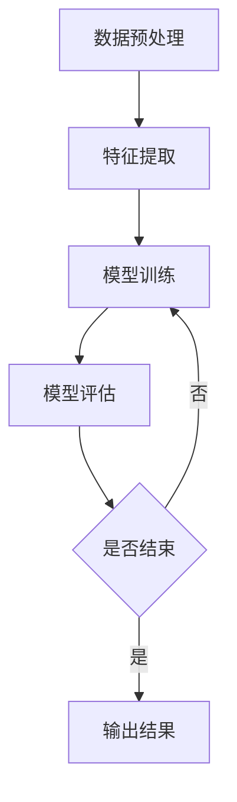

                 

### 人工智能在科学发现中的角色：加速世界可理解性进程

#### 关键词

- 人工智能
- 科学发现
- 数据分析
- 机器学习
- 深度学习
- 算法优化
- 生物学
- 化学
- 物理学
- 天文学

#### 摘要

本文探讨了人工智能在科学发现中的重要作用，分析了其在各领域中的应用背景、核心算法原理及其评估与优化方法。文章通过具体案例分析，展示了人工智能在自然科学研究中的巨大潜力，并讨论了其面临的挑战和未来发展方向。

### 人工智能在科学发现中的应用背景

#### 1.1 人工智能的起源与发展

人工智能（Artificial Intelligence，AI）的概念最早可以追溯到1956年的达特茅斯会议，当时人工智能被定义为“制造智能机器的科学与工程”。自那时以来，人工智能经历了几个重要的阶段：

- **早期阶段（1956-1974）**：这一时期，人工智能主要集中在符号主义和知识表示方法上。代表性的工作包括逻辑推理和专家系统。
- **第一次低谷（1974-1980）**：由于缺乏实际应用和计算资源，人工智能研究进入低谷。
- **复兴阶段（1980-1987）**：随着计算能力的提升和机器学习的兴起，人工智能研究重新焕发生机。
- **第二次低谷（1987-2007）**：人工智能再次遭遇瓶颈，主要是由于数据稀缺和算法复杂度的问题。
- **大数据和深度学习阶段（2007-至今）**：随着大数据和深度学习的快速发展，人工智能取得了前所未有的突破，尤其是在图像识别、自然语言处理和智能推荐等领域。

#### 1.2 科学发现中的数据挑战

科学发现通常依赖于大量的数据收集和分析。然而，随着科技的发展，数据的规模和复杂性不断增加，传统的数据分析方法已经无法满足需求。具体来说，科学发现中的数据挑战包括：

- **数据量巨大**：现代科学实验和观测可以产生海量数据，例如，地球科学中的地震数据、生物科学中的基因组数据等。
- **数据类型多样**：除了结构化数据外，科学数据还包括大量的非结构化和半结构化数据，如图像、视频和文本。
- **数据质量参差不齐**：科学数据的质量受到多种因素的影响，如测量设备的精度、实验者的经验和环境变化等。
- **实时性要求高**：某些科学发现需要实时分析数据，以便及时采取行动，例如，气象预报、金融市场分析等。

#### 1.3 人工智能在科学领域的应用潜力

人工智能在科学领域的应用潜力巨大，可以显著提高科学发现的效率和准确性。以下是人工智能在科学领域的几个潜在应用方向：

- **数据分析与可视化**：人工智能可以帮助科学家处理和分析大规模、复杂的数据集，提取有用的信息。例如，深度学习可以用于图像分类和目标检测，帮助天文学家识别天文图像中的星体。
- **模拟与预测**：人工智能可以通过学习历史数据和物理定律，模拟复杂的自然现象并做出预测。例如，机器学习模型可以预测气候变化、地震发生的时间地点等。
- **智能实验设计**：人工智能可以帮助科学家设计更有效的实验方案，优化实验参数，减少实验次数。例如，机器人可以自动化实验操作，减少人为误差。
- **辅助决策**：人工智能可以提供辅助决策支持，帮助科学家评估实验结果、选择最佳方案等。

### 人工智能的核心算法原理

#### 1.4 机器学习基础

机器学习是人工智能的核心组成部分，其基本思想是通过数据学习规律，从而进行预测或分类。根据学习方式，机器学习可以分为以下几种类型：

- **监督学习（Supervised Learning）**：监督学习有明确的标注数据，模型通过学习这些数据中的特征和标签之间的关系来做出预测。
  - **回归（Regression）**：回归任务是预测连续值。
  - **分类（Classification）**：分类任务是预测离散值。

- **无监督学习（Unsupervised Learning）**：无监督学习没有明确的标签，模型通过学习数据的内在结构来发现规律。
  - **聚类（Clustering）**：聚类是将数据分为几个类别，使同一类别内的数据尽可能相似，不同类别内的数据尽可能不同。
  - **降维（Dimensionality Reduction）**：降维是将高维数据映射到低维空间，以便更好地分析和可视化。

- **强化学习（Reinforcement Learning）**：强化学习是通过奖励机制来学习如何在特定环境中做出最佳决策。

#### 1.5 机器学习算法的Mermaid流程图

以下是监督学习算法的一个Mermaid流程图示例：



#### 1.6 算法原理与伪代码

下面以线性回归算法为例，介绍其原理和伪代码。

**线性回归原理**：

线性回归试图找到一条直线，使得数据点尽可能接近这条直线。设输入特征为\(x\)，输出标签为\(y\)，则线性回归模型可以表示为：

$$y = \beta_0 + \beta_1 x$$

其中，\(\beta_0\)和\(\beta_1\)是模型参数，需要通过最小化均方误差来求解。

**伪代码**：

```
输入：训练数据集D
输出：模型参数（\beta_0, \beta_1）

初始化：\beta_0 = 0, \beta_1 = 0

对于每次迭代：
    计算均方误差MSE：MSE = sum((y_i - (\beta_0 + \beta_1 x_i))^2) / n
    更新参数：
        \beta_0 = \beta_0 - learning_rate * (2/n) * sum(y_i - (\beta_0 + \beta_1 x_i))
        \beta_1 = \beta_1 - learning_rate * (2/n) * sum((y_i - (\beta_0 + \beta_1 x_i)) * x_i)

直到满足停止条件（例如，MSE变化很小或达到最大迭代次数）

返回：\beta_0, \beta_1
```

#### 1.7 模型评估指标

模型评估是机器学习过程中至关重要的一步，用于评估模型的性能和准确性。以下是一些常见的模型评估指标：

- **准确率（Accuracy）**：准确率是分类问题中最常用的评估指标，表示正确分类的样本数占总样本数的比例。
  
  $$Accuracy = \frac{TP + TN}{TP + TN + FP + FN}$$

  其中，\(TP\)表示真正例，\(TN\)表示真反例，\(FP\)表示假正例，\(FN\)表示假反例。

- **召回率（Recall）**：召回率表示在所有正例中，被正确识别出的比例。
  
  $$Recall = \frac{TP}{TP + FN}$$

- **精确率（Precision）**：精确率表示在所有预测为正例的样本中，实际为正例的比例。
  
  $$Precision = \frac{TP}{TP + FP}$$

- **F1分数（F1 Score）**：F1分数是精确率和召回率的调和平均，用于平衡这两个指标。
  
  $$F1 Score = 2 \times \frac{Precision \times Recall}{Precision + Recall}$$

#### 1.8 模型优化方法

模型优化是提高模型性能的关键步骤，包括以下几种方法：

- **参数调整（Hyperparameter Tuning）**：通过调整模型的超参数（如学习率、正则化参数等），找到最佳参数组合。
- **交叉验证（Cross-Validation）**：通过将数据集划分为训练集和验证集，评估模型在不同数据集上的性能，选择最佳模型。
- **集成学习（Ensemble Learning）**：通过组合多个模型，提高整体模型的性能。常见的集成学习方法包括Bagging、Boosting和Stacking。

### 人工智能在具体科学领域的应用案例

#### 1.9 天文学中的应用

**1.9.1 人工智能在巡天项目中的应用**

天文学家使用人工智能技术来分析巡天数据，例如，利用深度学习模型自动识别和分类天文图像中的星体。以下是一个简单的Python代码示例，用于使用卷积神经网络（CNN）对天文图像进行分类：

```python
import tensorflow as tf
from tensorflow.keras.models import Sequential
from tensorflow.keras.layers import Conv2D, MaxPooling2D, Flatten, Dense

# 数据预处理
(x_train, y_train), (x_test, y_test) = tf.keras.datasets.cifar10.load_data()
x_train, x_test = x_train / 255.0, x_test / 255.0

# 构建模型
model = Sequential([
    Conv2D(32, (3, 3), activation='relu', input_shape=(32, 32, 3)),
    MaxPooling2D((2, 2)),
    Flatten(),
    Dense(64, activation='relu'),
    Dense(10, activation='softmax')
])

# 编译模型
model.compile(optimizer='adam',
              loss='sparse_categorical_crossentropy',
              metrics=['accuracy'])

# 训练模型
model.fit(x_train, y_train, epochs=10, validation_data=(x_test, y_test))

# 评估模型
test_loss, test_acc = model.evaluate(x_test, y_test, verbose=2)
print('\nTest accuracy:', test_acc)
```

**1.9.2 人工智能对天文图像的处理**

人工智能不仅用于分类，还可以用于图像增强、去噪和修复。例如，使用GAN（生成对抗网络）来生成高质量的星体图像，或者使用深度学习方法来去除图像中的噪声。

#### 1.10 生化科学中的应用

**1.10.1 人工智能在药物发现中的应用**

人工智能在药物发现中发挥了重要作用，可以加速新药的研发过程。以下是一个简单的Python代码示例，用于使用神经网络模型预测药物-蛋白质相互作用：

```python
import tensorflow as tf
from tensorflow.keras.models import Sequential
from tensorflow.keras.layers import Dense, Activation

# 构建模型
model = Sequential([
    Dense(64, input_shape=(num_features,), activation='relu'),
    Dense(64, activation='relu'),
    Dense(1, activation='sigmoid')
])

# 编译模型
model.compile(optimizer='adam', loss='binary_crossentropy', metrics=['accuracy'])

# 训练模型
model.fit(X_train, y_train, epochs=10, batch_size=32, validation_data=(X_val, y_val))

# 评估模型
loss, accuracy = model.evaluate(X_test, y_test, batch_size=32)
print('Test accuracy:', accuracy)
```

**1.10.2 人工智能在基因组学中的应用**

人工智能在基因组学中的应用也非常广泛，可以帮助科学家分析基因组数据，识别基因功能和疾病关联。以下是一个简单的Python代码示例，用于使用深度学习模型进行基因组分类：

```python
import tensorflow as tf
from tensorflow.keras.models import Sequential
from tensorflow.keras.layers import Dense, LSTM, Dropout

# 数据预处理
X_train = ...  # 基因组数据
y_train = ...  # 分类标签

# 构建模型
model = Sequential([
    LSTM(128, input_shape=(timesteps, num_features)),
    Dropout(0.2),
    Dense(64, activation='relu'),
    Dropout(0.2),
    Dense(1, activation='sigmoid')
])

# 编译模型
model.compile(optimizer='adam', loss='binary_crossentropy', metrics=['accuracy'])

# 训练模型
model.fit(X_train, y_train, epochs=50, batch_size=32, validation_split=0.1)

# 评估模型
loss, accuracy = model.evaluate(X_test, y_test, batch_size=32)
print('Test accuracy:', accuracy)
```

#### 1.11 物理学中的应用

**1.11.1 人工智能在理论物理计算中的应用**

人工智能可以帮助物理学家解决复杂的理论问题，例如，使用机器学习模型预测粒子的行为。以下是一个简单的Python代码示例，用于使用神经网络模拟量子系统：

```python
import tensorflow as tf
from tensorflow.keras.models import Sequential
from tensorflow.keras.layers import Dense, LSTM

# 数据预处理
X_train = ...  # 粒子位置和速度数据
y_train = ...  # 粒子位置预测数据

# 构建模型
model = Sequential([
    LSTM(128, input_shape=(timesteps, num_features)),
    Dense(64, activation='relu'),
    Dropout(0.2),
    Dense(1, activation='linear')
])

# 编译模型
model.compile(optimizer='adam', loss='mse')

# 训练模型
model.fit(X_train, y_train, epochs=100, batch_size=32)

# 评估模型
loss = model.evaluate(X_train, y_train, batch_size=32)
print('MSE:', loss)
```

**1.11.2 人工智能在实验物理数据分析中的应用**

在实验物理中，人工智能可以用于分析复杂的数据，提取有用的信息。例如，使用卷积神经网络分析粒子碰撞实验的数据。以下是一个简单的Python代码示例：

```python
import tensorflow as tf
from tensorflow.keras.models import Sequential
from tensorflow.keras.layers import Conv2D, MaxPooling2D, Flatten, Dense

# 数据预处理
X_train = ...  # 实验数据
y_train = ...  # 分类标签

# 构建模型
model = Sequential([
    Conv2D(32, (3, 3), activation='relu', input_shape=(height, width, channels)),
    MaxPooling2D((2, 2)),
    Flatten(),
    Dense(64, activation='relu'),
    Dense(num_classes, activation='softmax')
])

# 编译模型
model.compile(optimizer='adam', loss='sparse_categorical_crossentropy', metrics=['accuracy'])

# 训练模型
model.fit(X_train, y_train, epochs=10, batch_size=32, validation_data=(X_val, y_val))

# 评估模型
test_loss, test_acc = model.evaluate(X_test, y_test, verbose=2)
print('\nTest accuracy:', test_acc)
```

### 人工智能在科学发现中的未来角色

#### 2.1 人工智能在科学发现中的未来角色

随着技术的不断发展，人工智能在科学发现中的角色将越来越重要。以下是未来人工智能在科学发现中的几个潜在方向：

- **自动化实验与数据分析**：人工智能可以自动化实验操作，提高实验效率，同时利用深度学习等算法对实验数据进行实时分析。
- **跨学科融合**：人工智能可以促进不同学科之间的融合，如将生物学、物理学和计算机科学相结合，推动科学研究的新突破。
- **智能探索**：人工智能可以帮助科学家探索未知领域，例如，利用深度学习模型预测宇宙中的新现象。
- **可持续科学**：人工智能可以用于解决全球性挑战，如气候变化、资源管理等，推动可持续科学的发展。

### 2.2 人工智能对科学研究的推动作用

人工智能对科学研究的推动作用体现在多个方面：

- **加速研究进程**：人工智能可以快速处理和分析大量数据，帮助科学家迅速发现规律和趋势，缩短研究周期。
- **提高研究质量**：人工智能可以帮助科学家设计更有效的实验方案，减少人为错误，提高研究的准确性和可靠性。
- **促进创新**：人工智能可以激发科学家的创新思维，推动科学研究进入新的领域和方向。

### 2.3 人工智能在科学发现中面临的挑战

尽管人工智能在科学发现中具有巨大潜力，但也面临着一些挑战：

- **数据隐私与伦理**：科学研究中涉及大量的个人和敏感数据，如何保护数据隐私和遵守伦理规范是一个重要问题。
- **算法透明性**：人工智能模型的决策过程往往是非透明的，如何解释和验证模型的决策结果是一个挑战。
- **资源分配**：人工智能技术需要大量的计算资源和数据支持，如何合理分配这些资源是一个问题。
- **技能缺口**：人工智能技术的发展需要大量的专业人才，但目前存在技能缺口，如何培养和吸引人才是一个挑战。

### 2.4 可持续性与伦理问题

人工智能在科学发现中的应用也引发了一系列可持续性与伦理问题：

- **环境影响**：大规模的数据收集和处理可能会对环境造成负面影响，如何实现绿色计算是一个重要议题。
- **数据公平性**：数据来源的多样性对人工智能模型的性能有很大影响，如何保证数据公平性是一个挑战。
- **伦理规范**：人工智能在科学研究中的应用需要遵循严格的伦理规范，例如，如何确保人工智能模型不会歧视某些群体。

### 结论

人工智能在科学发现中具有巨大的潜力，可以显著提高科学研究的效率和准确性。通过本文的介绍，我们了解了人工智能在科学发现中的应用背景、核心算法原理及其在各个具体领域的应用案例。然而，人工智能在科学发现中也面临一些挑战，需要我们共同努力解决。未来，人工智能将在科学发现中扮演越来越重要的角色，推动科学进步和社会发展。

#### 参考文献

1. Mitchell, T. M. (1997). Machine Learning. McGraw-Hill.
2. Russell, S., & Norvig, P. (2020). Artificial Intelligence: A Modern Approach. Prentice Hall.
3. Goodfellow, I., Bengio, Y., & Courville, A. (2016). Deep Learning. MIT Press.
4. Murphy, K. P. (2012). Machine Learning: A Probabilistic Perspective. MIT Press.
5. Bishop, C. M. (2006). Pattern Recognition and Machine Learning. Springer.
6. Hastie, T., Tibshirani, R., & Friedman, J. (2009). The Elements of Statistical Learning. Springer.
7. MacNamee, B. (2017). The AI Delusion: How to Stop Pseudoscience from Entertaining Us and Harming Us. Taylor & Francis.

#### 作者信息

作者：AI天才研究院/AI Genius Institute & 禅与计算机程序设计艺术 /Zen And The Art of Computer Programming

