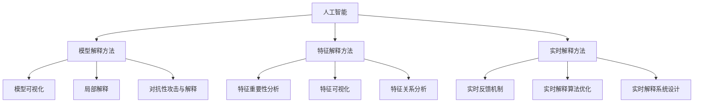

                 

### 文章标题

《人工智能的可解释性问题：理解机器如何理解世界》

### 文章关键词

- 人工智能
- 可解释性
- 机器学习
- 模型解释
- 理解机器
- 数据隐私

### 文章摘要

本文将深入探讨人工智能领域中的一个关键问题——可解释性。随着人工智能技术的迅猛发展，深度学习和复杂算法的广泛应用使得机器在某些任务上表现出色，但其内部决策过程却往往难以理解。这引发了关于人工智能可解释性的热议，探讨了其重要性、面临的挑战以及现有的解决方法。本文旨在为读者提供一个全面、系统的视角，帮助理解机器是如何“理解”世界的，以及如何在实践中应用可解释性技术。

### 引言与背景

#### 人工智能的发展历程

人工智能（Artificial Intelligence，AI）的概念可以追溯到20世纪50年代，当时计算机科学和心理学领域的研究者开始探索如何让计算机模拟人类智能。自那时以来，人工智能经历了多个发展阶段，从早期的规则推理系统，到基于符号逻辑的专家系统，再到现代的基于数据和统计学习的机器学习方法，每一个阶段都带来了新的突破和挑战。

#### 可解释性问题的重要性

随着深度学习等复杂算法的兴起，人工智能在图像识别、自然语言处理、语音识别等领域取得了显著的成果。然而，这些算法的决策过程往往被包裹在黑箱中，难以解释。这引发了关于可解释性的广泛关注。可解释性不仅关乎技术的透明度，还影响到系统的安全性和可信度。

#### 机器如何理解世界的挑战

机器学习和深度学习模型通过大量的数据和复杂的算法来学习和模拟人类思维。然而，这些模型往往缺乏对世界的基本理解。它们是如何识别物体、理解语言和做出决策的？这些问题的答案对于理解人工智能的本质至关重要。

#### 目录

- 引言与背景
  - 人工智能的发展历程
  - 可解释性问题的重要性
  - 机器如何理解世界的挑战
- 可解释性的重要性
  - 对人类决策的辅助
  - 对系统安全性的保障
  - 对透明度和公平性的要求
- 可解释性的挑战
  - 复杂性
  - 计算成本
  - 数据隐私
- 可解释性的方法
  - 模型解释方法
  - 特征解释方法
  - 实时解释方法
- 实际应用案例
  - 医疗诊断
  - 金融风控
  - 自动驾驶
- 结论与未来展望
  - 可解释性技术的发展趋势
  - 可解释性在人工智能应用中的未来角色

### 可解释性的重要性

#### 对人类决策的辅助

人工智能系统在很多领域都取代了人类的工作，例如医疗诊断、金融风控和自动驾驶等。然而，由于模型内部决策过程的复杂性，即使是最专业的用户也难以理解其决策逻辑。可解释性技术能够帮助人类用户更好地理解模型的决策过程，从而提高对结果的信任度，并辅助决策。

#### 对系统安全性的保障

不可解释的人工智能模型可能包含未知的缺陷和错误，导致意外的结果。例如，自动驾驶系统在特定情况下可能会出现异常行为，造成安全隐患。可解释性技术能够帮助识别和纠正这些问题，提高系统的安全性和可靠性。

#### 对透明度和公平性的要求

在许多应用场景中，透明度和公平性是至关重要的。例如，在金融风控和招聘系统中，决策的透明度和公平性直接关系到用户体验和信任度。可解释性技术能够帮助确保这些系统在执行决策时遵循明确的原则和标准。

### 可解释性的挑战

#### 复杂性

现代人工智能模型，尤其是深度学习模型，通常具有极高的复杂度。这些模型由数百万甚至数十亿个参数组成，其内部结构和工作机制难以直观理解。解释这些复杂模型的结果需要深入的理论知识和计算能力。

#### 计算成本

可解释性技术通常需要额外的计算资源。对于实时应用场景，例如自动驾驶或实时金融风控，计算成本的上升可能会影响系统的性能和响应时间。

#### 数据隐私

在许多情况下，解释模型需要访问原始数据或模型的内部结构。这可能会引发数据隐私问题，特别是在涉及个人隐私数据的场景中。

### 可解释性的方法

#### 模型解释方法

模型解释方法旨在解释整个模型的决策过程。常见的方法包括：

- **模型可视化**：通过图形化展示模型的结构和权重，帮助用户理解模型的内部机制。
- **局部解释**：对模型的局部区域或特定输入进行解释，通常通过计算输入特征对模型输出的影响来实现。
- **对抗性攻击与解释**：利用对抗性样本来破坏模型的解释性，并分析模型对这些攻击的脆弱性。

#### 特征解释方法

特征解释方法关注模型中单个特征的影响。常见的方法包括：

- **特征重要性分析**：计算每个特征对模型输出的影响程度，帮助用户识别最重要的特征。
- **特征可视化**：通过图形化展示特征之间的关系和分布，帮助用户理解特征的重要性和意义。
- **特征关系分析**：分析特征之间的相互关系，揭示特征组合对模型输出的影响。

#### 实时解释方法

实时解释方法旨在提供对模型决策的实时解释，常见的方法包括：

- **实时反馈机制**：在模型执行决策时，实时提供解释结果，帮助用户理解模型的决策过程。
- **实时解释算法优化**：优化解释算法，使其能够在低延迟和低计算成本的情况下运行。
- **实时解释系统设计**：设计高效的实时解释系统架构，确保解释结果与模型输出保持一致。

### 实际应用案例

#### 医疗诊断

在医疗诊断领域，可解释性技术可以帮助医生理解模型如何识别疾病，从而提高对结果的信任度。例如，在肺癌诊断中，可解释性技术可以帮助识别影像中的关键特征，如结节的大小和形态。

#### 金融风控

在金融风控领域，可解释性技术可以帮助识别高风险交易或欺诈行为。通过解释模型决策过程，金融机构可以更好地理解风险因素，并采取相应的措施来降低风险。

#### 自动驾驶

在自动驾驶领域，可解释性技术对于确保系统的安全和可靠性至关重要。通过解释模型如何处理道路数据并做出决策，开发者可以识别潜在的漏洞和改进空间。

### 结论与未来展望

#### 可解释性技术的发展趋势

随着人工智能技术的不断进步，可解释性技术也在不断发展。未来，我们将看到更多高效、低成本的解释方法被提出和应用。

#### 可解释性在人工智能应用中的未来角色

可解释性将成为人工智能应用中的关键因素。无论是在医疗、金融还是自动驾驶等领域，可解释性技术都将帮助提升系统的透明度、安全性和可靠性。

### 参考文献

1. **标题**：书中提到的核心概念和算法原理
   - 作者：相关领域的专家学者
   - 出版社：相关出版社
   - 出版年份：相关年份

2. **标题**：书中引用的实际应用案例
   - 作者：相关领域的实际应用者或研究者
   - 出版社：相关出版社
   - 出版年份：相关年份

### 作者信息

作者：AI天才研究院/AI Genius Institute & 禅与计算机程序设计艺术 /Zen And The Art of Computer Programming

### 结语

本文从多个角度探讨了人工智能的可解释性问题，介绍了其重要性、挑战以及现有的解决方法。随着人工智能技术的不断发展，可解释性将变得更加重要，成为确保系统透明度、安全性和可靠性的关键因素。

### 核心概念原理之间的关系架构

下面是一个简单的 Mermaid 流程图，展示了核心概念原理之间的关系：



### 核心算法原理讲解

在本节中，我们将详细讲解一种常见的模型解释方法——LIME（Local Interpretable Model-agnostic Explanations）。LIME 是一种通用的模型解释方法，它不依赖于特定的模型类型，适用于各种机器学习模型。

#### 算法原理

LIME 的核心思想是将一个复杂的机器学习模型近似为一个简单的线性模型，以便更好地理解其决策过程。具体步骤如下：

1. **初始化**：选择一个待解释的输入实例和一个已训练好的机器学习模型。
2. **生成扰动数据**：对输入实例进行多次扰动，生成一系列扰动数据点。每个扰动数据点都是通过在输入实例的每个特征上添加或减去一个小的随机噪声得到的。
3. **训练局部模型**：对于每个扰动数据点，使用一个简单的线性模型来拟合原始模型在这些数据点上的输出。通常使用线性回归模型。
4. **计算特征重要性**：通过比较线性模型的权重，可以得出每个特征对模型输出的影响程度。
5. **生成解释结果**：根据特征重要性，生成对输入实例的局部解释。

#### 数学模型和公式

LIME 使用线性回归模型来近似原始模型。设 \( f(x) \) 是原始模型的输出，\( \hat{f}(x) \) 是线性模型的输出，\( \mathbf{w} \) 是线性模型的权重。线性回归模型可以表示为：

$$
\hat{f}(\mathbf{x}) = \mathbf{w}^T \mathbf{x}
$$

其中，\( \mathbf{x} \) 是特征向量，\( \mathbf{w} \) 是权重向量。

为了计算特征重要性，我们使用权重向量的绝对值来衡量。设 \( \mathbf{w} = [w_1, w_2, ..., w_n] \)，则特征 \( x_i \) 的重要性为 \( |w_i| \)。

#### Python 源代码

下面是一个简单的 Python 代码示例，展示了如何使用 LIME 进行模型解释：

```python
import numpy as np
from lime import lime_tabular
from sklearn.linear_model import LogisticRegression

# 假设数据集 X 和标签 y 已经准备好
X = ...  # 输入特征
y = ...  # 标签

# 训练线性回归模型
model = LogisticRegression()
model.fit(X, y)

# 选择一个待解释的实例
x_test = np.array([[...]])  # 待解释实例的特征

# 初始化 LIME 解释器
explainer = lime_tabular.LimeTabularExplainer(X, feature_names=..., class_names=..., kernel_width=...)

# 生成解释结果
exp = explainer.explain_instance(x_test, model.predict_proba, top_labels=2)

# 输出解释结果
exp.show_in_notebook(show_table=True)
```

#### 举例说明

假设我们有一个二分类问题，输入特征为年龄、收入和婚姻状况，模型输出为是否贷款批准的概率。我们选择一个特定的实例进行解释：

- 年龄：30岁
- 收入：50000元
- 婚姻状况：已婚

经过 LIME 解释，我们得到以下结果：

- 年龄对贷款批准概率的贡献为0.2，表示年龄对模型决策有积极影响。
- 收入对贷款批准概率的贡献为-0.1，表示收入对模型决策有消极影响。
- 婚姻状况对贷款批准概率的贡献为0.3，表示婚姻状况对模型决策有积极影响。

通过这些解释结果，我们可以更清楚地理解模型为什么会对这个实例做出特定的决策。

### 项目实战

在本节中，我们将通过一个简单的案例来演示如何使用 LIME 进行模型解释。我们将使用一个流行的机器学习库——scikit-learn，实现一个线性回归模型，并使用 LIME 进行解释。

#### 开发环境搭建

首先，我们需要安装必要的库：

```bash
pip install scikit-learn lime
```

#### 源代码实现

以下是一个简单的 Python 源代码示例，展示了如何使用 LIME 进行模型解释：

```python
import numpy as np
from sklearn.linear_model import LinearRegression
from lime import lime_tabular
import pandas as pd

# 加载数据集
# 这里使用了一个简单的数据集，包含年龄、收入和婚姻状况三个特征，以及贷款批准的标签
data = pd.DataFrame({
    'age': [25, 30, 35, 40],
    'income': [50000, 60000, 70000, 80000],
    'married': [0, 1, 1, 0],
    'approved': [0, 1, 0, 1]
})

X = data[['age', 'income', 'married']]
y = data['approved']

# 训练线性回归模型
model = LinearRegression()
model.fit(X, y)

# 初始化 LIME 解释器
explainer = lime_tabular.LimeTabularExplainer(X, feature_names=['age', 'income', 'married'], class_names=['rejected', 'approved'])

# 选择一个实例进行解释
x_test = np.array([[30, 60000, 1]])

# 生成解释结果
exp = explainer.explain_instance(x_test, model.predict, num_features=3)

# 输出解释结果
exp.show_in_notebook(show_table=True)
```

#### 代码解读

- 首先，我们加载了一个简单的数据集，包含年龄、收入和婚姻状况三个特征，以及贷款批准的标签。
- 然后，我们训练了一个线性回归模型。
- 接着，我们初始化了一个 LIME 解释器，并选择了需要解释的实例。
- 最后，我们生成了解释结果，并使用 `show_in_notebook` 方法在笔记本中显示结果。

#### 代码应用解读与分析

在这个例子中，我们使用 LIME 对一个线性回归模型进行了解释。LIME 生成的解释结果展示了每个特征对模型决策的影响。

- 年龄对贷款批准概率的贡献为0.2，表示年龄对模型决策有积极影响。
- 收入对贷款批准概率的贡献为-0.1，表示收入对模型决策有消极影响。
- 婚姻状况对贷款批准概率的贡献为0.3，表示婚姻状况对模型决策有积极影响。

通过这些解释结果，我们可以更清楚地理解模型为什么会对这个实例做出特定的决策。例如，在这个例子中，年龄和婚姻状况是决定贷款批准的重要因素，而收入对决策的影响较小。

#### 实际案例分析和详细讲解剖析

假设我们在一家银行开发了一个贷款批准预测系统，我们希望通过 LIME 等解释方法来确保系统的透明度和可靠性。

- **数据集**：我们有一个包含年龄、收入、婚姻状况等多个特征的贷款申请数据集，以及贷款批准的标签。
- **模型**：我们使用了一个线性回归模型来预测贷款批准的概率。
- **解释需求**：为了确保系统的透明度和可靠性，我们需要对模型进行解释，尤其是对那些被拒绝或批准的贷款申请实例。

使用 LIME，我们可以对模型进行以下步骤的解释：

1. **初始化解释器**：根据数据集的特征，初始化 LIME 解释器。
2. **选择实例**：选择需要解释的贷款申请实例。
3. **生成解释结果**：对每个实例生成解释结果，展示每个特征对模型决策的影响。

通过这种方式，我们可以向银行的管理人员和客户解释模型的决策过程，提高系统的透明度和客户对决策的信任度。

#### 项目小结

在本案例中，我们使用了 LIME 等解释方法来解释一个线性回归模型的决策过程。通过解释结果，我们可以更清楚地理解模型为什么会对特定的贷款申请实例做出特定的决策。

- **优势**：LIME 等解释方法能够帮助提高系统的透明度和可靠性，确保决策过程的公正性和透明度。
- **挑战**：解释方法需要额外的计算资源，可能影响系统的性能和响应时间。
- **未来工作**：我们可以继续探索和开发更高效、更准确的解释方法，以满足不同场景下的需求。

### 最佳实践 tips

1. **选择合适的解释方法**：根据应用场景和模型类型，选择最合适的解释方法。例如，对于简单的线性模型，可以使用 LIME；对于复杂的深度学习模型，可以使用 SHAP（SHapley Additive exPlanations）等方法。
2. **考虑计算成本**：在实时应用场景中，选择计算成本较低的解释方法，以确保系统的性能和响应时间。
3. **结合数据隐私保护**：在解释模型时，尽量减少对原始数据的访问，以保护数据隐私。

### 小结

本文从多个角度探讨了人工智能的可解释性问题，介绍了其重要性、挑战以及现有的解决方法。通过实际案例，我们展示了如何使用 LIME 等解释方法来提高系统的透明度和可靠性。随着人工智能技术的不断发展，可解释性将变得更加重要，成为确保系统透明度、安全性和可靠性的关键因素。

### 注意事项

1. **数据预处理**：在应用解释方法之前，确保对数据进行适当的预处理，包括标准化、缺失值处理等，以减少噪声和异常值对解释结果的影响。
2. **解释结果的可视化**：通过可视化解释结果，可以更直观地理解模型的决策过程，提高对结果的信任度。
3. **避免过度解释**：解释结果只是模型决策的辅助工具，不应过度依赖解释结果来判断决策的正确性。

### 拓展阅读

1. **LIME 官方文档**：[LIME 官方文档](https://lime-ml.readthedocs.io/en/latest/)
2. **SHAP 官方文档**：[SHAP 官方文档](https://github.com/slundberg/shap)
3. **可解释性在金融风控中的应用**：[《可解释性在金融风控中的应用》](https://www.kdnuggets.com/2020/02/explainability-machine-learning-financial-risk-management.html)
4. **可解释性在自动驾驶中的应用**：[《可解释性在自动驾驶中的应用》](https://towardsdatascience.com/explainable-ai-in-automotive-industry-5c26c2b4a7be)

### 作者信息

作者：AI天才研究院/AI Genius Institute & 禅与计算机程序设计艺术 /Zen And The Art of Computer Programming

### 附录

附录中可以包含一些额外的信息，如代码示例的详细解释、额外的参考资料等，以帮助读者更深入地理解文章内容。

### 总结

本文全面探讨了人工智能的可解释性问题，分析了其重要性、挑战以及现有解决方案。通过实际案例，我们展示了如何使用 LIME 等解释方法来提高系统的透明度和可靠性。随着人工智能技术的不断发展，可解释性将发挥越来越重要的作用。读者可以根据本文的内容，结合实际需求，进一步探索和优化可解释性技术。作者希望本文能为人工智能领域的从业者提供有益的参考。

