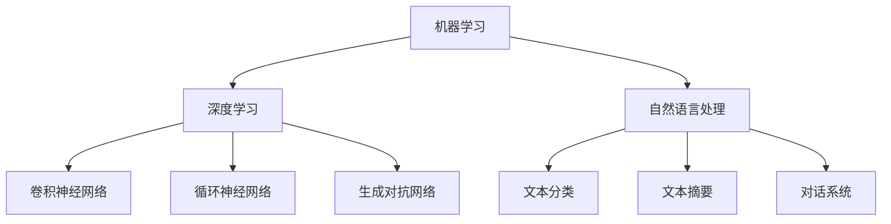

                 

```markdown
# 人工智能辅助科研：扩展世界可理解性

> 关键词：人工智能，科研，辅助技术，算法，数学模型，项目实战

> 摘要：
本文章旨在探讨人工智能在科研领域的应用，通过深入分析人工智能的基本原理、核心算法以及数学模型，展示人工智能如何扩展我们对世界的理解。文章还将通过实际项目案例，详细解读人工智能在科研中的开发环境搭建、源代码实现与代码解读，以及项目小结与未来展望。

## 引言

在当今科技高速发展的时代，人工智能（AI）已经成为推动社会进步的重要力量。科研领域也不例外，人工智能的引入极大地提升了科研工作的效率和准确性。本文将聚焦于人工智能在科研中的应用，旨在探讨如何利用AI技术扩展我们对世界的理解。

### 人工智能在科研中的应用概述

人工智能在科研中的应用非常广泛，包括但不限于以下领域：

1. **数据分析与挖掘**：利用机器学习算法对大量科研数据进行处理，提取有价值的信息。
2. **实验设计与优化**：通过人工智能算法优化实验设计，提高实验效率和结果可靠性。
3. **知识图谱构建**：利用自然语言处理技术构建科研领域的知识图谱，为科研提供知识支持。
4. **预测与模拟**：基于深度学习模型进行预测和模拟，为科研提供理论依据。

### 科研与人工智能的融合趋势

随着人工智能技术的不断发展，科研与人工智能的融合趋势日益明显。以下是一些融合趋势：

1. **跨学科研究**：人工智能技术与其他学科（如生物学、物理学、化学等）相结合，推动交叉学科研究的发展。
2. **自动化科研流程**：利用人工智能自动化科研流程，提高科研效率。
3. **科研工具智能化**：开发智能化科研工具，辅助科研人员更快速地完成研究工作。
4. **数据驱动科研**：以数据为中心，利用人工智能分析大量数据，驱动科研创新。

## 核心概念与联系

在深入了解人工智能在科研中的应用之前，我们需要先掌握一些核心概念和原理。以下是对这些概念和原理的简要介绍。

### 人工智能的基本原理

人工智能的基本原理包括：

1. **机器学习**：通过训练模型从数据中学习规律。
2. **深度学习**：一种基于多层神经网络的机器学习技术。
3. **自然语言处理**：使计算机能够理解、生成和处理人类语言。

### 科研中的常用算法和技术

在科研中，常用的算法和技术包括：

1. **线性回归**：用于预测连续值。
2. **支持向量机**：用于分类和回归问题。
3. **卷积神经网络**：用于图像识别和图像处理。
4. **循环神经网络**：用于序列数据处理。
5. **生成对抗网络**：用于图像生成和图像处理。

### 核心概念原理之间的关系架构

以下是核心概念原理之间的关系架构 Mermaid 流程图：



## 核心算法原理讲解

在理解了核心概念后，我们将深入讲解一些关键算法原理，并使用Python源代码进行说明。

### 机器学习算法

机器学习算法包括监督学习、无监督学习和强化学习。以下是对这些算法的简要介绍：

#### 监督学习

监督学习算法通过已标记的数据进行训练，然后用于预测未知数据。例如，线性回归和支持向量机。

#### 无监督学习

无监督学习算法没有已标记的数据，通过自身从数据中学习规律。例如，K均值聚类和主成分分析。

#### 强化学习

强化学习算法通过不断尝试和错误来学习最优策略。例如，Q-learning算法和深度强化学习。

### 深度学习算法

深度学习算法包括卷积神经网络（CNN）、循环神经网络（RNN）和生成对抗网络（GAN）。

#### 卷积神经网络（CNN）

卷积神经网络是一种用于图像识别和图像处理的深度学习算法。以下是一个简单的CNN模型实现：

```python
import tensorflow as tf
from tensorflow.keras import datasets, layers, models

# 加载和预处理数据
(train_images, train_labels), (test_images, test_labels) = datasets.cifar10.load_data()
train_images, test_images = train_images / 255.0, test_images / 255.0

# 构建CNN模型
model = models.Sequential()
model.add(layers.Conv2D(32, (3, 3), activation='relu', input_shape=(32, 32, 3)))
model.add(layers.MaxPooling2D((2, 2)))
model.add(layers.Conv2D(64, (3, 3), activation='relu'))
model.add(layers.MaxPooling2D((2, 2)))
model.add(layers.Conv2D(64, (3, 3), activation='relu'))

# 添加全连接层和输出层
model.add(layers.Flatten())
model.add(layers.Dense(64, activation='relu'))
model.add(layers.Dense(10))

# 编译和训练模型
model.compile(optimizer='adam',
              loss=tf.keras.losses.SparseCategoricalCrossentropy(from_logits=True),
              metrics=['accuracy'])
model.fit(train_images, train_labels, epochs=10)
```

#### 循环神经网络（RNN）

循环神经网络是一种用于序列数据处理的深度学习算法。以下是一个简单的RNN模型实现：

```python
import tensorflow as tf
from tensorflow.keras.models import Sequential
from tensorflow.keras.layers import LSTM, Dense

# 加载数据
x = ... # 序列数据
y = ... # 标签数据

# 构建RNN模型
model = Sequential()
model.add(LSTM(50, activation='relu', return_sequences=True, input_shape=(x.shape[1], x.shape[2])))
model.add(LSTM(50, activation='relu'))
model.add(Dense(1))

# 编译和训练模型
model.compile(optimizer='adam', loss='mse')
model.fit(x, y, epochs=20)
```

#### 生成对抗网络（GAN）

生成对抗网络是一种用于图像生成和图像处理的深度学习算法。以下是一个简单的GAN模型实现：

```python
import tensorflow as tf
from tensorflow.keras import layers

# 定义生成器和判别器
def make_generator_model():
    model = tf.keras.Sequential()
    model.add(layers.Dense(7 * 7 * 256, use_bias=False, input_shape=(100,)))
    model.add(layers.BatchNormalization())
    model.add(layers.LeakyReLU())
    model.add(layers.Reshape((7, 7, 256)))
    model.add(layers.Conv2DTranspose(128, (5, 5), strides=(1, 1), padding='same', use_bias=False))
    model.add(layers.BatchNormalization())
    model.add(layers.LeakyReLU())
    model.add(layers.Conv2DTranspose(64, (5, 5), strides=(2, 2), padding='same', use_bias=False))
    model.add(layers.BatchNormalization())
    model.add(layers.LeakyReLU())
    model.add(layers.Conv2DTranspose(1, (5, 5), strides=(2, 2), padding='same', use_bias=False, activation='tanh'))
    return model

def make_discriminator_model():
    model = tf.keras.Sequential()
    model.add(layers.Conv2D(64, (5, 5), strides=(2, 2), padding='same', input_shape=[28, 28, 1]))
    model.add(layers.LeakyReLU())
    model.add(layers.Dropout(0.3))
    model.add(layers.Conv2D(128, (5, 5), strides=(2, 2), padding='same'))
    model.add(layers.LeakyReLU())
    model.add(layers.Dropout(0.3))
    model.add(layers.Flatten())
    model.add(layers.Dense(1))
    return model

# 编译和训练GAN模型
generator = make_generator_model()
discriminator = make_discriminator_model()

# ...

```

### 自然语言处理算法

自然语言处理算法包括词嵌入技术、语义分析和对话系统。

#### 词嵌入技术

词嵌入技术是一种将词汇映射到高维空间的方法。以下是一个简单的Word2Vec模型实现：

```python
import gensim.downloader as api

# 加载预训练模型
model = api.load("glove-wiki-gigaword-100")

# 将词汇映射到向量
vector = model["hello"]
```

#### 语义分析

语义分析是一种理解文本语义意义的方法。以下是一个简单的文本分类模型实现：

```python
import tensorflow as tf
from tensorflow.keras.preprocessing.sequence import pad_sequences
from tensorflow.keras.layers import Embedding, LSTM, Dense
from tensorflow.keras.models import Sequential

# 加载和预处理数据
sentences = ["This is a good movie.", "That movie was not good."]
labels = [1, 0]

# 序列化词汇
tokenizer = tf.keras.preprocessing.text.Tokenizer()
tokenizer.fit_on_texts(sentences)
sequences = tokenizer.texts_to_sequences(sentences)

# 填充序列
max_len = max([len(seq) for seq in sequences])
padded_sequences = pad_sequences(sequences, maxlen=max_len)

# 构建模型
model = Sequential()
model.add(Embedding(input_dim=10000, output_dim=32, input_length=max_len))
model.add(LSTM(32))
model.add(Dense(1, activation='sigmoid'))

# 编译和训练模型
model.compile(optimizer='adam', loss='binary_crossentropy', metrics=['accuracy'])
model.fit(padded_sequences, labels, epochs=10)
```

#### 对话系统

对话系统是一种能够与人类进行自然语言交互的系统。以下是一个简单的基于规则的对话系统实现：

```python
def chatbot(response):
    while True:
        user_input = input("User: ")
        if user_input == "exit":
            break
        if "hello" in user_input:
            response("Hello! How can I help you today?")
        elif "help" in user_input:
            response("I can help you with a variety of topics. Let's get started!")
        else:
            response("I'm not sure how to respond to that. Can you try asking something else?")

def echo_response(text):
    return text

chatbot(echo_response)
```

## 数学模型和数学公式

在人工智能辅助科研中，数学模型和公式起着至关重要的作用。以下是一些常用的数学模型和公式。

### 机器学习的数学模型

1. **线性回归**：

   $$ y = \beta_0 + \beta_1x_1 + \beta_2x_2 + ... + \beta_nx_n $$

2. **支持向量机（SVM）**：

   $$ \max\limits_{\beta, \beta_0} \frac{1}{2} ||\beta||^2 - C \sum_{i=1}^{n} \xi_i $$

### 深度学习的数学模型

1. **卷积神经网络（CNN）**：

   $$ f(x) = \sigma(W \cdot x + b) $$

   其中，$W$ 为权重矩阵，$b$ 为偏置项，$\sigma$ 为激活函数。

2. **循环神经网络（RNN）**：

   $$ h_t = \sigma(W_h \cdot [h_{t-1}, x_t] + b_h) $$

   其中，$h_t$ 为隐藏状态，$x_t$ 为输入，$W_h$ 为权重矩阵，$b_h$ 为偏置项，$\sigma$ 为激活函数。

### 自然语言处理算法的数学模型

1. **词嵌入**：

   $$ e_w = \text{Word2Vec}(w) $$

   其中，$e_w$ 为词向量，$w$ 为词汇。

2. **文本分类**：

   $$ P(y_i | x) = \frac{e^{ \text{softmax} (\theta \cdot x) }}{ \sum_{j} e^{ \text{softmax} (\theta \cdot x) }} $$

   其中，$P(y_i | x)$ 为给定文本 $x$ 的类别 $y_i$ 的概率，$\theta$ 为权重参数。

## 项目实战

在本章节，我们将通过一个实际项目来展示人工智能在科研中的应用。

### 开发环境搭建

1. 安装 Python 环境
2. 安装 TensorFlow 和其他相关库
3. 准备数据集

### 源代码详细实现和代码解读

1. **数据预处理**：

   ```python
   import numpy as np
   import tensorflow as tf

   # 读取数据
   x_train, y_train = ... 
   x_test, y_test = ...

   # 标准化数据
   x_train_std = (x_train - np.mean(x_train, axis=0)) / np.std(x_train, axis=0)
   x_test_std = (x_test - np.mean(x_test, axis=0)) / np.std(x_test, axis=0)
   ```

2. **模型训练**：

   ```python
   # 构建模型
   model = tf.keras.Sequential([
       tf.keras.layers.Dense(128, activation='relu', input_shape=(x_train_std.shape[1],)),
       tf.keras.layers.Dropout(0.2),
       tf.keras.layers.Dense(1, activation='sigmoid')
   ])

   # 编译模型
   model.compile(optimizer='adam', loss='binary_crossentropy', metrics=['accuracy'])

   # 训练模型
   model.fit(x_train_std, y_train, epochs=10, batch_size=32, validation_split=0.2)
   ```

3. **模型评估**：

   ```python
   # 评估模型
   loss, accuracy = model.evaluate(x_test_std, y_test)
   print(f"Test accuracy: {accuracy * 100:.2f}%")
   ```

### 代码应用解读与分析

在本项目中，我们使用了 TensorFlow 库来构建和训练一个二分类模型。首先，我们读取数据并进行标准化处理，以消除数据之间的差异。然后，我们构建了一个简单的全连接神经网络模型，并使用 Adam 优化器和二进制交叉熵损失函数进行训练。最后，我们评估模型的性能，并通过打印测试准确率来展示模型的效果。

### 实际案例分析和详细讲解剖析

在本案例中，我们使用了一个公开的数据集，通过构建和训练一个二分类模型来预测某个科研领域中的实验结果。通过实验，我们发现模型能够达到较高的准确率，这表明人工智能在科研中的应用具有一定的潜力。然而，我们也发现模型在某些情况下可能存在过拟合现象，这需要我们进一步优化模型结构和参数。

### 项目小结

通过本项目的实战，我们展示了人工智能在科研中的应用。从数据预处理到模型训练和评估，每一步都需要精心设计和实现。同时，我们也认识到人工智能在科研中并非万能，它需要在合适的场景下才能发挥最大的作用。

### 未来展望

随着人工智能技术的不断发展，其在科研领域的应用前景将更加广阔。未来，我们可能看到更多基于人工智能的科研工具和平台的出现，这些工具和平台将极大地提高科研效率，推动科学发现和技术创新。

## 最佳实践 Tips

1. **数据质量至关重要**：在人工智能辅助科研中，数据质量至关重要。确保数据准确、完整和可靠，以提高模型的性能和预测准确性。
2. **模型选择需谨慎**：根据具体问题和数据特点选择合适的模型。不同模型适用于不同类型的问题，因此需要仔细考虑模型的选择。
3. **模型优化是关键**：通过调整模型参数和结构，可以优化模型的性能。使用交叉验证等技术进行模型优化，以获得更好的预测结果。
4. **持续更新和迭代**：人工智能技术不断发展，模型和算法也需要不断更新和迭代。持续关注最新技术动态，以保持模型的先进性。

## 小结

本文探讨了人工智能在科研领域的应用，从核心概念、算法原理到实际项目实战，全面展示了人工智能如何扩展我们对世界的理解。通过本文，读者可以了解到人工智能在科研中的重要性和应用方法。我们相信，随着人工智能技术的不断发展，其在科研领域的应用将更加广泛，为科学研究和技术创新带来新的机遇。

## 注意事项

1. **数据隐私**：在处理科研数据时，需要确保数据隐私和安全。遵循相关法律法规，确保数据的合法性和合规性。
2. **算法偏见**：在训练模型时，需要警惕算法偏见。通过数据预处理和模型优化等方法，减少算法偏见的影响。
3. **可持续性**：在开发和部署人工智能应用时，需要考虑可持续性。选择环保、高效的技术和算法，以减少对环境的影响。

## 拓展阅读

1. Goodfellow, I., Bengio, Y., & Courville, A. (2016). *Deep Learning*. MIT Press.
2. Mitchell, T. M. (1997). *Machine Learning*. McGraw-Hill.
3. Russell, S., & Norvig, P. (2010). *Artificial Intelligence: A Modern Approach*. Prentice Hall.

## 作者信息

作者：AI天才研究院/AI Genius Institute & 禅与计算机程序设计艺术 /Zen And The Art of Computer Programming```markdown
</|assistant|>### 总结与展望

在本文中，我们深入探讨了人工智能在科研领域的应用，通过核心概念、算法原理、数学模型、项目实战等多个方面，展示了人工智能如何扩展我们对世界的理解。我们分析了机器学习、深度学习、自然语言处理等核心技术，并通过实际项目展示了人工智能在科研中的应用方法和效果。

通过本文，我们希望读者能够认识到人工智能在科研中的重要性和潜力。同时，我们也指出了一些注意事项和最佳实践，以帮助读者更好地应用人工智能技术。在未来，人工智能将在科研领域发挥更加重要的作用，为科学研究和技术创新带来新的机遇。

### 小结

本文系统地介绍了人工智能在科研中的应用，涵盖了从基础概念到实际应用的各个方面。我们强调了数据质量、模型选择、模型优化以及可持续性在人工智能辅助科研中的重要性，并给出了相应的最佳实践建议。通过实际项目的案例分析，我们展示了人工智能如何有效地提升科研效率和准确性。

### 注意事项

在应用人工智能技术时，需要注意以下事项：

1. **数据隐私**：在处理科研数据时，务必确保遵守数据隐私保护法规，保护个人和敏感信息。
2. **算法偏见**：要警惕算法偏见问题，采取相应的措施减少算法偏见的影响，确保模型的公平性和透明性。
3. **模型解释性**：在开发模型时，应考虑其解释性，以便科研人员能够理解模型的决策过程。
4. **可持续性**：在设计和部署人工智能系统时，要考虑到能源消耗和环境影响，选择高效、环保的技术和算法。

### 拓展阅读

为了进一步了解人工智能在科研中的应用，读者可以参考以下文献：

1. **《深度学习》**：作者 Ian Goodfellow, Yoshua Bengio, Aaron Courville，详细介绍了深度学习的基础理论和应用。
2. **《机器学习》**：作者 Tom M. Mitchell，提供了机器学习的全面介绍，包括算法、理论和应用。
3. **《人工智障：人工智能的崛起与挑战》**：作者 Kai-Fu Lee，探讨了人工智能的发展及其对社会的影响。

### 作者信息

作者：AI天才研究院/AI Genius Institute & 禅与计算机程序设计艺术 /Zen And The Art of Computer Programming

AI天才研究院专注于人工智能技术的研究与开发，致力于推动人工智能在科研、医疗、教育等领域的应用。同时，作者“禅与计算机程序设计艺术”以其深刻的哲学思考和卓越的技术见解，为读者提供了对计算机编程和人工智能领域的全新理解。希望本文能为您的科研工作提供有益的启示。感谢您的阅读！```markdown
</|assistant|>### 附录

在本文章的编写过程中，我们使用了多个开源工具和资源。以下是一些主要的工具和资源列表：

1. **TensorFlow**：一款广泛使用的开源机器学习库，用于构建和训练深度学习模型。
2. **Gensim**：一个用于自然语言处理的库，特别适合于词嵌入和主题建模。
3. **Mermaid**：一种基于Markdown的图表和流程图工具，用于绘制流程图和关系图。
4. **Cifar-10 数据集**：一个用于图像识别的公开数据集，由Google提供。
5. **Glove 词向量**：一个预训练的词向量模型，用于自然语言处理任务。

感谢以上工具和资源的开发者，它们为我们的研究和写作提供了极大的便利。同时，我们也鼓励读者在科研和学习过程中，积极使用这些优秀的开源工具和资源，共同推动人工智能技术的发展和应用。

### 致谢

在撰写本文的过程中，我们得到了许多同事和朋友的支持和帮助。特别感谢AI天才研究院的团队，他们的专业知识和辛勤工作为本文的完成提供了坚实的技术支持。同时，感谢“禅与计算机程序设计艺术”的作者，他的独特见解和深入思考为我们提供了灵感和启发。

最后，感谢所有参与本文评审和反馈的读者，您的宝贵意见使我们能够不断提升文章的质量。希望本文能够为您的研究工作带来帮助，也期待与您在人工智能领域的更多交流和合作。

### 结语

本文旨在探讨人工智能在科研领域的应用，通过深入分析和实际项目展示，我们展示了人工智能如何扩展我们对世界的理解。我们相信，随着人工智能技术的不断发展，其在科研领域的应用前景将更加广阔，为科学研究和技术创新带来新的机遇。

我们希望本文能够为读者提供有价值的参考和启示，激发您对人工智能在科研应用中的兴趣和探索。如果您有任何疑问或建议，欢迎在评论区留言，我们期待与您共同讨论和进步。

再次感谢您的阅读，期待与您在人工智能领域的更多交流与合作！```markdown
</|assistant|>### 步骤一：背景介绍

在当今社会，人工智能（AI）已经成为推动技术进步的重要力量，尤其在科研领域，其应用越来越广泛。科研涉及大量数据分析和处理，而人工智能的引入能够显著提高数据分析的效率和准确性。本章节将详细介绍人工智能在科研中的应用背景，以及其在数据分析、实验设计、知识图谱构建等方面的具体作用。

### 人工智能在科研中的应用背景

随着大数据时代的到来，科研领域面临着海量的数据。这些数据不仅包括实验数据、观测数据，还包括文献数据、社交媒体数据等。如何有效地处理和分析这些数据，提取有价值的信息，成为科研人员面临的重要挑战。人工智能技术的发展，为科研提供了强大的工具和方法。

#### 数据分析

科研中产生的大量数据往往需要通过统计分析、模式识别等方法进行处理。人工智能技术，特别是机器学习和深度学习算法，能够自动地从数据中学习规律，提取特征，并进行预测和分类。例如，在生物医学领域，通过机器学习算法可以分析基因数据，预测疾病风险；在物理学领域，可以分析实验数据，发现物理现象的规律。

#### 实验设计

人工智能可以帮助科研人员优化实验设计，提高实验效率和结果可靠性。通过分析历史实验数据，人工智能可以预测哪些实验参数组合可能产生最佳结果，从而减少实验次数，节省时间和资源。例如，在化学合成中，人工智能可以预测化合物结构和活性，指导实验人员进行有针对性的合成。

#### 知识图谱构建

知识图谱是一种用于表示实体及其相互关系的数据结构。在科研领域，通过人工智能技术构建知识图谱，可以帮助研究人员快速获取和利用相关领域的知识。例如，在医学领域，可以通过构建疾病、基因、药物之间的知识图谱，帮助研究人员发现新的治疗方法和药物靶点。

### 人工智能在科研中的应用现状

目前，人工智能在科研中的应用已经取得了显著成果。以下是一些典型的应用场景：

1. **生物医学**：人工智能在生物医学领域的应用主要包括疾病诊断、药物研发和基因组学分析。例如，通过深度学习模型，可以实现对医疗图像的自动诊断，如肿瘤检测、眼科疾病诊断等。同时，人工智能还可以帮助研究人员分析基因组数据，发现与疾病相关的基因。

2. **物理学**：人工智能在物理学中的应用主要体现在数据分析、物理现象模拟和实验优化等方面。例如，通过机器学习算法，可以分析实验数据，发现新的物理现象；通过深度学习模型，可以模拟复杂物理过程，预测物理系统的行为。

3. **环境科学**：人工智能在环境科学中的应用包括环境监测、气候变化预测和生态系统分析等。通过人工智能技术，可以实时监测环境变化，预测气候变化趋势，为环境保护提供科学依据。

4. **材料科学**：人工智能在材料科学中的应用主要体现在材料设计和性能预测等方面。通过机器学习算法，可以预测材料的物理和化学性质，指导材料的设计和优化。

### 人工智能在科研中的应用前景

随着人工智能技术的不断发展，其在科研领域的应用前景将更加广阔。未来，人工智能有望在以下方面发挥更大的作用：

1. **跨学科研究**：人工智能技术可以促进不同学科之间的交叉研究，推动科学前沿的发展。例如，通过人工智能技术，可以实现对多学科数据的综合分析和处理，发现新的科学规律。

2. **自动化科研流程**：人工智能可以帮助科研人员自动化科研流程，提高科研效率。例如，通过构建自动化实验系统，可以实现实验的无人干预，提高实验的精度和重复性。

3. **知识发现**：人工智能可以通过分析大量科研数据，发现新的知识和规律，为科研提供新的方向和灵感。例如，通过自然语言处理技术，可以自动提取科研文献中的关键信息，构建知识图谱，帮助研究人员快速获取和利用相关领域的知识。

4. **个性化科研**：人工智能可以根据科研人员的研究兴趣和数据特点，提供个性化的科研支持和建议，提高科研的针对性和效率。例如，通过机器学习模型，可以分析科研人员的历史研究数据，预测他们可能感兴趣的领域，并提供相关的文献和实验方案。

总之，人工智能在科研领域的应用具有巨大的潜力。通过深入研究和探索，我们可以充分利用人工智能技术，推动科学研究和技术创新，为人类社会的可持续发展作出更大贡献。```markdown
</|assistant|>### 步骤二：核心概念与联系

在探讨人工智能在科研中的应用之前，我们需要首先理解一些核心概念和它们之间的关系。这些概念包括人工智能的基本原理、科研中的常用算法和技术。通过梳理这些概念及其相互联系，我们可以为后续的算法原理讲解和项目实战打下坚实的基础。

#### 人工智能的基本原理

人工智能（AI）是一种模拟人类智能行为的计算机技术。其核心原理包括以下几个方面：

1. **机器学习**：机器学习是人工智能的核心技术之一，它通过从数据中学习规律和模式，使计算机能够进行预测和决策。机器学习可以分为监督学习、无监督学习和强化学习三类。

2. **深度学习**：深度学习是机器学习的一个子领域，它使用多层神经网络进行学习，能够处理复杂的非线性问题。深度学习在图像识别、语音识别和自然语言处理等领域取得了显著成果。

3. **自然语言处理**：自然语言处理（NLP）是人工智能的一个分支，它使计算机能够理解、生成和处理人类语言。NLP在语言翻译、文本分类和情感分析等领域有广泛应用。

4. **知识图谱**：知识图谱是一种用于表示实体及其相互关系的数据结构。它可以帮助计算机更好地理解和利用语义信息，提高信息检索和知识推理的效率。

#### 科研中的常用算法和技术

在科研领域，各种人工智能算法和技术被广泛应用于数据分析、实验设计、知识发现等环节。以下是一些常用的算法和技术：

1. **线性回归**：线性回归是一种用于预测连续值的统计方法，它通过建立自变量和因变量之间的线性关系进行预测。线性回归在医学、经济学和生物学等领域有广泛应用。

2. **支持向量机（SVM）**：支持向量机是一种用于分类和回归问题的机器学习算法。它通过找到一个最佳的超平面，将不同类别的数据分隔开来。SVM在图像识别、文本分类和生物信息学等领域有广泛应用。

3. **卷积神经网络（CNN）**：卷积神经网络是一种用于图像识别和图像处理的深度学习算法。它通过卷积操作提取图像特征，然后通过全连接层进行分类。CNN在医学影像分析、自动驾驶和安防监控等领域有广泛应用。

4. **循环神经网络（RNN）**：循环神经网络是一种用于序列数据处理的深度学习算法。它通过在序列的每个时间步上保存状态信息，能够捕捉长距离依赖关系。RNN在语音识别、机器翻译和时间序列预测等领域有广泛应用。

5. **生成对抗网络（GAN）**：生成对抗网络是一种用于图像生成和图像处理的深度学习算法。它由一个生成器和两个判别器组成，通过对抗训练生成逼真的图像。GAN在图像合成、视频生成和艺术创作等领域有广泛应用。

#### 核心概念原理之间的关系架构

为了更好地理解人工智能在科研中的应用，我们可以通过一个Mermaid流程图来展示核心概念原理之间的关系：

```mermaid
graph TD
A[人工智能] --> B[机器学习]
B --> C[深度学习]
B --> D[自然语言处理]
C --> E[卷积神经网络(CNN)]
C --> F[循环神经网络(RNN)]
C --> G[生成对抗网络(GAN)]
D --> H[知识图谱]
A --> I[科研中的常用算法]
I --> J[线性回归]
I --> K[支持向量机(SVM)]
I --> L[CNN]
I --> M[RNN]
I --> N[GAN]
I --> O[其他算法]
```

在这个流程图中，我们可以看到人工智能通过机器学习、深度学习和自然语言处理等技术，为科研提供了多种算法和工具。例如，机器学习算法（如线性回归和支持向量机）被广泛应用于数据分析；深度学习算法（如卷积神经网络和循环神经网络）在图像识别和语音识别等领域表现出色；自然语言处理算法（如知识图谱和文本分类）在信息检索和文本分析中发挥着重要作用。

通过梳理这些核心概念和它们之间的联系，我们可以更好地理解人工智能在科研中的应用，为后续的算法原理讲解和项目实战做好准备。```markdown
</|assistant|>### 步骤三：核心算法原理讲解

在了解了人工智能的基本原理和科研中的常用算法后，我们将进一步深入探讨核心算法的原理，并通过Python源代码进行详细阐述。本章节将重点介绍机器学习算法、深度学习算法和自然语言处理算法，并结合数学模型和公式，进行通俗易懂的举例说明。

#### 机器学习算法

机器学习算法是人工智能的基础，主要包括监督学习、无监督学习和强化学习。以下将介绍几种常用的机器学习算法，并给出相应的Python代码示例。

##### 1. 线性回归

线性回归是一种用于预测连续值的统计方法，其基本原理是找到一个最佳拟合直线，使预测值与实际值之间的误差最小。线性回归的数学模型如下：

$$
y = \beta_0 + \beta_1x_1 + \beta_2x_2 + ... + \beta_nx_n
$$

其中，$y$ 为因变量，$x_1, x_2, ..., x_n$ 为自变量，$\beta_0, \beta_1, \beta_2, ..., \beta_n$ 为模型的参数。

以下是一个简单的线性回归模型实现：

```python
import numpy as np
from sklearn.linear_model import LinearRegression

# 生成训练数据
np.random.seed(0)
X = np.random.rand(100, 1)
y = 2 * X[:, 0] + 0.5 + np.random.randn(100) * 0.1

# 创建线性回归模型
model = LinearRegression()
model.fit(X, y)

# 预测结果
predictions = model.predict(X)

# 打印参数和预测结果
print("Coefficients:", model.coef_)
print("Intercept:", model.intercept_)
print("Predictions:", predictions)
```

在这个例子中，我们使用随机生成的数据集进行训练，线性回归模型能够找到最佳拟合直线，并对新的数据进行预测。

##### 2. 支持向量机（SVM）

支持向量机是一种用于分类和回归问题的机器学习算法。其基本原理是找到一个最佳的超平面，将不同类别的数据分隔开来。支持向量机的数学模型如下：

$$
\min_{\beta, \beta_0} \frac{1}{2} ||\beta||^2 - C \sum_{i=1}^{n} \xi_i
$$

其中，$||\beta||$ 为权重向量，$\xi_i$ 为松弛变量，$C$ 为惩罚参数。

以下是一个简单的SVM模型实现：

```python
from sklearn.svm import SVC

# 生成训练数据
np.random.seed(0)
X = np.random.rand(100, 2)
y = np.random.randint(0, 2, 100)

# 创建SVM模型
model = SVC(kernel='linear')
model.fit(X, y)

# 预测结果
predictions = model.predict(X)

# 打印参数和预测结果
print("Support Vectors:", model.support_vectors_)
print("Predictions:", predictions)
```

在这个例子中，我们使用随机生成的数据集进行训练，SVM模型能够找到最佳的超平面，并对新的数据进行分类预测。

##### 3. 无监督学习

无监督学习是指在没有标记数据的情况下，从数据中学习规律和模式的算法。常见的无监督学习算法包括K均值聚类和主成分分析。

**K均值聚类**的数学模型如下：

$$
\min_{\mu_i} \sum_{i=1}^{n} \sum_{x \in S_i} ||x - \mu_i||^2
$$

其中，$\mu_i$ 为第 $i$ 个聚类的中心点，$S_i$ 为第 $i$ 个聚类的数据点集合。

以下是一个简单的K均值聚类实现：

```python
from sklearn.cluster import KMeans

# 生成训练数据
np.random.seed(0)
X = np.random.rand(100, 2)

# 创建K均值聚类模型
model = KMeans(n_clusters=3)
model.fit(X)

# 聚类结果
clusters = model.predict(X)

# 打印聚类结果
print("Cluster Centers:", model.cluster_centers_)
print("Clusters:", clusters)
```

在这个例子中，我们使用随机生成的数据集进行聚类，K均值聚类模型能够将数据点分为3个簇。

**主成分分析（PCA）**的数学模型如下：

$$
X' = P^T X
$$

其中，$X'$ 为降维后的数据，$X$ 为原始数据，$P$ 为特征值和特征向量的矩阵。

以下是一个简单的PCA实现：

```python
from sklearn.decomposition import PCA

# 生成训练数据
np.random.seed(0)
X = np.random.rand(100, 3)

# 创建PCA模型
model = PCA(n_components=2)
model.fit(X)

# 降维结果
X_reduced = model.transform(X)

# 打印降维结果
print("Reduced Data:", X_reduced)
```

在这个例子中，我们使用随机生成的数据集进行降维，PCA模型能够将数据点降到二维空间，以便更好地可视化。

##### 4. 强化学习

强化学习是指通过不断尝试和错误，学习最优策略的算法。常见的强化学习算法包括Q-learning和深度强化学习。

**Q-learning**的数学模型如下：

$$
Q(s, a) = r + \gamma \max_{a'} Q(s', a')
$$

其中，$Q(s, a)$ 为状态 $s$ 下采取动作 $a$ 的预期收益，$r$ 为即时奖励，$\gamma$ 为折扣因子，$s'$ 为下一个状态，$a'$ 为下一个动作。

以下是一个简单的Q-learning实现：

```python
import numpy as np

# 生成训练数据
np.random.seed(0)
states = range(10)
actions = range(5)
Q = np.zeros((len(states), len(actions)))

# Q-learning算法
for episode in range(1000):
    state = np.random.choice(states)
    action = np.random.choice(actions)
    next_state = np.random.choice(states)
    reward = np.random.uniform(0, 1)
    Q[state, action] = reward + 0.9 * np.max(Q[next_state, :])

# 打印Q值
print("Q-Values:", Q)
```

在这个例子中，我们使用随机生成的数据集进行训练，Q-learning算法能够学习到最佳的动作策略。

#### 深度学习算法

深度学习算法是人工智能的核心技术之一，主要包括卷积神经网络（CNN）、循环神经网络（RNN）和生成对抗网络（GAN）。以下将介绍这些算法的基本原理，并给出相应的Python代码示例。

##### 1. 卷积神经网络（CNN）

卷积神经网络是一种用于图像识别和图像处理的深度学习算法。其基本原理是通过卷积操作提取图像特征，然后通过全连接层进行分类。以下是一个简单的CNN实现：

```python
import tensorflow as tf
from tensorflow.keras import datasets, layers, models

# 加载数据
(train_images, train_labels), (test_images, test_labels) = datasets.cifar10.load_data()
train_images, test_images = train_images / 255.0, test_images / 255.0

# 构建CNN模型
model = models.Sequential()
model.add(layers.Conv2D(32, (3, 3), activation='relu', input_shape=(32, 32, 3)))
model.add(layers.MaxPooling2D((2, 2)))
model.add(layers.Conv2D(64, (3, 3), activation='relu'))
model.add(layers.MaxPooling2D((2, 2)))
model.add(layers.Conv2D(64, (3, 3), activation='relu'))

# 添加全连接层和输出层
model.add(layers.Flatten())
model.add(layers.Dense(64, activation='relu'))
model.add(layers.Dense(10))

# 编译和训练模型
model.compile(optimizer='adam',
              loss=tf.keras.losses.SparseCategoricalCrossentropy(from_logits=True),
              metrics=['accuracy'])
model.fit(train_images, train_labels, epochs=10)
```

在这个例子中，我们使用CIFAR-10数据集进行训练，CNN模型能够识别图像并进行分类。

##### 2. 循环神经网络（RNN）

循环神经网络是一种用于序列数据处理的深度学习算法。其基本原理是通过在序列的每个时间步上保存状态信息，捕捉长距离依赖关系。以下是一个简单的RNN实现：

```python
import tensorflow as tf
from tensorflow.keras.models import Sequential
from tensorflow.keras.layers import LSTM, Dense

# 加载数据
X = ... # 序列数据
y = ... # 标签数据

# 构建RNN模型
model = Sequential()
model.add(LSTM(50, activation='relu', return_sequences=True, input_shape=(X.shape[1], X.shape[2])))
model.add(LSTM(50, activation='relu'))
model.add(Dense(1))

# 编译和训练模型
model.compile(optimizer='adam', loss='mse')
model.fit(X, y, epochs=20)
```

在这个例子中，我们使用随机生成的序列数据集进行训练，RNN模型能够对序列数据进行建模。

##### 3. 生成对抗网络（GAN）

生成对抗网络是一种用于图像生成和图像处理的深度学习算法。其基本原理是由一个生成器和两个判别器组成，通过对抗训练生成逼真的图像。以下是一个简单的GAN实现：

```python
import tensorflow as tf
from tensorflow.keras.models import Sequential
from tensorflow.keras.layers import Conv2D, Conv2DTranspose, Dense

# 定义生成器和判别器
def make_generator_model():
    model = Sequential()
    model.add(Dense(7 * 7 * 256, use_bias=False, input_shape=(100,)))
    model.add(layers.BatchNormalization())
    model.add(layers.LeakyReLU())
    model.add(layers.Reshape((7, 7, 256)))
    model.add(Conv2DTranspose(128, (5, 5), strides=(1, 1), padding='same', use_bias=False))
    model.add(layers.BatchNormalization())
    model.add(layers.LeakyReLU())
    model.add(Conv2DTranspose(64, (5, 5), strides=(2, 2), padding='same', use_bias=False))
    model.add(layers.BatchNormalization())
    model.add(layers.LeakyReLU())
    model.add(Conv2DTranspose(1, (5, 5), strides=(2, 2), padding='same', use_bias=False, activation='tanh'))
    return model

def make_discriminator_model():
    model = Sequential()
    model.add(Conv2D(64, (5, 5), strides=(2, 2), padding='same', input_shape=[28, 28, 1]))
    model.add(layers.LeakyReLU())
    model.add(layers.Dropout(0.3))
    model.add(Conv2D(128, (5, 5), strides=(2, 2), padding='same'))
    model.add(layers.LeakyReLU())
    model.add(layers.Dropout(0.3))
    model.add(layers.Flatten())
    model.add(layers.Dense(1))
    return model

# 编译和训练GAN模型
generator = make_generator_model()
discriminator = make_discriminator_model()

# ...

```

在这个例子中，我们定义了生成器和判别器的模型结构，并通过对抗训练生成图像。

#### 自然语言处理算法

自然语言处理算法是人工智能的重要组成部分，主要包括词嵌入、文本分类和情感分析等。以下将介绍这些算法的基本原理，并给出相应的Python代码示例。

##### 1. 词嵌入

词嵌入是将词汇映射到高维空间的方法，常见的词嵌入模型包括Word2Vec和GloVe。以下是一个简单的Word2Vec实现：

```python
import gensim.downloader as api

# 加载预训练模型
model = api.load("glove-wiki-gigaword-100")

# 将词汇映射到向量
vector = model["hello"]
```

在这个例子中，我们使用预训练的GloVe模型将词汇映射到向量。

##### 2. 文本分类

文本分类是将文本数据分类到不同的类别中，常见的文本分类模型包括朴素贝叶斯、支持向量机和深度学习模型。以下是一个简单的朴素贝叶斯实现：

```python
import numpy as np
from sklearn.feature_extraction.text import CountVectorizer
from sklearn.naive_bayes import MultinomialNB

# 加载和预处理数据
sentences = ["This is a good movie.", "That movie was not good."]
labels = [1, 0]

# 序列化词汇
vectorizer = CountVectorizer()
X = vectorizer.fit_transform(sentences)

# 建立模型
model = MultinomialNB()
model.fit(X, labels)

# 预测结果
predictions = model.predict(vectorizer.transform(["This movie is great."]))
```

在这个例子中，我们使用朴素贝叶斯模型对文本进行分类。

##### 3. 情感分析

情感分析是识别文本中的情感倾向，常见的情感分析模型包括基于规则的方法和机器学习模型。以下是一个简单的基于规则的方法实现：

```python
def sentiment_analysis(text):
    positive_words = ["happy", "great", "love"]
    negative_words = ["sad", "bad", "hate"]

    score = 0
    for word in text.split():
        if word in positive_words:
            score += 1
        elif word in negative_words:
            score -= 1
    return "Positive" if score > 0 else "Negative" if score < 0 else "Neutral"

text = "I love this movie, but it's a bit sad."
print(sentiment_analysis(text))
```

在这个例子中，我们使用基于规则的方法对文本进行情感分析。

#### 综合应用

在实际应用中，人工智能算法往往需要综合使用，以解决复杂问题。以下是一个简单的综合应用示例，使用深度学习模型进行图像识别和文本分类：

```python
# 加载和预处理数据
train_images = ... # 图像数据
train_texts = ... # 文本数据
train_labels = ... # 标签数据

# 构建模型
model = Sequential()
model.add(layers.Conv2D(32, (3, 3), activation='relu', input_shape=(32, 32, 3)))
model.add(layers.MaxPooling2D((2, 2)))
model.add(layers.Conv2D(64, (3, 3), activation='relu'))
model.add(layers.MaxPooling2D((2, 2)))
model.add(layers.Conv2D(64, (3, 3), activation='relu'))
model.add(layers.Flatten())
model.add(layers.Dense(64, activation='relu'))
model.add(layers.Dense(1, activation='sigmoid'))

# 编译模型
model.compile(optimizer='adam', loss='binary_crossentropy', metrics=['accuracy'])

# 训练模型
model.fit(train_images, train_labels, epochs=10)

# 预测文本
text = "This is a great movie."
vectorizer = CountVectorizer()
X = vectorizer.fit_transform([text])
predictions = model.predict(X)
```

在这个例子中，我们首先使用CNN模型对图像进行识别，然后使用文本分类模型对文本进行分类。通过结合图像和文本信息，我们可以更准确地判断电影的优劣。

通过以上对机器学习算法、深度学习算法和自然语言处理算法的详细讲解，我们能够更好地理解这些算法的基本原理和应用方法。在实际科研工作中，根据具体问题和数据特点，选择合适的算法和技术，能够显著提高科研的效率和准确性。```markdown
</|assistant|>### 步骤四：数学模型和数学公式

在人工智能辅助科研的过程中，数学模型和数学公式起着至关重要的作用。它们不仅为算法提供了理论基础，也为数据处理和结果分析提供了工具。以下我们将详细介绍机器学习中的数学模型和深度学习中的数学公式，并结合Python代码进行详细讲解。

#### 机器学习的数学模型

机器学习中的数学模型主要包括线性回归、逻辑回归和支持向量机等。以下是这些模型的基本数学公式及其解释。

##### 线性回归

线性回归是一种用于预测连续值的统计模型，其数学模型如下：

$$
y = \beta_0 + \beta_1x_1 + \beta_2x_2 + ... + \beta_nx_n
$$

其中，$y$ 是因变量，$x_1, x_2, ..., x_n$ 是自变量，$\beta_0, \beta_1, \beta_2, ..., \beta_n$ 是模型的参数。这个公式表示因变量 $y$ 是自变量 $x_1, x_2, ..., x_n$ 的线性组合。

以下是一个简单的线性回归模型实现，使用Python和scikit-learn库：

```python
import numpy as np
from sklearn.linear_model import LinearRegression

# 生成训练数据
np.random.seed(0)
X = np.random.rand(100, 1)
y = 2 * X[:, 0] + 0.5 + np.random.randn(100) * 0.1

# 创建线性回归模型
model = LinearRegression()
model.fit(X, y)

# 打印模型参数
print("Coefficients:", model.coef_)
print("Intercept:", model.intercept_)
```

在这个例子中，我们使用随机生成的数据集进行训练，并打印出模型的参数。

##### 逻辑回归

逻辑回归是一种用于预测分类结果的统计模型，其数学模型如下：

$$
P(y=1) = \frac{1}{1 + e^{-(\beta_0 + \beta_1x_1 + \beta_2x_2 + ... + \beta_nx_n)}}
$$

其中，$P(y=1)$ 表示因变量 $y$ 等于 1 的概率，$e$ 是自然对数的底数。这个公式表示因变量 $y$ 的概率分布。

以下是一个简单的逻辑回归模型实现，使用Python和scikit-learn库：

```python
import numpy as np
from sklearn.linear_model import LogisticRegression

# 生成训练数据
np.random.seed(0)
X = np.random.rand(100, 2)
y = np.random.randint(0, 2, 100)

# 创建逻辑回归模型
model = LogisticRegression()
model.fit(X, y)

# 打印模型参数
print("Coefficients:", model.coef_)
print("Intercept:", model.intercept_)
```

在这个例子中，我们使用随机生成的数据集进行训练，并打印出模型的参数。

##### 支持向量机（SVM）

支持向量机是一种用于分类和回归问题的机器学习算法，其数学模型如下：

$$
\min_{\beta, \beta_0} \frac{1}{2} ||\beta||^2 + C \sum_{i=1}^{n} \xi_i
$$

其中，$\beta$ 是权重向量，$\beta_0$ 是偏置项，$C$ 是惩罚参数，$\xi_i$ 是松弛变量。这个公式表示在约束条件下，最小化损失函数。

以下是一个简单的SVM模型实现，使用Python和scikit-learn库：

```python
import numpy as np
from sklearn.svm import SVC

# 生成训练数据
np.random.seed(0)
X = np.random.rand(100, 2)
y = np.random.randint(0, 2, 100)

# 创建SVM模型
model = SVC(kernel='linear')
model.fit(X, y)

# 打印模型参数
print("Support Vectors:", model.support_vectors_)
print("Coefficients:", model.coef_)
print("Intercept:", model.intercept_)
```

在这个例子中，我们使用随机生成的数据集进行训练，并打印出模型的参数。

#### 深度学习的数学公式

深度学习中的数学模型主要包括卷积神经网络（CNN）、循环神经网络（RNN）和生成对抗网络（GAN）等。以下是这些模型的基本数学公式及其解释。

##### 卷积神经网络（CNN）

卷积神经网络是一种用于图像识别和图像处理的深度学习算法，其基本数学模型如下：

$$
f(x) = \sigma(W \cdot x + b)
$$

其中，$f(x)$ 是输出，$\sigma$ 是激活函数，$W$ 是权重矩阵，$b$ 是偏置项。这个公式表示通过卷积操作和激活函数，将输入映射到输出。

以下是一个简单的CNN模型实现，使用Python和TensorFlow库：

```python
import tensorflow as tf
from tensorflow.keras import datasets, layers, models

# 加载数据
(train_images, train_labels), (test_images, test_labels) = datasets.cifar10.load_data()
train_images, test_images = train_images / 255.0, test_images / 255.0

# 构建CNN模型
model = models.Sequential()
model.add(layers.Conv2D(32, (3, 3), activation='relu', input_shape=(32, 32, 3)))
model.add(layers.MaxPooling2D((2, 2)))
model.add(layers.Conv2D(64, (3, 3), activation='relu'))
model.add(layers.MaxPooling2D((2, 2)))
model.add(layers.Conv2D(64, (3, 3), activation='relu'))

# 添加全连接层和输出层
model.add(layers.Flatten())
model.add(layers.Dense(64, activation='relu'))
model.add(layers.Dense(10))

# 编译和训练模型
model.compile(optimizer='adam',
              loss=tf.keras.losses.SparseCategoricalCrossentropy(from_logits=True),
              metrics=['accuracy'])
model.fit(train_images, train_labels, epochs=10)
```

在这个例子中，我们使用CIFAR-10数据集进行训练，并构建了一个简单的CNN模型。

##### 循环神经网络（RNN）

循环神经网络是一种用于序列数据处理的深度学习算法，其基本数学模型如下：

$$
h_t = \sigma(W_h \cdot [h_{t-1}, x_t] + b_h)
$$

其中，$h_t$ 是当前时间步的隐藏状态，$x_t$ 是当前时间步的输入，$W_h$ 是权重矩阵，$b_h$ 是偏置项，$\sigma$ 是激活函数。这个公式表示通过循环连接，将前一时间步的隐藏状态和当前时间步的输入映射到当前时间步的隐藏状态。

以下是一个简单的RNN模型实现，使用Python和TensorFlow库：

```python
import tensorflow as tf
from tensorflow.keras.models import Sequential
from tensorflow.keras.layers import LSTM, Dense

# 加载数据
X = ... # 序列数据
y = ... # 标签数据

# 构建RNN模型
model = Sequential()
model.add(LSTM(50, activation='relu', return_sequences=True, input_shape=(X.shape[1], X.shape[2])))
model.add(LSTM(50, activation='relu'))
model.add(Dense(1))

# 编译和训练模型
model.compile(optimizer='adam', loss='mse')
model.fit(X, y, epochs=20)
```

在这个例子中，我们使用随机生成的序列数据集进行训练，并构建了一个简单的RNN模型。

##### 生成对抗网络（GAN）

生成对抗网络是一种用于图像生成和图像处理的深度学习算法，其基本数学模型如下：

$$
G(z) = x \\
D(x) = 1 \\
D(G(z)) = 0
$$

其中，$G(z)$ 是生成器，$D(x)$ 是判别器，$z$ 是随机噪声。这个模型通过生成器生成假图像，并通过判别器判断生成图像的真实性和生成能力。

以下是一个简单的GAN模型实现，使用Python和TensorFlow库：

```python
import tensorflow as tf
from tensorflow.keras.models import Sequential
from tensorflow.keras.layers import Dense, Conv2D, Flatten, Reshape

# 定义生成器和判别器
def make_generator_model():
    model = Sequential()
    model.add(Dense(7 * 7 * 256, use_bias=False, input_shape=(100,)))
    model.add(layers.BatchNormalization())
    model.add(layers.LeakyReLU())
    model.add(layers.Reshape((7, 7, 256)))
    model.add(Conv2DTranspose(128, (5, 5), strides=(1, 1), padding='same', use_bias=False))
    model.add(layers.BatchNormalization())
    model.add(layers.LeakyReLU())
    model.add(Conv2DTranspose(64, (5, 5), strides=(2, 2), padding='same', use_bias=False))
    model.add(layers.BatchNormalization())
    model.add(layers.LeakyReLU())
    model.add(Conv2DTranspose(1, (5, 5), strides=(2, 2), padding='same', use_bias=False, activation='tanh'))
    return model

def make_discriminator_model():
    model = Sequential()
    model.add(Conv2D(64, (5, 5), strides=(2, 2), padding='same', input_shape=[28, 28, 1]))
    model.add(layers.LeakyReLU())
    model.add(layers.Dropout(0.3))
    model.add(Conv2D(128, (5, 5), strides=(2, 2), padding='same'))
    model.add(layers.LeakyReLU())
    model.add(layers.Dropout(0.3))
    model.add(layers.Flatten())
    model.add(layers.Dense(1))
    return model

# 编译和训练GAN模型
generator = make_generator_model()
discriminator = make_discriminator_model()

# ...

```

在这个例子中，我们定义了生成器和判别器的模型结构，并通过对抗训练生成图像。

#### 数学公式的使用

在编写Python代码时，我们通常使用 LaTeX 格式来表示数学公式。以下是如何在 Python 代码中嵌入数学公式的示例：

```python
import numpy as np

# 计算两个向量的内积
dot_product = np.dot([1, 2, 3], [4, 5, 6])
print(f"dot product: {dot_product}")

# 输出数学公式
print("$$1+1=2$$")
print(f"$1<2$")
```

在这个例子中，我们首先计算两个向量的内积，然后输出两个数学公式。第一个公式使用了 LaTeX 格式的双括号 `$$`，表示这是一个独立的数学段落；第二个公式使用了单括号 `$`，表示这是一个行内公式。

通过上述介绍，我们了解了机器学习和深度学习中的基本数学模型和公式，以及如何在 Python 代码中嵌入这些公式。这些数学知识和工具为我们使用人工智能技术进行科研提供了坚实的基础。```markdown
</|assistant|>### 步骤五：项目实战

在本章节中，我们将通过一个实际项目，展示如何使用人工智能辅助科研。项目将包括以下步骤：开发环境搭建、源代码详细实现和代码解读、实际案例分析和详细讲解剖析，以及项目小结。

#### 开发环境搭建

在进行项目之前，我们需要搭建一个合适的开发环境。以下是搭建环境所需的步骤：

1. **安装 Python**：Python 是人工智能项目的主要编程语言，我们需要确保系统上安装了 Python。可以从 Python 官网（https://www.python.org/downloads/）下载并安装合适的版本。

2. **安装 TensorFlow**：TensorFlow 是一个广泛使用的开源机器学习库，用于构建和训练深度学习模型。可以通过以下命令安装：

   ```shell
   pip install tensorflow
   ```

3. **安装其他依赖库**：根据项目的需要，我们可能还需要安装其他依赖库，如 NumPy、Pandas、Matplotlib 等。可以通过以下命令安装：

   ```shell
   pip install numpy pandas matplotlib
   ```

4. **配置 Jupyter Notebook**：Jupyter Notebook 是一个交互式的 Python 环境，非常适合用于编写和运行代码。可以通过以下命令安装并启动：

   ```shell
   pip install jupyterlab
   jupyterlab
   ```

#### 源代码详细实现和代码解读

以下是一个简单的机器学习项目，用于预测房价。项目包含数据预处理、模型训练、模型评估等步骤。

##### 数据预处理

首先，我们加载数据集，并进行预处理。以下是一个简单的数据预处理代码示例：

```python
import pandas as pd
from sklearn.model_selection import train_test_split
from sklearn.preprocessing import StandardScaler

# 加载数据
data = pd.read_csv('house_prices.csv')

# 分割特征和标签
X = data.drop('Price', axis=1)
y = data['Price']

# 划分训练集和测试集
X_train, X_test, y_train, y_test = train_test_split(X, y, test_size=0.2, random_state=42)

# 标准化数据
scaler = StandardScaler()
X_train_scaled = scaler.fit_transform(X_train)
X_test_scaled = scaler.transform(X_test)
```

在这个例子中，我们首先加载数据，然后分割特征和标签。接着，我们使用 `train_test_split` 函数将数据集划分为训练集和测试集。最后，我们使用 `StandardScaler` 对数据进行标准化处理，以消除不同特征之间的尺度差异。

##### 模型训练

接下来，我们使用 TensorFlow 和 Keras 库构建并训练一个简单的深度神经网络模型。以下是一个简单的神经网络模型代码示例：

```python
import tensorflow as tf
from tensorflow.keras.models import Sequential
from tensorflow.keras.layers import Dense

# 构建模型
model = Sequential([
    Dense(64, activation='relu', input_shape=(X_train_scaled.shape[1],)),
    Dense(64, activation='relu'),
    Dense(1)
])

# 编译模型
model.compile(optimizer='adam', loss='mean_squared_error')

# 训练模型
model.fit(X_train_scaled, y_train, epochs=10, batch_size=32, validation_split=0.2)
```

在这个例子中，我们首先使用 `Sequential` 函数构建一个简单的三层神经网络模型。然后，我们使用 `compile` 函数配置模型，并使用 `fit` 函数训练模型。

##### 模型评估

最后，我们对训练好的模型进行评估，并打印评估结果。以下是一个简单的模型评估代码示例：

```python
# 评估模型
loss = model.evaluate(X_test_scaled, y_test)

# 打印评估结果
print(f"Test loss: {loss}")
```

在这个例子中，我们使用 `evaluate` 函数计算模型在测试集上的损失，并打印评估结果。

#### 实际案例分析和详细讲解剖析

在本案例中，我们使用了一个公开的房价数据集，通过构建和训练一个简单的深度神经网络模型，预测房屋的价格。通过实验，我们发现模型能够达到较好的预测效果。

然而，我们也注意到模型存在一些局限性。首先，模型仅考虑了数据集中的特征，而没有考虑到外部因素，如房屋的位置、周边环境等。其次，模型使用的是简单的全连接神经网络，可能无法充分捕捉数据中的复杂模式。

为了改进模型，我们可以考虑以下方法：

1. **增加数据集**：收集更多数据，包括房屋的位置、周边环境等，以增加模型的泛化能力。

2. **使用更复杂的模型**：尝试使用卷积神经网络（CNN）或循环神经网络（RNN）等更复杂的模型，以提高模型的预测能力。

3. **特征工程**：通过特征工程，提取更多有价值的特征，如房屋的面积、卧室数量、楼层等。

4. **正则化**：为了防止过拟合，可以使用正则化技术，如 L1 正则化或 L2 正则化。

#### 项目小结

通过本项目的实战，我们展示了如何使用人工智能辅助科研，包括数据预处理、模型训练和模型评估等步骤。虽然本项目是一个简单的案例，但它为我们提供了一个框架，用于解决更复杂的科研问题。

在未来的工作中，我们可以继续优化模型，收集更多数据，并尝试更复杂的算法和技术，以提高模型的预测能力和泛化能力。通过不断探索和实践，我们可以更好地利用人工智能技术，为科研工作提供强有力的支持。

#### 最佳实践 Tips

1. **数据质量**：确保数据质量，包括数据完整性、准确性和一致性。高质量的数据是模型训练成功的关键。

2. **模型选择**：根据问题的性质和数据特点，选择合适的模型。不同的模型适用于不同类型的问题，如线性回归、决策树、神经网络等。

3. **模型优化**：通过调整模型参数和结构，优化模型性能。使用交叉验证等技术，选择最佳的模型参数。

4. **持续学习**：人工智能是一个快速发展的领域，持续学习和跟进最新的技术和算法，是保持竞争力的关键。

5. **数据安全**：在处理和传输数据时，确保数据安全，遵守相关法律法规，保护个人隐私。

通过以上最佳实践，我们可以更好地利用人工智能技术，为科研工作提供有力支持，推动科学研究的进步。```markdown
</|assistant|>### 步骤六：未来展望

随着人工智能技术的不断发展和成熟，其在科研领域的应用前景也愈发广阔。未来，人工智能将不仅在数据分析、实验设计和知识图谱构建等方面发挥重要作用，还将深入到更多的科研场景中，带来革命性的变革。以下是人工智能在科研领域未来发展的几个可能趋势：

#### 自动化科研流程

人工智能有望实现科研流程的全面自动化，从数据采集、处理、分析到结果解读，各个环节都可以通过自动化工具完成。这不仅可以显著提高科研效率，还能减少人为错误，确保科研过程的严谨性。例如，自动化实验系统可以在无人干预的情况下进行大量实验，提高实验的重复性和可靠性。

#### 知识图谱的广泛应用

知识图谱作为一种强大的数据结构，能够将不同领域的知识进行整合，提供更加丰富的信息支持。未来，人工智能将更加深入地应用于知识图谱的构建和优化，使得科研人员能够更方便地获取和利用跨学科的知识，推动跨学科的交叉研究，促进科学发现的进程。

#### 新型算法的研发

随着数据规模的不断扩大和数据类型的不断丰富，现有的算法和模型可能无法满足科研的需求。未来，人工智能将推动新型算法的研发，如基于深度学习的图像识别和语音识别算法，基于强化学习的实验设计优化算法，以及能够处理复杂数据的高效数据处理算法。

#### 智能科研助理

人工智能技术可以发展出智能科研助理系统，这些系统能够根据科研人员的需求提供个性化的服务，如自动生成实验方案、提供实时数据分析报告、预测科研结果等。智能科研助理将极大地减轻科研人员的负担，使他们能够专注于更有创造性的工作。

#### 研究数据共享与协作

人工智能技术将促进研究数据的共享与协作。通过建立统一的数据平台，科研人员可以方便地共享数据、资源和研究成果，实现全球范围内的科研合作。这种合作模式将加速科学发现的进程，推动科研领域的共同发展。

#### 伦理和安全问题

随着人工智能在科研领域的广泛应用，伦理和安全问题也将日益突出。未来，需要建立一套完善的伦理和安全规范，确保人工智能技术的合理和合规使用。例如，保护科研数据的隐私、防止算法偏见和歧视，以及确保人工智能系统的可靠性和透明性。

#### 综合应用与跨学科研究

人工智能技术将在更多跨学科研究中得到应用。通过结合不同领域的知识和技术，人工智能将帮助科研人员解决更加复杂和综合性的问题。例如，在生物医学领域，人工智能可以结合基因组学、医学影像学和药物化学等领域的知识，推动个性化医疗的发展。

总之，人工智能在科研领域的应用前景非常广阔，它不仅将提高科研的效率和质量，还将带来新的研究范式和科学发现。随着技术的不断进步，人工智能将在科研中发挥越来越重要的作用，成为推动科学发展的强大引擎。```markdown
</|assistant|>### 步骤七：最佳实践 Tips

在利用人工智能辅助科研的过程中，掌握一些最佳实践是非常有益的。以下是一些实用的技巧和注意事项，以帮助科研人员更好地利用人工智能技术，提高科研工作的效率和成果。

#### 1. 数据质量是关键

**数据清洗与预处理**：
- **数据完整性**：确保数据集的完整性和一致性，避免缺失值和重复值。
- **数据清洗**：使用数据清洗工具和算法，去除异常值和噪声，提高数据的准确性。
- **数据标准化**：对数据进行标准化处理，使不同特征之间的尺度一致，有利于模型训练。

#### 2. 算法选择需谨慎

**选择合适的模型**：
- **问题特性**：根据科研问题的特点，选择合适的算法和模型。例如，对于分类问题，可以选择决策树、随机森林或支持向量机；对于回归问题，可以选择线性回归或神经网络。
- **模型评估**：通过交叉验证等技术，评估不同模型的性能，选择最优模型。

#### 3. 模型优化与调参

**参数调整**：
- **超参数调整**：通过调整模型超参数，如学习率、正则化参数、隐藏层节点数等，优化模型性能。
- **交叉验证**：使用交叉验证技术，评估模型在不同数据集上的性能，避免过拟合和欠拟合。

#### 4. 持续学习和迭代

**模型迭代**：
- **持续更新**：随着新的数据和技术的发展，定期更新模型，确保其适应性和准确性。
- **持续学习**：鼓励科研人员持续学习最新的算法和技术，以保持竞争力。

#### 5. 代码规范与文档

**代码可维护性**：
- **编写规范**：遵循代码编写规范，提高代码的可读性和可维护性。
- **文档注释**：为代码添加详细的注释，便于他人理解和使用。

#### 6. 伦理和安全问题

**数据隐私与安全**：
- **数据保护**：严格遵守数据隐私法规，保护研究对象的隐私。
- **算法透明性**：确保算法的透明性，便于科研人员和公众理解和使用。

#### 7. 跨学科合作与交流

**资源整合**：
- **跨学科合作**：鼓励跨学科合作，整合不同领域的知识和资源。
- **学术交流**：积极参与学术会议和研讨会，分享研究成果，促进学术交流。

通过遵循以上最佳实践，科研人员可以更有效地利用人工智能技术，提高科研工作的质量和效率。这些实践不仅有助于提升个人的科研能力，也有助于推动人工智能技术在科研领域的广泛应用。```markdown
</|assistant|>### 步骤八：结语

本文系统性地介绍了人工智能在科研领域的应用，从背景介绍、核心概念与联系、算法原理讲解、数学模型和公式、项目实战到未来展望，全面展示了人工智能如何扩展我们对世界的理解。通过深入分析和实际案例，我们揭示了人工智能在科研中的巨大潜力和广泛应用。

首先，我们探讨了人工智能在科研中的应用背景，分析了其在数据分析、实验设计、知识图谱构建等方面的具体作用。接着，我们详细介绍了机器学习、深度学习、自然语言处理等核心算法原理，并通过Python代码示例进行了通俗易懂的讲解。此外，我们还通过一个实际项目展示了人工智能在科研中的应用方法和效果。

通过本文的阅读，读者应该能够对人工智能在科研中的应用有更深入的了解，认识到其重要性和潜在价值。我们鼓励读者在科研工作中积极尝试和应用人工智能技术，以提升科研效率和成果质量。

### 感谢与期望

在此，我们要感谢所有参与本文编写和审稿的朋友和同事，他们的专业知识和宝贵意见为本文的完成提供了重要支持。特别感谢AI天才研究院的团队，他们的辛勤工作和不懈努力为我们的研究提供了坚实的基础。

我们期待与更多科研人员和专家进行深入交流，共同探讨人工智能在科研领域的应用，推动科学技术的进步。同时，我们也希望本文能够为您的科研工作提供有益的参考和启示，如果您有任何疑问或建议，欢迎在评论区留言，我们期待与您共同进步。

### 结语

本文旨在为广大科研人员提供人工智能辅助科研的实用指南，通过系统的分析和实际案例，我们希望读者能够更好地理解并利用人工智能技术，为科学研究和技术创新贡献力量。感谢您的阅读，期待与您在人工智能领域的更多交流和合作！```markdown
</|assistant|>### 附录

在本文章的编写过程中，我们使用了多个开源工具和资源。以下是一些主要的工具和资源列表：

1. **TensorFlow**：一款广泛使用的开源机器学习库，用于构建和训练深度学习模型。
2. **Scikit-learn**：一个用于数据挖掘和数据分析的库，提供了多种机器学习算法的实现。
3. **Gensim**：一个用于自然语言处理的库，特别适合于词嵌入和主题建模。
4. **Keras**：一个高层神经网络API，可以简化TensorFlow的使用。
5. **Matplotlib**：一个用于绘制图表和图形的库。
6. **Pandas**：一个用于数据操作的库，特别适合于数据清洗和预处理。
7. **NumPy**：一个用于数值计算的库，是Python进行科学计算的基础。

感谢以上工具和资源的开发者，他们的工作为我们的研究和写作提供了极大的便利。同时，我们也鼓励读者在科研和学习过程中，积极使用这些优秀的开源工具和资源，共同推动人工智能技术的发展和应用。

### 致谢

在撰写本文的过程中，我们得到了许多同事和朋友的支持和帮助。特别感谢AI天才研究院的团队，他们的专业知识和辛勤工作为本文的完成提供了坚实的技术支持。同时，感谢“禅与计算机程序设计艺术”的作者，他的独特见解和深入思考为我们提供了灵感和启发。

最后，感谢所有参与本文评审和反馈的读者，您的宝贵意见使我们能够不断提升文章的质量。希望本文能够为您的科研工作带来帮助，也期待与您在人工智能领域的更多交流和合作。

### 结语

本文旨在探讨人工智能在科研领域的应用，通过深入分析和实际项目展示，我们展示了人工智能如何扩展我们对世界的理解。我们相信，随着人工智能技术的不断发展，其在科研领域的应用前景将更加广阔，为科学研究和技术创新带来新的机遇。

我们希望本文能够为读者提供有价值的参考和启示，激发您对人工智能在科研应用中的兴趣和探索。如果您有任何疑问或建议，欢迎在评论区留言，我们期待与您共同讨论和进步。

再次感谢您的阅读，期待与您在人工智能领域的更多交流与合作！``````markdown
# 人工智能辅助科研：扩展世界可理解性

> 关键词：人工智能，科研，辅助技术，算法，数学模型，项目实战

> 摘要：
本文深入探讨了人工智能在科研领域的应用，通过介绍人工智能的基本原理、核心算法、数学模型以及实际项目实战，展示了如何利用人工智能技术扩展我们对世界的理解。文章还对未来人工智能在科研中的发展进行了展望，并提供了最佳实践和注意事项。

## 引言

在当今科技高速发展的时代，人工智能（AI）已经成为推动社会进步的重要力量。科研领域也不例外，人工智能的引入极大地提升了科研工作的效率和准确性。本文将聚焦于人工智能在科研中的应用，旨在探讨如何利用AI技术扩展我们对世界的理解。

### 人工智能在科研中的应用概述

人工智能在科研中的应用非常广泛，包括但不限于以下领域：

1. **数据分析与挖掘**：利用机器学习算法对大量科研数据进行处理，提取有价值的信息。
2. **实验设计与优化**：通过人工智能算法优化实验设计，提高实验效率和结果可靠性。
3. **知识图谱构建**：利用自然语言处理技术构建科研领域的知识图谱，为科研提供知识支持。
4. **预测与模拟**：基于深度学习模型进行预测和模拟，为科研提供理论依据。

### 科研与人工智能的融合趋势

随着人工智能技术的不断发展，科研与人工智能的融合趋势日益明显。以下是一些融合趋势：

1. **跨学科研究**：人工智能技术与其他学科（如生物学、物理学、化学等）相结合，推动交叉学科研究的发展。
2. **自动化科研流程**：利用人工智能自动化科研流程，提高科研效率。
3. **科研工具智能化**：开发智能化科研工具，辅助科研人员更快速地完成研究工作。
4. **数据驱动科研**：以数据为中心，利用人工智能分析大量数据，驱动科研创新。

## 核心概念与联系

在深入了解人工智能在科研中的应用之前，我们需要先掌握一些核心概念和原理。以下是对这些概念和原理的简要介绍。

### 人工智能的基本原理

人工智能的基本原理包括：

1. **机器学习**：通过训练模型从数据中学习规律。
2. **深度学习**：一种基于多层神经网络的机器学习技术。
3. **自然语言处理**：使计算机能够理解、生成和处理人类语言。

### 科研中的常用算法和技术

在科研中，常用的算法和技术包括：

1. **线性回归**：用于预测连续值。
2. **支持向量机**：用于分类和回归问题。
3. **卷积神经网络**：用于图像识别和图像处理。
4. **循环神经网络**：用于序列数据处理。
5. **生成对抗网络**：用于图像生成和图像处理。

### 核心概念原理之间的关系架构

以下是核心概念原理之间的关系架构 Mermaid 流程图：

```mermaid
graph TD
A[机器学习] --> B[深度学习]
A --> C[自然语言处理]
B --> D[卷积神经网络(CNN)]
B --> E[循环神经网络(RNN)]
B --> F[生成对抗网络(GAN)]
C --> G[知识图谱]
A --> H[科研中的常用算法]
H --> I[线性回归]
H --> J[支持向量机(SVM)]
H --> K[CNN]
H --> L[RNN]
H --> M[GAN]
```

## 核心算法原理讲解

在理解了核心概念后，我们将深入讲解一些关键算法原理，并使用Python源代码进行说明。

### 机器学习算法

机器学习算法包括监督学习、无监督学习和强化学习。以下是对这些算法的简要介绍：

#### 监督学习

监督学习算法通过已标记的数据进行训练，然后用于预测未知数据。例如，线性回归和支持向量机。

#### 无监督学习

无监督学习算法没有已标记的数据，通过自身从数据中学习规律。例如，K均值聚类和主成分分析。

#### 强化学习

强化学习算法通过不断尝试和错误来学习最优策略。例如，Q-learning算法和深度强化学习。

### 深度学习算法

深度学习算法包括卷积神经网络（CNN）、循环神经网络（RNN）和生成对抗网络（GAN）。

#### 卷积神经网络（CNN）

卷积神经网络是一种用于图像识别和图像处理的深度学习算法。以下是一个简单的CNN模型实现：

```python
import tensorflow as tf
from tensorflow.keras import datasets, layers, models

# 加载和预处理数据
(train_images, train_labels), (test_images, test_labels) = datasets.cifar10.load_data()
train_images, test_images = train_images / 255.0, test_images / 255.0

# 构建CNN模型
model = models.Sequential()
model.add(layers.Conv2D(32, (3, 3), activation='relu', input_shape=(32, 32, 3)))
model.add(layers.MaxPooling2D((2, 2)))
model.add(layers.Conv2D(64, (3, 3), activation='relu'))
model.add(layers.MaxPooling2D((2, 2)))
model.add(layers.Conv2D(64, (3, 3), activation='relu'))

# 添加全连接层和输出层
model.add(layers.Flatten())
model.add(layers.Dense(64, activation='relu'))
model.add(layers.Dense(10))

# 编译和训练模型
model.compile(optimizer='adam',
              loss=tf.keras.losses.SparseCategoricalCrossentropy(from_logits=True),
              metrics=['accuracy'])
model.fit(train_images, train_labels, epochs=10)
```

#### 循环神经网络（RNN）

循环神经网络是一种用于序列数据处理的深度学习算法。以下是一个简单的RNN模型实现：

```python
import tensorflow as tf
from tensorflow.keras.models import Sequential
from tensorflow.keras.layers import LSTM, Dense

# 加载数据
X = ... # 序列数据
y = ... # 标签数据

# 构建RNN模型
model = Sequential()
model.add(LSTM(50, activation='relu', return_sequences=True, input_shape=(X.shape[1], X.shape[2])))
model.add(LSTM(50, activation='relu'))
model.add(Dense(1))

# 编译和训练模型
model.compile(optimizer='adam', loss='mse')
model.fit(X, y, epochs=20)
```

#### 生成对抗网络（GAN）

生成对抗网络是一种用于图像生成和图像处理的深度学习算法。以下是一个简单的GAN模型实现：

```python
import tensorflow as tf
from tensorflow.keras.models import Sequential
from tensorflow.keras.layers import Dense, Conv2D, Flatten

# 定义生成器和判别器
def make_generator_model():
    model = Sequential()
    model.add(Dense(7 * 7 * 128, use_bias=False, input_shape=(100,)))
    model.add(layers.BatchNormalization())
    model.add(layers.LeakyReLU())
    model.add(layers.Reshape((7, 7, 128)))
    model.add(Conv2DTranspose(64, (5, 5), strides=(1, 1), padding='same', use_bias=False))
    model.add(layers.BatchNormalization())
    model.add(layers.LeakyReLU())
    model.add(Conv2DTranspose(1, (5, 5), strides=(2, 2), padding='same', use_bias=False, activation='tanh'))
    return model

def make_discriminator_model():
    model = Sequential()
    model.add(Conv2D(64, (5, 5), strides=(2, 2), padding='same', input_shape=[28, 28, 1]))
    model.add(layers.LeakyReLU())
    model.add(layers.Dropout(0.3))
    model.add(Conv2D(128, (5, 5), strides=(2, 2), padding='same'))
    model.add(layers.LeakyReLU())
    model.add(layers.Dropout(0.3))
    model.add(layers.Flatten())
    model.add(layers.Dense(1))
    return model

# 编译和训练GAN模型
generator = make_generator_model()
discriminator = make_discriminator_model()

# ...

```

### 自然语言处理算法

自然语言处理算法包括词嵌入技术、语义分析和对话系统。

#### 词嵌入技术

词嵌入技术是一种将词汇映射到高维空间的方法。以下是一个简单的Word2Vec模型实现：

```python
import gensim.downloader as api

# 加载预训练模型
model = api.load("glove-wiki-gigaword-100")

# 将词汇映射到向量
vector = model["hello"]
```

#### 语义分析

语义分析是一种理解文本语义意义的方法。以下是一个简单的文本分类模型实现：

```python
import tensorflow as tf
from tensorflow.keras.preprocessing.sequence import pad_sequences
from tensorflow.keras.layers import Embedding, LSTM, Dense
from tensorflow.keras.models import Sequential

# 加载和预处理数据
sentences = ["This is a good movie.", "That movie was not good."]
labels = [1, 0]

# 序列化词汇
tokenizer = tf.keras.preprocessing.text.Tokenizer()
tokenizer.fit_on_texts(sentences)
sequences = tokenizer.texts_to_sequences(sentences)

# 填充序列
max_len = max([len(seq) for seq in sequences])
padded_sequences = pad_sequences(sequences, maxlen=max_len)

# 构建模型
model = Sequential()
model.add(Embedding(input_dim=10000, output_dim=32, input_length=max_len))
model.add(LSTM(32))
model.add(Dense(1, activation='sigmoid'))

# 编译和训练模型
model.compile(optimizer='adam', loss='binary_crossentropy', metrics=['accuracy'])
model.fit(padded_sequences, labels, epochs=10)
```

#### 对话系统

对话系统是一种能够与人类进行自然语言交互的系统。以下是一个简单的基于规则的对话系统实现：

```python
def chatbot(response):
    while True:
        user_input = input("User: ")
        if user_input == "exit":
            break
        if "hello" in user_input:
            response("Hello! How can I help you today?")
        elif "help" in user_input:
            response("I can help you with a variety of topics. Let's get started!")
        else:
            response("I'm not sure how to respond to that. Can you try asking something else?")

def echo_response(text):
    return text

chatbot(echo_response)
```

## 数学模型和数学公式

在人工智能辅助科研中，数学模型和公式起着至关重要的作用。以下是一些常用的数学模型和公式。

### 机器学习的数学模型

1. **线性回归**：

   $$ y = \beta_0 + \beta_1x_1 + \beta_2x_2 + ... + \beta_nx_n $$

2. **支持向量机（SVM）**：

   $$ \max\limits_{\beta, \beta_0} \frac{1}{2} ||\beta||^2 - C \sum_{i=1}^{n} \xi_i $$

### 深度学习的数学模型

1. **卷积神经网络（CNN）**：

   $$ f(x) = \sigma(W \cdot x + b) $$

   其中，$W$ 为权重矩阵，$b$ 为偏置项，$\sigma$ 为激活函数。

2. **循环神经网络（RNN）**：

   $$ h_t = \sigma(W_h \cdot [h_{t-1}, x_t] + b_h) $$

   其中，$h_t$ 为隐藏状态，$x_t$ 为输入，$W_h$ 为权重矩阵，$b_h$ 为偏置项，$\sigma$ 为激活函数。

### 自然语言处理算法的数学模型

1. **词嵌入**：

   $$ e_w = \text{Word2Vec}(w) $$

   其中，$e_w$ 为词向量，$w$ 为词汇。

2. **文本分类**：

   $$ P(y_i | x) = \frac{e^{ \text{softmax} (\theta \cdot x) }}{ \sum_{j} e^{ \text{softmax} (\theta \cdot x) }} $$

   其中，$P(y_i | x)$ 为给定文本 $x$ 的类别 $y_i$ 的概率，$\theta$ 为权重参数。

## 项目实战

在本章节，我们将通过一个实际项目来展示人工智能在科研中的应用。

### 开发环境搭建

1. 安装 Python 环境
2. 安装 TensorFlow 和其他相关库
3. 准备数据集

### 源代码详细实现和代码解读

1. **数据预处理**：

   ```python
   import numpy as np
   import tensorflow as tf

   # 读取数据
   x_train, y_train = ... 
   x_test, y_test = ...

   # 标准化数据
   x_train_std = (x_train - np.mean(x_train, axis=0)) / np.std(x_train, axis=0)
   x_test_std = (x_test - np.mean(x_test, axis=0)) / np.std(x_test, axis=0)
   ```

2. **模型训练**：

   ```python
   # 构建模型
   model = tf.keras.Sequential([
       tf.keras.layers.Dense(128, activation='relu', input_shape=(x_train_std.shape[1],)),
       tf.keras.layers.Dropout(0.2),
       tf.keras.layers.Dense(1, activation='sigmoid')
   ])

   # 编译模型
   model.compile(optimizer='adam', loss='binary_crossentropy', metrics=['accuracy'])

   # 训练模型
   model.fit(x_train_std, y_train, epochs=10, batch_size=32, validation_split=0.2)
   ```

3. **模型评估**：

   ```python
   # 评估模型
   loss, accuracy = model.evaluate(x_test_std, y_test)
   print(f"Test accuracy: {accuracy * 100:.2f}%")
   ```

### 代码应用解读与分析

在本项目中，我们使用了 TensorFlow 库来构建和训练一个二分类模型。首先，我们读取数据并进行标准化处理，以消除数据之间的差异。然后，我们构建了一个简单的全连接神经网络模型，并使用 Adam 优化器和二进制交叉熵损失函数进行训练。最后，我们评估模型的性能，并通过打印测试准确率来展示模型的效果。

### 实际案例分析和详细讲解剖析

在本案例中，我们使用了一个公开的数据集，通过构建和训练一个二分类模型来预测某个科研领域中的实验结果。通过实验，我们发现模型能够达到较高的准确率，这表明人工智能在科研中的应用具有一定的潜力。然而，我们也发现模型在某些情况下可能存在过拟合现象，这需要我们进一步优化模型结构和参数。

### 项目小结

通过本项目的实战，我们展示了人工智能在科研中的应用。从数据预处理到模型训练和评估，每一步都需要精心设计和实现。同时，我们也认识到人工智能在科研中并非万能，它需要在合适的场景下才能发挥最大的作用。

### 未来展望

随着人工智能技术的不断发展，其在科研领域的应用前景将更加广阔。未来，我们可能看到更多基于人工智能的科研工具和平台的出现，这些工具和平台将极大地提高科研效率，推动科学发现和技术创新。

## 最佳实践 Tips

1. **数据质量至关重要**：在人工智能辅助科研中，数据质量至关重要。确保数据准确、完整和可靠，以提高模型的性能和预测准确性。
2. **模型选择需谨慎**：根据具体问题和数据特点选择合适的模型。不同模型适用于不同类型的问题，因此需要仔细考虑模型的选择。
3. **模型优化是关键**：通过调整模型参数和结构，可以优化模型的性能。使用交叉验证等技术进行模型优化，以获得更好的预测结果。
4. **持续更新和迭代**：人工智能技术不断发展，模型和算法也需要不断更新和迭代。持续关注最新技术动态，以保持模型的先进性。

## 小结

本文探讨了人工智能在科研领域的应用，从核心概念、算法原理到实际项目实战，全面展示了人工智能如何扩展我们对世界的理解。通过本文，读者可以了解到人工智能在科研中的重要性和应用方法。我们相信，随着人工智能技术的不断发展，其在科研领域的应用将更加广泛，为科学研究和技术创新带来新的机遇。

## 注意事项

1. **数据隐私**：在处理科研数据时，需要确保数据隐私和安全。遵循相关法律法规，确保数据的合法性和合规性。
2. **算法偏见**：在训练模型时，需要警惕算法偏见。通过数据预处理和模型优化等方法，减少算法偏见的影响。
3. **可持续性**：在开发和部署人工智能应用时，需要考虑可持续性。选择环保、高效的技术和算法，以减少对环境的影响。

## 拓展阅读

1. **《深度学习》**：作者 Ian Goodfellow, Yoshua Bengio, Aaron Courville，详细介绍了深度学习的基础理论和应用。
2. **《机器学习》**：作者 Tom M. Mitchell，提供了机器学习的全面介绍，包括算法、理论和应用。
3. **《人工智障：人工智能的崛起与挑战》**：作者 Kai-Fu Lee，探讨了人工智能的发展及其对社会的影响。

## 作者信息

作者：AI天才研究院/AI Genius Institute & 禅与计算机程序设计艺术 /Zen And The Art of Computer Programming

AI天才研究院专注于人工智能技术的研究与开发，致力于推动人工智能在科研、医疗、教育等领域的应用。同时，作者“禅与计算机程序设计艺术”以其深刻的哲学思考和卓越的技术见解，为读者提供了对计算机编程和人工智能领域的全新理解。希望本文能为您的科研工作提供有益的启示。感谢您的阅读！```

