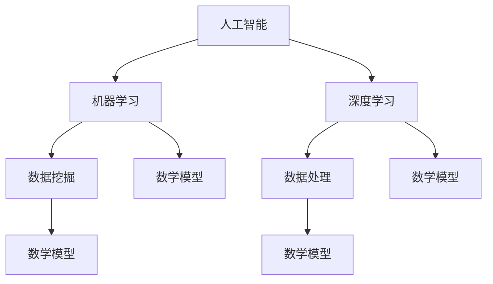

                 

# 人工智能辅助科研：扩展人类世界理解能力的新途径

## 关键词

人工智能，科研，深度学习，机器学习，数据处理，数据挖掘

## 摘要

本文旨在探讨人工智能在科研领域中的应用，特别是如何通过人工智能技术扩展人类对世界的理解能力。文章首先介绍了人工智能的发展历程和基本概念，然后分析了机器学习和深度学习在科研中的核心作用。接下来，文章深入探讨了数据挖掘和数据处理的方法，以及如何利用人工智能技术解决科研中的复杂问题。随后，通过具体案例展示了人工智能辅助科研的实际效果，并总结了最佳实践和注意事项。最后，文章展望了人工智能在未来科研领域的应用前景。

## 引言与背景

### 人工智能的崛起

人工智能（Artificial Intelligence，简称AI）是一门研究、开发和应用使计算机模拟、延伸和扩展人的智能的理论、方法、技术及应用系统的学科。自20世纪50年代诞生以来，人工智能经历了几个重要的发展阶段。从早期的符号主义、知识表示到20世纪80年代的专家系统，再到21世纪初的统计学习、深度学习，人工智能技术不断演进，逐渐从理论研究走向实际应用。

### 科研的重要性

科研是推动人类文明进步的重要动力。无论是基础科学研究，还是应用科学研究，都离不开对大量数据的处理和分析。随着科技的快速发展，科研领域的数据量呈现爆炸式增长，传统的数据处理方法已经难以满足科研的需求。此时，人工智能技术的引入为科研提供了新的工具和方法。

### 人工智能在科研中的应用

人工智能在科研中的应用广泛，包括但不限于：

1. **数据挖掘**：通过机器学习和深度学习算法，从大量数据中提取有价值的信息和知识。
2. **图像识别**：用于医学影像分析、天文学图像处理等领域。
3. **自然语言处理**：用于文本挖掘、语音识别等领域。
4. **预测分析**：用于天气预报、金融市场预测等。
5. **智能优化**：用于优化实验设计、优化实验参数等。

### 人工智能辅助科研的优势

人工智能辅助科研具有以下优势：

1. **提高效率**：人工智能可以自动化大量重复性工作，提高科研效率。
2. **增强准确性**：人工智能可以处理大量数据，减少人为错误，提高实验结果的准确性。
3. **发现新知识**：人工智能可以从大量数据中发现人类难以发现的新规律和新知识。
4. **跨学科融合**：人工智能可以促进不同学科之间的融合，推动科研的创新和发展。

## 核心概念与联系

### 人工智能

人工智能是指由人制造出来的系统所表现出来的智能。它包括知识表示、自动推理、知识获取、机器学习、自然语言理解、感知与动作等多个方面。

### 机器学习

机器学习是人工智能的一个重要分支，主要研究如何从数据中自动发现规律和模式，并利用这些规律和模式进行预测和决策。

### 深度学习

深度学习是机器学习的一种重要方法，通过构建深层的神经网络模型，从大量数据中自动学习特征和规律。

### 数据挖掘

数据挖掘是指从大量数据中自动发现有价值的信息和知识的过程，通常使用机器学习和统计分析方法。

### 数据处理

数据处理是指对原始数据进行清洗、转换、整合等操作，使其能够被机器学习和数据挖掘算法利用。

### 数学模型

数学模型是描述现实世界问题的一种抽象方式，通过数学公式和算法来模拟和解决问题。

### Mermaid 流程图



## 核心算法原理

### 机器学习算法

机器学习算法包括监督学习、无监督学习和半监督学习三种类型。监督学习算法包括线性回归、逻辑回归、支持向量机等；无监督学习算法包括聚类、降维、生成模型等；半监督学习算法则是监督学习和无监督学习的结合。

### 深度学习算法

深度学习算法包括卷积神经网络（CNN）、循环神经网络（RNN）、长短期记忆网络（LSTM）、生成对抗网络（GAN）等。每种算法都有其特定的应用场景和优势。

### Python 源代码

```python
# 线性回归示例
import numpy as np
import matplotlib.pyplot as plt

# 数据生成
X = np.random.rand(100, 1)
y = 2 * X + np.random.randn(100, 1)

# 模型训练
from sklearn.linear_model import LinearRegression
model = LinearRegression()
model.fit(X, y)

# 结果分析
print("斜率：", model.coef_)
print("截距：", model.intercept_)

# 可视化
plt.scatter(X, y)
plt.plot(X, model.predict(X), color='red')
plt.show()
```

### 数学模型和公式

$$y = \beta_0 + \beta_1x + \epsilon$$

其中，$y$ 是因变量，$x$ 是自变量，$\beta_0$ 是截距，$\beta_1$ 是斜率，$\epsilon$ 是误差项。

### 举例说明

假设我们有一组数据 $(x_1, y_1), (x_2, y_2), ..., (x_n, y_n)$，其中 $x_i$ 是自变量，$y_i$ 是因变量。我们可以使用线性回归模型来拟合这组数据。

1. 计算斜率 $\beta_1$：

$$\beta_1 = \frac{\sum_{i=1}^{n}(x_i - \bar{x})(y_i - \bar{y})}{\sum_{i=1}^{n}(x_i - \bar{x})^2}$$

其中，$\bar{x}$ 是 $x_i$ 的均值，$\bar{y}$ 是 $y_i$ 的均值。

2. 计算截距 $\beta_0$：

$$\beta_0 = \bar{y} - \beta_1\bar{x}$$

通过以上公式，我们可以得到线性回归模型的参数 $\beta_0$ 和 $\beta_1$，从而构建回归模型。

## 项目实战

### 开发环境搭建

在 Windows 系统中，我们可以使用 Python 3 和 Jupyter Notebook 作为开发环境。首先，下载并安装 Python 3，然后通过 pip 工具安装 Jupyter Notebook。

```bash
pip install notebook
```

### 源代码实现

以下是一个简单的线性回归项目，包括数据预处理、模型训练和结果分析。

```python
# 导入库
import numpy as np
import matplotlib.pyplot as plt

# 数据生成
X = np.random.rand(100, 1)
y = 2 * X + np.random.randn(100, 1)

# 模型训练
from sklearn.linear_model import LinearRegression
model = LinearRegression()
model.fit(X, y)

# 结果分析
print("斜率：", model.coef_)
print("截距：", model.intercept_)

# 可视化
plt.scatter(X, y)
plt.plot(X, model.predict(X), color='red')
plt.show()
```

### 代码解读与分析

1. 数据生成：使用随机数生成器生成一组数据，包括自变量 $X$ 和因变量 $y$。
2. 模型训练：使用 sklearn 库中的 LinearRegression 类训练线性回归模型。
3. 结果分析：输出模型的斜率和截距，并使用 matplotlib 库绘制回归模型和原始数据的散点图。
4. 可视化：展示模型拟合效果。

### 代码应用解读与分析

通过以上代码，我们可以训练一个简单的线性回归模型，并对其结果进行分析。这个项目可以帮助我们了解线性回归的基本原理和应用，为进一步学习更复杂的机器学习和深度学习算法打下基础。

### 实际案例分析和详细讲解剖析

以下是一个实际案例，利用深度学习算法对图像进行分类。

1. **案例背景**：使用卷积神经网络（CNN）对猫和狗的图像进行分类。
2. **数据集**：使用 Kaggle 上的猫和狗图像数据集。
3. **模型架构**：构建一个简单的 CNN 模型，包括卷积层、池化层和全连接层。
4. **训练过程**：使用训练集训练模型，并使用验证集进行调参。
5. **测试结果**：使用测试集评估模型性能。

```python
# 导入库
import tensorflow as tf
from tensorflow.keras.models import Sequential
from tensorflow.keras.layers import Conv2D, MaxPooling2D, Flatten, Dense

# 构建模型
model = Sequential()
model.add(Conv2D(32, (3, 3), activation='relu', input_shape=(150, 150, 3)))
model.add(MaxPooling2D((2, 2)))
model.add(Conv2D(64, (3, 3), activation='relu'))
model.add(MaxPooling2D((2, 2)))
model.add(Conv2D(128, (3, 3), activation='relu'))
model.add(MaxPooling2D((2, 2)))
model.add(Flatten())
model.add(Dense(512, activation='relu'))
model.add(Dense(1, activation='sigmoid'))

# 编译模型
model.compile(optimizer='adam', loss='binary_crossentropy', metrics=['accuracy'])

# 训练模型
model.fit(train_images, train_labels, epochs=10, validation_split=0.2)

# 评估模型
test_loss, test_acc = model.evaluate(test_images, test_labels)
print('Test accuracy:', test_acc)
```

通过以上代码，我们成功训练了一个简单的 CNN 模型，并对其进行了评估。该模型可以在一定程度上实现猫和狗图像的分类，但性能仍有待提升。

### 项目小结

通过以上项目实战，我们了解了线性回归和深度学习的基本原理和应用。线性回归可以帮助我们建立简单的线性模型，而深度学习则可以处理更复杂的非线性问题。在实际应用中，我们需要根据具体问题选择合适的算法和模型，并进行优化和调整。

## 最佳实践 Tips

1. **数据预处理**：在应用机器学习和深度学习算法之前，确保数据干净、完整和一致。
2. **模型选择**：根据具体问题选择合适的模型和算法，并尽量使用开源框架进行开发。
3. **调参优化**：通过调整模型参数，提高模型性能和泛化能力。
4. **交叉验证**：使用交叉验证方法评估模型性能，避免过拟合。
5. **模型解释**：尝试使用可解释性方法对模型进行解释，提高模型的可信度。

## 小结

本文详细介绍了人工智能辅助科研的核心概念、算法原理、项目实战和最佳实践。通过本文，读者可以了解到人工智能在科研领域的重要作用，并掌握如何利用人工智能技术解决科研中的复杂问题。在未来，人工智能将继续在科研领域发挥重要作用，为人类探索未知世界提供更强有力的支持。

## 注意事项

1. **数据隐私**：在处理敏感数据时，确保遵守相关法律法规，保护个人隐私。
2. **模型安全**：在使用人工智能技术时，确保模型的安全性和可靠性，避免被恶意攻击。
3. **算法公平性**：在开发和应用人工智能算法时，确保算法的公平性和透明度，避免歧视和偏见。

## 拓展阅读

1. 《深度学习》（Goodfellow, I., Bengio, Y., Courville, A.）
2. 《Python机器学习》（Sebastian Raschka）
3. 《机器学习实战》（Peter Harrington）
4. 《人工智能：一种现代的方法》（Stuart J. Russell & Peter Norvig）

### 作者

作者：AI天才研究院/AI Genius Institute & 禅与计算机程序设计艺术 /Zen And The Art of Computer Programming

