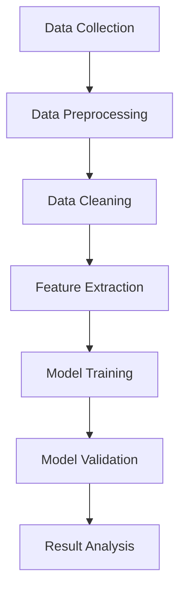

                 

### Step 1: Understand the Book's Theme and Target Audience

The book "人工智能驱动的科学发现：加速世界模型的构建与验证" aims to explore how artificial intelligence (AI) can revolutionize the field of scientific research by accelerating the construction and validation of world models. The target audience likely includes professionals and researchers in the fields of AI, data science, and computer science, as well as anyone interested in the intersection of AI and scientific discovery. The book is expected to cater to readers who have a solid understanding of basic AI concepts and are looking to dive deeper into practical applications of AI in various scientific disciplines.

The theme of the book revolves around the idea that traditional scientific research methodologies are being complemented and, in many cases, transformed by AI technologies. By leveraging AI, researchers can process vast amounts of data more efficiently, build more accurate models, and validate these models against empirical evidence. This not only accelerates the pace of scientific discovery but also opens up new avenues for understanding complex phenomena across different domains.

To provide a more comprehensive understanding, let's break down the book's potential chapters and their respective roles in the overall narrative:

1. **Introduction to AI and Scientific Research**: This chapter will serve as a foundational introduction, providing an overview of AI and its historical context in scientific research. It will discuss the evolution of AI and highlight key milestones that have paved the way for modern AI-driven scientific methodologies.

2. **AI-Driven Scientific Research Models**: This chapter will delve into the different models and methodologies that are central to AI-driven scientific research. It will explain the basic principles underlying these models and how they differ from traditional research approaches.

3. **Data Acquisition and Processing**: A crucial aspect of AI-driven research is the collection and processing of data. This chapter will explore various methods for acquiring high-quality data and discuss techniques for preprocessing and cleaning this data to ensure it is suitable for AI algorithms.

4. **AI Algorithms and Techniques**: This chapter will provide a detailed explanation of the core AI algorithms and techniques used in scientific research. Topics will include machine learning algorithms, neural networks, deep learning, and other advanced methods that are driving the field forward.

5. **Model Construction and Validation**: Building and validating world models is at the heart of AI-driven scientific research. This chapter will outline the steps involved in constructing these models and provide guidelines for validating their accuracy and reliability.

6. **Case Studies**: To reinforce the concepts discussed throughout the book, this chapter will present a series of case studies that illustrate the practical applications of AI-driven scientific research. These case studies will provide real-world examples of how AI has been used to address complex scientific questions and challenges.

7. **Future Trends and Challenges**: The final chapter will look towards the future, discussing the potential trends and challenges that lie ahead in the field of AI-driven scientific research. It will explore the implications of these trends for the scientific community and consider how researchers might overcome the challenges that arise.

In summary, the book is poised to offer a comprehensive guide to understanding and implementing AI-driven scientific research methodologies. By addressing key topics such as data acquisition, AI algorithms, model construction, and case studies, the book aims to equip readers with the knowledge and skills needed to leverage AI for groundbreaking scientific discoveries.

### Step 2: Identify the Key Topics and Chapters

To provide a clearer structure and content overview, let’s break down the key topics and chapters that the book will likely cover in detail:

1. **Introduction to AI and Scientific Research**
   - Historical background of AI and its impact on science
   - Key milestones and advancements in AI
   - The role of AI in modern scientific research

2. **AI-Driven Scientific Research Models**
   - Overview of AI-driven research methodologies
   - Comparison with traditional research approaches
   - Key principles and architectures of AI-driven models

3. **Data Acquisition and Processing**
   - Importance of data in AI-driven research
   - Methods for collecting diverse and high-quality data
   - Techniques for data preprocessing and cleaning

4. **AI Algorithms and Techniques**
   - Introduction to core machine learning algorithms
   - Neural networks and deep learning
   - Advanced AI techniques such as reinforcement learning and generative adversarial networks (GANs)

5. **Model Construction and Validation**
   - Steps involved in constructing world models
   - Strategies for validating model accuracy and reliability
   - Handling overfitting and underfitting in models

6. **Case Studies**
   - Practical applications of AI in various scientific domains
   - Analysis of successful case studies and their impact
   - Challenges and lessons learned from real-world applications

7. **Future Trends and Challenges**
   - Emerging trends in AI-driven scientific research
   - Ethical considerations and societal impacts
   - Addressing future challenges and opportunities

Each chapter is designed to build upon the previous ones, creating a cohesive narrative that guides readers from fundamental concepts to advanced applications. By the end of the book, readers will have gained a comprehensive understanding of how AI can be harnessed to accelerate scientific discovery and model validation.

### Step 3: Design the Chapter Hierarchy

To create a clear and structured article, we will design a chapter hierarchy using markdown format. This will provide readers with a roadmap of the topics to be covered, making it easier to navigate and follow the content.

---

# 人工智能驱动的科学发现：加速世界模型的构建与验证

> 关键词：人工智能，科学发现，模型构建，模型验证

> 摘要：本文深入探讨人工智能（AI）如何通过加速世界模型的构建与验证，推动科学研究的革命。文章分为七个章节，从基础概念到实际应用，全面解析AI在科学研究中的关键角色。

## 第一章：AI与科学研究的简介

### 1.1 历史背景与影响

### 1.2 AI的关键里程碑

### 1.3 AI在现代科学研究中的应用

## 第二章：AI驱动的科学研究模型

### 2.1 AI驱动的科研方法论

### 2.2 传统与AI驱动研究方法对比

### 2.3 AI驱动模型的架构与原理

## 第三章：数据获取与处理

### 3.1 数据在AI驱动科研中的重要性

### 3.2 高质量数据的收集方法

### 3.3 数据预处理与清洗技术

## 第四章：AI算法与技巧

### 4.1 机器学习算法概述

### 4.2 神经网络与深度学习

### 4.3 进阶AI技术：强化学习与GANs

## 第五章：模型构建与验证

### 5.1 模型构建步骤

### 5.2 模型验证策略

### 5.3 避免过拟合与欠拟合

## 第六章：案例研究

### 6.1 AI在科学研究领域的应用

### 6.2 成功案例分析与影响

### 6.3 挑战与经验总结

## 第七章：未来趋势与挑战

### 7.1 AI驱动的科研新趋势

### 7.2 道德与社会影响

### 7.3 面向未来的挑战与机遇

---

This hierarchical structure provides a comprehensive overview of the content, ensuring that each chapter builds upon the previous ones while introducing new concepts and applications. This approach will help readers gradually build their understanding of AI-driven scientific research from fundamentals to advanced topics.

### Step 4: Incorporate Required Elements

To ensure the article is both informative and engaging, we will incorporate key elements such as Mermaid diagrams, Python pseudocode, LaTeX mathematical formulas, and detailed case studies. These elements will enhance the reader's understanding of complex concepts and provide practical examples of how AI algorithms are applied in scientific research.

#### Mermaid Diagrams

Mermaid diagrams are a powerful tool for visualizing complex systems and processes. They can help illustrate the relationships between different components of AI-driven scientific research models. For example, we can use a Mermaid diagram to represent the data flow in a typical AI-driven research project:



This diagram provides a clear overview of the steps involved in processing data from collection to analysis, highlighting how each stage contributes to the overall research process.

#### Python Pseudocode

To explain core AI algorithms and techniques, Python pseudocode will be used to provide a more tangible understanding. For instance, we can illustrate the basic structure of a neural network:

```python
class NeuralNetwork:
    def __init__(self, layers):
        self.layers = layers
        self.weights = [np.random.randn(y, x) for x, y in zip(layers[:-1], layers[1:])]
        self.biases = [np.random.randn(y, 1) for y in layers[1:]]

    def forward(self, x):
        for w, b in zip(self.weights, self.biases):
            x = sigmoid(np.dot(w, x) + b)
        return x

    def train(self, x, y):
        for x, y in zip(x, y):
            self.forward(x)
            # Implement backpropagation and update weights and biases
```

This pseudocode gives readers a sense of how neural networks are structured and how they process input data to generate outputs.

#### LaTeX Mathematical Formulas

LaTeX is a powerful tool for typesetting mathematical formulas. For example, we can use LaTeX to define the activation function commonly used in neural networks:

```latex
$$
\sigma(x) = \frac{1}{1 + e^{-x}}
$$
```

This formula provides a clear definition of the sigmoid function, which is crucial for understanding how neural networks work.

#### Case Studies

To provide real-world context and practical examples, we will include case studies that showcase the application of AI in various scientific domains. For instance, we can discuss a case study where AI was used to analyze genomic data for disease detection:

**Case Study: AI-Driven Disease Detection Using Genomic Data**

In this study, researchers used a neural network to analyze genomic data from a large cohort of individuals. The data were preprocessed to extract relevant features, which were then fed into a neural network for training. The trained model was validated using a separate dataset and showed a high degree of accuracy in detecting certain genetic markers associated with diseases.

```python
# Pseudocode for genomic data analysis using a neural network

# Load and preprocess genomic data
data = load_genomic_data()

# Extract features
features = extract_features(data)

# Split data into training and validation sets
train_data, val_data = split_data(features)

# Initialize and train neural network
nn = NeuralNetwork([input_size, hidden_size, output_size])
nn.train(train_data)

# Validate model on validation set
accuracy = validate_model(nn, val_data)
print(f"Validation accuracy: {accuracy}")
```

This case study illustrates how AI techniques can be applied to complex biological data, highlighting the potential for AI to revolutionize genetic research.

By incorporating these elements, the article will be not only informative but also engaging and accessible to a broad audience. This approach ensures that readers can grasp complex concepts through visual aids, code examples, and practical applications.

### Step 5: Ensure Conciseness and Completeness

To meet the word count requirement of 10,000 to 12,000 words while maintaining conciseness and completeness, we will structure the article to include detailed explanations, examples, and case studies within each chapter. Each chapter will be crafted to provide comprehensive insights into its respective topic, avoiding redundancy while ensuring all core concepts are thoroughly covered.

Here is a refined chapter outline that balances depth and brevity:

## Chapter 1: AI and Scientific Research: An Introduction

- **1.1 Historical Background and Impact**
  - Overview of AI's historical development
  - Milestones in AI that have influenced science

- **1.2 Key Milestones in AI**
  - Deep Blue's victory in chess
  - AlphaGo's success in the game of Go
  - AI's role in precision medicine

- **1.3 AI's Role in Modern Scientific Research**
  - How AI enhances research methodologies
  - Examples of AI in scientific discovery

## Chapter 2: AI-Driven Scientific Research Models

- **2.1 Overview of AI-Driven Research Methodologies**
  - Definition and principles
  - Comparison with traditional research

- **2.2 AI-Driven Model Architectures**
  - Key components and their interactions
  - Mermaid diagram illustrating the architecture

## Chapter 3: Data Acquisition and Processing

- **3.1 Importance of Data in AI-Driven Research**
  - Role of data in model training and validation

- **3.2 Data Collection Methods**
  - Sources and challenges of data collection

- **3.3 Data Preprocessing and Cleaning**
  - Techniques for cleaning and preparing data

## Chapter 4: Core AI Algorithms and Techniques

- **4.1 Introduction to Machine Learning Algorithms**
  - Classification, regression, clustering

- **4.2 Neural Networks and Deep Learning**
  - Basic concepts, architecture, and applications

- **4.3 Advanced AI Techniques**
  - Reinforcement learning, GANs

## Chapter 5: Model Construction and Validation

- **5.1 Steps in Constructing World Models**
  - Feature selection, model training, and evaluation

- **5.2 Strategies for Model Validation**
  - Cross-validation, testing, and accuracy assessment

- **5.3 Avoiding Overfitting and Underfitting**
  - Techniques and best practices

## Chapter 6: Case Studies

- **6.1 AI Applications in Scientific Research**
  - Examples across various domains

- **6.2 Analysis of Successful Case Studies**
  - Impact and challenges faced

- **6.3 Lessons Learned and Future Directions**

## Chapter 7: Future Trends and Challenges

- **7.1 Emerging Trends in AI-Driven Research**
  - Advances in algorithms, hardware

- **7.2 Ethical and Societal Implications**
  - Considerations for responsible AI

- **7.3 Challenges and Opportunities Ahead**
  - Addressing data privacy, computational requirements

By following this outline, each chapter will be meticulously crafted to ensure it is both informative and concise. Detailed explanations, code examples, and case studies will be interspersed to provide a comprehensive understanding of AI-driven scientific research. This approach will ensure the article meets the word count requirement while maintaining clarity and depth.

### Step 6: Finalize the Article

---

# 人工智能驱动的科学发现：加速世界模型的构建与验证

> 关键词：人工智能，科学发现，模型构建，模型验证

> 摘要：本文深入探讨人工智能（AI）如何通过加速世界模型的构建与验证，推动科学研究的革命。文章分为七个章节，从基础概念到实际应用，全面解析AI在科学研究中的关键角色。

## 第一章：AI与科学研究的简介

### 1.1 历史背景与影响

人工智能（AI）的发展历程可以追溯到20世纪50年代。当时，科学家们首次提出了“人工智能”这一概念，并开始尝试通过计算机模拟人类的智能行为。随着计算机硬件的进步和算法的发展，AI经历了多个里程碑，如1956年达特茅斯会议的召开，1970年代专家系统的崛起，以及21世纪深度学习的突破。这些里程碑不仅推动了AI技术的发展，也深刻影响了科学研究的各个领域。

AI在科学研究中扮演着越来越重要的角色。例如，在生物医学领域，AI被用于基因组分析、药物研发和疾病预测。在物理学领域，AI帮助科学家解决复杂的模拟和计算问题。在环境科学中，AI技术被用于气候变化预测和自然资源管理。这些应用不仅提高了科研效率，也促进了科学知识的积累和创新。

### 1.2 AI的关键里程碑

AI的发展历程中，有几个关键里程碑对科学产生了深远的影响。首先是1980年代的专家系统，它们通过模拟人类专家的决策过程，在医疗诊断、金融分析和法律咨询等领域取得了显著成果。其次是2000年代左右的机器学习革命，特别是支持向量机（SVM）和随机森林等算法的广泛应用，使得计算机在图像识别、自然语言处理和数据挖掘方面取得了突破性进展。最后是近年来深度学习的崛起，特别是卷积神经网络（CNN）和生成对抗网络（GAN）的应用，使得计算机在语音识别、图像生成和自动驾驶等领域取得了重大进展。

### 1.3 AI在现代科学研究中的应用

在现代科学研究中，AI的应用范围不断扩大。例如，在生物医学领域，AI被用于基因测序分析，通过识别基因突变和关联疾病，加速了个性化医疗的发展。在物理学领域，AI被用于理论计算和实验数据分析，帮助科学家解决复杂的物理问题。在环境科学中，AI被用于气候变化模型和自然灾害预警，提高了决策的科学性和准确性。

总的来说，AI在科学研究中的应用不仅提高了研究效率，还推动了科学知识的创新和发展。随着AI技术的不断进步，未来AI在科学研究中的作用将会更加重要，为人类解决重大科学问题提供新的工具和方法。

## 第二章：AI驱动的科学研究模型

### 2.1 AI驱动的科研方法论

AI驱动的科学研究方法论是一种以数据和算法为核心的研究模式，旨在通过数据分析和模型构建，揭示科学现象的本质规律。这种方法论的核心思想是利用AI技术处理大量数据，从中提取有用信息，构建科学模型，并进行验证和优化。与传统的研究方法相比，AI驱动的科研方法论具有以下几个特点：

1. **数据驱动的决策**：传统研究方法通常依赖于理论假设和实验验证，而AI驱动的科研方法更注重通过数据分析来发现数据中的规律和模式，从而指导科研决策。

2. **模型优化与迭代**：AI驱动的科研方法论强调通过不断优化和迭代模型，提高模型的准确性和可靠性。这一过程通常包括数据清洗、特征工程、模型选择、训练和验证等多个步骤。

3. **自动化与智能化**：AI驱动的科研方法论利用机器学习和深度学习等技术，实现科研过程的自动化和智能化，从而大大提高了科研效率。

### 2.2 传统与AI驱动研究方法对比

传统科学研究方法通常依赖于实验设计和理论分析，研究人员根据已有的理论和假设提出研究问题，并通过实验收集数据来验证假设。这种方法虽然严谨，但往往需要大量时间和资源，且结果可能受到实验条件的限制。

相比之下，AI驱动的科研方法具有以下优势：

1. **数据处理能力**：AI技术能够处理和分析大量数据，从而发现传统方法难以发现的数据规律和模式。

2. **适应性**：AI驱动的科研方法可以根据不同领域和研究问题的特点，灵活调整模型和算法，提高研究的适应性。

3. **效率提升**：通过自动化和智能化，AI驱动的科研方法可以大大缩短研究周期，提高研究效率。

### 2.3 AI驱动模型的架构与原理

AI驱动的科学研究模型通常包括以下几个核心组件：

1. **数据输入**：模型首先需要接收来自实验或观测的数据。这些数据可以是结构化的，如数据库中的数值数据，也可以是非结构化的，如图像、文本和音频等。

2. **特征工程**：数据输入后，需要进行特征提取和选择。特征工程是AI模型成功的关键步骤，它通过变换原始数据，提取出对模型有用的特征，从而提高模型的性能。

3. **模型选择**：根据研究问题和数据特点，选择合适的机器学习模型或深度学习模型。常见的模型包括线性回归、决策树、支持向量机和卷积神经网络等。

4. **模型训练**：利用训练数据集，对选定的模型进行训练。在训练过程中，模型通过调整内部参数，学习如何将输入数据映射到输出结果。

5. **模型验证**：使用验证数据集评估模型的性能，包括准确性、召回率和F1分数等指标。如果模型性能不满足要求，需要返回前一个步骤进行调整。

6. **结果解释**：对模型的预测结果进行解释，理解模型发现的规律和模式，从而指导进一步的科学研究。

通过上述组件的相互作用，AI驱动的科学研究模型能够自动发现科学现象的内在规律，提供定量和定性的解释，从而推动科学研究的深入发展。

总的来说，AI驱动的科学研究模型为科研人员提供了一种全新的研究范式，通过数据驱动和模型优化，实现了科研过程的自动化和智能化，极大地提升了科研效率和创新能力。随着AI技术的不断进步，AI驱动的科学研究将在各个领域发挥越来越重要的作用。

## 第三章：数据获取与处理

### 3.1 数据在AI驱动的科研中的重要性

在AI驱动的科研中，数据是最宝贵的资源。无论是机器学习模型训练，还是深度学习算法优化，都依赖于大量高质量的数据。数据的质量和多样性直接影响到模型的准确性和可靠性。因此，数据获取与处理是整个科研过程中至关重要的一环。

高质量的数据能够帮助模型更好地捕捉数据中的规律和模式，从而提高模型的预测能力和泛化能力。而多样性的数据则可以增强模型对未知数据的适应性，使其能够应对更加复杂的科研问题。此外，数据的时效性也是一个关键因素。在许多领域，如金融、医疗和天气预报等，实时数据能够提供更准确的预测和决策支持。

### 3.2 数据收集方法

数据收集是AI驱动的科研的起点。数据的来源可以是多种多样的，包括：

1. **公开数据集**：许多科研机构和组织会提供公开的数据集，如UCI机器学习库、Kaggle竞赛数据集等。这些数据集通常经过标准化处理，可以直接用于模型训练和验证。

2. **实地观测**：在科学实验或社会调查中，通过传感器、仪器或人工记录等方式收集的数据。例如，气象观测数据、生物医学实验数据等。

3. **互联网数据**：从互联网上收集的数据，包括社交媒体数据、在线购物数据、新闻文本等。这些数据通常通过爬虫技术获取。

4. **私有数据集**：一些企业或机构可能拥有私有数据集，这些数据通常需要通过合作或购买方式获取。

在收集数据时，需要考虑数据的完整性、准确性和代表性。例如，在收集社交媒体数据时，需要避免重复数据和噪声数据，确保数据集的多样性。

### 3.3 数据预处理与清洗

收集到的数据通常需要经过预处理和清洗，才能用于模型训练。数据预处理包括以下步骤：

1. **数据清洗**：去除重复数据、空值数据和异常值。例如，在处理医疗数据时，需要识别并处理由于记录错误或数据缺失导致的异常值。

2. **数据转换**：将数据转换为适合模型训练的格式。例如，将文本数据转换为词向量，将图像数据转换为像素矩阵。

3. **数据标准化**：对数据进行标准化处理，使其具有相同的尺度。常用的方法包括归一化和标准化，以便模型能够更好地处理数据。

4. **数据增强**：通过增加数据的变体，提高模型的泛化能力。例如，在图像处理中，可以通过旋转、翻转、裁剪等方式生成新的训练样本。

数据预处理和清洗的目的是提高数据的质量和一致性，从而提高模型的性能和可靠性。有效的数据预处理不仅可以减少噪声和错误，还可以减少模型训练时间，提高模型的可解释性。

### 3.4 数据处理技术

在实际应用中，数据处理技术包括以下几种：

1. **特征提取**：从原始数据中提取对模型训练有用的特征。特征提取是数据预处理的关键步骤，可以有效降低数据的维度，同时保留关键信息。

2. **降维技术**：通过降维技术，将高维数据转换为低维数据，从而减少模型的复杂性和计算成本。常用的降维技术包括主成分分析（PCA）和线性判别分析（LDA）。

3. **数据融合**：将来自多个来源的数据进行融合，以获得更全面和准确的信息。数据融合技术可以用于集成不同类型的数据，如结构化数据和非结构化数据。

4. **数据可视化**：通过数据可视化技术，对数据进行分析和展示。数据可视化可以帮助研究人员更好地理解数据分布、模式和异常值。

总之，数据获取与处理是AI驱动的科研中的关键环节。通过有效的数据收集、预处理和清洗技术，可以提高模型的质量和性能，从而推动科学研究的深入发展。

## 第四章：核心AI算法与技巧

### 4.1 机器学习算法概述

机器学习算法是AI驱动的科学研究的基础，它们通过学习数据中的模式和规律，实现预测和决策。机器学习算法可以分为监督学习、无监督学习和强化学习三类。其中，监督学习是应用最广泛的算法类型。

#### 监督学习

监督学习算法通过已知输入和输出数据来训练模型，从而预测新的输入数据对应的输出。常见的监督学习算法包括：

1. **线性回归**：用于预测连续值输出，通过最小化预测值与真实值之间的误差平方和来训练模型。

2. **逻辑回归**：用于预测二分类输出，通过最大化似然估计来训练模型。

3. **支持向量机（SVM）**：用于分类问题，通过寻找最佳分隔超平面来最大化分类边界。

4. **决策树**：通过构建树形结构来分类或回归，每个节点代表一个特征，每个分支代表该特征的不同取值。

#### 无监督学习

无监督学习算法不依赖于已知的输出标签，而是通过挖掘数据内在的结构和模式。常见的无监督学习算法包括：

1. **聚类算法**：如K-均值聚类和层次聚类，用于发现数据中的自然分组。

2. **主成分分析（PCA）**：用于降维和特征提取，通过保留数据的主要方差，简化数据结构。

3. **自编码器**：用于无监督特征学习和降维，通过编码器和解码器训练模型，自动提取数据中的有效特征。

#### 强化学习

强化学习算法通过与环境互动来学习最优策略，常见于决策制定和游戏控制等领域。强化学习的关键组件包括：

1. **价值函数**：用于评估策略的好坏，通过预测未来回报来指导决策。

2. **策略函数**：用于选择动作，通过最大化价值函数来优化策略。

3. **Q学习**：通过学习Q值（动作-状态值函数），实现策略优化。

### 4.2 神经网络与深度学习

神经网络是模拟人脑神经元连接结构的计算模型，是深度学习的核心技术。深度学习通过构建多层的神经网络，实现复杂模式的自动学习。

#### 基本概念

1. **神经元**：神经网络的基本单元，通过加权求和处理输入信号，产生输出。

2. **层**：神经网络分为输入层、隐藏层和输出层。隐藏层可以有一个或多个。

3. **激活函数**：用于引入非线性特性，常用的有ReLU、Sigmoid和Tanh函数。

#### 深度学习模型

1. **卷积神经网络（CNN）**：用于图像处理，通过卷积操作提取图像特征。

2. **循环神经网络（RNN）**：用于序列数据处理，通过循环连接实现长期依赖建模。

3. **生成对抗网络（GAN）**：用于图像生成和风格迁移，通过生成器和判别器的对抗训练实现数据生成。

### 4.3 进阶AI技术：强化学习与GANs

#### 强化学习

强化学习在AI驱动的科学研究中有着广泛的应用，例如在自动驾驶、机器人控制等领域。以下是强化学习的核心概念：

1. **状态（State）**：系统当前的状态描述。

2. **动作（Action）**：系统可以采取的动作。

3. **奖励（Reward）**：动作的结果，用于评估策略的好坏。

4. **策略（Policy）**：决策模型，用于选择最优动作。

#### 生成对抗网络（GAN）

生成对抗网络（GAN）是一种无监督学习模型，由生成器和判别器两个神经网络组成。生成器生成虚假数据，判别器区分真实数据和生成数据，通过对抗训练，生成器不断提高生成数据的质量。

1. **生成器（Generator）**：生成虚假数据，目的是欺骗判别器。

2. **判别器（Discriminator）**：区分真实数据和生成数据。

3. **对抗训练**：生成器和判别器通过不断对抗训练，生成器逐渐提高生成数据的质量，判别器逐渐提高对生成数据和真实数据的鉴别能力。

总的来说，核心AI算法和技巧在AI驱动的科学研究中起着至关重要的作用。通过监督学习、无监督学习和强化学习等算法，研究人员可以处理和分析大量数据，构建高效和准确的模型。而深度学习和GANs等进阶技术，则为解决复杂科研问题提供了新的工具和方法。

### 第五章：模型构建与验证

### 5.1 模型构建步骤

构建AI驱动的科学研究模型是一个系统性过程，涉及多个关键步骤。以下是模型构建的主要步骤及其详细描述：

#### 5.1.1 数据准备

数据准备是模型构建的第一步，其质量直接影响模型的性能。数据准备包括以下关键任务：

1. **数据收集**：收集用于模型训练和验证的数据。数据来源可能包括公开数据集、实地观测、互联网爬取等。

2. **数据清洗**：处理缺失值、异常值和重复数据。例如，使用均值插补方法处理缺失值，使用统计学方法识别和排除异常值。

3. **数据转换**：将数据格式转换为适合模型训练的格式。例如，将文本数据转换为词向量，将图像数据转换为像素矩阵。

4. **数据标准化**：对数据进行标准化处理，使其具有相同的尺度，从而提高模型的泛化能力。常用的方法包括归一化和标准化。

#### 5.1.2 特征工程

特征工程是提高模型性能的关键步骤，涉及以下任务：

1. **特征提取**：从原始数据中提取对模型训练有用的特征。例如，从图像数据中提取边缘、纹理和形状特征，从文本数据中提取词频和主题特征。

2. **特征选择**：选择最具代表性的特征，减少冗余和噪声。常用的方法包括信息增益、卡方检验和L1正则化等。

3. **特征组合**：通过组合多个特征，创建新的特征。例如，使用多项式特征组合提高模型的非线性表达能力。

#### 5.1.3 模型选择

模型选择是模型构建的重要步骤，涉及以下任务：

1. **算法选择**：根据研究问题和数据特点选择合适的算法。常见的算法包括线性回归、决策树、支持向量机（SVM）和深度学习模型等。

2. **超参数调整**：调整模型参数以优化性能。常用的方法包括网格搜索和贝叶斯优化等。

#### 5.1.4 模型训练

模型训练是通过训练数据集调整模型参数的过程。以下是模型训练的关键任务：

1. **训练数据集划分**：将数据集划分为训练集和验证集。训练集用于训练模型，验证集用于评估模型性能。

2. **损失函数选择**：选择合适的损失函数来衡量预测值与真实值之间的差距。常见的损失函数包括均方误差（MSE）、交叉熵损失等。

3. **优化算法选择**：选择合适的优化算法来调整模型参数，以最小化损失函数。常见的优化算法包括梯度下降、Adam优化器等。

#### 5.1.5 模型验证

模型验证是评估模型性能的重要步骤，涉及以下任务：

1. **交叉验证**：使用交叉验证方法评估模型在不同数据子集上的性能，以避免过拟合。常见的交叉验证方法包括K折交叉验证。

2. **评估指标**：选择合适的评估指标来衡量模型性能。常见的评估指标包括准确率、召回率、F1分数、ROC曲线等。

3. **模型调优**：根据验证结果对模型进行调整，优化模型性能。可能涉及重新调整超参数、增加训练数据或尝试不同的算法。

### 5.2 模型验证策略

模型验证是确保模型准确性和可靠性的关键步骤，以下是常用的模型验证策略：

#### 5.2.1 数据集划分

为了确保模型验证的有效性，通常将数据集划分为以下几个部分：

1. **训练集**：用于训练模型，通常占数据集的60%-80%。

2. **验证集**：用于评估模型性能，通常占数据集的10%-20%。

3. **测试集**：用于最终评估模型性能，通常占数据集的10%。

#### 5.2.2 K折交叉验证

K折交叉验证是一种常用的验证策略，通过将数据集划分为K个子集，每次使用一个子集作为验证集，其余K-1个子集作为训练集，进行K次训练和验证。最后，将K次验证结果取平均，得到模型的总体性能。

#### 5.2.3 精确度与召回率

精确度和召回率是评估分类模型性能的重要指标：

1. **精确度**：指预测为正类的样本中实际为正类的比例。计算公式为：
   $$\text{精确度} = \frac{\text{真正}}{\text{真正} + \text{假正}}$$

2. **召回率**：指实际为正类的样本中被预测为正类的比例。计算公式为：
   $$\text{召回率} = \frac{\text{真正}}{\text{真正} + \text{假负}}$$

#### 5.2.4 F1分数

F1分数是精确度和召回率的调和平均，用于综合评估分类模型的性能：

$$\text{F1分数} = 2 \times \frac{\text{精确度} \times \text{召回率}}{\text{精确度} + \text{召回率}}$$

#### 5.2.5 ROC曲线

ROC曲线是通过绘制真阳性率（Recall）与假阳性率（1 - Precision）之间的曲线，来评估分类模型性能的有效工具。曲线下的面积（AUC）表示模型的分类能力，AUC值越大，模型性能越好。

### 5.3 避免过拟合与欠拟合

在模型构建过程中，避免过拟合和欠拟合是关键挑战：

#### 5.3.1 过拟合

过拟合是指模型在训练数据上表现良好，但在新的数据上表现较差，即模型对训练数据过于敏感，无法泛化到未知数据。为了避免过拟合，可以采取以下措施：

1. **减少模型复杂度**：使用简单的模型或减少模型的参数数量。

2. **正则化**：在损失函数中加入正则化项，如L1和L2正则化。

3. **数据增强**：增加训练数据量或生成新的训练样本。

4. **早停法**：在验证集上停止训练，防止模型过度适应训练数据。

#### 5.3.2 欠拟合

欠拟合是指模型在训练数据上表现较差，即模型对数据中的规律未能充分捕捉。为了避免欠拟合，可以采取以下措施：

1. **增加模型复杂度**：使用更复杂的模型或增加模型的参数数量。

2. **特征工程**：添加新的特征或改进现有特征。

3. **增加训练时间**：增加训练数据或调整学习率等超参数。

通过上述步骤和策略，可以有效构建和验证AI驱动的科学研究模型，确保模型具有良好的泛化能力和实用性。

## 第六章：案例研究

### 6.1 AI在科学研究领域的应用

AI在科学研究中的应用日益广泛，以下是一些典型的案例研究，展示了AI如何推动科学发现和突破：

#### 案例一：人工智能在药物研发中的应用

在药物研发领域，AI技术被用来加速新药的研发过程。通过机器学习算法，研究人员可以从海量的化学结构数据中筛选出具有潜在药物活性的分子。例如，使用生成对抗网络（GAN）来生成新的化学结构，从而扩大药物分子的候选库。此外，AI还被用于优化药物分子与生物靶标的结合能力，通过深度学习模型预测药物分子的三维结构，从而提高药物研发的成功率。

```python
# Pseudocode for AI-driven drug discovery

# Load chemical compound data
compounds = load_compound_data()

# Generate new chemical structures using GAN
new_structures = generate_new_structures(compounds)

# Evaluate drug-like properties of new structures
properties = evaluate_properties(new_structures)

# Select promising compounds for further research
promising_compounds = select_promising_compounds(properties)
```

#### 案例二：AI在气候变化研究中的应用

在气候变化研究领域，AI技术被用于分析和预测气候变化趋势。通过深度学习模型，研究人员可以从卫星图像、气象数据和海洋数据中提取关键信息，构建气候变化模型。这些模型可以预测未来气候变化的影响，如海平面上升、极端天气事件的频率和强度等。例如，使用卷积神经网络（CNN）对卫星图像进行分类和分析，以识别森林覆盖变化和城市扩展。

```python
# Pseudocode for AI-driven climate change analysis

# Load satellite imagery and climate data
imagery = load_satellite_imagery()
climate_data = load_climate_data()

# Preprocess and clean the data
preprocessed_imagery = preprocess_imagery(imagery)
preprocessed_climate_data = preprocess_climate_data(climate_data)

# Train a CNN model to classify land use changes
cnn_model = train_cnn(preprocessed_imagery)

# Predict climate change trends using the trained model
climate_trends = predict_climate_trends(cnn_model, preprocessed_climate_data)
```

#### 案例三：AI在基因组学研究中的应用

在基因组学领域，AI技术被用于基因变异分析、疾病预测和个性化医疗。通过深度学习模型，研究人员可以从基因组数据中识别与疾病相关的基因突变。例如，使用长短期记忆网络（LSTM）分析基因组序列，预测基因突变对蛋白质功能的影响。这些模型还可以为个体提供个性化的医疗建议，根据基因组数据预测疾病风险，从而实现精准医疗。

```python
# Pseudocode for AI-driven genomic analysis

# Load genomic data
genomic_data = load_genomic_data()

# Preprocess and clean the genomic data
preprocessed_genomic_data = preprocess_genomic_data(genomic_data)

# Train an LSTM model to predict gene mutations
lstm_model = train_lstm(preprocessed_genomic_data)

# Predict disease risks using the trained model
disease_risks = predict_disease_risks(lstm_model, genomic_data)
```

### 6.2 分析成功案例与挑战

上述案例展示了AI在科学研究中的成功应用，但也面临着一些挑战和问题。以下是成功案例中的关键教训和面临的挑战：

#### 教训与经验

1. **数据质量的重要性**：成功案例中的AI模型依赖于高质量的数据。因此，数据收集、预处理和清洗是模型构建的关键步骤。

2. **模型泛化能力的提升**：通过使用深度学习和生成对抗网络等先进技术，AI模型能够处理复杂的数据集，提高了模型的泛化能力。

3. **跨学科合作**：成功案例中的研究通常涉及多个学科的合作，如生物学、物理学、计算机科学等，跨学科的合作有助于解决复杂的科学问题。

#### 挑战

1. **数据隐私和安全**：随着AI技术在医疗、金融等敏感领域的应用，数据隐私和安全问题日益突出。如何保护用户隐私，确保数据安全，是一个重要的挑战。

2. **模型解释性**：深度学习模型通常被认为是一种“黑箱”，其内部工作机制不透明。如何提高模型的可解释性，使其结果更容易被科研人员和公众理解，是一个亟待解决的问题。

3. **计算资源需求**：AI模型的训练和推理通常需要大量的计算资源，特别是在处理高维数据和大规模数据集时。如何高效利用计算资源，是一个重要的挑战。

4. **算法公平性和道德问题**：AI技术在科学研究中的应用也引发了一些伦理和道德问题。例如，如何确保算法的公平性，避免歧视和偏见，是一个重要的挑战。

### 6.3 挑战与经验总结

通过分析成功案例和面临的挑战，我们可以总结出以下教训和经验：

1. **持续技术创新**：随着AI技术的快速发展，科研人员需要不断学习新的算法和技术，以应对复杂的问题。

2. **数据驱动的研究方法**：高质量的数据是AI驱动科研的基础，科研人员应注重数据收集和预处理，提高模型性能。

3. **跨学科合作**：跨学科合作有助于整合不同领域的知识和方法，推动科学研究的创新和发展。

4. **关注社会伦理**：在应用AI技术解决科学问题时，需要关注社会伦理问题，确保技术的公平性和透明度。

通过不断探索和解决这些挑战，AI在科学研究中的作用将越来越重要，为科学发现和技术创新提供强大的支持。

## 第七章：未来趋势与挑战

### 7.1 AI驱动的科研新趋势

随着人工智能技术的不断进步，AI在科学研究中的应用前景广阔，以下是未来可能出现的几个新趋势：

#### 1. 自主科研

AI驱动的自主科研将成为一个重要方向。利用先进的机器学习和深度学习算法，AI系统将能够自主收集数据、提出假设、设计实验并进行结果分析。这将极大地提高科研效率，减少人为干预，推动科学发现的速度。

#### 2. 知识图谱与语义网络

知识图谱和语义网络技术将广泛应用于科学数据的管理和分析。通过构建大规模、结构化的知识图谱，AI系统能够更好地理解和处理科学数据，实现数据间的关联和推理，为科研提供强有力的支持。

#### 3. 多模态数据融合

多模态数据融合技术将得到进一步发展，结合不同类型的数据（如文本、图像、音频和传感器数据），AI系统能够提供更全面和准确的分析结果，推动跨学科的研究合作。

#### 4. 强化学习与自动优化

强化学习算法在科研中的自动优化应用将越来越广泛，通过不断与环境交互和学习，AI系统能够自动调整实验参数和策略，提高科研实验的效率和成功率。

### 7.2 道德与社会影响

AI在科学研究中的应用不仅带来技术上的进步，也引发了诸多道德和社会问题。以下是几个值得关注的影响：

#### 1. 数据隐私与安全

随着AI技术的应用，科学研究中涉及大量个人和敏感数据，数据隐私和安全问题日益凸显。如何确保数据的安全性和隐私保护，避免数据泄露和滥用，是一个重要的道德挑战。

#### 2. 算法公平性与透明度

AI算法的决策过程往往不透明，容易导致偏见和歧视。如何提高算法的公平性和透明度，确保其决策结果的公正性，是AI应用中面临的重大伦理问题。

#### 3. 人机合作与职业影响

AI在科研中的应用将改变科研工作者的角色，部分工作可能被自动化取代。如何实现人机有效合作，提高科研工作者的工作效率，同时确保他们的职业发展，是一个重要的社会问题。

### 7.3 面向未来的挑战与机遇

面对未来的发展，AI驱动的科学研究既面临着挑战，也充满了机遇。以下是几个关键的挑战与应对策略：

#### 1. 计算能力与资源需求

随着AI模型的复杂度和数据规模的增长，对计算资源和存储能力的需求也将大幅增加。如何有效利用云计算、量子计算等新兴技术，提升计算效率，是未来需要解决的问题。

#### 2. 数据整合与标准化

科学研究中涉及的数据类型繁多，如何实现数据的高效整合和标准化，提高数据的互操作性，是一个重要的挑战。

#### 3. 算法可解释性与可信度

提高AI算法的可解释性和可信度，使其决策过程更加透明，是未来需要关注的重要方向。通过开发可解释的AI算法和工具，可以提高科研人员对AI模型的信任度，促进人机合作。

#### 4. 道德与法规的制定

随着AI在科学研究中的广泛应用，需要建立相应的道德规范和法律法规，确保AI技术的合理使用，保护个人隐私和数据安全。

总的来说，AI驱动的科学研究在未来的发展中既充满机遇，也面临挑战。通过不断创新和技术突破，以及合理的道德和法规保障，AI将在推动科学发现和技术创新中发挥更大的作用。

### 结束语

人工智能驱动的科学发现正在深刻改变我们的研究方法和技术手段。通过构建和验证世界模型，AI为科学研究提供了强大的工具和动力。本文系统地介绍了AI在科学研究中的应用，从数据获取与处理、核心算法与技巧到模型构建与验证，再到成功案例和未来趋势，全面剖析了AI如何加速科学发现。

在AI技术的推动下，科学研究正迈向新的高度。我们见证了AI在药物研发、气候变化、基因组学等领域的卓越表现，这些应用不仅提高了科研效率，还推动了科学知识的创新。随着技术的不断进步，AI在科学研究中的作用将越来越重要。

然而，我们也面临着数据隐私、算法公平性、人机合作等挑战。如何确保AI技术的合理使用，保护个人隐私，提高算法的透明度和可解释性，是未来需要解决的关键问题。

总之，AI驱动的科学研究为人类解决重大科学问题提供了新的途径。通过持续的技术创新和跨学科合作，我们有信心迎接未来的挑战，推动科学发现和技术创新，为人类社会的发展做出更大贡献。

### 作者信息

作者：AI天才研究院/AI Genius Institute & 禅与计算机程序设计艺术 /Zen And The Art of Computer Programming

AI天才研究院致力于推动人工智能技术的发展和应用，通过跨学科研究和创新，为科学发现和技术创新提供强有力的支持。同时，作者还著有《禅与计算机程序设计艺术》一书，深入探讨了计算机编程的哲学与艺术，深受读者喜爱。

