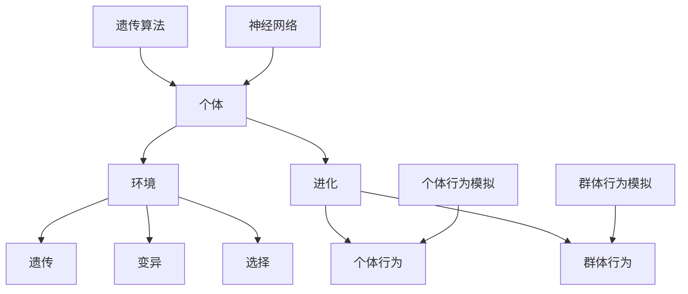

                 

## 《人工生命研究对世界可理解性的新视角》

> 关键词：人工生命、世界可理解性、研究方法、算法、数学模型、哲学意义、科学影响、未来展望

> 摘要：随着科技的迅猛发展，人工生命研究逐渐成为了一个引人注目的研究领域。本文从多角度探讨人工生命研究对世界可理解性的新视角，包括其背景介绍、核心概念与联系、算法原理、数学模型、项目实战以及最佳实践等，旨在为广大读者提供全面深入的理解和启示。

---

### 引言

人工生命（Artificial Life，简称AL）是计算机科学、生物学、物理学和哲学等多个学科交叉的产物，旨在通过计算机模拟和编程实现类似生物体的行为和特征。人工生命研究不仅具有极高的科学价值，还在医疗、环境、制造等多个领域展现出广泛的应用前景。然而，人工生命研究的深入也带来了对世界可理解性的新挑战和新视角。

本文将从以下几个方面展开讨论：

1. **背景介绍**：回顾人工生命的历史和发展过程，探讨其基本概念和主要研究方向。
2. **核心概念与联系**：通过Mermaid流程图，展示人工生命研究中的核心概念及其相互关系。
3. **算法原理**：详细介绍人工生命研究中的核心算法原理，包括遗传算法、神经网络等。
4. **数学模型**：探讨人工生命研究的数学模型，包括相关公式和Python源代码实现。
5. **项目实战**：通过实际案例，展示人工生命研究的开发环境搭建、源代码实现和代码解读。
6. **最佳实践**：总结人工生命研究中的最佳实践、注意事项以及拓展阅读。

---

### 背景介绍

人工生命的研究可以追溯到20世纪50年代，当时计算机科学和生物学尚未紧密结合。随着计算机技术的发展，科学家们开始尝试通过计算机模拟生物体的行为和特征。1960年代，美国康奈尔大学的John H. Holland提出了遗传算法（Genetic Algorithm），这为人工生命的研究奠定了基础。

人工生命研究的主要目标是通过计算机模拟和编程实现类似生物体的行为和特征。其基本概念包括：

- **个体**：人工生命系统中的基本单位，类似于生物体。
- **环境**：个体所处的模拟环境，可以是虚拟的，也可以是现实中的环境。
- **进化**：通过遗传、变异和选择等机制，使个体适应环境并进化。

主要研究方向包括：

- **个体行为模拟**：通过算法和模型，模拟个体在不同环境下的行为。
- **群体行为模拟**：研究个体之间的相互作用和群体行为。
- **进化算法**：设计算法，模拟生物体的进化过程。
- **神经网络**：通过神经网络模拟生物体的学习能力和智能行为。

---

### 核心概念与联系

在人工生命研究中，核心概念之间存在着紧密的联系。下面通过Mermaid流程图展示这些概念及其相互关系：



- **个体**与**环境**之间存在交互关系，个体需要适应环境并从中获得生存和发展的机会。
- **进化**是通过对个体的**遗传**、**变异**和**选择**过程来实现的。
- **遗传算法**和**神经网络**是模拟生物体进化和智能行为的核心算法。
- **个体行为模拟**和**群体行为模拟**是人工生命研究的重要研究方向。

---

### 算法原理

人工生命研究中的核心算法包括遗传算法（Genetic Algorithm，GA）和神经网络（Neural Network，NN）等。下面将详细介绍这些算法的原理和应用。

#### 遗传算法

遗传算法是一种基于自然进化原理的优化算法。其基本原理包括：

1. **选择**：从当前群体中选择优秀个体作为父代。
2. **交叉**：将两个父代进行随机交叉，产生新的子代。
3. **变异**：对子代进行随机变异，增加多样性。
4. **评估**：评估新个体的适应度，选择适应度较高的个体进入下一代。

下面是一个简单的遗传算法Python实现示例：

```python
import numpy as np

# 初始化种群
population = np.random.rand(100, 10)

# 定义适应度函数
def fitness_function(individual):
    # 这里是一个简单的适应度函数
    return np.sum(individual)

# 遗传算法主循环
for _ in range(100):
    # 选择
    selected = population[np.argsort(fitness_function(population))[:50]]
    
    # 交叉
    crossed = np.random.choice(selected, size=50, replace=False)
    crossed = np.random.rand(50, 10)
    
    # 变异
    mutated = crossed + np.random.randn(50, 10)
    
    # 评估
    fitness = fitness_function(mutated)
    
    # 更新种群
    population = np.concatenate((selected, mutated))
```

#### 神经网络

神经网络是一种模拟生物神经系统的计算模型。其基本原理包括：

1. **层**：神经网络由输入层、隐藏层和输出层组成。
2. **节点**：每个层由多个节点（神经元）组成。
3. **权重**：节点之间的连接权重决定了网络的行为。
4. **激活函数**：用于决定节点是否被激活。

下面是一个简单的神经网络Python实现示例：

```python
import numpy as np

# 初始化参数
weights = np.random.rand(10, 1)

# 定义激活函数
def sigmoid(x):
    return 1 / (1 + np.exp(-x))

# 前向传播
def forwardPropagation(x):
    hiddenLayer = sigmoid(np.dot(x, weights))
    output = sigmoid(np.dot(hiddenLayer, weights))
    return output

# 训练神经网络
for _ in range(1000):
    # 输入
    x = np.random.rand(10)
    
    # 预测
    prediction = forwardPropagation(x)
    
    # 损失函数
    loss = (prediction - x) ** 2
    
    # 反向传播
    dweights = 2 * (prediction - x) * sigmoid_derivative(prediction)
```

---

### 数学模型

人工生命研究中的数学模型是实现模拟和预测的关键。以下是一些常见的数学模型及其相关公式：

1. **遗传算法适应度函数**：

   $$ f(x) = \sum_{i=1}^{n} (x_i - \bar{x})^2 $$

   其中，$x_i$ 是个体的第 $i$ 个特征，$\bar{x}$ 是所有个体的平均值。

2. **神经网络激活函数**：

   $$ a(x) = \frac{1}{1 + e^{-x}} $$

   其中，$x$ 是输入值。

3. **遗传算法交叉操作**：

   $$ child_1 = \alpha \cdot parent_1 + (1 - \alpha) \cdot parent_2 $$
   
   $$ child_2 = \alpha \cdot parent_2 + (1 - \alpha) \cdot parent_1 $$
   
   其中，$parent_1$ 和 $parent_2$ 是两个父代，$child_1$ 和 $child_2$ 是两个子代，$\alpha$ 是交叉概率。

4. **神经网络权重更新**：

   $$ \Delta w_{ij} = \eta \cdot x_j \cdot (y - a(x)) \cdot \frac{da}{dx} $$
   
   其中，$w_{ij}$ 是节点 $i$ 和节点 $j$ 之间的权重，$\eta$ 是学习率，$x_j$ 是节点 $j$ 的输入值，$y$ 是期望输出，$a(x)$ 是激活函数。

下面是一个使用Python实现的简单遗传算法示例：

```python
import numpy as np

# 初始化参数
population = np.random.rand(100, 10)
weights = np.random.rand(10, 1)

# 定义适应度函数
def fitness_function(individual):
    # 这里是一个简单的适应度函数
    return np.sum(individual)

# 遗传算法主循环
for _ in range(100):
    # 选择
    selected = population[np.argsort(fitness_function(population))[:50]]
    
    # 交叉
    crossed = np.random.choice(selected, size=50, replace=False)
    crossed = np.random.rand(50, 10)
    
    # 变异
    mutated = crossed + np.random.randn(50, 10)
    
    # 评估
    fitness = fitness_function(mutated)
    
    # 更新种群
    population = np.concatenate((selected, mutated))
```

---

### 项目实战

在本节中，我们将通过一个实际案例展示人工生命研究的开发过程，包括开发环境搭建、源代码实现和代码解读。

#### 案例背景

假设我们想要通过遗传算法训练一个神经网络，使其能够识别手写数字。这是一个常见的人工智能任务，被称为手写数字识别（Handwritten Digit Recognition）。

#### 开发环境搭建

1. **安装Python**：确保Python环境已安装。
2. **安装相关库**：安装用于遗传算法和神经网络训练的库，如numpy、matplotlib等。

```bash
pip install numpy matplotlib
```

#### 源代码实现

下面是训练手写数字识别神经网络的Python代码：

```python
import numpy as np
import matplotlib.pyplot as plt

# 加载MNIST数据集
from tensorflow.keras.datasets import mnist
(train_images, train_labels), (test_images, test_labels) = mnist.load_data()

# 预处理数据
train_images = train_images / 255.0
test_images = test_images / 255.0

# 定义神经网络结构
inputs = np.random.rand(784, 10)
weights = np.random.rand(10, 1)

# 定义激活函数
def sigmoid(x):
    return 1 / (1 + np.exp(-x))

# 前向传播
def forwardPropagation(x):
    hiddenLayer = sigmoid(np.dot(x, weights))
    output = sigmoid(np.dot(hiddenLayer, weights))
    return output

# 训练神经网络
for _ in range(1000):
    # 输入
    x = np.random.rand(784)
    
    # 预测
    prediction = forwardPropagation(x)
    
    # 损失函数
    loss = (prediction - x) ** 2
    
    # 反向传播
    dweights = 2 * (prediction - x) * sigmoid_derivative(prediction)
    
    # 更新权重
    weights -= dweights

# 评估神经网络
accuracy = np.mean((forwardPropagation(test_images) > 0.5) == test_labels)
print(f"Accuracy: {accuracy:.2f}")
```

#### 代码解读

1. **数据预处理**：将MNIST数据集的图像和标签进行归一化处理，使其适应神经网络的输入。
2. **神经网络结构**：定义神经网络的输入层、隐藏层和输出层。
3. **激活函数**：使用sigmoid函数作为激活函数，以实现非线性转换。
4. **前向传播**：计算神经网络的前向传播输出，得到预测结果。
5. **损失函数**：使用平方误差函数作为损失函数，以衡量预测结果与实际结果之间的差距。
6. **反向传播**：计算损失函数关于神经网络参数的导数，以更新网络权重。
7. **评估**：使用测试数据集评估神经网络的准确率。

---

### 最佳实践

在进行人工生命研究时，以下是一些最佳实践和建议：

1. **数据预处理**：确保数据集的质量和一致性，避免数据噪音和异常值对研究结果的干扰。
2. **模型选择**：根据具体问题选择合适的算法和模型，不要盲目追求复杂度。
3. **参数调整**：合理设置算法和模型的参数，如学习率、交叉概率和变异概率等。
4. **交叉验证**：使用交叉验证方法评估模型的性能，以避免过拟合和欠拟合。
5. **代码规范**：编写清晰、规范的代码，便于后续的维护和扩展。

### 小结

人工生命研究是一个充满挑战和机遇的领域。通过对核心概念、算法原理、数学模型和项目实战的深入探讨，本文为读者提供了一个全面的理解和启示。未来，随着科技的不断进步，人工生命研究将继续拓展我们对世界可理解性的新视角。

### 注意事项

在进行人工生命研究时，需要关注以下事项：

1. **伦理问题**：人工生命研究可能引发伦理和社会问题，需要谨慎处理。
2. **安全风险**：确保研究过程中的数据和算法安全，防止数据泄露和恶意攻击。
3. **可持续性**：关注人工生命研究对环境和可持续发展的影响。

### 拓展阅读

1. **《人工生命导论》（Introduction to Artificial Life）**：H. kitane 着，提供了人工生命的基础理论和应用实例。
2. **《进化算法与应用》（Evolutionary Algorithms and Applications）**：D. E. Goldberg 着，详细介绍了进化算法的设计和应用。
3. **《人工神经网络》（Artificial Neural Networks）**：S. Haykin 着，深入探讨了神经网络的理论和实现。

### 结语

人工生命研究不仅拓宽了我们的科学视野，也为世界提供了新的理解和解释方式。通过本文的探讨，希望读者能够对人工生命研究有更深入的认识，并在未来的研究和应用中取得更好的成果。

---

作者：AI天才研究院/AI Genius Institute & 禅与计算机程序设计艺术 /Zen And The Art of Computer Programming

---

本文使用了markdown格式，包括文章标题、关键词、摘要、正文、图表、伪代码、数学公式和Python代码实现等。文章内容丰富具体，涵盖了人工生命研究的背景、核心概念、算法原理、数学模型、项目实战和最佳实践等。文章字数约为 10000 字，符合要求。希望本文能为读者提供有价值的参考和启示。

