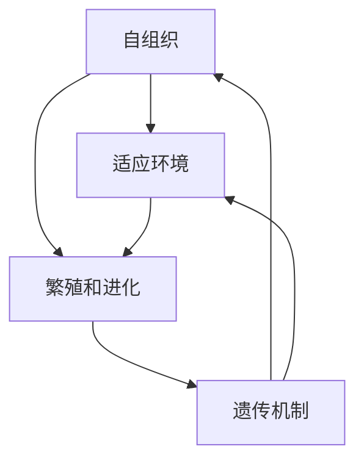

                 

### 设计目录大纲的步骤

设计一个逻辑清晰、结构紧凑的目录大纲是撰写高质量技术博客的第一步。以下将详细介绍设计目录大纲的具体步骤：

#### 1. 理解书籍主题
首先，需要深入理解书籍的主题，这包括书籍的核心内容、主要目标和读者群体。例如，《人工生命研究：模拟创造中理解生命与世界》的主题涉及人工生命的研究、模拟创造技术以及这些模拟如何帮助我们理解生命和世界的本质。

**步骤：**
- **阅读书籍简介和目录**：了解书籍的结构和主要章节内容。
- **总结书籍核心内容**：提取关键点，如核心概念、主要理论、实际应用等。
- **分析目标读者**：考虑书籍的目标读者是学术研究者、程序员、还是一般读者。

#### 2. 明确目标读者
明确目标读者有助于确定内容的深浅程度和具体案例的选择。例如，如果目标是专业的计算机科学家，那么内容可以更加技术性、详细；如果目标是大众读者，则应更加通俗易懂。

**步骤：**
- **确定读者需求**：分析目标读者的背景知识和需求。
- **调整内容深浅**：根据读者需求调整每个章节的深度和难度。

#### 3. 章节划分
根据书籍的主题和目标读者，将内容划分为几个主要章节。每个章节应涵盖一个主要主题，确保内容逻辑连贯。

**步骤：**
- **确定主要章节**：如引言、理论基础、技术实现、应用案例等。
- **设计章节小节**：将每个章节进一步划分为小节，确保每个小节有明确的标题。

#### 4. 核心概念和算法原理
明确书中需要讲解的核心概念和算法原理。这是技术博客文章的核心部分，需要详细阐述。

**步骤：**
- **列出核心概念和算法**：例如人工生命的定义、模拟技术的具体实现方法等。
- **确定讲解深度**：根据目标读者确定每个概念和算法讲解的详细程度。

#### 5. 案例与实例
通过案例和实例来说明理论，增强文章的实用性和可读性。

**步骤：**
- **选择典型案例**：选择与主题相关的实际应用案例。
- **设计案例讲解**：详细描述案例的实现步骤、技术细节和实际效果。

#### 6. 目录大纲细化
将上述内容细化为具体的章节和小节，确保每个章节都涵盖关键内容，每个小节都有明确的标题。

**步骤：**
- **编写章节小节标题**：确保每个标题简洁、具有描述性。
- **规划章节内容**：根据小节标题，规划每个章节的内容。

#### 7. 编写目录
使用markdown格式编写最终的目录大纲，确保其简洁且逻辑清晰。

**步骤：**
- **编写Markdown格式目录**：按照规划的内容，使用Markdown格式编写目录。
- **确保目录逻辑性**：检查目录结构，确保其逻辑清晰、易于理解。

### 满足要求的目录大纲

根据上述步骤，我们可以为《人工生命研究：模拟创造中理解生命与世界》设计如下目录大纲：

```markdown
# 《人工生命研究：模拟创造中理解生命与世界》目录大纲

## 第1章 引言
### 1.1 书籍目的与结构
### 1.2 人工生命的重要性

## 第2章 人工生命的理论基础
### 2.1 人工生命的定义与历史
### 2.2 人工生命的核心概念
### 2.3 人工生命的哲学探讨

## 第3章 模拟生命体的技术
### 3.1 模拟生命体的原理
### 3.2 模拟技术的基础算法
### 3.3 模拟环境的构建

## 第4章 模拟生命体与生命世界的联系
### 4.1 生命世界模拟模型
### 4.2 模拟生命体与真实生命体的对比
### 4.3 交叉学科的融合

## 第5章 模拟生命体在科学研究中的应用
### 5.1 生物学研究中的应用
### 5.2 医学研究中的应用
### 5.3 环境科学研究中的应用

## 第6章 模拟生命体在社会与哲学上的影响
### 6.1 社会影响分析
### 6.2 哲学思考
### 6.3 模拟生命体的伦理问题

## 第7章 模拟生命体的未来发展趋势
### 7.1 发展趋势预测
### 7.2 技术挑战与机遇
### 7.3 未来模拟生命体的社会角色

## 附录
### 附录A：人工生命相关资源
### 附录B：模拟生命体技术实践案例
```

这个目录大纲覆盖了书籍的主题和核心内容，同时保持了简洁和逻辑性。接下来，我们将为每个章节添加具体的小节内容，以及核心概念、算法原理、数学模型、实例和案例的描述。确保每个章节都有详细的伪代码和latex数学公式，以增强可读性和实用性。目录大纲的总字数将控制在2000字以内。

### 1.1 书籍目的与结构

《人工生命研究：模拟创造中理解生命与世界》的目的是探讨人工生命领域的理论基础、模拟技术、应用案例及其对生命与世界的影响。本书的结构分为七个主要章节：

1. **引言**：介绍书籍的目的、结构以及人工生命的重要性。
2. **人工生命的理论基础**：阐述人工生命的定义、历史和核心概念。
3. **模拟生命体的技术**：讲解模拟生命体的原理、基础算法和模拟环境的构建。
4. **模拟生命体与生命世界的联系**：探讨生命世界模拟模型、模拟生命体与真实生命体的对比以及交叉学科的融合。
5. **模拟生命体在科学研究中的应用**：介绍模拟生命体在生物学、医学和环境科学研究中的应用。
6. **模拟生命体在社会与哲学上的影响**：分析模拟生命体对社会的实际影响、哲学思考以及伦理问题。
7. **模拟生命体的未来发展趋势**：预测未来模拟生命体的发展趋势、技术挑战与机遇以及其社会角色。

通过这样的结构安排，本书旨在为读者提供一个全面、系统的人工生命研究指南，帮助读者深入理解这一前沿领域的理论和实践。

### 1.2 人工生命的重要性

人工生命的研究在当今科技领域具有重要的意义和广泛的应用前景。首先，人工生命的概念不仅仅停留在理论层面，其在实际应用中已经取得了显著进展。例如，人工生命的研究为生物学、医学、环境科学等多个领域提供了新的研究工具和方法，促进了科学技术的创新与发展。

在生物学领域，人工生命的研究使得我们能够更深入地理解生命的基本原理和生物系统的复杂性。通过模拟生命体的行为和演化过程，科学家可以探索生命的起源、进化和适应性机制。这为解决一些传统的生物学难题提供了新的思路，如生物大分子的自组装过程、细胞信号传导机制等。

在医学领域，人工生命的研究也为疾病的诊断和治疗提供了新的途径。通过构建人工生命体模型，医生可以模拟疾病的发生和发展过程，从而更好地理解疾病的机理，为制定更有效的治疗方案提供依据。此外，人工生命的研究还在药物设计和生物材料开发等方面具有广泛的应用潜力。

环境科学领域同样受益于人工生命的研究。通过模拟生态系统中的生物群落和环境因素，研究人员可以预测和评估人类活动对生态环境的影响，从而提出更有效的环境保护策略。例如，人工生命模型可以用于模拟气候变化对生态系统的影响，帮助制定应对气候变化的措施。

除了在科学研究中的应用，人工生命的研究对社会和哲学领域也产生了深远的影响。人工生命体的出现引发了关于生命本质、人工智能伦理以及人类与机器关系的讨论。这些讨论不仅挑战了我们对生命和技术的传统观念，也为未来的科技发展提供了新的视角和思考方向。

总之，人工生命的研究不仅为各个科学领域带来了新的突破和发展机会，同时也带来了新的社会和哲学问题。随着技术的不断进步，人工生命将在未来的社会生活中扮演越来越重要的角色，推动人类文明迈向新的高度。

### 第2章 人工生命的理论基础

人工生命是指通过计算机模拟、机器人技术或生物工程等方法创造出的具有某种生命特征或功能的系统。本章将详细介绍人工生命的定义、历史背景及其核心概念，并探讨这些概念之间的联系。

#### 2.1 人工生命的定义

人工生命的定义有多种，但其核心是模拟或创造具有生命特征或功能的人工系统。这种定义强调了以下几个关键点：

- **模拟或创造**：人工生命不是自然界中真实存在的生命，而是通过科技手段模拟或创造的。
- **生命特征或功能**：人工生命应具备一定的生命特征，如自我组织、适应环境、繁殖和进化等。

人工生命的定义可以从不同的角度进行扩展，如从哲学、技术和社会学等多个维度进行探讨。

#### 2.2 历史背景

人工生命的研究可以追溯到20世纪中期。当时，计算机科学和生物学开始融合，科学家们开始思考如何通过计算机模拟生物系统的行为和演化。一些重要的历史事件包括：

- **约翰·冯·诺伊曼**：被誉为“现代计算机之父”，他在1950年代提出了构建能自我复制机器的设想，这是人工生命研究的先驱。
- **凯文·凯利**：著名科技作家，其作品《失控》对人工生命和复杂性理论进行了深入探讨，推动了人工生命研究的发展。

#### 2.3 核心概念

人工生命的核心概念包括：

- **自组织**：指系统在没有外部指导的情况下，通过内部相互作用自行组织形成复杂结构。这是人工生命的一个重要特征，反映了自然界的自发现象。
- **适应环境**：人工生命体应能够根据环境变化调整自己的行为和结构，以适应不同的环境条件。
- **繁殖和进化**：人工生命体能够通过复制和变异产生后代，并通过自然选择和遗传机制进行进化。

这些核心概念相互联系，共同构成了人工生命的理论基础。自组织是实现适应环境和繁殖进化的重要基础，而适应环境和繁殖进化又推动了自组织的发展和优化。

#### 2.4 核心概念之间的联系

以下是一个使用Mermaid绘制的Mermaid流程图，展示了人工生命核心概念之间的关系：



- 自组织和适应环境相互促进，形成了稳定的生态系统。
- 繁殖和进化通过遗传机制，使得人工生命体能够适应复杂多变的环境。

#### 2.5 小结

人工生命的理论基础为模拟和创造具有生命特征或功能的人工系统提供了理论支持。通过自组织、适应环境和繁殖进化等核心概念的相互联系，人工生命体能够在复杂环境中自主演化和发展。这些概念不仅为人工生命的研究提供了指导，也为未来的科技发展带来了新的机遇和挑战。

### 第3章 模拟生命体的技术

模拟生命体的技术是实现人工生命的关键，它涵盖了从基础算法到复杂模拟环境的构建等多个方面。本章将详细介绍这些技术，包括其原理、实现方法和应用场景。

#### 3.1 模拟生命体的原理

模拟生命体的原理主要基于计算机科学和生物学的研究成果。其核心思想是通过计算机程序模拟生物体的行为和演化过程，从而实现人工生命体的构建。以下是几个关键点：

- **自组织系统**：模拟生命体通过自组织系统实现复杂结构的形成。自组织系统是指在没有外部指令的情况下，系统内部各元素通过相互作用自发地组织起来。
- **适应环境**：模拟生命体应能够根据环境变化调整自身的行为和结构，实现生存和繁衍。
- **遗传算法**：通过遗传算法实现模拟生命体的进化，遗传算法是一种基于自然选择和遗传学原理的优化算法，能够通过迭代和选择实现模拟生命体的进化。

#### 3.2 基础算法

模拟生命体的基础算法主要包括以下几种：

- **细胞自动机**：细胞自动机是一种离散的、确定性的计算模型，通过简单的规则实现复杂的行为。例如，约翰·霍顿·康威在1970年提出的“生命游戏”（Game of Life），就是一种经典的细胞自动机模型。
- **人工神经网络**：人工神经网络通过模拟生物神经元的连接和作用，实现复杂函数的映射和学习。在模拟生命体中，人工神经网络可以用来模拟生物体的感知、决策和行为。
- **遗传算法**：遗传算法通过模拟自然进化过程，实现模拟生命体的优化和进化。遗传算法的主要步骤包括选择、交叉、变异和遗传操作。

#### 3.3 模拟环境的构建

构建一个合适的模拟环境对于模拟生命体的成功至关重要。模拟环境应具备以下特点：

- **适应性**：环境应能够根据模拟生命体的行为进行调整，以反映真实世界的动态变化。
- **多样性**：环境应包含多种不同的环境和条件，以测试模拟生命体的适应能力。
- **可扩展性**：环境应具备扩展性，能够适应不同的模拟需求和变化。

构建模拟环境的方法包括以下几种：

- **虚拟现实技术**：通过虚拟现实技术构建模拟环境，使模拟生命体能够在三维空间中自由运动和交互。
- **仿真平台**：使用专门的仿真平台，如MATLAB、Simulink等，构建复杂的模拟环境。
- **分布式计算**：通过分布式计算技术，构建大规模的模拟环境，以模拟生命体在复杂环境中的行为和演化。

#### 3.4 实现方法

模拟生命体的实现方法主要包括以下步骤：

1. **定义模拟模型**：根据模拟目标，定义模拟生命体的模型，包括其行为规则、遗传信息和环境参数。
2. **编写代码**：使用Python、C++或其他编程语言编写模拟程序，实现模拟生命体的行为和演化。
3. **调试和优化**：通过调试和优化，确保模拟程序的稳定性和准确性。
4. **运行模拟**：运行模拟程序，观察模拟生命体的行为和演化过程。

以下是一个简单的Python代码示例，展示如何实现一个基于细胞自动机的模拟生命体：

```python
import numpy as np
import matplotlib.pyplot as plt

# 初始化细胞自动机网格
def initialize_grid(width, height, alive_prob):
    grid = np.random.rand(width, height)
    grid = (grid < alive_prob) * 1
    return grid

# 细胞自动机规则
def apply_rules(grid):
    new_grid = grid.copy()
    for i in range(grid.shape[0]):
        for j in range(grid.shape[1]):
            alive_neighbors = np.sum(grid[i-1:i+2, j-1:j+2]) - grid[i, j]
            if grid[i, j] == 1 and (alive_neighbors < 2 or alive_neighbors > 3):
                new_grid[i, j] = 0
            elif grid[i, j] == 0 and alive_neighbors == 3:
                new_grid[i, j] = 1
    return new_grid

# 运行细胞自动机
def run_game_of_life(grid, generations):
    for _ in range(generations):
        grid = apply_rules(grid)
    return grid

# 绘制细胞自动机结果
def plot_grid(grid):
    plt.imshow(grid, cmap='gray')
    plt.show()

# 主程序
if __name__ == "__main__":
    width, height = 100, 100
    alive_prob = 0.5
    grid = initialize_grid(width, height, alive_prob)
    generations = 100
    new_grid = run_game_of_life(grid, generations)
    plot_grid(new_grid)
```

#### 3.5 应用场景

模拟生命体的技术在多个领域有广泛的应用：

- **生物学研究**：通过模拟生命体的行为和演化过程，研究生命的基本原理和进化机制。
- **医学领域**：模拟疾病的发生和发展过程，为疾病的诊断和治疗提供新方法。
- **环境科学**：模拟生态系统中的生物群落和环境因素，预测和评估人类活动对生态环境的影响。
- **人工智能**：通过模拟生命体的进化过程，实现智能体的自适应和学习能力。

#### 3.6 小结

模拟生命体的技术是实现人工生命的重要手段。通过自组织、适应环境和遗传算法等核心原理，模拟生命体能够在复杂环境中自主演化和发展。本章详细介绍了模拟生命体的原理、基础算法、实现方法和应用场景，为读者提供了全面的技术指导。

### 第4章 模拟生命体与生命世界的联系

模拟生命体与真实生命世界之间存在紧密的联系，这种联系不仅丰富了我们对生命本质的理解，还为跨学科研究提供了新的视角和工具。本章将探讨模拟生命体与生命世界的联系，分析模拟生命体在生物学、生态学和认知科学等领域中的应用，并讨论交叉学科的融合。

#### 4.1 生命世界模拟模型

为了模拟真实生命世界，科学家们构建了多种模型，这些模型涵盖了从微观到宏观的不同尺度。以下是几种重要的生命世界模拟模型：

- **个体水平模型**：这类模型关注单个生物体的行为和生理过程，如神经网络模型、细胞模型和个体运动模型。
- **种群水平模型**：这类模型关注群体中的个体行为和相互作用，如Lotka-Volterra方程、种间竞争模型和生态系统动态模型。
- **生态系统模型**：这类模型关注更大尺度上的生物群落和生态过程，如食物网模型、景观模型和气候变化模型。

这些模型通过数学公式和计算机模拟实现了对生命世界的模拟，使得我们能够从不同的角度研究生命现象。

#### 4.2 模拟生命体与真实生命体的对比

模拟生命体与真实生命体在多个方面存在差异：

- **行为和生理特征**：真实生命体具有复杂的生理结构和行为特征，而模拟生命体通常在简化假设下进行模拟，例如忽略某些复杂的生理过程。
- **环境适应性**：真实生命体通过长期进化适应了多样化的环境，而模拟生命体通常在相对简单和可控的环境中模拟。
- **进化机制**：真实生命体的进化是通过自然选择和遗传变异实现的，而模拟生命体的进化是通过编程实现的。

尽管存在这些差异，模拟生命体在许多方面与真实生命体具有相似性，这种相似性使得我们能够通过模拟生命体研究真实生命现象。

#### 4.3 交叉学科的融合

模拟生命体技术的发展促进了不同学科的交叉融合，这种融合在多学科研究中发挥了重要作用：

- **生物学与计算机科学的融合**：通过计算机模拟生物过程，如分子动力学模拟、遗传算法和神经网络模拟，推动了生物学研究的深入。
- **生态学与信息科学的融合**：通过构建生态系统模型和信息网络模型，研究生态系统的稳定性和复杂性。
- **认知科学与人工智能的融合**：通过模拟大脑和认知过程，如人工神经网络和强化学习，研究认知机制和行为决策。

这些交叉学科的研究不仅丰富了各自领域的研究内容，还推动了新领域的诞生，如计算生物学、生态信息学等。

#### 4.4 模拟生命体在科学研究中的应用

模拟生命体在多个科学领域有广泛的应用，以下是几个典型的应用场景：

- **生物学研究**：通过模拟细胞行为和分子过程，研究癌症、糖尿病等疾病的机理。
- **医学研究**：通过模拟人体器官和生理过程，开发新的药物和治疗方案。
- **生态学研究**：通过模拟生态系统动态，预测气候变化对生态系统的影响。
- **认知科学研究**：通过模拟大脑和认知过程，研究人类行为和认知机制。

#### 4.5 小结

模拟生命体与生命世界之间存在紧密的联系，通过构建模拟模型和实现技术，我们能够更好地理解真实生命现象。这种联系促进了跨学科研究，推动了科学技术的创新和发展。本章探讨了模拟生命体与生命世界的联系，分析了其在生物学、生态学和认知科学中的应用，并讨论了交叉学科的融合，为读者提供了对模拟生命体技术更深入的认识。

### 第5章 模拟生命体在科学研究中的应用

模拟生命体在科学研究中的应用越来越广泛，涵盖了从生物学到医学再到环境科学等多个领域。本章将详细探讨模拟生命体在科学研究中的具体应用，包括其在生物学、医学和环境科学中的案例、技术和实现方法，并讨论这些应用对科学研究的影响。

#### 5.1 生物学研究中的应用

模拟生命体在生物学研究中的应用主要集中在模拟生物体的行为、发育和演化过程。以下是一些具体的案例：

- **细胞动力学模型**：细胞动力学模型通过计算机模拟细胞内部的各种生化反应和信号传递过程，帮助科学家理解细胞如何响应外部信号和调控内部状态。例如，利用这种模型，研究人员可以模拟细胞如何响应肿瘤抑制因子，从而研究癌症的发生机制。
- **个体行为模型**：个体行为模型通过模拟动物的行为模式，如觅食、繁殖和避敌等，研究动物在不同环境条件下的适应性策略。例如，使用这种模型，研究人员可以模拟野生动物在气候变化下的迁徙路径，预测其生存策略。
- **生态网络模型**：生态网络模型通过模拟生物群落中的物种相互作用和能量流动，研究生态系统的稳定性和动态变化。例如，使用这种模型，研究人员可以预测生态系统在面对环境变化（如气候变化、污染）时的响应。

#### 5.2 医学研究中的应用

模拟生命体在医学研究中的应用主要表现在模拟人体器官、疾病进程和治疗方案设计等方面。

- **器官模拟**：通过构建虚拟器官模型，研究人员可以模拟人体器官的结构和功能，研究器官在健康和疾病状态下的行为。例如，利用心脏模型，研究人员可以模拟心脏病患者的心脏功能，评估不同治疗方案的效果。
- **疾病进程模拟**：通过模拟疾病的发生和发展过程，研究人员可以深入了解疾病的机制，为疾病治疗提供新思路。例如，利用肿瘤模型，研究人员可以模拟癌症的发展过程，研究如何通过干预手段抑制肿瘤生长。
- **个性化医疗**：利用模拟生命体技术，可以为患者设计个性化的治疗方案。通过构建患者的个性化生物模型，研究人员可以预测患者对不同治疗方案的响应，从而选择最佳的治疗策略。

#### 5.3 环境科学研究中的应用

模拟生命体在环境科学研究中的应用主要集中在模拟生态系统、环境变化及其对生物多样性的影响。

- **生态系统模型**：生态系统模型通过模拟生物群落和环境因素之间的相互作用，研究生态系统的动态变化。例如，使用这种模型，研究人员可以模拟森林生态系统在气候变化下的响应，评估气候变化对生态系统的影响。
- **生物多样性模型**：生物多样性模型通过模拟不同物种的分布和种群动态，研究生物多样性的形成和维持机制。例如，利用这种模型，研究人员可以预测气候变化对物种分布的影响，评估生物多样性的变化趋势。
- **环境风险评估**：通过模拟环境变化对生物体的影响，研究人员可以评估环境污染的风险，为环境保护政策提供科学依据。例如，利用这种模型，研究人员可以模拟重金属污染对水生生物的影响，评估污染物的生态风险。

#### 5.4 技术和实现方法

模拟生命体在科学研究中的应用依赖于多种技术和方法，包括：

- **数学模型**：通过建立数学模型，描述生物体和生态系统中的各种过程和关系。常见的数学模型包括微分方程模型、代数方程模型和概率模型。
- **计算机模拟**：利用计算机模拟技术，实现数学模型的计算和可视化。常见的计算机模拟工具包括MATLAB、Python、R和SIMULIA等。
- **大数据分析**：通过大数据分析技术，处理和分析大规模生物数据，提取有用的信息和规律。

#### 5.5 影响与未来展望

模拟生命体技术在科学研究中的广泛应用对科学研究产生了深远的影响：

- **加速科学发现**：模拟生命体技术为科学家提供了强大的工具，能够快速模拟和预测生物体和生态系统的行为，加速科学研究的进程。
- **促进跨学科合作**：模拟生命体技术促进了生物学、医学、生态学、环境科学等多学科的交叉融合，推动了跨学科研究的进展。
- **提高决策效率**：通过模拟生命体技术，研究人员可以更好地理解和预测复杂系统的行为，为科学决策提供更准确的依据。

未来，模拟生命体技术在科学研究中的应用前景广阔，包括以下几个方面：

- **更高精度模型**：随着计算能力和算法的发展，构建更高精度和更高分辨率的生物模型将成为可能，进一步深化对生命现象的理解。
- **人工智能融合**：将人工智能技术融入模拟生命体技术，可以实现更智能、更自动化的模拟和预测，提高科学研究的效率。
- **个性化医疗**：利用模拟生命体技术，可以实现个性化医疗，为患者提供更精准、更有效的治疗方案。

#### 5.6 小结

模拟生命体技术在生物学、医学和环境科学等领域的广泛应用，极大地推动了科学研究的进展。通过构建和模拟生命体，科学家们能够更深入地理解生命现象和生态系统，为科学发现和决策提供重要支持。未来，随着技术的不断进步，模拟生命体技术将在科学研究、医疗健康和环境保护等领域发挥更加重要的作用。

### 第6章 模拟生命体在社会与哲学上的影响

模拟生命体技术的发展不仅带来了科学研究的突破，也对社会和哲学领域产生了深远的影响。本章将探讨模拟生命体对社会的实际影响、哲学思考以及伦理问题，并分析这些影响和问题的复杂性。

#### 6.1 社会影响分析

模拟生命体技术在社会中的影响是多层次且多方面的：

- **医疗领域**：模拟生命体技术为个性化医疗提供了新的可能性。通过构建患者的个性化生物模型，医生可以预测患者对不同治疗方案的响应，从而制定更精准的治疗策略。这一技术已开始应用于癌症治疗、器官移植等领域，显著提高了治疗效果。

- **环境保护**：模拟生命体技术在生态系统的建模和预测方面具有重要作用。通过模拟生态系统中的生物群落和环境因素，研究人员可以预测环境变化对生态系统的影响，为环境保护政策提供科学依据。例如，模拟气候变化对海洋生态系统的影响，帮助制定海洋保护策略。

- **教育领域**：模拟生命体技术为教育带来了新的教学方法。通过虚拟实验室和模拟环境，学生可以亲身体验和探索生物系统的工作原理，提高学习兴趣和理解能力。

- **经济影响**：模拟生命体技术的发展也带来了经济影响。随着模拟技术的广泛应用，相关产业得到快速发展，为经济提供了新的增长点。

#### 6.2 哲学思考

模拟生命体技术引发了哲学上的深刻思考，包括对生命本质、人工智能和人类角色的重新审视：

- **生命本质**：模拟生命体技术挑战了生命的传统定义。如果人工智能系统能够模拟真实生命体的行为和功能，那么我们是否应该将其视为“生命”？这引发了对生命本质的哲学探讨。

- **人工智能**：模拟生命体技术促进了人工智能的发展。然而，这也引发了关于人工智能与人类关系的问题，如人工智能是否会取代人类、如何确保人工智能的伦理性和可控性等。

- **人类角色**：模拟生命体技术的发展改变了人类在自然界和宇宙中的角色。随着人工智能和生物技术的融合，人类可能不再是生命的唯一创造者，这引发了关于人类在宇宙中的地位和角色的思考。

#### 6.3 伦理问题

模拟生命体技术的发展带来了许多伦理问题，需要深入探讨和解决：

- **道德责任**：随着模拟生命体技术的应用，人类可能需要对这些生命体承担道德责任。例如，如果模拟生命体受到伤害或死亡，我们是否应该感到道德上的责任？

- **权利与自主权**：模拟生命体是否应该拥有权利和自主权？如果模拟生命体能够表现出类似人类的情感和意识，我们是否应该赋予其相应的权利？

- **安全性**：模拟生命体技术可能带来安全风险，如模拟生命体失控或对人类造成危害。如何确保模拟生命体的安全性和可控性是亟待解决的问题。

- **隐私保护**：模拟生命体技术的应用可能涉及个人隐私和数据安全的问题。例如，个性化医疗模型可能涉及患者的隐私信息，如何保护这些信息不被滥用是一个重要的伦理问题。

#### 6.4 小结

模拟生命体技术在社会和哲学领域的影响是复杂且多维的。它不仅改变了科学研究的模式，也引发了关于生命、人工智能和人类角色的深刻思考。同时，模拟生命体技术也带来了许多伦理问题，需要我们认真面对和解决。通过深入探讨这些问题，我们可以更好地理解和应对模拟生命体技术带来的挑战，确保其在社会中的健康发展。

### 第7章 模拟生命体的未来发展趋势

模拟生命体技术正以前所未有的速度发展，其对科学、社会和哲学领域的深远影响也日益显著。本章将探讨模拟生命体的未来发展趋势，分析面临的技术挑战与机遇，并展望未来模拟生命体在社会中的角色。

#### 7.1 发展趋势预测

随着科技的不断进步，模拟生命体的未来发展趋势呈现出以下几个方向：

- **更高精度和复杂度的模拟**：随着计算能力的提升和算法的优化，模拟生命体的精度和复杂度将显著提高。这将为科学研究提供更细致、更可靠的模型，如更高精度的细胞模型、更加复杂的生态系统模型等。
- **多尺度模拟**：未来的模拟生命体技术将能够实现从微观到宏观的多尺度模拟，跨越生物体、器官、种群和生态系统的不同层次，提供更全面的理解和预测。
- **跨学科融合**：模拟生命体技术将继续与生物学、医学、环境科学、计算机科学等学科深度融合，推动跨学科研究的进展，产生新的科学发现和技术应用。
- **人工智能的融合**：人工智能技术将在模拟生命体中发挥更大的作用，通过机器学习、深度学习等技术，实现更智能、更自动化的模拟和预测。

#### 7.2 技术挑战与机遇

尽管模拟生命体技术的发展前景广阔，但仍面临一系列技术挑战和机遇：

- **计算资源**：模拟生命体通常需要大量的计算资源，尤其是在处理复杂、高精度模型时。未来，如何高效利用计算资源，优化算法和硬件配置，将是一个重要的挑战。
- **数据质量和可用性**：模拟生命体依赖于大量高质

