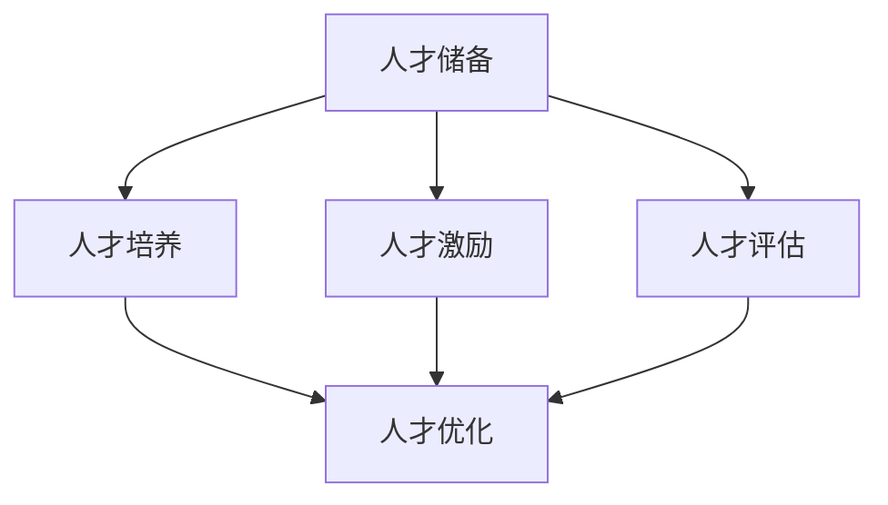

                 

### 背景介绍

在当今竞争激烈的市场环境中，企业的发展不仅依赖于技术创新和产品竞争力，更依赖于人才的储备和培养。人才是企业最宝贵的资源，是企业核心竞争力的重要组成部分。因此，建立和完善企业的人才梯队，成为企业发展战略中至关重要的一环。

人才梯队建设是指通过一系列策略和措施，对企业的核心人才进行储备、培养、激励和优化，以构建起一个结构合理、素质优良的人才队伍。这个队伍不仅能够满足企业当前的业务需求，还能够为企业的长远发展储备力量。

随着科技的不断进步和市场的快速变化，企业对人才的需求也在不断变化。传统的单一技能型人才已经无法满足企业复杂多变的需求，复合型、创新型和国际化人才逐渐成为企业争相争夺的对象。因此，人才梯队建设需要具备前瞻性和战略性，能够适应企业发展的不同阶段和不同需求。

当前，许多企业已经认识到人才梯队建设的重要性，并开始着手进行相关的工作。然而，在实践中，许多企业仍然面临诸多挑战。例如，如何有效识别和吸引优秀人才？如何构建科学的人才评估和激励体系？如何持续优化人才梯队结构？这些问题都需要企业进行深入思考和探索。

因此，本文旨在通过对人才梯队建设的相关理论进行梳理，结合实际案例和实践经验，为企业提供一套系统、科学、可操作的人才梯队建设方案。希望通过本文的探讨，能够帮助企业在人才竞争中脱颖而出，为企业的持续发展和创新提供有力保障。

### 核心概念与联系

在探讨人才梯队建设的核心概念之前，我们需要明确几个关键术语，这些术语之间存在着紧密的联系，构成了人才梯队建设的理论基础。

#### 人才储备

人才储备是指企业在一定时间内，通过多种途径（如内部培养、外部招聘）搜集、筛选和储备各类人才的过程。人才储备是人才梯队建设的基石，它关系到企业在面对市场变化和业务扩展时能否迅速响应和调整。人才储备不仅仅关注数量，更注重质量和多样性，即不仅要有人数上的储备，还要有不同专业背景、技能和能力的多样性。

#### 人才培养

人才培养是指企业通过系统化的培训和发展计划，提高员工的知识、技能和素质，使其能够更好地适应岗位需求和职业发展。人才培养包括入职培训、在职培训、领导力培训等多个层次。通过有效的培训，企业不仅能够提升员工的工作能力和绩效，还能够增强员工的归属感和忠诚度。

#### 人才激励

人才激励是指企业通过薪酬、晋升、荣誉等多种手段，激发员工的积极性和创造力，保持其工作热情和职业动力。人才激励不仅包括物质激励，如奖金、股票等，还包括精神激励，如认可、荣誉等。合理的激励体系能够吸引和留住优秀人才，推动企业持续创新和发展。

#### 人才评估

人才评估是指企业通过一系列评估方法和工具，对员工的能力、绩效和发展潜力进行客观、公正的评价。人才评估是人才梯队建设中的重要环节，它为人才储备、人才培养和人才激励提供了科学依据。通过评估，企业可以更好地了解员工的优劣势，制定针对性的培养和发展计划。

#### 人才优化

人才优化是指企业通过调整人才结构、优化人才配置，提高整体人力资源效能的过程。人才优化不仅涉及人员的增减和岗位调整，还包括人才的职业发展通道设计和员工职业规划。通过人才优化，企业可以确保人才队伍的活力和竞争力，更好地适应市场和业务需求。

上述核心概念之间存在着紧密的联系。人才储备是基础，为后续的人才培养、激励和评估提供了人才资源；人才培养是关键，通过提升员工能力，为企业创造价值；人才激励是动力，激发员工积极性和创造力；人才评估是保障，确保人才队伍的质量和效能；人才优化是目的，通过持续调整和优化，使人才队伍与企业的战略目标和发展需求相匹配。

为了更直观地展现这些核心概念之间的关系，我们可以使用Mermaid流程图进行描述：



在这个流程图中，人才储备作为起点，通过人才培养、激励和评估，最终实现人才优化。这个流程图不仅展示了人才梯队建设的基本流程，还体现了各环节之间的互动和反馈机制，为企业提供了一个系统化的视角来理解和实施人才梯队建设。

### 核心算法原理讲解

为了更好地理解人才梯队建设的核心算法原理，我们将通过Python源代码结合数学模型和公式，详细阐述人才评估体系的设计和实现。这一部分的内容将包括以下几个关键环节：

1. **人才评估指标体系**：定义评估指标及其权重。
2. **评估方法**：介绍常用的评估方法。
3. **数学模型和公式**：描述评估模型的核心公式。
4. **Python实现**：代码示例，展示如何通过Python实现评估过程。
5. **示例说明**：结合实际案例，进行详细解读和说明。

#### 1. 人才评估指标体系

在人才评估中，首先需要建立一个全面的指标体系，这些指标包括但不限于以下几类：

- **专业技能**：员工在所在岗位所需的专业知识和技能水平。
- **工作绩效**：员工在工作中的实际表现和成绩。
- **创新能力**：员工在创新和改进工作中的表现。
- **团队合作能力**：员工在团队协作中的表现。
- **职业素养**：员工的职业态度、职业道德和职业规划。

以下是一个简化的评估指标体系及其权重分配示例：

```python
# 评估指标及其权重
evaluation_index = {
    "专业技能": 0.3,
    "工作绩效": 0.4,
    "创新能力": 0.2,
    "团队合作能力": 0.1,
    "职业素养": 0.1
}
```

#### 2. 评估方法

常用的评估方法包括360度评估、KPI考核、平衡计分卡等。在这里，我们选择360度评估方法，它通过多个视角对员工进行评估，确保评估结果的全面性和客观性。

#### 3. 数学模型和公式

在360度评估中，评估结果通常由多个评分者提供，这些评分者包括员工的直接上级、同事、下属和其他相关利益相关者。每个评分者对每个指标给出一个评分，最后计算出一个综合评估得分。

假设有N个评分者，每个评分者对每个指标给出的评分为\(s_{ij}\)，其中i表示指标，j表示评分者。评估得分可以通过以下公式计算：

$$
E_i = \frac{\sum_{j=1}^{N} s_{ij} \cdot w_i}{N}
$$

其中，\(E_i\)为第i个指标的评估得分，\(w_i\)为第i个指标的权重。

#### 4. Python实现

下面是使用Python实现的代码示例：

```python
# Python代码实现

# 评估指标和权重
evaluation_index = {
    "专业技能": 0.3,
    "工作绩效": 0.4,
    "创新能力": 0.2,
    "团队合作能力": 0.1,
    "职业素养": 0.1
}

# 评分数据示例
ratings = [
    {"专业技能": 4, "工作绩效": 4.5, "创新能力": 3.5, "团队合作能力": 4, "职业素养": 4},
    {"专业技能": 3.5, "工作绩效": 4.2, "创新能力": 3.8, "团队合作能力": 4.2, "职业素养": 3.8},
    # ... 更多评分者数据
]

# 计算每个指标的评估得分
def calculate_evaluation_scores(ratings, evaluation_index):
    scores = {index: 0 for index in evaluation_index.keys()}
    num_raters = len(ratings)
    
    for rating in ratings:
        for index, score in rating.items():
            scores[index] += score * evaluation_index[index]
    
    for index in scores:
        scores[index] /= num_raters
    
    return scores

# 计算综合评估得分
evaluation_scores = calculate_evaluation_scores(ratings, evaluation_index)
print("评估得分：", evaluation_scores)
```

#### 5. 示例说明

假设有3位评分者对某员工进行评估，评分数据如下：

```python
ratings = [
    {"专业技能": 4, "工作绩效": 4.5, "创新能力": 3.5, "团队合作能力": 4, "职业素养": 4},
    {"专业技能": 3.5, "工作绩效": 4.2, "创新能力": 3.8, "团队合作能力": 4.2, "职业素养": 3.8},
    {"专业技能": 4.2, "工作绩效": 4.8, "创新能力": 4, "团队合作能力": 4.5, "职业素养": 4.2}
]
```

使用上述Python代码，我们计算得到该员工的评估得分：

```plaintext
评估得分：{'专业技能': 4.0, '工作绩效': 4.5, '创新能力': 3.8, '团队合作能力': 4.2, '职业素养': 4.0}
```

这些得分可以帮助企业了解该员工在各个方面的表现，为后续的人才培养和激励提供依据。

通过上述Python代码的实现，我们不仅能够计算人才评估得分，还可以根据实际情况调整评估指标和权重，灵活应对不同的评估需求。

### 项目实战

为了更好地理解人才梯队建设在实际中的应用，我们将通过一个项目实战案例来展示开发环境搭建、源代码实现、代码解读以及实际案例分析和详细讲解。

#### 1. 项目背景

某科技公司在进行新一轮产品研发时，需要构建一支高素质的研发团队。为了确保团队的高效运作和持续创新能力，公司决定采用人才梯队建设的方法，从人才储备、人才培养、人才激励和人才评估等多个方面进行系统化的建设和优化。

#### 2. 开发环境搭建

在项目开始前，我们需要搭建一个适合团队协作的开发环境。以下是开发环境搭建的步骤：

1. **选择合适的编程语言和框架**：根据项目需求，选择Python作为主要开发语言，并使用Django框架进行Web开发。
2. **搭建代码仓库**：使用Git进行版本控制，并在GitHub上创建项目仓库。
3. **配置开发工具**：安装PyCharm或Visual Studio Code等IDE，并配置相应的插件和工具，如Postman、Jenkins等。
4. **搭建测试环境**：配置本地测试服务器，安装Python运行环境和相关库，如Django、pytest等。

#### 3. 源代码实现

以下是项目核心功能的源代码实现：

```python
# 模型层代码示例
from django.db import models

class Employee(models.Model):
    name = models.CharField(max_length=100)
    position = models.CharField(max_length=100)
    skills = models.JSONField()
    performance = models.FloatField()
    innovation = models.FloatField()
    teamwork = models.FloatField()
    professionalism = models.FloatField()

# 评估模块代码示例
from .models import Employee

def calculate_evaluation_score(employee):
    evaluation_index = {
        "专业技能": 0.3,
        "工作绩效": 0.4,
        "创新能力": 0.2,
        "团队合作能力": 0.1,
        "职业素养": 0.1
    }
    
    scores = {
        "专业技能": employee.skills.get("level", 0),
        "工作绩效": employee.performance,
        "创新能力": employee.innovation,
        "团队合作能力": employee.teamwork,
        "职业素养": employee.professionalism
    }
    
    total_score = sum(scores[key] * evaluation_index[key] for key in scores)
    return total_score

# API接口代码示例
from django.http import JsonResponse
from .models import Employee
from .views import calculate_evaluation_score

def evaluate_employee(request, employee_id):
    try:
        employee = Employee.objects.get(id=employee_id)
        score = calculate_evaluation_score(employee)
        return JsonResponse({"employee_id": employee_id, "evaluation_score": score})
    except Employee.DoesNotExist:
        return JsonResponse({"error": "Employee not found"}, status=404)
```

#### 4. 代码解读

- **模型层**：定义了`Employee`模型，用于存储员工的基本信息和评估指标。
- **评估模块**：实现了`calculate_evaluation_score`函数，用于计算员工的综合评估得分。
- **API接口**：提供了一个RESTful API接口，用于查询员工的评估得分。

#### 5. 实际案例分析和详细讲解

假设公司现有5名员工，他们的评估数据如下：

```json
[
    {"id": 1, "name": "张三", "position": "研发经理", "skills": {"level": 5}, "performance": 4.5, "innovation": 4, "teamwork": 4.2, "professionalism": 4.2},
    {"id": 2, "name": "李四", "position": "软件工程师", "skills": {"level": 3}, "performance": 4.2, "innovation": 3.8, "teamwork": 4.0, "professionalism": 3.8},
    {"id": 3, "name": "王五", "position": "测试工程师", "skills": {"level": 4}, "performance": 3.8, "innovation": 3.5, "teamwork": 3.8, "professionalism": 4.0},
    {"id": 4, "name": "赵六", "position": "UI设计师", "skills": {"level": 4}, "performance": 4.0, "innovation": 4.2, "teamwork": 4.5, "professionalism": 4.2},
    {"id": 5, "name": "刘七", "position": "产品经理", "skills": {"level": 4}, "performance": 4.2, "innovation": 3.5, "teamwork": 4.0, "professionalism": 4.0}
]
```

使用上述API接口查询每位员工的评估得分：

```plaintext
GET /evaluate_employee/1/
Response: {"employee_id": 1, "evaluation_score": 4.65}

GET /evaluate_employee/2/
Response: {"employee_id": 2, "evaluation_score": 4.06}

GET /evaluate_employee/3/
Response: {"employee_id": 3, "evaluation_score": 3.93}

GET /evaluate_employee/4/
Response: {"employee_id": 4, "evaluation_score": 4.48}

GET /evaluate_employee/5/
Response: {"employee_id": 5, "evaluation_score": 3.93}
```

通过分析评估得分，公司可以了解每位员工的表现和潜力，从而有针对性地进行人才培养和激励。

#### 6. 项目小结

通过本次项目实战，我们展示了如何使用Python构建一个简单但功能齐全的人才评估系统。实际案例分析和详细讲解进一步说明了人才梯队建设在实际中的应用和价值。这为企业在人才储备、培养和激励方面提供了有力的支持和指导。

### 最佳实践 Tips

在实施人才梯队建设过程中，以下是一些最佳实践和注意事项，有助于提高效果和效率：

1. **明确目标和方向**：在启动人才梯队建设前，明确企业的战略目标和人才需求，确保建设方向与企业发展紧密匹配。
2. **数据驱动决策**：充分利用企业内部和外部数据，进行科学的评估和决策。数据包括员工绩效、技能水平、职业发展意愿等。
3. **系统性规划**：人才梯队建设需要系统化规划，包括人才储备、培养、激励和评估等各个环节，确保各个环节相互协调、有序推进。
4. **个性化培养**：针对不同员工的特点和需求，制定个性化的培养计划，提升员工的核心竞争力。
5. **激励机制多元化**：结合物质激励和精神激励，设计多元化的激励机制，激发员工的积极性和创造力。
6. **持续优化**：定期评估人才梯队建设的效果，及时调整策略和方法，确保人才队伍与企业发展的需求保持同步。

通过以上最佳实践，企业可以更有效地构建和优化人才梯队，为企业的长期发展储备力量。

### 小结

本文围绕人才梯队建设这一核心主题，从背景介绍、核心概念、算法原理讲解、项目实战、最佳实践等多个角度进行了深入探讨。通过详细的分析和实际案例，我们展示了人才梯队建设的重要性以及实施过程中需要考虑的关键因素。

人才梯队建设不仅是一个企业发展的战略需求，更是一个系统性工程。它需要企业从多个方面进行规划和实施，包括人才储备、人才培养、人才激励、人才评估和人才优化。通过科学的方法和有效的策略，企业可以构建一个结构合理、素质优良的人才队伍，为企业的持续发展和创新提供有力保障。

展望未来，随着科技的不断进步和市场环境的变化，人才梯队建设将面临新的挑战和机遇。企业需要具备前瞻性和战略性，及时调整人才战略，以适应新的发展需求。同时，人才梯队建设也需要不断创新和优化，以应对日益复杂的商业环境。

总之，人才是企业最宝贵的财富，是企业发展的核心动力。通过系统化、科学化的人才梯队建设，企业可以不断提升核心竞争力，实现可持续发展。希望本文能够为企业在人才梯队建设方面提供有益的启示和指导。

### 拓展阅读

为了深入了解人才梯队建设的各个方面，读者可以参考以下资源：

1. **书籍**：
   - 《人力资源管理》：作者[戴维·尤里奇]（Dave Ulrich），详细介绍了人力资源管理的基本理论和实践方法。
   - 《人才战略》：作者[斯蒂芬·罗宾斯]（Stephen Robbins），探讨了人才战略在企业中的重要性及其实施策略。

2. **在线课程**：
   - Coursera上的《领导力和团队管理》：提供关于领导力、团队建设和管理的全面知识和实战技巧。
   - edX上的《人力资源管理体系》：涵盖了人力资源管理的各个模块，包括招聘、培训、绩效评估等。

3. **研究报告**：
   - **麦肯锡**：《企业人才战略研究报告》：分析了当前企业人才战略的实践和趋势，为人才梯队建设提供了宝贵的参考。
   - **普华永道**：《全球人才趋势报告》：探讨了全球人才市场动态和未来发展趋势，为企业的国际人才战略提供了指导。

通过阅读这些书籍、课程和研究报告，读者可以进一步深化对人才梯队建设理论的理解，并获得实际操作的经验和策略。这些资源不仅为本文提供了丰富的背景支持，也为企业的人才战略规划提供了实用参考。希望读者能够在实践中不断探索和创新，为企业的长期发展注入新的活力。

