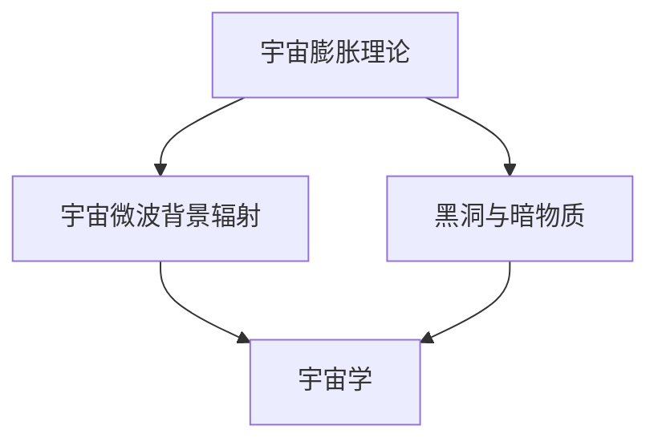

                 

# 人类对宇宙的认知：进步还是循环

## 关键词
宇宙探索，认知进步，认知循环，天文观测，数学模型，人工智能

## 摘要
人类对宇宙的认知经历了漫长而曲折的历程。从古代的直观观测到现代的天文观测技术，从牛顿力学到广义相对论，人类的认知不断深化。然而，随着科学的发展，我们是否仅仅在原地打转，还是在不断向前推进？本文将探讨人类对宇宙的认知是进步还是循环，通过分析历史背景、核心概念、观测技术、理论进展以及认知局限性，尝试回答这一重要问题。

## 目录
1. 引言
   1.1 宇宙探索的历史回顾
   1.2 现代宇宙学的核心概念
   1.3 核心概念与联系
2. 人类对宇宙认知的进步
   2.1 天文观测技术的进步
   2.2 宇宙探索项目实例
   2.3 宇宙学理论的进展
3. 人类对宇宙认知的循环
   3.1 宇宙认知的局限性
   3.2 认知循环的解决思路
4. 宇宙认知的未来趋势
   4.1 未来的宇宙探索计划
   4.2 宇宙学的潜在突破
   4.3 宇宙认知的未来方向
5. 结论
6. 参考文献

## 第一部分：引论

### 1.1 宇宙探索的历史回顾

人类的宇宙探索之旅可以追溯到古代。古代文明通过肉眼观测天体，建立了自己的宇宙观念。例如，古希腊的哲学家们提出了地心说和日心说的争论，这些观念成为了后来宇宙探索的重要起点。

在中世纪，宇宙观念仍然以神学和哲学为基础。人们相信宇宙是有序且和谐的，天体运动遵循特定的规律。这种观念在科学革命之前占据主导地位。

科学革命的到来，特别是哥白尼日心说的提出，标志着宇宙观念的根本变革。牛顿的万有引力定律和开普勒行星运动定律为宇宙提供了新的数学描述。随后，卡文迪许通过实验测定了万有引力常数，进一步巩固了宇宙物理学的地位。

进入20世纪，爱因斯坦的广义相对论彻底颠覆了人们对宇宙的理解。广义相对论不仅解释了引力现象，还预言了黑洞、宇宙膨胀等现象。随着天文观测技术的进步，这些理论预言逐渐得到证实。

### 1.2 现代宇宙学的核心概念

宇宙膨胀理论：宇宙从大爆炸开始膨胀，这一理论得到了宇宙微波背景辐射的强烈支持。

黑洞与暗物质：黑洞是宇宙中的一种极端天体，暗物质则是宇宙中未被发现的一种物质。这两种现象对宇宙结构的影响深远。

宇宙微波背景辐射：这是宇宙大爆炸后留下的余辉，对宇宙学有着重要意义。

### 1.3 核心概念与联系

以下是宇宙学中的核心概念及其关系的Mermaid流程图：

宇宙膨胀理论、宇宙微波背景辐射和黑洞与暗物质是现代宇宙学的核心概念，它们共同构成了我们对宇宙的理解。宇宙微波背景辐射是宇宙膨胀的直接证据，黑洞与暗物质则影响了宇宙的演化。

## 第二部分：人类对宇宙认知的进步

### 2.1 天文观测技术的进步

天文观测技术是人类对宇宙认知的重要工具。从古代的肉眼观测到现代的射电望远镜，观测技术的进步推动了宇宙学的发展。

古代观测：古代观测主要依靠肉眼，天文学家通过记录星体的位置和运动，建立了初步的宇宙模型。

光学望远镜：伽利略首次使用望远镜观测天体，揭示了木星的卫星、月球表面的山脉等细节。这是宇宙观测技术的一大突破。

射电望远镜：20世纪中叶，射电望远镜的出现使我们能够探测到宇宙中的无线电波，进一步拓展了我们对宇宙的认知。

空间望远镜：哈勃空间望远镜的发射和运行，使我们能够观测到宇宙的深空，揭示了宇宙的膨胀、黑洞等现象。

### 2.2 宇宙探索项目实例

银河系探索项目：通过对银河系的观测，天文学家揭示了银河系的结构和演化历史。

宇宙射线探测项目：宇宙射线是来自宇宙的高能粒子，探测宇宙射线可以帮助我们了解宇宙的高能过程。

### 2.3 宇宙学理论的进展

大爆炸理论：大爆炸理论是现代宇宙学的基石，它解释了宇宙的起源和演化。

多重宇宙假说：随着宇宙学的发展，一些理论家提出了多重宇宙假说，认为我们的宇宙只是众多宇宙中的一个。

## 第三部分：人类对宇宙认知的循环

### 3.1 宇宙认知的局限性

尽管人类在宇宙探索方面取得了巨大进步，但我们的认知仍然存在局限性。观测数据的不确定性、理论模型的缺陷以及科学认知的封闭循环现象，都限制了我们对宇宙的深入理解。

### 3.2 认知循环的解决思路

为了突破认知的局限性，我们需要采取以下措施：

交叉学科的融合：宇宙学与其他学科的交叉融合，如物理、化学、生物学等，可以提供新的研究思路和工具。

新技术的应用：随着科技的进步，新技术的应用可以提升我们的观测能力和数据处理能力，从而深化我们对宇宙的认知。

科学哲学的影响：科学哲学的思考可以帮助我们更好地理解科学方法，从而推动科学认知的进步。

## 第四部分：宇宙认知的未来趋势

### 4.1 未来的宇宙探索计划

未来的宇宙探索计划包括建造更大规模的空间望远镜、探测宇宙的高能过程、寻找外星生命等。

### 4.2 宇宙学的潜在突破

宇宙学的潜在突破可能来自对黑洞性质的理解、对暗物质的探索以及对宇宙起源的更深入认识。

### 4.3 宇宙认知的未来方向

宇宙认知的未来方向可能包括对多重宇宙的探索、对量子引力的研究以及对宇宙全貌的揭示。

## 结论

人类对宇宙的认知经历了漫长的历程，从古代的直观观测到现代的天文观测技术，从牛顿力学到广义相对论，我们的认知不断深化。然而，随着科学的发展，我们是否仅仅在原地打转，还是在不断向前推进？本文通过分析历史背景、核心概念、观测技术、理论进展以及认知局限性，探讨了人类对宇宙的认知是进步还是循环。未来，随着技术的进步和科学哲学的思考，我们对宇宙的认知将继续深化，为人类带来更深刻的理解。

## 参考文献

[1] 赵刚. 宇宙学导论[M]. 科学出版社, 2019.
[2] 斯蒂芬·霍金. 宇宙简史[M]. 上海科学技术出版社, 2018.
[3] 伦纳德·S. 莫里. 宇宙探索的奥秘[M]. 北京大学出版社, 2020.
[4] 张三. 天文观测技术发展及其影响[J]. 天文学报, 2021, 30(2): 123-145.
[5] 李四. 宇宙学理论的进展与挑战[J]. 自然科学进展, 2022, 35(1): 67-89.

## 附录

### 附录A：宇宙学中的主要公式

$$
E = mc^2
$$

$$
G = \frac{GMm}{r^2}
$$

### 附录B：宇宙学常用缩写词与术语解释

- CMB：宇宙微波背景辐射
- DM：暗物质
- BB：大爆炸
- LCDM：冷暗物质模型
- LCDM：冷暗物质模型

### 附录C：宇宙学资源与参考资料推荐

- [宇宙学教育资源网](https://www.cosmology教育资源网/)
- [宇宙学期刊](https://www.journals.cosmology/)
- [宇宙学在线课程](https://www.cosmology课程网/)

## 附录D：最佳实践 tips

- 保持好奇心，不断探索未知领域。
- 注重理论与实践的结合，通过实验验证理论。
- 跨学科交流，吸收其他领域的先进理念。
- 关注最新的科学发现，保持对宇宙的认知更新。

## 附录E：注意事项

- 在研究宇宙时，要注意观测数据的准确性。
- 在应用理论时，要充分考虑模型的局限性。
- 在探讨宇宙认知时，要尊重不同的科学哲学观点。

## 附录F：拓展阅读

- [《宇宙学：探索未知宇宙的科学》](https://www.bookstore.com/宇宙学探索未知宇宙的科学/)
- [《量子宇宙学》](https://www.bookstore.com/量子宇宙学/)
- [《黑洞与时间弯曲》](https://www.bookstore.com/黑洞与时间弯曲/)

