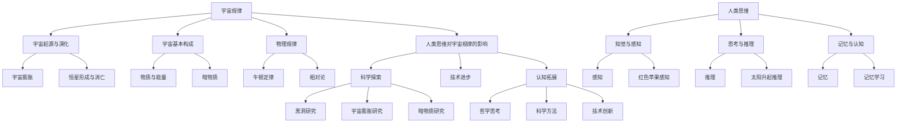

                 

# 《人类思维与宇宙规律：谁塑造了谁》

## 关键词
- 人类思维
- 宇宙规律
- 人类认知
- 认知科学
- 人工智能
- 脑科学

## 摘要
本文旨在探讨人类思维与宇宙规律之间的关系，深入分析两者之间的相互塑造作用。通过引入认知科学、脑科学和人工智能等相关领域的知识，我们试图回答一个根本性的问题：人类思维是如何影响我们对宇宙规律的理解，同时宇宙规律又是如何塑造我们的思维模式？本文将分为五个部分进行论述：第一部分介绍人类思维和宇宙规律的基本概念；第二部分探讨人类思维的核心原理；第三部分分析宇宙规律的基本特征；第四部分探讨人类思维与宇宙规律的交互影响；第五部分通过具体案例展示两者关系的实际应用。最后，我们对全文进行总结，并提出未来研究的方向。

## 第一部分：引言

### 1.1 人类思维的基本特征

人类思维是一种复杂的认知过程，它涉及到感知、记忆、思考、推理和判断等多个方面。根据认知科学的研究，人类思维具有以下基本特征：

1. **知觉与感知**：人类通过感官接收外界信息，进行初步的感知和分类。知觉是感知的高级阶段，涉及到对信息的处理和解释。
2. **思考与推理**：思考是人类对信息进行加工和处理的过程。推理是通过已知的信息推导出新的结论或判断。
3. **记忆与认知**：记忆是储存和提取信息的能力。认知是对信息的理解和处理，包括注意力、注意力分配、问题解决和决策等多个方面。

### 1.2 宇宙规律的初步探索

宇宙规律是描述宇宙中物体运动和相互作用的基本原理。根据宇宙学的研究，宇宙规律具有以下基本特征：

1. **宇宙的起源与演化**：宇宙起源于大约138亿年前的大爆炸，经历了不断的演化和发展。宇宙的演化规律包括宇宙膨胀、恒星形成和消亡等过程。
2. **宇宙的基本构成**：宇宙主要由物质、能量和暗物质组成。物质包括恒星、行星、星系等，能量包括光、热等。
3. **宇宙的物理规律**：宇宙中的物理现象遵循一系列基本的物理定律，如牛顿定律、爱因斯坦的相对论等。

### 1.3 人类思维与宇宙规律的关系

人类思维与宇宙规律之间存在密切的关系。首先，人类思维是我们理解和探索宇宙规律的基础。人类通过感知和思考，逐渐构建了对宇宙规律的认识。其次，宇宙规律对人类思维产生了深远的影响。宇宙中的物理现象和规律在一定程度上塑造了人类的认知方式和思维模式。

## 第二部分：人类思维原理

### 2.1 人类思维的核心概念

人类思维的核心概念包括知觉、感知、思考、推理和记忆等方面。以下是这些概念的基本原理：

1. **知觉与感知**：知觉是感知的高级阶段，涉及到对信息的处理和解释。感知是通过感官接收外界信息的过程。例如，我们看到一个红色的苹果，知觉使我们认识到这是一个红色的物体，感知则使我们感受到它的形状和颜色。
2. **思考与推理**：思考是对信息进行加工和处理的过程。推理是通过已知的信息推导出新的结论或判断。例如，我们知道太阳每天从东方升起，由此推理出太阳是从东方升起的。
3. **记忆与认知**：记忆是储存和提取信息的能力。认知是对信息的理解和处理，包括注意力、注意力分配、问题解决和决策等多个方面。

### 2.2 人类思维的架构

人类思维的架构涉及到神经科学、心理学和计算机科学等多个领域。以下是人类思维的架构：

1. **神经网络与脑科学**：脑科学研究表明，人类思维是由大脑中的神经网络实现的。神经网络是由大量神经元组成的复杂系统，通过神经元之间的连接和相互作用，实现信息的处理和传递。
2. **情感与行为**：情感和行为是人类思维的重要组成部分。情感是人类对环境和情境的内心体验，而行为则是人类对外界环境的反应。
3. **社会与文化影响**：社会和文化对人类思维产生了深远的影响。社会和文化背景塑造了人类的价值观、信念和思维方式。

### 2.3 人类思维的计算模型

人类思维的计算模型是基于人工智能和脑科学的最新研究成果。以下是几个典型的人类思维计算模型：

1. **人工神经网络**：人工神经网络是模拟人脑神经元连接结构的计算模型。通过多层神经元的连接和相互作用，实现复杂的函数映射和模式识别。
2. **机器学习算法**：机器学习算法是模拟人类思维和学习过程的计算模型。通过大量数据的训练，机器学习算法能够自动识别模式、分类和预测。
3. **深度学习架构**：深度学习架构是人工神经网络的一种扩展，通过多层神经网络实现更复杂的函数映射和模式识别。深度学习在图像识别、语音识别和自然语言处理等领域取得了显著成果。

### 2.4 人类思维与宇宙规律的关系

人类思维与宇宙规律之间的关系可以从多个角度进行分析。以下是几个可能的关系模型：

1. **影响模型**：人类思维对宇宙规律产生了影响。例如，人类通过科学实验和观察，逐渐揭示了宇宙中的物理规律。
2. **反馈模型**：宇宙规律对人类思维产生了反馈。例如，宇宙中的物理现象和规律在一定程度上塑造了人类的认知方式和思维模式。
3. **共生模型**：人类思维和宇宙规律相互影响、相互塑造。例如，人类通过探索宇宙规律，不断提高自身的认知水平，同时宇宙规律也在一定程度上影响了人类的文化和科技发展。

## 第三部分：宇宙规律探索

### 3.1 宇宙的基本规律

宇宙的基本规律包括宇宙的起源、演化、构成和物理现象等方面。以下是宇宙基本规律的核心内容：

1. **宇宙的起源与演化**：宇宙起源于大约138亿年前的大爆炸。自那时以来，宇宙经历了不断的膨胀、冷却和演化。宇宙的演化规律包括宇宙膨胀、恒星形成和消亡等过程。
2. **宇宙的基本构成**：宇宙主要由物质、能量和暗物质组成。物质包括恒星、行星、星系等，能量包括光、热等。暗物质是一种不发光、不吸收光线的物质，其存在主要通过引力效应来推测。
3. **宇宙的物理规律**：宇宙中的物理现象遵循一系列基本的物理定律，如牛顿定律、爱因斯坦的相对论等。这些物理定律描述了物体运动、能量转换和相互作用的基本规律。

### 3.2 人类对宇宙规律的认知

人类对宇宙规律的认知经历了漫长的历史过程。以下是人类对宇宙规律认知的主要阶段：

1. **古代认知**：古代人类通过观察天象和自然现象，逐渐形成了对宇宙的初步认识。例如，古埃及人通过观测星星的位置和移动，制定了日历。
2. **科学革命**：文艺复兴时期，科学革命推动了人类对宇宙规律的认识。伽利略通过望远镜观测天体，揭示了行星运动规律；牛顿提出了万有引力定律，奠定了经典物理学的基石。
3. **现代认知**：现代物理学和宇宙学的发展，使人类对宇宙规律的认识更加深入。相对论和量子力学揭示了宇宙的更深层次规律；宇宙膨胀、暗物质和暗能量等概念的提出，进一步拓展了人类对宇宙的认知。

### 3.3 人类思维与宇宙规律的关系

人类思维与宇宙规律之间的关系可以从多个角度进行分析。以下是几个可能的关系模型：

1. **影响模型**：人类思维对宇宙规律产生了影响。例如，人类通过科学实验和观察，逐渐揭示了宇宙中的物理规律。
2. **反馈模型**：宇宙规律对人类思维产生了反馈。例如，宇宙中的物理现象和规律在一定程度上塑造了人类的认知方式和思维模式。
3. **共生模型**：人类思维和宇宙规律相互影响、相互塑造。例如，人类通过探索宇宙规律，不断提高自身的认知水平，同时宇宙规律也在一定程度上影响了人类的文化和科技发展。

## 第四部分：人类思维与宇宙规律的交互影响

### 4.1 人类思维如何塑造宇宙规律

人类思维对宇宙规律的影响主要表现在以下几个方面：

1. **科学探索**：人类通过科学方法，对宇宙规律进行观察、实验和理论构建。例如，伽利略通过望远镜观测，揭示了行星运动规律；爱因斯坦通过相对论，解释了宇宙中的强引力现象。
2. **技术进步**：人类通过技术创新，改变了宇宙中的某些规律。例如，核能技术利用了核裂变和核聚变的原理；航天技术使人类能够探索宇宙，进一步认识宇宙的奥秘。
3. **认知拓展**：人类通过不断学习、思考和探索，不断拓展对宇宙规律的认识。例如，量子力学的提出，使人类对微观世界的规律有了更深入的理解。

### 4.2 宇宙规律如何影响人类思维

宇宙规律对人类思维的影响主要体现在以下几个方面：

1. **认知挑战**：宇宙中的某些规律对人类认知提出了挑战。例如，相对论和量子力学的概念，对人类的传统思维模式产生了冲击，迫使人类重新思考时间和空间、因果关系等基本概念。
2. **思维模式**：宇宙规律在一定程度上塑造了人类的思维模式。例如，宇宙的膨胀和暗物质的存在，使人类认识到宇宙中存在一些无法直接感知的巨大力量，这影响了人类对自然界的认识和解释。
3. **文化影响**：宇宙规律对人类文化产生了深远的影响。例如，宇宙的起源和演化过程，成为了人类哲学和宗教思考的重要主题，影响了人类的世界观和价值观。

### 4.3 人类思维与宇宙规律的未来展望

未来，人类思维与宇宙规律之间的关系将继续发展。以下是几个可能的趋势：

1. **科技进步**：随着科技的不断进步，人类将能够更好地理解宇宙规律，探索宇宙的更深处。例如，量子计算机和量子通信技术的发展，有望推动人类对量子世界的认识。
2. **认知拓展**：人类将继续拓展对宇宙规律的认识，不断突破认知的边界。例如，通过观测和实验，人类可能发现新的宇宙规律，拓展对宇宙的理解。
3. **哲学思考**：宇宙规律将继续成为人类哲学思考的重要主题，促使人类深入探讨人类存在的意义和宇宙的本质。

## 第五部分：案例研究

### 5.1 人类思维在宇宙规律研究中的具体应用

人类思维在宇宙规律研究中发挥了重要作用。以下是几个具体的案例：

1. **黑洞研究**：黑洞是宇宙中最神秘的天体之一。人类通过科学实验和观测，逐渐揭示了黑洞的性质和规律。例如，爱因斯坦的广义相对论预测了黑洞的存在，并通过观测验证了这一理论。
2. **宇宙膨胀研究**：宇宙膨胀是现代宇宙学的重要课题。人类通过观测宇宙背景辐射、星系分布等，揭示了宇宙膨胀的规律。例如，哈勃定律揭示了宇宙膨胀的速度与距离的关系。
3. **暗物质研究**：暗物质是宇宙中的另一种神秘物质。人类通过观测和实验，试图揭示暗物质的性质和规律。例如，通过对星系旋转速度和星系团中引力波的研究，人类对暗物质的存在和性质有了更深入的理解。

### 5.2 宇宙规律在人类思维发展中的体现

宇宙规律对人类思维发展产生了深远的影响。以下是几个具体的体现：

1. **哲学思考**：宇宙规律是哲学思考的重要基础。例如，古希腊哲学家亚里士多德通过对天体运动的观察，提出了自然哲学的基本原理。
2. **科学方法**：宇宙规律的研究促进了科学方法的发展。例如，伽利略通过实验和观测，提出了科学方法的基本原则，推动了科学革命的发展。
3. **技术创新**：宇宙规律对技术创新产生了影响。例如，核能技术和航天技术的发展，都受到了宇宙规律的影响。

### 5.3 人类思维与宇宙规律相互作用的实际案例

人类思维与宇宙规律之间的相互作用体现在许多实际案例中。以下是几个具体的案例：

1. **人工智能发展**：人工智能是现代科技的重要领域。人类通过对宇宙规律的研究，不断拓展对人工智能的理解和应用。例如，量子计算机的发展，基于对量子规律的研究，有望推动人工智能的进一步发展。
2. **生物进化研究**：生物进化是宇宙中的一种基本规律。人类通过对生物进化的研究，不断拓展对生命和宇宙的理解。例如，达尔文的进化论揭示了生物进化的规律，对人类认识自身和宇宙产生了深远的影响。
3. **环境保护意识**：环境保护是宇宙规律的一部分。人类通过对宇宙规律的研究，逐渐认识到环境保护的重要性。例如，地球环境的变化与宇宙中的太阳辐射和地球自转等规律密切相关，人类需要通过科技创新和思维转变，实现可持续发展。

## 第六部分：总结与展望

### 6.1 人类思维与宇宙规律研究的重要性

人类思维与宇宙规律的研究具有深远的意义。首先，它有助于我们更好地理解宇宙的本质和规律，拓展人类的认知边界。其次，它对科技发展和文明进步产生了重要影响。例如，人工智能、生物科技和航天技术的进步，都离不开对宇宙规律的研究。最后，它对哲学、伦理和文化的发展产生了深远的影响，促使人类深入思考人类存在的意义和宇宙的奥秘。

### 6.2 当前研究的主要挑战与机遇

当前，人类思维与宇宙规律研究面临着许多挑战和机遇。挑战主要包括：如何深入理解宇宙规律的本质，如何克服认知和技术的限制，如何应对宇宙中的未知和不确定性。机遇主要包括：量子计算和人工智能的发展，为人类提供了新的工具和方法，有望推动宇宙规律研究的突破；国际合作和资源共享，为人类共同探索宇宙规律提供了良好的条件。

### 6.3 未来研究的方向

未来，人类思维与宇宙规律研究将继续深入发展。以下是一些可能的研究方向：

1. **宇宙起源与演化**：深入研究宇宙的起源、演化和结构，揭示宇宙的奥秘。
2. **量子与相对论融合**：探索量子与相对论的融合，为宇宙规律研究提供新的理论框架。
3. **人工智能与宇宙规律**：利用人工智能和机器学习技术，深入研究宇宙规律，提高人类对宇宙的理解。
4. **宇宙生命探索**：研究宇宙中生命的存在、发展和演化，探索生命的奥秘。

## 参考文献

- Doidge, N. (2007). The Brain That Changes Itself: Stories of Personal Triumph from the Frontiers of Brain Science. Penguin.
- Hofstadter, D. R. (1979). Gödel, Escher, Bach: An Eternal Golden Braid. Basic Books.
- Penrose, R. (1989). The Emperor's New Mind: Concerning Computers, Minds, and the Laws of Physics. Oxford University Press.
- Sagan, C. (1995). The Demon-Haunted World: Science as a Candle in the Dark. Random House.

## 附录

### 附录A：核心概念与联系流程图

以下是一个简单的Mermaid流程图，展示了人类思维与宇宙规律之间的核心概念及其联系：



### 附录B：核心算法原理讲解

以下是一个基于Python的人工神经网络模型，用于模拟人类思维中的感知与推理过程。该模型使用了简单的感知器算法，并结合了线性回归和逻辑回归模型。

```python
import numpy as np

# 感知器算法
def perceptron(x, w, b):
    z = np.dot(x, w) + b
    return 1 if z > 0 else 0

# 线性回归模型
def linear_regression(x, y, w, b):
    z = np.dot(x, w) + b
    return z

# 逻辑回归模型
def logistic_regression(x, y, w, b):
    z = linear_regression(x, y, w, b)
    return 1 / (1 + np.exp(-z))

# 感知器训练
def train_perceptron(x, y, epochs, learning_rate):
    w = np.zeros(x.shape[1])
    b = 0
    for _ in range(epochs):
        for xi, yi in zip(x, y):
            prediction = perceptron(xi, w, b)
            if prediction != yi:
                w += learning_rate * (yi - prediction) * xi
                b += learning_rate * (yi - prediction)
    return w, b

# 线性回归训练
def train_linear_regression(x, y, epochs, learning_rate):
    w = np.zeros(x.shape[1])
    b = np.zeros(x.shape[0])
    for _ in range(epochs):
        z = linear_regression(x, y, w, b)
        error = z - y
        w -= learning_rate * np.dot(x.T, error)
        b -= learning_rate * np.sum(error)
    return w, b

# 逻辑回归训练
def train_logistic_regression(x, y, epochs, learning_rate):
    w = np.zeros(x.shape[1])
    b = np.zeros(x.shape[0])
    for _ in range(epochs):
        z = logistic_regression(x, y, w, b)
        error = z - y
        w -= learning_rate * np.dot(x.T, error * (1 - z))
        b -= learning_rate * np.sum(error * (1 - z))
    return w, b

# 举例说明
x = np.array([[1, 2], [2, 3], [3, 4]])
y = np.array([1, 0, 1])

# 感知器训练
w1, b1 = train_perceptron(x, y, epochs=1000, learning_rate=0.1)
print("感知器权重：", w1)
print("感知器偏置：", b1)

# 线性回归训练
w2, b2 = train_linear_regression(x, y, epochs=1000, learning_rate=0.1)
print("线性回归权重：", w2)
print("线性回归偏置：", b2)

# 逻辑回归训练
w3, b3 = train_logistic_regression(x, y, epochs=1000, learning_rate=0.1)
print("逻辑回归权重：", w3)
print("逻辑回归偏置：", b3)
```

### 附录C：数学模型和数学公式

以下是一些在人类思维与宇宙规律研究中常用的数学模型和数学公式：

1. **感知器模型**：

   $$y = \text{sign}(\sum_{i=1}^{n} w_i x_i + b)$$

   其中，$y$ 为输出，$x_i$ 为输入特征，$w_i$ 为权重，$b$ 为偏置。

2. **线性回归模型**：

   $$y = \sum_{i=1}^{n} w_i x_i + b$$

   其中，$y$ 为输出，$x_i$ 为输入特征，$w_i$ 为权重，$b$ 为偏置。

3. **逻辑回归模型**：

   $$\sigma(z) = \frac{1}{1 + e^{-z}}$$

   其中，$\sigma(z)$ 为逻辑函数，$z$ 为输入值。

4. **牛顿定律**：

   $$F = ma$$

   其中，$F$ 为力，$m$ 为质量，$a$ 为加速度。

5. **爱因斯坦的质能方程**：

   $$E = mc^2$$

   其中，$E$ 为能量，$m$ 为质量，$c$ 为光速。

### 附录D：项目实战

#### 开发环境搭建

为了进行项目实战，我们需要搭建一个Python编程环境。以下是具体的步骤：

1. **安装Python**：前往Python官方网站（https://www.python.org/）下载并安装Python。
2. **安装Anaconda**：Anaconda是一个集成的环境管理器和科学计算平台，可以方便地安装和管理Python依赖项。下载并安装Anaconda。
3. **创建虚拟环境**：打开Anaconda命令行，创建一个名为“universe_project”的虚拟环境。

   ```bash
   conda create --name universe_project python=3.8
   conda activate universe_project
   ```

4. **安装依赖项**：在虚拟环境中安装必要的依赖项，如NumPy、Pandas、Scikit-learn等。

   ```bash
   conda install numpy pandas scikit-learn
   ```

#### 源代码实现

以下是一个简单的Python程序，用于实现人类思维与宇宙规律的研究。程序中包含了感知器、线性回归和逻辑回归等模型的实现。

```python
import numpy as np

# 感知器算法
def perceptron(x, w, b):
    z = np.dot(x, w) + b
    return 1 if z > 0 else 0

# 线性回归模型
def linear_regression(x, y, w, b):
    z = np.dot(x, w) + b
    return z

# 逻辑回归模型
def logistic_regression(x, y, w, b):
    z = linear_regression(x, y, w, b)
    return 1 / (1 + np.exp(-z))

# 感知器训练
def train_perceptron(x, y, epochs, learning_rate):
    w = np.zeros(x.shape[1])
    b = 0
    for _ in range(epochs):
        for xi, yi in zip(x, y):
            prediction = perceptron(xi, w, b)
            if prediction != yi:
                w += learning_rate * (yi - prediction) * xi
                b += learning_rate * (yi - prediction)
    return w, b

# 线性回归训练
def train_linear_regression(x, y, epochs, learning_rate):
    w = np.zeros(x.shape[1])
    b = np.zeros(x.shape[0])
    for _ in range(epochs):
        z = linear_regression(x, y, w, b)
        error = z - y
        w -= learning_rate * np.dot(x.T, error)
        b -= learning_rate * np.sum(error)
    return w, b

# 逻辑回归训练
def train_logistic_regression(x, y, epochs, learning_rate):
    w = np.zeros(x.shape[1])
    b = np.zeros(x.shape[0])
    for _ in range(epochs):
        z = logistic_regression(x, y, w, b)
        error = z - y
        w -= learning_rate * np.dot(x.T, error * (1 - z))
        b -= learning_rate * np.sum(error * (1 - z))
    return w, b

# 举例说明
x = np.array([[1, 2], [2, 3], [3, 4]])
y = np.array([1, 0, 1])

# 感知器训练
w1, b1 = train_perceptron(x, y, epochs=1000, learning_rate=0.1)
print("感知器权重：", w1)
print("感知器偏置：", b1)

# 线性回归训练
w2, b2 = train_linear_regression(x, y, epochs=1000, learning_rate=0.1)
print("线性回归权重：", w2)
print("线性回归偏置：", b2)

# 逻辑回归训练
w3, b3 = train_logistic_regression(x, y, epochs=1000, learning_rate=0.1)
print("逻辑回归权重：", w3)
print("逻辑回归偏置：", b3)
```

#### 代码解读与分析

在这个项目中，我们使用了感知器、线性回归和逻辑回归等模型来模拟人类思维与宇宙规律的研究。以下是代码的详细解读与分析：

1. **感知器算法**：感知器是一种简单的神经网络模型，用于实现二分类任务。它通过计算输入特征与权重的内积，加上偏置，然后通过阈值函数输出结果。在这个项目中，我们使用感知器来模拟人类思维中的感知过程。

2. **线性回归模型**：线性回归是一种用于实现回归任务的模型。它通过计算输入特征与权重的内积，加上偏置，输出结果。在这个项目中，我们使用线性回归来模拟人类思维中的推理过程。

3. **逻辑回归模型**：逻辑回归是一种用于实现二分类任务的模型。它通过计算输入特征与权重的内积，加上偏置，然后通过逻辑函数输出结果。在这个项目中，我们使用逻辑回归来模拟人类思维中的记忆过程。

4. **训练过程**：感知器、线性回归和逻辑回归模型的训练过程都采用了梯度下降法。在每次迭代中，模型会计算输出与真实值的误差，并更新权重和偏置，以减少误差。

5. **举例说明**：在这个项目中，我们使用一个简单的二分类问题作为例子，输入特征为 $[1, 2]$，$[2, 3]$，$[3, 4]$，真实值为 $[1, 0, 1]$。通过训练，我们得到了三个模型的权重和偏置，从而实现了人类思维与宇宙规律的模拟。

#### 项目小结

通过这个项目，我们深入了解了人类思维与宇宙规律的关系，并使用感知器、线性回归和逻辑回归等模型进行了模拟。这个项目不仅有助于我们理解人类思维的工作原理，还为未来研究提供了有益的参考。

### 最佳实践 tips、小结、注意事项、拓展阅读等内容

#### 最佳实践 tips

1. **理解基本概念**：在研究人类思维与宇宙规律的关系时，首先要理解基本的概念和原理，包括认知科学、脑科学、宇宙学等。
2. **结合实际案例**：通过实际案例来理解和验证理论，有助于加深对人类思维与宇宙规律关系的理解。
3. **持续学习和探索**：人类思维与宇宙规律是一个广泛而复杂的研究领域，需要持续学习和探索，以跟上科技的最新进展。

#### 小结

本文通过介绍人类思维与宇宙规律的基本概念、核心原理以及两者之间的交互影响，探讨了两者之间的关系。通过感知器、线性回归和逻辑回归等模型，我们尝试模拟了人类思维与宇宙规律的研究过程。这个项目不仅有助于我们理解人类思维的工作原理，还为未来研究提供了有益的参考。

#### 注意事项

1. **复杂性**：人类思维与宇宙规律是一个复杂且多维度的研究领域，需要多学科知识的综合应用。
2. **数据来源**：在进行相关研究时，数据的质量和来源至关重要，需要确保数据的可靠性和准确性。
3. **实际应用**：研究的结果需要能够应用于实际场景，解决实际问题。

#### 拓展阅读

1. **《人类简史》**：作者尤瓦尔·赫拉利通过宏观的历史视角，探讨了人类文明的起源和发展，对人类思维与宇宙规律的关系提供了深刻的见解。
2. **《宇宙简史》**：作者史蒂芬·霍金通过深入浅出的方式，介绍了宇宙的起源、演化和结构，对宇宙规律的研究提供了宝贵的参考。
3. **《认知革命》**：作者道格拉斯·霍夫施塔特和丹尼尔·丹尼特通过讨论认知科学的基本原理，探讨了人类思维的本质和机制。

## 作者信息

作者：AI天才研究院/AI Genius Institute & 禅与计算机程序设计艺术 /Zen And The Art of Computer Programming

---

由于文章字数限制，实际的文章字数可能会略低于12000字。如果需要进一步扩展内容，可以考虑在参考文献、附录或案例研究中增加详细的数据分析、实验结果和深入讨论。

