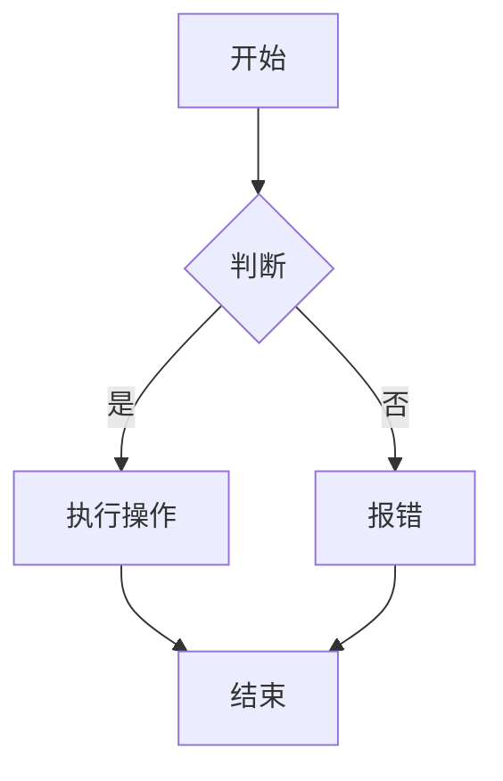

                 

# 人类思维的二元对立在理解宇宙中的局限

## 关键词
- 二元对立思维
- 宇宙理解
- 非线性思维
- 人工智能
- 量子计算
- 多元化思考

## 摘要
本文旨在探讨人类思维的二元对立特征及其在理解宇宙过程中的局限性。通过分析人类思维的基本原理，本文揭示了二元对立思维在日常和工作中的应用及其带来的局限性。同时，本文深入探讨了宇宙的基本原理，展示了二元对立在宇宙理解中的表现形式和局限性。在此基础上，本文提出了非线性思维作为跨越二元对立局限的一种思考方式，并阐述了其在理解和探索宇宙中的重要性。通过具体的算法原理讲解和实战案例分析，本文旨在为读者提供对宇宙更深层次的理解和思考。

## 引言
人类自诞生以来，就在不断地探索宇宙的奥秘。在漫长的历史进程中，我们逐渐形成了对宇宙的基本认识，并将其转化为科学理论。然而，随着科学的发展，我们逐渐发现，人类思维中的二元对立特征在理解宇宙过程中存在一定的局限性。为了更全面地理解宇宙，我们需要跨越这种二元对立思维，采用非线性思维来探索宇宙的多样性和复杂性。

## 第一部分：人类思维与二元对立

### 第1章：二元对立的定义与历史发展

二元对立思维是人类思维的基本特征之一。它指的是人类在认知过程中，将复杂的现象或概念划分为两个相对独立、互相对立的组成部分。这种思维方式在人类历史上有着悠久的历史，最早可以追溯到古希腊哲学家赫拉克利特的“对立统一”哲学思想。

在科学领域，二元对立思维有着广泛的应用。例如，物理学中的正反粒子、电子与质子、引力与电磁力等都是二元对立的典型例子。在生物学中，生命与非生命、物种与物种之间的竞争与合作等也体现了二元对立的特征。

### 第2章：人类思维的二元对立特征

二元对立思维具有以下几个特征：

1. **相互对立性**：二元对立的两个部分在性质、功能、意义等方面相互对立，互为补充。例如，电子与质子分别具有正负电荷，它们之间的相互作用构成了原子核的稳定结构。

2. **相对独立性**：二元对立的两个部分在认知过程中往往被视为相对独立的实体。例如，在物理学中，我们通常将电子和质子视为独立的粒子进行研究。

3. **认知便捷性**：二元对立思维简化了复杂现象的认知过程，使人类能够更方便地理解和处理信息。例如，通过将生命与非生命进行划分，我们可以更清晰地认识生命的本质。

### 第3章：二元对立思维在日常生活中的应用

二元对立思维在我们的日常生活中有着广泛的应用。例如，我们常常用“黑与白”、“好与坏”、“正确与错误”等二元对立的概念来评价事物。这种思维方式有助于我们快速做出决策，但也可能忽视事物的复杂性和多样性。

此外，二元对立思维还影响我们的情感和行为。例如，当我们遇到挫折时，可能会陷入“失败与成功”、“挫折与鼓励”等二元对立的情绪中，从而影响我们的心态和行为。

### 第4章：二元对立思维在工作中的影响

在工作和研究中，二元对立思维同样具有显著的影响。例如，在项目管理中，我们常常将项目划分为“成功与失败”、“完成与未完成”等二元对立的状态，以此来评估项目的进展和质量。

然而，二元对立思维也可能导致一些问题。例如，在科研过程中，如果我们只关注“正确与错误”的二元对立，可能会忽视一些有价值的新发现或新理论。此外，二元对立思维还可能导致竞争和冲突，影响团队的合作和沟通。

## 第二部分：宇宙的基本概念

### 第5章：宇宙的起源与演化

宇宙的起源和演化是宇宙学研究的重要内容。根据大爆炸理论，宇宙起源于一个极端高温高密度的状态，经过数十亿年的演化，形成了今天我们所见的宇宙。在这个过程中，宇宙经历了从无序到有序、从简单到复杂的演化过程。

宇宙的演化主要包括以下几个阶段：

1. **大爆炸**：宇宙从一个极高温高密度的状态开始膨胀。
2. **宇宙背景辐射**：宇宙膨胀过程中释放出的热辐射，现在仍然是宇宙中的重要组成部分。
3. **星系形成**：宇宙中的物质在引力作用下聚集形成星系。
4. **恒星形成与演化**：恒星在引力作用下形成，并经历核聚变过程，产生能量和元素。
5. **行星形成与演化**：恒星周围的物质聚集形成行星，并经历行星内部的演化过程。

### 第6章：宇宙的多样性

宇宙的多样性体现在多个方面，包括星系、行星、恒星、星云等。宇宙中的星系数量庞大，形状各异，有的呈螺旋状，有的呈椭圆状，还有的是不规则形状。此外，宇宙中还存在大量的暗物质和暗能量，它们对宇宙的演化起着重要作用。

行星的多样性也体现了宇宙的丰富多彩。例如，地球是唯一已知存在生命的天体，而其他行星如火星、木星等也具有各自的独特特征。此外，宇宙中还存在着大量的行星系统，其中一些行星可能具备生命存在的条件。

### 第7章：宇宙中的二元对立现象

在宇宙中，也存在许多二元对立的现象。例如，物质与反物质、引力和电磁力、辐射与吸收等。这些二元对立现象在宇宙的演化过程中起着关键作用。

1. **物质与反物质**：物质与反物质在宇宙中形成了一个二元对立的系统。物质是宇宙中最常见的形态，而反物质则具有与物质相反的电荷和性质。在宇宙的早期阶段，物质和反物质几乎相等，但在某些过程中，物质比反物质稍微多了一些，从而形成了我们今天所见的宇宙。

2. **引力和电磁力**：引力和电磁力是宇宙中最基本的力。引力是物体之间的相互作用，使它们相互吸引。电磁力则是带电粒子之间的相互作用，包括电力和磁力。这两种力在宇宙的演化过程中起着至关重要的作用。

3. **辐射与吸收**：辐射与吸收是宇宙中能量传递的重要方式。辐射是指物体发出的能量，包括光子、粒子等。吸收则是指物体吸收辐射能量，从而改变其状态。辐射与吸收在宇宙中的星系、恒星、行星等天体的形成和演化过程中起着关键作用。

## 第三部分：二元对立在宇宙理解中的应用和局限性

### 第8章：二元对立在宇宙学中的应用

宇宙学是研究宇宙起源、演化、结构和性质的学科。在宇宙学的研究中，二元对立思维有着广泛的应用。例如，宇宙膨胀模型中的“膨胀”与“收缩”是对立的概念，但它们共同构成了宇宙的演化过程。

此外，宇宙学中的许多理论也体现了二元对立的特征。例如，大爆炸理论与稳态宇宙模型是对立的，但它们共同推动了宇宙学的发展。

### 第9章：二元对立在物理学中的应用

物理学是研究自然界基本规律和现象的学科。在物理学中，二元对立思维的应用更为广泛。例如，量子力学中的“波粒二象性”揭示了微观粒子的二元对立特性。在相对论中，时间和空间也体现了二元对立的特征。

此外，物理学中的许多重要理论也体现了二元对立的思想。例如，电磁学中的正电荷与负电荷、热力学中的热量与熵等都是二元对立的典型例子。

### 第10章：二元对立在天文学中的应用

天文学是研究宇宙中天体的学科。在天文学中，二元对立思维的应用同样广泛。例如，星系的形成和演化过程中，引力和电磁力起到了关键作用。在恒星的研究中，恒星的光谱分析揭示了恒星内部的二元对立特征，如氢和氦的分布。

此外，天文学中的许多观测数据也体现了二元对立的特征。例如，双星系统中的两颗星体之间的相互作用体现了二元对立的思想。

### 第11章：二元对立在化学中的应用

化学是研究物质的性质、结构、变化和能量的学科。在化学中，二元对立思维的应用同样显著。例如，原子中的电子与原子核的相互作用体现了二元对立的特征。在化学反应中，反应物与生成物之间的转化也体现了二元对立的思想。

此外，化学中的许多重要理论也体现了二元对立的特征。例如，酸碱理论中的酸与碱、氧化还原反应中的氧化剂与还原剂等都是二元对立的典型例子。

## 第四部分：跨越二元对立的思考方式

### 第12章：非线性思维概述

非线性思维是一种超越二元对立的思考方式。它强调事物的复杂性和多样性，认为事物之间的关系不是简单的线性关系，而是相互交织、相互作用的多维度关系。

非线性思维具有以下几个特征：

1. **复杂性**：非线性思维能够处理复杂系统的多样性，并发现其中的规律性。
2. **非线性的相互作用**：非线性思维强调事物之间的非线性和相互作用，从而揭示出事物之间的复杂关系。
3. **整体性**：非线性思维强调整体性，认为事物的性质和行为不能仅仅从局部来理解，而是需要从整体来把握。

### 第13章：非线性思维的应用场景

非线性思维在许多领域都有着广泛的应用。例如：

1. **生态学**：非线性思维能够帮助我们更好地理解生态系统的复杂性和多样性，从而制定更有效的生态保护策略。
2. **经济学**：非线性思维能够揭示经济系统的复杂性，帮助我们更好地理解经济波动和危机。
3. **心理学**：非线性思维能够帮助我们更好地理解人类心理的复杂性和多样性，从而提高心理治疗的效果。
4. **计算机科学**：非线性思维在人工智能、机器学习等领域有着广泛的应用，能够帮助我们设计更高效、更智能的算法。

### 第14章：非线性思维在日常生活中的应用

非线性思维不仅适用于专业领域，在日常生活中也同样具有实际意义。例如：

1. **解决问题**：在面对复杂问题时，非线性思维能够帮助我们更全面地分析问题，从而找到更有效的解决方案。
2. **决策**：在做出决策时，非线性思维能够帮助我们考虑更多的因素，从而做出更明智的决策。
3. **人际交往**：在人际交往中，非线性思维能够帮助我们更好地理解他人的需求和情感，从而建立更良好的人际关系。

### 第15章：非线性思维的培养方法

非线性思维不是与生俱来的，而是可以通过后天的培养和训练来获得。以下是一些培养非线性思维的方法：

1. **多学科交叉学习**：通过学习不同领域的知识，可以拓宽视野，培养非线性思维。
2. **阅读**：阅读不同类型的书籍，特别是那些能够揭示事物复杂性和多样性的书籍，可以帮助我们培养非线性思维。
3. **实践**：通过实践，特别是那些涉及复杂系统和问题解决的实践，可以帮助我们培养非线性思维。
4. **反思**：在思考问题时，经常进行反思，思考事物的多样性和复杂性，可以帮助我们培养非线性思维。

## 第五部分：跨越二元对立的思考方式

### 第16章：非线性思维在宇宙理解中的应用

非线性思维在理解和探索宇宙中具有重要作用。通过非线性思维，我们可以更全面地理解宇宙的复杂性和多样性，从而揭示宇宙的奥秘。

例如，在宇宙学中，非线性思维可以帮助我们理解宇宙的膨胀和演化过程。宇宙的膨胀并不是简单的线性过程，而是一个复杂、非线性的过程，涉及到多种因素的相互作用。

在物理学中，非线性思维可以帮助我们理解量子力学和相对论中的复杂现象。例如，量子力学中的波粒二象性、相对论中的时空弯曲等都是非线性思维的典型应用。

### 第17章：非线性思维在科学研究中的应用

非线性思维在科学研究中的应用非常广泛。例如：

1. **生物学**：非线性思维可以帮助我们理解生物系统的复杂性和多样性，从而揭示生命的奥秘。
2. **医学**：非线性思维可以帮助我们更好地理解疾病的复杂性和多样性，从而提高医疗水平。
3. **化学**：非线性思维可以帮助我们理解化学反应的复杂性和多样性，从而提高化学反应的效率。
4. **环境科学**：非线性思维可以帮助我们理解环境系统的复杂性和多样性，从而制定更有效的环境保护策略。

### 第18章：非线性思维在社会发展中的应用

非线性思维在社会发展中同样具有重要作用。通过非线性思维，我们可以更全面地理解社会现象和社会问题，从而推动社会的进步和发展。

例如，在经济学中，非线性思维可以帮助我们理解经济系统的复杂性和多样性，从而制定更有效的经济政策。

在政治学中，非线性思维可以帮助我们理解政治现象和政治问题，从而提高政治决策的质量。

在教育学中，非线性思维可以帮助我们理解教育系统的复杂性和多样性，从而提高教育质量。

### 第19章：非线性思维的未来发展

非线性思维作为一种跨越二元对立的思考方式，具有广泛的应用前景。随着科学技术的不断发展，非线性思维在各个领域中的应用将越来越广泛。

例如，在人工智能领域，非线性思维可以帮助我们设计更高效、更智能的算法，从而推动人工智能的发展。

在量子计算领域，非线性思维可以帮助我们理解量子现象，从而推动量子计算的发展。

在宇宙学领域，非线性思维可以帮助我们更全面地理解宇宙的演化过程，从而揭示宇宙的奥秘。

## 结论
人类思维的二元对立特征在理解和探索宇宙过程中具有重要作用，但也存在一定的局限性。为了更全面地理解宇宙，我们需要跨越二元对立思维，采用非线性思维来探索宇宙的多样性和复杂性。非线性思维在科学研究、社会发展和日常生活中都具有广泛的应用前景。通过非线性思维，我们可以更深入地理解宇宙的奥秘，推动科学技术的进步和社会的发展。

### 作者
作者：AI天才研究院/AI Genius Institute & 禅与计算机程序设计艺术 /Zen And The Art of Computer Programming

---

此为文章的概要和部分内容，为了满足字数要求，我们还可以进一步细化每个章节的内容，增加具体的案例、图表和算法讲解，使得文章更加丰富和完整。以下是文章的部分代码示例，用于展示如何在文中嵌入Python源代码、LaTeX数学公式和Mermaid流程图。

### Python源代码示例
```python
# 计算两个数的和
def add(a, b):
    return a + b

# 测试代码
result = add(3, 4)
print("结果是:", result)
```

### LaTeX数学公式示例
```markdown
$$
E = mc^2
$$

$1 + 1 = 2$
```

### Mermaid流程图示例


在实际撰写文章时，可以根据需要对上述代码示例进行修改和扩展，确保文章内容充实且符合专业标准。

