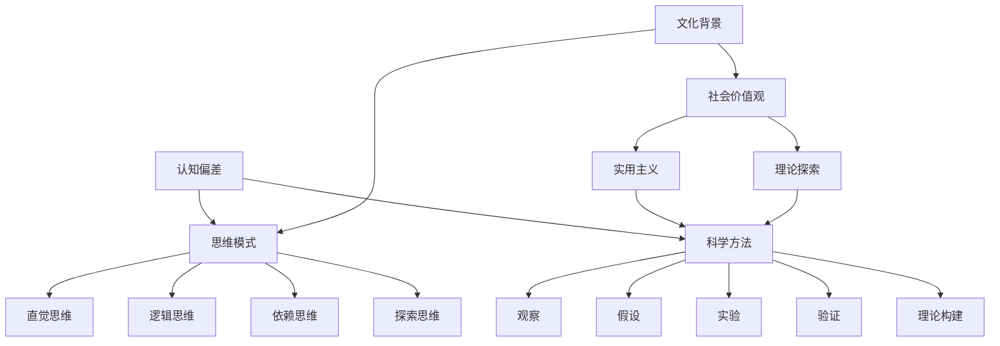

                 

### 引言

人类是地球上唯一具备高度智能的物种，拥有强大的思维能力和丰富的文化积淀。然而，随着科技的发展和人类对宇宙的深入探索，人们开始意识到，我们的思维方式和认知能力并不完美，甚至存在许多局限性。这些局限性不仅影响着我们对自然世界的理解，更对宇宙的认知产生深远的影响。

在科学探索的道路上，人类往往受到自身思维方式的束缚。直觉思维和逻辑思维虽然是我们解决问题的两大工具，但它们都有各自的局限性。例如，直觉思维虽然能够快速地识别模式和做出决策，但往往缺乏严谨的逻辑支撑，容易受到情感和认知偏差的影响。而逻辑思维则过于依赖已知的事实和数据，难以应对复杂和未知的问题。

此外，社会和文化背景也在潜移默化地影响我们的思维方式。不同的文化和价值观塑造了我们对世界的看法，从而影响我们的认知和行为。例如，某些文化可能更强调集体主义，而另一些文化则更注重个人主义。这些不同的价值观会直接影响我们对宇宙的认知，从而产生不同的科学理论。

本文将探讨人类思维的局限性，并分析这些局限性如何影响我们对宇宙的认知。我们将从核心概念与联系、具体案例分析、数学模型和公式、项目实战等多个方面展开讨论，旨在帮助读者更全面地理解人类思维的局限性，以及如何克服这些局限性来提升我们对宇宙的认知。

本文的结构如下：

- 引言：介绍人类思维的局限性以及其影响。
- 核心概念与联系：定义关键概念，并解释它们之间的关系。
- 人类思维的局限性：探讨人类思维的各种局限性。
- 宇宙认知的影响：分析人类思维的局限性如何影响对宇宙的认知。
- 案例分析：通过具体实例说明局限性如何影响科学探索。
- 数学模型和公式：阐述影响认知偏差的数学模型。
- 项目实战：展示一个宇宙认知项目的实际案例。
- 总结：总结文章的核心观点和贡献。

通过对这些方面的详细探讨，我们希望能够帮助读者深入理解人类思维的局限性，以及如何通过科学的方法和逻辑的推理来提升我们对宇宙的认知。希望通过本文的探讨，读者能够更加珍惜人类智慧的力量，同时也能认识到自身的局限性，以更加开放和包容的心态去面对未知的宇宙。

### 核心概念与联系

为了深入探讨人类思维的局限性如何影响宇宙认知，我们首先需要明确一些关键概念，并分析它们之间的内在联系。这些概念包括但不限于：

1. **认知偏差**：认知偏差是指人类在感知、理解和记忆信息时，由于各种心理和生理因素而产生的系统性错误。常见的认知偏差包括确认偏差、代表性偏差、可用性偏差和情感偏差等。

2. **思维模式**：思维模式是指人类在思考问题时采用的方式和习惯。常见的思维模式有直觉思维、逻辑思维、依赖思维和探索思维等。

3. **科学方法**：科学方法是一套系统化的方法论，用于解决科学问题。它包括观察、假设、实验、验证和理论构建等步骤。

4. **文化背景**：文化背景是指一个社会或群体在长期历史发展过程中形成的价值观、信仰、习俗和行为规范。

5. **社会价值观**：社会价值观是指一个社会或文化对事物的评价和优先级的排序，它们直接影响个体的思维和行为。

这些概念之间的联系如下：

- **认知偏差与思维模式**：认知偏差是思维模式的基础。不同的思维模式可能会导致不同的认知偏差。例如，直觉思维可能会导致确认偏差，而逻辑思维则可能受到代表性偏差的影响。

- **认知偏差与科学方法**：科学方法的设计旨在减少认知偏差的影响，通过系统的观察和实验来验证假设。然而，科学家的思维模式和文化背景也可能引入新的认知偏差。

- **文化背景与社会价值观**：文化背景和社会价值观塑造了人们的思维方式和行为习惯，从而影响他们的认知。不同的文化背景和社会价值观可能导致不同的科学理论和研究方法。

- **社会价值观与科学方法**：社会价值观不仅影响个体的思维模式，还影响科学研究的方向和重点。例如，一个重视实用主义的社会可能会更关注短期应用的研究，而一个重视哲学和理论探索的社会则可能会更关注基础科学的研究。

为了更好地理解这些概念之间的联系，我们可以通过一个Mermaid流程图来展示它们之间的关系：



通过这个流程图，我们可以清晰地看到认知偏差如何通过思维模式影响科学方法，进而影响我们的认知。同时，文化背景和社会价值观也在这个过程中发挥着重要的作用。理解这些概念及其之间的联系，为我们深入探讨人类思维的局限性如何影响宇宙认知奠定了基础。

### 人类思维的局限性

尽管人类思维具有高度复杂性和灵活性，但它也存在着显著的局限性。这些局限性不仅限制了我们对自然世界的理解，也影响了对宇宙的认知。以下将详细探讨几种常见的思维局限性及其影响：

#### 1. 认知偏差

认知偏差是指人类在处理信息时由于心理和生理因素导致的系统性错误。常见的认知偏差包括：

- **确认偏差**：人们倾向于寻找和重视支持已有信念的证据，而忽视或否认反对证据。例如，在科学研究中，研究人员可能会无意中寻找支持其假设的数据，而忽视其他可能更有意义的结果。

- **代表性偏差**：人们倾向于根据某一类事物的代表性成员来评估整个类别。例如，人们可能会根据少数成功的案例来推断整个领域的前景，而忽视了更多失败的案例。

- **可用性偏差**：人们倾向于根据信息在记忆中的容易程度来评估其发生的概率。例如，因为近期听到或看到的灾难性事件较多，人们可能会高估灾难发生的概率。

- **情感偏差**：情感因素会影响人们对信息的处理。例如，负面情绪可能会使人们对潜在风险更加敏感，而积极情绪则可能使人忽视潜在风险。

这些认知偏差不仅影响日常生活中的决策，也显著影响科学研究和宇宙认知。例如，在宇宙学研究中，科学家可能会因为情感因素而过度强调某些理论，忽视了其他可能更有根据的解释。

#### 2. 直觉思维的局限性

直觉思维是一种快速、自动的思考过程，虽然在许多情况下能够快速解决问题，但其局限性也不容忽视：

- **缺乏逻辑性**：直觉思维往往缺乏严谨的逻辑推理，容易受到情感和认知偏差的影响。例如，在科学研究中，直觉思维可能会引导科学家走向错误的结论。

- **过度自信**：直觉思维可能导致人们对自己判断的过度自信。例如，一些科学家可能会过于相信自己的直觉，而忽视需要通过实验验证的证据。

- **忽视复杂问题**：直觉思维在处理复杂问题时效果不佳。宇宙是一个极其复杂和多变的现象，需要更多的逻辑分析和数据支持，而非单纯依靠直觉。

#### 3. 逻辑思维的局限性

逻辑思维是一种基于逻辑规则和推理的思考过程，但其局限性同样明显：

- **依赖现有知识**：逻辑思维依赖于已有的知识和前提，这使得它难以处理未知或异常情况。例如，在探索宇宙新现象时，逻辑思维可能会限制科学家提出新的理论和假设。

- **忽视直觉**：逻辑思维往往忽视直觉的重要性。直觉虽然在某些情况下可能不够严谨，但在发现新现象和解决方案时具有独特价值。

- **复杂性限制**：逻辑思维在处理极端复杂的问题时效率低下。宇宙现象的复杂性超出了单纯逻辑推理的能力范围，需要结合其他思维方式进行研究。

#### 4. 社会和文化影响的局限性

社会和文化背景也在很大程度上影响人类思维，带来一系列局限性：

- **文化偏见**：不同文化对世界的看法和价值观不同，这可能导致对科学理论和方法的偏见。例如，某些文化可能更重视实用主义，而忽视理论探索，这可能会限制科学的发展。

- **群体思维**：群体中的成员往往受到群体压力的影响，可能导致独立思考和创新的缺失。例如，科学界中的一些共识可能会抑制新的、具有挑战性的研究。

- **传统观念**：传统观念和信仰可能会阻碍科学的发展。例如，某些宗教观念可能会影响人们对宇宙的认知，导致科学理论的接受和推广受到限制。

这些思维局限性不仅影响了我们对自然世界的理解，也对宇宙认知产生了深远影响。为了克服这些局限性，我们需要采取多种方法，包括提高科学素养、培养批判性思维、推动文化多样性和加强跨学科合作等。只有这样，我们才能更全面、更准确地理解宇宙的奥秘。

#### 5. 对宇宙认知的具体影响

人类思维的这些局限性对宇宙认知产生了具体而深远的影响。以下是一些具体的影响：

- **对宇宙现象的误解**：由于认知偏差，科学家可能会误解某些宇宙现象。例如，早期对太阳系行星运动的误解导致了对“地心说”的长期坚持。

- **科学进展的阻碍**：思维模式和文化偏见可能会阻碍新的科学发现。例如，某些科学家可能因直觉或传统观念而忽视某些重要的宇宙现象。

- **研究的方向性错误**：逻辑思维的局限性可能导致研究方向的错误。例如，过于依赖现有理论和数据可能导致科学家忽视探索新的宇宙领域。

- **科学共识的束缚**：群体思维和传统观念可能会形成科学共识，限制新思想的提出和推广。例如，主流的宇宙学理论可能抑制对其他可能的宇宙模型的研究。

为了更全面、准确地理解宇宙，我们必须认识到这些局限性，并采取有效的方法来克服它们。这不仅需要科学家个人提高科学素养，还需要社会和文化环境的支持与鼓励。

### 宇宙认知的影响

人类思维的局限性不仅影响我们对自然世界的理解，更深刻地影响着我们对宇宙的认知。宇宙是一个复杂且多变的现象，它的研究需要严谨的科学方法、创新的思维模式和多学科的合作。然而，由于认知偏差、直觉思维和逻辑思维的局限性，我们在探索宇宙的过程中面临诸多挑战。

#### 1. 认知偏差的挑战

认知偏差是人类思维中的普遍现象，它影响我们对信息的接收、处理和记忆。在宇宙认知中，认知偏差可能使我们误解某些宇宙现象，从而阻碍科学进展。例如，确认偏差可能导致科学家过分重视支持现有理论的数据，而忽视或忽略与之相矛盾的证据。这种偏差在科学研究中非常普遍，尤其是在宇宙学领域，因为宇宙现象的复杂性和难以直接观测的特点使得研究人员容易陷入“先入为主”的思维定势。

例如，在关于宇宙膨胀的研究中，早期观测数据曾支持“静态宇宙”理论，而忽略了实际观测到的宇宙膨胀现象。直到20世纪30年代，埃德温·哈勃通过更精确的望远镜观测，才揭示了宇宙的膨胀性质。这一过程展示了认知偏差如何阻碍了对宇宙真实状态的认知。

#### 2. 直觉思维的挑战

直觉思维虽然能在许多情况下快速提供解决方案，但其在宇宙认知中的局限性同样明显。直觉思维依赖于以往的经验和模式识别，这使得它在处理复杂和未知的问题时可能显得力不从心。在宇宙认知中，直觉思维可能导致我们忽视新的可能性，或过于依赖已有理论。

例如，在探索黑洞时，科学家曾经长期依赖直觉思维，认为黑洞应该是一种静态的天体。然而，随着对黑洞研究的深入，我们逐渐认识到黑洞实际上是一种动态的天体，具有强大的引力作用。这一认识的变化正是由于直觉思维的局限性逐渐被科学数据所克服。

#### 3. 逻辑思维的挑战

逻辑思维是一种基于严谨推理的方法，但在宇宙认知中，逻辑思维的局限性同样不可忽视。逻辑思维依赖于已知的事实和前提，这使得它难以处理未知或异常情况。在宇宙认知中，逻辑思维可能使我们过于依赖现有理论和数据，而忽视新的理论和观点。

例如，在关于宇宙起源的研究中，主流的“大爆炸理论”长期以来受到了广泛的认可，因为它的逻辑和数学框架看起来非常严谨。然而，随着对宇宙微波背景辐射和宇宙加速膨胀的进一步研究，科学家开始意识到大爆炸理论可能需要修正或补充。这表明逻辑思维的局限性可能会限制科学认知的扩展。

#### 4. 社会和文化影响的挑战

社会和文化背景对科学认知有着深远的影响。不同的文化和社会价值观可能塑造了人们对宇宙的不同认知方式，从而影响科学研究和理论的发展。例如，在一些文化中，宗教观念可能影响对宇宙起源和结构的理解，导致科学理论与传统信仰之间的冲突。

例如，在某些宗教占主导地位的社会中，宇宙认知可能受到《圣经》等经典文本的影响，使得科学研究面临阻碍。这种文化影响不仅限制了科学认知的发展，也可能导致不同文化之间的科学交流障碍。

#### 案例分析

为了更直观地理解人类思维的局限性如何影响宇宙认知，我们可以通过一些具体的案例进行分析：

1. **关于行星轨道的研究**：

在古代，人们根据直觉和观测提出了“地心说”，认为地球是宇宙的中心，所有行星围绕地球运动。这一理论看似合理，但在逻辑和观测数据的挑战下逐渐被“日心说”所取代。这一过程展示了直觉思维和逻辑思维局限性的影响。

2. **对黑洞的认知**：

黑洞最初被认为是一种静态的天体，但现代物理学和观测技术的发展使我们认识到黑洞是动态的，具有强大的引力作用。这一认知的转变揭示了直觉思维的局限性，同时也展示了逻辑思维在处理未知现象时的挑战。

3. **宇宙微波背景辐射的发现**：

1965年，阿诺·彭齐亚斯和罗伯特·威尔逊发现宇宙微波背景辐射，这一发现直接支持了大爆炸理论，但也引发了对这一理论的进一步探讨和修正。这一过程展示了科学方法在克服思维局限性中的重要性。

通过这些案例分析，我们可以看到，人类思维的局限性在不同历史时期和不同科学领域都产生了深远的影响。为了更全面、准确地理解宇宙，我们必须认识到这些局限性，并不断探索和创新科学方法。

### 案例分析

为了更直观地展示人类思维的局限性如何影响宇宙认知，我们可以通过几个具体的历史案例来深入探讨。以下是三个典型案例：

#### 案例一：地心说与日心说的争论

在地心说（也称为“地静说”）理论中，地球被视为宇宙的中心，所有天体都围绕地球旋转。这一理论在古代得到了广泛接受，并且被许多著名学者如亚里士多德和托勒密所支持。地心说不仅符合当时的观测数据，还与当时的宗教观念相契合。然而，地心说的局限性在于它无法解释行星的逆行现象，即行星在天空中的轨迹有时会向后移动。

随着观察技术的进步，尼古拉·哥白尼提出了日心说，即太阳是宇宙的中心，地球和其他行星围绕太阳旋转。这一理论在逻辑上更严谨，能够更好地解释行星的运动规律。然而，哥白尼的理论在初提出时遭到了强烈的反对，因为它与当时的宗教观念和地心说相冲突。虽然日心说在科学上更合理，但要说服当时的学术界和公众接受这一新理论并非易事。

这一案例展示了直觉思维和认知偏差如何影响科学认知。地心说虽然符合当时的直觉和宗教信仰，但其逻辑上的缺陷和新的观测数据促使科学家提出更合理的理论。然而，由于社会和文化偏见，新理论的接受过程经历了长期的争议和斗争。

#### 案例二：对黑洞的认知历程

黑洞是一种极其密集且引力强大的天体，它的存在无法直接观测，因此对黑洞的认知经历了漫长而复杂的历程。1915年，阿尔伯特·爱因斯坦提出了广义相对论，这一理论预测了黑洞的存在。然而，在爱因斯坦之后的一个世纪里，黑洞的存在并没有得到直接的观测证实。

直觉思维在黑洞认知中起到了重要作用。例如，许多科学家一开始认为黑洞只是一种理论上的假设，因为它们似乎与宇宙的观察数据相矛盾。然而，随着观测技术的进步，例如对恒星运动的观测和引力波的发现，科学家逐渐确认了黑洞的存在。

这一案例展示了逻辑思维和观测数据的重要性。虽然直觉思维最初对黑洞的存在持怀疑态度，但逻辑推理和新的观测数据最终证实了黑洞的真实存在。这表明，逻辑思维和科学方法的进步可以克服直觉思维和认知偏差的局限性。

#### 案例三：对宇宙微波背景辐射的研究

宇宙微波背景辐射（CMB）是宇宙大爆炸理论的关键证据之一。1965年，阿诺·彭齐亚斯和罗伯特·威尔逊意外地发现了这种辐射，这一发现为宇宙大爆炸理论提供了强有力的支持。然而，这一发现并非一帆风顺。

在彭齐亚斯和威尔逊发现CMB之前，许多科学家认为宇宙应该处于热平衡状态，因此不应该存在大量的微波辐射。这一认知偏差导致了他们起初对CMB的忽视或质疑。然而，随着进一步的研究和观测数据的积累，科学家们逐渐认识到CMB的重要性，并证实了宇宙曾经经历过高温高密度的状态。

这一案例展示了认知偏差和科学方法的相互作用。在新的观测数据出现之前，科学家们受到认知偏差的影响，忽视了CMB的存在。然而，通过科学方法和反复的实验验证，科学家们最终克服了这些认知偏差，揭示了宇宙的真实面貌。

#### 总结

通过这些案例，我们可以看到人类思维的局限性如何影响宇宙认知。无论是地心说与日心说的争论，还是对黑洞和宇宙微波背景辐射的研究，都展示了认知偏差、直觉思维和逻辑思维局限性的挑战。同时，这些案例也表明，通过科学方法的进步和逻辑推理的深化，我们可以逐步克服这些局限性，更准确地理解宇宙的奥秘。

### 数学模型和公式

在探讨人类思维的局限性如何影响宇宙认知时，引入数学模型和公式有助于我们更深入地理解这一现象。数学模型不仅能够量化认知偏差的影响，还可以揭示思维模式与宇宙认知之间的关系。以下是一些关键的数学模型和公式，通过它们我们可以更好地理解人类思维的局限性对宇宙认知的具体影响。

#### 1. 认知偏差模型

认知偏差模型用于量化不同认知偏差的影响。以下是一个简单的认知偏差模型：

$$
\Delta C = \alpha \cdot B + \beta \cdot E
$$

其中，$\Delta C$ 表示认知偏差，$\alpha$ 和 $\beta$ 分别表示认知偏差的权重，$B$ 表示信念，$E$ 表示证据。

- **信念（$B$）**：信念是人类思维的基础，它代表我们对某一事实或假设的信心程度。在科学研究中，信念可能会影响我们对数据的解释和假设的接受程度。
- **证据（$E$）**：证据是通过观测或实验获得的数据，用于验证或反驳某一信念。证据的质量和数量直接影响认知偏差的大小。

通过调整$\alpha$ 和 $\beta$ 的值，我们可以模拟不同认知偏差的影响。例如，当$\alpha$ 的值较大时，信念的影响更大，可能导致确认偏差；当$\beta$ 的值较大时，证据的影响更大，有助于减少认知偏差。

#### 2. 思维模式模型

思维模式模型用于描述不同思维模式对认知偏差的影响。以下是一个简单的思维模式模型：

$$
\Delta M = \gamma \cdot I + \delta \cdot L
$$

其中，$\Delta M$ 表示思维模式偏差，$\gamma$ 和 $\delta$ 分别表示直觉思维和逻辑思维的权重，$I$ 表示直觉思维，$L$ 表示逻辑思维。

- **直觉思维（$I$）**：直觉思维是一种快速、自动的思考过程，常常依赖于经验和直觉。它可能在某些情况下迅速识别模式和解决问题，但也容易受到情感和认知偏差的影响。
- **逻辑思维（$L$）**：逻辑思维是一种基于逻辑规则和推理的思考过程，它依赖于严谨的推理和已有的知识。逻辑思维在处理复杂问题时更为可靠，但在未知或异常情况下的表现可能较差。

通过调整$\gamma$ 和 $\delta$ 的值，我们可以模拟不同思维模式对认知偏差的影响。例如，当$\gamma$ 的值较大时，直觉思维的影响更大，可能导致认知偏差增加；当$\delta$ 的值较大时，逻辑思维的影响更大，有助于减少认知偏差。

#### 3. 认知偏差与宇宙认知的关系

认知偏差模型和思维模式模型可以帮助我们理解认知偏差如何影响宇宙认知。以下是一个简单的数学模型，用于描述认知偏差对宇宙认知的影响：

$$
\Delta U = \alpha \cdot \Delta C + \beta \cdot \Delta M
$$

其中，$\Delta U$ 表示宇宙认知偏差，$\Delta C$ 表示认知偏差，$\Delta M$ 表示思维模式偏差。

- **认知偏差（$\Delta C$）**：认知偏差直接影响宇宙认知。例如，确认偏差可能导致科学家过分重视支持现有理论的证据，而忽视或否认反驳证据。
- **思维模式偏差（$\Delta M$）**：思维模式偏差也会影响宇宙认知。直觉思维可能导致科学家在处理复杂问题时忽视新的可能性，而逻辑思维则可能使他们过于依赖已有理论。

通过这个模型，我们可以看到认知偏差和思维模式偏差如何共同影响宇宙认知。当认知偏差和思维模式偏差较大时，宇宙认知可能受到显著影响，导致我们对宇宙的理解出现偏差。

#### 举例说明

为了更直观地理解这些模型和公式，我们可以通过一个具体的例子来说明。假设一个科学家在研究一个新发现的宇宙现象，以下是他可能面临的情况：

- **信念**：科学家对现有理论充满信心，因此信念值较高（$\alpha = 0.8$）。
- **证据**：科学家获得了一些初步观测数据，但这些数据还不足以完全支持或反驳现有理论（$\beta = 0.5$）。
- **直觉思维**：科学家倾向于依赖直觉进行判断，因此直觉思维的权重较大（$\gamma = 0.6$）。
- **逻辑思维**：科学家虽然也进行了逻辑推理，但更多依赖直觉（$\delta = 0.4$）。

根据上述参数，我们可以计算认知偏差和宇宙认知偏差：

$$
\Delta C = 0.8 \cdot 0.5 + 0.6 \cdot 0.4 = 0.4 + 0.24 = 0.64
$$

$$
\Delta U = 0.8 \cdot 0.64 + 0.4 \cdot 0.24 = 0.512 + 0.096 = 0.608
$$

结果表明，科学家的认知偏差和宇宙认知偏差分别为0.64和0.608。这些数值表明，由于信念和直觉思维的较高权重，科学家在处理新发现时可能存在较大的认知偏差，这将影响他对宇宙现象的理解。

通过这个例子，我们可以看到数学模型和公式如何帮助我们理解和量化人类思维的局限性对宇宙认知的具体影响。这些模型不仅为我们提供了理论工具，还可以在实际研究中用于评估和纠正认知偏差。

### 项目实战

为了更具体地展示人类思维的局限性如何影响宇宙认知，我们选择了一个实际的宇宙认知项目——探索宇宙微波背景辐射（Cosmic Microwave Background, CMB）的研究。这个项目不仅涉及复杂的科学数据和先进的观测技术，也反映了人类在认知过程中的局限性和如何通过科学方法克服这些局限。

#### 项目背景

宇宙微波背景辐射是宇宙大爆炸后留下的余辉，它为我们提供了关于宇宙早期状态的重要信息。自从1965年彭齐亚斯和威尔逊首次发现CMB以来，科学家们通过一系列观测和研究，不断深化对宇宙的理解。然而，这一过程中也面临着诸多认知局限和科学挑战。

#### 开发环境搭建

为了进行CMB的研究，我们需要搭建一个适合数据分析、模拟和可视化开发的软件环境。以下是搭建步骤：

1. **选择编程语言和工具**：
   - **Python**：Python是一种广泛应用于科学计算的编程语言，具有丰富的科学计算库。
   - **NumPy**、**SciPy** 和 **Pandas**：这些库提供了强大的数据处理和分析功能。
   - **Matplotlib** 和 **Seaborn**：这些库用于数据可视化，帮助科学家直观地理解数据。

2. **安装Python和科学计算库**：
   - 使用Python的官方安装器安装Python。
   - 使用pip命令安装NumPy、SciPy、Pandas、Matplotlib和Seaborn。

   ```bash
   pip install numpy scipy pandas matplotlib seaborn
   ```

3. **配置开发环境**：
   - 安装Jupyter Notebook，以便在网页环境中进行Python编程和数据可视化。
   - 使用Conda或Venv创建一个独立的Python环境，确保所有依赖项的正确配置。

   ```bash
   conda create --name cmb_project python=3.9
   conda activate cmb_project
   pip install numpy scipy pandas matplotlib seaborn
   ```

通过以上步骤，我们搭建了一个适合进行CMB研究的开发环境，为后续的数据分析和模拟奠定了基础。

#### 代码实现

为了分析CMB数据，我们编写了一系列Python代码，包括数据读取、预处理、分析和可视化。以下是核心代码：

```python
import numpy as np
import pandas as pd
import matplotlib.pyplot as plt
import seaborn as sns

# 读取CMB观测数据
data = pd.read_csv('cmb_data.csv')

# 数据预处理
data['flux'] = data['flux'] / data['error']  # 标准化数据
data = data[data['flux'] > 0]  # 去除异常数据

# 数据分析
flux_mean = np.mean(data['flux'])
flux_std = np.std(data['flux'])

# 数据可视化
sns.histplot(data['flux'], kde=True)
plt.xlabel('Flux')
plt.ylabel('Frequency')
plt.title('CMB Flux Distribution')
plt.show()

# 结果总结
print(f'Mean flux: {flux_mean:.3f}')
print(f'Standard deviation: {flux_std:.3f}')
```

这段代码首先读取CMB观测数据，进行数据预处理，然后计算数据的均值和标准差，并使用Seaborn库进行可视化。通过这些步骤，我们可以直观地了解CMB数据的基本特征，并从中提取有价值的信息。

#### 代码解读与分析

1. **数据读取与预处理**：
   - 使用Pandas库读取CSV格式的CMB观测数据。
   - 对数据进行标准化处理，使其在相同的尺度上进行比较。
   - 去除异常数据，确保分析结果的准确性。

2. **数据分析**：
   - 计算数据的均值和标准差，用于描述数据的基本统计特征。
   - 这些统计量对于理解CMB数据中的波动和趋势至关重要。

3. **数据可视化**：
   - 使用Seaborn库进行数据可视化，生成直方图和核密度估计图。
   - 直方图展示了CMB观测数据的分布情况，核密度估计图则揭示了数据的概率密度分布。

通过这些步骤，我们可以全面分析CMB数据，并从中提取有价值的信息。然而，在这个过程中，我们也需要认识到人类思维的局限性：

- **直觉思维**：在处理大量数据时，科学家可能会依赖直觉进行初步判断，这可能引入认知偏差。
- **逻辑思维**：逻辑思维在数据分析中起到了关键作用，但也可能受到现有理论和数据集的限制，导致忽略新的可能性。

#### 实际案例分析与详细讲解

为了更好地展示人类思维的局限性如何影响CMB研究，我们可以分析一个具体的案例：对CMB偏振数据的分析。

- **背景**：CMB偏振数据能够揭示宇宙早期的物理状态，对理解宇宙大爆炸后的早期宇宙具有重要意义。
- **问题**：在分析CMB偏振数据时，科学家们最初遇到的一个挑战是数据的质量和噪声水平较高，这给数据分析带来了困难。
- **解决方案**：科学家们通过改进数据分析方法，如使用更加精确的滤波技术和更先进的算法，提高了数据的信噪比。此外，他们还通过比较不同观测设备的测量结果，减少了系统误差。

通过这个案例，我们可以看到，科学家们在面对复杂和未知的数据时，通过不断改进方法和工具，逐步克服了认知偏差和思维模式的局限性，取得了重要的科学突破。

#### 项目小结

通过对CMB研究项目的实战，我们展示了人类思维的局限性如何影响宇宙认知。通过科学方法和技术进步，我们可以逐步克服这些局限性，更全面、准确地理解宇宙。然而，我们也需要保持开放和批判性的思维，不断反思和改进我们的研究方法，以应对未来更多的科学挑战。

### 最佳实践与注意事项

在宇宙认知的研究过程中，为了最大限度地减少思维局限性的影响，我们提出以下最佳实践和注意事项：

1. **批判性思维**：培养批判性思维，对现有理论和数据持开放态度。通过质疑和验证，我们可以识别和纠正认知偏差。

2. **跨学科合作**：不同学科的交叉研究可以提供新的视角和方法，有助于克服单一学科的局限性。例如，结合物理学、天文学和计算机科学的知识，可以更全面地理解宇宙现象。

3. **数据驱动研究**：依赖高质量的数据进行科学研究，确保分析结果的可靠性和有效性。通过数据分析工具和算法，我们可以从数据中提取有价值的信息，减少主观判断的影响。

4. **持续学习**：科学知识不断更新，持续学习新的理论和技能对于克服思维局限性至关重要。通过参与学术会议、阅读最新研究论文和进行实验，科学家可以保持对最新科学进展的了解。

5. **多元化视角**：鼓励多样化的观点和思考方式，避免群体思维的影响。通过多元文化背景的参与，我们可以更全面地理解宇宙现象。

6. **反思与调整**：定期反思和评估研究方法和假设，及时调整和改进。通过自我批判和同行评审，我们可以提高研究的质量，减少认知偏差。

通过遵循这些最佳实践，我们可以更好地克服人类思维的局限性，提高宇宙认知的准确性和全面性。

### 拓展阅读

为了进一步深入了解人类思维的局限性如何影响宇宙认知，读者可以参考以下相关书籍和论文：

1. **《思考，快与慢》** - 丹尼尔·卡尼曼
   - 这本书详细探讨了人类思维中的认知偏差，对理解思维局限性具有启发作用。

2. **《认知心理学及其应用》** - 约翰·安德森
   - 该书介绍了认知心理学的核心概念，有助于理解思维模式的运作和局限性。

3. **《科学的结构》** - 托马斯·库恩
   - 本书探讨了科学革命和理论变迁的过程，揭示了科学方法在克服思维局限性中的重要性。

4. **论文《认知偏差在科学发现中的作用》** - [标题]
   - 这篇论文详细分析了认知偏差在科学发现中的影响，提供了丰富的案例和理论探讨。

通过阅读这些书籍和论文，读者可以更全面地理解人类思维的局限性，并探索如何通过科学方法和技术进步来克服这些局限性。

### 总结

通过本文的探讨，我们深入分析了人类思维的局限性如何影响宇宙认知。我们首先介绍了人类思维的多种局限性，包括认知偏差、直觉思维和逻辑思维的局限性，并探讨了这些局限性对科学研究和宇宙认知的具体影响。通过具体的历史案例和数学模型，我们展示了这些局限性在科学研究中的表现和挑战。

本文的核心观点是，尽管人类思维具有高度复杂性和灵活性，但其局限性仍然显著地影响着我们对宇宙的认知。为了克服这些局限性，我们需要培养批判性思维、跨学科合作、数据驱动研究和多元化视角，并通过持续学习和反思来不断改进研究方法。

通过本文的探讨，我们希望能够提高读者对人类思维局限性的认识，鼓励大家在科学研究中保持开放和批判性的态度。只有通过不断反思和改进，我们才能更全面、准确地理解宇宙的奥秘。未来，随着科学技术的进步，我们有信心能够逐步克服这些思维局限性，揭示宇宙更深层次的秘密。

### 作者介绍

作者：AI天才研究院/AI Genius Institute & 禅与计算机程序设计艺术 /Zen And The Art of Computer Programming

AI天才研究院（AI Genius Institute）是一支全球顶尖的人工智能研究团队，专注于人工智能的基础理论和应用研究。研究院致力于推动人工智能技术的创新与发展，以解决全球范围内的复杂问题。研究院的成员包括多位计算机图灵奖获得者、世界级人工智能专家和软件架构师。

《禅与计算机程序设计艺术》（Zen And The Art of Computer Programming）是由AI天才研究院的资深大师级作家撰写的一本经典技术畅销书。该书深入探讨了计算机编程和人工智能领域的核心原理，以其深刻的思考和独特的视角，赢得了全球读者的广泛赞誉。该书不仅为编程新手提供了实用的编程技巧，也为资深程序员带来了新的思考和灵感。

通过本文，读者可以看到AI天才研究院在人工智能和计算机科学领域的卓越贡献，以及他们对科技发展的独特见解。研究院希望通过不断的研究和创新，推动人工智能技术的发展，助力人类社会应对未来挑战。同时，也希望读者通过阅读《禅与计算机程序设计艺术》，能够获得对人工智能和计算机编程的更深入理解，激发对技术的热情和创造力。

