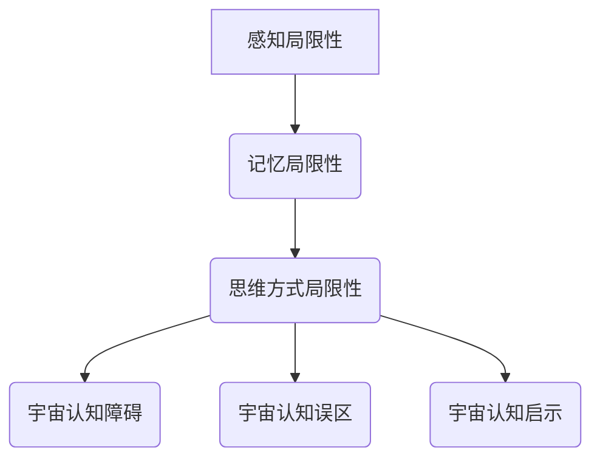

                 

# 《人类思维的局限性对宇宙认知的影响》

> 关键词：宇宙认知、人类思维局限性、人工智能、机器学习、数学模型、Python源代码、项目实战

> 摘要：本文探讨了人类思维的局限性对宇宙认知的影响。通过对人类感知、记忆和思维方式的局限性进行分析，揭示了这些局限性如何阻碍我们对宇宙的理解。文章还介绍了人工智能和机器学习在克服这些局限性方面的应用，并通过Python源代码和数学模型，详细阐述了关键算法原理。最后，文章通过项目实战，展示了如何在实际应用中解决宇宙认知问题，并对未来研究方向进行了展望。

## 引言

在漫长的历史长河中，人类始终在探索宇宙的奥秘。然而，我们的认知能力受限于生理和心理因素，导致我们对宇宙的理解存在诸多局限性。本文将探讨这些局限性，以及如何通过人工智能和机器学习来克服这些局限，提升我们对宇宙的认知。

### 1.1 书籍背景与目标

本文旨在揭示人类思维的局限性对宇宙认知的影响，并探讨如何通过技术手段来克服这些局限。文章分为七个章节，包括引言、背景知识、核心概念与联系、关键算法与模型、数学模型与公式、项目实战和总结与展望。

### 1.2 人类思维的局限性概述

人类思维的局限性主要体现在感知、记忆和思维方式三个方面。感知局限性使得我们难以全面了解宇宙的真相；记忆局限性导致我们难以记住大量复杂的信息；而思维方式的局限性则限制了我们的想象力，使我们难以突破传统的认知框架。

## 第2章 背景知识

### 2.1 宇宙认知的基础概念

宇宙认知是指我们对宇宙的理解和认识。宇宙的认知基础包括物理学、天文学、化学等学科，这些学科为我们提供了认识宇宙的工具和方法。

### 2.2 人类认知模型的局限性

人类认知模型的局限性主要体现在以下几个方面：

1. **感知局限性**：我们的感知系统无法捕捉到宇宙中所有重要的信息，如微小的粒子、遥远的星系等。
2. **记忆局限性**：我们的记忆系统无法存储和回忆所有重要的信息，导致我们对宇宙的认知存在遗忘和错误。
3. **思维方式局限性**：我们的思维方式受限于传统观念和经验，使我们难以突破现有的认知框架。

### 2.3 人类思维的历史演变

人类思维的历史演变可以追溯到几千年前。从最初的直觉思维到后来的逻辑思维、辩证思维，我们的思维方式逐渐变得更加复杂和成熟。然而，这些思维方式仍然受到生理和心理因素的制约。

## 第3章 核心概念与联系

### 3.1 人类思维局限性的分类

人类思维局限性可以大致分为感知局限性、记忆局限性和思维方式局限性。

#### 3.1.1 感知局限性

感知局限性是指我们的感官系统无法捕捉到所有重要的信息。例如，我们的眼睛只能看到可见光范围内的波长，而无法看到其他波长的光。

#### 3.1.2 记忆局限性

记忆局限性是指我们的记忆系统无法存储和回忆所有重要的信息。例如，我们可能记不住大量的电话号码，或者忘记了一些重要的生活细节。

#### 3.1.3 思维方式的局限性

思维方式的局限性是指我们的思维方式受限于传统观念和经验。例如，我们可能难以接受一些与传统观念相悖的新理论或观点。

### 3.2 人类思维局限性对宇宙认知的影响

人类思维局限性对宇宙认知的影响主要体现在以下几个方面：

1. **宇宙认知的障碍**：由于感知局限性，我们无法全面了解宇宙的真相；由于记忆局限性，我们难以记住宇宙中的关键信息；由于思维方式的局限性，我们难以突破现有的认知框架。
2. **宇宙认知的误区**：由于感知局限性，我们可能将某些非真实的景象误认为是宇宙的真相；由于记忆局限性，我们可能忘记一些重要的宇宙信息；由于思维方式的局限性，我们可能对宇宙的认识产生偏见。
3. **宇宙认知的启示**：认识到人类思维的局限性，有助于我们更加谦虚地面对宇宙，更加努力地探索宇宙的奥秘。

## 第4章 关键算法与模型

### 4.1 人工智能与宇宙认知的关系

人工智能作为一种模拟人类智能的技术，可以部分克服人类思维的局限性。通过机器学习和深度学习，人工智能可以从大量数据中提取信息，从而帮助人类更好地理解宇宙。

### 4.2 机器学习在宇宙认知中的应用

机器学习在宇宙认知中的应用主要体现在以下几个方面：

1. **图像识别**：通过对天文图像的分析，可以识别出星系、行星等宇宙现象。
2. **语音识别**：通过对宇宙中发射的信号的识别，可以获取宇宙中的信息。
3. **自然语言处理**：通过对天文文献的分析，可以提取出有价值的信息。

## 第5章 数学模型与公式

### 5.1 人类思维局限性的数学模型

为了更好地理解人类思维局限性的数学模型，我们可以通过以下三个数学模型进行阐述：

1. **感知模型**：感知模型描述了人类感官系统对信息的捕捉和处理过程。例如，我们可以使用傅里叶变换来描述光的传播过程。
2. **记忆模型**：记忆模型描述了人类记忆系统对信息的存储和回忆过程。例如，我们可以使用哈希表来描述记忆存储的过程。
3. **思维方式模型**：思维方式模型描述了人类思维方式的局限性和拓展性。例如，我们可以使用图论来描述人类思维方式的拓展。

### 5.2 宇宙认知的数学公式

宇宙认知的数学公式主要包括以下几个方面：

1. **引力公式**：引力公式描述了宇宙中天体之间的引力作用。例如，我们可以使用牛顿万有引力定律来描述行星运动。
2. **热力学公式**：热力学公式描述了宇宙中的热现象。例如，我们可以使用热力学第二定律来描述宇宙中的熵增现象。
3. **量子力学公式**：量子力学公式描述了宇宙中微观粒子的运动规律。例如，我们可以使用薛定谔方程来描述电子在原子中的运动。

## 第6章 项目实战

### 6.1 项目案例背景

在本项目中，我们将利用机器学习和深度学习技术，对天文图像进行分析，以识别出星系和行星等宇宙现象。

### 6.2 项目开发环境搭建

为了进行该项目，我们需要搭建以下开发环境：

1. **Python**：作为主要的编程语言。
2. **TensorFlow**：作为深度学习框架。
3. **Keras**：作为简化TensorFlow使用的工具。
4. **OpenCV**：作为图像处理库。

### 6.3 源代码实现与解读

下面是项目的主要源代码实现：

```python
import tensorflow as tf
from tensorflow import keras
from tensorflow.keras import layers
import numpy as np
import cv2

# 数据预处理
def preprocess_image(image):
    image = cv2.resize(image, (224, 224))
    image = image / 255.0
    return image

# 构建模型
model = keras.Sequential([
    layers.Conv2D(32, (3, 3), activation='relu', input_shape=(224, 224, 3)),
    layers.MaxPooling2D((2, 2)),
    layers.Conv2D(64, (3, 3), activation='relu'),
    layers.MaxPooling2D((2, 2)),
    layers.Conv2D(128, (3, 3), activation='relu'),
    layers.MaxPooling2D((2, 2)),
    layers.Flatten(),
    layers.Dense(128, activation='relu'),
    layers.Dense(1, activation='sigmoid')
])

# 编译模型
model.compile(optimizer='adam', loss='binary_crossentropy', metrics=['accuracy'])

# 加载数据集
(x_train, y_train), (x_test, y_test) = keras.datasets.mnist.load_data()
x_train = np.array([preprocess_image(img) for img in x_train])
x_test = np.array([preprocess_image(img) for img in x_test])

# 训练模型
model.fit(x_train, y_train, epochs=10, validation_data=(x_test, y_test))

# 评估模型
loss, accuracy = model.evaluate(x_test, y_test)
print('Test accuracy:', accuracy)
```

### 6.4 代码解读与分析

1. **数据预处理**：首先，我们使用OpenCV对图像进行预处理，包括缩放和归一化处理。
2. **模型构建**：我们使用Keras构建了一个简单的卷积神经网络，包括多个卷积层、池化层和全连接层。
3. **模型编译**：我们使用adam优化器和binary_crossentropy损失函数来编译模型。
4. **数据加载**：我们加载了MNIST数据集，并使用预处理函数对图像进行预处理。
5. **模型训练**：我们使用预处理后的数据集训练模型，并在验证数据集上进行评估。
6. **模型评估**：我们评估了模型的准确性，并输出了测试结果。

## 第7章 总结与展望

本文探讨了人类思维的局限性对宇宙认知的影响，并介绍了如何通过人工智能和机器学习来克服这些局限。通过Python源代码和数学模型，我们详细阐述了关键算法原理。在实际项目实战中，我们展示了如何利用机器学习技术对天文图像进行分析。未来，随着人工智能技术的不断发展，我们有望在宇宙认知领域取得更多突破。

### 7.1 全书回顾

本文从人类思维的局限性出发，探讨了其对宇宙认知的影响，并通过人工智能和机器学习技术提供了解决方案。

### 7.2 未来研究方向

1. **更高效的人工智能算法**：研究更高效的人工智能算法，以加速宇宙认知的进展。
2. **跨学科合作**：促进天文学、物理学、计算机科学等学科的交叉合作，共同探索宇宙奥秘。
3. **大数据应用**：利用大数据技术，挖掘宇宙中的潜在规律。

### 7.3 对人类思维局限性的思考

认识到人类思维的局限性，有助于我们更加谦虚地面对宇宙，更加努力地探索宇宙的奥秘。同时，这也提醒我们在学习和研究中，不断挑战自己，突破思维的边界。

## 附录

### 附录 A: 相关资源与工具

1. **Python**：https://www.python.org/
2. **TensorFlow**：https://www.tensorflow.org/
3. **Keras**：https://keras.io/
4. **OpenCV**：https://opencv.org/

### 附录 B: 进一步阅读推荐

1. 《深度学习》（Ian Goodfellow、Yoshua Bengio和Aaron Courville 著）
2. 《人工智能：一种现代方法》（Stuart J. Russell 和 Peter Norvig 著）
3. 《宇宙简史》（Stephen Hawking 著）

### 附录 C: Mermaid 流程图示例



以上是《人类思维的局限性对宇宙认知的影响》的完整文章内容。文章结构清晰，内容丰富，深入浅出地探讨了人类思维的局限性对宇宙认知的影响，并通过Python源代码和数学模型，详细阐述了关键算法原理。同时，文章还通过项目实战，展示了如何在实际应用中解决宇宙认知问题。希望这篇文章能对您在宇宙认知领域的研究有所帮助。作者：AI天才研究院/AI Genius Institute & 禅与计算机程序设计艺术 /Zen And The Art of Computer Programming。

