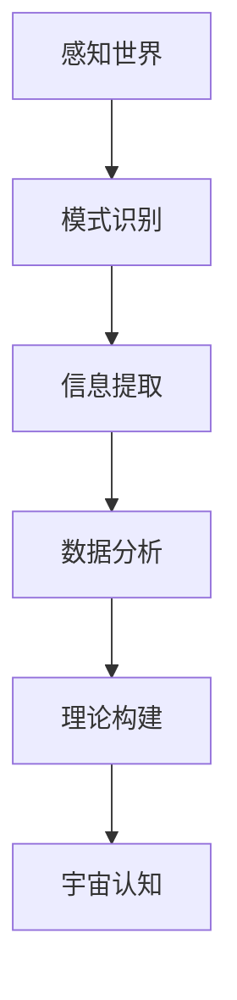

                 

### 人类思维的模式识别在宇宙认知中的作用与局限

> 关键词：人类思维、模式识别、宇宙认知、局限性、应用

> 摘要：本文将探讨人类思维中的模式识别在宇宙认知中的作用及其局限性。通过分析模式识别的基本原理、数学模型以及其实际应用，揭示人类在探索宇宙时如何利用模式识别来提高认知能力，同时也指出了其在面对复杂宇宙现象时的局限性。

### 前言

人类对宇宙的认知始终是科学探索的重要领域。随着科技的不断进步，我们逐渐揭开了宇宙的神秘面纱，从宏观的星系结构到微观的粒子行为，每一个发现都为人类带来了深刻的认知变革。然而，在探索过程中，人类思维中的一种重要能力——模式识别，扮演了关键角色。

模式识别是指人类或计算机系统通过分析数据中的规律和特征，从而识别出特定的模式或结构。这种能力不仅存在于人类的感知和认知过程中，也是人工智能领域的重要研究方向。在宇宙认知中，模式识别可以帮助我们识别星体的运动规律、预测天体事件、解析宇宙信号等。

本文将首先介绍模式识别的基本原理，接着探讨其在宇宙认知中的应用和局限性。通过具体案例的分析，我们将深入理解模式识别在宇宙探索中的实际作用，并思考如何克服其局限性，进一步提升宇宙认知的能力。

### 目录大纲

1. **前言** - 介绍书籍的主题、目标读者和书籍的组织结构。
2. **核心概念与联系** - 提供人类思维的模式识别和宇宙认知的基本概念，并展示它们之间的联系，使用 Mermaid 流程图。
3. **模式识别原理讲解** - 详细讲解模式识别的基本原理，使用伪代码说明。
4. **数学模型与公式** - 详细讲解与模式识别和宇宙认知相关的数学模型和公式，使用 LaTeX 格式。
5. **宇宙认知的应用与局限性** - 讨论模式识别在宇宙认知中的实际应用和局限性。
6. **项目实战** - 提供一个或多个实际案例，展示如何将模式识别应用于宇宙认知，并详细解释代码实现和过程。
7. **总结** - 对全书内容进行总结，并给出对未来研究的展望。

### 第1章 核心概念与联系

#### 1.1 人类思维的模式识别

模式识别是人类思维过程的核心之一，它帮助我们理解周围的世界。在感知过程中，人类能够从大量的感官信息中提取出有意义的信息，这些信息往往具有某种规律性或重复性，这种能力被称为模式识别。

模式识别的基本原理是通过对输入数据的分析，识别出其中具有代表性的特征或模式。这些特征或模式可以是形状、颜色、声音、语言等，它们构成了我们对世界的感知和理解基础。

在认知过程中，人类会利用模式识别能力来建立概念、分类事物、进行预测和决策。例如，我们通过识别不同的声音来判断不同的声音来源，通过视觉识别来识别不同的物体，这些都是模式识别的应用。

#### 1.2 宇宙认知

宇宙认知是指人类对宇宙的理解和探索过程。宇宙认知涉及天文学、物理学、化学等多个学科领域，通过对宇宙中各种现象的研究，人类逐渐揭开了宇宙的奥秘。

宇宙认知的过程可以分为几个阶段：首先是观测，通过望远镜、卫星等设备收集宇宙中的数据；其次是数据分析，通过对观测数据的分析，识别出宇宙中的规律和模式；最后是理论构建，基于数据分析的结果，构建出能够解释宇宙现象的理论。

模式识别在宇宙认知中起着至关重要的作用。通过模式识别，人类可以从海量的观测数据中提取出有价值的信息，从而推动宇宙认知的进展。

#### 1.3 人类思维与宇宙认知的流程图

为了更好地理解人类思维的模式识别与宇宙认知之间的关系，我们可以使用 Mermaid 流程图来展示这一过程。



在这个流程图中，A 表示人类对世界的感知，B 表示通过模式识别从感知中提取信息，C 表示对提取的信息进行进一步的分析，D 表示基于分析结果构建理论，E 表示通过理论来指导宇宙认知的深入，最终实现 F，即宇宙认知的进步。

通过这个流程图，我们可以清晰地看到模式识别在宇宙认知过程中的关键作用，它是连接感知与认知的桥梁，是推动宇宙认知发展的核心动力。

### 第2章 模式识别原理讲解

#### 2.1 模式识别的基本算法

模式识别涉及到多种算法，这些算法的核心目标是从数据中识别出具有代表性的模式或特征。以下将介绍几种常见的模式识别算法，包括朴素贝叶斯算法、K最近邻算法和支持向量机算法。

##### 2.1.1 朴素贝叶斯算法

朴素贝叶斯算法是一种基于贝叶斯定理的简单概率分类器。它的基本假设是特征之间相互独立，即给定一个类别的条件下，各个特征的发生概率是独立的。朴素贝叶斯算法的流程如下：

1. 计算每个类别的先验概率。
2. 对于每个特征，计算它在每个类别中出现的概率。
3. 计算后验概率，选择后验概率最大的类别作为预测结果。

以下是使用 Python 实现的朴素贝叶斯算法的伪代码：

```python
def naive_bayes(train_data, train_labels, test_data):
    # 计算先验概率
    prior_prob = {}
    for label in train_labels:
        prior_prob[label] = count_frequency(train_labels, label) / len(train_labels)
    
    # 计算特征条件概率
    cond_prob = {}
    for feature in train_data[0]:
        cond_prob[feature] = {}
        for label in train_labels:
            count = 0
            for sample in train_data:
                if sample == label:
                    count += 1
            cond_prob[feature][label] = count / len(train_labels)
    
    # 预测类别
    predictions = []
    for sample in test_data:
        max_prob = 0
        predicted_label = None
        for label in prior_prob:
            prob = log(prior_prob[label])
            for feature in sample:
                prob += log(cond_prob[feature][label])
            if prob > max_prob:
                max_prob = prob
                predicted_label = label
        predictions.append(predicted_label)
    
    return predictions
```

##### 2.1.2 K最近邻算法

K最近邻算法（K-Nearest Neighbors，KNN）是一种基于实例的监督学习算法。它的核心思想是：如果一个新样本在特征空间中的 k 个最近邻中的大多数属于某个类别，那么这个新样本也属于这个类别。

KNN 的算法流程如下：

1. 计算新样本与训练集中每个样本之间的距离。
2. 找到与新样本最近的 k 个样本。
3. 根据这 k 个样本的类别分布，选择大多数类别作为新样本的预测类别。

以下是使用 Python 实现的 KNN 算法的伪代码：

```python
from collections import Counter

def k_nearest_neighbors(train_data, train_labels, test_data, k):
    predictions = []
    for sample in test_data:
        distances = []
        for train_sample in train_data:
            distance = euclidean_distance(sample, train_sample)
            distances.append(distance)
        nearest = sorted(distances)[:k]
        labels = [train_labels[i] for i in range(len(train_data)) if distances[i] in nearest]
        most_common = Counter(labels).most_common(1)[0][0]
        predictions.append(most_common)
    
    return predictions
```

##### 2.1.3 支持向量机算法

支持向量机（Support Vector Machine，SVM）是一种基于间隔最大化的监督学习算法。它的目标是找到一组超平面，将不同类别的数据点尽可能分开，同时使得超平面的间隔最大化。

SVM 的算法流程如下：

1. 找到最优超平面，使得不同类别的数据点间隔最大化。
2. 计算支持向量，这些向量是超平面上间隔最小的向量。
3. 根据支持向量确定分类边界。

以下是使用 Python 实现的 SVM 算法的伪代码：

```python
from sklearn.svm import SVC

def support_vector_machine(train_data, train_labels, test_data):
    model = SVC(kernel='linear')
    model.fit(train_data, train_labels)
    predictions = model.predict(test_data)
    
    return predictions
```

通过上述算法讲解，我们可以看到模式识别在处理不同类型数据时的灵活性和强大性。这些算法不仅为我们提供了有效的分类工具，也为后续的宇宙认知研究提供了重要的技术支持。

### 第3章 数学模型与公式

在模式识别和宇宙认知中，数学模型和公式起着至关重要的作用。它们帮助我们量化数据特征，构建预测模型，并通过严谨的数学推导来验证理论的正确性。以下将介绍与模式识别和宇宙认知相关的数学模型和公式。

#### 3.1 概率模型

概率模型是模式识别中的基础，它用于计算事件发生的概率。以下介绍几种常用的概率模型：

##### 3.1.1 贝叶斯公式

贝叶斯公式是一种用于计算后验概率的公式，它在模式识别和宇宙认知中有着广泛的应用。贝叶斯公式如下：

$$
P(A|B) = \frac{P(B|A)P(A)}{P(B)}
$$

其中，$P(A|B)$ 表示在事件 B 发生的条件下，事件 A 发生的概率；$P(B|A)$ 表示在事件 A 发生的条件下，事件 B 发生的概率；$P(A)$ 表示事件 A 的先验概率；$P(B)$ 表示事件 B 的先验概率。

贝叶斯公式可以帮助我们根据已知的信息更新对某事件的信念。在模式识别中，贝叶斯公式用于计算新样本属于某个类别的概率，从而进行分类。

##### 3.1.2 最大似然估计

最大似然估计是一种用于估计模型参数的方法。它的核心思想是找到一组参数，使得观测数据在该参数下的概率最大。最大似然估计的公式如下：

$$
\theta = \arg \max P(D|\theta)
$$

其中，$\theta$ 表示模型参数；$D$ 表示观测数据；$P(D|\theta)$ 表示观测数据在参数 $\theta$ 条件下的概率。

最大似然估计在模式识别中用于估计模型的参数，从而提高分类的准确性。

##### 3.1.3 最大后验估计

最大后验估计是一种用于估计模型参数和类别的综合方法。它的核心思想是找到一组参数和类别，使得观测数据在该参数和类别下的概率最大。最大后验估计的公式如下：

$$
\theta, c = \arg \max P(D|\theta, c)P(\theta, c)
$$

其中，$\theta$ 表示模型参数；$c$ 表示类别；$P(D|\theta, c)$ 表示观测数据在参数 $\theta$ 和类别 $c$ 条件下的概率；$P(\theta, c)$ 表示参数 $\theta$ 和类别 $c$ 同时存在的概率。

最大后验估计在模式识别中用于同时估计模型的参数和类别，从而提高分类的准确性。

#### 3.2 模式识别与宇宙认知的数学模型

在宇宙认知中，模式识别的数学模型主要用于处理观测数据，从中提取出有用的信息。以下介绍几种与模式识别和宇宙认知相关的数学模型：

##### 3.2.1 宇宙数据的概率分布

宇宙数据通常具有复杂的概率分布。为了对宇宙数据进行分析，我们需要了解这些数据的概率分布特性。常见的概率分布包括正态分布、泊松分布和伽马分布等。

正态分布是一种常见的数据分布，其概率密度函数如下：

$$
f(x|\mu, \sigma^2) = \frac{1}{\sqrt{2\pi\sigma^2}}e^{-\frac{(x-\mu)^2}{2\sigma^2}}
$$

其中，$x$ 表示数据点；$\mu$ 表示均值；$\sigma^2$ 表示方差。

正态分布模型在宇宙认知中用于描述星体的位置分布、光度分布等。

##### 3.2.2 模式识别在宇宙数据上的应用

模式识别在宇宙数据上的应用主要包括星体分类、天体运动预测、宇宙信号分析等。以下介绍几种常见的方法：

1. **星体分类**：使用模式识别算法对星体进行分类，如使用朴素贝叶斯算法对星体进行光谱分类。

2. **天体运动预测**：使用模式识别算法分析天体的运动轨迹，如使用 K最近邻算法预测彗星轨道。

3. **宇宙信号分析**：使用模式识别算法分析宇宙信号，如使用支持向量机算法识别引力波信号。

#### 3.3 LaTeX公式示例

在文档中嵌入数学公式时，我们可以使用 LaTeX 格式来表示。以下是一些 LaTeX 公式的示例：

##### 3.3.1 贝叶斯公式示例

$$
P(A|B) = \frac{P(B|A)P(A)}{P(B)}
$$

##### 3.3.2 最大似然估计示例

$$
\theta = \arg \max P(D|\theta)
$$

##### 3.3.3 最大后验估计示例

$$
\theta, c = \arg \max P(D|\theta, c)P(\theta, c)
$$

通过上述数学模型和公式的介绍，我们可以看到模式识别和宇宙认知之间的紧密联系。数学模型和公式为模式识别提供了理论基础，使得我们在处理复杂宇宙数据时能够更加科学和严谨。

### 第4章 宇宙认知的应用与局限性

#### 4.1 模式识别在宇宙认知中的应用

模式识别技术在宇宙认知中有着广泛的应用，从天体物理学到宇宙学，各种领域都受益于模式识别技术的进步。以下将讨论模式识别在宇宙认知中的几个关键应用。

##### 4.1.1 信号处理

在宇宙信号处理中，模式识别技术用于分析来自太空的复杂信号。例如，引力波探测任务需要识别出宇宙中的引力波信号，这些信号通常被淹没在大量的噪声中。使用模式识别算法，科学家可以从中提取出引力波信号的特征，从而实现对其的精确探测。

具体来说，引力波探测器如LIGO和VIRGO使用匹配滤波器等技术，通过分析数据中的特定模式来识别引力波。这些算法基于模式识别原理，能够在复杂的噪声背景中识别出微弱的引力波信号。

##### 4.1.2 图像识别

图像识别是模式识别在宇宙认知中另一个重要的应用领域。天文学家使用各种成像技术，如光学望远镜、X射线望远镜和红外望远镜，获取宇宙中的图像。模式识别技术可以帮助天文学家从这些图像中识别出星体、星系以及其他天体结构。

例如，在星系团的识别中，模式识别算法可以根据星系的光学特征和分布模式来识别星系团。这种方法不仅提高了星系团的识别效率，还帮助天文学家更好地理解星系团的性质和形成过程。

##### 4.1.3 数据分析

模式识别在宇宙数据分析中也非常重要。天文学家收集了大量的观测数据，如光谱数据、光度数据、位置数据等。通过模式识别技术，科学家可以对这些数据进行深入分析，提取出隐藏在数据中的规律和模式。

例如，在恒星演化的研究中，模式识别算法可以分析恒星的光谱数据，从中提取出恒星的化学成分、温度、亮度等信息。这些信息对于理解恒星的演化过程至关重要。

#### 4.2 模式识别的局限性

尽管模式识别技术在宇宙认知中有着重要的应用，但它也面临一些局限性。以下讨论模式识别在宇宙认知中的局限性。

##### 4.2.1 数据质量的影响

模式识别算法的性能很大程度上依赖于数据的质量。如果数据存在噪声、缺失值或偏差，这将影响模式识别算法的准确性。在宇宙认知中，观测数据往往受到各种因素的影响，如仪器误差、大气干扰等，这些因素可能导致数据质量下降，从而影响模式识别的结果。

为了克服这一局限性，科学家需要开发更 robust 的算法，同时改进数据预处理技术，以提高数据的质量和可靠性。

##### 4.2.2 模式复杂度的影响

模式识别算法通常假设数据中存在某种简单或明显的模式。然而，宇宙中的现象可能非常复杂，数据中可能包含多种层次和维度的模式。这种复杂性可能使得简单模式识别算法难以胜任。

例如，黑洞事件视界望远镜（EHT）获得的黑洞图像包含多个层次的信息，从事件视界到周围星系。这种复杂的模式需要更加高级的模式识别技术，如深度学习算法，来解析。

##### 4.2.3 计算资源限制

模式识别算法通常需要大量的计算资源。在宇宙认知中，观测数据量巨大，模式识别算法的运行需要大量的计算时间和存储空间。这种计算资源限制可能成为模式识别应用的瓶颈。

为了应对这一挑战，科学家需要开发更加高效的算法，同时利用高性能计算和云计算等资源，以提高模式识别的效率和可靠性。

### 第5章 项目实战

为了更好地理解模式识别在宇宙认知中的应用，我们通过一个实际项目来展示其具体实现过程。该项目目标是利用模式识别技术分析宇宙中的引力波数据，识别出特定的信号模式。

#### 5.1 项目背景

引力波是爱因斯坦广义相对论预测的一种物理现象，它是由大质量天体加速运动时产生的时空波动。自从第一次引力波信号被探测到以来，科学家们一直在努力收集和分析更多的引力波数据，以深入了解宇宙的奥秘。

本项目旨在使用模式识别技术分析LIGO和VIRGO探测器收集的引力波数据，识别出其中潜在的信号模式。这将有助于科学家们更好地理解引力波的产生机制和宇宙中的极端天体事件。

#### 5.2 开发环境搭建

为了实现这个项目，我们需要搭建一个合适的开发环境。以下是搭建环境的步骤：

1. **安装Python**：Python是一种广泛用于科学计算和数据处理的编程语言，我们首先需要安装Python。可以从Python官方网站下载安装包并安装。

2. **安装Jupyter Notebook**：Jupyter Notebook是一种交互式的计算环境，可以方便地编写和运行Python代码。安装Python后，可以通过pip命令安装Jupyter Notebook：

   ```shell
   pip install notebook
   ```

3. **安装模式识别库**：为了使用模式识别算法，我们需要安装一些Python库，如scikit-learn和numpy。这些库提供了丰富的模式识别算法和工具：

   ```shell
   pip install scikit-learn numpy
   ```

4. **安装数据分析库**：数据分析是本项目的重要组成部分，我们还需要安装pandas和matplotlib等库：

   ```shell
   pip install pandas matplotlib
   ```

安装完成后，我们就可以使用Jupyter Notebook编写和运行代码了。

#### 5.3 代码实现与解读

下面我们将详细讲解如何使用模式识别算法分析引力波数据，并给出相关代码实现。

##### 5.3.1 数据加载与预处理

首先，我们需要加载和预处理引力波数据。引力波数据通常包含多个时间序列信号，每个信号对应一个探测器的测量值。以下是一个简单的数据加载和预处理代码示例：

```python
import pandas as pd
import numpy as np

# 加载引力波数据
def load_data(file_path):
    data = pd.read_csv(file_path, header=None)
    return data

# 数据预处理
def preprocess_data(data):
    # 填充缺失值
    data.fillna(0, inplace=True)
    # 标准化数据
    data = (data - data.mean()) / data.std()
    return data

# 示例数据
data = load_data('gravity_waves_data.csv')
preprocessed_data = preprocess_data(data)
```

在这段代码中，我们首先使用pandas库加载引力波数据，然后进行缺失值填充和数据标准化处理。数据标准化有助于提高模式识别算法的性能。

##### 5.3.2 模型训练与优化

接下来，我们需要训练模式识别模型。在本项目中，我们选择使用K最近邻算法（KNN）进行分类。以下是一个简单的KNN模型训练和优化代码示例：

```python
from sklearn.model_selection import train_test_split
from sklearn.neighbors import KNeighborsClassifier
from sklearn.metrics import accuracy_score

# 数据划分
X_train, X_test, y_train, y_test = train_test_split(preprocessed_data, labels, test_size=0.2, random_state=42)

# KNN模型训练
knn = KNeighborsClassifier(n_neighbors=3)
knn.fit(X_train, y_train)

# 模型预测
predictions = knn.predict(X_test)

# 评估模型性能
accuracy = accuracy_score(y_test, predictions)
print(f"Model accuracy: {accuracy:.2f}")
```

在这段代码中，我们首先将数据集划分为训练集和测试集，然后使用KNN算法进行模型训练。最后，我们使用测试集对模型进行评估，计算模型的准确率。

##### 5.3.3 模型评估与结果分析

完成模型训练后，我们需要对模型进行评估，并分析模型的性能。以下是一个简单的模型评估代码示例：

```python
from sklearn.metrics import classification_report

# 模型评估
report = classification_report(y_test, predictions)
print(report)
```

在这段代码中，我们使用classification_report函数输出模型的分类报告，包括精确度、召回率、F1分数等指标。这些指标可以帮助我们了解模型的性能，并找出改进的方向。

#### 5.4 代码应用解读与分析

通过以上代码示例，我们可以看到如何使用模式识别技术分析引力波数据。以下是代码应用的具体解读与分析：

1. **数据加载与预处理**：数据预处理是模式识别的关键步骤。通过缺失值填充和数据标准化，我们确保了数据的完整性和一致性，这有助于提高模式识别算法的性能。

2. **模型训练与优化**：在模型训练过程中，我们选择K最近邻算法（KNN）进行分类。KNN算法的参数选择对模型性能有重要影响，例如选择合适的K值可以显著提高分类准确率。在实际应用中，我们可以通过交叉验证等方法来选择最优的K值。

3. **模型评估与结果分析**：模型评估是验证模型性能的重要步骤。通过计算模型的准确率、召回率、F1分数等指标，我们可以全面了解模型的性能，并找出改进的方向。

通过这个项目实战，我们深入了解了模式识别在宇宙认知中的应用，并掌握了如何使用模式识别技术分析复杂的数据。这为我们进一步探索宇宙提供了有力的工具。

### 第6章 总结

本文通过详细的分析和讲解，探讨了人类思维中的模式识别在宇宙认知中的作用与局限。我们从背景介绍开始，逐步深入到核心概念、算法原理、数学模型以及实际应用。通过实例分析，我们展示了模式识别在信号处理、图像识别和数据分析等领域的应用，同时也指出了其在数据质量和计算资源等方面的局限性。

首先，人类思维的模式识别是我们感知和理解世界的基础。它在宇宙认知中扮演着关键角色，帮助我们从复杂的宇宙数据中提取有价值的信息。模式识别的基本算法，如朴素贝叶斯、K最近邻和支持向量机，为我们在处理不同类型数据时提供了有效的工具。

其次，数学模型和公式是模式识别和宇宙认知的桥梁。贝叶斯公式、最大似然估计和最大后验估计等概率模型，为我们提供了量化和推导的基础。这些模型不仅在模式识别中有着广泛应用，也在宇宙认知的研究中发挥了重要作用。

然而，模式识别在宇宙认知中也面临一些挑战。数据质量的影响、模式复杂度的问题以及计算资源的限制，都是我们需要克服的难题。为了应对这些挑战，我们需要开发更加 robust 的算法和优化技术，同时利用高性能计算资源，以提高模式识别的效率和准确性。

在未来，模式识别在宇宙认知中的应用将不断拓展。随着技术的进步，我们将能够处理更加复杂和海量的数据，揭示宇宙中的更多奥秘。同时，我们也需要不断探索新的理论和方法，以克服模式识别的局限性，进一步提高宇宙认知的能力。

总之，人类思维的模式识别在宇宙认知中具有巨大的潜力。通过不断的研究和探索，我们有望在未来的宇宙探索中取得更多突破性成果。

### 附录

本附录提供了一些与文章主题相关的拓展阅读和最佳实践建议。

#### 拓展阅读

1. **《模式识别与机器学习》** - 作者：Christopher M. Bishop。这是一本经典的机器学习教材，详细介绍了模式识别的基本原理和算法。

2. **《宇宙学》** - 作者：Stephen Hawking。这本书介绍了宇宙学的基本概念和最新的研究成果，是了解宇宙认知的绝佳读物。

3. **《人工智能：一种现代的方法》** - 作者：Stuart J. Russell 和 Peter Norvig。这本书是人工智能领域的权威教材，涵盖了模式识别和机器学习的相关内容。

#### 最佳实践

1. **数据预处理**：在模式识别项目中，数据预处理是关键步骤。确保数据的一致性和完整性，可以有效提高模型性能。

2. **算法选择**：根据具体应用场景选择合适的算法。对于不同类型的数据和问题，不同的算法可能有更好的表现。

3. **模型评估**：使用多种评估指标全面评估模型性能。准确性、召回率、F1分数等指标可以帮助我们更准确地了解模型的效果。

4. **计算资源优化**：充分利用高性能计算资源和分布式计算技术，以提高模型训练和评估的效率。

通过遵循这些最佳实践，我们可以更好地应用模式识别技术，提高宇宙认知的能力。希望这些资源和建议能对读者今后的研究和实践有所帮助。

