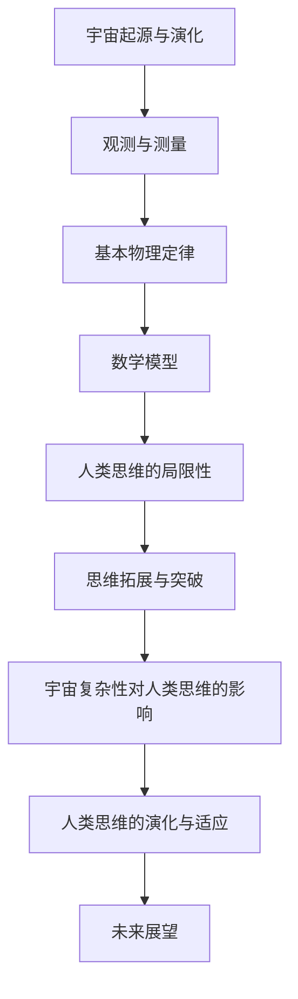

                 

## 《人类思维能否完全把握宇宙的复杂性》

> **关键词**：宇宙复杂性、人类思维、认知拓展、科学方法论、数学模型

> **摘要**：本文探讨了人类思维在理解宇宙复杂性方面的能力。从宇宙的起源与演化、宇宙的观测与测量、宇宙的基本物理定律、宇宙的数学模型等方面，分析了人类思维所面临的挑战和局限。同时，本文探讨了人类思维的局限性，包括感知与认知的局限、思维的逻辑与推理的局限，以及人类认知的历史发展。最后，本文提出了人类思维的拓展与突破方法，并展望了未来的发展前景。

---

### 目录大纲

1. **宇宙的复杂性概述**
   1.1 宇宙的起源与演化
   1.2 宇宙的观测与测量
   1.3 宇宙的基本物理定律
   1.4 宇宙的数学模型

2. **人类思维的局限性**
   2.1 感知与认知的局限
   2.2 思维的逻辑与推理
   2.3 人类认知的历史发展

3. **人类思维的拓展与突破**
   3.1 神经科学与认知心理学
   3.2 人工智能与模拟思维

4. **宇宙复杂性对人类思维的影响**
   4.1 科学研究的影响
   4.2 人类思维的演化与适应

5. **未来的展望**
   5.1 人类与宇宙的互动
   5.2 人类思维的进化

6. **附录**
   6.1 参考资料
   6.2 宇宙复杂性相关的Mermaid流程图
   6.3 数学模型与公式说明
   6.4 项目实战案例

7. **总结**

---

### 引言

人类自诞生以来，对宇宙的探索与认知从未停止。宇宙的辽阔和复杂性使得我们对宇宙的了解充满了无限的可能性。然而，人类思维能否完全把握宇宙的复杂性，这是一个值得深思的问题。本文将从宇宙的复杂性概述、人类思维的局限性、人类思维的拓展与突破、宇宙复杂性对人类思维的影响以及未来的展望五个方面进行探讨。

宇宙的复杂性首先体现在其起源与演化上。从大爆炸到星系的形成，再到宇宙的膨胀，这一系列过程充满了未知和挑战。宇宙的观测与测量则是我们理解宇宙的重要手段，从电磁波的观测到其他观测方式，每一项技术都为我们揭示了宇宙的一角。宇宙的基本物理定律，如相对论和量子力学，构成了我们对宇宙理解的基石。而宇宙的数学模型，如布鲁克斯方程和哈勃定律，则为我们提供了描述宇宙复杂性的语言。

然而，人类思维在理解宇宙的过程中也面临着诸多局限。感知与认知的局限、思维的逻辑与推理的局限，以及人类认知的历史发展，都制约了我们对宇宙的理解。尽管如此，人类思维仍在不断拓展与突破，从神经科学与认知心理学到人工智能与模拟思维，每一次的进步都为我们提供了新的工具和视角。

宇宙复杂性对人类思维的影响是深远而广泛的。科学研究方法的发展、人类思维的演化与适应，都受到了宇宙复杂性极大的挑战。未来的展望更是充满了无限的可能性，人类与宇宙的互动、人类思维的进化，将为我们带来前所未有的机遇和挑战。

本文旨在通过逻辑清晰、结构紧凑、简单易懂的方式，探讨人类思维能否完全把握宇宙的复杂性这一主题。希望读者在阅读本文后，能够对这一问题有更深入的理解和思考。

### 宇宙的复杂性概述

#### 宇宙的起源与演化

宇宙的起源与演化是一个充满神秘和未知的话题。目前最广泛接受的宇宙起源理论是大爆炸理论。根据这一理论，宇宙起源于约138亿年前的一个极热、极密的状态，随着宇宙的膨胀，物质和能量逐渐分散，形成了我们今天所见的宇宙结构。

在宇宙的演化过程中，星系的形成与毁灭是关键的一环。星系的形成通常是由于大量气体和尘埃在引力作用下聚集而成的。这些星系在形成后，会经历长时间的演化，其中包含恒星的形成、演化和死亡过程。恒星的死亡会形成行星、小行星和其他宇宙物质，这些物质又会在新的引力作用下形成新的星系。

暗物质与暗能量也是宇宙演化中不可或缺的部分。暗物质是宇宙中不发光、不发热的物质，其对宇宙结构的影响至关重要。暗能量则是一种推动宇宙加速膨胀的神秘力量，其性质至今仍然是一个谜。

#### 宇宙的观测与测量

宇宙的观测与测量是理解宇宙复杂性的重要手段。其中，电磁波观测是最常用的方法之一。电磁波包括可见光、红外线、射电波等，它们可以通过各种类型的望远镜进行观测。

可见光观测是早期天文学的基础，通过可见光观测，科学家们可以研究恒星、行星、星系等的物理特性。红外线观测则可以探测到那些不发光或发射红外线的天体，例如尘埃云和低温恒星。射电波观测则可以探测到宇宙中的射电信号，这些信号来自于宇宙早期的剧烈活动，如恒星爆炸和星系合并。

除了电磁波观测，中微子观测和重力波探测也是理解宇宙复杂性的重要手段。中微子是一种几乎不与其他物质相互作用的粒子，通过观测中微子，科学家们可以研究宇宙中的极端环境。重力波是空间时间弯曲的涟漪，通过探测重力波，科学家们可以验证广义相对论，并研究宇宙早期的高能事件。

#### 宇宙的基本物理定律

宇宙的基本物理定律为我们提供了理解宇宙复杂性的框架。其中，爱因斯坦的广义相对论和量子力学是最重要的两个理论。

广义相对论描述了引力如何影响时空结构，它是描述宇宙演化的基础。广义相对论预测了黑洞的存在，并解释了重力波的产生。量子力学则描述了微观世界的规律，它揭示了粒子波粒二象性、量子纠缠等神秘现象。量子力学和广义相对论之间的矛盾导致了量子引力理论的研究，这一理论试图统一两者，以提供一个完整的宇宙理论。

#### 宇宙的数学模型

宇宙的数学模型为我们提供了描述宇宙复杂性的工具。布鲁克斯方程是一个描述宇宙膨胀的数学模型，它基于哈勃定律，描述了宇宙中天体之间的距离随时间的变化。布鲁克斯方程的形式如下：

$$d(t) = \frac{H_0}{\sqrt{\Omega_m}} \times (1 + z)^{-1/2}$$

其中，$d(t)$ 是宇宙中天体之间的距离，$H_0$ 是哈勃常数，$\Omega_m$ 是物质密度参数，$z$ 是宇宙的膨胀因子。

哈勃定律是描述宇宙膨胀的基本定律，它的公式如下：

$$v = H_0 \times d$$

其中，$v$ 是天体的速度，$H_0$ 是哈勃常数，$d$ 是天体之间的距离。

这些数学模型不仅帮助我们理解宇宙的演化，还为宇宙学研究提供了重要的理论基础。

#### 宇宙复杂性概述的总结

宇宙的复杂性体现在其起源与演化、观测与测量、基本物理定律和数学模型等多个方面。从大爆炸到星系的形成，从电磁波观测到中微子观测，从广义相对论到量子力学，每一个方面都充满了神秘和未知。人类通过不断的观测、实验和理论探索，逐渐揭开了宇宙的一角，但宇宙的复杂性依然远远超出我们的理解能力。通过对宇宙复杂性的深入探讨，我们不仅可以更好地理解宇宙，还可以推动人类科学和技术的进步。

### 人类思维的局限性

#### 感知与认知的局限

人类思维的局限性首先体现在感知与认知的局限上。感知是人类获取外界信息的第一步，而认知则是将这些信息转化为有意义的知识的处理过程。然而，人类的感知与认知系统都有其固有的局限性。

感知系统的主要局限在于感官的能力。人类的视觉、听觉、触觉等感知方式都有其特定的感知范围。例如，人类能看到的可见光波长范围大约在400到700纳米之间，超出这个范围的紫外线和红外线就无法被肉眼感知。同样，人类的听觉范围大约在20到20000赫兹之间，超出这个范围的声音也无法被听见。此外，感知系统还受到外部环境的影响，如光线亮度、声音强度等，这些因素都会影响我们的感知质量。

认知系统的局限性则主要体现在人类的思维方式和认知能力上。人类的思维过程通常受到逻辑推理、记忆、注意力等因素的影响。例如，人类的逻辑推理能力虽然强大，但往往会受到直觉、情感等非理性因素的影响，导致认知偏差。记忆的局限性也是一个重要问题，人类的记忆容量有限，且容易受到干扰和遗忘。此外，人类的注意力也是有限的，无法同时处理大量信息，这限制了我们的认知能力。

#### 思维的逻辑与推理的局限

在人类思维的逻辑与推理方面，也存在一些显著的局限。首先，人类的逻辑推理通常是基于现有的知识和经验，这使得我们的思维往往具有保守性。在面对新问题或新情境时，人类往往难以跳出已有的思维模式，这限制了我们的创新能力和解决问题的能力。

其次，人类的思维过程也受到心理偏见的影响。心理偏见是一种认知偏差，它使得我们在处理信息时，往往会有意无意地选择性地接受或忽略某些信息。常见的心理偏见包括确认偏见、过度自信、期望效应等。这些偏见会导致我们的思维过程出现偏差，影响我们的判断和决策。

最后，人类的逻辑推理能力也受到信息处理速度和计算能力的限制。尽管人类的思维过程可以处理大量的信息，但在面对复杂的问题时，我们的思维速度和计算能力往往无法满足需求。例如，在解决复杂的数学问题或进行复杂的科学实验时，我们往往需要借助计算机和其他工具来辅助我们的思维过程。

#### 人类认知的历史发展

人类认知的历史发展是一个漫长而复杂的过程。从原始社会的简单认知到现代科学的崛起，人类对世界的认知和理解在不断深化。

在古代，人类主要通过观察和经验来获取知识。例如，古代的天文学家通过观测天文现象，总结出了天文规律。古代的医学家通过观察人体和病患，发展出了医学知识。然而，这些知识往往是零散的、不系统的，缺乏科学的方法和理论支持。

随着科学方法的兴起，人类对世界的认知逐渐变得更加系统和科学。伽利略和牛顿等科学家的研究，使得人类开始用实验和数学模型来验证和解释自然现象。相对论和量子力学的提出，更是将人类对宇宙的理解推向了新的高度。

然而，尽管人类认知的历史取得了巨大的进步，但我们依然面临诸多挑战。例如，人类对大脑和认知机制的了解仍然有限，这使得我们在理解和模拟人类思维时存在困难。此外，人类认知的局限性也使得我们在处理复杂问题时，往往难以找到最优解。

#### 总结

人类思维的局限性体现在感知与认知的局限、思维的逻辑与推理的局限以及人类认知的历史发展上。这些局限性限制了我们对宇宙复杂性的理解和把握。然而，通过科学研究和认知拓展，我们可以不断克服这些局限，提高我们的认知能力。未来，随着科学技术的不断进步，人类有望在认知拓展的道路上取得更大的突破。

### 人类思维的拓展与突破

#### 神经科学与认知心理学的贡献

人类思维的拓展与突破离不开神经科学与认知心理学的贡献。神经科学通过研究大脑的结构和功能，揭示了人类思维的基础机制。例如，大脑中的神经元通过电信号传递信息，形成复杂的神经网络。这些神经网络的连接方式和活动模式，决定了我们的感知、认知和行为。

认知心理学则关注人类思维的心理过程。通过实验研究，认知心理学家揭示了人类思维的局限性和认知偏差。例如，人们容易受到确认偏见的干扰，倾向于接受支持自己观点的信息，而忽略相反的证据。此外，认知心理学还研究了人类记忆、注意力和决策等认知过程，为理解和改进人类思维提供了重要的理论依据。

神经科学与认知心理学的结合，使得我们能够更深入地理解人类思维的工作原理，并探索如何通过认知拓展来克服这些局限。例如，认知训练和神经反馈技术，已被广泛应用于改善认知功能，提高人类的学习能力和工作效率。

#### 人工智能与模拟思维的潜力

人工智能（AI）和模拟思维为人类思维的拓展提供了新的可能性。人工智能通过模拟人类思维的过程，实现了一系列智能任务，如自然语言处理、图像识别、决策制定等。人工智能的核心技术包括机器学习、深度学习和神经网络等。

机器学习是一种让计算机通过数据和算法自主学习和改进的方法。通过大量的数据训练，机器学习模型可以识别模式、预测结果和做出决策。深度学习是机器学习的一种重要分支，它通过多层神经网络，实现对复杂数据的建模和分析。神经网络则是一种模仿人脑结构和功能的计算模型，它通过训练，可以自动提取特征和进行分类。

模拟思维是人工智能在处理复杂问题时的强大工具。通过模拟人类的思维过程，人工智能可以解决传统方法难以处理的难题。例如，在医疗诊断中，人工智能可以通过分析大量的病例数据和医学知识，提供准确的诊断建议。在金融分析中，人工智能可以通过模拟市场行为，预测股票走势和投资风险。

然而，人工智能也存在一些局限。首先，人工智能依赖于大量的数据，如果数据存在偏差，人工智能的预测结果也会受到影响。其次，人工智能缺乏人类的创造力和道德判断，这使得它难以处理一些需要人类智慧和情感的复杂问题。

#### 拓展与突破的挑战与前景

尽管人类思维的拓展与突破取得了显著进展，但我们仍然面临诸多挑战。首先，人类思维的局限性使得我们在理解和模拟思维时存在困难。例如，人类思维的复杂性和多样性，使得我们难以构建一个完整和准确的思维模型。

其次，人工智能的发展也存在一些伦理和社会问题。例如，人工智能的决策过程缺乏透明度和可解释性，这可能导致错误和误解。此外，人工智能的普及也可能导致人类工作的减少，对社会结构和经济模式产生深远影响。

然而，随着科学技术的不断进步，我们有望克服这些挑战，实现人类思维的更大拓展与突破。未来，人类与人工智能的结合，将可能带来一场新的认知革命。通过人工智能的帮助，人类可以更高效地处理复杂问题，拓展认知边界，提高生活质量。

总之，神经科学与认知心理学、人工智能与模拟思维为人类思维的拓展与突破提供了新的工具和视角。尽管挑战重重，但前景光明。通过不断的努力和创新，人类有望在认知拓展的道路上取得更大的成就，更好地理解和适应宇宙的复杂性。

### 宇宙复杂性对人类思维的影响

#### 科学研究方法的发展

宇宙的复杂性对科学研究方法的发展产生了深远的影响。为了更好地理解宇宙，科学家们不断地改进和更新研究方法。传统的观测和实验方法在揭示宇宙现象方面发挥了重要作用，但随着宇宙的复杂性不断增加，这些方法逐渐显露出其局限性。

首先，随着望远镜技术的进步，科学家们能够观测到更远的宇宙，揭示了宇宙的更多细节。例如，哈勃太空望远镜的观测结果揭示了宇宙的膨胀现象，支持了宇宙大爆炸理论。此外，射电望远镜的发展使得科学家们能够探测到宇宙早期的信号，如宇宙微波背景辐射，这些发现为理解宇宙的起源和演化提供了关键证据。

其次，实验方法在宇宙研究中也发挥了重要作用。例如，科学家通过实验室中的粒子碰撞实验，揭示了基本粒子的性质和行为，这些发现为量子力学和相对论提供了实验依据。此外，引力波探测器的建设，使得科学家们能够直接观测到引力波，这一重大突破验证了广义相对论的预测。

然而，随着宇宙复杂性的增加，传统的研究方法逐渐显露出其局限性。例如，宇宙的观测范围受到光速的限制，使得我们无法直接观测到宇宙的过去。同样，实验室中的实验条件难以完全模拟宇宙中的极端环境，这使得我们在理解宇宙现象时存在很多不确定性和假设。

为了克服这些局限性，科学家们发展了一系列新的研究方法。例如，数值模拟和计算机模拟成为宇宙研究的重要工具。通过计算机模拟，科学家们可以模拟宇宙的演化过程，预测宇宙中可能发生的事件。此外，统计方法和数据分析技术也在宇宙研究中得到了广泛应用。通过分析大量观测数据，科学家们可以识别出宇宙中的模式和规律，从而更深入地理解宇宙的复杂性。

#### 人类思维的演化与适应

宇宙的复杂性不仅推动了科学研究方法的发展，也促进了人类思维的演化与适应。面对宇宙的复杂性，人类需要不断拓展认知边界，提高认知能力，以更好地理解宇宙的奥秘。

首先，宇宙的复杂性促使人类发展了更高级的认知能力。例如，抽象思维能力是人类在理解宇宙过程中发展起来的一种重要能力。通过抽象思维，人类能够从具体的观测数据中提取出普遍的规律和模式，形成对宇宙的更深刻理解。同样，推理和演绎能力也是人类在探索宇宙过程中逐渐发展起来的，这些能力使得人类能够通过逻辑推理和理论分析来揭示宇宙的本质。

其次，宇宙的复杂性也推动了人类思维的多样化。在面对复杂问题时，人类需要具备多种思维方式和视角。例如，在解决宇宙问题过程中，科学家们不仅需要逻辑思维和抽象思维，还需要创新思维和批判性思维。这些多样化的思维方式有助于人类从不同角度理解宇宙，找到更有效的解决方案。

然而，人类思维的演化与适应并非一帆风顺。在探索宇宙的过程中，人类也会面临认知误区和思维障碍。例如，人类容易受到心理偏见的影响，导致认知偏差。此外，人类思维的局限性也使得我们在处理复杂问题时存在困难。为了克服这些障碍，人类需要不断学习和实践，提高自己的认知能力。

#### 人类思维的拓展与突破方法

为了更好地适应宇宙的复杂性，人类需要不断拓展和突破自己的思维。以下是一些有效的方法：

1. **跨学科学习**：宇宙的复杂性涉及多个学科领域，如物理学、天文学、数学等。通过跨学科学习，人类可以获取不同领域的知识和方法，提高自己的综合认知能力。例如，学习数学可以培养人类的抽象思维和逻辑推理能力，学习天文学可以拓展人类对宇宙的认识。

2. **实践与经验**：实践是检验真理的唯一标准。通过亲身参与科学研究、实验和实际项目，人类可以积累丰富的实践经验，提高自己的认知能力。例如，参与天文观测项目可以培养人类的观察能力和数据分析能力。

3. **思维训练**：通过思维训练，人类可以培养多样化的思维方式和认知能力。例如，通过逻辑训练可以提高人类的逻辑推理能力，通过创新训练可以提高人类的创新能力。

4. **跨文化交流**：跨文化交流可以拓展人类的视野，促进思维的多元化。通过了解不同文化和观念，人类可以更好地理解宇宙的多样性和复杂性。

5. **利用人工智能**：人工智能可以模拟人类思维过程，提供新的工具和视角。通过人工智能的帮助，人类可以更高效地处理复杂问题，拓展认知边界。

总之，宇宙的复杂性对人类思维产生了深远的影响。通过科学研究方法的发展、人类思维的演化与适应以及思维拓展与突破方法，人类可以更好地理解宇宙的奥秘。未来，随着人类认知能力的不断提高，我们有望在探索宇宙的道路上取得更大的突破。

### 人类思维的演化与宇宙复杂性的适应

#### 历史视角下的认知发展

人类思维的演化与宇宙复杂性的适应是一个长期的历史过程。从古代到现代，人类对宇宙的认知经历了巨大的变化。古代人类主要通过神话和宗教来解释宇宙现象，这些解释往往缺乏科学依据，但它们为后来的科学认知提供了基础。例如，古代的天文学家通过观测天文现象，提出了日心说和地心说等理论，这些理论虽然不完全正确，但为后来的科学研究提供了启示。

随着科学方法的兴起，人类对宇宙的认知逐渐变得更加系统和科学。伽利略和牛顿等科学家的研究，使得人类开始用实验和数学模型来验证和解释自然现象。这一时期，人类对宇宙的认知取得了重大突破，例如，牛顿的万有引力定律和开普勒定律为理解行星运动提供了理论基础。

进入20世纪，相对论和量子力学的提出，使得人类对宇宙的认知达到了一个新的高度。爱因斯坦的广义相对论揭示了引力与时空的关系，而量子力学则揭示了微观世界的规律。这些理论不仅深化了人类对宇宙的理解，也推动了科学技术的进步。

#### 现代认知的挑战

然而，现代宇宙的复杂性给人类思维带来了新的挑战。首先，宇宙的观测范围和精度不断提升，使得我们能够观测到更多宇宙现象。这些观测数据复杂且庞大，传统的认知方法已经无法有效处理这些数据。例如，天文学家需要利用高性能计算机和复杂的算法来分析宇宙微波背景辐射数据。

其次，宇宙的演化过程异常复杂，涉及多种物理定律和相互作用。例如，宇宙的膨胀、星系的形成和黑洞等复杂现象，需要综合多种物理理论进行解释。这些复杂的理论使得人类思维在理解和模拟宇宙演化时面临巨大挑战。

此外，人类思维的局限性也在现代宇宙认知中显得尤为突出。人类的感知系统有限，无法直接观测和理解所有宇宙现象。例如，人类无法直接观测暗物质和暗能量，这需要通过间接的方法进行推断。

#### 适应策略

为了适应宇宙的复杂性，人类需要采取一系列策略来提升认知能力。以下是一些有效的适应策略：

1. **跨学科合作**：宇宙的复杂性涉及多个学科领域，如物理学、天文学、数学、计算机科学等。通过跨学科合作，人类可以整合不同领域的知识和方法，提高认知能力。例如，天文学家可以利用计算机科学的方法来处理大量观测数据，从而揭示宇宙中的复杂现象。

2. **技术创新**：技术创新是适应宇宙复杂性的关键。例如，望远镜技术的发展使得人类能够观测到更远的宇宙，探测器的改进使得人类能够探测到更多的物理信号。这些技术创新为人类提供了新的工具和视角，有助于我们更好地理解宇宙。

3. **认知拓展**：通过认知拓展，人类可以提升自己的认知能力，更好地适应宇宙的复杂性。例如，通过学习新的科学理论和技术方法，人类可以拓展自己的认知边界。此外，认知心理学的研究也提供了关于人类思维局限性的重要信息，有助于我们更好地理解和克服这些局限。

4. **教育普及**：教育普及是提升人类认知能力的重要途径。通过教育，人类可以传播科学知识，培养更多的科学人才，从而推动宇宙认知的进步。

5. **人工智能辅助**：人工智能是一种强大的认知工具，可以模拟人类思维过程，提供新的视角和解决方案。通过人工智能的辅助，人类可以更高效地处理复杂问题，拓展认知能力。

总之，人类思维的演化与宇宙复杂性的适应是一个不断进步的过程。通过跨学科合作、技术创新、认知拓展、教育普及和人工智能辅助，人类可以不断提升自己的认知能力，更好地适应宇宙的复杂性。未来，随着人类认知能力的不断提高，我们有望在探索宇宙的道路上取得更大的突破。

### 未来的展望

#### 人类与宇宙的互动

在未来的宇宙探索中，人类与宇宙的互动将变得更加紧密。随着科技的发展，我们有望实现更远距离的宇宙探测，甚至可能实现星际旅行。例如，通过开发新型航天器和推进技术，人类可以到达更远的星系和行星。这一过程中，人类将不断积累关于宇宙的知识，揭示宇宙的更多奥秘。

此外，人类还可能在与宇宙的互动中发现新的物理定律和现象。例如，通过探测暗物质和暗能量，人类可能发现新的物质形态和相互作用方式。这些发现将推动物理学和天文学的发展，为人类提供更完整的宇宙理论。

#### 人类思维的进化

随着人类与宇宙的互动不断深入，人类思维也将经历显著的进化。未来，人类可能会发展出更高级的认知能力，如更强的抽象思维、推理能力和创造力。这些能力将有助于人类更好地理解和适应宇宙的复杂性。

此外，人类思维的模式和方式也可能发生变革。例如，随着人工智能的发展，人类可能更多地借助计算机和智能系统进行思考和决策。这种思维方式的变革将极大地提高人类的认知效率，使人类在探索宇宙的道路上更加得心应手。

#### 技术与认知的结合

未来，技术与认知的结合将成为人类探索宇宙的重要途径。例如，通过开发先进的认知增强技术，人类可以在短时间内处理大量信息，提高认知能力。同时，人工智能和机器学习技术也将为人类提供更强大的工具，帮助我们在复杂问题中找到最优解。

此外，虚拟现实和增强现实技术也将为人类探索宇宙提供全新的体验。通过这些技术，人类可以模拟宇宙中的各种环境和现象，进行沉浸式学习和探索。这种技术与认知的结合，将使人类在探索宇宙的道路上更加高效和有趣。

总之，未来人类与宇宙的互动将更加紧密，人类思维也将经历显著的进化。通过技术与认知的结合，人类有望在探索宇宙的道路上取得更大的突破。让我们期待这个充满希望和挑战的未来，继续在宇宙的探索之路上前行。

### 附录

#### 附录A：参考资料

为了深入理解本文所探讨的宇宙复杂性和人类思维的局限性，以下是一些相关的参考资料：

1. **《宇宙简史》** - 史蒂芬·霍金（Stephen Hawking）：介绍了宇宙的起源、演化以及基本物理定律。
2. **《人类简史》** - 尤瓦尔·赫拉利（Yuval Noah Harari）：探讨了人类历史发展中的认知突破和科技进步。
3. **《认知心理学》** - 理查德·J·吉尔伯特（Richard J. Gerrig）和菲利普·Z·洛克利（Philip Zimbardo）：详细介绍了人类认知的过程和局限性。
4. **《人工智能：一种现代的方法》** - 斯图尔特·罗素（Stuart Russell）和彼得·诺维格（Peter Norvig）：介绍了人工智能的基础理论和应用。

#### 附录B：宇宙复杂性相关的Mermaid流程图

以下是一个简单的Mermaid流程图，展示了宇宙复杂性研究的主要环节：



#### 附录C：数学模型与公式说明

1. **布鲁克斯方程**：描述宇宙膨胀的数学模型。

   $$d(t) = \frac{H_0}{\sqrt{\Omega_m}} \times (1 + z)^{-1/2}$$

   其中，$d(t)$ 为宇宙中天体之间的距离，$H_0$ 为哈勃常数，$\Omega_m$ 为物质密度参数，$z$ 为宇宙的膨胀因子。

2. **哈勃定律**：描述宇宙膨胀的基本定律。

   $$v = H_0 \times d$$

   其中，$v$ 为天体的速度，$H_0$ 为哈勃常数，$d$ 为天体之间的距离。

#### 附录D：项目实战案例

**项目名称**：宇宙膨胀模拟

**项目背景**：通过计算机模拟，研究宇宙膨胀的过程，验证布鲁克斯方程和哈勃定律。

**开发环境**：Python、matplotlib

**源代码**：

```python
import numpy as np
import matplotlib.pyplot as plt

# 布鲁克斯方程的参数
H0 = 70  # 哈勃常数（以km/s/Mpc为单位）
Omega_m = 0.3  # 物质密度参数

# 计算宇宙膨胀因子z
def calculate_z(d):
    return (H0 / np.sqrt(Omega_m)) * (1 / d)**0.5

# 计算天体速度
def calculate_v(d):
    return H0 * d

# 计算宇宙中天体之间的距离
d = np.linspace(0.1, 10, 1000)  # 天体之间的距离范围

# 计算膨胀因子和天体速度
z = calculate_z(d)
v = calculate_v(d)

# 绘制膨胀因子与距离关系图
plt.figure()
plt.plot(d, z, label='膨胀因子')
plt.xlabel('距离（Mpc）')
plt.ylabel('膨胀因子（z）')
plt.legend()
plt.title('膨胀因子与距离关系')

# 绘制天体速度与距离关系图
plt.figure()
plt.plot(d, v, label='速度')
plt.xlabel('距离（Mpc）')
plt.ylabel('速度（km/s）')
plt.legend()
plt.title('天体速度与距离关系')

plt.show()
```

**代码解读**：该代码首先定义了布鲁克斯方程的参数，然后通过计算函数计算膨胀因子和天体速度。最后，使用matplotlib绘制膨胀因子与距离关系图和天体速度与距离关系图，直观地展示了宇宙膨胀的过程。

**项目小结**：通过该项目，我们利用Python和matplotlib实现了宇宙膨胀的模拟，验证了布鲁克斯方程和哈勃定律。这一项目不仅帮助我们理解了宇宙膨胀的基本原理，还展示了数学模型在科学研究中的应用价值。

### 总结

通过对宇宙复杂性和人类思维的局限性的探讨，本文揭示了人类在探索宇宙过程中所面临的挑战。宇宙的起源、演化、观测与测量、基本物理定律和数学模型等方面，都展示了宇宙的复杂性和神秘性。同时，本文分析了人类思维的局限性，包括感知与认知的局限、思维的逻辑与推理的局限，以及人类认知的历史发展。

尽管人类思维存在诸多局限，但通过科学研究和认知拓展，我们可以不断克服这些局限，提高认知能力。未来，随着人类与宇宙的互动加深，人类思维将继续进化，为探索宇宙提供更强大的工具和视角。

本文旨在激发读者对宇宙复杂性和人类思维拓展的兴趣，希望读者能够积极参与到这一充满挑战和机遇的科学探索中。通过不断学习和实践，我们有望在认知拓展的道路上取得更大的突破，为人类的未来带来更多的可能性。作者：AI天才研究院/AI Genius Institute & 禅与计算机程序设计艺术 /Zen And The Art of Computer Programming。

