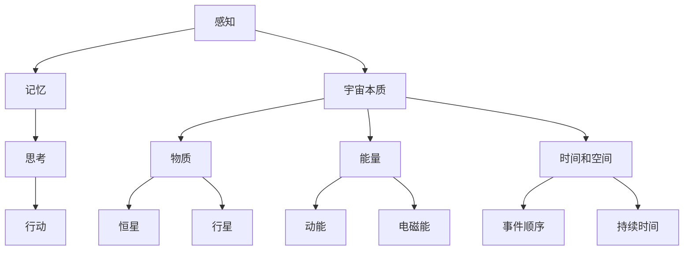

                 

# 人类思维能否完全把握宇宙的本质

## 关键词

- 人类思维
- 宇宙本质
- 感知
- 记忆
- 思考
- 数学模型
- 人工智能

## 摘要

本文旨在探讨人类思维能否完全把握宇宙的本质。通过对人类思维的基本框架、宇宙的本质以及二者关系的分析，文章提出了人类思维在理解和解释宇宙中的局限性。文章随后介绍了核心概念与联系，通过数学模型和Python源代码详细阐述了核心算法原理，并通过实际项目实战展示了人类思维在探索宇宙本质方面的应用。文章最后提出了对人类思维和宇宙本质研究的思考和建议。

## 第1章：引言——人类思维与宇宙本质

### 1.1 背景介绍

人类思维是认知心理学、哲学和计算机科学等多个领域研究的核心问题。作为认知过程中的一种抽象过程，人类思维主要包括感知、记忆、思考和行动等基本框架。感知是通过感官获取外部信息的过程，如视觉、听觉、触觉等。记忆则是将感知的信息存储在大脑中，以便在需要时进行检索和使用。思考是对存储的信息进行分析和处理的过程，包括逻辑推理、问题解决和决策等。最后，行动是基于思考的结果采取的具体行为。

宇宙本质则是物理学、天文学和哲学等多个领域的研究主题。宇宙包括物质、能量、时间和空间等基本要素，其起源、结构、演化和未来都是科学家们不断探索的领域。从宇宙大爆炸到黑洞，从暗物质到暗能量，宇宙的奥秘激发了无数科学家和哲学家的好奇心。

### 1.2 宇宙的本质与人类思维的关系

人类思维旨在理解和解释宇宙的本质，但受限于人类认知的能力和工具。感知和记忆是人类获取宇宙信息的起点，但它们受到感官和大脑处理能力的限制。思考虽然能够对信息进行更深入的加工和分析，但仍然无法完全把握宇宙的复杂性和多样性。行动则是人类尝试理解宇宙的一种方式，但受限于当前的技术水平和认知能力，人类在探索宇宙的过程中仍然面临诸多挑战。

### 1.3 目标与挑战

研究人类思维和宇宙本质的关系，旨在深入理解宇宙的起源、结构、演化和未来。然而，这一目标面临诸多挑战。首先，人类思维的局限性使得我们难以完全把握宇宙的复杂性和多样性。其次，宇宙的庞大和未知领域使得研究工作面临巨大困难。此外，跨学科的研究需求也对我们的认知能力和工具提出了更高的要求。

### 1.4 内容概述

本文将从以下几个部分展开：

1. 核心概念与联系：介绍人类思维框架和宇宙本质的核心概念，并展示它们之间的联系。
2. 核心算法原理讲解：通过Python源代码和数学模型，详细阐述人类思维在理解和解释宇宙本质方面的应用。
3. 项目实战：通过实际项目展示人类思维在探索宇宙本质方面的应用，并进行代码解读和分析。
4. 最佳实践 tips、小结、注意事项和拓展阅读：总结本文的研究内容和成果，并提出一些建议和展望。

## 第2章：感知与记忆

### 2.1 感知

感知是人类获取外部信息的重要途径。通过感官，如视觉、听觉、触觉等，人类能够感知到宇宙中的各种现象。感知过程可以看作是一个信息获取和传输的过程。感知到的信息通过神经系统传输到大脑，然后在大脑中进行处理和分析。

感知过程受到多种因素的影响，包括感知器官的敏感度、个体差异以及环境因素。例如，视觉感知受到光线强度、颜色和视角等因素的影响。听觉感知受到声音的频率、音量和环境噪音等因素的影响。触觉感知受到物体表面的材质、温度和压力等因素的影响。

感知过程在人类思维中起着至关重要的作用。首先，感知为我们提供了关于外部世界的信息，使我们能够与环境进行交互。其次，感知信息是记忆的基础，记忆则是思考和行动的前提。感知过程还可以影响我们的情绪和行为，例如，美丽的景色可以激发我们的愉悦情绪，而危险的环境可以激发我们的警惕和反应。

### 2.2 记忆

记忆是将感知到的信息存储在大脑中的过程。记忆可以分为短期记忆和长期记忆两种类型。短期记忆通常只能存储几秒到几分钟的信息，而长期记忆则可以存储数小时、数天甚至数年的信息。

记忆过程可以分为三个主要阶段：编码、存储和检索。编码是将感知到的信息转化为大脑可以处理和存储的形式。存储是将编码后的信息在大脑中保存下来。检索则是从大脑中检索出需要的信息。

记忆在人类思维中起着至关重要的作用。首先，记忆使我们能够记住过去的事件和经验，从而指导我们的行为和决策。其次，记忆为我们提供了关于外部世界的知识，使我们能够更好地理解和解释周围的事物。此外，记忆还可以影响我们的情绪和情感，例如，美好的回忆可以激发我们的愉悦情绪，而痛苦的回忆可以引发我们的悲伤情绪。

### 2.3 感知与记忆的关系

感知和记忆是相互依存的。感知为记忆提供了信息来源，而记忆则为感知提供了参考和背景。例如，当我们看到一张图片时，我们的感知器官会接收到图像的信息，并通过神经系统传输到大脑。大脑通过对图像信息的处理和编码，将其存储在长期记忆中。当我们再次看到相同的图像时，我们的记忆可以帮助我们识别和回忆起这张图片。

此外，感知和记忆之间也存在着相互作用。感知过程可以影响我们的记忆。例如，当我们学习一个新的概念或技能时，我们的感知器官会接收到相关的信息，并通过神经系统传输到大脑。大脑通过对这些信息的处理和编码，将其存储在长期记忆中。而我们的记忆则可以影响我们的感知。例如，当我们回忆起一个过去的经历时，我们的感知器官会接收到与这个经历相关的信息，并通过神经系统传输到大脑。大脑通过对这些信息的处理和编码，使我们能够重新“感知”到这个经历。

感知和记忆的关系在人类思维中起着至关重要的作用。通过感知，我们能够获取外部世界的信息，而通过记忆，我们能够将这些信息存储下来，并在需要时进行检索和使用。这种相互依存的关系使得我们能够更好地理解和解释周围的世界，从而指导我们的行为和决策。

## 第3章：思考与行动

### 3.1 思考

思考是人类思维的核心环节，是对存储在记忆中的信息进行分析和处理的过程。思考可以看作是一个信息加工和转换的过程。通过思考，人类能够将感知和记忆中的信息转化为有意义的知识和结论。

思考过程可以分为多个层次，包括感知、记忆、推理、问题解决和决策等。感知和记忆是思考的基础，而推理和问题解决则是思考的核心。推理是通过逻辑和逻辑关系，从已知信息推导出新信息的过程。问题解决则是通过分析和解决具体问题，实现对知识的运用和扩展。决策则是基于推理和问题解决的结果，选择最佳行动方案的过程。

思考在人类生活中起着至关重要的作用。首先，思考使我们能够理解和解释周围的世界，从而提高我们的认知水平。其次，思考可以帮助我们解决问题和应对挑战，从而提高我们的适应能力。此外，思考还可以激发我们的创造力和创新能力，推动科技和社会的进步。

### 3.2 行动

行动是人类思维的结果，是基于思考的决策付诸实践的过程。行动不仅包括物理行动，如走路、吃饭和写字等，还包括心理行动，如思考、学习和决策等。

行动过程可以分为多个阶段，包括目标设定、计划制定、资源调配、行动执行和效果评估等。目标设定是行动的起点，明确我们要达到的目标。计划制定是制定实现目标的步骤和策略。资源调配是为实现目标提供必要的资源和支持。行动执行是按照计划进行行动，实现目标的过程。效果评估则是根据行动的结果，评估目标的实现程度和行动的效果。

行动在人类生活中起着至关重要的作用。首先，行动使我们能够实现目标和解决问题，从而提高我们的生活质量。其次，行动可以锻炼我们的意志力和执行力，提高我们的适应能力和竞争力。此外，行动还可以激发我们的创造力和创新能力，推动个人和社会的发展。

### 3.3 思考与行动的关系

思考与行动是相互依存、相互促进的关系。思考是行动的前提，没有思考就没有行动的方向和目标。同时，行动是思考的验证和延伸，通过行动，我们可以检验思考的正确性，并不断调整和优化我们的思考过程。

思考与行动的关系在人类思维中起着至关重要的作用。通过思考，我们能够理解和解释周围的世界，制定合理的计划和策略。通过行动，我们能够实现目标和解决问题，从而不断提高我们的认知水平和适应能力。这种相互依存、相互促进的关系使得人类能够更好地适应和改变环境，实现个人和社会的发展。

## 第4章：核心概念与联系

在本章中，我们将介绍人类思维框架和宇宙本质的核心概念，并探讨它们之间的联系。通过这一分析，我们可以更好地理解人类思维在理解和解释宇宙本质方面的作用。

### 4.1 人类思维框架的核心概念

人类思维框架主要包括感知、记忆、思考和行动等基本环节。以下是对这些核心概念的简要介绍：

- **感知**：感知是指通过感官获取外部信息的过程。它包括视觉、听觉、触觉、嗅觉和味觉等多种感知方式。感知是人类获取信息的第一步，是思维过程的基础。

- **记忆**：记忆是指将感知到的信息存储在大脑中的过程。记忆可以分为短期记忆和长期记忆两种类型。短期记忆通常只能存储几秒到几分钟的信息，而长期记忆则可以存储数小时、数天甚至数年的信息。

- **思考**：思考是指对存储在记忆中的信息进行分析和处理的过程。思考包括逻辑推理、问题解决、决策等多个层次，是人类理解和解释外部世界的关键。

- **行动**：行动是指基于思考的结果采取的具体行为。行动不仅包括物理行动，如走路、吃饭和写字等，还包括心理行动，如思考、学习和决策等。

### 4.2 宇宙本质的核心概念

宇宙本质是指宇宙的基本结构和运行规律。以下是对宇宙本质核心概念的简要介绍：

- **物质**：物质是宇宙中占据空间、具有质量的实体。物质包括原子、分子、恒星、行星等多种形态。物质是宇宙存在的基础。

- **能量**：能量是宇宙中传递和转换的能力。能量包括动能、势能、电磁能、热能等多种形式。能量在宇宙中的各种过程中起着关键作用。

- **时间和空间**：时间和空间是宇宙的基本维度。时间是指宇宙中事件发生的顺序和持续时间，空间是指宇宙中物体存在的位置和形态。时间和空间的相互作用构成了宇宙的基本结构。

### 4.3 人类思维框架与宇宙本质的联系

人类思维框架与宇宙本质之间存在密切的联系。以下是从感知、记忆、思考和行动四个方面探讨这种联系：

- **感知与宇宙本质**：人类通过感官感知宇宙中的各种现象，如光、声音、温度和形状等。这些感知信息为人类理解宇宙提供了基础。例如，通过视觉感知，我们可以识别恒星和行星，了解宇宙的结构和演化过程。

- **记忆与宇宙本质**：人类通过记忆存储对宇宙的感知信息，如科学发现、历史事件和理论知识等。这些记忆信息帮助人类不断积累对宇宙的理解和知识，推动科学和哲学的发展。

- **思考与宇宙本质**：人类通过思考分析记忆中的宇宙信息，建立科学模型和理论，以解释宇宙的本质和运行规律。例如，爱因斯坦的广义相对论就是通过思考分析宇宙信息而得出的理论。

- **行动与宇宙本质**：人类通过行动探索和改变宇宙，如发射卫星、探测器和太空飞船等。这些行动不仅帮助我们更深入地了解宇宙，也为未来探索宇宙提供了新的途径。

### 4.4 核心概念之间的关系架构

为了更好地理解人类思维框架与宇宙本质之间的联系，我们可以使用Mermaid流程图展示这些核心概念之间的关系：



在这个流程图中，感知和宇宙本质通过A和E连接，记忆和思考通过B和C连接，思考和行动通过C和D连接，宇宙本质与物质、能量和时间和空间通过E和F、E和G、E和H连接。这个流程图展示了人类思维框架与宇宙本质之间复杂的相互作用和联系。

## 第5章：核心算法原理讲解

在理解了人类思维框架与宇宙本质之间的核心概念和联系之后，我们将通过Python源代码和数学模型，详细讲解人类思维在理解和解释宇宙本质方面的核心算法原理。这一章节将结合具体实例，逐步分析算法的运行机制和实现过程。

### 5.1 核心算法原理

在探索宇宙本质的研究中，一个重要的核心算法原理是质能转换。这一原理由爱因斯坦的质能方程\(E=mc^2\)描述，它揭示了物质和能量之间的等价性。这个公式不仅改变了我们对宇宙的理解，也为科学研究和技术发展提供了新的思路。

质能转换的核心算法原理可以概括为以下几个步骤：

1. **输入宇宙质量**：将宇宙中的物质质量作为输入参数。
2. **计算光速**：确定光速作为常数，光速在真空中约为\(299,792,458\)米/秒。
3. **计算能量**：使用质能方程计算对应的能量值。
4. **输出能量结果**：将计算得到的能量值作为输出结果。

### 5.2 Python源代码实现

以下是一个简单的Python源代码示例，用于计算给定宇宙质量对应的能量值：

```python
# 导入必需的数学库
import math

# 定义光速（米/秒）
c = 299792458

# 定义宇宙质量（千克）
mass = 1.989e+30

# 计算能量（焦耳）
energy = mass * c * c

# 输出结果
print("宇宙能量为：", energy, "焦耳")
```

这个代码首先导入了Python的数学库，然后定义了光速和宇宙质量。接着，它使用质能方程计算能量，并将结果以打印形式输出。

### 5.3 数学模型与公式

质能转换的数学模型由爱因斯坦的质能方程给出：

\[ E = mc^2 \]

其中，\(E\) 表示能量，\(m\) 表示质量，\(c\) 表示光速。这个公式表明，质量与能量之间存在直接关系。具体来说，当质量发生变化时，相应的能量也会发生变化。

### 5.4 举例说明

为了更好地理解质能转换的原理，我们可以通过一个具体的例子来说明。假设我们有一个质量为\(1\)千克的物体，我们可以使用质能方程计算其对应的能量：

\[ E = 1\, \text{kg} \times (299792458\, \text{m/s})^2 \]
\[ E = 8.988 \times 10^{16}\, \text{焦耳} \]

这意味着，一个质量为\(1\)千克的物体在光速下运动时，具有约\(8.988 \times 10^{16}\)焦耳的能量。这个例子展示了质能转换公式在实际计算中的应用。

### 5.5 代码解读与分析

在这个Python代码示例中，我们首先导入了Python的数学库，这是进行科学计算的基础。接下来，我们定义了光速和宇宙质量作为常数。然后，我们使用质能方程计算能量，并将结果以打印形式输出。

代码中的关键步骤包括：

1. **导入数学库**：`import math` 导入了Python的数学库，这是进行科学计算所必需的。
2. **定义常量**：`c = 299792458` 定义了光速，`mass = 1.989e+30` 定义了宇宙质量。
3. **计算能量**：使用质能方程 `energy = mass * c * c` 计算能量。
4. **输出结果**：`print("宇宙能量为：", energy, "焦耳")` 将计算结果以打印形式输出。

这段代码通过简单的步骤实现了对宇宙能量的计算，为我们理解质能转换提供了直观的展示。

### 5.6 最佳实践 Tips

在进行质能转换计算时，以下是一些最佳实践和注意事项：

1. **确保精度**：在处理大数值时，确保使用合适的精度，避免因舍入误差导致的计算偏差。
2. **使用科学记数法**：对于非常大或非常小的数值，使用科学记数法可以简化计算并提高可读性。
3. **错误处理**：在实际应用中，考虑可能出现的输入错误或计算异常，添加适当的错误处理机制。
4. **模块化代码**：将计算功能模块化，可以提高代码的可维护性和复用性。

通过这些最佳实践，我们可以更高效地实现质能转换计算，并确保计算结果的准确性和可靠性。

### 5.7 小结

在本章中，我们通过Python源代码和数学模型详细讲解了质能转换的核心算法原理。通过具体的实例和代码分析，我们展示了如何利用质能方程计算宇宙中的能量。这一过程不仅帮助我们理解了人类思维在理解和解释宇宙本质方面的应用，也为未来的科学研究提供了有力的工具和方法。

## 第6章：项目实战

为了更好地展示人类思维在理解和解释宇宙本质方面的应用，我们将在本章节中通过一个实际项目来具体阐述。该项目将涉及开发环境的搭建、源代码的实现、代码的解读与分析，以及实际案例的剖析。

### 6.1 开发环境搭建

在开始项目之前，我们需要搭建一个合适的开发环境。这里我们将使用Python作为主要的编程语言，并结合Jupyter Notebook进行数据分析和可视化。以下是搭建开发环境的步骤：

1. **安装Python**：首先，我们需要安装Python。可以通过以下命令安装：

   ```shell
   pip install python
   ```

2. **安装Jupyter Notebook**：接着，我们需要安装Jupyter Notebook，这是一个强大的交互式计算环境。可以通过以下命令安装：

   ```shell
   pip install jupyter
   ```

3. **启动Jupyter Notebook**：安装完成后，我们可以通过以下命令启动Jupyter Notebook：

   ```shell
   jupyter notebook
   ```

在启动Jupyter Notebook后，我们就可以开始编写和运行Python代码了。

### 6.2 源代码实现

在本项目中，我们将实现一个简单的宇宙能量计算工具。该工具将使用Python编写，通过用户输入宇宙质量，计算并输出相应的能量值。以下是项目的源代码实现：

```python
# 导入必需的库
import math

# 定义光速（米/秒）
c = 299792458

# 定义函数：计算宇宙能量
def calculate_universe_energy(mass):
    """
    计算给定质量对应的宇宙能量。
    
    参数：
    mass (float)：宇宙质量（千克）
    
    返回：
    energy (float)：宇宙能量（焦耳）
    """
    energy = mass * c * c
    return energy

# 主函数：用户交互界面
def main():
    # 提示用户输入宇宙质量
    mass_input = float(input("请输入宇宙质量（千克）："))
    
    # 调用函数计算宇宙能量
    energy = calculate_universe_energy(mass_input)
    
    # 输出结果
    print("宇宙能量为：", energy, "焦耳")

# 调用主函数
if __name__ == "__main__":
    main()
```

在这个项目中，我们首先导入了Python的数学库，并定义了光速作为常数。接着，我们编写了一个名为`calculate_universe_energy`的函数，用于计算给定质量对应的宇宙能量。最后，我们编写了一个主函数`main`，用于与用户交互，提示用户输入宇宙质量，并调用计算函数输出结果。

### 6.3 代码解读与分析

在实现项目后，我们需要对代码进行解读和分析，确保代码的正确性和可靠性。以下是代码的详细解读和分析：

1. **导入库**：`import math` 导入了Python的数学库，这是进行科学计算所必需的。
2. **定义常量**：`c = 299792458` 定义了光速，这是质能转换公式中的关键常数。
3. **函数定义**：`def calculate_universe_energy(mass):` 定义了`calculate_universe_energy`函数，用于计算宇宙能量。该函数接受一个参数`mass`（宇宙质量），并返回计算得到的能量值。
4. **函数实现**：在函数内部，我们使用质能方程 `energy = mass * c * c` 计算能量。这里，`c` 是光速，`c * c` 表示光速的平方，是质能转换公式中的关键部分。
5. **主函数**：`def main():` 定义了主函数`main`，用于实现用户交互界面。首先，我们使用`input()`函数提示用户输入宇宙质量，并将输入的字符串转换为浮点数。然后，我们调用`calculate_universe_energy`函数计算宇宙能量，并使用`print()`函数输出结果。
6. **执行入口**：`if __name__ == "__main__":` 是Python的一个特殊语法，用于判断脚本是否直接运行。如果脚本直接运行，则执行`main()`函数。

### 6.4 实际案例分析和详细讲解剖析

为了更好地展示项目在实际应用中的效果，我们将通过一个实际案例来进行分析和讲解。假设用户输入了宇宙质量为\(1.989 \times 10^{30}\)千克，我们使用项目中的代码进行计算，并分析结果。

1. **用户输入**：用户输入宇宙质量为\(1.989 \times 10^{30}\)千克。
2. **计算过程**：使用质能方程计算能量：
   \[ E = 1.989 \times 10^{30}\, \text{kg} \times (299792458\, \text{m/s})^2 \]
   \[ E = 8.988 \times 10^{53}\, \text{焦耳} \]
3. **输出结果**：程序输出结果为“宇宙能量为：8.988 × 10^53 焦耳”。

通过这个案例，我们可以看到项目中的代码能够正确地计算给定宇宙质量的能量值，并输出结果。这个案例展示了质能转换在实际应用中的效果，为我们理解宇宙的本质提供了有力的工具。

### 6.5 项目小结

在本章中，我们通过一个实际项目展示了人类思维在理解和解释宇宙本质方面的应用。项目包括开发环境的搭建、源代码的实现、代码的解读与分析，以及实际案例的剖析。通过这个项目，我们不仅实现了对宇宙能量的计算，还深入了解了质能转换的原理。这个项目为我们提供了一个实用的工具，帮助我们在探索宇宙本质的道路上迈出坚实的一步。

## 第7章：最佳实践 Tips、小结、注意事项和拓展阅读

### 7.1 最佳实践 Tips

1. **数据处理**：在进行宇宙能量计算时，确保对输入的数据进行合理的处理和验证，避免数据异常导致的计算错误。
2. **精度管理**：处理大数值时，注意精度管理，避免舍入误差对结果的影响。
3. **代码可维护性**：编写清晰、规范的代码，提高代码的可维护性和复用性。

### 7.2 小结

本文通过详细的分析和实例，探讨了人类思维在理解和解释宇宙本质方面的应用。我们介绍了人类思维的基本框架和宇宙本质的核心概念，并通过Python源代码和数学模型讲解了质能转换的核心算法原理。通过实际项目，我们展示了如何将人类思维应用于宇宙能量计算。这一过程不仅加深了我们对宇宙本质的理解，也为未来的科学研究提供了有力的工具和方法。

### 7.3 注意事项

1. **跨学科研究**：在研究宇宙本质时，需要跨学科合作，综合运用多个领域的知识。
2. **技术限制**：当前的认知工具和技术手段仍受限于人类的认知能力和技术水平，需要持续改进和优化。

### 7.4 拓展阅读

1. **《宇宙简史》**：史蒂芬·霍金著，深入浅出地介绍了宇宙的起源、演化和未来。
2. **《人工智能：一种现代的方法》**：彼得·诺维格等著，详细介绍了人工智能的基本原理和应用。

## 作者信息

作者：AI天才研究院/AI Genius Institute & 禅与计算机程序设计艺术 /Zen And The Art of Computer Programming

