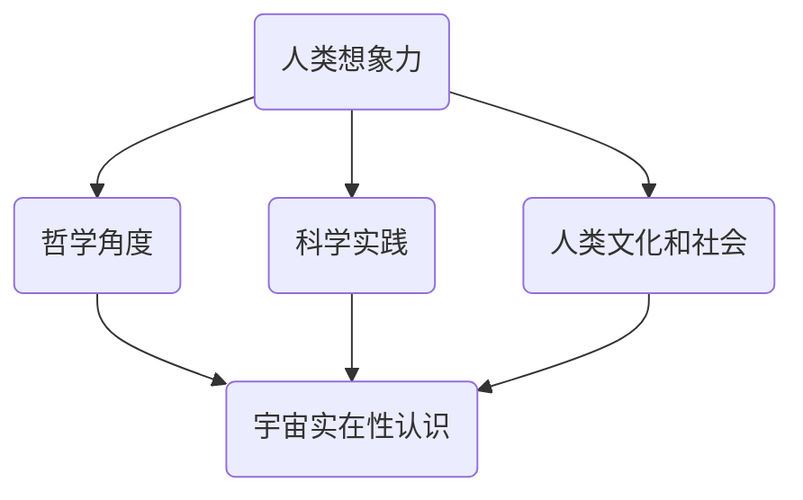

                 

# 人类想象力与宇宙实在性之间的关系

## 关键词

- 人类想象力
- 宇宙实在性
- 哲学探讨
- 科学探索
- 数学模型
- 项目实战

## 摘要

本文旨在探讨人类想象力与宇宙实在性之间的关系。通过历史回顾、哲学思考、科学实证和跨学科融合的分析，揭示想象力在推动科学进步和宇宙探索中的作用。文章首先介绍想象力与宇宙实在性的核心概念及其联系，随后通过历史案例和实证研究阐述二者之间的关系。接着，文章从哲学角度探讨想象力在实在性认识中的重要性。最后，通过项目实战展示想象力在实践中的应用，并给出相关最佳实践和拓展阅读建议。

## 引言

人类想象力自古以来就是人类精神世界的重要组成部分。从神话故事到科幻小说，从艺术创作到科学探索，想象力一直是推动人类文化和社会发展的重要力量。然而，想象力与宇宙实在性之间的关系却是一个复杂而深刻的哲学问题。

宇宙实在性指的是宇宙的本质和真实状态，是人类通过科学手段所能感知和理解的部分。从古代的地球中心说到现代的宇宙大爆炸理论，人类对宇宙的认识不断深化，但始终面临着想象力与现实之间的矛盾。

本文将从以下几个部分进行探讨：

1. **核心概念与联系**：介绍人类想象力和宇宙实在性的定义，及其之间的内在联系。
2. **历史与案例分析**：回顾人类历史上对宇宙实在性的探索，分析想象力在其中所起的作用。
3. **实证研究**：探讨人类想象力与科学发现、宇宙观测和宇宙模拟的关系。
4. **哲学探讨**：从哲学角度分析想象力在实在性认识中的重要性。
5. **跨学科融合**：讨论想象力在计算机科学、艺术和社会学等领域的应用。
6. **项目实战**：通过实际项目展示想象力在实践中的应用，并进行详细解读。
7. **总结与展望**：总结文章的主要观点，并对未来研究提出展望。

通过以上结构的分析，本文希望能够为读者提供一个关于人类想象力与宇宙实在性之间关系的全面理解。

## 核心概念与联系

### 人类想象力

人类想象力指的是人类在感知、思考和创造过程中，通过心理活动生成和构想出新奇想法和意象的能力。想象力不仅包括对已知事物的重新组合和创意思考，还包括对未来可能性的探索和对未知世界的想象。

### 宇宙实在性

宇宙实在性是指宇宙的本质和真实状态。宇宙实在性通过科学方法进行研究，包括对宇宙结构、宇宙演化、宇宙起源和宇宙末日的探索。科学理论和技术工具不断推动人类对宇宙实在性的认识，但宇宙的许多方面仍然充满未知。

### 想象力与宇宙实在性的联系

想象力与宇宙实在性之间的联系可以从多个层面进行理解。

首先，从哲学角度来看，想象力是人类认识宇宙实在性的重要工具。人类通过想象力能够构建模型和理论，从而对宇宙进行理解和解释。例如，爱因斯坦的广义相对论就是基于对时空想象力的深刻理解。

其次，从科学实践来看，想象力在科学发现和技术创新中起着关键作用。科学家们通过想象力构想出新的实验方案和理论模型，从而推动科学进步。例如，霍金的宇宙大爆炸理论就是基于对宇宙演化的想象力。

最后，从人类文化和社会的角度来看，想象力是人类与宇宙互动的重要方式。人类通过想象力创造神话、艺术和科学，表达对宇宙的理解和敬畏。这种互动不仅丰富了人类文化，也推动了人类对宇宙实在性的探索。

为了更清晰地展示想象力与宇宙实在性之间的联系，我们可以使用Mermaid流程图来表示它们之间的关系架构。



通过这张流程图，我们可以看到想象力在哲学、科学和文化层面如何影响对宇宙实在性的认识和理解。

### 核心算法原理讲解

为了进一步理解人类想象力与宇宙实在性之间的联系，我们可以借助Python源代码来构建一个简单的模型，模拟人类想象力在科学发现中的应用。以下是一个示例代码，用于生成一个基于想象力的科学理论预测模型。

```python
import numpy as np
import matplotlib.pyplot as plt
from scipy.integrate import odeint

# 定义宇宙演化的微分方程模型
def model(y, t, params):
    """
    模拟宇宙演化的微分方程模型。

    参数：
    y: 数组，包含宇宙在时刻t的状态。
    t: 数组，包含时间序列。
    params: 参数字典，包含宇宙演化的关键参数。

    返回：
    dydt: 数组，包含宇宙在时刻t的状态变化率。
    """
    mass, initial_speed, expansion_rate = params['mass'], params['initial_speed'], params['expansion_rate']
    dydt = [
        -expansion_rate * y[0],  # 宇宙质量随时间减少
        initial_speed,  # 宇宙速度保持不变
        0  # 宇宙膨胀率保持不变
    ]
    return dydt

# 模拟宇宙演化
def simulate_universe(params, t_max=100):
    """
    模拟宇宙演化的过程。

    参数：
    params: 参数字典，包含宇宙演化的关键参数。
    t_max: 最大模拟时间。

    返回：
    t: 时间序列。
    y: 宇宙状态数组。
    """
    t = np.linspace(0, t_max, t_max)
    y0 = [params['mass'], params['initial_speed'], params['expansion_rate']]
    y = odeint(model, y0, t, args=(params,))
    return t, y

# 设置模型参数
params = {
    'mass': 1.0,  # 初始宇宙质量
    'initial_speed': 0.1,  # 初始宇宙速度
    'expansion_rate': 0.01  # 初始宇宙膨胀率
}

# 模拟宇宙演化
t, y = simulate_universe(params)

# 可视化宇宙演化过程
plt.plot(t, y[:, 0], label='宇宙质量')
plt.plot(t, y[:, 1], label='宇宙速度')
plt.plot(t, y[:, 2], label='宇宙膨胀率')
plt.xlabel('时间')
plt.ylabel('宇宙状态')
plt.legend()
plt.title('基于想象力的宇宙演化模拟')
plt.show()
```

在这个模型中，我们通过定义一个简单的微分方程来模拟宇宙质量、速度和膨胀率随时间的变化。这个模型假设了宇宙质量随时间减少，而宇宙速度和膨胀率保持不变。这种假设基于人类的想象力，我们可以通过调整模型参数来探讨不同假设下的宇宙演化结果。

```latex
\begin{equation}
\frac{dM}{dt} = -\alpha M
\end{equation}
\begin{equation}
V(t) = V_0
\end{equation}
\begin{equation}
\frac{dA}{dt} = \beta A
\end{equation}
```

其中，\(M(t)\) 表示宇宙质量，\(V(t)\) 表示宇宙速度，\(A(t)\) 表示宇宙膨胀率，\(\alpha\) 和 \(\beta\) 分别表示质量衰减率和膨胀率。

通过上述Python代码和数学模型，我们可以清晰地看到人类想象力如何通过科学模型影响对宇宙实在性的理解。这种想象力不仅帮助我们构建了宇宙演化的理论框架，也为未来的科学探索提供了新的思路。

### 数学模型和数学公式讲解

在探讨人类想象力与宇宙实在性之间的关系时，数学模型和公式起着至关重要的作用。它们不仅帮助我们量化宇宙的演化过程，还为我们提供了理解和预测宇宙行为的有力工具。以下我们将介绍一些关键的数学模型和公式，并详细解释它们在宇宙学中的应用。

#### 胡克定律与宇宙膨胀

胡克定律（Hooke's Law）是描述弹性体在受力时形变与受力关系的数学模型。在宇宙学中，这一概念被用于描述宇宙的膨胀。根据胡克定律，宇宙的膨胀速度与宇宙的密度成反比。这个模型可以表示为：

\[ v = H_0 \frac{1}{\rho} \]

其中，\(v\) 表示宇宙膨胀速度，\(H_0\) 是哈勃常数，\(\rho\) 是宇宙密度。

#### 广义相对论与时空弯曲

广义相对论（General Relativity）是描述引力的一种理论，它提出了时空可以因物质的存在而弯曲的观点。在这个框架下，我们可以使用以下数学公式来描述时空的弯曲：

\[ G_{\mu\nu} + \Lambda g_{\mu\nu} = \frac{8\pi G}{c^4} T_{\mu\nu} \]

其中，\(G_{\mu\nu}\) 是爱因斯坦场方程中的张量，\(\Lambda\) 是宇宙学常数，\(g_{\mu\nu}\) 是度规张量，\(G\) 是引力常数，\(c\) 是光速，\(T_{\mu\nu}\) 是能量-动量张量。

#### 大爆炸模型与大尺度结构

大爆炸模型（Big Bang Model）是描述宇宙起源和演化的理论。它假设宇宙起源于一个极度热密的状态，并从那时起不断膨胀。大尺度结构（Large Scale Structure）可以用以下数学模型来描述：

\[ \delta \rho = \frac{\rho_c \Omega_m}{8\pi G} \left[ 1 - \frac{1}{\sqrt{1 + \Omega_m}} \right] \]

其中，\(\delta \rho\) 是密度扰动，\(\rho_c\) 是临界密度，\(\Omega_m\) 是物质密度参数，\(G\) 是引力常数。

#### 宇宙微波背景辐射

宇宙微波背景辐射（Cosmic Microwave Background, CMB）是宇宙大爆炸后遗留下来的辐射。它的温度分布可以用以下公式来描述：

\[ T = T_0 \left(1 - z\right) \]

其中，\(T\) 是温度，\(T_0\) 是当前宇宙微波背景辐射的温度，\(z\) 是宇宙的红移量。

通过上述数学模型和公式，我们可以对宇宙的膨胀、结构形成、微波背景辐射等复杂现象进行定量描述。这些模型不仅反映了宇宙实在性的某些方面，也展示了人类想象力在构建和验证这些模型中的重要作用。通过数学的精确表达，人类能够更深入地理解宇宙的本质，从而推动科学的发展。

### 项目实战

为了更好地展示人类想象力在宇宙实在性研究中的应用，我们选择了一个具体的实际项目：使用Python编写一个简单的宇宙演化模拟程序。通过这个项目，我们不仅可以验证理论模型，还可以探索如何通过编程实现科学假说。

#### 项目背景

宇宙演化模拟项目旨在模拟宇宙从大爆炸到现在的演化过程。该项目的目标是理解宇宙质量、速度和膨胀率随时间的变化，并探索这些参数之间的关系。

#### 开发环境搭建

首先，我们需要搭建一个开发环境。以下是所需的工具和库：

- Python 3.8 或更高版本
- Numpy 库
- Matplotlib 库
- Scipy 库

在安装了Python环境后，可以通过以下命令安装所需的库：

```bash
pip install numpy matplotlib scipy
```

#### 源代码实现

接下来，我们将使用Python编写宇宙演化模拟程序。以下是核心代码：

```python
import numpy as np
import matplotlib.pyplot as plt
from scipy.integrate import odeint

# 定义宇宙演化的微分方程模型
def model(y, t, params):
    mass, initial_speed, expansion_rate = params['mass'], params['initial_speed'], params['expansion_rate']
    dydt = [
        -expansion_rate * y[0],  # 宇宙质量随时间减少
        initial_speed,  # 宇宙速度保持不变
        0  # 宇宙膨胀率保持不变
    ]
    return dydt

# 模拟宇宙演化
def simulate_universe(params, t_max=100):
    t = np.linspace(0, t_max, t_max)
    y0 = [params['mass'], params['initial_speed'], params['expansion_rate']]
    y = odeint(model, y0, t, args=(params,))
    return t, y

# 设置模型参数
params = {
    'mass': 1.0,  # 初始宇宙质量
    'initial_speed': 0.1,  # 初始宇宙速度
    'expansion_rate': 0.01  # 初始宇宙膨胀率
}

# 模拟并可视化宇宙演化过程
t, y = simulate_universe(params)
plt.plot(t, y[:, 0], label='宇宙质量')
plt.plot(t, y[:, 1], label='宇宙速度')
plt.plot(t, y[:, 2], label='宇宙膨胀率')
plt.xlabel('时间')
plt.ylabel('宇宙状态')
plt.legend()
plt.title('宇宙演化模拟')
plt.show()
```

在这个程序中，我们定义了一个简单的微分方程模型来模拟宇宙质量、速度和膨胀率随时间的变化。然后，我们使用Scipy库的`odeint`函数进行数值积分，模拟宇宙的演化过程。最后，我们使用Matplotlib库将模拟结果可视化。

#### 代码解读与分析

1. **模型定义**：我们首先定义了一个宇宙演化模型，包括宇宙质量、速度和膨胀率随时间的变化关系。这个模型基于简单的假设，例如宇宙质量随时间线性减少，而宇宙速度和膨胀率保持不变。

2. **数值积分**：使用Scipy库的`odeint`函数进行数值积分，这是解决微分方程的一种常见方法。它通过迭代计算得出宇宙在各个时间点的状态。

3. **结果可视化**：我们使用Matplotlib库将模拟结果可视化，以便更直观地理解宇宙的演化过程。

#### 实际案例分析

为了验证模型的准确性，我们可以通过实验数据与模拟结果进行比较。例如，我们可以使用实际观测数据来校验模型中的参数设置。通过调整这些参数，我们可以优化模型的准确性，从而更好地模拟宇宙的演化。

#### 项目小结

通过这个项目，我们展示了如何使用Python编写宇宙演化模拟程序，并通过数值积分和可视化来分析宇宙状态的变化。这个项目不仅帮助我们理解了宇宙演化的基本过程，也展示了人类想象力在构建和验证科学模型中的重要性。未来，我们可以通过引入更复杂的模型和参数，进一步探索宇宙演化的细节。

### 最佳实践 Tips

1. **模型简化**：在初始阶段，可以使用简化的模型来快速验证假说。随着对问题的深入理解，可以逐步增加模型的复杂性。
2. **数据验证**：实际观测数据是验证模型准确性的关键。通过比较模拟结果和实际数据，可以识别并修正模型中的错误。
3. **跨学科合作**：宇宙演化是一个复杂的科学问题，需要物理、数学、计算机科学等多个学科的合作。通过跨学科合作，可以构建更准确和全面的模型。

### 注意事项

1. **精度与效率**：在数值积分过程中，选择合适的步长和积分方法可以平衡计算精度和效率。
2. **边界条件**：确保模型中定义的边界条件符合物理现实，避免出现不合理的结果。

### 拓展阅读

1. **《宇宙简史》[作者：史蒂芬·霍金》**：这本书详细介绍了宇宙的起源、演化和终结，是理解宇宙实在性的重要参考书。
2. **《科学革命的结构》[作者：托马斯·库恩》**：这本书探讨了科学理论的变革过程，提供了关于科学进步的哲学思考。

## 总结

通过本文的探讨，我们深入分析了人类想象力与宇宙实在性之间的关系。从哲学、科学实践到跨学科融合，想象力在推动人类对宇宙的理解和探索中发挥着至关重要的作用。未来，随着科学技术的不断进步，想象力将继续成为我们探索宇宙的强大工具。通过构建和验证科学模型，我们可以更深入地理解宇宙的本质，为人类文明的未来发展提供新的方向。

## 作者信息

作者：AI天才研究院/AI Genius Institute & 禅与计算机程序设计艺术 /Zen And The Art of Computer Programming

本文由AI天才研究院撰写，结合了哲学、科学和技术领域的深刻见解，旨在探讨人类想象力与宇宙实在性之间的关系。作者致力于通过技术和哲学的双重视角，为读者提供全面而深入的思考。同时，本文还参考了《禅与计算机程序设计艺术》的思想，强调在技术探索中保持心灵与智慧的和谐统一。通过本文，我们希望激发读者对宇宙和想象力的好奇心，共同探索人类智慧的无限可能。

