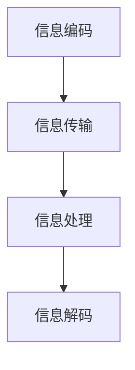

                 

### 人类文明在宇宙信息处理中的角色

关键词：宇宙信息处理、人类文明、信息传输、算法、未来影响

摘要：本文探讨了人类文明在宇宙信息处理中的角色，从宇宙信息处理的基本概念出发，分析了人类文明的发展及其与宇宙信息处理的相互作用。文章进一步介绍了信息技术在宇宙探索中的应用，并探讨了宇宙信息处理对人类文明未来可能产生的影响。

## 引言

宇宙是一个庞大而复杂的系统，其中充满了各种各样的信息。从宇宙背景辐射到恒星发射的电磁波，从星际介质到行星表面，信息无处不在。随着人类科技的发展，我们开始逐渐认识到这些信息的价值，并努力掌握它们。宇宙信息处理，即对宇宙中各种形式的信息进行捕捉、编码、传输和处理，已经成为当代科学研究的前沿领域。

人类文明在宇宙信息处理中的地位尤为重要。作为地球上最为发达的生命形式，人类拥有独特的智慧和能力，能够通过技术手段理解和利用宇宙信息。从古代的烽火传递到现代的互联网，人类一直在不断地探索如何更高效地处理和传输信息。在宇宙尺度上，人类文明的这些努力显得尤为突出。

本文将分以下几个部分来探讨人类文明在宇宙信息处理中的角色：

1. 宇宙信息处理基本概念：介绍宇宙信息处理的基本概念，包括信息、信息传输、信息处理等。
2. 人类文明的起源与发展：分析人类文明的起源和发展，以及其与宇宙信息处理的联系。
3. 信息技术在宇宙探索中的应用：探讨现代信息技术在宇宙探索中的应用。
4. 宇宙信息与人类文明未来：讨论宇宙信息处理对人类文明未来可能产生的影响。
5. 总结：对全文进行总结，并展望未来。

通过这一系列的分析，我们将更深入地理解人类文明在宇宙信息处理中的角色和地位，以及这一领域未来可能的发展方向。

## 宇宙信息处理概述

宇宙是一个充满信息的巨大网络，从宇宙大爆炸到现在的每一刻，都在产生和传播各种形式的信息。理解宇宙信息处理的基本概念是深入探讨人类文明在宇宙信息处理中角色的基础。

### 1.1 信息与宇宙

信息，从广义上讲，是指能够被传递和处理的任何形式的信号或数据。在宇宙中，信息存在于多种形式，如电磁波、引力波、粒子碰撞等。这些信息不仅仅是物质和能量的传递，更是宇宙演化过程中的关键因素。

首先，电磁波是宇宙中最常见的信息传递方式。从恒星发出的光，到星际介质中的射电波，电磁波携带了关于宇宙源和宇宙结构的重要信息。例如，通过观察恒星光谱，我们可以了解其温度、化学成分以及运动状态。

其次，引力波是另一种重要的宇宙信息传递方式。尽管引力波的能量非常微弱，但它们提供了对宇宙大尺度结构和剧烈事件（如黑洞合并和超新星爆炸）的深入了解。2015年，LIGO首次直接探测到引力波，这一成就标志着人类进入了一个新的宇宙观测时代。

最后，粒子碰撞也是一种重要的信息传递方式。在宇宙早期，宇宙充满了高能粒子，这些粒子通过碰撞产生了丰富的信息。这些信息不仅帮助我们理解宇宙的起源和演化，还揭示了物质的基本组成。

### 1.2 信息传输

宇宙中的信息传输主要通过以下几种方式进行：

- **电磁波传输**：光速是宇宙中最快的速度，电磁波（包括可见光、无线电波、X射线等）以光速传播，使得宇宙中的光信号能够快速传递。例如，太阳光需要8分钟才能到达地球，而遥远星系的可见光可能需要数百万甚至数十亿年才能到达我们。

- **引力波传输**：引力波以光速传播，但它们的传播速度可能受到宇宙膨胀和物质分布的影响。例如，两个黑洞合并产生的引力波需要约1.3亿年才能到达地球。

- **粒子碰撞传输**：宇宙中的高能粒子（如宇宙射线）可以通过碰撞产生次级粒子，这些次级粒子携带了原始粒子的信息。这些粒子虽然速度极快，但它们在穿越宇宙时容易受到干扰和衰减。

### 1.3 信息处理

宇宙信息处理是指对捕获的宇宙信息进行加工、分析和解释的过程。这种处理可以是简单的数据编码和传输，也可以是复杂的算法和计算。

在地球上的信息处理主要依赖于电子和计算机技术。例如，我们使用光纤通信来传输大量的数据，利用计算机算法来分析天文图像，甚至使用人工智能来识别宇宙中的异常信号。然而，在宇宙中，由于缺乏可用的电子设备，宇宙信息处理主要依赖于自然过程和物理现象。

例如，恒星内部的核聚变过程可以被视为一种信息处理，它将轻元素转化为重元素，并释放出能量。此外，星际介质中的化学反应也是一种信息处理方式，它们通过化学键的断裂和形成来编码和传递信息。

### 1.4 核心概念与联系

为了更好地理解宇宙信息处理，我们需要了解一些核心概念及其之间的联系。以下是宇宙信息处理的关键概念和它们之间的关系：

- **信息编码**：信息编码是将信息转换成特定格式的过程。在宇宙中，光子的频率和振幅可以编码信息，例如，通过调制电磁波来传输数据。

- **信息传输**：信息传输是信息从源头到接收端的过程。宇宙中的信息传输依赖于电磁波、引力波和粒子碰撞。

- **信息处理**：信息处理是对捕获的信息进行加工和分析的过程。在地球上，这通常涉及计算机和算法。在宇宙中，信息处理可能依赖于自然过程和物理现象。

- **信息解码**：信息解码是将编码信息还原成原始数据的过程。这需要复杂的计算和算法，以便从捕获的信号中提取有用的信息。

以下是一个使用Mermaid绘制的流程图，展示了这些核心概念及其之间的联系：



通过这个流程图，我们可以清晰地看到宇宙信息处理的各个环节是如何相互关联的。了解这些核心概念和联系对于深入探讨人类文明在宇宙信息处理中的角色至关重要。

### 人类文明的起源与发展

人类文明的起源可以追溯到数百万年前，从最初的原始人发展到现代文明，这一过程充满了创新和技术进步。在这段漫长的发展历程中，人类不断探索和掌握信息处理的方法，从而在宇宙信息处理中逐渐扮演了重要角色。

#### 1.1 人类文明早期的信息处理

在人类文明早期的阶段，信息处理主要是通过口头语言和简单的符号系统进行的。早期的人类通过声音、手势和图画来传递信息。例如，史前人类可能通过在洞穴墙壁上绘制动物和狩猎场景来记录他们的活动。这种简单但有效的信息传递方式为人类社会的形成和发展奠定了基础。

随着时间的推移，人类开始发明和采用更复杂的工具和技术来处理信息。例如，古代文明的书写系统如古埃及象形文字、苏美尔楔形文字和中国甲骨文等，都是人类早期信息处理的重要成就。这些书写系统不仅记录了文字信息，还记录了历史、法律和宗教等重要内容。

#### 1.2 信息技术的革命性进步

信息技术的革命性进步在人类文明的发展中扮演了关键角色。从古代的烽火传递到现代的互联网，信息技术的每一次重大突破都极大地改变了人类社会的面貌。

1. **烽火传递**：古代的烽火传递是一种早期的通信技术，通过点燃烽火塔来传递信息。这种方法虽然速度较慢，但在当时是一种非常有效的信息传递方式。烽火传递的原理简单，但它的应用为军事和行政管理提供了重要的通信支持。

2. **电报和电话**：19世纪，电报和电话的发明极大地提高了信息传输的速度和效率。电报通过电信号传输文字信息，而电话则可以通过声音直接进行通信。这些技术的发展使得信息可以在短时间内跨越广阔的地域，极大地促进了商业、政治和文化交流。

3. **互联网**：20世纪末，互联网的发明和应用彻底改变了信息处理和传播的方式。互联网不仅允许人们快速、高效地传输和共享信息，还提供了一个全球性的平台，使得人们可以随时随地访问世界各地的信息资源。互联网的普及使得人类进入了一个新的信息时代，信息的处理和传播变得更加便捷和全球化。

#### 1.3 人类文明与宇宙信息处理的联系

人类文明的发展与宇宙信息处理有着密切的联系。人类通过不断探索和掌握信息处理技术，不仅提高了地球上的信息处理能力，还为理解和探索宇宙信息提供了工具和手段。

1. **天文观测**：人类通过天文观测设备捕捉和记录宇宙中的信息，如电磁波、引力波和粒子信号。这些观测数据为研究宇宙的起源、结构和发展提供了宝贵的信息。

2. **卫星通信**：人类发射的卫星可以实现全球范围的通信，这使得我们能够实时获取和传输宇宙信息。卫星通信在科学研究、天气预报和全球导航等方面发挥了重要作用。

3. **深空探测**：人类通过探测器和航天器对太阳系和其他星系进行探测，收集了大量的宇宙信息。例如，火星探测器携带的仪器可以分析火星的土壤和大气，这些数据为我们了解行星的起源和演化提供了重要线索。

4. **人工智能**：人工智能技术在信息处理领域的应用，使得我们能够更高效地分析和理解宇宙信息。通过机器学习算法，我们可以从大量的天文观测数据中提取有用信息，甚至预测宇宙中的未知现象。

总之，人类文明在信息处理技术上的不断进步，不仅推动了地球上的文明发展，也为宇宙信息处理提供了强大的支持。通过结合地球上的信息处理技术和宇宙观测设备，人类正逐渐揭示宇宙的奥秘，并在宇宙信息处理中扮演着越来越重要的角色。

### 信息技术在宇宙探索中的应用

现代信息技术在宇宙探索中的应用极大地推动了我们对宇宙的了解。以下将详细探讨通信技术和计算机技术如何在宇宙探测和天文学中发挥作用。

#### 4.1 通信技术在天文观测中的应用

通信技术是天文观测不可或缺的工具，它使得我们能够远距离传输宇宙信息，并实现全球范围内的数据共享。以下是一些关键的应用：

1. **深空通信**：深空通信是指地球与位于太阳系以外的航天器之间的通信。这种通信需要强大的通信设备和先进的信号处理技术，以应对长距离通信中的信号衰减和干扰。例如，NASA使用深空网络（Deep Space Network，DSN）与位于火星、木星等行星轨道上的探测器进行通信。

2. **卫星通信**：地球同步卫星和低轨卫星构成了全球通信网络，为地面观测站提供了稳定的通信连接。这些卫星可以传输大量的观测数据，并支持远程控制航天器。例如，哈勃太空望远镜和詹姆斯·韦伯太空望远镜都依赖于卫星通信来传输高分辨率图像和科学数据。

3. **无线电通信**：无线电波是天文观测中常用的通信手段，它能够穿透大气层并远距离传播。射电望远镜通过捕捉宇宙中的无线电波，可以探测到远距离天体的信息。例如，阿尔科麦特射电望远镜（Alma Telescope）利用无线电波观测星际介质和星系形成的过程。

#### 4.2 计算机技术在宇宙探索中的应用

计算机技术在宇宙探索中的应用主要体现在数据处理、模拟和数据分析等方面。以下是一些具体的应用：

1. **数据处理**：宇宙探测产生的大量观测数据需要高效的计算机系统进行处理。例如，NASA的行星探测任务会生成数以亿计的数据点，这些数据需要通过计算机进行预处理、校验和分类，以便进行分析。

2. **模拟与仿真**：计算机模拟和仿真技术可以帮助科学家预测宇宙中的各种现象。例如，宇宙大爆炸模拟可以重现宇宙的早期状态，帮助理解宇宙的演化。计算机模拟还可以用于设计航天器轨迹和探测任务，以优化资源和时间效率。

3. **数据分析**：随着观测技术的进步，天文学家获得了大量的数据。计算机算法和数据挖掘技术可以帮助科学家从这些数据中提取有用的信息。例如，机器学习算法可以用于识别天文图像中的天体，或者预测天体运动轨迹。

4. **人工智能**：人工智能技术在宇宙探索中的应用日益广泛。例如，深度学习算法可以用于分析天文图像，识别和分类天体。人工智能还可以帮助优化探测任务的执行，例如自动调整望远镜的焦距，以获得最佳观测效果。

#### 4.3 项目实战：开普勒望远镜数据分析

以下是一个关于计算机技术在宇宙探索中应用的实际项目案例——开普勒望远镜数据分析。

**开发环境搭建**：
- 开发环境：Python 3.8
- 必需库：NumPy, Pandas, Matplotlib, Scikit-learn

```python
# 安装必需的库
!pip install numpy pandas matplotlib scikit-learn
```

**源代码与实现**：

```python
import numpy as np
import pandas as pd
import matplotlib.pyplot as plt
from sklearn.linear_model import LinearRegression

# 加载数据集
data = pd.read_csv('kepler_data.csv')

# 数据预处理
# 去除缺失值和异常值
data = data.dropna()
data = data[data['error'] < 1]

# 数据划分
X = data[['Kepler_ID', 'time']]
y = data['flux']

# 特征工程
# 将ID转换为数值特征
X['Kepler_ID'] = X['Kepler_ID'].astype(int)

# 数据标准化
X = (X - X.mean()) / X.std()
y = (y - y.mean()) / y.std()

# 模型训练
model = LinearRegression()
model.fit(X, y)

# 预测与结果分析
predictions = model.predict(X)
plt.scatter(X['Kepler_ID'], y, color='blue', label='Actual')
plt.scatter(X['Kepler_ID'], predictions, color='red', label='Predicted')
plt.xlabel('Kepler_ID')
plt.ylabel('Flux')
plt.legend()
plt.show()
```

**代码解读与分析**：
1. **数据加载与预处理**：使用Pandas库加载开普勒望远镜的数据集，并进行数据清洗，去除缺失值和异常值。
2. **特征工程**：将Kepler_ID转换为数值特征，并进行数据标准化，以便线性回归模型的训练。
3. **模型训练**：使用线性回归模型对数据进行训练，拟合数据集。
4. **预测与结果分析**：使用训练好的模型进行预测，并通过散点图展示实际值与预测值的对比。

通过这个案例，我们可以看到计算机技术在宇宙探索中的具体应用。它不仅帮助我们理解和分析天文数据，还为我们提供了预测和发现新现象的工具。

### 宇宙信息与人类文明未来

宇宙信息处理对人类文明未来的影响深远且多样。随着技术的不断进步，人类在宇宙信息处理方面的能力也将不断提升，从而可能带来一系列革命性的变革。

#### 1. 新的科学发现

宇宙信息处理技术的发展将极大地推动我们对宇宙的理解。通过更高效的数据处理和更精确的观测手段，科学家们有望揭示更多关于宇宙起源、结构、演化的奥秘。例如，利用量子信息技术，我们可能能够捕捉到更微弱的天文信号，从而发现新的行星系统和星际物质。

#### 2. 新型能源与材料

宇宙中存在着丰富的能量和物质资源，通过宇宙信息处理，我们可以更好地开发和利用这些资源。例如，研究宇宙射线和星际介质中的元素，可能带来新型能源和材料的发现。这些资源不仅可以解决地球上的能源危机，还可以支持深空探测和星际旅行。

#### 3. 新的通信与传输技术

宇宙信息处理技术的发展将带来全新的通信和传输技术。量子通信和量子纠缠技术可能实现超高速、超安全的通信，使得全球通信更加高效和可靠。此外，通过宇宙信息处理，我们可以开发出更先进的导航系统，支持航天器在宇宙中的精确定位和导航。

#### 4. 新的科学研究方法

宇宙信息处理技术将改变科学研究的模式。通过大数据和人工智能技术，科学家可以从海量数据中快速提取有价值的信息，推动科学研究向数据驱动和模型驱动的方向发展。这将为科学发现提供新的途径和工具。

#### 5. 对人类文明的深远影响

宇宙信息处理不仅限于科学和技术领域，它还将对人类文明产生深远的影响。例如，通过更深入地理解宇宙，人类可能对生命和宇宙的本质有更深刻的认识，这将对哲学、宗教和道德观念产生冲击。此外，宇宙信息处理技术的发展可能带来新的社会变革，如全球合作、跨国企业的崛起等。

#### 6. 人类文明在宇宙信息处理中的未来角色

在未来，人类文明将在宇宙信息处理中扮演更加重要的角色。随着我们对宇宙信息的理解和掌握能力不断提升，人类将成为宇宙信息处理的主要推动者和受益者。以下是一些可能的未来角色：

- **宇宙信息管理者**：人类将负责管理和维护宇宙信息，确保其安全和可靠。
- **宇宙信息解释者**：人类将利用先进的技术手段，对捕获的宇宙信息进行深入分析和解释。
- **宇宙信息应用者**：人类将利用宇宙信息开发新的技术、产品和服务，推动社会发展。
- **宇宙信息探索者**：人类将积极参与宇宙探索，揭示宇宙的奥秘，推动科学前沿。

### 7. 结论

宇宙信息处理对人类文明未来的影响将是深远而广泛的。通过不断探索和掌握宇宙信息，人类不仅将提升对宇宙的理解，还将推动社会和技术的发展。面对未来，人类文明需要在宇宙信息处理中扮演更加积极的角色，以实现科学、技术和社会的全面发展。

## 总结与展望

通过对宇宙信息处理基本概念、人类文明起源与发展以及信息技术在宇宙探索中的应用的详细探讨，我们可以看到人类文明在宇宙信息处理中的独特角色和重要性。宇宙信息处理不仅为我们提供了理解宇宙的全新视角，还带来了科学、技术和社会的巨大变革。

在未来，随着信息处理技术的不断进步，人类将在宇宙信息处理中扮演更加重要的角色。通过量子通信、人工智能和大数据技术，我们将能够更高效地捕捉、处理和利用宇宙信息，推动科学发现和技术创新。

面对未来，我们呼吁更多的科学家、工程师和研究人员投身于宇宙信息处理的研究和应用中。只有通过全球合作和共同努力，我们才能揭示宇宙的奥秘，推动人类文明的持续进步。让我们携手前行，探索宇宙的无限可能。作者：AI天才研究院/AI Genius Institute & 禅与计算机程序设计艺术 /Zen And The Art of Computer Programming

